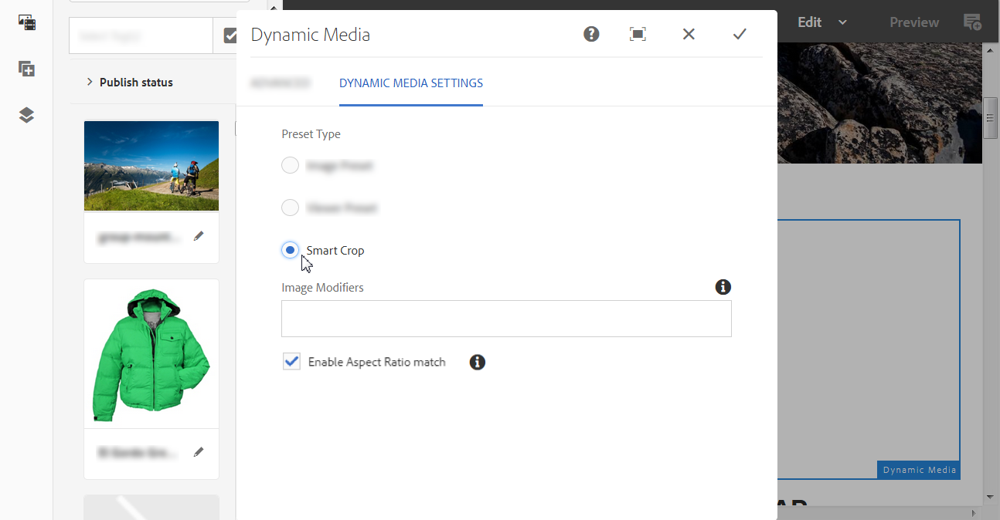

# 將Dynamic Media Assets新增至頁面{#adding-dynamic-media-assets-to-pages}

若要將動態媒體功能新增至您在網站上使用的資產，您可以直接在頁面上新增&#x200B;**動態媒體**、**互動媒體**、**全景媒體**&#x200B;或&#x200B;**Video 360 Media**&#x200B;元件。 您進入「版面」模式並啟用「動態媒體」元件。 然後，將這些元件新增至頁面，並新增資產至元件。 動態媒體元件是智慧型的——他們知道您是新增影像還是視訊，而可用的設定選項也會隨之變更。

如果您使用[!DNL Adobe Experience Manager]做為WCM，請直接將Dynamic Media資產新增至頁面。 如果您使用協力廠商來處理WCM，請連結 [或](/help/assets/dynamic-media/linking-urls-to-yourwebapplication.md) [內嵌資](/help/assets/dynamic-media/embed-code.md) 產。如需回應式協力廠商網站，請參閱[將最佳化的影像傳送至回應式網站](/help/assets/dynamic-media/responsive-site.md)。

>[!NOTE]
>
>在將資產新增至[!DNL Experience Manager]中的頁面之前，請務必先發佈資產。 請參閱[發佈Dynamic Media Assets](/help/assets/dynamic-media/publishing-dynamicmedia-assets.md)。

## 將動態媒體元件新增至頁面 {#adding-a-dynamic-media-component-to-a-page}

新增3D媒體、Dynamic Media、Interactive Media、Media Panoramic Media、Smart Crop Video或Video 360 Media元件至頁面，就像在任何頁面新增元件一樣。

**若要將Dynamic Media元件新增至頁面：**

1. 在[!DNL Experience Manager]中，開啟您要新增Dynamic Media元件的頁面。
1. 在左窗格中，選取&#x200B;**[!UICONTROL 元件]**&#x200B;圖示，然後篩選Dynamic Media。

   如果沒有動態媒體元件清單，您可能必須啟用要使用的Dynamic Media元件。 請參閱[啟用Dynamic Media元件](#enabling-dynamic-media-components)。

   

1. 將&#x200B;**[!UICONTROL Dynamic Media]**&#x200B;元件拖放到頁面上所需的位置。

1. 將指標直接停留在元件上。 當元件被藍色方塊包圍時，選取一次以顯示元件的工具列。 選取&#x200B;**[!UICONTROL 組態（扳手）]**&#x200B;圖示。

   

1. 視您放置在頁面上的Dynamic Media元件而定，設定對話方塊會開啟。 [視需要設定元件的選項](/help/assets/dynamic-media/adding-dynamic-media-assets-to-pages.md#dynamic-media-components)。

   下列範例顯示Dynamic Media **[!UICONTROL Video 360 Media]**&#x200B;元件對話方塊以及「檢視器預設集」下拉式清單中可用的選項。

   

   Dynamic Media 360視訊媒體元件。

1. 完成後，在對話方塊的右上角，選取核取記號以儲存變更。

### 啟用Dynamic Media元件 {#enabling-dynamic-media-components}

如果沒有動態媒體元件可新增至頁面，可能表示您必須啟用要使用的元件。

1. 在[!DNL Experience Manager]中，開啟您要新增Dynamic Media元件的頁面。
1. 在靠近頁面頂端的工具列左側，選取「頁面資訊」圖示，然後從下拉式清單中選取&#x200B;**[!UICONTROL 編輯範本]**。

   

1. 在靠近頁面頂端的工具列右側，從下拉式清單中選取&#x200B;**[!UICONTROL 結構]**。

   

1. 在頁面底部附近，選取&#x200B;**[!UICONTROL 配置容器]**&#x200B;以開啟其工具列，然後選取[原則]圖示。
1. 在&#x200B;**[!UICONTROL 配置容器]**&#x200B;頁面的&#x200B;**[!UICONTROL 屬性]**&#x200B;標題下，確定已選取&#x200B;**[!UICONTROL 允許的元件]**&#x200B;索引標籤。

   

1. 捲動直到您看到&#x200B;**[!UICONTROL 動態媒體]**&#x200B;為止。
1. 選取&#x200B;**[!UICONTROL Dynamic Media]**&#x200B;左側的>圖示，然後選取您要啟用的Dynamic Media元件。

   

1. 在&#x200B;**[!UICONTROL 配置容器]**&#x200B;頁面的右上角附近，選取「完成（核取記號）」圖示。

1. 在靠近頁面頂端的工具列右側，從下拉式清單中選取&#x200B;**[!UICONTROL 初始內容]**。
1. [照常將Dynamic Media元件新增至頁面](#adding-a-dynamic-media-component-to-a-page)。

## 將Dynamic Media元件本地化 {#localizing-dynamic-media-components}

您可以使用下列兩種方式之一將Dynamic Media元件當地語系化：

* 在「網站」的網頁中，開啟「屬 **[!UICONTROL 性]** 」並選 **[!UICONTROL 取「進階]** 」標籤。選擇所要的本地化語言。

  

* 從網站選擇器中，選取所需的頁面或頁面群組。 選取&#x200B;**[!UICONTROL 屬性]**&#x200B;並選取&#x200B;**[!UICONTROL 進階]**&#x200B;標籤。 選擇所要的本地化語言。

  >[!NOTE]
  >
  >並非所有&#x200B;**[!UICONTROL 語言]**&#x200B;功能表中可用的語言都有目前已指派的權杖。

## 可用的Dynamic Media元件 {#dynamic-media-components}

選取&#x200B;**[!UICONTROL 元件]**&#x200B;圖示，然後在&#x200B;**[!UICONTROL 動態媒體]**&#x200B;上篩選時，可以使用動態媒體元件。

可用的Dynamic Media元件包括：

* **[!UICONTROL 動態媒體]** -用於影像、視訊、eCatalog和回轉集等資產。
* **[!UICONTROL 互動式媒體]** — 用於任何互動式資產，例如互動式視訊、互動式影像或轉盤集。
* **[!UICONTROL 全景媒體]** — 用於全景影像或全景VR影像資產。
* **[!UICONTROL 360度影片媒體]** — 用於360度影片和360 VR影片資產。

>[!NOTE]
>
>預設不會提供這些元件，在使用之前，必須透過範本編輯器使其可用。 在範本編輯器中提供元件後，您可以將元件新增至您的頁面，就像新增任何其他[!DNL Experience Manager]元件一樣。

### 元件：Dynamic Media {#dynamic-media-component}

動態媒體元件是智慧型的。 無論您新增影像或視訊，都有各種選項。 元件支援影像預設集、影像型檢視器（例如影像集、迴轉集、混合媒體集及視訊）。 此外，檢視器會回應 — 熒幕大小會根據熒幕大小自動變更。 所有檢視器皆為HTML5檢視器。

>[!NOTE]
>
>如果您的網頁具有下列內容：
>
>* 相同頁面上使用了多個Dynamic Media元件例項。
>* 每個例項都使用相同的資產型別。
>
>不支援為該頁面上的每個Dynamic Media元件指派不同的檢視器預設集。
>
>不過，您可以在頁面內針對使用相同型別資產的所有動態媒體元件使用相同的檢視器預設集。

當您新增動態媒體元件，且&#x200B;**[!UICONTROL 動態媒體設定]**&#x200B;為空白或無法正確新增資產時，請檢查下列專案：

* 此影像具有金字塔tiff檔案。 在您啟用Dynamic Media之前匯入的影像沒有金字塔tiff檔案。

#### 使用影像時 {#when-working-with-images}

動態媒體元件可讓您新增動態影像，包括影像集、迴轉集及混合媒體集。 您可以放大、縮小旋轉集內的影像，或是從其他型別的旋轉集中選取影像（如果適用）。

您也可以直接在元件中設定檢視器預設集、影像預設集或影像格式。 若要讓影像回應，您可以設定中斷點或套用回應式影像預設集。

您可以選取元件中的&#x200B;**[!UICONTROL 編輯]**&#x200B;圖示，然後選取&#x200B;**[!UICONTROL 動態媒體設定]**，以編輯下列動態媒體設定。

>[!NOTE]
>
>依預設，動態媒體影像元件是可調式的。如果要使其成為固定大小，請在「高級」( **[!UICONTROL Advanced]** )頁籤的元件中使用「寬度」( **[!UICONTROL Width)和「高度」(Height]** )設定它 **&#x200B;**。

* **[!UICONTROL 檢視器預設集]** — 從下拉式清單中選取現有的檢視器預設集。 如果您要尋找的檢視器預設集未顯示，您必須讓它顯示。 請參閱管理檢視器預設集。 如果您使用影像預設集，則無法選取檢視器預設集，反之亦然。

  只有當您檢視影像集、迴轉集或混合媒體集時，才能使用此選項。 顯示的檢視器預設集也是智慧型相關檢視器預設集出現。

* **[!UICONTROL 檢視器修飾元]** — 檢視器修飾元採用name=value搭配&amp;分隔符號的形式，可讓您變更檢視器，如《檢視器參考指南》中所述。 檢視器修飾元的範例為`posterimage=img.jpg&caption=text.vtt,1`，它會為視訊縮圖設定不同的影像，並將隱藏式字幕檔案與視訊建立關聯。

* **[!UICONTROL 影像預設集]** — 從下拉式清單中選取現有的影像預設集。 如果您要尋找的影像預設集不可見，您必須讓它可見。 請參閱[管理影像預設集](/help/assets/dynamic-media/managing-image-presets.md)。 如果您使用影像預設集，則無法選取檢視器預設集，反之亦然。

  如果您要檢視影像集、迴轉集或混合媒體集，則此選項無法使用。

* **[!UICONTROL 影像修飾元]** — 您可以提供更多影像命令來套用影像效果。 這些命令在「影像預設集」和「影像伺服命令」參考中進行了說明。

  如果您要檢視影像集、迴轉集或混合媒體集，則此選項無法使用。

* **[!UICONTROL 中斷點]** — 如果您在回應式網站上使用此資產，則必須新增影像中斷點。 影像中斷點必須以逗號(，)分隔。 影像預設集中未定義高度或寬度時，此選項即會運作。

  如果您要檢視影像集、迴轉集或混合媒體集，則此選項無法使用。

  您可以在元件中選取&#x200B;**[!UICONTROL 編輯]**，以編輯下列進階設定。

* **[!UICONTROL 針對更高解析度的裝置最佳化]** — 選取（預設）核取方塊以允許DPR （裝置畫素比率）最佳化。

  **[!UICONTROL 針對更高解析度的裝置最佳化]**&#x200B;選項只有在下列為True時才會顯示：
   * 在預設集型別下，已選取&#x200B;**[!UICONTROL 影像預設集]**，並從&#x200B;**[!UICONTROL 影像預設集]**&#x200B;下拉式清單中選取&#x200B;**[!UICONTROL RESS_IP]**。

  影像預設集的

  另請參閱[關於裝置畫素比最佳化](/help/assets/dynamic-media/imaging-faq.md#dpr)。

  所有[!DNL Experience Manager]個Dynamic Media智慧型影像DPR值都會被忽略。

* **[!UICONTROL 標題]** — 變更影像的標題。

* **[!UICONTROL 替代文字]** — 為已關閉圖形的使用者新增影像標題。

  如果您要檢視影像集、迴轉集或混合媒體集，則此選項無法使用。

* **[!UICONTROL URL，在]**&#x200B;中開啟 — 您可以設定開啟連結的資產。 設定URL，並在的「開啟」中指定您要在相同視窗中開啟還是要在新視窗中開啟。

  如果您要檢視影像集、迴轉集或混合媒體集，則此選項無法使用。

* **[!UICONTROL 寬度]** — 如果您希望影像為固定大小，請輸入畫素值。 將此值保留為空白可讓資產適應環境。

* **[!UICONTROL 高度]** — 如果您希望影像為固定大小，請輸入畫素值。 將此值保留為空白可讓資產適應環境。

#### 使用視訊時 {#when-working-with-video}

使用動態媒體元件將動態視訊新增至您的網頁。 編輯元件時，您可以選擇使用預先定義的視訊檢視器預設集在頁面上播放視訊。

您可以在元件中選取&#x200B;**[!UICONTROL 編輯]**，以編輯下列Dynamic Media設定。

>[!NOTE]
>
>依預設，Dynamic Media視訊元件是自我調整的。 如果要使其成為固定大小，請在&#x200B;**[!UICONTROL 進階]**&#x200B;索引標籤中具有&#x200B;**[!UICONTROL 寬度]**&#x200B;和&#x200B;**[!UICONTROL 高度]**&#x200B;的元件中設定它。

* **[!UICONTROL 檢視器預設集]** — 從下拉式清單中選取現有的視訊檢視器預設集。 如果您要尋找的檢視器預設集未顯示，您必須讓它顯示。 請參閱管理檢視器預設集。

* **[!UICONTROL 檢視器修飾元]** — 檢視器修飾元採用`name=value`配對（含`&`分隔字元）的形式。 可讓您變更檢視器，如Adobe檢視器參考指南中所述。 檢視器修飾元的範例為`posterimage=img.jpg&caption=text.vtt,1`

  例如，您可以使用檢視器修飾元執行下列動作：

   * 將註解檔案與視訊建立關聯： [註解](https://experienceleague.adobe.com/docs/dynamic-media-developer-resources/library/viewers-aem-assets-dmc/video/command-reference-url-video/r-html5-video-viewer-url-caption.html)
   * 將導覽檔案與視訊建立關聯： [導覽](https://experienceleague.adobe.com/docs/dynamic-media-developer-resources/library/viewers-aem-assets-dmc/video/command-reference-url-video/r-html5-video-viewer-url-navigation.html)

     您可以在元件中選取&#x200B;**[!UICONTROL 編輯]**，以編輯下列進階設定。

* **[!UICONTROL 標題]** — 變更視訊標題。

* **[!UICONTROL 寬度]** — 如果您希望影像為固定大小，請輸入畫素值。 將此值保留為空白可讓資產適應環境。

* **[!UICONTROL 高度]** — 如果您希望影像為固定大小，請輸入畫素值。 將此值保留為空白可讓資產適應環境。

#### 使用智慧型裁切時 {#when-working-with-smart-crop}

使用Dynamic Media元件，將智慧型裁切影像資產新增至您的網頁。 編輯元件時，您可以選擇使用預先定義的視訊檢視器預設集在頁面上播放視訊。

請參閱[搭配Experience Manager Assets Dynamic Media使用智慧型裁切](https://experienceleague.adobe.com/docs/experience-manager-learn/assets/dynamic-media/images/smart-crop-feature-video-use.html)

另請參閱[影像設定檔](/help/assets/dynamic-media/image-profiles.md)。

您可以選取元件中的&#x200B;**[!UICONTROL 編輯]**，以編輯下列Dynamic Media設定。

>[!NOTE]
>
>依預設，動態媒體影像元件是可調式的。如果要使其成為固定大小，請在「高級」( **[!UICONTROL Advanced]** )頁籤的元件中使用「寬度」( **[!UICONTROL Width)和「高度」(Height]** )設定它 **&#x200B;**。

* **[!UICONTROL 影像修飾元]** — 您可以提供更多影像命令來套用影像效果。 這些命令在「影像預設集」和「影像伺服命令」參考中進行了說明。

  如果您要檢視影像集、迴轉集或混合媒體集，則此選項無法使用。

  您可以在元件中選取&#x200B;**[!UICONTROL 編輯]**，以編輯下列進階設定。

* **[!UICONTROL 啟用外觀比例比對]** — 若要讓Dynamic Media挑選外觀比例最符合原始影像外觀比例的智慧型裁切轉譯，請選取此選項。

* **[!UICONTROL 針對更高解析度的裝置最佳化]** — 選取（預設）核取方塊以允許DPR （裝置畫素比率）最佳化。

  **[!UICONTROL 針對更高解析度的裝置最佳化]**&#x200B;選項只有在下列為True時才會顯示：

   * 在預設集型別下，已選取&#x200B;**[!UICONTROL 智慧型裁切]**&#x200B;選項。

  智慧型裁切的

  另請參閱[關於裝置畫素比最佳化](/help/assets/dynamic-media/imaging-faq.md#dpr)。

  所有[!DNL Experience Manager]個Dynamic Media智慧型影像DPR值都會被忽略。

* **[!UICONTROL 標題]** — 變更智慧型裁切影像的標題。

* **[!UICONTROL 替代文字]** — 為已關閉圖形的使用者新增標題至智慧型裁切影像。

  如果您要檢視影像集、迴轉集或混合媒體集，則此選項無法使用。

* **[!UICONTROL URL，在]**&#x200B;中開啟 — 您可以設定開啟連結的資產。 設定URL，並在的「開啟」中指定您要在相同視窗中開啟還是要在新視窗中開啟。

  如果您要檢視影像集、迴轉集或混合媒體集，則此選項無法使用。

* **[!UICONTROL 寬度]** — 如果您希望影像為固定大小，請輸入畫素值。 將此值保留為空白可讓資產適應環境。

* **[!UICONTROL 高度]** — 如果您希望影像為固定大小，請輸入畫素值。 將此值保留為空白可讓資產適應環境。

### 元件：互動媒體 {#interactive-media-component}

互動媒體元件適用於具有互動性的資產，例如熱點或影像地圖。 如果您有互動式影像、互動式視訊或轉盤橫幅，請使用&#x200B;**[!UICONTROL 互動式媒體]**&#x200B;元件。

互動媒體元件是智慧型的。 無論您新增影像或視訊，都有各種選項。 此外，檢視器會回應 — 畫面大小會根據畫面大小自動變更。 所有檢視器皆為HTML5檢視器。

>[!NOTE]
>
>如果您的網頁具有下列內容：
>
>* 在相同頁面上使用的多個互動媒體元件例項。
>* 每個例項都使用相同的資產型別。
>
>不支援為該頁面上的每個互動媒體元件指派不同的檢視器預設集。
>
>不過，對於頁面內使用相同型別資產的所有互動媒體元件，您可以使用相同的檢視器預設集。

您可以選取元件中的&#x200B;**[!UICONTROL 編輯]**，以編輯下列&#x200B;**[!UICONTROL 一般]**&#x200B;設定。

* **[!UICONTROL 檢視器預設集]** — 從下拉式清單中選取現有的檢視器預設集。 如果您要尋找的檢視器預設集未顯示，您必須讓它顯示。 檢視器預設集必須先發佈，才能使用。 請參閱管理檢視器預設集。

* **[!UICONTROL 標題]** — 變更視訊標題。

* **[!UICONTROL 寬度]** — 如果您希望影像為固定大小，請輸入畫素值。 將此值保留為空白可讓資產適應環境。

* **[!UICONTROL 高度]** — 如果您希望影像為固定大小，請輸入畫素值。 將此值保留為空白可讓資產適應環境。

  您可以在元件中選取&#x200B;**[!UICONTROL 編輯]**，以編輯下列&#x200B;**[!UICONTROL 加入購物車]**&#x200B;設定。

* **[!UICONTROL 顯示產品資產]** — 預設會選取此值。 產品資產會顯示產品影像，如Commerce模組中所定義。 清除核取記號即可不顯示產品資產。

* **[!UICONTROL 顯示產品價格]** — 預設會選取此值。 產品價格會顯示Commerce模組中定義的專案價格。 清除核取記號即可不顯示產品價格。

* **[!UICONTROL 顯示產品表單]** — 預設不會選取此值。 產品表單包含任何產品變體，例如大小和顏色。 清除核取記號即可不顯示產品變體。

### 元件：全景媒體 {#panoramic-media-component}

全景媒體元件適用於是球面全景影像的資產。 這類影像可提供房間、屬性、位置或橫向的360度觀賞體驗。 若要讓影像符合球面全景的條件，它必須具備下列其中一項（或兩項）：

* 外觀比例為2:1。
* 以關鍵字`equirectangular`或(`spherical` + `panorama`)或(`spherical` + `panoramic`)標籤。 請參閱[使用標籤](/help/sites-cloud/authoring/sites-console/tags.md)。

外觀比例和關鍵字條件都適用於資產詳細資料頁面和全景媒體 **&#x200B;**&#x200B;WCM元件的全景資產。

>[!NOTE]
>
>如果您的網頁具有下列內容：
>
>* 正在相同頁面上使用&#x200B;**[!UICONTROL 全景媒體]**&#x200B;元件的多個執行個體。
>* 每個例項都使用相同的資產型別。
>
>不支援為該頁面上的每個&#x200B;**[!UICONTROL 全景媒體]**&#x200B;元件指派不同的檢視器預設集。
>
>不過，您可以對頁面內使用相同資產型別的所有「全景媒體」元件，使用相同的檢視器預設集。

您可以選取元件中的&#x200B;**[!UICONTROL 設定]**&#x200B;來編輯下列設定。

* **[!UICONTROL 檢視器預設集]** — 從「檢視器預設集」下拉式清單中選取現有的檢視器。

如果您尋找的檢視器預設集不可見，請檢查以確保其已發佈。 請先發佈檢視器預設集，然後再使用。 請參閱[管理檢視器預設集](/help/assets/dynamic-media/managing-viewer-presets.md)。

### 元件：360度影片媒體 {#video-media-component}

使用&#x200B;**[!UICONTROL Video 360 Media]**&#x200B;元件在網頁上轉譯等角視訊。 如此可確保對房間、財產、位置、景觀或醫療程式有沈浸式的視覺體驗。

在平面顯示器上播放期間，使用者可控制視角；行動裝置上的播放通常使用其內建的陀螺儀控制項。

檢視器包含原生支援，可傳送360個視訊資產。 依預設，檢視或播放時不需要額外的設定。 您可使用標準視訊副檔名（例如.mp4、.mkv和.mov）來傳送360視訊。 最常見的轉碼器是H.264。

您可以選取元件中的&#x200B;**[!UICONTROL 設定]**&#x200B;來編輯下列設定。

* **[!UICONTROL 檢視器預設集]** — 從「檢視器預設集」下拉式清單中選取現有的檢視器。 使用Video360VR的使用者若使用虛擬實境眼鏡，即可使用。 包含基本視訊播放控制項和社群媒體功能。 使用包含基本視訊播放控制項的Video360_social 。 視訊演算是在立體聲模式中完成。 手動檢視點控制已關閉，但陀螺儀控制已開啟。 沒有社群媒體功能。

如果您尋找的檢視器預設集不可見，請檢查以確保其已發佈。 請先發佈檢視器預設集，然後再使用。 請參閱[管理檢視器預設集](/help/assets/dynamic-media/managing-viewer-presets.md)。

### 使用HTTP/2傳遞Dynamic Media資產 {#using-http-to-delivery-dynamic-media-assets}

HTTP/2是新的、更新的Web通訊協定，可改善瀏覽器和伺服器的通訊方式。 它提供更快速的資訊傳輸，並減少所需的處理能力。 Dynamic Media資產的傳送現在可透過HTTP/2進行，以提供更理想的回應和載入時間。

請參閱[HTTP2內容傳送](/help/assets/dynamic-media/http2faq.md)，以取得有關透過您的Dynamic Media帳戶開始使用HTTP/2的完整詳細資料。

>[!MORELIKETHIS]
>
>* [在Experience Manager Dynamic Media中使用視訊播放器](https://experienceleague.adobe.com/docs/experience-manager-learn/assets/dynamic-media/video/dynamic-media-video-player-feature-video-use.html)
>* [搭配Experience Manager Dynamic Media使用互動式視訊](https://experienceleague.adobe.com/docs/experience-manager-learn/assets/dynamic-media/video/dynamic-media-interactive-video-feature-video-use.html)
>* [透過Experience Manager Dynamic Media瞭解資產檢視器](https://experienceleague.adobe.com/docs/experience-manager-learn/assets/dynamic-media/viewers/dynamic-media-viewer-feature-video-understand.html)
>* [搭配Experience Manager Dynamic Media使用自訂視訊縮圖](https://experienceleague.adobe.com/docs/experience-manager-learn/assets/dynamic-media/video/dynamic-media-video-thumbnails-feature-video-use.html)
>* [透過Experience Manager Dynamic Media瞭解色彩管理](https://experienceleague.adobe.com/docs/experience-manager-learn/assets/dynamic-media/images/dynamic-media-color-management-technical-video-setup.html#dynamic-media)
>* [搭配Experience Manager Dynamic Media使用影像銳利化](https://experienceleague.adobe.com/docs/experience-manager-learn/assets/dynamic-media/images/dynamic-media-image-sharpening-feature-video-use.html)
