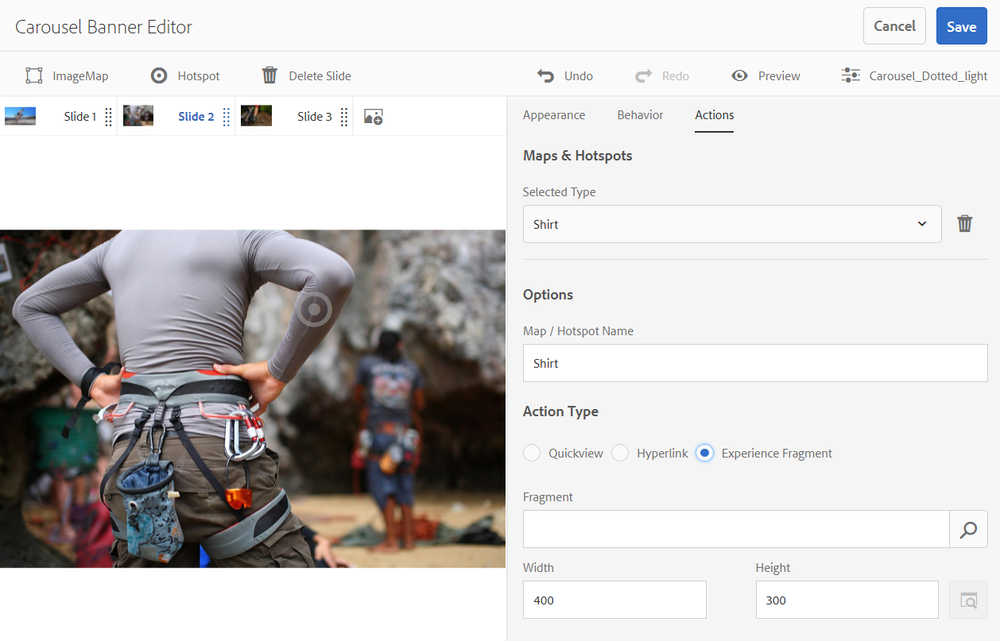

# 輪播橫幅{#carousel-banners}

轉盤橫幅可讓行銷人員輕鬆建立互動式旋轉促銷內容，並將其傳遞至任何畫面，借此促進轉換。

建立和修改促銷橫幅中特有的內容可能非常耗時，限制您快速發佈新內容或使其更具針對性的能力。 輪播橫幅可讓您快速建立或修改旋轉橫幅，並新增互動功能，例如連結至產品詳細資料或相關資源的熱點。 您可以將促銷內容傳遞至任何畫面，讓您更快將新促銷內容投放市場。

輪播橫幅由橫幅指定，單字為&#x200B;**[!UICONTROL CAROUSELSET]**:

在您的網站上，輪播橫幅可以如下所示：

您可以在此選取數字，以導覽影像。 此外，幻燈片會根據您可以自定義的時間間隔自動旋轉。 轉盤橫幅中的影像支援熱點和影像地圖。 用戶可以選擇或訪問超連結或訪問「快速查看」窗口。

在此示例中，用戶已選擇了影像映射並訪問了手套的Quickview窗口：

## 觀看輪播橫幅的建立方式 {#watch-how-carousel-banners-are-created}

觀看[如何建立輪播橫幅的逐步說明](https://s7d5.scene7.com/s7viewers/html5/VideoViewer.html?videoserverurl=https://s7d5.scene7.com/is/content/&amp;emailurl=https://s7d5.scene7.com/s7/emailFriend&amp;serverUrl=https://s7d5.scene7.com/is/image/&amp;config=Scene7SharedAssets/Universal_HTML5_Video_social&amp;contenturl=https://s7d5.scene7.com/skins/&amp;asset=S7tutorials/InteractiveCarouselBanner)(持續時間：10分33秒)。 您也可以了解如何預覽、編輯和傳送輪播橫幅。

>[!NOTE]
>
>必須將非管理使用者新增至&#x200B;**[!UICONTROL dam-users]**&#x200B;群組，才能建立或編輯轉盤橫幅。 如果您在建立或編輯時遇到問題，請咨詢系統管理員，該管理員可將您添加到&#x200B;**d[!UICONTROL am-users]**&#x200B;組。

## 快速入門：輪播橫幅 {#quick-start-carousel-banners}

快速啟動並運行：

1. [識別熱點和影像對應變數](#identifying-hotspot-and-image-map-variables) (僅適用於使用Adobe Experience Manager Assets + Dynamic Media的客戶)

   首先，識別現有快速檢視實作所使用的動態變數。 這麼做可協助您在Experience Manager資產中的輪播橫幅建立程式期間，正確輸入熱點和影像地圖資料。

<!-- LEAVE; COMMERCE BEING ADDED AGAIN IN THE FUTURE

   >[!NOTE]
   >
   >If you are an Experience Manager Sites or Ecommerce customer, you can use the built-in feature to navigate to product pages and lookup the existing skus in the product catalog. You do not need to manually enter hotspot or image map variables.
   >
   >
   >If you are an Experience ManagerAssets and Dynamic Media customer, you will manually enter data for hotspots and image maps, and then integrate the published URL or Embed code with your third-party content management system.

-->

1. 可選：視需 [要建立轉盤集檢視器預設](/help/assets/dynamic-media/managing-viewer-presets.md)。

   如果您是管理員，則可建立自己的轉盤檢視器預設集，以自訂轉盤的行為和外觀。 主要優點是，您可以對多個輪播重複使用此自訂檢視器預設集。 不過，使用者可選擇在編寫轉盤時直接自訂轉盤的行為和外觀。 當您想要指定輪播的特定設計時，最好使用此方法。

1. [上傳影像橫幅](#uploading-image-banners)。

   上傳您要製作互動式的影像橫幅。

1. [建立轉盤集](#creating-carousel-sets)。

   在輪播集中，用戶瀏覽橫幅影像，並選擇熱點或影像映射以訪問相關內容。

   若要在資產中建立轉盤集，請選取&#x200B;**[!UICONTROL 建立]**，然後選取&#x200B;**[!UICONTROL 轉盤集]**。 將資產添加到幻燈片，然後選擇&#x200B;**[!UICONTROL 保存]**。 您也可以直接在編輯器中編輯轉盤的外觀和行為。

1. [將熱點或影像映射添加到影像橫幅](#adding-hotspots-or-image-maps-to-an-image-banner)。

   將一個或多個熱點或影像映射添加到影像橫幅。 然後，將每個動作與連結、快速檢視或體驗片段等動作建立關聯。 添加熱點或影像映射後，通過發佈輪播集來完成此任務。 發佈會建立內嵌程式碼，供您複製並套用至網站登陸頁面。

   請參閱[（選用）預覽轉盤橫幅](#optional-previewing-carousel-banners) — 選用。 如有需要，您可以檢視輪播集的呈現，並測試其互動性。

1. [發佈輪播橫幅](#publishing-carousel-banners)。

   您發佈轉盤集的方式與發佈任何資產的方式相同。 在「資產」中，導覽至轉盤集並選取它，然後選取&#x200B;**[!UICONTROL Publish]**。 「發佈轉盤集」會啟用URL和內嵌字串。

1. 執行下列任一操作：

   * [將轉盤橫幅新增至您的](#adding-a-carousel-banner-to-your-website-page)網站頁面您可以新增已複製至網站頁面的轉盤橫幅URL或內嵌程式碼。

      * [將轉盤橫幅與現有的快速檢視整合](#integrating-the-carousel-banner-with-an-existing-quickview)。如果您使用協力廠商網頁內容管理系統，您必須將新的轉盤橫幅與網站上現有的快速檢視實施整合。
   * [以Experience Manager將轉盤橫幅新增至您的網站](/help/assets/dynamic-media/adding-dynamic-media-assets-to-pages.md)。如果您是Experience Manager網站客戶，可以使用互動式媒體元件，將轉盤集直接新增至頁面。

如果必須編輯轉盤集，請參閱[編輯轉盤集](#editing-carousel-sets)。 此外，您還可以查看和編輯[轉盤集屬性](/help/assets/manage-digital-assets.md#editing-properties)。

## 識別熱點和影像映射變數 {#identifying-hotspot-and-image-map-variables}

首先，識別現有快速檢視實作所使用的動態變數。 此方法可協助您在「Experience Manager資產」的轉盤集建立程式期間，正確輸入熱點或影像地圖資料。

將熱點或影像映射添加到橫幅影像時，您將分配SKU（庫存保存單位）。 您也可以指派選擇性的額外變數至每個熱點或影像地圖。 這些變數稍後用於匹配熱點或影像映射與快速視圖內容。

<!-- LEAVE; COMMERCE BEING ADDED LATER

>[!NOTE]
>
>If you are an Experience Manager Sites and/or Experience Manager Ecommerce customer, skip this step. You do not need to manually identify hotspot or image map variables; you can use the integration with Ecommerce for product integration. See information on [setting up eCommerce](/help/sites-cloud/administering/generic.md). In addition, you can use the Interactive component and add it to your web page.
>
>If you are an Experience Manager Assets or Media customer, you publish the URL or Embed code and then integrate with your third-party content management system and identify hotspots and image maps manually.

-->

請務必正確識別要與熱點或影像地圖資料建立關聯的變數數目和類型。 添加到橫幅影像的每個熱點或影像映射必須攜帶足夠的資訊，以在現有的後端系統中明確地標識產品。 同時，請確定每個熱點或影像地圖不包含超過必要的資料。 原因在於，這會使資料輸入程式過於複雜，且持續的熱點或影像地圖管理更容易出錯。

有不同的方式可識別要用於熱點或影像地圖資料的一組變數。

有時，與負責現有Quickview實施的IT專家協商就足夠了。 他們可能知道系統中用於標識快速視圖的最小資料集。 不過，您也可以簡單分析前端程式碼的現有行為。

大多數Quickview實施都使用下列範例：

* 使用者在網站上啟動使用者介面元素。例如，選擇&#x200B;**[!UICONTROL Quickview]**&#x200B;按鈕。
* 如有需要，網站會傳送Ajax要求至後端，以載入Quickview資料或內容。
* 快速檢視資料會轉譯為內容，以準備在網頁上轉譯。
* 最後，前端代碼在螢幕上直觀地呈現這樣的內容。

接著，方法是造訪實作「快速檢視」功能之現有網站的不同區域。 然後觸發Quickview並取得網頁所傳送的Ajax URL，以載入Quickview資料或內容。

通常您不需要使用任何專用的除錯工具。 現代網頁瀏覽器的功能是能夠勝任工作的網頁檢查員。 以下是一些Web瀏覽器的示例，其中包括Web檢查員：

* 若要在Google Chrome中查看所有傳出的HTTP請求，請按F12(Windows®)或Command-Option-I(Mac)以開啟「開發人員」工具面板。 選擇網路頁簽。
* 在Firefox中，您可以按F12(Windows®)或Command-Option-I(Mac)來啟動Firebug外掛程式。 使用其「網路」頁簽，或使用內置的檢查工具及其「網路」頁簽。

在瀏覽器中開啟網路監視時，觸發頁面上的快速檢視。

現在，在網路記錄中找出快速檢視的Ajax URL，並複製記錄的URL以供日後分析。 通常，當您觸發Quickview時，會有許多請求會傳送至伺服器。 Quickview Ajax URL通常是清單中第一個的URL。 它具有複雜的查詢字串部分或路徑，其響應MIME類型為`text/html`、`text/xml`或`text/javascript`。

在此程式中，請務必瀏覽網站的不同區域，包含不同的產品類別和類型。 原因在於快速檢視URL有指定網站類別的共同部分，但只有當您造訪網站的不同區域時才會變更。

在最簡單的情況下，Quickview URL中唯一的變數部分是產品SKU。 在此情況下，SKU值是您唯一需要將熱點或影像映射添加到橫幅影像的資料段。

但在複雜情況下，Quickview URL除了SKU外，還有不同的元素。 其中有些元素包括類別ID、顏色代碼、大小代碼等。 在這種情況下，每個元素都是熱點中的個別變數，或輪播橫幅功能中的影像地圖資料定義。

請考量下列Quickview URL範例及其產生的熱點或影像地圖變數：

<table>
 <tbody>
  <tr>
   <td>在查詢字串中找到的單一SKU。</td>
   <td>
錄制的快速查看URL包括：

    <ul>
     <li>
<code>https://server/json?productId=866558&amp;source=100</code>
 </li>
     <li>
<code>https://server/json?productId=1196184&amp;source=100</code>
 </li>
     <li>
<code>https://server/json?productId=1081492&amp;source=100</code>
 </li>
     <li>
<code>https://server/json?productId=1898294&amp;source=100</code>
 </li>
    </ul> 
URL中唯一的變數部分是<code>productId=</code>查詢字串參數的值，而這顯然是SKU值。 因此，熱點或影像映射只需要填入值(如 <code>866558,</code> <code>1196184,</code> <code>1081492,</code> <code>1898294.</code>
 </td>
  </tr>
  <tr>
   <td>單一SKU，可在URL路徑中找到。</td>
   <td>
錄制的Quickview URL包括：

    <ul>
     <li>
<code>https://server/product/6422350843</code>
 </li>
     <li>
<code>https://server/product/1607745002</code>
 </li>
     <li>
<code>https://server/product/0086724882</code>
 </li>
    </ul> 
變數部分位於路徑的最後一部分，它將成為熱點/影像映射的SKU值：<strong><code>6422350843</code>、<code>1607745002,</code> </strong><code>0086724882.</code>
 </td>
  </tr>
  <tr>
   <td>查詢字串中的SKU和類別ID。</td>
   <td>
錄制的快速查看URL包括：

    <ul>
     <li>
<code>https://server/quickView/product/?category=1100004&amp;prodId=305466</code>
 </li>
     <li>
<code>https://server/quickView/product/?category=1100004&amp;prodId=310181</code>
 </li>
     <li>
<code>https://server/quickView/product/?category=1740148&amp;prodId=308706</code>
 </li>
    </ul> 
在此情況下，URL中會有兩個不同的部分。 SKU儲存在<code>prodId</code>參數中，而類別ID儲存在<code>category=</code>參數中。
 
因此，熱點/影像地圖定義是配對。 即SKU值和稱為<code>categoryId</code>的額外變數。 產生的配對如下：

    <ul>
     <li>
SKU為<strong><code>305466</code></strong>，而<code>categoryId</code>為<code>1100004</code>。
 </li>
     <li>
SKU為<strong><code>310181</code></strong>，而<code>categoryId</code>為<strong><code>1100004</code></strong>。
 </li>
     <li>
SKU為<strong><code>308706</code></strong>，而<code>categoryId</code>為<strong><code>1740148</code></strong>。
 </li>
    </ul> </td>
  </tr>
 </tbody>
</table>

## 上傳影像橫幅 {#uploading-image-banners}

如果您已上傳要使用的影像，請前往下一個步驟[建立轉盤集](#creating-carousel-sets)。 啟用Dynamic Media後，必須上傳輪播中使用的影像。

若要上傳影像橫幅，請參閱[上傳資產](/help/assets/manage-digital-assets.md)。

## 建立轉盤集 {#creating-carousel-sets}

>[!NOTE]
>
>必須將非管理使用者新增至&#x200B;**[!UICONTROL dam-users]**&#x200B;群組，才能建立或編輯轉盤橫幅。 如果您在建立或編輯時遇到問題，請洽詢可將您新增至&#x200B;**[!UICONTROL dam-users]**&#x200B;群組的系統管理員。

**若要建立轉盤集：**

1. 在「資產」中，導覽至您要建立轉盤集的資料夾，然後前往&#x200B;**[!UICONTROL 建立>轉盤集]**。
1. 在「轉盤橫幅編輯器」頁面上，選取「**[!UICONTROL 點選」以開啟「資產選取器」]**，以選取第一張投影片的影像。

   在「轉盤橫幅編輯器」頁面上，執行下列其中一項操作：

   * 在頁面的左上角附近，選擇「添加幻燈片」**[!UICONTROL 表徵圖。]**

   * 在頁面中間附近，選取「**[!UICONTROL 點選以開啟資產選取器]**」。
   選取以選取您要納入轉盤集的資產。 選取的資產上面有核取標籤圖示。 完成後，在頁面右上角附近，選擇&#x200B;**[!UICONTROL Select]**。

   使用「資產選擇器」，您可以輸入關鍵字並選取&#x200B;**[!UICONTROL Return]**&#x200B;來搜尋資產。 您也可以套用篩選條件來調整搜尋結果。您可以依路徑、系列、檔案類型和標籤來篩選。選取篩選，然後選取工具列中的&#x200B;**[!UICONTROL 篩選]**&#x200B;圖示。 通過選擇「查看」表徵圖並選擇&#x200B;**[!UICONTROL 列視圖]**、**[!UICONTROL 卡片視圖]**&#x200B;或&#x200B;**[!UICONTROL 清單視圖]**&#x200B;來更改視圖。

   如需詳細資訊，請參閱[使用選取器](/help/assets/dynamic-media/working-with-selectors.md) 。

1. 繼續新增投影片，直到新增您要在轉盤集中旋轉的所有影像為止。
1. （選用）執行下列任一操作：

   * 如有必要，請拖曳幻燈片以重新排序清單中的影像。
   * 要刪除影像，請選擇該影像，然後選擇工具欄中的&#x200B;**[!UICONTROL 刪除幻燈片]**。

   * 若要套用預設集，在頁面右上角附近，選取預設集下拉式清單，然後選取要一次套用至該集的預設集。
   要刪除幻燈片，請選取該幻燈片。 在工具欄上，選擇工具欄上的&#x200B;**[!UICONTROL 刪除幻燈片]**。 要移動幻燈片，請選取重新排序表徵圖並移動到所需位置。

1. 在幻燈片中添加影像後，可以將熱點、影像映射或兩者添加到影像中。 請參閱[將熱點或影像映射添加到影像橫幅](#adding-hotspots-or-image-maps-to-an-image-banner)。
1. 您可以變更轉盤集的視覺設計和行為。 如果您想要調整輪播橫幅的顯示方式或特定元件的行為，請選取&#x200B;**[!UICONTROL Behavior]**&#x200B;和&#x200B;**[!UICONTROL Appearance]**&#x200B;標籤。 如需如何使用檢視器編輯器的詳細資訊，請參閱[管理檢視器預設集](/help/assets/dynamic-media/viewer-presets.md) 。

   >[!NOTE]
   >
   >對於輪播橫幅，您可以調整下列項目：
   >
   >* 影像顯示的持續時間。 依預設，每個影像會顯示9秒。
   >* 動畫. 依預設，每個投影片轉變都會淡出。 您可以將其變更為滑動轉變。
   >* 按鈕的樣式。 使用者可以選取每個點或數字，以透過橫幅旋轉。 您可以更改設定指示符按鈕的顯示位置（以及它們是數字或點狀樣式）及其大小。
   >* 更改影像映射的突出顯示樣式或用於熱點的表徵圖。
   >* 編輯檢視器預設集之前，請選取要作為預設集基礎的樣式。 如果您沒有選擇樣式，當您開始編輯檢視器預設集時，如果您變更為其他預設集，所有變更都會遺失。

   您也可以預覽轉盤橫幅的外觀。 請參閱[（選用）預覽轉盤橫幅](#optional-previewing-carousel-banners)。

1. 完成後，選擇&#x200B;**[!UICONTROL Save]**。

## 將熱點或影像映射添加到影像橫幅 {#adding-hotspots-or-image-maps-to-an-image-banner}

您可以使用轉盤集編輯器將熱點或影像地圖新增至橫幅。

添加熱點或影像映射時，可以將熱點定義為快速視圖彈出式顯示、超連結或體驗片段。

請參閱[體驗片段](/help/sites-cloud/authoring/fundamentals/experience-fragments.md)。

>[!NOTE]
>
>將檢視器內嵌在體驗片段時，不支援「輪播橫幅」中的社交媒體共用工具。
>
>若要解決此問題，您可以使用或建立沒有社交媒體共用工具的檢視器預設集。 這類檢視器預設集可讓您成功將其內嵌在體驗片段中。

將熱點或影像映射添加到影像時，請記住保存您的工作。 目前建立/編輯工作階段期間，支援在頁面右上角附近還原和重做選項。

當您完成轉盤橫幅的建立時，您可以選擇使用「預覽」來查看向客戶呈現的轉盤橫幅。

請參閱[（選用）預覽轉盤橫幅](#optional-previewing-carousel-banners)。

>[!NOTE]
>
>將熱點添加到影像橫幅時，熱點資訊儲存在相對於影像位置的相同元資料位置。 無論是互動式影像或輪播橫幅，此點都為true。 此功能表示您可以在任一檢視器中輕鬆重複使用相同的影像（及其定義的熱點資料）。
但請注意，轉盤橫幅支援影像上的影像地圖，這些影像中也可能包含熱點；互動式影像則否。 如果您要建立使用相同影像的互動式影像或轉盤橫幅，請記住此秘訣。 請考慮使用相同影像的個別副本來建立互動式影像和轉盤橫幅。

>[!NOTE]
如果您正在使用熱點編輯互動式影像並裁切影像，則會刪除熱點。

<!-- See also [Adding Image Maps](/help/assets/image-maps.md). -->

**要將熱點或影像映射添加到影像橫幅：**

1. 從「資產」，導覽至您要進行互動式的轉盤集。
1. 選擇輪播集，然後選擇&#x200B;**[!UICONTROL Edit]**。 轉盤檢視器編輯器隨即開啟。
1. 選取您要進行互動式的投影片。
1. 在頁面的左上角附近，選擇&#x200B;**[!UICONTROL 熱點]**&#x200B;或&#x200B;**[!UICONTROL 影像映射]**。
1. 執行下列任一操作：

   * 對於熱點：在影像上，選取要熱點出現的位置。
   * 對於影像映射：在影像上，從左上角拖曳至右下角以建立影像地圖區域。 通過拖動角，可以調整影像映射的大小。

   如有必要，請將熱點或影像映射拖動到新位置。 或者，使用鍵盤箭頭鍵控制所選熱點的位置。 根據需要添加更多熱點或影像映射。

   要刪除熱點或影像映射，請選擇&#x200B;**[!UICONTROL Actions]**&#x200B;頁簽。 在&#x200B;**[!UICONTROL 映射和熱點]**&#x200B;標題下，從&#x200B;**[!UICONTROL 選定類型]**&#x200B;下拉清單中，選擇要刪除的熱點或影像映射的名稱。 選取功能表旁的&#x200B;**[!UICONTROL 垃圾桶]**&#x200B;圖示，然後選取&#x200B;**[!UICONTROL Delete]**。

1. 在「名稱」文本欄位中，鍵入熱點或影像映射的名稱。 此名稱也會出現在&#x200B;**[!UICONTROL 地圖與熱點]**&#x200B;下拉式清單中。 如果您決定在未來變更熱點或影像地圖，提供名稱可讓您輕鬆識別熱點或影像地圖。
1. 在&#x200B;**[!UICONTROL Actions]**&#x200B;標籤中執行下列任一操作：

   * 選擇&#x200B;**[!UICONTROL Quickview]**。

      * 如果您是Experience Manager網站<!-- and Ecommerce-->客戶，請選取產品選擇器圖示（放大鏡）以開啟「選取產品」頁面。 若要返回轉盤橫幅編輯器，請選取您要使用的產品，然後選取頁面右上角的核取記號。
      * 如果您不是Experience Manager站點<!-- or Ecommerce -->客戶：

         * 定義變數。 請參閱[識別熱點變數](#identifying-hotspot-and-image-map-variables)。
         * 然後，手動輸入SKU值。 在「SKU值」文字欄位中，輸入產品的SKU（庫存保存單位），這是您提供之每個不同產品或服務的唯一識別碼。 輸入的SKU值會自動填入「快速檢視」範本的變數部分。 系統現在知道將所選熱點與特定SKU的快速視圖相關聯。
         * （可選）如果「快速」視圖中存在您必須用於進一步標識產品的其他變數，請選擇&#x200B;**[!UICONTROL 添加通用變數]**。 在文字欄位中，指定額外的變數。 例如， category=Mens是新增的變數。

         * 如需詳細資訊，請參閱[使用選取器](/help/assets/dynamic-media/working-with-selectors.md) 。
   * 選擇&#x200B;**[!UICONTROL 超連結]**。

      * 如果您是Experience Manager網站客戶，請選取網站選取器圖示（資料夾）以導覽至URL。

         >[!NOTE]
         如果您的互動式內容有連結與相對URL，尤其是連結至Experience Manager網站頁面的連結，則無法使用以URL為基礎的連結方法。

      * 如果您是獨立客戶，請在href文字欄位中，指定連結網頁的完整URL路徑。

   請務必指定要在新的瀏覽器標籤（建議的預設值）或相同的標籤中開啟連結。

   如需詳細資訊，請參閱[使用選取器](/help/assets/dynamic-media/working-with-selectors.md) 。

   * 選取&#x200B;**[!UICONTROL 體驗片段]**。

      * 如果您是Experience Manager網站客戶，請選取「搜尋」圖示（放大鏡）以開啟「體驗片段」頁面。 若要返回「熱點」管理頁面，請選取您要使用的體驗片段，然後在頁面的右上角，選取&#x200B;**[!UICONTROL 選取]**。
請參閱[體驗片段](/help/sites-cloud/authoring/fundamentals/experience-fragments.md)。

      * 指定在橫幅上顯示的體驗片段寬度和高度。

         >[!NOTE]
         將檢視器內嵌在體驗片段時，不支援「輪播橫幅」中的社交媒體共用工具。
         若要解決此問題，您可以使用或建立沒有社交媒體共用工具的檢視器預設集。 這類檢視器預設集可讓您成功將其內嵌在體驗片段中。
   

   您也可以預覽轉盤橫幅的外觀。 請參閱[（選用）預覽轉盤橫幅](#optional-previewing-carousel-banners)。

1. 選擇&#x200B;**[!UICONTROL 保存]**。
1. 發佈轉盤集。 發佈會建立您可在網站頁面上使用的內嵌程式碼或URL。 如果您是Experience Manager網站客戶，請直接將轉盤集新增至您的網頁。

   請參閱[發佈資產](/help/assets/dynamic-media/publishing-dynamicmedia-assets.md)。

   請參閱[將轉盤集新增至您的網站登陸頁面](#adding-a-carousel-banner-to-your-website-page)

## 編輯轉盤集 {#editing-carousel-sets}

>[!NOTE]
必須將非管理使用者新增至&#x200B;**[!UICONTROL dam-users]**&#x200B;群組，才能建立或編輯轉盤橫幅。 如果您在建立或編輯時遇到問題，請洽詢可將您新增至&#x200B;**[!UICONTROL dam-users]**&#x200B;群組的系統管理員。

您可以對轉盤集執行各種編輯工作，例如：

* 將投影片新增至轉盤集。 另請參閱[使用選取器](/help/assets/dynamic-media/working-with-selectors.md)。
* 在輪播集中重新排序幻燈片。
* 刪除轉盤集中的資產。
* 套用檢視器預設集。
* 刪除轉盤集。
* 添加或編輯熱點和影像映射。 另請參閱[使用選取器](/help/assets/dynamic-media/working-with-selectors.md)。

**若要編輯轉盤集：**

1. 執行下列任一操作：

   * 暫留在轉盤集資產上，然後選取&#x200B;**[!UICONTROL Edit]**（鉛筆圖示）。
   * 暫留在轉盤集資產上，選取&#x200B;**[!UICONTROL 選取]**（勾選圖示），然後在工具列上選取&#x200B;**[!UICONTROL 編輯]**。

   * 選取「轉盤集」資產，然後在頁面的左上角選取「**[!UICONTROL 編輯]**」（鉛筆圖示）。

1. 若要編輯轉盤集，請執行下列任一操作：

   * 要添加幻燈片，請選擇&#x200B;**[!UICONTROL 添加幻燈片]**&#x200B;表徵圖。 導覽至您要新增至該投影片的資產，然後選取核取記號。
   * 要重新排序幻燈片，請將幻燈片拖到新位置（選擇重新排序表徵圖以移動項目）。
   * 要添加熱點或影像映射，請選擇熱點或影像映射表徵圖，並參閱[添加熱點和影像映射到影像橫幅](#adding-hotspots-or-image-maps-to-an-image-banner)。
   * 若要編輯轉盤集的外觀或行為，請選取&#x200B;**[!UICONTROL Appearance]**&#x200B;標籤或&#x200B;**[!UICONTROL Behavior]**&#x200B;標籤，然後設定您想要的選項。
   * 要編輯熱點或影像映射，請在相應的幻燈片上選擇熱點或影像映射。 在&#x200B;**[!UICONTROL Actions]**&#x200B;標籤下，進行變更。
   * 要刪除幻燈片，請選擇它，然後在工具欄中選擇&#x200B;**[!UICONTROL 刪除幻燈片]**。
   * 若要套用預設集，在頁面右上角附近，選取&#x200B;**[!UICONTROL Preset]**&#x200B;下拉式清單，然後選取檢視器預設集。
   * 若要刪除整個轉盤集，請導覽至轉盤集，選取它，然後選取&#x200B;**[!UICONTROL Delete]**。

   >[!NOTE]
   如果您正在使用熱點編輯互動式影像並裁切影像，則會刪除熱點。

## （選用）預覽轉盤橫幅 {#optional-previewing-carousel-banners}

您可以使用「預覽」來查看轉盤橫幅對客戶的顯示方式。 使用「預覽」也可讓您測試轉盤橫幅的熱點和影像地圖，以確保它們如預期般運作。

當您對輪播橫幅感到滿意時，即可發佈它。
請參閱[將視訊或影像檢視器嵌入網頁](/help/assets/dynamic-media/embed-code.md)。
請參閱[將URL連結到您的Web應用程式](/help/assets/dynamic-media/linking-urls-to-yourwebapplication.md)。 如果您的互動式內容有連結與相對URL，尤其是連結至Experience Manager網站頁面的連結，則無法使用以URL為基礎的連結方法。
請參閱[將Dynamic Media資產新增至頁面](/help/assets/dynamic-media/adding-dynamic-media-assets-to-pages.md)。

您可以從轉盤編輯器（偏好的方法）或&#x200B;**[!UICONTROL 檢視器]**&#x200B;清單預覽轉盤橫幅。

**（可選）要預覽輪播橫幅：**

1. 在&#x200B;**[!UICONTROL Assets]**&#x200B;中，導覽至您已建立的現有轉盤橫幅，並選取以開啟它。
1. 選擇&#x200B;**[!UICONTROL Edit]**。
1. 在工具列右角的檢視器預設集清單中，選取檢視器以預覽轉盤橫幅。

   

1. 選擇&#x200B;**[!UICONTROL 預覽]**。
1. 要測試其關聯的操作，請選擇影像上的熱點或影像映射。

**若要從「檢視器」清單預覽輪播橫幅：**

1. 在&#x200B;**[!UICONTROL Assets]**&#x200B;中，導覽至您已建立的現有轉盤橫幅，並選取以開啟它。
1. 在「預覽」頁面的左上角附近，選取「內容」圖示。
1. 在頁面左側面板的&#x200B;**[!UICONTROL 檢視器]**&#x200B;清單中，選取您要使用的轉盤橫幅檢視器預設集名稱。
1. 要測試其關聯的操作，請選擇影像上的熱點或影像映射。

## 發佈輪播橫幅 {#publishing-carousel-banners}

若要使用輪播，您必須發佈它。 發佈轉盤集會啟用URL和內嵌程式碼。 它也會將轉盤發佈至Dynamic Media雲端，與CDN整合以提供可擴充且效能優異的傳送。

>[!NOTE]
如果您使用浮動切換橫幅的現有互動式影像與熱點，在您發佈浮動切換橫幅後，必須個別發佈互動式影像。
此外，如果您修改轉盤橫幅中使用的現有已發佈互動式影像，請發佈互動式影像，讓這些變更反映在轉盤橫幅中。

如需如何發佈轉盤橫幅的詳細資訊，請參閱[發佈Dynamic Media資產](/help/assets/dynamic-media/publishing-dynamicmedia-assets.md)。

## 新增轉盤橫幅至您的網站頁面 {#adding-a-carousel-banner-to-your-website-page}

在您上傳橫幅影像以建立輪播、新增熱點或影像地圖（或兩者）至橫幅之後。 發佈轉盤集。 您現在可以將其新增至現有的網站頁面。

>[!NOTE]
如果您是Experience Manager網站客戶，您可以將互動式媒體元件拖曳至頁面，直接將輪播橫幅新增至頁面。 請參閱[將Dynamic Media資產新增至頁面](/help/assets/dynamic-media/adding-dynamic-media-assets-to-pages.md)。

不過，如果您是獨立的Experience Manager資產客戶，您可以手動將轉盤橫幅新增至網站登陸頁面。

1. 複製已發佈的轉盤集的內嵌程式碼。
請參閱[將視訊或影像檢視器嵌入網頁](/help/assets/dynamic-media/embed-code.md)。

1. 新增您從Experience Manager資產複製的內嵌程式碼至網頁。
複製的內嵌程式碼會回應，因此會自動符合頁面的內嵌區域。

## 將轉盤橫幅與現有的Quickview整合 {#integrating-the-carousel-banner-with-an-existing-quickview}

注意：此步驟僅適用於您是獨立Experience Manager資產客戶時。

此程式的最後一個步驟是將轉盤橫幅與網站上現有的Quickview實作整合。 每個快速查看實施都是獨特的，而且需要一種特定的方法，通常需要前端IT人員的幫助。

現有的Quickview實施通常會依下列順序呈現網頁上發生的一系列相關動作：

1. 使用者會在您網站的使用者介面中觸發元素。
1. 前端程式碼會根據步驟1中觸發的使用者介面元素，取得快速檢視URL。
1. 前端程式碼會使用步驟2取得的URL來傳送Ajax要求。
1. 後端邏輯會將對應的快速檢視資料或內容傳回前端程式碼。
1. 前端程式碼會載入快速檢視資料或內容。
1. （可選）前端代碼將載入的快速視圖資料轉換為HTML表示。
1. 前端程式碼會顯示強制回應對話方塊或面板，並在畫面上為一般使用者轉譯HTML內容。

這些呼叫不代表獨立的公用API呼叫，而網頁邏輯可從任意步驟呼叫。 相反地，它是連結呼叫，其中每個後續步驟都會隱藏在前一個步驟的最後一個階段（回撥）中。

在輪播橫幅正在替換步驟1和部分步驟2的同時，當用戶選擇熱點或影像映射時，觀看者處理這種交互。 檢視器會將事件傳回至網頁，其中包含先前新增的所有熱點或影像地圖資料。

在這種事件處理常式中，前端程式碼會執行下列動作：

* 監聽轉盤橫幅發出的事件。
* 根據熱點或影像地圖資料建構快速檢視URL。
* 觸發從後端載入快速檢視並在畫面上呈現以供顯示的程式。

由Experience Manager資產傳回的內嵌程式碼已有可供使用的事件處理常式，且已註解。

因此，只需取消對代碼的註解，並將虛擬處理程式主體替換為特定網頁特有的代碼。

建立快速檢視URL的程式與識別先前涵蓋的熱點和影像地圖變數的程式相反。

請參閱[識別熱點和影像映射變數](#identifying-hotspot-and-image-map-variables)。

觸發快速檢視URL並啟動快速檢視面板的最後一個步驟，很可能需要您IT部門的前端IT人員協助。 他們具備最佳知識，了解如何從正確的步驟準確觸發快速檢視實作，且具備可供使用的快速檢視URL。

## 使用Quickview建立自定義彈出式窗口® {#using-quickviews-to-create-custom-pop-ups}

請參閱[使用Quickview](/help/assets/dynamic-media/custom-pop-ups.md)建立自訂快顯視窗®。
