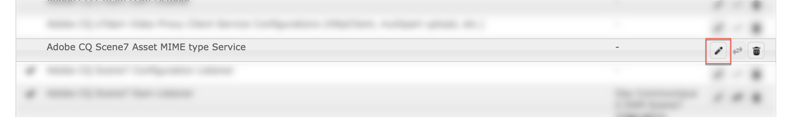

# 關於設定Dynamic MediaCloud Service {#configuring-dynamic-media}

如果您將Adobe Experience Manager用於不同環境（例如開發、測試和即時生產），請針對這些環境分別設定Dynamic MediaCloud Services。

另請參閱 [設定Dynamic Media公司別名帳戶](/help/assets/dynamic-media/dm-alias-account.md)

## Dynamic Media架構圖 {#architecture-diagram-of-dynamic-media}

下列架構圖表說明Dynamic Media的運作方式。

透過新架構，Experience Manager負責主要來源資產，並與Dynamic Media同步處理及發佈資產：

1. 將主要來源資產上傳至Adobe Experience Manager as a Cloud Service時，資產會複製至Dynamic Media。 此時，Dynamic Media會處理所有資產處理和轉譯產生，例如影像的視訊編碼和動態變體。
1. 產生轉譯後，Experience Manageras a Cloud Service可以安全地存取和預覽遠端Dynamic Media轉譯(不會將任何二進位檔傳回至Experience Manageras a Cloud Service例項)。
1. 內容準備好發佈及核准後，會觸發Dynamic Media服務推送內容至傳遞伺服器，並在CDN（內容傳遞網路）快取內容。

>[!NOTE]
>
>下列功能清單需要您使用隨附於Adobe Experience Manager - Dynamic Media的現成可用CDN。 這些功能不支援任何其他自訂CDN。
>
>* [智慧型影像](/help/assets/dynamic-media/imaging-faq.md)
>* [快取失效](/help/assets/dynamic-media/invalidate-cdn-cache-dynamic-media.md)
>* [熱連結保護](/help/assets/dynamic-media/hotlink-protection.md)
>* [HTTP/2 內容傳送](/help/assets/dynamic-media/http2faq.md)
>* CDN層級的URL重新導向
>* Akamai ChinaCDN（以最佳方式在中國傳送）

<!-- OBSOLETE CONTENT

## (Optional) Migrating Dynamic Media presets and configurations from 6.3 to 6.5 Zero Downtime {#optional-migrating-dynamic-media-presets-and-configurations-from-to-zero-downtime}

If you are upgrading Experience Manager as a Cloud Service Dynamic Media from 6.3 to 6.4 or 6.5 (which now includes the ability for zero downtime deployments), you are required to run the following curl command to migrate all your presets and configurations from `/etc` to `/conf` in CRXDE Lite.

>[!NOTE]
>
>If you run your Experience Manager as a Cloud Service instance in compatibility mode--that is, you have the compatibility packaged installed--you do not need to run these commands.

For all upgrades, either with or without the compatibility package, you can copy the default, out-of-the-box viewer presets that originally came with Dynamic Media by running the following Linux curl command:

`curl -u admin:admin -X POST https://<server_address>:<server_port>/libs/settings/dam/dm/presets/viewer.pushviewerpresets.json`

To migrate any custom viewer presets and configurations that you have created from `/etc` to `/conf`, run the following Linux curl command:

`curl -u admin:admin -X POST https://<server_address>:<server_port>/libs/settings/dam/dm/presets.migratedmcontent.json`

-->

## 在Cloud Services中建立Dynamic Media設定 {#configuring-dynamic-media-cloud-services}

<!-- **Before you creating a Dynamic Media Configuration in Cloud Services**: After you receive your provisioning email with Dynamic Media credentials, you must open the [Dynamic Media Classic desktop application](https://experienceleague.adobe.com/docs/dynamic-media-classic/using/getting-started/signing-out.html#getting-started), then sign in to your account to change your password. The password provided in the provisioning email is system-generated and intended to be a temporary password only. It is important that you update the password so that Dynamic Media Cloud Service is set up with the correct credentials. -->

1. 在Experience Manageras a Cloud Service中，選取Experience Manageras a Cloud Service標誌以存取全域導覽主控台。
1. 在主控台左側，選取「工具」圖示，然後前往 **[!UICONTROL Cloud Services> Dynamic Media設定]**.
1. 在Dynamic Media設定瀏覽器頁面的左窗格中，選取 **[!UICONTROL 全球]** (不要選取 **[!UICONTROL 全球]**)。 然後選取 **[!UICONTROL 建立]**.
1. 在 **[!UICONTROL 建立Dynamic Media設定]** 頁面，輸入Dynamic Media帳戶之公司管理員的標題、Dynamic Media帳戶電子郵件地址和密碼，然後選取您的地區。 此資訊是透過布建電子郵件中的Adobe提供給您的。 如果您未收到此電子郵件，請聯絡Adobe客戶支援。
1. 選擇 **[!UICONTROL 連線至Dynamic Media]**.
1. 在 **[!UICONTROL 更改密碼]** 對話框， **[!UICONTROL 新密碼]** 欄位，輸入包含8到25個字元的新密碼。 密碼必須至少包含以下各項之一：

   * 大寫字母
   * 小寫字母
   * 數量
   * 特殊字元： `# $ & . - _ : { }`

   此 **[!UICONTROL 當前密碼]** 欄位是刻意預先填入，並在互動中隱藏。

   如有必要，您可以通過選擇密碼眼表徵圖來顯示密碼來檢查您鍵入或重新鍵入的密碼的拼寫。 再次選擇表徵圖以隱藏密碼。

1. 在 **[!UICONTROL 重複密碼]** 欄位，重新鍵入新密碼，然後選擇 **[!UICONTROL 完成]**.

   新密碼在您選擇 **[!UICONTROL 儲存]** 在 **[!UICONTROL 建立Dynamic Media設定]** 頁面。

   如果您選取 **[!UICONTROL 取消]** 在 **[!UICONTROL 更改密碼]** 對話框，則在保存新建立的Dynamic Media配置時仍必須輸入新密碼。

   另請參閱 [變更Dynamic Media的密碼](#change-dm-password).

1. 連線成功時，您可以設定下列項目：

   | 屬性 | 說明 |
   |---|---|
   | 公司 | Dynamic Media帳戶的名稱。 **重要**:在Experience Manager例項上，僅支援一個Cloud Services中的Dynamic Media設定；請勿新增多個設定。 Experience Manager例項上的多個Dynamic Media設定為 _not_ 支援或建議Adobe。<!-- CQDOC-19579 and CQDOC-19612 --> 另請參閱 [設定Dynamic Media公司別名帳戶](/help/assets/dynamic-media/dm-alias-account.md). |
   | 公司根資料夾路徑 | 您公司的根資料夾路徑。 |
   | 發佈資產 | 您可以從下列三個選項中選擇： **[!UICONTROL 立即&#x200B;]**— 上傳資產時，系統會擷取資產並立即提供URL/內嵌。 發佈資產不需要使用者干預。 **[!UICONTROL 啟動時]**  — 您必須先明確發佈資產，才能提供URL/內嵌連結。 **[!UICONTROL 選擇性發佈&#x200B;]**— 資產會自動發佈，僅供安全預覽。 也可明確發佈至Experience Manageras a Cloud Service，而無須發佈至DMS7再於公共網域中傳遞。 未來，此選項會將資產發佈至Experience Manageras a Cloud Service，並將資產發佈至Dynamic Media，彼此互斥。 也就是說，您可以將資產發佈至DMS7，以便使用智慧型裁切或動態轉譯等功能。 或者，您只能以Experience Manageras a Cloud Service發佈資產以進行預覽；這些相同資產不會發佈在DMS7中，以供在公共網域傳送。 |
   | 安全預覽伺服器 | 可讓您指定安全轉譯預覽伺服器的URL路徑。 也就是說，產生轉譯後，Experience Manageras a Cloud Service可以安全地存取和預覽遠端Dynamic Media轉譯(不會將任何二進位檔傳回至Experience Manageras a Cloud Service執行個體)。 除非您有使用自己公司的伺服器或特殊伺服器的特殊安排，否則Adobe建議您保留此設定的指定。 |
   | 同步處理所有內容 | 預設為選取。 如果您想要選擇性地包含或排除從同步至Dynamic Media的資產，請取消選取此選項。 取消選取此選項可讓您從下列兩個Dynamic Media同步模式中選擇： **[!UICONTROL Dynamic Media同步模式]** **[!UICONTROL 預設啟用&#x200B;]**— 預設會將設定套用至所有資料夾，除非您特別標示要排除的資料夾。 <!-- you can then deselect the folders that you do not want the configuration applied to.--> **[!UICONTROL 預設為停用]**  — 在您明確標示選取的資料夾以同步至Dynamic Media之前，不會將設定套用至任何資料夾。 若要將選取的資料夾標示為同步至Dynamic Media，請選取資產資料夾，然後在工具列中選取 **[!UICONTROL 屬性]**. 在 **[!UICONTROL 詳細資料]** 標籤中 **[!UICONTROL Dynamic Media同步模式]** 下拉式清單中，從下列三個選項中選擇。 完成後，選取 **[!UICONTROL 儲存]**. *記住：如果您選取&#x200B;**同步所有內容**更早。* 另請參閱 [在Dynamic Media的資料夾層級使用選擇性發佈](/help/assets/dynamic-media/selective-publishing.md). **[!UICONTROL 繼承&#x200B;]**— 資料夾上沒有明確的同步值。 相反，資料夾會繼承其上階資料夾中的一個同步值或雲配置中的預設模式。 繼承的詳細狀態會透過工具提示顯示。 **[!UICONTROL 啟用子資料夾]**  — 將所有項目納入此子樹狀結構中，以同步至Dynamic Media。 資料夾特定設定會覆寫雲端設定中的預設模式。 **[!UICONTROL 子資料夾已停用&#x200B;]**— 排除此子樹狀結構中的所有項目，使其無法同步至Dynamic Media。 |

   >[!NOTE]
   >
   >動態媒體中不支援版本修訂。此外，延遲啟動僅適用於 **[!UICONTROL 發佈資產]** 在「編輯Dynamic Media設定」頁面中， **[!UICONTROL 啟動時]**.然後，直到首次啟動資產為止。
   >
   >
   >啟動資產後，任何更新都會立即上線發佈至S7傳送。

   

1. 選擇 **[!UICONTROL 儲存]**. 新Dynamic Media密碼和設定已儲存。 如果您選取 **[!UICONTROL 取消]** 但是，不會更新密碼。
1. 在 **[!UICONTROL 設定Dynamic Media]** 對話框，選擇 **[!UICONTROL 確定]** 以開始設定。

   >[!IMPORTANT]
   >
   >新Dynamic Media設定完成設定時，您會在Experience Manageras a Cloud Service的收件匣內收到狀態通知。
   >
   >此收件匣通知會通知您設定是否成功。
   > 請參閱 [疑難排解新的Dynamic Media設定](#troubleshoot-dm-config) 和 [您的收件匣](/help/sites-cloud/authoring/getting-started/inbox.md) 以取得更多資訊。

1. 為了在發佈Dynamic Media內容之前安全地預覽，Experience Manageras a Cloud Service會使用Token型驗證，因此Experience Manager作者預設會預覽Dynamic Media內容。 不過，您可以 *允許清單* 提供更多IP，讓使用者存取安全預覽內容。 若要在Experience Manageras a Cloud Service中設定此動作，請參閱 [設定影像伺服器的Dynamic Media發佈設定 — 「安全性」標籤](/help/assets/dynamic-media/dm-publish-settings.md#security-tab). <!-- To securely preview Dynamic Media content before it gets published, you must "allowlist" the Experience Manager as a Cloud Service author instance to connect to Dynamic Media. To set up this action, do the following: -->

<!--
    * Open the [Dynamic Media Classic desktop application](https://experienceleague.adobe.com/docs/dynamic-media-classic/using/getting-started/signing-out.html#getting-started), then sign in to your account. Your credentials and sign-in details were provided by Adobe at the time of provisioning. If you do not have this information, contact Adobe Customer Support.
    * On the navigation bar near the upper right corner of the page, go to **[!UICONTROL Setup]** > **[!UICONTROL Application Setup]** > **[!UICONTROL Publish Setup]** > **[!UICONTROL Image Server]**.
    * On the Image Server Publish page, in the **[!UICONTROL Publish Context]** drop-down list, select **[!UICONTROL Test Image Serving]**.
    * For the Client Address Filter, select **[!UICONTROL Add]**.
    * To enable (turn on) the address, select the check box, then enter the IP address of the Experience Manager Author instance (not Dispatcher IP).
    * Select **[!UICONTROL Save]**. -->

您現在已完成基本設定；您已準備好使用Dynamic Media。

如果您想進一步自訂設定，您可以選擇完成下方的任何工作 [在Dynamic Media中設定進階設定](#optional-configuring-advanced-settings-in-dynamic-media-scene-mode).

### 疑難排解新的Dynamic Media設定 {#troubleshoot-dm-config}

新Dynamic Media設定完成設定時，您會在Experience Manageras a Cloud Service的收件匣內收到狀態通知。 如下列收件匣的個別影像所示，此通知會通知您設定是否成功。

另請參閱 [您的收件匣](/help/sites-cloud/authoring/getting-started/inbox.md).

**若要疑難排解新的Dynamic Media設定：**

1. 在「Experience Manageras a Cloud Service」頁的右上角附近，選擇鈴聲表徵圖，然後選擇 **[!UICONTROL 查看全部]**.
1. 在「收件匣」頁面上，選取成功通知，以閱讀設定狀態和記錄的概觀。

   如果配置失敗，請選擇與以下螢幕截圖類似的失敗通知。

   

1. 在 **[!UICONTROL DMSETUP]** 頁面，檢閱說明失敗的設定詳細資訊。 請特別注意任何錯誤訊息或錯誤碼。 請聯絡Adobe客戶支援以取得此資訊。

   

### 變更Dynamic Media的密碼 {#change-dm-password}

Dynamic Media中的密碼過期時間會從目前系統日期開始設為100年。

密碼必須至少包含以下各項之一：

* 大寫字母
* 小寫字母
* 數量
* 特殊字元： `# $ & . - _ : { }`

如有必要，您可以通過選擇密碼眼表徵圖來顯示密碼來檢查您鍵入或重新鍵入的密碼的拼寫。 再次選擇表徵圖以隱藏密碼。

您選擇「 **[!UICONTROL 儲存]** 在 **[!UICONTROL 編輯Dynamic Media設定]** 頁面。

1. 在Experience Manageras a Cloud Service中，選取Experience Manageras a Cloud Service標誌以存取全域導覽主控台。
1. 在主控台左側，選取「工具」圖示，然後前往 **[!UICONTROL Cloud Services> Dynamic Media設定]**.
1. 在Dynamic Media設定瀏覽器頁面的左窗格中，選取 **[!UICONTROL 全球]**. 請勿選取 **[!UICONTROL 全球]**. 然後，選取 **[!UICONTROL 編輯]**.
1. 在 **[!UICONTROL 編輯Dynamic Media設定]** 頁面正下方 **[!UICONTROL 密碼]** 欄位，選擇 **[!UICONTROL 更改密碼]**.
1. 在 **[!UICONTROL 更改密碼]** 對話框，請執行以下操作：

   * 在 **[!UICONTROL 新密碼]** 欄位中輸入新密碼。

      此 **[!UICONTROL 當前密碼]** 欄位是刻意預先填入，並在互動中隱藏。

   * 在 **[!UICONTROL 重複密碼]** 欄位，重新鍵入新密碼，然後選擇 **[!UICONTROL 完成]**.

1. 位於 **[!UICONTROL 編輯Dynamic Media設定]** 頁面，選取 **[!UICONTROL 儲存]**，然後選取 **[!UICONTROL 確定]**.

## （選用）在Dynamic Media中設定進階設定{#optional-configuring-advanced-settings-in-dynamic-media-scene-mode}

若要進一步自訂Dynamic Media的設定和設定，或最佳化其效能，您可以完成下列一或多個作業 *可選* 任務：

* [（選用）Dynamic Media設定的設定和設定](#optional-setup-and-configuration-of-dynamic-media-scene-mode-settings)
* [（選用）調整Dynamic Media的效能](#optional-tuning-the-performance-of-dynamic-media-scene-mode)

<!--

* [(Optional) Filtering assets for replication](#optional-filtering-assets-for-replication)

-->

### （選用）Dynamic Media設定的設定和設定 {#optional-setup-and-configuration-of-dynamic-media-scene-mode-settings}

使用Dynamic Media Classic使用者介面變更Dynamic Media設定。

<!-- Some of the tasks above require that you open the [Dynamic Media Classic desktop application](https://experienceleague.adobe.com/docs/dynamic-media-classic/using/getting-started/signing-out.html#getting-started), then sign in to your account. -->

設定和設定任務包括：

* [設定影像伺服器的Dynamic Media發佈設定](#publishing-setup-for-image-server)
* [配置Dynamic Media一般設定](#configuring-application-general-settings)
* [配置顏色管理](#configuring-color-management)
* [編輯支援格式的MIME類型](#editing-mime-types-for-supported-formats)
* [為不支援的格式添加MIME類型](#adding-mime-types-for-unsupported-formats)

<!-- OBSOLETE BUT LEAVE FOR POSSIBLE FUTURE* [Creating batch set presets to auto-generate Image Sets and Spin Sets](#creating-batch-set-presets-to-auto-generate-image-sets-and-spin-sets) -->

#### 設定影像伺服器的Dynamic Media發佈設定 {#publishing-setup-for-image-server}

「Dynamic Media發佈設定」頁面會建立預設設定，決定如何將AdobeDynamic Media伺服器傳遞至網站或應用程式。

請參閱 [設定影像伺服器的Dynamic Media發佈設定](/help/assets/dynamic-media/dm-publish-settings.md).

#### 配置Dynamic Media一般設定 {#configuring-application-general-settings}

設定Dynamic Media **[!UICONTROL 發佈伺服器名稱]** URL和 **[!UICONTROL 源伺服器名稱]** URL。 您也可以指定 **[!UICONTROL 上傳至應用程式]** 設定與 **[!UICONTROL 預設上傳選項]** 全部取決於您的特定使用案例。

請參閱 [配置Dynamic Media一般設定](/help/assets/dynamic-media/dm-general-settings.md).

#### 配置顏色管理 {#configuring-color-management}

Dynamic Media色彩管理可讓您為資產加上色彩校正。 透過色彩校正，擷取的資產可保留其色彩空間(RGB、CMYK、灰色)和內嵌的色彩設定檔。 當您請求動態轉譯時，會使用CMYK、RGB或灰色輸出將影像顏色校正到目標顏色空間中。

請參閱 [設定影像預設集](/help/assets/dynamic-media/managing-image-presets.md).

要配置預設顏色屬性，以便在請求影像時啟用顏色校正：

1. 開啟 [Dynamic Media Classic案頭應用程式](https://experienceleague.adobe.com/docs/dynamic-media-classic/using/getting-started/signing-out.html#getting-started)，然後使用布建期間提供的憑證登入您的帳戶。
1. 前往 **[!UICONTROL 設定>應用程式設定]**.
1. 展開「發 **[!UICONTROL 布設定]** 」區域並選 **[!UICONTROL 取「影像伺服器」]**。設定發 **[!UICONTROL 布例項的預設值]** ，將「發佈內容」設 **** 定為「影像伺服」。
1. 捲動至您必須變更的屬性，例如 **[!UICONTROL 色彩管理屬性]** 的上界。
您可以設定下列顏色校正屬性：

   | 屬性 | 說明 |
   |---|---|
   | CMYK預設顏色空間 | 預設CMYK顏色配置檔案的名稱。 |
   | 灰階預設顏色空間 | 預設灰色配置檔案的名稱。 |
   | RGB預設顏色空間 | 預設RGB顏色配置檔案的名稱。 |
   | 色彩轉換色彩演算比對方式 | 指定渲染目的。 可接受的值為： **[!UICONTROL 知覺]**, **[!UICONTROL 相對冷量]**, **[!UICONTROL 飽和度]**, **[!UICONTROL 絕對冷量]**. Adobe建議 **[!UICONTROL 相對]** 作為預設值。 |

1. 選擇 **[!UICONTROL 儲存]**.

例如，您可以將「 **[!UICONTROL RGB預設顏色空間]** 」設 *為sRGB*，將「 **[!UICONTROL CMYK預設顏色空間」設為]**** WebCobatedCholor。

這麼做會執行下列動作：

* 啟用RGB和CMYK影像的顏色校正。
* 沒有顏色描述檔的RGB影像會假設在 *sRGB* 色域。
* 假定沒有顏色輪廓的CMYK影像為 *WebCobated* 色域。
* 傳回RGB輸出的動態轉譯，會在 *sRGB* 色域。
* 傳回CMYK輸出的動態轉譯，會在 *WebCobated* 色域。

#### 編輯支援格式的MIME類型 {#editing-mime-types-for-supported-formats}

您可以定義由Dynamic Media處理的資產類型，並自訂進階資產處理參數。 例如，您可以指定資產處理參數以執行下列動作：

* 將Adobe PDF轉換為eCatalog資產。
* 將Adobe Photoshop檔案(.PSD)轉換為橫幅範本資產，以便個人化。
* 柵格化Adobe Illustrator檔案(.AI)或Adobe Photoshop封裝的PostScript®檔案(.EPS)。
* [視訊設定檔](/help/assets/dynamic-media/video-profiles.md) 和 [影像設定檔](/help/assets/dynamic-media/image-profiles.md) 可分別用來定義視訊和影像的處理。

請參閱 [上傳資產](/help/assets/add-assets.md).

**要編輯支援格式的MIME類型：**

1. 以產品管理員身分登入您的Experience Manageras a Cloud Service。
1. 在Experience Manageras a Cloud Service中，選取Experience Manageras a Cloud Service標誌以存取全域導覽主控台，然後前往 **[!UICONTROL 一般>CRXDE Lite]**.

   如果您沒有CRXDE Lite的存取權，請參閱 [使用CRXDE Lite](/help/implementing/developing/tools/crxde.md).

1. 在左側邊欄中，導覽至下列項目：

   `/conf/global/settings/cloudconfigs/dmscene7/jcr:content/mimeTypes`

   

1. 在mimeTypes資料夾下，選擇MIME類型。
1. 在CRXDE Lite頁面的右側，下方：

   * 按兩下 **[!UICONTROL 已啟用]** 欄位。 依預設，會啟用所有資產MIME類型(設為 **[!UICONTROL true]**)，表示資產會同步至Dynamic Media以進行處理。 如果您想要排除此資產MIME類型，請將此設定變更為 **[!UICONTROL false]**.

   * 按兩下 **[!UICONTROL jobParam]** 開啟其關聯的文本欄位。 請參閱 [支援的MIME類型](/help/assets/file-format-support.md) 以取得可用於指定MIME類型的允許處理參數值清單。

1. 執行下列任一項作業：
   * 重複步驟3-4以編輯更多MIME類型。
   * 在「CRXDE Lite」頁的菜單欄上，選擇 **[!UICONTROL 全部儲存]**.

1. 在頁面的左上角，選取 **[!UICONTROL CRXDE Lite]** 返回Experience Manageras a Cloud Service。

#### 為不支援的格式添加MIME類型 {#adding-mime-types-for-unsupported-formats}

您可以針對Experience Manager Assets中不支援的格式新增自訂MIME類型。 若要確保CRXDE Lite未刪除您新增的任何新節點，請先移動MIME類型 `image_`. 同時，請確定其啟用值設為 **[!UICONTROL false]**.

**為不支援的格式添加MIME類型：**

1. 以產品管理員身分登入您的Experience Manageras a Cloud Service。
1. 從Experience Manageras a Cloud Service，前往 **[!UICONTROL 「工具」>「操作」>「Web控制台」]**.

   

1. 新的瀏覽器標籤隨即開啟， **[!UICONTROL Adobe Experience Manager Web主控台設定]** 頁面。

   

1. 在頁面上，向下捲動至名稱 *Adobe CQ Scene7 Asset MIME類型Service* ，如下列螢幕擷取所示。在名稱的右側，點選「 **[!UICONTROL Edit the configuration values]** (pencil icon)(編輯配置值 (鉛筆圖示) 」。

   

1. 在 **Adobe CQ Scene7資產MIME類型服務** 頁，請選擇任何加號表徵圖&lt;+>。 表格中您選取加號以新增新MIME類型的位置很瑣碎。

   

1. 類型 `DWG=image/vnd.dwg` 填入您剛新增的空白文字欄位。

   此 `DWG=image/vnd.dwg` MIME類型僅用於示例用途。 您在此處新增的MIME類型可能是任何其他不支援的格式。

   

1. 在頁面的右下角，選取 **[!UICONTROL 儲存]**.

   此時，您可以關閉開啟「Adobe Experience Manager Web Console設定」頁面的瀏覽器標籤。

1. 返回具有開啟的Experience Manageras a Cloud Service控制台的瀏覽器頁簽。
1. 從Experience Manageras a Cloud Service，前往 **[!UICONTROL 工具>一般>CRXDE Lite]**.

   如果您沒有CRXDE Lite的存取權，請參閱 [使用CRXDE Lite](/help/implementing/developing/tools/crxde.md).

   

1. 在左側邊欄中，導覽至下列項目：

   `conf/global/settings/cloudconfigs/dmscene7/jcr:content/mimeTypes`

1. 拖曳MIME類型 `image_vnd.dwg` 直接放在上面 `image_` 在樹中，如下面的螢幕截圖所示。

   

1. 具有MIME類型 `image_vnd.dwg` 仍選取，從 **[!UICONTROL 屬性]** 標籤中 **[!UICONTROL 已啟用]** 行，在 **[!UICONTROL 值]** 欄標題，點選兩下值。 此 **[!UICONTROL 值]** 下拉式清單已開啟。
1. 類型 `false` 在欄位中(或選取 **[!UICONTROL false]** )。

   

1. 在CRXDE Lite頁面的左上角附近，選取 **[!UICONTROL 全部儲存]**.

### （選用）調整Dynamic Media的效能 {#optional-tuning-the-performance-of-dynamic-media-scene-mode}

保留Dynamic Media <!--(with `dynamicmedia_scene7` run mode)--> 運行順利，Adobe建議使用以下同步效能/可擴充性微調提示：

* [更新預定義的作業參數以處理不同的檔案格式](#update-job-para).
* [更新預先定義的Granite工作流程佇列（視訊資產）背景工作執行緒](#update-granite-workflow-queue-worker-threads-video)
* [更新預先定義的Granite暫時工作流程佇列（影像和非視訊資產）背景工作執行緒](#update-granite-transient-workflow-queue-worker-threads-images).
* [更新最大上傳連線至Dynamic Media Classic(Scene7)伺服器](#update-max-s7-upload-connections).

#### 更新預定義的作業參數以處理不同的檔案格式 {#update-job-para}

上傳檔案時，您可以調整工作參數以加快處理速度。 例如，如果您上傳PSD檔案，但不想以範本形式處理，則可將圖層擷取設為false(off)。 在這種情況下，調整的作業參數如下所示： `process=None&createTemplate=false`.

如果您確實要開啟範本建立，請使用下列參數： `process=MaintainLayers&layerNaming=AppendName&createTemplate=true`.

<!-- THIS PARAGRAPH WAS REPLACED WITH THE TWO PARAGRAPHS DIRECTLY ABOVE BASED ON CQDOC-17657 You can tune job parameters for faster processing when you upload files. For example, if you are uploading PSD files, but do not want to process them as templates, you can set layer extraction to false (off). In such case, the tuned job parameter would appear as `process=None&createTemplate=false`. -->

Adobe建議對PDF、PostScript®和PSD檔案使用以下「調整」作業參數：

| 檔案類型 | 建議的作業參數 |
| ---| ---|
| PDF | `pdfprocess=Rasterize&resolution=150&colorspace=Auto&pdfbrochure=false&keywords=false&links=false` |
| PostScript® | `psprocess=Rasterize&psresolution=150&pscolorspace=Auto&psalpha=false&psextractsearchwords=false&aiprocess=Rasterize&airesolution=150&aicolorspace=Auto&aialpha=false` |
| PSD | `process=None&layerNaming=AppendName&anchor=Center&createTemplate=false&extractText=false&extendLayers=false` |

<!-- CQDOC-17657 for PSD entry in table above -->

若要更新任何這些參數，請參閱 [編輯支援格式的MIME類型](#editing-mime-types-for-supported-formats).

另請參閱 [為不支援的格式添加MIME類型](#adding-mime-types-for-unsupported-formats).

#### 更新預先定義的Granite工作流程佇列（視訊資產）背景工作執行緒 {#update-granite-workflow-queue-worker-threads-video}

Granite工作流程佇列用於非暫時性的工作流程。 在Dynamic Media中，它過去會透過 **[!UICONTROL Dynamic Media編碼視訊]** 工作流程。

>[!NOTE]
>
>您必須以產品管理員身分登入Experience Manageras a Cloud Service，才能完成此工作。

如果您沒有OSGi的存取權，請參閱 [OSGi配置](/help/implementing/developing/components/overview.md#osgi-configuration).

**若要更新預先定義的Granite工作流程佇列（視訊資產）背景工作執行緒：**

1. 導覽至 `https://<server>/system/console/configMgr` 和搜索 **隊列：Granite工作流程佇列**.

   >[!NOTE]
   >
   >由於OSGi PID是動態產生的，因此必須進行文字搜尋，而非直接URL。

1. 在 **[!UICONTROL 最大並行作業數]** 欄位中，將數字變更為所需值。

   預設情況下，並行作業的最大數量取決於可用的CPU核心數。 例如，在4核伺服器上，它分配兩個工作線程。 （介於0.0和1.0之間的值是基於比率的，或者任何大於1的數字都分配工作線程數。）

   對於大多數使用案例，0.5的預設設定已足夠。

   

1. 選擇 **[!UICONTROL 儲存]**.

#### 更新預先定義的Granite暫時工作流隊列工作線程 {#update-granite-transient-workflow-queue-worker-threads-images}

Granite傳輸工作流程佇列用於 **[!UICONTROL DAM更新資產]** 工作流程。 在Dynamic Media中，它用於影像和非視訊資產擷取及處理。

>[!NOTE]
>
>您必須以產品管理員身分登入Experience Manageras a Cloud Service，才能完成此工作。

**要更新預定義的Granite暫時工作流隊列工作線程，請執行以下操作：**

1. 導覽至 **Adobe Experience Manager Web主控台設定** at `http://<host>:<port>/system/console/configMgr`
1. 搜尋 **隊列：Granite暫時工作流程佇列**.

   >[!NOTE]
   >
   >由於OSGi PID是動態產生的，因此必須進行文字搜尋，而非直接URL。

1. 在 **[!UICONTROL 最大並行作業數]** 欄位中，將數字變更為所需值。

   您可以增加 **[!UICONTROL 最大並行作業數]** 以充分支援將檔案大量上傳至Dynamic Media。 確切值取決於硬體容量。 在某些情況下（例如初始移轉或一次性大量上傳），您可以使用大值。 但請注意，使用大值（如內核數的2倍）可能會對其他併發活動產生負面影響。 因此，請根據您的特定使用案例來測試和調整值。

<!--    By default, the maximum number of parallel jobs depends on the number of available CPU cores. For example, on a 4-core server, it assigns 2 worker threads. (A value between 0.0 and 1.0 is ratio based, or any numbers greater than 1 will assign the number of worker threads.)

   Adobe recommends that 32 **[!UICONTROL Maximum Parallel Jobs]** be configured to adequately support heavy upload of files to Dynamic Media Classic. -->

1. 選擇 **[!UICONTROL 儲存]**.

#### 更新最大上傳連線至Dynamic Media Classic(Scene7)伺服器 {#update-max-s7-upload-connections}

Dynamic Media Classic(Scene7)「上傳連線」設定會將Experience Manager資產同步至Dynamic Media Classic伺服器。

>[!NOTE]
>
>您必須以產品管理員身分登入Experience Manageras a Cloud Service，才能完成此工作。

**若要更新至Dynamic Media Classic(Scene7)伺服器的上傳連線上限：**

1. 導航到 `https://<server>/system/console/configMgr/com.day.cq.dam.scene7.impl.Scene7UploadServiceImpl`
1. 在 **[!UICONTROL 連接數]** 欄位，或 **[!UICONTROL 活動作業超時]** 欄位或兩者，視需要變更數字。

   此 **[!UICONTROL 連接數]** 設定會控制Experience Manager上傳至Dynamic Media所允許的HTTP連線數量上限。 通常，十個連線的預先定義值就足夠了。

   此 **[!UICONTROL 活動作業超時]** 設定會決定已上傳Dynamic Media資產在傳送伺服器中發佈的等待時間。 預設情況下，此值為2100秒或35分鐘。

   對於大多數使用案例，2100的設定已足夠。

   

1. 選擇 **[!UICONTROL 儲存]**.

<!-- NOTE - OBSOLETE that customisations to replication agents to transform content are no longer used; the following content is obsolete now 

### (Optional) Filtering assets for replication {#optional-filtering-assets-for-replication}

In non-Dynamic Media deployments, you replicate *all* assets (both images and video) from your Experience Manager as a Cloud Service author environment to the Experience Manager as a Cloud Service publish node. This workflow is necessary because the Experience Manager as a Cloud Service publish servers also deliver the assets.

However, in Dynamic Media deployments, because assets are delivered by way of the cloud service, there is no need to replicate those same assets to Experience Manager as a Cloud Service publish nodes. Such a "hybrid publishing" workflow avoids extra storage costs and longer processing times to replicate assets. Other content, such as Site pages, continue to be served from the Experience Manager as a Cloud Service publish nodes.

The filters provide a way for you to *exclude* assets from being replicated to the Experience Manager as a Cloud Service publish node.

#### Using default asset filters for replication {#using-default-asset-filters-for-replication}

If you are using Dynamic Media for imaging and/or video, then you can use the default filters that we provide as-is. The following filters are active by default:

<table>
 <tbody>
  <tr>
   <td> </td>
   <td><strong>Filter</strong></td>
   <td><strong>Mimetype</strong></td>
   <td><strong>Renditions</strong></td>
  </tr>
  <tr>
   <td>Dynamic Media Image Delivery</td>
   <td>
filter-images
 
filter-sets
 
 
 </td>
   <td>
Starts with <strong>image/</strong>
 
Contains <strong>application/</strong> and ends with <strong>set</strong>.
 </td>
   <td>The out-of-the-box "filter-images" (applies to single images assets, including interactive images) and "filter-sets" (applies to Spin Sets, Image Sets, Mixed Media Sets, and Carousel Sets) will:
    <ul>
     <li>Exclude from replication the original image and static image renditions.</li>
    </ul> </td>
  </tr>
  <tr>
   <td>Dynamic Media Video Delivery</td>
   <td>filter-video</td>
   <td>Starts with <strong>video/</strong></td>
   <td>The out-of-the-box "filter-video" will:
    <ul>
     <li>Exclude from replication the original video and static thumbnail renditions.    </li>
    </ul> </td>
  </tr>
 </tbody>
</table>

>[!NOTE]
>
>Filters apply to mime types and cannot be path specific.

#### Customizing asset filters for replication {#customizing-asset-filters-for-replication}

1. In Experience Manager as a Cloud Service, select the Experience Manager as a Cloud Service logo to access the global navigation console and select the **[!UICONTROL Tools > General > CRXDE Lite]**.
1. In the left folder tree, navigate to `/etc/replication/agents.author/publish/jcr:content/damRenditionFilters` to review the filters.

   

1. To define the Mime Type for the filter, you can locate the Mime Type as follows:

   In the left rail, expand `content > dam > <locate_your_asset> > jcr:content > metadata`, and then in the table, locate `dc:format`.

   The following graphic is an example of an asset's path to `dc:format`.

   

   Notice that the `dc:format` for the asset `Fiji Red.jpg` is `image/jpeg`.

   To have this filter apply to all images, regardless of their format, set the value to `image/*` where `*` is a regular expression that is applied to all images of any format.

   To have the filter apply only to images of the type JPEG, enter a value of `image/jpeg`.

1. Define what renditions you want to include or exclude from replication.

   Characters that you can use to filter for replication include the following:

<table>
 <tbody>
  <tr>
   <td><strong>Character to use</strong></td>
   <td><strong>How it filters assets for replication</strong></td>
  </tr>
  <tr>
   <td>*</td>
   <td>Wildcard character  </td>
  </tr>
  <tr>
   <td>+</td>
   <td>Includes assets for replication.</td>
  </tr>
  <tr>
   <td>-</td>
   <td>Excludes assets from replication.</td>
  </tr>
 </tbody>
</table>

   Navigate to `content/dam/<locate your asset>/jcr:content/renditions`.

   The following graphic is an example of an asset's renditions.

   

   If you only wanted to replicate the original, then you would enter `+original`.

   -->
