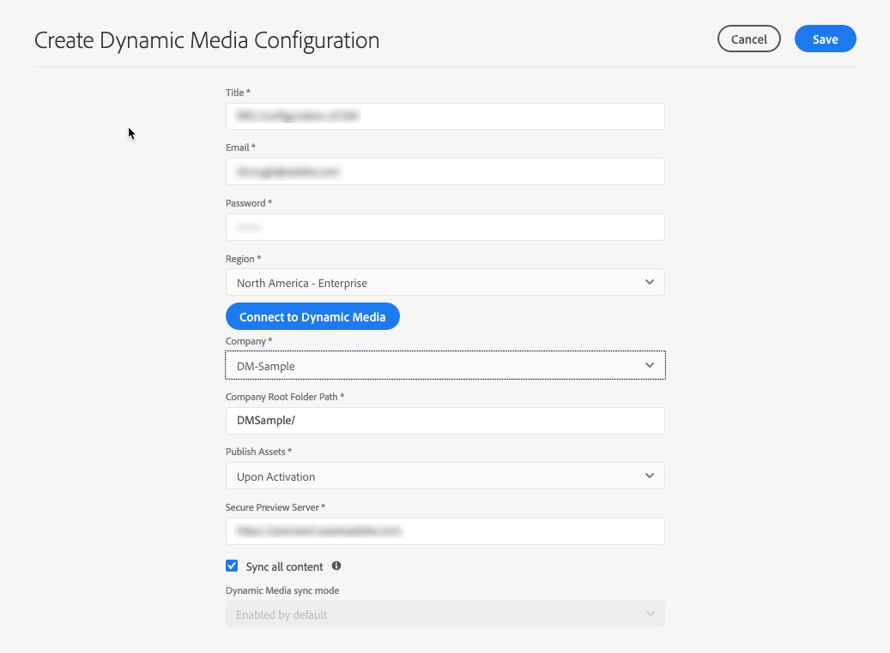

# 設定 Dynamic Media {#configuring-dynamic-media-scene-mode}

如果您針對不同環境（例如開發環境、測試環境和即時生產環境）使用Adobe Experience Manager設定，您必須針對每個環境設定Dynamic Media Cloud Services。

## 動態媒體的架構圖 {#architecture-diagram-of-dynamic-media-scene-mode}

下列架構圖說明Dynamic Media的運作方式。

有了新的架構，AEM負責主要資產並與Dynamic Media同步，以處理和發佈資產：

1. 當主資產上傳至AEM時，它會複製至Dynamic Media。 此時，Dynamic Media會處理所有資產處理和轉譯產生，例如影像的視訊編碼和動態變數。
1. 產生轉譯後，AEM可以安全地存取和預覽遠端的Dynamic Media轉譯（不會將二進位檔傳回至AEM例項）。
1. 內容準備好發佈及核准後，它會觸發Dynamic Media服務將內容推出至傳送伺服器，並在CDN快取內容。


<!-- OBSOLETE CONTENT

## (Optional) Migrating Dynamic Media presets and configurations from 6.3 to 6.5 Zero Downtime {#optional-migrating-dynamic-media-presets-and-configurations-from-to-zero-downtime}

If you are upgrading AEM Dynamic Media from 6.3 to 6.4 or 6.5 (which now includes the ability for zero downtime deployments), you are required to run the following curl command to migrate all your presets and configurations from `/etc` to `/conf` in CRXDE Lite.

>[!NOTE]
>
>If you run your AEM instance in compatibility mode--that is, you have the compatibility packaged installed--you do not need to run these commands.

For all upgrades, either with or without the compatibility package, you can copy the default, out-of-the-box viewer presets that originally came with Dynamic Media by running the following Linux curl command:

`curl -u admin:admin -X POST https://<server_address>:<server_port>/libs/settings/dam/dm/presets/viewer.pushviewerpresets.json`

To migrate any custom viewer presets and configurations that you have created from `/etc` to `/conf`, run the following Linux curl command:

`curl -u admin:admin -X POST https://<server_address>:<server_port>/libs/settings/dam/dm/presets.migratedmcontent.json`

-->

## 設定動態媒體雲端服務 {#configuring-dynamic-media-cloud-services}

**在您設定Dynamic Media Cloud服務之前**: 在您收到具有動態媒體憑證的布建電子郵件後， [您必須登入](https://www.adobe.com/marketing-cloud/experience-manager/scene7-login.html) Dynamic Media Classic以變更密碼。 提供電子郵件中提供的密碼是系統生成的，並僅用於臨時密碼。 請務必更新密碼，以便使用正確的認證來設定Dynamic Media Cloud Service。

若要設定動態媒體雲端服務：

1. 在AEM中，點選AEM標誌以存取全域導覽主控台。
1. 在控制台的左側，在「工具」標 **[!UICONTROL 題下]** ，點 **[!UICONTROL 選「雲端服務>動態媒體設定」]**。
1. 在「動態媒體設定瀏覽器」頁面的左側窗格中，點選 **[!UICONTROL global]** (不點選或選取全域左側的資料夾圖示 ****)，然後點選「 **[!UICONTROL 建立]**」。
1. 在「建立動態媒體設定」頁面上，輸入標題、動態媒體帳戶電子郵件地址、密碼，然後選取您的地區。 Adobe會在布建電子郵件中提供給您。 如果您未收到此訊息，請聯絡支援部門。
1. Click **[!UICONTROL Connect to Dynamic Media]**.

   >[!NOTE]
   >
   >在您收到具有動態媒體憑證的布建電子郵件後，請 [登入](https://www.adobe.com/marketing-cloud/experience-manager/scene7-login.html) Dynamic Media Classic以變更密碼。 提供電子郵件中提供的密碼是系統生成的，並僅用於臨時密碼。 請務必更新密碼，以便使用正確的認證來設定Dynamic Media Cloud服務。

1. 連接成功後，可以設定以下內容：

   * **[!UICONTROL 公司]** -動態媒體帳戶的名稱。 您可能會針對不同子品牌、部門或不同的測試／生產環境擁有多個動態媒體帳戶。

   * **[!UICONTROL 公司根資料夾路徑]**

   * **[!UICONTROL 發佈資產]** -您可以從下列三個選項中選擇：
      * **[!UICONTROL 立即]** ：當資產上傳時，系統會立即收錄資產並提供URL/內嵌。 發佈資產不需要使用者干預。
      * **[!UICONTROL 啟動後]** ，表示您必須先明確發佈資產，才能提供URL/內嵌連結。
      * **[!UICONTROL 選擇性發佈]** ：表示資產會自動發佈，僅供安全預覽使用，而且可明確發佈至AEM，而不需發佈至DMS7以便在公共網域中傳送。 未來，Adobe將增強此選項，將資產發佈至AEM，並將資產發佈至Dynamic Media，彼此互斥。 也就是說，您可以將資產發佈到DMS7，以便使用智慧型裁切或動態轉譯等功能。 或者，您可以在AEM中獨家發佈資產以進行預覽； 這些相同的資產不會發佈在DMS7中，以便在公共域中交付。
   * **[!UICONTROL 安全預覽伺服器]** -可讓您指定安全轉譯預覽伺服器的URL路徑。 也就是說，在產生轉譯後，AEM可以安全地存取和預覽遠端的「動態媒體」轉譯（不會將二進位檔傳回至AEM例項）。
除非您有特殊安排可使用您公司的伺服器或特殊伺服器，否則Adobe Systems建議您依指定的方式保留此設定。

   * **[!UICONTROL 同步所有內容]** -預設為選取。 如果您想要選擇性地包含或排除同步至動態媒體的資產，請取消選取此選項。 取消選取此選項可讓您從下列兩種動態媒體同步模式中選擇：

   * **[!UICONTROL Dynamic Media 同步處理模式]**
      * **[!UICONTROL 預設啟用]** -預設情況下，配置將應用於所有資料夾，除非您專門為排除標籤資料夾。 <!-- you can then deselect the folders that you do not want the configuration applied to.-->
      * **[!UICONTROL 預設禁用]** -在您明確標籤選定資料夾以同步到動態媒體之前，配置不會應用於任何資料夾。
若要將選取的檔案夾標示為同步至動態媒體，請開啟資產檔案夾的「屬性」頁面。Tap the **[!UICONTROL Details]** tab, then from the **[!UICONTROL Dynamic Media sync mode]** drop-down list, choose from the following three options, then save tap **[!UICONTROL Save]**.
         * **[!UICONTROL 繼承]** -資料夾上沒有明確的同步值； 相反，資料夾會繼承其上級資料夾或雲配置中預設模式中的同步值。 繼承的詳細狀態會透過工具提示顯示。
         * **[!UICONTROL 啟用子資料夾]** -包含此子樹狀結構中的所有項目，以同步至動態媒體。 資料夾特定的設定會覆寫雲端設定中的預設模式。
         * **[!UICONTROL 子資料夾停用]** -排除此子樹狀結構中的所有項目，以免同步至動態媒體。
   >[!NOTE]
   >
   >動態媒體中不支援版本修訂。此外，延遲啟動僅適用於在「編輯動態媒體設定」頁面中的「發佈資產 ********」設定為「啟動時」，然後只適用於在首次啟動資產時。
   >
   >
   >啟動資產後，任何更新都會立即即時發佈至S7傳送。

   

1. 點選「 **[!UICONTROL 儲存]**」。
1. 若要在動態媒體內容發佈之前安全地預覽，您必須將AEM作者例項「白名單」以連線至動態媒體：

   * 登入您的Dynamic Media Classic帳戶： [https://www.adobe.com/marketing-cloud/experience-manager/scene7-login.html](https://www.adobe.com/marketing-cloud/experience-manager/scene7-login.html). 您的認證和登入是在布建時由Adobe提供。 如果您沒有此資訊，請聯絡技術支援。
   * 在頁面右上方的導覽列上，按一下「設定>應用程 **[!UICONTROL 式設定>發佈設定>影像伺服器」]**。

   * 在「影像伺服器發佈」頁面的「發佈內容」下拉式清單中，選取「測試影 **[!UICONTROL 像伺服」]**。
   * 在「用戶端位址篩選」中，點選「 **[!UICONTROL 新增」]**。
   * 選取核取方塊以啟用（開啟）此位址，然後輸入AEM Author例項的IP位址（而非Dispatcher IP）。
   * 按一下&#x200B;**[!UICONTROL 「儲存」]**。

您現在已完成基本配置； 您已準備好使用動態媒體。

如果您想要進一步自訂配置，您可選擇在動態媒體中設定進階設定 [下完成任何工作](#optional-configuring-advanced-settings-in-dynamic-media-scene-mode)。

## （可選）在動態媒體中設定進階設定{#optional-configuring-advanced-settings-in-dynamic-media-scene-mode}

如果您想要進一步自訂動態媒體的設定和設定，或最佳化其效能，則可完成下列一或多項選 *擇* :

* [動態媒體設定的設定與設定](#optional-setup-and-configuration-of-dynamic-media-scene-mode-settings)
* [（可選）調整動態媒體的效能](#optional-tuning-the-performance-of-dynamic-media-scene-mode)

<!--

* [(Optional) Filtering assets for replication](#optional-filtering-assets-for-replication)

-->

### （可選）動態媒體設定的設定與設定 {#optional-setup-and-configuration-of-dynamic-media-scene-mode-settings}

使用Dynamic Media Classic(Scene7)使用者介面來變更動態媒體設定。

上述部分工作需要您登入Dynamic Media Classic(Scene7)，網址為： [https://www.adobe.com/marketing-cloud/experience-manager/scene7-login.html](https://www.adobe.com/marketing-cloud/experience-manager/scene7-login.html)

設定和設定工作包括：

* [影像伺服器的發佈設定](#publishing-setup-for-image-server)
* [配置應用程式常規設定](#configuring-application-general-settings)
* [設定色彩管理](#configuring-color-management)
* [設定資產處理](#configuring-asset-processing)
* [為不支援的格式添加自定義MIME類型](#adding-custom-mime-types-for-unsupported-formats)
* [建立批次集預設集以自動產生影像集和回轉集](#creating-batch-set-presets-to-auto-generate-image-sets-and-spin-sets)

#### 影像伺服器的發佈設定 {#publishing-setup-for-image-server}

「發佈設定」設定會決定預設如何從動態媒體傳送資產。 如果未指定任何設定，動態媒體會根據發佈設定中定義的預設設定來傳送資產。 例如，傳送不含解析度屬性的影像請求，會產生具有預設物件解析度設定的影像。

若要設定發佈設定： 在Dynamic Media Classic中，按一下「 **[!UICONTROL 設定>應用程式設定>發佈設定>影像伺服器」]**。

「影像伺服器」畫面會建立傳送影像的預設設定。 請參閱UI畫面，以取得每個設定的說明。

* **[!UICONTROL 請求屬性]** -這些設定會限制從伺服器傳送的影像。
* **[!UICONTROL 預設請求屬性]** -這些設定屬於影像的預設外觀。
* **[!UICONTROL 常見縮圖屬性]** -這些設定屬於縮圖影像的預設外觀。
* **[!UICONTROL 目錄欄位的預設值]**-這些設定與影像的解析度和預設縮略圖類型相關。
* **[!UICONTROL 色彩管理屬性]** -這些設定會決定使用哪些ICC色彩描述檔。
* **[!UICONTROL 相容性屬性]** -此設定可讓文字圖層中的前導和尾隨段落視為3.6版中的段落，以提供回溯相容性。
* **[!UICONTROL 本地化支援]** -這些設定可讓您管理多個地區設定屬性。 它也可讓您指定地區對應字串，以便定義您要在檢視器中支援哪些語言。 如需有關設定本地化支 **援的詳細資訊]**, [請參閱設定資產本地化時的考量事項](https://help.adobe.com/en_US/scene7/using/WS997f1dc4cb0179f034e07dc31412799d19a-8000.html)。

#### 配置應用程式常規設定 {#configuring-application-general-settings}

若要開啟「應用程式一般設定」頁面，請在Dynamic Media Classic全域導覽列中，按一下「設定>應 **[!UICONTROL 用程式設定>一般設定」]**。

* **[!UICONTROL 伺服器]** -在帳戶布建時，動態媒體會自動為您的公司提供指派的伺服器。 這些伺服器可用來建構網站和應用程式的URL字串。 這些URL呼叫是您帳戶專屬的。 除非AEM支援明確指示，否則請勿變更任何伺服器名稱。

* **[!UICONTROL 覆寫影像]** -動態媒體不允許兩個檔案具有相同名稱。 每個項目的URL ID（檔案名稱減去副檔名）必須是唯一的。 這些選項指定如何上傳取代資產： 不論是替換原稿還是變成重複。 重複資產會以&quot;-1&quot;（例如chair.tif會更名為chair-1.tif）重新命名。 這些選項會影響上傳至原始檔案夾以外的資產，或是副檔名與原始檔案不同的資產（例如JPG、TIF或PNG）。

* **[!UICONTROL 覆寫目前檔案夾中的基本影像名稱／副檔名]** -此選項是最嚴格的取代規則。 它要求您將取代影像上傳至與原始影像相同的檔案夾，而取代影像的副檔名與原始影像的副檔名相同。 如果未滿足這些要求，則會建立重複項。

   >[!NOTE]
   >
   >若要與AEM維持一致性，請一律選擇下列設定： **覆寫目前檔案夾中的基本影像名稱／副檔名相同**

* **[!UICONTROL 在任何資料夾中覆寫相同的基本資產名稱／副檔名]** -要求取代影像的副檔名與原始影像相同（例如，chair.jpg必須取代chair.jpg，而非chair.tif）。 不過，您可以將取代影像上傳至原始檔案夾以外的其他檔案夾。 更新後的影像位於新資料夾中； 在其原始位置中無法再找到檔案
* **[!UICONTROL 在任何資料夾中覆寫相同的基本資產名稱(不論副檔名為何]** )-此選項是最包含的取代規則。 您可以將取代影像上傳至原始檔案夾以外的其他檔案夾、以不同副檔名上傳檔案，並取代原始檔案。 如果原始檔案位於不同的檔案夾中，則取代影像會位於上傳檔案的新檔案夾中。

* **[!UICONTROL 預設色彩描述檔]** -如需詳細 [資訊，請參閱設定](#configuring-color-management) 色彩管理。

>[!NOTE]
>
>依預設，當您選取「轉譯」時，系統會顯示15個轉譯，當您在資產的詳細資料檢視中選取「檢視器 ******** 」時，系統會顯示15個檢視器預設集。您可以提高此限制。請參 [閱增加或減少顯示的影像預設集數目](/help/assets/dynamic-media/managing-image-presets.md#increasing-or-decreasing-the-number-of-image-presets-that-display) , [或增加或減少顯示的檢視器預設集數目](/help/assets/dynamic-media/managing-viewer-presets.md#increasing-the-number-of-viewer-presets-that-display)。


#### 設定色彩管理 {#configuring-color-management}

動態媒體色彩管理可讓您為正確的資產加上色彩。 透過色彩校正，收錄的資產會保留其色域（RGB、CMYK、灰色）和內嵌的色彩描述檔。 當您請求動態轉譯時，會使用CMYK、RGB或「灰色」輸出，將影像色彩校正為目標色域。 請參閱 [設定影像預設集](/help/assets/dynamic-media/managing-image-presets.md)。

若要設定預設顏色屬性，以在請求影像時啟用色彩校正：

1. [使用布建期間提供的憑證](https://www.adobe.com/marketing-cloud/experience-manager/scene7-login.html) ，登入Dynamic Media Classic。 定位至「 **[!UICONTROL 設定」>「應用程式設定」]**。
1. 展開「發 **[!UICONTROL 布設定]** 」區域並選 **[!UICONTROL 取「影像伺服器」]**。設定發 **[!UICONTROL 布例項的預設值]** ，將「發佈內容」設 **** 定為「影像伺服」。
1. 捲動至您需要變更的屬性，例如「色彩管理屬性」區 **[!UICONTROL 域中的屬性]** 。

   您可以設定下列色彩校正屬性：

   * **[!UICONTROL CMYK預設色域]** -預設CMYK色彩描述檔的名稱
   * **[!UICONTROL 灰階預設色域]** -預設灰階色彩描述檔的名稱
   * **[!UICONTROL RGB預設色域]** -預設RGB色彩描述檔的名稱
   * **[!UICONTROL 顏色轉換渲染方式]** -指定渲染方式。 Acceptable values are: **[!UICONTROL perceptual]**, **[!UICONTROL relative colometric]**, **[!UICONTROL saturation]**, **[!UICONTROL absolute colometric]**. Adobe recommends **[!UICONTROL relative]]**as the default.

1. 點選「 **[!UICONTROL 儲存]**」。

例如，您可以將「 **[!UICONTROL RGB預設顏色空間]** 」設 *為sRGB*，將「 **[!UICONTROL CMYK預設顏色空間」設為]**** WebCobatedCholor。

這麼做會執行下列動作：

* 啟用RGB和CMYK影像的色彩校正。
* 沒有色彩描述檔的RGB影像會假設在 *sRGB* 色域中。
* 沒有色彩描述檔的CMYK影像會假設在 *WebCopted色彩空間中* 。
* 傳回RGB輸出的動態轉譯，會傳回到*sRGB *色彩空間。
* 傳回CMYK輸出的動態轉譯，會傳回至 *WebCopated* 色彩空間。

#### 設定資產處理 {#configuring-asset-processing}

您可以定義Dynamic Media應處理哪些資產類型，並自訂進階資產處理參數。 例如，您可以指定資產處理參數以執行下列動作：

* 將Adobe PDF轉換為eCatalog資產。
* 將Adobe Photoshop檔案(.PSD)轉換為橫幅範本資產，以利個人化。
* 點陣化Adobe Illustrator檔案(.AI)或Adobe Photoshop封裝的Postscript檔案(.EPS)。
* 注意： 「視訊設定檔」和「影像設定檔」可分別用來定義視訊和影像的處理。

請參閱 [上傳資產](/help/assets/add-assets.md)。

**若要設定資產處理**

1. 在AEM中，按一下AEM標誌以存取全域導覽主控台，然後按一下「一 **[!UICONTROL 般> CRXDE Lite]**」。
1. 在左側導軌中，導覽至下列項目：

   `/conf/global/settings/cloudconfigs/dmscene7/jcr:content/mimeTypes`

   

1. 在mimeTypes資料夾下，選取MIME類型。
1. 在CRXDE Lite頁面的右側，位於下方：

   * 按兩下啟用 **[!UICONTROL 欄位]** 。 預設會啟用所有資產MIME類型(設 **[!UICONTROL 為true]**)，這表示資產將同步至動態媒體以進行處理。 如果您想要排除此資產MIME類型，請將此設定變更為 **[!UICONTROL false]**。

   * 連按兩下 **[!UICONTROL jobParam]** ，以開啟其相關的文字欄位。 如需 [](/help/assets/file-format-support.md) 指定MIME類型可使用的許可處理參數值清單，請參閱支援的Mime類型。

1. 執行下列任一項作業：

   * 重複步驟3-4以編輯其他MIME類型。
   * 在「CRXDE Lite」(CRXDE Lite)頁面的功能表列上，按一下「全 **[!UICONTROL 部儲存」]**。

1. 在頁面的左上角，點選 **[!UICONTROL CRXDE Lite]** ，返回AEM。

#### 為不支援的格式添加自定義MIME類型 {#adding-custom-mime-types-for-unsupported-formats}

您可以針對AEM Assets中不支援的格式新增自訂MIME類型。為確保AEM不會刪除您在CRXDE Lite中新增的任何新節點，您必須確定您先移動MIME類型， `image_` 且其啟用值設為 **[!UICONTROL false]**。

**要為不支援的格式添加自定義MIME類型**

1. From AEM, tap **[!UICONTROL Tools > Operations > Web Console]**.

   

1. 新的瀏覽器標籤會開啟至 **[!UICONTROL Adobe Experience Manager Web Console的「設定」頁面]** 。

   

1. 在頁面上，向下捲動至名稱 *Adobe CQ Scene7 Asset MIME類型Service* ，如下列螢幕擷取所示。在名稱的右側，點選「 **[!UICONTROL Edit the configuration values]** (pencil icon)(編輯配置值 (鉛筆圖示) 」。

   

1. 在 **Adobe CQ Scene7 Asset MIME類型服務頁面上** ，按一下加號圖示&lt;+>。 在表格中，您按一下加號以新增MIME類型的位置微不足道。

   

1. 在 `DWG=image/vnd.dwg` 您剛新增的空白文字欄位中輸入。

   請注意，此范 `DWG=image/vnd.dwg` 例僅供圖例之用。 您在此處添加的MIME類型可以是任何其他不支援的格式。

   

1. In the lower-right corner of the page, tap **[!UICONTROL Save]**.

   此時，您可以關閉已開啟「Adobe Experience Manager Web Console設定」頁面的瀏覽器標籤。

1. 返回開啟AEM主控台的瀏覽器標籤。
1. From AEM, tap **[!UICONTROL Tools > General > CRXDE Lite]**.

   

1. 在左側導軌中，導覽至下列項目：

   `conf/global/settings/cloudconfigs/dmscene7/jcr:content/mimeTypes`

1. 拖曳MIME類 `image_vnd.dwg` 型，並將它直接放 `image_` 在樹狀結構的上方，如下列螢幕擷取所示。

   

1. 在「屬性 `image_vnd.dwg` 」頁籤中，在 **[!UICONTROL enabled行的]** Value ************ 列標題下，按兩下值以開啟Adobe Value Drop-down清單。
1. 在欄 `false` 位中輸入(或從下 **[!UICONTROL 拉式清單中選取]** false)。

   

1. 在CRXDE Lite頁面的左上角附近，按一下「全 **[!UICONTROL 部儲存」]**。

#### 建立批次集預設集以自動產生影像集和回轉集 {#creating-batch-set-presets-to-auto-generate-image-sets-and-spin-sets}

使用批次集預設集，在資產上傳至動態媒體時，自動建立影像集或回轉集。

首先，定義資產在一組資產中如何分組的命名慣例。 然後，您可以建立批集預設集，該預設集是一組唯一命名的自含指令，定義如何使用符合預設配方中定義之命名慣例的影像來建構該預設集。

當您上傳檔案時，動態媒體會自動建立一組檔案，其中所有檔案都符合作用中預設集中定義的命名慣例。

**配置預設命名**

建立用於任何批集預設方式的預設命名慣例。 批集預設定義中選取的預設命名慣例可能是您公司需要的所有批次產生集。 系統會建立批集預設，以使用您定義的預設命名慣例。 在公司定義的預設命名有例外的情況下，您可以針對特定內容集建立任意數量的批集預設集，其中包含所需的替代自訂命名慣例。

雖然設定預設命名慣例並不需要使用批次集預設功能，但最佳實務建議您使用預設命名慣例來定義您想要在某個集合中分組的命名慣例元素數目，以便簡化批次集的建立。

另外，請注意，您可以使用「檢 **[!UICONTROL 視程式碼]** 」，但沒有可用的表單欄位。 在此視圖中，您完全使用規則運算式建立命名約定定義。

定義可使用兩個元素： 「符合」和「基本名稱」。 這些欄位可讓您定義命名約定的所有元素，並識別用於命名包含這些元素的集合的約定部分。 公司的個別命名慣例可能會針對每個元素使用一或多行定義。 您可以使用任意多行來定義獨特元素，並將它們分組為不同的元素，例如主影像、顏色元素、替代檢視元素和色票元素。

**若要設定預設命名**

1. 登入您的Dynamic Media Classic(Scene7)帳戶： [https://www.adobe.com/marketing-cloud/experience-manager/scene7-login.html](https://www.adobe.com/marketing-cloud/experience-manager/scene7-login.html)

   您的認證和登入是在布建時由Adobe提供。 如果您沒有此資訊，請聯絡技術支援。

1. 在頁面頂端的導覽列上，點選「設定>應用程 **[!UICONTROL 式設定>批次集預設集>預設命名]**」。
1. 選擇 **[!UICONTROL 「查看表單]** 」或「 **[!UICONTROL 查看代碼」]** ，以指定要查看的方式並輸入有關每個元素的資訊。

   您可以選取「檢 **[!UICONTROL 視程式碼]** 」核取方塊，以檢視表格選擇旁邊建立的規則運算式值。 如果表單視圖因任何原因限制您，您可以輸入或更改這些值，以幫助定義命名約定的元素。 如果無法在表單檢視中解析您的值，表單欄位會變為非作用中。

   >[!NOTE]
   >
   >取消啟用的表單欄位不會驗證規則運算式是否正確。 在「結果」(Result)行後，您會看到每個元素所建立的規則運算式的結果。 完整的規則運算式會顯示在頁面底部。

1. 視需要展開每個元素，並輸入您要使用的命名慣例。
1. 視需要執行下列任一操作：

   * 點選 **[!UICONTROL 「新增]** 」以新增元素的其他命名慣例。
   * 點選 **[!UICONTROL 「移除]** 」可刪除元素的命名慣例。

1. 執行下列任一項作業：

   * 點選「 **[!UICONTROL 另存新檔]** 」，然後輸入預設集的名稱。
   * 如果您 **[!UICONTROL 要編輯現有的預設集]** ，請點選「儲存」。

**建立批集預設集**

動態媒體使用批次集預設集將資產組織成一組影像（替代影像、顏色選項、360回轉），以便在檢視器中顯示。 批次集預設集會自動在動態媒體中與資產上傳程式一起執行。

您可以建立、編輯和管理批次集預設集。 批集預設定義有兩種形式： 一個代表您可能已設定的預設命名慣例，另一個代表您即時建立的自訂命名慣例。

您可以使用表單欄位方法來定義批次集預設集，或使用程式碼方法來使用規則運算式。 如同在預設命名中，您可以在表單檢視中定義的同時選擇檢視程式碼，並使用規則運算式來建立定義。 或者，您可以取消選中任一視圖以獨佔使用一個視圖或另一個視圖。

**要建立批集預設集，請執行以下操作：**

1. 登入您的Dynamic Media Classic(Scene7)帳戶： [https://www.adobe.com/marketing-cloud/experience-manager/scene7-login.html](https://www.adobe.com/marketing-cloud/experience-manager/scene7-login.html)

   您的認證和登入是在布建時由Adobe提供。 如果您沒有此資訊，請聯絡技術支援。

1. 在頁面頂端的導覽列上，點選「設定>應用程 **[!UICONTROL 式設定>批次集預設集>批次集預設集」]**。

   請注 **[!UICONTROL 意，如「詳細資料]**」頁面右上角所設定，「檢視表單」是預設檢視。

1. 在「預設清單」面板中，點選「 **[!UICONTROL 新增]** 」以啟用畫面右側「詳細資訊」面板中的定義欄位。
1. 在「詳細資料」面板的「預設集名稱」欄位中，輸入預設集的名稱。
1. 在「批次集類型」下拉式功能表中，選取預設類型。
1. 執行下列任一項作業：

   * If you are using a default naming convention that you previously set up under **[!UICONTROL Application Setup > Batch Set Presets > Default Naming]**, expand **[!UICONTROL Asset Naming Conventions]**, and then in the File Naming drop-down list, tap **[!UICONTROL Default]**.

   * To define a new naming convention as you set up the preset, expand **[!UICONTROL Asset Naming Conventions]**, and then in the File Naming drop-down list, click **[!UICONTROL Custom]**.

1. 在「序列」順序中，定義在動態媒體中將影像組合在一起後顯示影像的順序。

   依預設，資產會以英數字元排序。 不過，您可以使用逗號分隔的規則運算式清單來定義順序。

1. 對於「設定命名和建立約定」，請為在「資產命名約定」中定義的基本名稱指定尾碼或前置詞。 此外，定義在「動態媒體」檔案夾結構中建立集合的位置。

   如果您定義大量集合，您可能偏好將這些集合與包含資產本身的資料夾分開。 例如，您可以建立「影像集」檔案夾，並將產生的集放在此處。

1. 在「詳細資料」面板中，點選「 **[!UICONTROL 儲存]**」。
1. 點選 **[!UICONTROL 新預設集名稱旁的]** 「作用中」。

   啟動預設可確保在您上傳資產至動態媒體時，會套用批次集預設集以產生該預設集。

**為自動生成2D回轉集建立批集預設集**

您可以使用批集類型 **[!UICONTROL 多軸回轉集]** ，建立自動生成2D回轉集的方式。 影像群組使用「列」和「欄」規則運算式，讓影像資產在多維度陣列的對應位置中正確對齊。 在多軸回轉集中，沒有必須具有的最小或最大行數或列數。

例如，假設您要建立名為的多軸回轉集 `spin-2dspin`。 您有一組回轉集影像，包含三列，每列12個影像。 這些影像的命名如下：

```
spin-01-01
 spin-01-02
 …
 spin-01-12
 spin-02-01
 …
 spin-03-12
```

使用此資訊，您可以按如下方式建立批集類型處方：


對spinset的共用資產名稱部分進行分組將添加到「匹 **配** 」欄位 (如突出顯示)。包含行和列的資產名稱的變數部分將分別添加到 **行** 和 **列欄位中** 。

上傳和發佈回轉集時，您會啟用「上傳工作選項」對話方塊中「批次集預設集」下方所列的2D回轉集 **方式名稱****** 。

**要為自動生成2D回轉集建立批集預設集，請執行以下操作：**

1. 登入您的Dynamic Media Classic(Scene7)帳戶： [https://www.adobe.com/marketing-cloud/experience-manager/scene7-login.html](https://www.adobe.com/marketing-cloud/experience-manager/scene7-login.html)

   您的認證和登入是在布建時由Adobe提供。 如果您沒有此資訊，請聯絡技術支援。

1. 在頁面頂部的導航欄上，按一下「 **[!UICONTROL設定>應用程式設定>批集預設集>批集預設集」**。

   請注 **[!UICONTROL 意，如「詳細資料]**」頁面右上角所設定，「檢視表單」是預設檢視。

1. 在「預設清單」面板中，按一 **[!UICONTROL 下]** 「新增」，以啟動畫面右側「詳細資訊」面板中的定義欄位。
1. 在「詳細資料」面板的「預設集名稱」欄位中，輸入預設集的名稱。
1. 在「批集類型」下拉式功能表中，選擇「資產 **[!UICONTROL 集」]**。
1. 在「子類型」(Sub Type)下拉清單中，選擇「 **[!UICONTROL 多軸回轉集」(Multi-Axis Spin Set]**)。
1. 展開 **[!UICONTROL 資產命名慣例]**，然後在「檔案命名」下拉式清單中按一下「自 **[!UICONTROL 訂」]**。
1. 使用「 **[!UICONTROL 比對]** 」(Match **[!UICONTROL )和 (可選) 「基本名稱]** 」(Base Name)屬性，定義組成群組之影像資產的命名規則運算式。

   例如，您的常值「符合」規則運算式可能如下所示：

   `(w+)-w+-w+`

1. 展開 **[!UICONTROL 「列位置」]**，然後定義2D回轉集陣列內影像資產位置的名稱格式。

   使用括弧在檔案名中包住行或列位置。

   例如，對於行規則運算式，它可能如下所示：

   `\w+-R([0-9]+)-\w+`

   或

   `\w+-(\d+)-\w+`

   對於欄規則運算式，可能如下所示：

   `\w+-\w+-C([0-9]+)`

   或

   `\w+-\w+-C(\d+)`

   請記住，這些只是範例。 您可以建立您的規則運算式，但是您想要符合自己的需求。

   >[!NOTE]
   >
   >如果行和列規則表達式的組合無法確定資產在多維旋轉集陣列中的位置，則不會將該資產添加到該集，並記錄錯誤。

1. 對於「設定命名和建立約定」，請為在「資產命名約定」中定義的基本名稱指定尾碼或前置詞。

   此外，定義在Dynamic Media Classic檔案夾結構中建立回轉集的位置。

   如果您定義大量集合，您可能偏好將這些集合與包含資產本身的資料夾分開。 例如，建立「回轉集」資料夾，將生成的集放在此處。

1. 在「詳細資料」面板中，按一下「 **[!UICONTROL 儲存]**」。
1. 按一 **[!UICONTROL 下新預設集]** 名稱旁的「作用中」。

   啟動預設可確保在您上傳資產至動態媒體時，會套用批次集預設集以產生該預設集。

### （可選）調整動態媒體的效能 {#optional-tuning-the-performance-of-dynamic-media-scene-mode}

為了讓Dynamic Media順 <!--(with `dynamicmedia_scene7` run mode)--> 利執行，Adobe建議使用下列同步效能／延展性微調提示：

* 更新預定義的作業參數，以處理不同的檔案格式。
* 更新預先定義的Granite工作流程（視訊資產）佇列工作程式執行緒。
* 更新預先定義的Granite暫時工作流程（影像和非視訊資產）佇列工作線程。
* 更新到Dynamic Media Classic伺服器的上傳連線上限。

#### 更新預定義的作業參數，以處理不同的檔案格式

您可以在上傳檔案時調整工作參數，以加快處理速度。 例如，如果您上傳PSD檔案，但不想以範本的形式處理，則可將圖層擷取設為false(off)。 在這種情況下，已調整的作業參數將顯示為 `process=None&createTemplate=false`。

Adobe建議對PDF、Postscript和PSD檔案使用下列「已調整」的工作參數：

| 檔案類型 | 建議的作業參數 |
| ---| ---|
| PDF | `pdfprocess=Rasterize&resolution=150&colorspace=Auto&pdfbrochure=false&keywords=false&links=false` |
| Postscript | `psprocess=Rasterize&psresolution=150&pscolorspace=Auto&psalpha=false&psextractsearchwords=false&aiprocess=Rasterize&airesolution=150&aicolorspace=Auto&aialpha=false` |
| PSD | `process=None&layerNaming=Layername&anchor=Center&createTemplate=false&extractText=false&extendLayers=false` |

若要更新這些參數，請遵循啟用 [MIME類型型資產／動態媒體經典上傳工作參數支援中的步驟](#enabling-mime-type-based-assets-scene-upload-job-parameter-support)。

#### 更新Granite瞬態工作流隊列 {#updating-the-granite-transient-workflow-queue}

「Granite傳輸工作流程」佇列用於「 **[!UICONTROL DAM更新資產」工作流程]** 。 在動態媒體中，它用於影像擷取和處理。

**要更新Granite瞬態工作流隊列，請執行以下操作：**

1. 導覽至 [https://&lt;server>/system/console/configMgr](https://localhost:4502/system/console/configMgr) ，並搜尋 **佇列： Granite暫時工作流程佇列**。

   >[!NOTE]
   >
   >由於OSGi PID是動態產生的，所以必須進行文字搜尋，而非直接URL。

1. 在「最大 **[!UICONTROL 並行作業數]** 」欄位中，將數字更改為所需值。

   預設情況下，並行作業的最大數量取決於可用CPU內核的數量。 例如，在4核伺服器上，它分配2個工作線程。 （0.0到1.0之間的值是基於比率的，或者任何大於1的數字都將分配工作線程數。）

   Adobe建議您設定32 **[!UICONTROL 個最大並行作業]** ，以充份支援將檔案重量上傳至Dynamic Media Classic(Scene7)。

   

1. 點選「 **[!UICONTROL 儲存]**」。

#### 更新Granite工作流程佇列 {#updating-the-granite-workflow-queue}

「Granite工作流程」佇列用於非暫時性工作流程。 在Dynamic Media中，它用來使用 **[!UICONTROL Dynamic Media Encode Video Workflow處理視訊]** 。

**要更新Granite工作流隊列**

1. 導覽至 `https://<server>/system/console/configMgr` 並搜尋佇 **列： Granite工作流程佇列**。

   >[!NOTE]
   >
   >由於OSGi PID是動態產生的，所以必須進行文字搜尋，而非直接URL。

1. 在「最大 **[!UICONTROL 並行作業數]** 」欄位中，將數字更改為所需值。

   預設情況下，並行作業的最大數量取決於可用CPU內核的數量。 例如，在4核伺服器上，它分配2個工作線程。 （0.0到1.0之間的值是基於比率的，或者任何大於1的數字都將分配工作線程數。）

   對於大多數使用案例，0.5預設設定已足夠。

   

1. 點選「 **[!UICONTROL 儲存]**」。

#### 更新Scene7上傳連線 {#updating-the-scene-upload-connection}

Scene7「上傳連線」設定會將AEM資產同步至Dynamic Media Classic伺服器。

**若要更新Scene7上傳連線**

1. 導航到 `https://<server>/system/console/configMgr/com.day.cq.dam.scene7.impl.Scene7UploadServiceImpl`
1. 在「連 **[!UICONTROL 接數」欄位]** 和／或「作 **[!UICONTROL 用中作業逾時」欄位中]** ，視需要變更數目。

   「連 **[!UICONTROL 線數」設定]** ，會控制AEM至「動態媒體」上傳所允許的HTTP連線數上限； 通常，10個連接的預定義值就足夠了。

   「作 **[!UICONTROL 用中工作逾時]** 」設定會決定上傳之動態媒體資產在傳送伺服器中發佈的等待時間。 此值預設為2100秒或35分鐘。

   對於大多數使用情況，2100的設定就足夠了。

   

1. 點選「 **[!UICONTROL 儲存]**」。

<!-- NOTE - OBSOLETE that customisations to replication agents to transform content are no longer used; the following content is obsolete now 

### (Optional) Filtering assets for replication {#optional-filtering-assets-for-replication}

In non-Dynamic Media deployments, you replicate *all* assets (both images and video) from your AEM author environment to the AEM publish node. This workflow is necessary because the AEM publish servers also deliver the assets.

However, in Dynamic Media deployments, because assets are delivered by way of the cloud service, there is no need to replicate those same assets to AEM publish nodes. Such a "hybrid publishing" workflow avoids extra storage costs and longer processing times to replicate assets. Other content, such as Site pages, continue to be served from the AEM publish nodes.

The filters provide a way for you to *exclude* assets from being replicated to the AEM publish node.

#### Using default asset filters for replication {#using-default-asset-filters-for-replication}

If you are using Dynamic Media for imaging and/or video, then you can use the default filters that we provide as-is. The following filters are active by default:

<table>
 <tbody>
  <tr>
   <td> </td>
   <td><strong>Filter</strong></td>
   <td><strong>Mimetype</strong></td>
   <td><strong>Renditions</strong></td>
  </tr>
  <tr>
   <td>Dynamic Media Image Delivery</td>
   <td><p>filter-images</p> <p>filter-sets</p> <p> </p> </td>
   <td><p>Starts with <strong>image/</strong></p> <p>Contains <strong>application/</strong> and ends with <strong>set</strong>.</p> </td>
   <td>The out-of-the-box "filter-images" (applies to single images assets, including interactive images) and "filter-sets" (applies to Spin Sets, Image Sets, Mixed Media Sets, and Carousel Sets) will:
    <ul>
     <li>Exclude from replication the original image and static image renditions.</li>
    </ul> </td>
  </tr>
  <tr>
   <td>Dynamic Media Video Delivery</td>
   <td>filter-video</td>
   <td>Starts with <strong>video/</strong></td>
   <td>The out-of-the-box "filter-video" will:
    <ul>
     <li>Exclude from replication the original video and static thumbnail renditions.<br /> <br /> </li>
    </ul> </td>
  </tr>
 </tbody>
</table>

>[!NOTE]
>
>Filters apply to mime types and cannot be path specific.

#### Customizing asset filters for replication {#customizing-asset-filters-for-replication}

1. In AEM, tap the AEM logo to access the global navigation console and tap the **[!UICONTROL Tools > General > CRXDE Lite]**.
1. In the left folder tree, navigate to `/etc/replication/agents.author/publish/jcr:content/damRenditionFilters` to review the filters.

   

1. To define the Mime Type for the filter, you can locate the Mime Type as follows:

   In the left rail, expand `content > dam > <locate_your_asset> > jcr:content > metadata`, and then in the table, locate `dc:format`.

   The following graphic is an example of an asset's path to `dc:format`.

   

   Notice that the `dc:format` for the asset `Fiji Red.jpg` is `image/jpeg`.

   To have this filter apply to all images, regardless of their format, set the value to `image/*` where `*` is a regular expression that is applied to all images of any format.

   To have the filter apply only to images of the type JPEG, enter a value of `image/jpeg`.

1. Define what renditions you want to include or exclude from replication.

   Characters that you can use to filter for replication include the following:

<table>
 <tbody>
  <tr>
   <td><strong>Character to use</strong></td>
   <td><strong>How it filters assets for replication</strong></td>
  </tr>
  <tr>
   <td>*</td>
   <td>Wildcard character<br /> </td>
  </tr>
  <tr>
   <td>+</td>
   <td>Includes assets for replication.</td>
  </tr>
  <tr>
   <td>-</td>
   <td>Excludes assets from replication.</td>
  </tr>
 </tbody>
</table>

   Navigate to `content/dam/<locate your asset>/jcr:content/renditions`.

   The following graphic is an example of an asset's renditions.

   

   If you only wanted to replicate the original, then you would enter `+original`.

   -->

