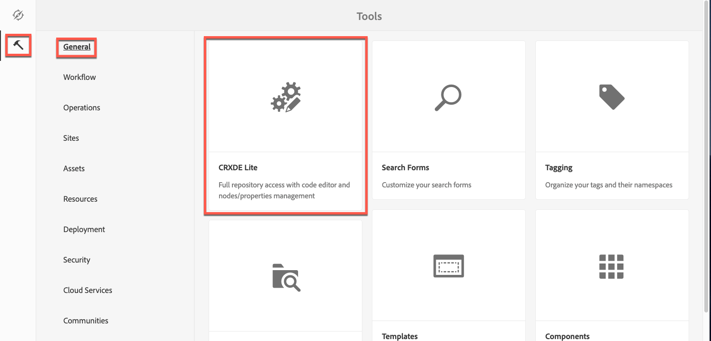

# 關於設定Dynamic Media Cloud Service {#configuring-dynamic-media}

{{work-with-dynamic-media}}

如果您將Adobe Experience Manager as a Cloud Service用於不同的環境，例如開發、測試和即時生產，請為每個環境設定Dynamic Media雲端服務。

另請參閱[設定Dynamic Media公司別名帳戶](/help/assets/dynamic-media/dm-alias-account.md)

>[!IMPORTANT]
>
>增強式安全性環境中不支援&#x200B;**Dynamic Media (Scene7)**
>
>AEM as a Cloud Service上的Dynamic Media (Scene7)尚未符合HIPAA標準，因此無法用於已啟用「增強式安全性」的AEM環境。
>
>從2025年4月AEM as a Cloud Service發行版本開始，技術限制可防止在增強安全性的環境中設定Dynamic Media (Scene7)。 因此，**工具** > **雲端服務**&#x200B;底下的&#x200B;**Dynamic Media設定**&#x200B;卡不再顯示在這些環境中。
>
>此外，使用AEM 6.5的客戶應注意Dynamic Media (Scene7)棧疊尚未準備好使用HIPAA。

## Dynamic Media架構圖 {#architecture-diagram-of-dynamic-media}

下列架構圖表說明Dynamic Media的運作方式。

透過新架構，Experience Manager負責主要來源資產並與Dynamic Media同步，以處理及發佈資產：

1. 主要來源資產上傳至Adobe Experience Manager as a Cloud Service後，會複製到Dynamic Media。 屆時，Dynamic Media會處理所有資產處理和轉譯產生作業，例如視訊編碼和影像的動態變體。
1. 產生轉譯後，Experience Manager as a Cloud Service就可安全地存取及預覽遠端Dynamic Media轉譯(不會將二進位檔傳回Experience Manager as a Cloud Service執行個體)。
1. 內容準備好發佈並核准後，就會觸發Dynamic Media服務，將內容推送至傳遞伺服器，並在CDN （內容傳遞網路）快取內容。

>[!NOTE]
>
>下列功能清單需要您使用Adobe Experience Manager - Dynamic Media隨附的現成可用CDN。 這些功能不支援任何其他自訂CDN。
>
>* [智慧型影像](/help/assets/dynamic-media/imaging-faq.md)
>* [快取失效](/help/assets/dynamic-media/invalidate-cdn-cache-dynamic-media.md)
>* [直接連結保護](/help/assets/dynamic-media/hotlink-protection.md)
>* [HTTP/2內容傳遞](/help/assets/dynamic-media/http2faq.md)
>* cdn層級的URL重新導向
>* Akamai ChinaCDN （針對中國境內的最佳傳送方式）

<!-- OBSOLETE CONTENT

## (Optional) Migrating Dynamic Media presets and configurations from 6.3 to 6.5 Zero Downtime {#optional-migrating-dynamic-media-presets-and-configurations-from-to-zero-downtime}

If you are upgrading Experience Manager as a Cloud Service Dynamic Media from 6.3 to 6.4 or 6.5 (which now includes the ability for zero downtime deployments), you are required to run the following curl command to migrate all your presets and configurations from `/etc` to `/conf` in CRXDE Lite.

>[!NOTE]
>
>If you run your Experience Manager as a Cloud Service instance in compatibility mode--that is, you have the compatibility packaged installed--you do not need to run these commands.

For all upgrades, either with or without the compatibility package, you can copy the default, out-of-the-box viewer presets that originally came with Dynamic Media by running the following Linux curl command:

`curl -u admin:admin -X POST https://<server_address>:<server_port>/libs/settings/dam/dm/presets/viewer.pushviewerpresets.json`

To migrate any custom viewer presets and configurations that you have created from `/etc` to `/conf`, run the following Linux curl command:

`curl -u admin:admin -X POST https://<server_address>:<server_port>/libs/settings/dam/dm/presets.migratedmcontent.json`

-->

## 在雲端服務中建立Dynamic Media設定 {#configuring-dynamic-media-cloud-services}

<!-- **Before you creating a Dynamic Media Configuration in Cloud Services**: After you receive your provisioning email with Dynamic Media credentials, you must open the [Dynamic Media Classic desktop application](https://experienceleague.adobe.com/docs/dynamic-media-classic/using/getting-started/signing-out.html#getting-started), then sign in to your account to change your password. The password provided in the provisioning email is system-generated and intended to be a temporary password only. It is important that you update the password so that Dynamic Media Cloud Service is set up with the correct credentials. -->

1. 在Experience Manager as a Cloud Service中，選取Experience Manager as a Cloud Service標誌以存取全域導覽主控台。
1. 在主控台左側，選取[工具]圖示，然後前往&#x200B;**[!UICONTROL 雲端服務> Dynamic Media設定]**。
1. 在[Dynamic Media設定瀏覽器]頁面的左側窗格中，選取&#x200B;**[!UICONTROL 全域]** （不要選取&#x200B;**[!UICONTROL 全域]**&#x200B;左側的資料夾圖示）。 然後選取&#x200B;**[!UICONTROL 建立]**。
1. 在&#x200B;**[!UICONTROL 建立Dynamic Media設定]**&#x200B;頁面上，輸入Dynamic Media帳戶的公司管理員標題、Dynamic Media帳戶電子郵件地址和密碼，然後選取您的地區。 此資訊由Adobe在布建電子郵件中提供給您。 如果您沒有收到此電子郵件，請聯絡Adobe客戶支援。
1. 選取&#x200B;**[!UICONTROL 連線至Dynamic Media]**。
1. 在&#x200B;**[!UICONTROL 變更密碼]**&#x200B;對話方塊的&#x200B;**[!UICONTROL 新密碼]**&#x200B;欄位中，輸入包含8-25個字元的新密碼。 密碼至少必須包含下列其中一項：

   * 大寫字母
   * 小寫字母
   * 數字
   * 特殊字元： `# $ & . - _ : { }`

   **[!UICONTROL 目前密碼]**&#x200B;欄位是刻意預先填入且隱藏在互動中。

   如有必要，您可以選取密碼眼睛圖示來顯示密碼，以檢查您已輸入或重新輸入的密碼的拼字。 再次選取圖示以隱藏密碼。

1. 在&#x200B;**[!UICONTROL 重複密碼]**&#x200B;欄位中，重新輸入新密碼，然後選取&#x200B;**[!UICONTROL 完成]**。

   當您在&#x200B;**[!UICONTROL 建立Dynamic Media設定]**&#x200B;頁面的右上角選取「**[!UICONTROL 儲存]**」時，新密碼便會儲存。

   如果您在&#x200B;**[!UICONTROL 變更密碼]**&#x200B;對話方塊中選取&#x200B;**[!UICONTROL 取消]**，當您儲存已建立的Dynamic Media組態時，仍必須輸入新密碼。

   另請參閱[變更Dynamic Media密碼](#change-dm-password)。

1. 連線成功後，您可以設定下列專案：

   | 屬性 | 說明 |
   |---|---|
   | 公司 | Dynamic Media帳戶的名稱。 **重要**： Experience Manager的執行個體僅支援雲端服務中的一個Dynamic Media設定；請勿新增多個設定。 Adobe *不*&#x200B;支援或建議在單一Experience Manager執行個體上設定多個Dynamic Media設定。<!-- CQDOC-19579 and CQDOC-19612 --> 另請參閱[設定Dynamic Media公司別名帳戶](/help/assets/dynamic-media/dm-alias-account.md)。 |
   | 公司根資料夾路徑 | 您公司的根資料夾路徑。 |
   | 發佈Assets | 您可以從下列三個選項中選擇： **[!UICONTROL 立即&#x200B;]**— 上傳資產時，系統會內嵌資產並立即提供URL/內嵌。 發佈資產不需要使用者介入。 **[!UICONTROL 啟動時]** — 您必須先明確發佈資產，才能提供URL/內嵌連結。 **[!UICONTROL 選擇性發佈&#x200B;]**- Assets會自動發佈，但僅供安全預覽。 此外，您也可以將資料明確發佈至Experience Manager as a Cloud Service，無須發佈至DMS7再於公共網域中傳送。 此選項未來會將資產發佈至Experience Manager as a Cloud Service，並將資產發佈至Dynamic Media，兩者會互斥。 也就是說，您可以將資產發佈至DMS7，以使用智慧型裁切或動態轉譯等功能。 或者，您也可以僅在Experience Manager as a Cloud Service中發佈資產以供預覽。 這些相同的資產不會在DMS7中發佈，以傳送至公共網域。 |
   | 安全預覽伺服器 | 它可讓您指定安全轉譯預覽伺服器的URL路徑。 也就是說，產生轉譯後，AEM as a Cloud Service可以安全地存取及預覽遠端Dynamic Media轉譯(不會將二進位檔傳回Experience Manager as a Cloud Service執行個體)。 除非您有特殊安排使用您公司的伺服器或特殊伺服器，否則Adobe建議您保留此設定為指定的設定。 |
   | 同步處理所有內容 | 預設為選取。 如果您想要在同步至Dynamic Media時選擇性地包含或排除資產，請取消選取此選項。 取消選取此選項可讓您從下列兩個Dynamic Media同步模式中選擇： **[!UICONTROL Dynamic Media同步模式]** **[!UICONTROL 預設啟用&#x200B;]**— 除非您特別標籤要排除的資料夾，否則預設會套用至所有資料夾。 <!-- you can then deselect the folders that you do not want the configuration applied to.--> **[!UICONTROL 預設為停用]** — 在您明確標示選取的資料夾以同步處理至Dynamic Media之前，此設定不會套用至任何資料夾。 若要將選取的資料夾標示為同步處理至Dynamic Media，請選取資產資料夾，然後在工具列中選取&#x200B;**[!UICONTROL 內容]**。 在&#x200B;**[!UICONTROL 詳細資料]**&#x200B;標籤的&#x200B;**[!UICONTROL Dynamic Media同步模式]**&#x200B;下拉式清單中，從下列三個選項中選擇。 完成後，選取&#x200B;**[!UICONTROL 儲存]**。 _請記住：如果您先前選取了&#x200B;**同步所有內容**，則無法使用這三個選項。_&#x200B;另請參閱[在Dynamic Media的資料夾層級使用選擇性發佈](/help/assets/dynamic-media/selective-publishing.md)。 **[!UICONTROL 已繼承&#x200B;]**— 資料夾上沒有明確的同步值。 而是由資料夾從其中一個上階資料夾繼承同步值，或是從雲端設定中的預設模式繼承。 繼承的詳細狀態會透過工具提示顯示。 **[!UICONTROL 啟用子資料夾]** — 包含此子樹狀結構中的所有專案，以便同步至Dynamic Media。 資料夾特定的設定會覆寫雲端設定中的預設模式。 **[!UICONTROL 已停用子資料夾&#x200B;]**— 排除此子樹狀結構中的所有專案，使其無法同步至Dynamic Media。 |

   >[!NOTE]
   >
   >動態媒體中不支援版本修訂。此外，只有在「編輯動態媒體設定」頁面中的&#x200B;**[!UICONTROL 發佈Assets]**&#x200B;設定為&#x200B;**[!UICONTROL 啟動時]**&#x200B;時，延遲啟動才適用。 然後，直到第一次啟動資產為止。
   >
   >
   >資產啟動後，所有更新都會立即上線發佈至S7傳送。

   

1. 選取&#x200B;**[!UICONTROL 儲存]**。新的Dynamic Media密碼和設定已儲存。 如果您選取&#x200B;**[!UICONTROL 取消]**，則不會更新密碼。
1. 在&#x200B;**[!UICONTROL 設定Dynamic Media]**&#x200B;對話方塊中，選取&#x200B;**[!UICONTROL 確定]**&#x200B;開始設定。

   >[!IMPORTANT]
   >
   >新的Dynamic Media組態完成設定時，您會在Experience Manager as a Cloud Service收件匣內收到狀態通知。
   >
   >此收件匣通知會通知您設定是否成功。
   > 如需詳細資訊，請參閱[新Dynamic Media組態疑難排解](#troubleshoot-dm-config)和[您的收件匣](/help/sites-cloud/authoring/inbox.md)。

1. 為了在發佈Dynamic Media內容之前安全地預覽該內容，Experience Manager as a Cloud Service會使用權杖型驗證，因此Experience Manager Author預設會預覽Dynamic Media內容。 不過，您可以&#x200B;*加入允許清單*&#x200B;更多IP，讓使用者能夠安全地預覽內容。 若要在Experience Manager as a Cloud Service中設定此動作，請參閱[設定影像伺服器的Dynamic Media發佈設定 — 安全性索引標籤](/help/assets/dynamic-media/dm-publish-settings.md#security-tab)。<!-- To securely preview Dynamic Media content before it gets published, you must "allowlist" the Experience Manager as a Cloud Service author instance to connect to Dynamic Media. To set up this action, do the following: -->

<!--
    * Open the [Dynamic Media Classic desktop application](https://experienceleague.adobe.com/docs/dynamic-media-classic/using/getting-started/signing-out.html#getting-started), then sign in to your account. Your credentials and sign-in details were provided by Adobe at the time of provisioning. If you do not have this information, contact Adobe Customer Support.
    * On the navigation bar near the upper right corner of the page, go to **[!UICONTROL Setup]** > **[!UICONTROL Application Setup]** > **[!UICONTROL Publish Setup]** > **[!UICONTROL Image Server]**.
    * On the Image Server Publish page, in the **[!UICONTROL Publish Context]** drop-down list, select **[!UICONTROL Test Image Serving]**.
    * For the Client Address Filter, select **[!UICONTROL Add]**.
    * To enable (turn on) the address, select the check box, then enter the IP address of the Experience Manager Author instance (not Dispatcher IP).
    * Select **[!UICONTROL Save]**. -->

您現在已經完成基本設定，可以開始使用Dynamic Media了。

如果您想要進一步自訂設定，例如啟用ACL （存取控制清單）許可權，您可以選擇在[在Dynamic Media中設定進階設定](#optional-configuring-advanced-settings-in-dynamic-media-scene-mode)下完成任何工作。

### 疑難排解新的Dynamic Media設定 {#troubleshoot-dm-config}

新的Dynamic Media組態完成設定時，您會在Experience Manager as a Cloud Service收件匣內收到狀態通知。 此通知會通知您組態是否成功，如下列收件匣中個別影像所示。

另請參閱[您的收件匣](/help/sites-cloud/authoring/inbox.md)。

**若要疑難排解新的Dynamic Media組態：**

1. 在Experience Manager as a Cloud Service頁面的右上角附近，選取鈴鐺圖示，然後選取&#x200B;**[!UICONTROL 全部檢視]**。
1. 在收件匣頁面上，選取成功通知以讀取設定的狀態和記錄檔的概觀。

   如果設定失敗，請選取與下列熒幕擷圖類似的失敗通知。

   

1. 在&#x200B;**[!UICONTROL DMSETUP]**&#x200B;頁面上，檢閱描述失敗的組態詳細資訊。 請特別記下任何錯誤訊息或錯誤代碼。 如需此資訊，請聯絡Adobe客戶支援。

   

### 變更Dynamic Media密碼 {#change-dm-password}

Dynamic Media中的密碼到期日設為目前系統日期起的100年。

密碼至少必須包含下列其中一項：

* 大寫字母
* 小寫字母
* 數字
* 特殊字元： `# $ & . - _ : { }`

如有必要，您可以選取密碼眼睛圖示來顯示密碼，以檢查您已輸入或重新輸入的密碼的拼字。 再次選取圖示以隱藏密碼。

當您在&#x200B;**[!UICONTROL 編輯Dynamic Media設定]**&#x200B;頁面的右上角選取&#x200B;**[!UICONTROL 儲存]**&#x200B;時，變更的密碼便會儲存。

1. 在Experience Manager as a Cloud Service中，選取Experience Manager as a Cloud Service標誌以存取全域導覽主控台。
1. 在主控台左側，選取[工具]圖示，然後前往&#x200B;**[!UICONTROL 雲端服務> Dynamic Media設定]**。
1. 在[Dynamic Media設定瀏覽器]頁面的左窗格中，選取&#x200B;**[!UICONTROL 全域]**。 請勿選取&#x200B;**[!UICONTROL 全域]**&#x200B;左側的資料夾圖示。 然後，選取&#x200B;**[!UICONTROL 編輯]**。
1. 在&#x200B;**[!UICONTROL 編輯Dynamic Media組態]**&#x200B;頁面的&#x200B;**[!UICONTROL 密碼]**&#x200B;欄位正下方，選取&#x200B;**[!UICONTROL 變更密碼]**。
1. 在&#x200B;**[!UICONTROL 變更密碼]**&#x200B;對話方塊中，執行下列動作：

   * 在&#x200B;**[!UICONTROL 新密碼]**&#x200B;欄位中輸入新密碼。

     **[!UICONTROL 目前密碼]**&#x200B;欄位是刻意預先填入且隱藏在互動中。

   * 在&#x200B;**[!UICONTROL 重複密碼]**&#x200B;欄位中，重新輸入新密碼，然後選取&#x200B;**[!UICONTROL 完成]**。

1. 在&#x200B;**[!UICONTROL 編輯Dynamic Media設定]**&#x200B;頁面的右上角，選取&#x200B;**[!UICONTROL 儲存]**，然後選取&#x200B;**[!UICONTROL 確定]**。

## （選用）在Dynamic Media中設定進階設定{#optional-configuring-advanced-settings-in-dynamic-media-scene-mode}

若要進一步自訂Dynamic Media的組態和設定，或最佳化其效能，您可以完成下列一或多個&#x200B;_選擇性_&#x200B;工作：

* [（選用）在Dynamic Media中啟用ACL許可權](#optional-enable-acl)
* [（選用）動態媒體設定的設定和組態](#optional-setup-and-configuration-of-dynamic-media-scene-mode-settings)
* [（可選）調整Dynamic Media的效能](#optional-tuning-the-performance-of-dynamic-media-scene-mode)

<!--

* [(Optional) Filtering assets for replication](#optional-filtering-assets-for-replication)

-->

<!-- Removed as per CQDOC-20701 - May need to revisit and update. In Adobe Experience Manager (AEM) as a Cloud Service, enabling Access Control List (ACL) permissions for Dynamic Media requires a different approach compared to on-premise versions (which was described below), as direct editing of OSGi configurations via the UI is not supported. Not sure how this is done now. For example, you can manage ACLs using tools like the Netcentric Access Control Tool (AC Tool), which simplifies the specification and deployment of complex ACLs in AEM but I doubt that's the recommended method.

### (Optional) Enable Access Control List permissions in Dynamic Media {#optional-enable-acl}

When you run Dynamic Media on AEM as a Cloud Service, it currently forwards `/is/image` requests to Secure Preview Image Serving without checking ACL (Access Control List) permissions on the PlatformServerServlet. You can, however, _enable_ ACL permissions. Doing so forwards the authorized `/is/image` requests. If a user is not authorized to access the asset, a "403 - Forbidden" error is displayed.

**To enable Access Control List permissions in Dynamic Media on AEM as a Cloud Service:**

1. From Adobe Experience Manager, navigate to **[!UICONTROL Tools]** > **[!UICONTROL Operations]** > **[!UICONTROL Web Console]**.

   

1. A new browser tab opens to the **[!UICONTROL Adobe Experience Manager Web Console Configuration]** page.

   

1. On the page, scroll to the name _Adobe CQ Scene7 PlatformServer_.

1. To the right of the name, select the pencil icon (**[!UICONTROL Edit the configuration values]**).

1. On the **com.adobe.cq.dam.s7imaging.impl.ps.PlatformServerServlet.name** page, select the check box for the following two settings:

   * `com.adobe.cq.dam.s7imaging.impl.ps.PlatformServerServlet.cache.enable.name` &ndash; When enabled, this setting caches permission results for two minutes (default) to save.
   * `com.adobe.cq.dam.s7imaging.impl.ps.PlatformServerServlet.validate.userAccess.name` &ndash; When enabled, this setting validates a user's access while they preview assets by way of Dynamic Media Image Server.

   

1. Near the lower-right corner of the page, select **[!UICONTROL Save]**.
-->

### （選用）動態媒體設定的設定和組態 {#optional-setup-and-configuration-of-dynamic-media-scene-mode-settings}

使用Dynamic Media Classic使用者介面變更您的Dynamic Media設定。

<!-- Some of the tasks above require that you open the [Dynamic Media Classic desktop application](https://experienceleague.adobe.com/docs/dynamic-media-classic/using/getting-started/signing-out.html#getting-started), then sign in to your account. -->

設定和組態工作包括下列各項：

* [設定影像伺服器的Dynamic Media發佈設定](#publishing-setup-for-image-server)
* [設定Dynamic Media一般設定](#configuring-application-general-settings)
* [設定色彩管理](#configuring-color-management)
* [編輯支援格式的MIME型別](#editing-mime-types-for-supported-formats)
* [針對不支援的格式新增MIME型別](#adding-mime-types-for-unsupported-formats)
<!-- OBSOLETE BUT LEAVE FOR POSSIBLE FUTURE* [Creating batch set presets to auto-generate Image Sets and Spin Sets](#creating-batch-set-presets-to-auto-generate-image-sets-and-spin-sets) -->

#### 設定影像伺服器的Dynamic Media發佈設定 {#publishing-setup-for-image-server}

「Dynamic Media發佈設定」頁面會建立預設設定，用來決定如何從Adobe Dynamic Media伺服器將資產傳送至網站或應用程式。

請參閱[設定影像伺服器的Dynamic Media發佈設定](/help/assets/dynamic-media/dm-publish-settings.md)。

#### 設定Dynamic Media一般設定 {#configuring-application-general-settings}

設定Dynamic Media **[!UICONTROL 發佈伺服器名稱]** URL和&#x200B;**[!UICONTROL 原始伺服器名稱]** URL。 您也可以指定&#x200B;**[!UICONTROL 上載至應用程式]**&#x200B;設定和&#x200B;**[!UICONTROL 預設上載選項]**，全部根據您的特定使用案例。

請參閱[設定Dynamic Media一般設定](/help/assets/dynamic-media/dm-general-settings.md)。

#### 設定色彩管理 {#configuring-color-management}

Dynamic Media色彩管理可讓您校正資產的色彩。 透過色彩校正，擷取的資產可保留其色域(RGB、CMYK、灰色)和內嵌色彩設定檔。 當您要求動態轉譯時，會使用CMYK、RGB或灰階輸出將影像顏色校正到目標色域。

請參閱[設定影像預設集](/help/assets/dynamic-media/managing-image-presets.md)。

若要設定預設色彩屬性，以便在要求影像時啟用色彩校正：

1. 開啟[Dynamic Media Classic案頭應用程式](https://experienceleague.adobe.com/en/docs/dynamic-media-classic/using/getting-started/signing-out#getting-started)，然後使用布建期間提供的認證登入您的帳戶。
1. 移至&#x200B;**[!UICONTROL 設定>應用程式設定]**。
1. 展開「發 **[!UICONTROL 布設定]** 」區域並選 **[!UICONTROL 取「影像伺服器」]**。設定發 **[!UICONTROL 布例項的預設值]** ，將「發佈內容」設 **&#x200B;**&#x200B;定為「影像伺服」。
1. 捲動至您必須變更的屬性，例如&#x200B;**[!UICONTROL 色彩管理屬性]**&#x200B;區域中的屬性。
您可以設定下列色彩校正屬性：

   | 屬性 | 說明 |
   |---|---|
   | CMYK預設色域 | 預設CMYK色彩設定檔的名稱。 |
   | 灰階預設色域 | 預設灰階色彩設定檔的名稱。 |
   | RGB預設色域 | 預設RGB色彩設定檔的名稱。 |
   | 色彩轉換色彩演算比對方式 | 指定演算色彩比對方式。 可接受的值為： **[!UICONTROL 感應式]**、**[!UICONTROL 相對色度]**、**[!UICONTROL 飽和度]**、**[!UICONTROL 絕對色度]**。 Adobe建議使用&#x200B;**[!UICONTROL 相對]**&#x200B;作為預設值。 |

1. 選取「**[!UICONTROL 儲存]**」。

例如，您可以將「 **[!UICONTROL RGB預設顏色空間]** 」設 *為sRGB*，將「 **[!UICONTROL CMYK預設顏色空間」設為]**&#x200B;** WebCobatedCholor。

這麼做會執行下列動作：

* 啟用RGB和CMYK影像的色彩校正。
* 沒有色彩設定檔的RGB影像會假設在&#x200B;*sRGB*&#x200B;色域中。
* 沒有色彩設定檔的CMYK影像被假設為&#x200B;*WebCoated*&#x200B;色域。
* 傳回RGB輸出的動態轉譯，以&#x200B;*sRGB*&#x200B;色域傳回。
* 傳回CMYK輸出的動態轉譯，在&#x200B;*WebCoated*&#x200B;色域中傳回。

#### 編輯支援格式的MIME型別 {#editing-mime-types-for-supported-formats}

您可以指定Dynamic Media處理的資產型別，並自訂進階資產處理引數。 例如，您可以指定資產處理引數，以執行下列作業：

* 將Adobe PDF轉換為eCatalog資產。
* 將Adobe Photoshop檔案(.PSD)轉換為橫幅範本資產以進行個人化。
* 點陣化Adobe Illustrator檔案(.AI)或Adobe Photoshop封裝的PostScript®檔案(.EPS)。
* [視訊設定檔](/help/assets/dynamic-media/video-profiles.md)和[影像設定檔](/help/assets/dynamic-media/image-profiles.md)分別可用來定義視訊和影像的處理方式。

請參閱[上傳資產](/help/assets/add-assets.md)。

**若要編輯支援格式的MIME型別：**

1. 以產品管理員身分登入您的Experience Manager as a Cloud Service 。
1. 在Experience Manager as a Cloud Service中，選取Experience Manager as a Cloud Service標誌以存取全域導覽主控台，然後前往&#x200B;**[!UICONTROL 一般> CRXDE Lite]**。

   如果您沒有CRXDE Lite的存取權，請參閱[使用CRXDE Lite](/help/implementing/developing/tools/crxde.md)。

1. 在左側邊欄中，導覽至下列專案：

   `/conf/global/settings/cloudconfigs/dmscene7/jcr:content/mimeTypes`

   

1. 在mimeTypes資料夾下，選取MIME型別。
1. 在CRXDE Lite頁面的右側，下半部：

   * 連按兩下&#x200B;**[!UICONTROL 已啟用]**&#x200B;欄位。 預設會啟用所有資產MIME型別（設為&#x200B;**[!UICONTROL true]**），這表示資產會同步至Dynamic Media進行處理。 如果您要排除此資產MIME型別而不進行處理，請將此設定變更為&#x200B;**[!UICONTROL false]**。

   * 連按兩下&#x200B;**[!UICONTROL jobParam]**&#x200B;以開啟其相關的文字欄位。 如需可用於指定MIME型別的允許處理引數值清單，請參閱[支援的MIME型別](/help/assets/file-format-support.md)。

1. 執行下列任一項作業：
   * 重複步驟3至4以編輯更多MIME型別。
   * 在CRXDE Lite頁面的功能表列上，選取「**[!UICONTROL 儲存全部]**」。

1. 在頁面的左上角，選取&#x200B;**[!UICONTROL CRXDE Lite]**&#x200B;以返回Experience Manager as a Cloud Service。

#### 針對不支援的格式新增MIME型別 {#adding-mime-types-for-unsupported-formats}

您可以針對Experience Manager Assets中不支援的格式新增自訂MIME型別。 若要防止Experience Manager刪除您在CRXDE Lite中新增的任何新節點，請將MIME型別移動到`image_`之前。 另外，請確定它的啟用值設定為&#x200B;**[!UICONTROL false]**。

**若要針對不支援的格式新增MIME型別：**

1. 以產品管理員身分登入您的Experience Manager as a Cloud Service 。
1. 從Experience Manager as a Cloud Service，前往&#x200B;**[!UICONTROL 工具>作業> Web主控台]**。

   

1. 新的瀏覽器標籤會開啟&#x200B;**[!UICONTROL Adobe Experience Manager Web主控台組態]**&#x200B;頁面。

   

1. 在頁面上，向下捲動至名稱&#x200B;*Adobe CQ Scene7 asset MIME型別Service*，如下列熒幕擷取所示。 在名稱的右側，選取&#x200B;**[!UICONTROL 編輯組態值]** （鉛筆圖示）。

   

1. 在&#x200B;**Adobe CQ Scene7 Asset MIME type Service**&#x200B;頁面上，選取任何加號圖示&lt;+>。 在表格中選取加號以新增新MIME型別的位置並不重要。

   

1. 在您剛新增的空白文字欄位中輸入`DWG=image/vnd.dwg`。

   `DWG=image/vnd.dwg` MIME型別僅供範例使用。 您在此處新增的MIME型別可以是任何其他不支援的格式。

   

1. 在頁面的右下角，選取&#x200B;**[!UICONTROL 儲存]**。

   此時，您可以關閉已開啟Adobe Experience Manager Web主控台設定頁面的瀏覽器索引標籤。

1. 返回已開啟Experience Manager as a Cloud Service主控台的瀏覽器標籤。
1. 從Experience Manager as a Cloud Service，前往&#x200B;**[!UICONTROL 工具>一般> CRXDE Lite]**。

   如果您沒有CRXDE Lite的存取權，請參閱[使用CRXDE Lite](/help/implementing/developing/tools/crxde.md)。

   

1. 在左側邊欄中，導覽至下列專案：

   `conf/global/settings/cloudconfigs/dmscene7/jcr:content/mimeTypes`

1. 將MIME型別`image_vnd.dwg`拖放到樹狀結構中`image_`的正上方，如下列熒幕擷圖所示。

   

1. 在MIME型別`image_vnd.dwg`仍被選取的情況下，從&#x200B;**[!UICONTROL 屬性]**&#x200B;索引標籤的&#x200B;**[!UICONTROL 已啟用]**&#x200B;列，在&#x200B;**[!UICONTROL 值]**&#x200B;欄標題下，雙選值。 **[!UICONTROL 值]**&#x200B;下拉式清單已開啟。
1. 在欄位中輸入`false` （或從下拉式清單中選取&#x200B;**[!UICONTROL false]**）。

   

1. 在CRXDE Lite頁面的左上角附近，選取&#x200B;**[!UICONTROL 全部儲存]**。

### （可選）調整Dynamic Media的效能 {#optional-tuning-the-performance-of-dynamic-media-scene-mode}

為了讓Dynamic Media持續順暢運作，Adobe建議使用下列同步效能/可擴充性微調秘訣：

* [更新預先定義的作業引數，以處理不同的檔案格式](#update-job-para)。
* [更新預先定義的Granite工作流程佇列（視訊資產）背景工作執行緒](#update-granite-workflow-queue-worker-threads-video)
* [更新預先定義的Granite暫時性工作流程佇列（影像和非視訊資產）工作者執行緒](#update-granite-transient-workflow-queue-worker-threads-images)。
* [更新與Dynamic Media Classic (Scene7)伺服器的最大上傳連線數](#update-max-s7-upload-connections)。

#### 更新預先定義的作業引數以處理不同的檔案格式 {#update-job-para}

您可以調整工作引數，以便在上傳檔案時更快地處理。 例如，如果您上傳PSD檔案，但不想以範本處理這些檔案，您可以將圖層擷取設為false （關閉）。 在這種情況下，調整的工作引數會顯示如下： `process=None&createTemplate=false`。

如果您確實要開啟範本建立，請使用下列引數： `process=MaintainLayers&layerNaming=AppendName&createTemplate=true`。

<!-- THIS PARAGRAPH WAS REPLACED WITH THE TWO PARAGRAPHS DIRECTLY ABOVE BASED ON CQDOC-17657 You can tune job parameters for faster processing when you upload files. For example, if you are uploading PSD files, but do not want to process them as templates, you can set layer extraction to false (off). In such case, the tuned job parameter would appear as `process=None&createTemplate=false`. -->

Adobe建議對PDF、PostScript®和PSD檔案使用下列「調整」工作引數：

| 檔案類型 | 建議的工作引數 |
| ---| ---|
| PDF | `pdfprocess=Rasterize&resolution=150&colorspace=Auto&pdfbrochure=false&keywords=false&links=false` |
| PostScript® | `psprocess=Rasterize&psresolution=150&pscolorspace=Auto&psalpha=false&psextractsearchwords=false&aiprocess=Rasterize&airesolution=150&aicolorspace=Auto&aialpha=false` |
| PSD | `process=None&layerNaming=AppendName&anchor=Center&createTemplate=false&extractText=false&extendLayers=false` |

<!-- CQDOC-17657 for PSD entry in table above -->

若要更新任何這些引數，請參閱[編輯支援格式的MIME型別](#editing-mime-types-for-supported-formats)。

另請參閱[新增不支援格式的MIME型別](#adding-mime-types-for-unsupported-formats)。

#### 更新預先定義的Granite工作流程佇列（視訊資產）背景工作執行緒 {#update-granite-workflow-queue-worker-threads-video}

Granite工作流程佇列用於非暫時性工作流程。 在Dynamic Media中，它是用來處理&#x200B;**[!UICONTROL Dynamic Media編碼視訊]**&#x200B;工作流程的視訊。

>[!NOTE]
>
>您必須以產品管理員身分登入Experience Manager as a Cloud Service，才能完成此工作。

如果您沒有OSGi的存取權，請參閱[OSGi設定](/help/implementing/developing/components/overview.md#osgi-configuration)。

**若要更新預先定義的Granite工作流程佇列（視訊資產）背景工作執行緒：**

1. 瀏覽至`https://<server>/system/console/configMgr`並搜尋&#x200B;**佇列： Granite工作流程佇列**。

   >[!NOTE]
   >
   >必須進行文字搜尋，而非直接URL，因為OSGi PID是動態產生的。

1. 在&#x200B;**[!UICONTROL 最大平行工作]**&#x200B;欄位中，將數字變更為所要的值。

   根據預設，平行作業的最大數量取決於可用的CPU核心數量。 例如，在4核心伺服器上，它會指派兩個背景工作執行緒。 （介於0.0和1.0之間的值是以比率為基礎，或任何大於一的數字都會指定工作者執行緒的數量。）

   對於大多數使用案例，0.5的預設設定就足夠了。

   

1. 選取「**[!UICONTROL 儲存]**」。

#### 更新預先定義的Granite暫時工作流程佇列工作者執行緒 {#update-granite-transient-workflow-queue-worker-threads-images}

Granite傳輸工作流程佇列已用於&#x200B;**[!UICONTROL DAM更新資產]**&#x200B;工作流程。 在Dynamic Media中，它可用來擷取及處理影像及非視訊資產。

>[!NOTE]
>
>您必須以產品管理員身分登入Experience Manager as a Cloud Service，才能完成此工作。

**若要更新預先定義的Granite暫時性工作流程佇列工作者執行緒：**

1. 瀏覽至`http://<host>:<port>/system/console/configMgr`的&#x200B;**Adobe Experience Manager Web Console設定**
1. 搜尋&#x200B;**佇列： Granite暫時性工作流程佇列**。

   >[!NOTE]
   >
   >必須進行文字搜尋，而非直接URL，因為OSGi PID是動態產生的。

1. 在&#x200B;**[!UICONTROL 最大平行工作]**&#x200B;欄位中，將數字變更為所要的值。

   您可以增加&#x200B;**[!UICONTROL 個最大平行工作]**，以充分支援將大量檔案上傳至Dynamic Media。 確切的值取決於硬體容量。 在某些情況下（例如初始移轉或一次性大量上傳），您可以使用大型值。 但是請注意，使用很大的數值（例如核心數的兩倍）可能會對其他並行活動產生負面影響。 因此，請根據您的特定使用案例來測試和調整值。

<!--    By default, the maximum number of parallel jobs depends on the number of available CPU cores. For example, on a 4-core server, it assigns 2 worker threads. (A value between 0.0 and 1.0 is ratio based, or any numbers greater than 1 will assign the number of worker threads.)

   Adobe recommends that 32 **[!UICONTROL Maximum Parallel Jobs]** be configured to adequately support heavy upload of files to Dynamic Media Classic. -->

1. 選取「**[!UICONTROL 儲存]**」。

#### 更新與Dynamic Media Classic (Scene7)伺服器的最大上傳連線 {#update-max-s7-upload-connections}

Dynamic Media Classic (Scene7)上傳連線設定會將Experience Manager資產同步至Dynamic Media Classic伺服器。

>[!NOTE]
>
>您必須以產品管理員身分登入Experience Manager as a Cloud Service，才能完成此工作。

**若要更新與Dynamic Media Classic (Scene7)伺服器的最大上傳連線：**

1. 瀏覽至`https://<server>/system/console/configMgr/com.day.cq.dam.scene7.impl.Scene7UploadServiceImpl`
1. 在&#x200B;**[!UICONTROL 連線數目]**&#x200B;欄位或&#x200B;**[!UICONTROL 作用中作業逾時]**&#x200B;欄位中，或兩者中，視需要變更數目。

   **[!UICONTROL 連線數目]**&#x200B;設定會控制Experience Manager允許的HTTP連線數目上限，以上傳至Dynamic Media。 通常預先定義的十個連線值就足夠了。

   **[!UICONTROL 作用中工作逾時]**&#x200B;設定會定義系統等待傳遞伺服器發佈已上傳之Dynamic Media資產的時間長度。 此值預設為2100秒或35分鐘。

   對於大多數使用案例，設定2100已足夠。

   

1. 選取「**[!UICONTROL 儲存]**」。

<!-- NOTE - OBSOLETE that customisations to replication agents to transform content are no longer used; the following content is obsolete now 

### (Optional) Filtering assets for replication {#optional-filtering-assets-for-replication}

In non-Dynamic Media deployments, you replicate *all* assets (both images and video) from your Experience Manager as a Cloud Service author environment to the Experience Manager as a Cloud Service publish node. This workflow is necessary because the Experience Manager as a Cloud Service publish servers also deliver the assets.

However, in Dynamic Media deployments, because assets are delivered by way of the cloud service, there is no need to replicate those same assets to Experience Manager as a Cloud Service publish nodes. Such a "hybrid publishing" workflow avoids extra storage costs and longer processing times to replicate assets. Other content, such as Site pages, continue to be served from the Experience Manager as a Cloud Service publish nodes.

The filters provide a way for you to *exclude* assets from being replicated to the Experience Manager as a Cloud Service publish node.

#### Using default asset filters for replication {#using-default-asset-filters-for-replication}

If you are using Dynamic Media for imaging and/or video, then you can use the default filters that we provide as-is. The following filters are active by default:

<table>
 <tbody>
  <tr>
   <td> </td>
   <td><strong>Filter</strong></td>
   <td><strong>Mimetype</strong></td>
   <td><strong>Renditions</strong></td>
  </tr>
  <tr>
   <td>Dynamic Media Image Delivery</td>
   <td>
filter-images
 
filter-sets
 
 
 </td>
   <td>
Starts with <strong>image/</strong>
 
Contains <strong>application/</strong> and ends with <strong>set</strong>.
 </td>
   <td>The out-of-the-box "filter-images" (applies to single images assets, including interactive images) and "filter-sets" (applies to Spin Sets, Image Sets, Mixed Media Sets, and Carousel Sets) will:
    <ul>
     <li>Exclude from replication the original image and static image renditions.</li>
    </ul> </td>
  </tr>
  <tr>
   <td>Dynamic Media Video Delivery</td>
   <td>filter-video</td>
   <td>Starts with <strong>video/</strong></td>
   <td>The out-of-the-box "filter-video" will:
    <ul>
     <li>Exclude from replication the original video and static thumbnail renditions.    </li>
    </ul> </td>
  </tr>
 </tbody>
</table>

>[!NOTE]
>
>Filters apply to mime types and cannot be path specific.

#### Customizing asset filters for replication {#customizing-asset-filters-for-replication}

1. In Experience Manager as a Cloud Service, select the Experience Manager as a Cloud Service logo to access the global navigation console and select the **[!UICONTROL Tools > General > CRXDE Lite]**.
1. In the left folder tree, navigate to `/etc/replication/agents.author/publish/jcr:content/damRenditionFilters` to review the filters.

   

1. To define the Mime Type for the filter, you can locate the Mime Type as follows:

   In the left rail, expand `content > dam > <locate_your_asset> > jcr:content > metadata`, and then in the table, locate `dc:format`.

   The following graphic is an example of an asset's path to `dc:format`.

   

   Notice that the `dc:format` for the asset `Fiji Red.jpg` is `image/jpeg`.

   To have this filter apply to all images, regardless of their format, set the value to `image/*` where `*` is a regular expression that is applied to all images of any format.

   To have the filter apply only to images of the type JPEG, enter a value of `image/jpeg`.

1. Define what renditions you want to include or exclude from replication.

   Characters that you can use to filter for replication include the following:

<table>
 <tbody>
  <tr>
   <td><strong>Character to use</strong></td>
   <td><strong>How it filters assets for replication</strong></td>
  </tr>
  <tr>
   <td>*</td>
   <td>Wildcard character  </td>
  </tr>
  <tr>
   <td>+</td>
   <td>Includes assets for replication.</td>
  </tr>
  <tr>
   <td>-</td>
   <td>Excludes assets from replication.</td>
  </tr>
 </tbody>
</table>

   Navigate to `content/dam/<locate your asset>/jcr:content/renditions`.

   The following graphic is an example of an asset's renditions.

   

   If you only wanted to replicate the original, then you would enter `+original`.

   -->
