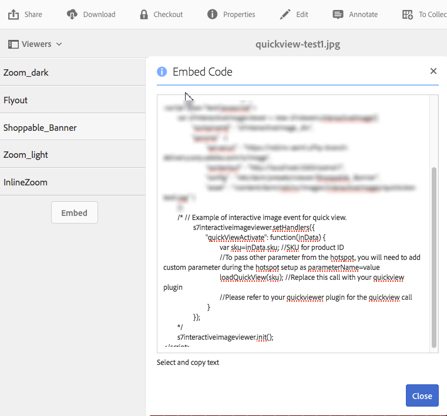

# 使用Quickview建立自定義彈出窗口 {#using-quickviews-to-create-custom-pop-ups}

預設的Quickview用於電子商務體驗中，在這種體驗中，彈出窗口會顯示產品資訊以驅動購買。 但是，您可以觸發要在彈出窗口中顯示的自定義內容。 根據您使用的查看器，客戶可以選擇熱點、縮略圖或影像映射以查看資訊或相關內容。

Quickview受Dynamic Media的以下查看者支援：

* 互動式影像（可選熱點）
* 互動式視頻（視頻播放期間可選擇的縮略圖）
* 旋轉傳送條幅（可選熱點或影像映射）

雖然每個查看器的功能不同，但建立Quickview的過程在所有三個受支援的查看器中都是相同的。

**要使用Quickview建立自定義彈出窗口：**

1. 為上載的資產建立快速視圖。

   通常，在編輯資產以供您使用的查看器使用時，您會建立Quickview。

   <table>
    <tbody>
    <tr>
    <td><strong>您正在使用的查看器</strong></td>
    <td><strong>要建立Quickview，請完成這些步驟</strong></td>
    </tr>
    <tr>
    <td>互動影像</td>
    <td><a href="/help/assets/dynamic-media/interactive-images.md#adding-hotspots-to-an-image-banner" target="_blank">向影像標題添加熱點</a>。</td>
    </tr>
    <tr>
    <td>互動影片</td>
    <td><a href="/help/assets/dynamic-media/interactive-videos.md#adding-interactivity-to-your-video" target="_blank">向視頻添加交互性</a>。</td>
    </tr>
    <tr>
    <td>輪播橫幅</td>
    <td><a href="/help/assets/dynamic-media/carousel-banners.md#adding-hotspots-or-image-maps-to-an-image-banner" target="_blank">將熱點或影像映射添加到橫幅</a>。<br /> </td>
    </tr>
    </tbody>
   </table>

1. 獲取查看器嵌入代碼以將查看器整合到您的網站中。

   <table>
    <tbody>
    <tr>
    <td><strong>您正在使用的查看器</strong><br /> </td>
    <td><strong>要將查看器與網站整合，請完成以下步驟</strong></td>
    </tr>
    <tr>
    <td>互動式影像</td>
    <td><a href="/help/assets/dynamic-media/interactive-images.md#integrating-an-interactive-image-with-your-website" target="_blank">將互動式影像與您的網站整合</a>。<br /> </td>
    </tr>
    <tr>
    <td>互動式視頻<br /> </td>
    <td><a href="/help/assets/dynamic-media/interactive-videos.md#integrating-an-interactive-video-with-your-website" target="_blank">將互動式視頻與您的網站整合</a>。<br /> </td>
    </tr>
    <tr>
    <td>旋轉木馬旗</td>
    <td><a href="/help/assets/dynamic-media/carousel-banners.md#adding-a-carousel-banner-to-your-website-page" target="_blank">將旋轉傳送標題添加到網站頁面</a>。<br /> </td>
    </tr>
    </tbody>
   </table>

1. 您使用的查看器必須知道如何使用Quickview。

   查看器使用名為 `QuickViewActive`。

   **示例**
假設您在網頁上對互動式影像使用了以下示例嵌入代碼：

   

   處理程式將使用 `setHandlers`:

   `*viewerInstance*.setHandlers({ *handler 1*, *handler 2*}, ...`

   **使用上面的示例嵌入代碼示例，您有以下代碼：**

   ```xml {.line-numbers}
   s7interactiveimageviewer.setHandlers({
       quickViewActivate": function(inData) {
           var sku=inData.sku;
           var genericVariable1=inData.genericVariable1;
           var genericVariable2=inData.genericVariable2;
          loadQuickView(sku,genericVariable1,genericVariable2);
       }
   })
   ```

   瞭解有關 `setHandlers()` 方法：

   * 互動式影像查看器 —  [塞安德勒](https://experienceleague.adobe.com/docs/dynamic-media-developer-resources/library/viewers-for-aem-assets-only/interactive-images/jsapi-interactive-image/r-html5-aem-int-image-viewer-javascriptapiref-sethandlers.html)
   * 互動式視頻查看器 —  [塞安德勒](https://experienceleague.adobe.com/docs/dynamic-media-developer-resources/library/viewers-for-aem-assets-only/interactive-video/jsapi-interactive-video/r-html5-aem-int-video-javascriptapiref-sethandlers.html)

1. 現在配置 `quickViewActivate` 處理程式。

   的 `quickViewActivate` 處理程式控制查看器中的Quickview。 處理程式包含要與Quickview一起使用的變數清單和函式調用。 嵌入代碼提供Quickview中SKU變數集的映射。 它還做了一個樣本 `loadQuickView` 函式。

   **變數映射**
將網頁中使用的變數映射到Quickview中包含的SKU值和泛型變數：

   `var *variable1*= inData.*quickviewVariable*`

   提供的嵌入代碼具有SKU變數的示例映射：

   `var sku=inData.sku`

   也從Quickview映射其他變數，如下所示：

   ```xml {.line-numbers}
   var <i>variable2</i>= inData.<i>quickviewVariable2</i>
    var <i>variable3</i>= inData.<i>quickviewVariable3</i>
   ```

   **函式調用**
處理程式還需要函式調用才能使Quickview工作。 假定主機頁可以訪問該函式。 嵌入代碼提供示例函式調用：

   `loadQuickView(sku)`

   示例函式調用假定函式 `loadQuickView()` 存在且可訪問。

   瞭解有關 `quickViewActivate` 方法：

   * 互動式影像查看器 —  [事件回調](https://experienceleague.adobe.com/docs/dynamic-media-developer-resources/library/viewers-for-aem-assets-only/interactive-images/c-html5-aem-interactive-image-event-callbacks.html)
   * 互動式視頻查看器 —  [事件回調](https://experienceleague.adobe.com/docs/dynamic-media-developer-resources/library/viewers-for-aem-assets-only/interactive-video/c-html5-aem-int-video-event-callbacks.html)
   * 互動式視頻查看器中的互動式資料支援 —  [互動式資料支援](https://experienceleague.adobe.com/docs/dynamic-media-developer-resources/library/viewers-for-aem-assets-only/interactive-video/c-html5-aem-int-video-int-data-support.html)

1. 請執行下列動作：

   * 取消對嵌入代碼的setHandlers節的注釋。
   * 映射Quickview中包含的任何其他變數。

      * 更新 `loadQuickView(sku,*var1*,*var2*)` 添加更多變數時調用。
   * 建立簡單 `loadQuickView` ()頁面上的函式，位於查看器外。

      例如，以下命令將SKU的值寫入瀏覽器控制台：

   ```xml {.line-numbers}
   function loadQuickView(sku){
       console.log ("quickview sku value is " + sku);
   }
   ```

   * 將testHTML頁上載到Web伺服器並開啟。

      將映射Quickview中的變數。 函式調用就位。 瀏覽器控制台將變數值寫入瀏覽器控制台。 它使用所提供的示例函式來執行此操作。


1. 現在，您可以使用函式在Quickview中調用簡單彈出窗口。 以下示例使用 `DIV` 按鈕。
1. 設定彈出窗口的樣式 `DIV` 按如下方式。 根據需要添加額外的樣式。

   ```xml {.line-numbers}
   <style type="text/css">
       #quickview_div{
           position: absolute;
           z-index: 99999999;
           display: none;
       }
   </style>
   ```

1. 將彈出窗口 `DIV` 在你的HTML頁上。

   其中一個元素使用ID進行設定，當用戶調用Quickview時，ID將用SKU值更新。 該示例還包括一個簡單按鈕，用於在彈出窗口可見後再次隱藏它。

   ```xml {.line-numbers}
   <div id="quickview_div" >
       <table>
           <tr><td><input id="btnClosePopup" type="button" value="Close"        onclick='document.getElementById("quickview_div").style.display="none"' /><br /></td></tr>
           <tr><td>SKU</td><td><input type="text" id="txtSku" name="txtSku"></td></tr>
       </table>
   </div>
   ```

1. 要在彈出窗口中更新SKU值，請添加一個函式。 將步驟5中建立的簡單函式替換為以下內容，使彈出窗口可見：

   ```xml {.line-numbers}
   <script type="text/javascript">
       function loadQuickView(sku){
           document.getElementById("txtSku").setAttribute("value",sku); // write sku value
           document.getElementById("quickview_div").style.display="block"; // show popup
       }
   </script>
   ```

1. 將testHTML頁上載到Web伺服器並開啟。 查看器顯示彈出窗口 `DIV` 調用Quickview時。
1. **如何以全屏模式顯示自定義彈出窗口**

   某些查看器（如互動式視頻查看器）支援全屏模式顯示。 但是，使用前面步驟中所述的彈出窗口會使其在全屏模式下顯示在查看器後面。

   要使彈出窗口以標準和全屏模式顯示，請將彈出窗口連接到查看器容器。 在這種情況下，使用第二個處理程式方法， `initComplete`。

   的 `initComplete` 在初始化查看器後調用處理程式。

   ```xml {.line-numbers}
   "initComplete":function() { code block }
   ```

   瞭解有關 `init()` 方法：

   * 互動式影像查看器 —  [初始化](https://experienceleague.adobe.com/docs/dynamic-media-developer-resources/library/viewers-for-aem-assets-only/interactive-images/jsapi-interactive-image/r-html5-aem-int-image-viewer-javascriptapiref-init.html)
   * 互動式視頻查看器 —  [初始化](https://experienceleague.adobe.com/docs/dynamic-media-developer-resources/library/viewers-for-aem-assets-only/interactive-video/jsapi-interactive-video/r-html5-aem-int-video-javascriptapiref-init.html)

1. 要將彈出窗口（如前面步驟中所述）附加到查看器，請使用以下代碼：

   ```xml {.line-numbers}
   "initComplete":function() {
       var popup = document.getElementById('quickview_div');
       popup.parentNode.removeChild(popup);
       var sdkContainerId = s7interactivevideoviewer.getComponent("container").getInnerContainerId();
       var inner_container = document.getElementById(sdkContainerId);
       inner_container.appendChild(popup);
   }
   ```

   在上述代碼中，您已執行以下操作：

   * 已識別您的自定義彈出窗口。
   * 已從DOM中刪除它。
   * 已標識查看器容器。
   * 已將彈出窗口連接到查看器容器。

1. 整個setHandlers代碼與以下代碼類似（使用了互動式視頻查看器）:

   ```xml {.line-numbers}
   s7interactivevideoviewer.setHandlers({
       "quickViewActivate": function(inData) {
           var sku=inData.sku;
           loadQuickView(sku);
   
       },
       "initComplete":function() {
           var popup = document.getElementById('quickview_div'); // get custom quick view container
           popup.parentNode.removeChild(popup); // remove it from current DOM
           var sdkContainerId = s7interactivevideoviewer.getComponent("container").getInnerContainerId();
           var inner_container = document.getElementById(sdkContainerId);
           inner_container.appendChild(popup);
       }
   });
   ```

1. 載入處理程式後，您將初始化查看器：

   `*viewerInstance.*init()`

   **示例**
此示例使用互動式影像查看器。

   `s7interactiveimageviewer.init()`

   將查看器嵌入到主機頁後，請確保已建立查看器實例。 另外，確保在使用 `init()`。
