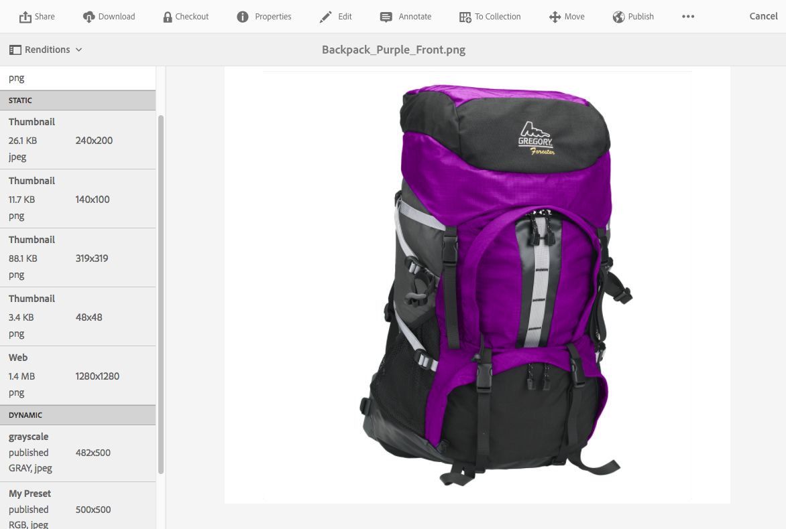

# 使用Dynamic Media {#working-with-dynamic-media}

[Dynamic Media](https://business.adobe.com/products/experience-manager/assets/dynamic-media.html) 可協助您隨需提供豐富的視覺化銷售和行銷資產，並自動調整規模以供網頁、行動裝置和社交網站使用。 Dynamic Media使用一組主要來源資產，透過其全球、可擴充、效能最佳化的網路，即時產生並提供多種豐富內容變異。

Dynamic Media提供互動式檢視體驗，包括縮放、360°回轉和視訊。 Dynamic Media獨特地整合了Adobe Experience Manager數位資產管理(Assets)解決方案的工作流程，以簡化和簡化數位行銷活動管理流程。

<!-- >[!NOTE]
>
>A Community article is available on [Working with Adobe Experience Manager and Dynamic Media](https://helpx.adobe.com/experience-manager/using/aem_dynamic_media.html). -->

## 你能用Dynamic Media做什麼 {#what-you-can-do-with-dynamic-media}

Dynamic Media可讓您在發佈資產之前先管理資產。 如何使用一般資產，將詳細說明 [使用數位資產](/help/assets/manage-digital-assets.md). 一般主題包括上傳、下載、編輯和發佈資產；檢視及編輯屬性，以及搜尋資產。

僅限Dynamic Media的功能包括下列項目：

* [輪播橫幅](carousel-banners.md)
* [影像集](image-sets.md)
* [互動影像](interactive-images.md)
* [互動影片](interactive-videos.md)
* [混合媒體集](mixed-media-sets.md)
* [全景影像](panoramic-images.md)

* [迴轉集](spin-sets.md)
* [影片](video.md)
* [傳送Dynamic Media資產](delivering-dynamic-media-assets.md)
* [管理資產](managing-assets.md)
* [使用快速視圖建立自定義彈出窗口®](custom-pop-ups.md)

另請參閱 [設定Dynamic Media](administering-dynamic-media.md).

<!-- 

OBSOLETE UNTIL INTEGRATING SCENE7 TOPIC GETS A MAJOR UPDATE
>[!NOTE]
>
>To understand the differences between using Dynamic Media and integrating Dynamic Media Classic with AEM, see [Dynamic Media Classic integration versus Dynamic Media](/help/sites-cloud/administering/integrating-scene7.md#aem-scene-integration-versus-dynamic-media).

-->

## Dynamic Media啟用與Dynamic Media停用 {#dynamic-media-on-versus-dynamic-media-off}

您可以借由下列特性來判斷Dynamic Media是否已啟用（開啟）:

* 下載或預覽資產時，可使用動態轉譯。
* 影像集、回轉集、混合媒體集皆可使用。
* 會建立PTIFF轉譯。

當您按一下影像資產時，啟用Dynamic Media時，資產的檢視會不同。 Dynamic Media使用隨需HTML5檢視器。

### 動態轉譯 {#dynamic-renditions}

動態轉譯，例如影像和檢視器預設集(位於 **[!UICONTROL 動態]**)即可使用。

### 影像集，旋轉集，混合媒體集 {#image-sets-spins-sets-mixed-media-sets}

如果已啟用Dynamic Media，則可使用影像集、回轉集和混合媒體集。

### PTIFF轉譯 {#ptiff-renditions}

Dynamic Media啟用的資產包括 `pyramid.tiffs`.

### 資產檢視變更 {#asset-views-change}

啟用Dynamic Media後，按一下 `+` 和 `-` 按鈕。 您也可以按一下/點選以放大至特定區域。 還原功能可將您帶到原始版本，您可以按一下對角線箭頭來使影像成為全螢幕。 啟用Dynamic Media的顯示如下：

停用Dynamic Media後，您可以放大和縮小並回復成原始大小：

