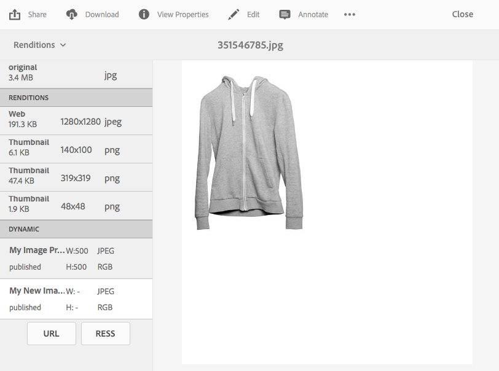

# 套用 Dynamic Media 影像預設集 {#applying-image-presets}

「影像預設集」可讓資產動態傳遞不同大小、不同格式的影像，或動態產生的其他影像屬性。 匯出影像時，您可以選擇預設集，並依管理員指定的規格重新格式化影像。

此外，您還可以選擇回應式影像預設集(在選取後由 **[!UICONTROL RESS]** 按鈕指定)。

本節說明如何使用影像預設集。 [管理員可以建立和設定影像預設集](managing-image-presets.md)。

>[!NOTE]
>
>智慧型影像功能可與您現有的影像預設集搭配使用，並在傳送時的最後一毫秒使用智慧功能，根據瀏覽器或網路連線速度進一步降低影像檔案大小。 如需詳 [細資訊](imaging-faq.md) ，請參閱智慧型影像。

您可以隨時預覽影像，將影像預設集套用至影像。

**套用動態媒體影像預設集**

1. 開啟資產，然後在左側導軌中，點選下拉式選單，然後點選「轉 **[!UICONTROL 譯」]**。

   >[!NOTE]
   >
   >* 靜態轉譯會顯示在窗格的上半部。 動態轉譯會出現在下半部。 只有動態轉譯時，您可以使用URL來顯示影像。 只有在 **[!UICONTROL 您選取動態轉譯時]** ，才會顯示「URL」按鈕。 只有在 **[!UICONTROL 您選取回應式影像預設集時]** ，才會顯示「RESS」按鈕。
      >
      >
   * The system shows numerous renditions when you select **[!UICONTROL Renditions]** in an asset&#39;s Detail view. 您可以增加所檢視的預設集數目。See [Increasing the number of image presets that display](managing-image-presets.md#increasing-or-decreasing-the-number-of-image-presets-that-display).

   

1. 執行下列任一操作：

   * 選取動態轉譯以預覽影像預設集。
   * Tap **[!UICONTROL URL]**, **[!UICONTROL Embed]**, or **[!UICONTROL RESS]** to display the pop-up.
   >[!NOTE]
   >
   >如果資產和 *影像預設集尚未發佈* ，則 **[!UICONTROL URL按鈕(或]** URL **[!UICONTROL 和]****** RESS按鈕 (如果適用) 不可用。
   >
   >另請注意，影像預設集會自動發佈在Dynamic Media S7伺服器上。

