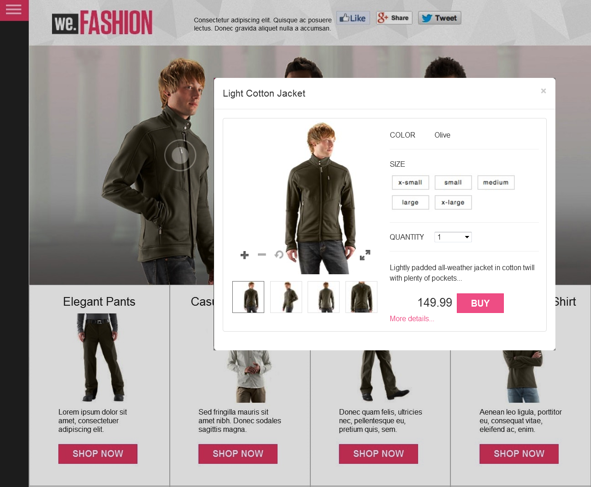

# 互動式影像{#interactive-images}

您可以將「可購物」熱點拖放至影像上，輕鬆讓靜態影像豐富吸引客戶的體驗。 可購物熱點結合有關產品或服務的其他資訊與直接的銷售點「加入購物車」或「購買」功能。 客戶可以選擇這些連結至產品或服務的熱點、將其新增至購物車，或連結至網頁。 這類直接體驗可提升客戶參與度和您網站上的轉換率。

以下是帶有「快速檢視」快顯視窗的可購物橫幅。 使用者點選模型上的圓形或「熱點」來啟動快速檢視。



在上圖所示的網頁上，檢視動作[&#128279;](https://experienceleague.adobe.com/tools/dynamic-media-demo/shoppable-banner/we-fashion-QVzoom/index2-shoppable.html?lang=zh-Hant)中的互動式影像。

## 觀看互動式影像橫幅的建立方式 {#watch-how-interactive-image-banners-are-created}

觀看[如何建立互動式影像橫幅的逐步解說](https://s7d5.scene7.com/s7viewers/html5/VideoViewer.html?videoserverurl=https://s7d5.scene7.com/is/content/&emailurl=https://s7d5.scene7.com/s7/emailFriend&serverUrl=https://s7d5.scene7.com/is/image/&config=Scene7SharedAssets/Universal_HTML5_Video_social&contenturl=https://s7d5.scene7.com/skins/&asset=S7tutorials/InteractiveCarouselBanner) （10分33秒）。 您也會瞭解如何預覽、編輯及傳遞互動式影像橫幅。

## 快速入門：互動影像 {#quick-start-interactive-images}

下列逐步工作流程說明可協助您在Adobe Experience Manager Assets中快速啟動並執行互動式影像。

在部分快速入門工作中尋找&#x200B;**範例**&#x200B;標題。 此教學課程包含以尚未新增互動影像的[網頁範例為基礎的簡短教學課程](https://experienceleague.adobe.com/tools/dynamic-media-demo/shoppable-banner/we-fashion/landing-0.html?lang=zh-Hant)。


本教學課程可協助您說明，如何將互動式影像整合在您自己的網站上。

互動影像步驟：

1. **（選擇性）識別熱點變數**。 如果您使用Adobe Experience Manager Assets和獨立的Dynamic Media，請識別在現有Quickview實作中使用的動態變數。 這麼做可確保您可以在建立互動式影像時輸入熱點資料。 請參閱[（選擇性）識別熱點變數](#optional-identifying-hotspot-variables)。
不過，如果您使用Experience Manager Sites或Experience Manager電子商務，或同時使用兩者，則不需要執行此步驟。

1. **（選擇性）建立互動式影像檢視器預設集**。 自訂用來表示熱點的圖形影像。 如果您打算改用名為`Shoppable_Banner`的現成互動影像檢視器預設集，則不需要建立自己的互動影像檢視器預設集。
請參閱[（選擇性）建立互動式影像檢視器預設集](/help/assets/dynamic-media/managing-viewer-presets.md#creating-a-new-viewer-preset)。

1. **上傳影像橫幅**。 上傳您想要互動的影像橫幅。
請參閱[上傳影像橫幅](#uploading-an-image-banner)。

1. **新增熱點至影像橫幅**。 新增一或多個熱點至影像橫幅。 將每個專案與超連結、快速檢視或體驗片段等動作建立關聯。 新增熱點後，您將發佈互動式影像來完成此工作。
請參閱[新增熱點至影像橫幅](#adding-hotspots-to-an-image-banner)。
請參閱[預覽互動式影像](#optional-previewing-interactive-images) — 選擇性。 如有需要，您可以檢視可購物橫幅的呈現方式，並測試其互動性。
如需如何發佈互動式影像資產的詳細資訊，請參閱[發佈Assets](/help/assets/dynamic-media/publishing-dynamicmedia-assets.md)。

1. **在Experience Manager中新增互動式影像至您的網站或網站**。 如果您使用Sites或eCommerce，或兩者都使用，您可以直接將互動式影像新增至Experience Manager中的網頁。 將互動媒體元件拖曳至頁面。 請參閱[將Dynamic Media Assets新增至頁面](/help/assets/dynamic-media/adding-dynamic-media-assets-to-pages.md)。
如果您是獨立使用Experience Manager Assets和Dynamic Media，請複製網站上的內嵌程式碼。 然後，將其與您現有的快速檢視整合。 請參閱[將互動式影像與您的網站整合](#integrating-an-interactive-image-with-your-website)。
如果您使用協力廠商WCM （Web內容管理員），請將新的互動式視訊與網站上使用的現有快速檢視整合。 請參閱[將互動式影像與現有的快速檢視](#integrating-an-interactive-image-with-an-existing-quickview)整合。

## （可選）識別熱點變數 {#optional-identifying-hotspot-variables}

>[!NOTE]
>
>只有在下列情況為真時才需要此工作：
>
>* 您想要透過觸發至快速檢視，將互動性新增至影像。
>* 您實作Experience Manager時，*不會*&#x200B;使用電子商務整合架構，將產品資料從任何電子商務解決方案提取至Experience Manager。 這類解決方案包括IBM®WebSphere®Commerce、Elastic Path、SAP Hybris或Intershop。
>
>如果您的Experience Manager實作使用電子商務，您可以略過此任務並繼續下一個任務。

首先，請識別您現有Quickview實作所使用的動態變數，以便您可以輸入熱點資料來建立互動式影像。

當您在Experience Manager Assets中將熱點新增至橫幅影像時，請指派SKU （庫存單位）。 SKU是您提供的每個不同產品或服務的唯一識別碼。 此外，也可將任何額外的選用變數新增至每個熱點。 這類熱點變數稍後會用於比對熱點與Quickview內容。

請務必正確識別要與熱點資料產生關聯的變數數量和型別。 新增至橫幅影像的每個熱點都必須包含足夠的資訊，以明確識別現有後端系統中的產品。

有不同的方式可識別要用於熱點資料的一組變數。

有時候，諮詢負責現有Quickview實作的IT專家就足夠了。 這類人可能會知道在系統中識別「快速檢視」所需的最低資料集為何。 但是，也可以只分析前端計畫碼的現有行為。

大部分的「快速檢視」實作都使用下列範例：

* 使用者在網站上啟動使用者介面元素。例如，選取「快速檢視」按鈕。
* 如有需要，網站會傳送Ajax請求至後端以載入快速檢視資料或內容。
* 快速檢視資料會轉譯成內容，以備在網頁上轉譯。
* 最後，前端程式碼會在畫面上以視覺化方式呈現此類內容。

接著，方法就是瀏覽已實作「快速檢視」功能的現有網站的不同區域。 然後觸發Quickview並取得網頁傳送的Ajax URL，以載入Quickview資料或內容。

通常您不需要使用任何專門的偵錯工具。 現代的網頁瀏覽器配備能夠執行適當工作的網頁檢查器。 以下是一些包含網頁檢查器的網頁瀏覽器範例：

* 若要在Google Chrome中檢視所有傳出的HTTP要求，請按F12開啟「開發人員工具」面板，然後選取「網路」索引標籤。
在Mac上，按Command+Option+I開啟「開發人員工具」面板，然後選取「網路」標籤。

* 在Firefox中，您可以按下F12並使用其「網路」標籤來啟動Firebug外掛程式。 或者，您可以使用內建的「檢查器」工具及其「網路」標籤。
在Mac上，按Command+Option+I開啟「開發人員工具」面板，然後選取「檢測器」索引標籤。

在瀏覽器中開啟網路監視時，會觸發頁面上的快速檢視。

現在，請在網路記錄檔中找到Quickview Ajax URL，並複製紀錄的URL以供日後分析。 通常當您觸發「快速檢視」時，會有許多要求傳送至伺服器。 通常，快速檢視Ajax URL是清單中的第一個專案。 它具有複雜的查詢字串部分或路徑，而且其回應MIME型別是`text/html`、`text/xml`或`text/javascript`。

在此過程中，請務必使用不同的產品類別和型別，造訪您網站的不同區域。 原因是快速檢視URL可以包含指定網站類別的共同部分。 不過，只有在您造訪網站的其他區域時，這些功能才會變更。

最簡單的情況是，快速檢視URL中的唯一變數部分是產品SKU。 在此案例中，SKU值是您將熱點新增至橫幅影像時所需的唯一資料片段。

不過，在複雜的情況下，除了SKU之外，快速檢視URL還有不同的變數元素。 例如，變動的元素可能包括類別ID、顏色代碼和大小代碼。 在這種情況下，在Experience Manager Assets的可購物互動影像功能中，每個元素都是熱點資料定義中的個別變數。

請考量下列快速檢視URL範例及其產生的熱點變數：

<table>
  <tbody>
  <tr>
    <td><p>在查詢字串中找到單一SKU。</p> </td>
    <td><p>錄製的快速檢視URL包含以下專案：</p>
    <ul>
      <li><p><code>https://server/json?productId=866558&source=100</code></p> </li>
      <li><p><code>https://server/json?productId=1196184&source=100</code></p> </li>
      <li><p><code>https://server/json?productId=1081492&source=100</code></p> </li>
      <li><p><code>https://server/json?productId=1898294&source=100</code></p> </li>
    </ul> <p>URL中的唯一變數部分是productId=查詢字串引數的值，這顯然是SKU值。 因此，熱點只需要填入<strong><code>866558</code></strong>、<strong><code>1196184</code></strong>、<strong><code>1081492</code></strong>、<strong><code>1898294</code></strong>等值的SKU欄位。</p> </td>
  </tr>
  <tr>
    <td><p>在URL路徑中找到單一SKU。</p> </td>
    <td><p>錄製的快速檢視URL包含以下專案：</p>
    <ul>
      <li><p><code>https://server/product/6422350843</code></p> </li>
      <li><p><code>https://server/product/1607745002</code></p> </li>
      <li><p><code>https://server/product/0086724882</code></p> </li>
    </ul> <p>變數部分位於路徑的最後一部分，且變成熱點的SKU值： <strong><code>6422350843</code></strong>、<strong><code>1607745002</code></strong>、<strong><code>0086724882</code></strong>。</p> </td>
  </tr>
  <tr>
    <td><p>查詢字串中的SKU和類別ID。</p> </td>
    <td><p>錄製的快速檢視URL包含以下專案：</p>
    <ul>
      <li><p><code>https://server/quickView/product/?category=1100004&prodId=305466</code></p> </li>
      <li><p><code>https://server/quickView/product/?category=1100004&prodId=310181</code></p> </li>
      <li><p><code>https://server/quickView/product/?category=1740148&prodId=308706</code></p> </li>
    </ul> <p>在這種情況下，URL中有兩個不同的部分。 SKU儲存在<code>prodId</code>引數中，而類別識別碼<code></code>儲存在<code>category=</code>引數中。</p> <p>因此，熱點定義是配對。 即SKU值和稱為<code>categoryId</code>的額外變數。 產生的配對如下：</p>
    <ul>
      <li><p>SKU是<strong><code>305466</code></strong>，<code>categoryId</code>是<code>1100004</code>。</p> </li>
      <li><p>SKU是<strong><code>310181</code></strong>，<code>categoryId</code>是<strong><code>1100004</code></strong>。</p> </li>
      <li><p>SKU是<strong><code>308706</code></strong>，<code>categoryId</code>是<strong><code>1740148</code></strong>。</p> </li>
    </ul> <p> </p> </td>
  </tr>
  </tbody>
</table>

**範例**

您可以將上述三個範例中所使用的方法套用至[示範網頁](https://experienceleague.adobe.com/tools/dynamic-media-demo/shoppable-banner/we-fashion/landing-0.html?lang=zh-Hant)。

示範網頁具有多個產品縮圖，每個縮圖都有一個標示為「檢視更多」的「快速檢視」按鈕。 在您的Web瀏覽器偵錯工具仍然啟動的情況下，選取每個按鈕並記下錄製的「快速檢視」URL。 啟用頁面上所有可用的四個產品快速檢視後，您會取得向後端發出的快速檢視請求清單：

* `/datafeed/Male-Windbreaker.json`
* `/datafeed/Male-SimpleHenley.json`
* `/datafeed/Male-CamoPullover.json`
* `/datafeed/Female-QuiltedDownJacket.json`

檢視伺服器呼叫，就會發現產品專屬資訊僅存在於請求路徑中。 您也會發現根本不會使用查詢字串，而且其中涉及兩種不同型別的資料片段：

* 第一個型別是「男性」或「女性」。 您可以將此區段稱為「產品類別」。
* 第二種是產品名稱，例如CamoPullover （可能是產品SKU）。

根據此資訊，整個快速檢視URL的模式如下：

`/datafeed/$categoryId$-$SKU$.json`

根據此類分析，您會針對熱點使用`categoryId`和`SKU`。

您現在可以使用Experience Manager Assets中的可購物互動影像功能，上傳影像橫幅並新增熱點。

## （可選）建立互動式影像檢視器預設集 {#optional-creating-an-interactive-image-viewer-preset}

您可以選擇使用Experience Manager Assets隨附的預設現成互動影像檢視器預設集`Shoppable_Banner`。 或者，您也可以建立自己的自訂檢視器預設集，以用於互動式影像。

建立自訂互動式影像檢視器預設集時，您可以決定影像橫幅上的熱點外觀。 在建立檢視器預設集時，您可以選擇使用預先定義影像庫中的熱點圖形。

儲存檢視器預設集後，就會在Experience Manager Assets的「檢視器預設集」清單頁面上自動啟動（開啟）檢視器預設集。 這項功能表示在互動媒體元件中以及您檢視資產時，都可看到這項功能。 但是，若要&#x200B;*傳遞*&#x200B;具有此檢視器預設集的互動式橫幅，*也發佈*&#x200B;您的檢視器預設集。 此規則適用於自訂或現成可用的檢視器預設集。

**若要建立互動式影像檢視器預設集：**

1. 在左側邊欄中，移至&#x200B;**[!UICONTROL 工具]** > **[!UICONTROL Assets]** > **[!UICONTROL 檢視器預設集]**。
1. 在頁面的右上角附近，選取&#x200B;**[!UICONTROL 建立]**。
1. 在「新增檢視器預設集」對話方塊中，輸入描述互動式橫幅檢視器預設集的名稱。

   儲存後，此標題會顯示在「檢視器預設集」清單頁面中。

1. 在「豐富型媒體類型」下拉式功能表中，選取「互動 **[!UICONTROL 式影像」]**。
1. 選取「**[!UICONTROL 建立]**」。
1. 在[編輯檢視器預設集]頁面上，選取&#x200B;**[!UICONTROL 外觀]**&#x200B;標籤。
1. 執行下列任一項作業：

   * 若要上傳您想要用於影像的熱點影像，請選取「資產選擇器」圖示。 在「選取內容」頁面中，導覽至您要使用的熱點影像，然後選取它。 選取右上角的「勾號」圖示。
   * 若要選取預先定義的熱點影像，請選取「熱點庫」圖示。 在熱點相簿調色盤上，選取您要使用的熱點影像。

1. 在頁面的右上角附近，選取&#x200B;**[!UICONTROL 儲存]**。

   請確定您發佈新的檢視器預設集。

   請參閱[發佈檢視器預設集](/help/assets/dynamic-media/managing-viewer-presets.md#publishing-viewer-presets)。

   您現在已準備好上傳影像橫幅。

## 上傳影像橫幅 {#uploading-an-image-banner}

如果您已上傳要使用的影像，請繼續進行下一個步驟，[新增熱點至影像橫幅](#adding-hotspots-to-an-image-banner)。

**若要上傳影像橫幅：**

1. 上傳您想要互動的影像橫幅。

   請參閱[上傳資產](/help/assets/manage-digital-assets.md#uploading-assets)。

   您現在已準備好將熱點新增至影像橫幅；請參閱下方的下一個工作。

## 將熱點新增至影像橫幅 {#adding-hotspots-to-an-image-banner}

您可以使用「熱點管理」頁面上的編輯器，將熱點新增至影像橫幅。

新增熱點時，您可以將熱點定義為「快速檢視」彈出式顯示、超連結或體驗片段。

請參閱[體驗片段](/help/sites-cloud/authoring/fragments/content-fragments.md)。

>[!NOTE]
>
>將檢視器內嵌在體驗片段中時，不支援互動影像中的社群媒體分享工具。 請改用或建立沒有社群媒體分享工具的檢視器預設集。 這類檢視器預設集可讓您成功將其嵌入體驗片段中。

在您目前的建立/編輯作業階段期間，支援頁面右上角附近的「復原」和「重做」選項。

當您完成互動式影像的建立時，可以使用「預覽」來檢視客戶看到的互動式影像的顯示方式。

請參閱[（選擇性）預覽互動式影像](#optional-previewing-interactive-images)。

>[!NOTE]
>
>當您將熱點新增至互動影像或轉盤橫幅中的影像時，熱點資訊會儲存在相同的中繼資料位置。 此位置是相對於影像的位置，無論其為互動影像或輪播橫幅。 這項功能表示您可以在任一檢視器中輕鬆重複使用相同的影像，以及其定義的熱點資料。
>
>但是請注意，轉盤橫幅支援也可能包含熱點的影像上的影像地圖，互動式影像則否。 如果您打算建立使用相同影像的互動式影像或轉盤橫幅，請記住這一點。 您可以改用相同影像的個別復本，建立互動影像和輪播橫幅。
>
>另請參閱[輪播橫幅](/help/assets/dynamic-media/carousel-banners.md)。

>[!NOTE]
>
>如果您使用熱點編輯互動式影像並裁切影像，則會移除您的熱點。

**若要新增熱點至影像橫幅：**

1. 在Assets檢視中，導覽至您要產生互動式效果的影像橫幅。
1. 執行下列任一項作業：

   * 將滑鼠指標暫留在影像上，然後選取&#x200B;**[!UICONTROL 選取]** （核取記號圖示）。 在工具列上，選取&#x200B;**[!UICONTROL 編輯]**。

   * 將滑鼠停留在影像上，然後選取&#x200B;**[!UICONTROL 更多動作]** （三點圖示） **[!UICONTROL >編輯]**。

   * 若要在「詳細資料檢視」頁面中開啟它，請選取影像。 在工具列中選取&#x200B;**[!UICONTROL 編輯]**。

1. 在頁面的左上角附近，選取「**[!UICONTROL 新增熱點]**」（手指選取圖示）以開啟「熱點」管理頁面。
1. 在頁面的左上角附近，選取&#x200B;**[!UICONTROL 熱點]**。

   1. 在「熱點管理」頁面的左上角附近，選取&#x200B;**[!UICONTROL 熱點]**。
   1. 在影像上，選取您想要熱點出現的位置。 如有必要，請拖曳熱點以調整其位置。 或者，使用鍵盤方向鍵來控制選取之連結區的位置。
   1. 重複步驟a和b，視需要新增更多熱點。
   1. （選擇性）若要刪除熱點，請在影像上選取它，然後選取&#x200B;**[!UICONTROL 熱點]**&#x200B;標題下的&#x200B;**[!UICONTROL 刪除]** （垃圾桶圖示）。

1. 在「名稱」文字欄位中，輸入連結區的名稱。 此名稱也會顯示在選取的熱點下拉式清單中。
1. 執行下列任一項作業：

   * 選取&#x200B;**[!UICONTROL 快速檢視]**。

      * 如果您是Experience Manager Sites或電子商務客戶，請選取「產品選擇器」圖示（放大鏡）以開啟「選取產品」頁面。 選取您要使用的產品，然後選取頁面右上角的&#x200B;**選取**。 您會返回「熱點」管理頁面。
      * 如果您&#x200B;*不是* Experience Manager Sites或電子商務客戶

         * 請參閱[識別熱點變數](#optional-identifying-hotspot-variables)；您必須定義這些變數。
         * 然後，手動輸入SKU值。 在「SKU值」文字欄位中，輸入產品的SKU。 輸入的SKU值會自動填入快速檢視範本的變數部分。 這可確保系統知道將點選的熱點與特定SKU的Quickview建立關聯。
         * （選擇性）如果快速檢視中有其他變數可用來進一步識別產品，請選取&#x200B;**[!UICONTROL 新增一般變數]**。 在文字欄位中，指定額外的變數。 例如，`category=Mens`是新增的變數。

   * 選取&#x200B;**[!UICONTROL 超連結]**。

      * 如果您是Experience Manager Sites客戶，請選取「網站選擇器」圖示（資料夾）。 導覽至URL。 如果您的互動式內容有具有相對URL的連結，尤其是指向Experience Manager Sites頁面的連結，則無法採用URL型連結方法。
      * 如果您是獨立客戶，請在HREF文字欄位中指定連結網頁的完整URL路徑。

   請務必指定要在新的瀏覽器分頁（建議的預設值）或相同的分頁中開啟連結。

   如需詳細資訊，請參閱[使用選取器](/help/assets/dynamic-media/working-with-selectors.md)。

   * 選取&#x200B;**[!UICONTROL 體驗片段]**。

      * 如果您是Experience Manager Sites客戶，請選取「搜尋」圖示（放大鏡）以開啟「體驗片段」頁面。 選取您要使用的體驗片段。 然後選取頁面右上角的&#x200B;**[!UICONTROL 選取]**。 您會返回「熱點」管理頁面。
請參閱[體驗片段](/help/sites-cloud/authoring/fragments/content-fragments.md)。

      * 指定您希望體驗片段在橫幅上顯示的寬度和高度。

        >[!NOTE]
        >
        >將檢視器內嵌在體驗片段中時，不支援互動影像中的社群媒體分享工具。 請改用或建立沒有社群媒體分享工具的檢視器預設集。 這類檢視器預設集可讓您成功將其嵌入體驗片段中。

1. 選取&#x200B;**[!UICONTROL 儲存]**&#x200B;以儲存您的工作並返回[瀏覽]頁面。
1. 發佈互動式影像。 發佈功能會透過雲端傳送橫幅，也會產生內嵌程式碼，讓您與協力廠商網站整合。

   請參閱[發佈資產](/help/assets/manage-digital-assets.md#publish-assets)。

   新增熱點並發佈互動式影像後，您現在就可以將其新增至現有網站了。

   請參閱[將互動式影像與您的網站整合](#integrating-an-interactive-image-with-your-website)。

   >[!NOTE]
   >
   >如果您使用熱點編輯互動式影像並裁切影像，則會刪除您的熱點。

### （可選）預覽互動式影像 {#optional-previewing-interactive-images}

您可以使用「預覽」來檢視向客戶呈現互動式影像的呈現方式。 「預覽」也可讓您測試影像的熱點，確保它們如預期般運作。

當您對互動式影像感到滿意時，即可發佈。
請參閱[將視訊或影像檢視器嵌入網頁](/help/assets/dynamic-media/embed-code.md)。
檢視[將URL連結至您的網頁應用程式](/help/assets/dynamic-media/linking-urls-to-yourwebapplication.md)。 如果您的互動式內容有具有相對URL的連結，尤其是指向Experience Manager Sites頁面的連結，則無法採用URL型連結方法。
請參閱[將Dynamic Media Assets新增至頁面](/help/assets/dynamic-media/adding-dynamic-media-assets-to-pages.md)。

**若要預覽互動式影像：**

1. 在Assets檢視中，導覽至您已建立的現有互動式影像，並選取以在預覽中開啟。
1. 在「預覽」頁面的左上角附近，在「內容」下拉式清單中，選取&#x200B;**[!UICONTROL 檢視器]**。
1. 在檢視器清單中，選取&#x200B;**[!UICONTROL Shoppable_Banner]**&#x200B;或您已建立的互動式影像檢視器預設集名稱。
1. 若要測試連結區的相關動作，請選取影像上的連結區。

## 發佈互動式影像資產 {#publishing-interactive-image-assets}

如需如何發佈互動式影像資產的詳細資訊，請參閱[發佈Assets](/help/assets/dynamic-media/publishing-dynamicmedia-assets.md)。

## 將互動式影像與您的網站整合 {#integrating-an-interactive-image-with-your-website}

上傳橫幅影像、新增熱點並發佈互動式影像後，您就可以將其新增至您的網站頁面了。

如果您是Experience Manager Sites客戶，可以將互動式媒體元件拖曳至頁面上，以新增互動式影像。 請參閱[將Dynamic Media Assets新增至頁面](/help/assets/dynamic-media/adding-dynamic-media-assets-to-pages.md)。

如果您是獨立Experience Manager Assets客戶，可以手動將互動式影像新增至您的網站，如本節所述。

1. 複製已發佈的互動影像的內嵌程式碼。
請參閱[將視訊或影像檢視器嵌入網頁](/help/assets/dynamic-media/embed-code.md)。

1. 將複製的內嵌程式碼新增至網頁內所需的位置。
複製的內嵌程式碼是針對回應式環境所設定，因此會自動符合指派的區域。

**範例**

以[示範網站為例](https://experienceleague.adobe.com/tools/dynamic-media-demo/shoppable-banner/we-fashion/landing-0.html?lang=zh-Hant)，請注意這三人的圖片是靜態`IMG`標籤：

```xml {.line-numbers}

```

整合很簡單，只要移除`IMG`標籤，並以Experience Manager Assets中複製的內嵌程式碼加以取代。 您會看到結果[在含有三個圓圈熱點](https://experienceleague.adobe.com/tools/dynamic-media-demo/shoppable-banner/we-fashion/landing-1.html?lang=zh-Hant)的頁面上顯示可購物互動影像。

>[!NOTE]
>
>因此，示範網站可購物互動影像上的熱點僅供顯示之用。 它們尚未與現有的快速檢視整合。

若要針對回應式環境將「裁切」套用至可購物互動影像，請將互動影像設定屬性`ZoomView.iscommand`納入路徑。 在此情況下，會呼叫`ZoomView`元件，而`iscommand`是您套用的「裁切」影像伺服命令。

請參閱[ZoomView.iscommand](https://experienceleague.adobe.com/docs/dynamic-media-developer-resources/library/viewers-for-aem-assets-only/interactive-images/command-reference-configuration-attributes-interactive-images/r-html5-aem-interactive-image-config-attrib-zoomview-iscommand.html?lang=zh-Hant)組態屬性。

請參閱[裁切](https://experienceleague.adobe.com/docs/dynamic-media-developer-resources/image-serving-api/image-serving-api/http-protocol-reference/command-reference/r-crop.html?lang=zh-Hant)影像伺服命令。

您現在已準備好將互動式影像與網站上現有的快速檢視整合。

## 將互動式影像與現有的快速檢視整合 {#integrating-an-interactive-image-with-an-existing-quickview}

>[!NOTE]
>
>此工作僅適用於獨立Experience Manager Assets客戶。

此程式的最後一步是將互動式影像與網站上現有的快速檢視實作整合。 整合沒有適用於所有情況的解決方案。 每個Quickview實作都是獨一無二，需要特定方法。 因此，前端IT人員的協助會很有幫助。

現有的快速檢視實施通常代表一連串在網頁上發生的相互關聯動作，其順序如下：

1. 使用者會在您網站的使用者介面中觸發元素。
1. 前端程式碼會根據步驟1所觸發的使用者介面元素來取得快速檢視URL。
1. 前端程式碼會使用在步驟2中取得的URL傳送Ajax要求。
1. 後端邏輯會將對應的快速檢視資料或內容傳回前端程式碼。
1. 前端程式碼會載入快速檢視資料或內容。
1. 前端程式碼可選擇性將載入的Quickview資料轉換為HTML表示法。
1. 前端程式碼會顯示模型對話方塊或面板，並在畫面上為使用者呈現HTML內容。

這些呼叫不一定代表網頁邏輯從任意步驟呼叫的獨立公用API呼叫。 相反地，這是一種鏈結呼叫，下個步驟的每一個都會隱藏在上一個步驟的最後一個階段（回撥）。

當可購物互動影像取代步驟1及部分步驟2時，使用者會在可購物影像中點選熱點。 這類使用者互動由檢視者處理。 檢視器會傳回事件至包含先前新增至Experience Manager Assets之所有熱點資料的網頁。

在此類事件處理常式中，前端程式碼會執行下列動作：

* 聆聽可購物互動影像所發出的事件。
* 根據熱點資料建構快速檢視URL。
* 觸發從後端載入快速檢視並在畫面上呈現以供顯示的程式。

Experience Manager Assets傳回的內嵌程式碼具有備註的現成可用事件處理常式，如下列醒目提示的程式碼片段所示：

```xml {.line-numbers}
        var s7interactiveimageviewer = new s7viewers.InteractiveImage({
            "containerId" : "s7interactiveimage_div",
            "params" : {
                "serverurl" : "https://aodmarketingna.assetsadobe.com/is/image",
                "contenturl" : "https://aodmarketingna.assetsadobe.com/",
                "config" : "/etc/dam/presets/viewer/Shoppable_Media",
                "asset" : "/content/dam/mac/aodmarketingna/shoppable-banner/shoppable-banner.jpg" }
        })
        /* // Example of interactive image event for Quickview.
             s7interactiveimageviewer.setHandlers({
                "quickViewActivate": function(inData) {
                    var sku=inData.sku; //SKU for product ID
                    //To pass other parameter from the hotspot, add custom parameter during the hotspot setup as parameterName=value
                    loadQuickView(sku); //Replace this call with your Quickview plugin
                    //See your Quickviewer plugin for the Quickview call
                 },
             });
        */
        s7interactiveimageviewer.init();
```

因此，只需取消註解程式碼，並將虛擬處理常式本文取代為特定網頁專用的程式碼。

建構快速檢視URL的程式與用來識別先前涵蓋之熱點變數的程式相反。

請參閱[識別熱點變數](#optional-identifying-hotspot-variables)。

使用先前的快速檢視URL範例，您可在下列範例中檢視快速檢視URL在各種情況下的建構方式：

<table>
 <tbody>
  <tr>
   <td><p>在查詢字串中找到單一SKU</p> </td>
   <td><code class="code">s7interactiveimageviewer.setHandlers(&lbrace;
      "quickViewActivate": function(inData) &lbrace;
      var quickViewUrl = "https://server/json?productId=" + inData.sku + "&amp;source=100";
      &rbrace;,
      &rbrace;);</code></td>
  </tr>
  <tr>
   <td><p>在URL路徑中找到單一SKU</p> </td>
   <td><code class="code">s7interactiveimageviewer.setHandlers(&lbrace;
      "quickViewActivate": function(inData) &lbrace;
      var quickViewUrl = "https://server/product/" + inData.sku;
      &rbrace;,
      &rbrace;);</code></td>
  </tr>
  <tr>
   <td><p>查詢字串中的SKU和類別ID</p> </td>
   <td><code class="code">s7interactiveimageviewer.setHandlers(&lbrace;
      "quickViewActivate": function(inData) &lbrace;
      var quickViewUrl = "https://server/quickView/product/?category=" + inData.categoryId + "&amp;prodId=" + inData.sku;
      &rbrace;,
      &rbrace;);</code></td>
  </tr>
 </tbody>
</table>

觸發「快速檢視」URL及啟動「快速檢視」面板的最後一個步驟，需要您工作的前端IT人員協助。 他們最瞭解如何透過適當的步驟準確觸發Quickview實施，並擁有現成的Quickview URL。

您可以檢視這些步驟如何套用至示範網站，以將可購物互動影像與快速檢視程式碼完全整合。 之前，快速檢視URL的結構識別如下：

```xml {.line-numbers}
/datafeed/$categoryId$-$SKU$.json
```

若要在`quickViewActivate`處理常式中重新建構此URL，您可以使用`categoryId`和`SKU`欄位。 這些欄位可在檢視器程式碼傳遞給處理常式的`inData`物件中使用：

```xml {.line-numbers}
var sku=inData.sku;
var categoryId=inData.categoryId;
var quickViewUrl = "datafeed/" + categoryId + "-" + sku + ".json";
```

示範網站正在使用簡單的`loadQuickView()`函式呼叫觸發Quickview對話方塊。 此函式僅接受一個引數，即快速檢視資料URL。 因此，整合可購物互動影像的最後一個步驟是將下列程式碼行新增到`quickViewActivate`處理常式：

```xml {.line-numbers}
loadQuickView(quickViewUrl);
```

以下是完整的原始程式碼：

```xml {.line-numbers}
 var s7interactiveimageviewer = new s7viewers.InteractiveImage({
  "containerId" : "s7interactiveimage_div",
  "params" : {
   "serverurl" : "https://aodmarketingna.assetsadobe.com/is/image",
   "contenturl" : "https://aodmarketingna.assetsadobe.com/",
   "config" : "/etc/dam/presets/viewer/Shoppable_Media",
   "asset" : "/content/dam/mac/aodmarketingna/shoppable-banner/shoppable-banner.jpg" }
 })
   s7interactiveimageviewer.setHandlers({
   "quickViewActivate": function(inData) {
     var sku=inData.sku;
     var categoryId=inData.categoryId;
    var quickViewUrl = "datafeed/" + categoryId + "-" + sku + ".json";
    loadQuickView(quickViewUrl);
    },
   });
 s7interactiveimageviewer.init();
```

[最終示範網站具有完全整合的互動式影像](https://experienceleague.adobe.com/tools/dynamic-media-demo/shoppable-banner/we-fashion/landing-3.html?lang=zh-Hant)。

## 使用 Quickview 建立自訂快顯視窗 {#using-quickviews-to-create-custom-pop-ups}

請參閱[使用Quickview建立自訂快顯視窗®](/help/assets/dynamic-media/custom-pop-ups.md)。
