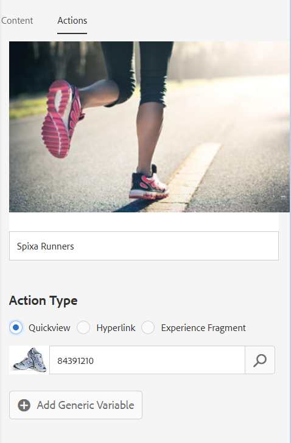

# 互動影片{#interactive-videos}

您可以輕鬆建立互動式影片（也稱為可購買影片），直接從影片推動轉換。 客戶與影片的互動會與影片播放器一起在面板中進行，影片會根據影片中的特色內容，將相關服務、資訊或產品縮圖捲動至檢視中。 客戶可以選取縮圖並直接連結至服務，或將項目新增至購物車以立即購買，或連結至網頁以取得詳細資訊。

影片結束時，會顯示所有產品的視覺摘要，以引發動作呼叫。 客戶有另一個機會選擇他們想要的項目。 這些可操作和特定的體驗（例如）可增加客戶參與和轉換。

另請參閱 [互動式影像](/help/assets/dynamic-media/interactive-images.md).

## 互動式視訊的實際運作 {#interactive-video-in-action}

若要檢視互動式可購買視訊的實際運作，請選取 [即時演示](https://landing.adobe.com/tw/na/dynamic-media/ctir-2755/live-demos.html)，捲動至 **[!UICONTROL 可購買媒體]** 標題，然後選取可購買視訊以開始播放。

* 在播放期間，由於視訊中使用產品，因此右側會顯示相同的產品作為縮圖影像。

* 若要暫停影片並開啟產品的「快速檢視」，請選取縮圖。 例如，在視頻中選擇KitchenAid縮圖影像，以體驗混合器的360°旋轉視圖，或放大以查看混合器詳細資訊。

另請參閱 [使用互動式影片搭配Dynamic Media](https://experienceleague.adobe.com/docs/experience-manager-learn/assets/dynamic-media/dynamic-media-interactive-video-feature-video-use.html#dynamic-media)

<!-- 

There was a link here that showed the video frame of an interactive video and when the reader selected the frame the video would play https://experienceleague.adobe.com/tools/dynamic-media-demo/shoppable-video/AXIS/index.html. This now needs to call a new interactive video

-->

<!-- 

[A frame from an interactive, shoppable video](assets/chlimage_1-126.png) *A video frame capture from an interactive, shoppable video.*

-->

>[!NOTE]
>
>如果您建立互動式視訊，以在使用者選取縮圖影像時啟動網頁，有些裝置會封鎖快顯網頁以開啟。 在這種情況下，請更改設備上的彈出窗口阻止程式設定。 例如，在Apple iPhone 6上，前往 **[!UICONTROL 設定]** > **[!UICONTROL Safari]** > **[!UICONTROL 封鎖快顯視窗]**，然後將控制項滑入 **[!UICONTROL 關閉]**. 現在，當您播放互動式視訊並選取縮圖時，如果您想要開啟快顯視窗，則會提示您。 若您接受，則會開啟網頁。

### 觀看互動式視訊的建立方式 {#watch-how-interactive-videos-are-created}

觀看 [如何建立互動式視訊](https://s7d5.scene7.com/s7viewers/html5/VideoViewer.html?videoserverurl=https://s7d5.scene7.com/is/content/&amp;emailurl=https://s7d5.scene7.com/s7/emailFriend&amp;serverUrl=https://s7d5.scene7.com/is/image/&amp;config=Scene7SharedAssets/Universal_HTML5_Video_social&amp;contenturl=https://s7d5.scene7.com/skins/&amp;asset=S7tutorials/InteractiveVideo)（7分30秒）。
(雖然視訊逐步說明已加上「隨選資產」品牌，但Adobe Experience Manager Assets中的「互動式視訊」仍適用原則和步驟。)

### Adobe客戶成功網路研討會 {#adobe-customer-success-webinar}

此 [在Experience Manager Assets中使用互動式影片、連結共用和YouTube共用](https://adobecustomersuccess.adobeconnect.com/p1yxzdo4aec/) 網路研討會會教您如何使用互動式視訊和其他功能，將轉換導向的事件連結至您的視訊行銷內容。

## 快速入門：互動影片 {#quick-start-interactive-videos}

下列逐步工作流程說明旨在協助您在Dynamic Media中快速上手並執行互動式影片。

尋找 **範例** 標題。 其中包含以下內容為基礎的簡短教學課程 [開始示範網頁 *不* 已添加交互功能](https://experienceleague.adobe.com/tools/dynamic-media-demo/shoppable-video/john-lewis/landing-0.html).

範例 **可協助您說明** ，如何將互動式視訊整合在您自己的網站上。

完成上一個範例區段的教學課程後， [您的最終演示網頁將以此方式顯示，其中包含完全整合的互動式視頻](https://experienceleague.adobe.com/tools/dynamic-media-demo/shoppable-video/john-lewis/landing-3.html).

互動式影片步驟：

1. **（可選）識別Quickview變數**  — 首先，識別您現有Quickview實作所使用的動態變數。 建立互動式視訊時，您可以使用變數將產品縮圖對應至其對應的產品Quickview。 請參閱 [（可選）識別Quickview變數](#optional-identifying-quickview-variables).
   **只有在下列所有情況皆為真時，才需要執行此步驟：**
·您想要透過觸發快速檢視來增加視訊的互動功能。
·您實作的Experience Manager 
*not* 使用電子商務整合框架，從任何電子商務解決方案(如IBM® WebSphere® Commerce、Elastic Path、SAP Hybris或Intershop)將產品資料提取到Experience Manager中。

1. **（選用）建立互動式視訊檢視器預設集**  — 自訂構成播放器的各種元件的外觀和行為，例如視訊清除程式和互動式縮圖。
如果您要使用現成可用的互動式視訊檢視器預設集，則不需要建立您自己的互動式視訊檢視器預設集 `Shoppable_Video_Light` 或 `Shoppable_Video_Dark` 。
請參閱 [建立檢視器預設集](/help/assets/dynamic-media/managing-viewer-presets.md#creating-a-new-viewer-preset) （可選）和 [建立互動式檢視器預設集的特殊考量事項](/help/assets/dynamic-media/managing-viewer-presets.md#special-considerations-for-creating-an-interactive-viewer-preset).

1. **上傳視訊及其相關的影像資產**  — 上傳您要互動的影片和相關影像。
請參閱 [上傳視訊及其相關縮圖資產](#uploading-a-video-and-its-associated-thumbnail-assets).

   >[!NOTE]
   >
   >尚不支援MXF視訊格式以搭配Dynamic Media中的互動式視訊使用。

1. **為影片增加互動功能**  — 新增一或多個時間區段至視訊。 然後，將這些時間區段內的影像縮圖建立關聯。 將每個影像縮圖指派給動作，例如超連結、快速檢視或體驗片段。
(如果您的互動式內容有連結相對URL的連結，尤其是連結至Experience Manager Sites頁面的連結，則無法使用以URL為基礎的連結方法。)
完成時，請發佈互動式視訊資產。 發佈會建立內嵌程式碼或URL，您最終會複製這些內嵌程式碼或URL並套用至您的網站登陸頁面。 請參閱 [為影片增加互動功能](#adding-interactivity-to-your-video).
請參閱 [發佈資產](/help/assets/dynamic-media/publishing-dynamicmedia-assets.md).

1. **將互動式視訊新增至您的網站或以Experience Manager新增至您的網站**  — 如果您使用Experience Manager Sites或電子商務，或兩者，請將互動式視訊新增至Experience Manager中的網頁。 將互動式媒體元件拖曳至頁面。 請參閱 [將Dynamic Media Assets新增至頁面](/help/assets/dynamic-media/adding-dynamic-media-assets-to-pages.md).
使用內嵌程式碼或URL將您的互動式視訊與網站體驗整合。 請參閱 [將互動式視訊與您的網站整合](#integrating-an-interactive-video-with-your-website).
如果您使用協力廠商WCM（網頁內容管理員），您必須將新的互動式視訊與網站上使用的現有Quickview實作整合。 請參閱 [將互動式視訊與現有的Quickview整合](#integrating-an-interactive-video-with-an-existing-quickview).
   [將Dynamic Media Assets新增至頁面](/help/assets/dynamic-media/adding-dynamic-media-assets-to-pages.md)

## （可選）識別Quickview變數 {#optional-identifying-quickview-variables}

>[!NOTE]
>
>只有在以下情況為真時才需要此任務：
>
>* 您想要透過觸發快速檢視來為視訊增加互動功能。
>* 您的Experience Manager實作可 *not* 使用電子商務整合框架，從任何電子商務解決方案(如IBM® WebSphere® Commerce、Elastic Path、SAP Hybris或Intershop)將產品資料提取到Experience Manager中。 <!-- See [eCommerce concepts in Experience Manager Assets](/help/sites-administering/concepts.md).-->
>
>如果您的Experience Manager實作使用電子商務，您可以略過此工作，並繼續執行下一個工作。

首先，找出您現有Quickview實作所使用的動態變數，以便您可以在互動式視訊建立程式期間，將產品縮圖對應至其對應的產品Quickview。

在視訊中新增時間區段時，您會為新增至區段的每個縮圖指派SKU（庫存保留單位）和任何其他變數。 這些變數稍後將用於顯示正確的Quickview產品。

請務必正確識別要唯一觸發產品快速檢視所需的變數。

有時，與負責您現有Quickview實施的IT專家協商就足夠了。 他們可能知道系統中標識Quickview的最小資料集。 不過，您也可以簡單分析前端程式碼的現有行為。

大多數Quickview實施都使用下列範例：

* 使用者在網站上啟動使用者介面元素。例如，選取「快速檢視」按鈕。
* 網站會視需要傳送Ajax要求至後端，以載入Quickview資料或內容。
* 快速檢視資料會轉譯為內容，以準備在網頁上轉譯。
* 最後，前端代碼在螢幕上直觀地呈現這樣的內容。

因此，方法是造訪實作Quickview的現有網站的不同區域。 然後觸發Quickview，並取得網頁傳送的Ajax URL，以載入Quickview資料或內容。

通常您不需要使用任何專用的除錯工具。 現代網頁瀏覽器的功能是能夠勝任工作的網頁檢查員。 以下是一些Web瀏覽器的示例，其中包括Web檢查員：

* 若要在Google Chrome中查看所有傳出的HTTP要求，請按 **F12** (Windows®)或 **Command+Options+I** (Mac)以開啟「開發人員工具」面板，然後選取 **網路** 標籤。

* 在Firefox中，您可以按 **F12** (Windows®)或 **Command+Option+I** (Mac)及使用其 **[!UICONTROL Net]** 頁簽，或者，您可以使用內置的檢查工具及其「網路」頁簽。

* 在Internet Explorer中，按鍵啟動調試器工具 **F12**.

在瀏覽器中開啟網路監視時，觸發頁面上的快速檢視。

現在，在網路記錄中找到Quickview Ajax URL，並複製記錄的URL以供日後分析之用。 通常，當您觸發Quickview時，會有許多請求會傳送至伺服器。 Quickview Ajax URL通常是清單中第一個的URL。 它有複雜的查詢字串部分或路徑，其響應MIME類型為 `text/html`, `text/xml`，或 `text/javascript`.

在此程式中，請務必瀏覽網站的不同區域，包含不同的產品類別和類型。 原因是Quickview URL的部分是指定網站類別的共同部分，但只有當您造訪網站的其他區域時才會變更。

在最簡單的情況下，Quickview URL中唯一的變數部分是產品SKU。 在此情況下，產品SKU值是將縮圖新增至互動式視訊中Experience Manager中的時段所需的唯一資料片段。

但是，在複雜的情況下，Quickview URL除了產品SKU（例如類別ID和顏色代碼）之外，還具有不同的元素。 在這種情況下，每個這類元素都會變成Experience Manager中縮圖資料定義中的個別變數。

請考量下列Quickview URL範例及其產生的縮圖變數：

<table>
  <tbody>
  <tr>
    <td><p>在查詢字串中找到的單一SKU。</p> </td>
    <td><p>錄制的Quickview URL包括：</p>
    <ul>
      <li><p><code>https://server/json?productId=866558&amp;source=100</code></p> </li>
      <li><p><code>https://server/json?productId=1196184&amp;source=100</code></p> </li>
      <li><p><code>https://server/json?productId=1081492&amp;source=100</code></p> </li>
      <li><p><code>https://server/json?productId=1898294&amp;source=100</code></p> </li>
    </ul> <p>URL中唯一的變數部分是 <code>productId=</code> 查詢字串參數，且顯然是SKU值。 因此，縮圖只需要填入值如 <strong><code>866558</code></strong>, <strong><code>1196184</code></strong>, <strong><code>1081492</code></strong>, <strong><code>1898294</code></strong>.</p> </td>
  </tr>
  <tr>
    <td><p>單一SKU，可在URL路徑中找到。</p> </td>
    <td><p>錄制的Quickview URL包括：</p>
    <ul>
      <li><p><code>https://server/product/6422350843</code></p> </li>
      <li><p><code>https://server/product/1607745002</code></p> </li>
      <li><p><code>https://server/product/0086724882</code></p> </li>
    </ul> <p>變數部分位於路徑的最後一部分，且會變成Experience Manager縮圖的SKU值： <strong><code>6422350843</code></strong>, <strong><code>1607745002</code></strong>, <strong><code>0086724882</code></strong>.</p> </td>
  </tr>
  <tr>
    <td><p>查詢字串中的SKU和類別ID。</p> </td>
    <td><p>錄制的Quickview URL包括：</p>
    <ul>
      <li><p><code>https://server/quickView/product/?category=1100004&amp;prodId=305466</code></p> </li>
      <li><p><code>https://server/quickView/product/?category=1100004&amp;prodId=310181</code></p> </li>
      <li><p><code>https://server/quickView/product/?category=1740148&amp;prodId=308706</code></p> </li>
    </ul> <p>在此情況下，URL中會有兩個不同的部分。 SKU儲存在 <code>prodId</code> 參數和類別ID儲存在 <code>category=</code> 參數。</p> <p>因此，縮圖定義是配對。 也就是說，SKU值和稱為的額外變數 <code>categoryId</code>. 產生的配對如下：</p>
    <ul>
      <li>SKU是 <code>305466</code> 和 <code>categoryId</code> is <code>1100004</code></li>
      <li>SKU是 <code>310181</code> 和 <code>categoryId</code> is <code>1100004</code></li>
      <li>SKU是 <code>308706</code> 和 <code>categoryId</code> is <code>1740148</code></li>
    </ul> <p> </p> </td>
  </tr>
  </tbody>
</table>

**範例**

將上述方法套用至「範例」網站時，您的網頁會包含數個產品縮圖，每個縮圖都會有「查看更多」按鈕：

[https://experienceleague.adobe.com/tools/dynamic-media-demo/shoppable-video/john-lewis/landing-0.html](https://experienceleague.adobe.com/tools/dynamic-media-demo/shoppable-video/john-lewis/landing-0.html)

啟動頁面上所有可用的產品快速檢視後，您會收到對後端提出的快速檢視請求清單：

* datafeed/candles-233396346.json
* datafeed/candles-233978050.json
* datafeed/candles-234024346.json
* datafeed/candles-234024356.json
* datafeed/candles-234024359.json
* datafeed/cushions-233939848.json
* datafeed/cushions-234019477.json
* datafeed/cushions-234019483.json
* datafeed/furniture-231747479.json
* datafeed/furniture-232625621.json
* datafeed/furniture-232625626.json
* datafeed/furniture-233939810.json
* datafeed/furniture-233939825.json
* datafeed/furniture-233939828.json
* datafeed/furniture-233939853.json
* datafeed/furniture-233940334.json
* datafeed/glassware-000064007.json
* datafeed/glassware-230722193.json
* datafeed/glassware-233916550.json
* datafeed/glassware-233916597.json

查看伺服器呼叫時，產品專屬資訊只會顯示在請求路徑中。 您也注意到查詢字串完全未使用，而且涉及到兩種不同類型的資料片段：

* 第一種是蠟燭、墊子、家具和玻璃器具。 您可以將此稱為「產品類別」。
* 第二種類型是產品代碼，例如233916597。 您可以假設是「產品SKU」。

根據此資訊，整個Quickview URL的模式如下：

`/datafeed/$categoryId$-$SKU$.json`

根據這種分析，您可得出以下兩個變數用於縮圖的結論： `categoryId` 和 `SKU`.

您現在可以上傳視訊及其相關的縮圖資產。

## （選用）建立互動式視訊檢視器預設集 {#optional-creating-an-interactive-video-viewer-preset}

如果您要使用任一預設的現成互動式視訊檢視器預設集類型，可以略過此工作並繼續進行下一個步驟 `Shoppable_Video_dark` 或 `Shoppable_Video_light`.

在製作環境中選取縮圖時，會顯示「快速檢視」對話方塊的預覽。


您可以選擇建立自己的自訂互動式視訊檢視器預設集。 除其他外，您還可以決定視訊播放器的樣式、互動式縮圖，以及顯示在視訊結尾的縮圖格線檢視。

互動式視訊檢視器預設集會正確轉譯您新增的視訊和所有時間軸區段。 在「預覽」模式中選取產品縮圖時，也會使用預設的「快速檢視」範例，讓您在發佈前測試其互動性。

儲存檢視器預設集後，其狀態會在「檢視器預設集」頁面中自動設為**On **。此狀態表示在動態媒體元件中及您使用它預覽視訊時，都可看到它。請確定您也手動發佈新的檢視器預設集。

請參閱 [建立檢視器預設集](/help/assets/dynamic-media/managing-viewer-presets.md#creating-a-new-viewer-preset) 建立您自己的互動式視訊檢視器預設集。

## 上傳視訊及其相關縮圖資產 {#uploading-a-video-and-its-associated-thumbnail-assets}

如果您已上傳視訊和縮圖資產，請繼續 [為影片增加互動功能](#adding-interactivity-to-your-video).

>[!NOTE]
>
>尚不支援MXF視訊格式以搭配Dynamic Media中的互動式視訊使用。

如果您上傳了錯誤的影片或影像，或想要刪除您不再需要的已上傳影片或影像，請參閱 [刪除資產](/help/assets/manage-digital-assets.md#delete-assets).

上傳視訊及其相關縮圖資產：

1. 上傳視訊和相關的縮圖資產至您想要的資料夾或資料夾。

   請參閱 [上傳資產](/help/assets/manage-digital-assets.md).
請參閱 [使用FTP工作排程上傳資產](/help/assets/manage-digital-assets.md).

   現在為影片增加互動功能。

## 為影片增加互動功能 {#adding-interactivity-to-your-video}

使用「建立互動式視訊」頁面上的就地視覺編輯器，將時間軸區段新增至視訊。

新增時間軸區段後，即可在每個區段內新增縮圖影像。 您會針對您新增的每個縮圖，套用動作至縮圖。 例如，您可以將快速檢視套用至縮圖，或指派超連結或體驗片段。

請參閱 [體驗片段](/help/sites-cloud/authoring/fundamentals/experience-fragments.md).

>[!NOTE]
>
>將檢視器內嵌在體驗片段中時，互動式視訊中不支援社交媒體共用工具。 相反地，您可以使用或建立沒有社交媒體共用工具的檢視器預設集。 這類檢視器預設集可讓您成功將其內嵌在體驗片段中。

>[!NOTE]
>
>如果您的互動式內容有連結與相對URL(尤其是連結至Experience Manager Sites頁面)，則無法使用以URL為基礎的連結方法。

目前建立/編輯工作階段期間，支援在頁面右上角附近還原和重做選項。

儲存互動式視訊後，視訊會立即開啟至「預覽」。 從那裡，您可以選取互動式視訊檢視器預設集並播放視訊，以查看客戶所看見的大致呈現方式。

**為視頻添加交互功能：**

1. 在「資產」檢視中，導覽至您上傳且想要互動的影片。
1. 執行下列任一項作業：

   * 暫留在影像上，然後選取 **[!UICONTROL 選擇]** （勾選圖示）。 在工具列上，選取 **[!UICONTROL 編輯]**.

   * 暫留在影像上，然後選取 **[!UICONTROL 更多動作]** （三點圖示） **[!UICONTROL >編輯]**.

   * 要在「詳細資訊視圖」頁中開啟它，請選擇影像。 在工具列上，選取 **[!UICONTROL 編輯]**.

1. 在「建立互動式視訊」頁面上，執行下列任一操作：

   * 若要開始播放視訊，請選取 **[!UICONTROL 播放]** 按鈕。 當要查看要突出顯示的特定產品、服務或詳細資訊時，請選擇 **[!UICONTROL 新增區段]** 的上界。 重複，直到到達視頻結尾。

      您可以為新增的每個時段指派一或多個縮圖影像。 然後，您可以將這些縮圖連結到Quickview產品頁面，供客戶購買，或連結到網頁以了解詳細資訊。

   * 若要開始播放視訊，請選取 **[!UICONTROL 播放]** 按鈕。 當要查看要突出顯示的特定產品、服務或詳細資訊時，請選擇 **[!UICONTROL 暫停]**. 選擇 **[!UICONTROL 新增區段]**.

      在您要新增區段的時間軸上，繼續播放和暫停視訊，直到到達視訊結尾。

1. （可選）拖曳 **[!UICONTROL 時間軸縮放滑桿]** 向左放大或向右縮小。 此類動作可讓您控制您所新增區段的詳細程度。

   

   視訊的長度而定，「區段持續時間」預設值如下：

   <table>
      <tbody>
        <tr>
        <td><strong>如果視訊長度為……</strong></td>
        <td><strong>「區段持續時間」設定預設為……</strong></td>
        </tr>
        <tr>
        <td>3分鐘以上</td>
        <td>60秒</td>
        </tr>
        <tr>
        <td>2-3分鐘</td>
        <td>30秒</td>
        </tr>
        <tr>
        <td>1-2 分鐘</td>
        <td>20秒<br /> </td>
        </tr>
        <tr>
        <td>30-60秒</td>
        <td>10秒</td>
        </tr>
        <tr>
        <td>30秒或更短時間</td>
        <td>5秒</td>
        </tr>
      </tbody>
    </table>

   影片時間軸使用的螢幕空間與可供使用的空間相同。 因此，調整瀏覽器大小時，新增的區段會維持正確的寬度。

   為了說明，下列三個螢幕擷取畫面使用相同的影片。 請注意，每個區段的寬度會隨著時間軸縮放設定而改變。

   

   螢幕擷圖A

   螢幕擷圖A顯示29秒產品影片的預設檢視。 時間軸刻度的預設值為5秒。

   

   螢幕截圖B

   在上方的螢幕擷取B中，時間軸縮放滑桿是從預設的5秒拖曳到3秒。 請注意，個別時間軸縮放時間戳記現在都是以3秒的間隔設定。

   

   螢幕截圖C

   在上方螢幕擷取C中，時間軸縮放設定已移至8秒。 請注意包含產品縮圖的區段縮小的方式。 如果您有長視訊，且想要查看通常適合頁面寬度的更多區段的概觀，以此方式縮小會很實用。

1. （選用）執行下列任一操作：

   * 調整區段的開始時間和結束時間。

      選取區段，然後拖曳前導或尾隨藍色橢圓，分別調整開始或結束時間。 顯示的視訊影格會根據您的調整，移至視訊中的適當時間。 基於時間軸中的任何相鄰段來限制時間軸段的移動。 允許的最短區段時間為1秒。

      使用下列導覽捷徑來快速檢查及微調您的視訊區段：

      * 若要直接搜尋視訊至該區段的開頭，請選取前導的藍色橢圓。
      * 若要直接搜尋該區段的結尾，請選取尾端的藍色橢圓。
      * 若要將視訊播放傳回至該區段的開頭，請選取整個區段。

   

   重新定位時間軸區段的結尾

   * 刪除區段

      選取時間軸上的最後一個區段，然後在工具列上選取 **[!UICONTROL 刪除區段]**. 如果選取了兩個或多個區段，「刪除區段」功能便會停用。

      您只能刪除最後一個區段。 例如，如果要刪除時間軸上的所有區段，您必須一律選取最後一個區段，然後選取 **[!UICONTROL 刪除區段]**.


1. 選取您要關聯一或多個縮圖影像的時段。
1. 在影片的右側，選取 **[!UICONTROL 內容]** 標籤。
1. 在「內容」標籤下，選取 **[!UICONTROL 選取資產]**，然後瀏覽並選取您要與影片搭配使用的所有影像資產。 選取的資產會新增至「內容」標籤的「資產選取器」面板。

1. 在「內容」標籤下方的資產選取器中，執行下列任一操作：

   <table>
      <tbody>
        <tr>
        <td>將縮圖關聯到所選時間軸段</td>
        <td><p>在右側的資產選取器面板中選取影像。</p> <p>您可以新增任意數量的縮圖至時間軸區段。 對於您選取的每個影像，資產選取器中的影像上會出現核取記號。</p> </td>
        </tr>
        <tr>
        <td>從所選時間軸段中移除縮圖</td>
        <td><p>執行下列任一操作：</p>
          <ul>
          <li>在資產選擇器面板中，選取含有勾選記號的影像以取消選取該影像。 影像資產會從時間軸區段中移除。<br /> </li>
          <li>在所選時間軸段中，選擇影像，然後在工具欄上，選擇 <strong>刪除產品</strong>.</li>
          </ul> </td>
        </tr>
      </tbody>
    </table>

   

   在資產選擇器面板中選取影像會將其新增至所選時間軸區段。

1. 在其中一個時間軸區段內選取單一縮圖影像，然後選取 **[!UICONTROL 動作]** 標籤。
1. 執行下列任一操作：
   <table> 
    <tbody> 
      <tr> 
      <td>將所選縮圖影像與快速視圖關聯</td> 
      <td><p>在「操作類型」下，選擇 <strong>快速檢視</strong>.</p> <p>如果您是Experience Manager Sites和電子商務客戶：</p> 
       <ul> 
       <li>請注意，「SKU值」文字欄位已預先填入所選產品的SKU（庫存保留單位）。 SKU是您提供之每個不同產品或服務的唯一識別碼。 當影像與Experience Manager商務中的產品相關聯時，會自動填入此欄位。</li> 
       <li>如果預先填入的SKU不正確，請選取「產品選擇器」圖示（放大鏡）以開啟「選取產品」頁面。 選取您要使用的產品，然後選取頁面右上角的核取記號。 您會回到互動式視訊編輯器。</li> 
       </ul> <p> 如果您 <em>not</em> Experience Manager Sites或電子商務客戶</p> 
       <ul> 
       <li>請參閱 <a href="/help/assets/dynamic-media/carousel-banners.md#identifying-hotspot-and-image-map-variables">識別熱點變數</a>. 必須定義這些變數。</li> 
       <li>依預設，此SKU欄位會使用影像資產的檔案名稱（不含副檔名）。 如果您根據SKU對檔案遵循標準命名慣例，則此欄位通常不需要進行任何額外編輯。 </li> 
       <li>否則，請編輯預設值並輸入正確的SKU值。 在「SKU值」文字欄位中，輸入產品的SKU（庫存保存單位），這是您提供之每個不同產品或服務的唯一識別碼。 輸入的SKU值會自動填入「快速檢視」範本的變數部分，以便系統知道將所選影像與特定SKU的快速檢視相關聯。</li> 
       </ul> <p>（可選）如果「快速檢視」中有您必須用來進一步識別產品的其他變數，請選取 <strong>新增一般變數</strong>. 在文字欄位中，指定額外的變數。 例如， <code>category=Womens</code> 是新增的變數。</p> <p> </p> </td> 
      </tr> 
      <tr> 
      <td>將所選縮略圖影像與超連結關聯</td> 
      <td><p>在「操作類型」下，選擇 <strong>超連結</strong>，然後執行下列其中一項操作：</p> 
       <ul> 
       <li>如果您是Experience Manager Sites客戶，請選取網站選取器圖示（資料夾）以導覽至網頁。 如果您的互動式內容有連結與相對URL(尤其是連結至Experience Manager Sites頁面)，則無法使用以URL為基礎的連結方法。</li> 
       <li>如果您是獨立的Dynamic Media客戶，請在HREF文字欄位中，指定連結網頁的完整URL路徑。</li> 
       </ul> <p>請務必指定要在新瀏覽器標籤或目前標籤中開啟連結。</p> </td> 
      </tr> 
      <tr> 
      <td>將選取的縮圖影像與體驗片段建立關聯</td> 
      <td><p>在「操作類型」下，選擇 <strong>體驗片段</strong>，然後執行下列動作：<p> 
       <ul> 
       <li>如果您是Experience Manager Sites客戶，請選取「搜尋」圖示（放大鏡）以開啟「體驗片段」頁面。 選取您要使用的體驗片段，然後選取 <strong>若要返回上一頁的「操作」面板，請選擇 </strong>在頁面的右上角。<br /> 請參閱 <a href="/help/sites-cloud/authoring/fundamentals/experience-fragments.md">體驗片段</a>.</li> 
      </ul> 
       <ul> 
       <li>指定影片上顯示的體驗片段寬度和高度。</li>
       </ul><strong>附註</strong>:將檢視器內嵌在體驗片段時，不支援互動式視訊中的社交媒體共用工具。 相反地，您可以使用或建立沒有社交媒體共用工具的檢視器預設集。 這類檢視器預設集可讓您成功將其內嵌在體驗片段中。</p></tr>&lt; 
      <tr> 
      <td>若要編輯已指派給縮圖影像的動作</td> 
      <td>在時間軸區段中，選取文字標籤右側有連結的縮圖影像。 鏈結表示已為其分配了操作。 若要進行變更，請選取 <strong>動作</strong> 標籤。</td> 
      </tr> 
      <tr> 
      <td>更改縮圖影像的文本標籤</td> 
      <td><p>依預設，文字標籤會使用縮圖影像的 <code>Title</code> 中繼資料欄位。 若 <code>Title</code> 不存在，則會改用縮圖影像的檔案名稱，但沒有副檔名。</p> <p>若要變更縮圖影像的文字標籤，請在 <strong>動作 </strong>標籤，在顯示的影像資產正下方輸入所要的文字。 請參閱下圖。</p> <p>新文字標籤僅由視訊播放器本身使用，以及時間軸區段中顯示的縮圖文字。 標籤變更不會影響縮圖影像的標題中繼資料欄位及其檔案名稱。</p> </td> 
      </tr> 
      <tr> 
      <td>還原更改</td> 
      <td>在頁面的右上角附近，選取 <strong>還原</strong> 或 <strong>取消復原</strong>.</td> 
      </tr> 
    </tbody> 
   </table>

   

   縮圖影像中會新增文字標籤。

1. 執行下列任一項作業：

   * 重複步驟6-11，將更多縮圖影像新增至影片中的時間軸區段。
   * 繼續執行可選步驟13。

1. （選用）執行下列任一操作：

   * **[!UICONTROL 合併區段]**  — 您可以將兩個相鄰的區段（無論是否指派產品縮圖）合併為一個區段。

      在時間軸上，選取要合併成一個的兩個或多個連續區段。 下圖中的兩個選定段上沒有藍色的橢圓拖動手柄。

      選擇 **[!UICONTROL 合併區段]** 的上界。
   

   將兩個選取的五秒區段合併為一個十秒區段。

   * **[!UICONTROL 分割區段]**  — 您可以將單一區段分割為兩個計時相等的區段。 如果已將產品縮圖指派給區段，縮圖會合併至左側區段。

      在時間軸上，選取您要分成一半的區段，然後選取 **[!UICONTROL 分割區段]** 的上界。

      選取兩個或多個區段會停用 **[!UICONTROL 分割區段]** 功能。
   

   將選取的10秒區段分割為兩個區段，每個區段5秒。

1. 在 **[!UICONTROL 建立互動式影片]** 頁面，則會顯示與視訊搭配使用的目前選取檢視器預設集名稱。 若要選取不同的檢視器預設集，請選取名稱。

   例如， `Shoppable_Video_light` 檢視器預設集可讓您播放視訊旁有白色顯示區域。 顯示區域是播放期間顯示可選擇縮圖影像的位置。 此 `Shoppable_Video_dark` 檢視器預設集可讓您播放視訊旁有黑色顯示區域。

   如果您建立了自己的互動式視訊檢視器預設集，則可在您可以選擇的預設集清單中看到它。

   完成後，請選取 **[!UICONTROL 儲存]**.

   >[!NOTE]
   >
   >當您儲存互動式視訊時，會自動 `.vtt` 儲存相關的檔案。此 `.vtt` 檔案會儲存至 `_VTT` 根目錄的資料夾 **[!UICONTROL 資產]**. 您的互動式視訊必須有檔案和資料夾才能在網站上正確播放。因此，請勿移動、編輯或刪除資料夾 `_VTT` 或其內容。

1. 發佈互動式影片。 發佈會建立內嵌程式碼或URL，您最終會將其複製並貼到您的網站體驗。

   若您透過快速檢視新增互動功能，則僅使用內嵌程式碼；如果您使用超連結網頁新增互動功能，也可以使用已發佈的URL。 不過請注意，如果您的互動式內容有連結，且連結的連結具有相對URL，尤其是連結至Experience Manager Sites頁面，則無法使用URL型連結方法。

   請參閱 [發佈資產](publishing-dynamicmedia-assets.md).

   >[!NOTE]
   >
   >若要發佈可購買且可快速檢視的視訊，請確定您也從您的商務區域個別發佈每個視訊的相關影像資產。

   新增時間軸區段並發佈互動式視訊後，您就可以將其新增至現有的網站登陸頁面。 請參閱 [將互動式視訊與您的網站整合](#integrating-an-interactive-video-with-your-website).

## 發佈互動式視訊資產 {#publishing-interactive-video-assets}

請參閱 [發佈資產](/help/assets/dynamic-media/publishing-dynamicmedia-assets.md) 以取得如何發佈互動式視訊資產的詳細資訊。

## 將互動式視訊與您的網站整合 {#integrating-an-interactive-video-with-your-website}

上傳影片、新增時間軸區段並發佈互動式影片後，您現在可以將其新增至現有網站。

如果您是Experience Manager Sites客戶，可將互動式媒體元件拖曳至頁面，以新增互動式視訊。 請參閱 [將Dynamic Media Assets新增至頁面](/help/assets/dynamic-media/adding-dynamic-media-assets-to-pages.md).

如果您是獨立的Experience Manager Assets客戶，您可以依照本節所述，手動將互動式視訊新增至您的網站。

1. 複製已發佈的互動式視訊的內嵌程式碼或URL。
請參閱 [將視訊或影像檢視器內嵌在網頁上](/help/assets/dynamic-media/embed-code.md).
若您透過快速檢視新增互動功能，則僅使用內嵌程式碼；如果您使用超連結網頁新增互動功能，也可以使用已發佈的URL。 不過請注意，如果您的互動式內容有連結，且連結的連結具有相對URL，尤其是連結至Experience Manager Sites頁面，則無法使用URL型連結方法。

1. 在目標的網頁程式碼中，識別靜態視訊的位置。
1. 移除靜態視訊，並以您從Experience Manager Assets複製的內嵌程式碼或URL取代程式碼，如同。
複製的內嵌程式碼會針對回應式環境進行設定，以自動符合先前由靜態視訊佔用的區域。

>[!NOTE]
>
>此時，如果您只以超連結網頁新增互動功能，即可完成。
>
>不過，如果您新增任何互動來觸發Quickview，互動式視訊旁的縮圖僅會用於顯示用途；它們尚未與您現有的快速檢視整合。 在這種情況下，您必須將互動式視訊與網站上現有的快速檢視整合。

**範例**

以示範網站為例：

[https://experienceleague.adobe.com/tools/dynamic-media-demo/shoppable-video/john-lewis/landing-0.html](https://experienceleague.adobe.com/tools/dynamic-media-demo/shoppable-video/john-lewis/landing-0.html)

請注意，視訊內嵌程式碼是標準的：

```js {.line-numbers}
<style type="text/css">
 #s7video_div.s7videoviewer{
   width:100%;
   height:auto;
 }
</style>

<script type="text/javascript" src="https://demos-pub.assetsadobe.com/etc/dam/viewers/s7viewers/html5/js/VideoViewer.js"></script>
<div id="s7video_div"></div>
<script type="text/javascript">
 var s7videoviewer = new s7viewers.VideoViewer({
  "containerId" : "s7video_div",
  "params" : {
   "serverurl" : "https://adobedemo62-h.assetsadobe.com/is/image",
   "contenturl" : "https://demos-pub.assetsadobe.com/",
   "config" : "/etc/dam/presets/viewer/Video",
   "config2": "/etc/dam/presets/analytics",
   "videoserverurl": "https://gateway-na.assetsadobe.com/DMGateway/public/demoCo",
   "posterimage": "/content/dam/marketing/shoppable-video/john-lewis/shoppable-video-john-lewis-2014.mp4",
   "asset" : "/content/dam/marketing/shoppable-video/john-lewis/shoppable-video-john-lewis-2014.mp4" }
 }).init();
</script>
```

只要移除視訊內嵌程式碼，再從Experience Manager中取代互動式視訊內嵌程式碼，整合就很簡單。 您可以在下列URL中看到結果。 雖然會顯示頁面上顯示的互動式視訊，但尚未與現有的快速檢視整合：

[https://experienceleague.adobe.com/tools/dynamic-media-demo/shoppable-video/john-lewis/landing-1.html](https://experienceleague.adobe.com/tools/dynamic-media-demo/shoppable-video/john-lewis/landing-1.html)

## 將互動式視訊與現有的Quickview整合 {#integrating-an-interactive-video-with-an-existing-quickview}

>[!NOTE]
>
>只有當您是獨立Experience Manager Assets客戶時，才適用此工作。

此程式的最後一個步驟是將您的互動式視訊與網站上使用的現有Quickview實作整合。 整合沒有適用於所有情況的解決方案。 每個Quickview實作都是唯一的。 因此，需要一種具體的方法，需要前端IT人員的協助。

現有的Quickview實施通常會依下列順序呈現網頁上發生的一系列相關動作：

1. 使用者會在您網站的使用者介面中觸發元素。
1. 前端程式碼會根據步驟1中觸發的使用者介面元素來取得快速檢視URL。
1. 前端程式碼會使用步驟2取得的URL來傳送AJAX要求。
1. 後端邏輯會將對應的Quickview資料或內容傳回前端程式碼。
1. 前端程式碼會載入Quickview資料或內容。
1. （可選）前端代碼將載入的Quickview資料轉換為HTML表示。
1. 前端程式碼會顯示強制回應對話方塊或面板，並在畫面上為一般使用者轉譯HTML內容。

這些呼叫不代表獨立的公用API呼叫，而網頁邏輯可從任意步驟呼叫。 相反地，它是連結呼叫，其中每個後續步驟都會隱藏在前一個步驟的最後一個階段（回撥）中。

在交互視頻正在替換步驟1和部分步驟2的同時，當用戶在交互視頻中選擇縮略圖時，這樣的用戶交互由查看器處理。 檢視器會將事件傳回至網頁，其中包含先前新增至Experience Manager的所有縮圖資料。

在這種事件處理常式中，前端程式碼會執行下列動作：

* 監聽互動式視訊發出的事件。
* 根據縮圖資料建構Quickview URL。
* 觸發從後端載入Quickview並在畫面上呈現以供顯示的程式。

此外，互動式視訊檢視器支援全螢幕操作模式。 一般使用者在不離開全螢幕的情況下選取縮圖，以觸發快速檢視。 若要實現此功能，請變更前端程式碼，將Quickview強制回應對話方塊附加至檢視器的容器。 請勿新增檔案BODY或檢視器處於全螢幕模式時無法使用的其他網頁元素。 執行此作業的程式碼會監聽在檢視器載入頁面後傳送的另一個檢視器回呼。

由Experience Manager傳回的內嵌程式碼已有可供使用的事件處理常式。 如下列醒目提示的程式碼片段所示，會加以註解：

```js {.line-numbers}
<style type="text/css">
 #s7interactivevideo_div.s7interactivevideoviewer{
   width:100%;
   height:auto;
 }
</style>
<script type="text/javascript" src="https://demos-pub.assetsadobe.com/etc/dam/viewers/s7viewers/html5/js/InteractiveVideoViewer.js"></script>

<div id="s7interactivevideo_div"></div>
<script type="text/javascript">
 var s7interactivevideoviewer = new s7viewers.InteractiveVideoViewer({
  "containerId" : "s7interactivevideo_div",
  "params" : {
   "serverurl" : "https://adobedemo62-h.assetsadobe.com/is/image",
   "contenturl" : "https://demos-pub.assetsadobe.com/",
   "config" : "/etc/dam/presets/viewer/Shoppable_Video_light",
   "config2": "/etc/dam/presets/analytics",
   "videoserverurl": "https://gateway-na.assetsadobe.com/DMGateway/public/demoCo",
   "interactivedata": "content/dam/_VTT/marketing/shoppable-video/john-lewis/shoppable-video-john-lewis-2014.mp4.svideo.vtt",
   "VideoPlayer.contenturl": "https://adobedemo62-h.assetsadobe.com/is/content",
   "asset" : "/content/dam/marketing/shoppable-video/john-lewis/shoppable-video-john-lewis-2014.mp4" }
 })
 /* // Example of interactive video event for quickview.
   s7interactivevideoviewer.setHandlers({
   "quickViewActivate": function(inData) {
     var sku=inData.sku; //SKU for product ID
    //To pass other parameter from the hotspot, you need to add custom parameter during the hotspot setup as parameterName=value
    loadQuickView(sku); //Replace this call with your quickview plugin
    //Please refer to your quickviewer plugin for the quickview call
    },
"initComplete":function() {
    //--- Attach quickview popup to viewer container so popup will work in fullscreen mode ---
    var popup = document.getElementById('quickview_div'); // get custom quickview container
    popup.parentNode.removeChild(popup); // remove it from current DOM
    var sdkContainerId = s7interactivevideoviewer.getComponent("container").getInnerContainerId(); // get viewer container component
    var inner_container = document.getElementById(sdkContainerId);
    inner_container.appendChild(popup); //Attach custom quickview container to viewer
    }
   });
 */
 s7interactivevideoviewer.init();
</script>
```

因此，只需取消對上面突出顯示的代碼片段的注釋，並用特定網頁專用的代碼替換虛擬處理程式主體。

標準內嵌程式碼中有兩個預設回呼處理常式： `quickViewActivate` 和 `initComplete`. 此 `quickViewActivate` 在檢視器中選取縮圖時，處理常式就會觸發。 使用它將檢視器與Quickview啟用邏輯整合。 此 `initComplete` 檢視器載入頁面時，處理常式只會觸發一次。 此處理常式可用來調整網頁DOM中的「快速檢視」對話方塊位置。

建構Quickview URL的程式與識別本主題前面涵蓋的縮圖變數的程式相反。 使用先前識別的Quickview URL範例，您可以了解每種情況下如何建構Quickview URL:

<table>
  <tbody>
  <tr>
    <td><p>在查詢字串中找到的單一SKU</p> </td>
    <td><code class="code">s7interactivevideoviewer.setHandlers({
      "quickViewActivate": function(inData) {
      var quickViewUrl = "https://server/json?productId=" + inData.sku + "&amp;source=100";
      },
      });</code></td>
  </tr>
  <tr>
    <td>在URL路徑中找到的單一SKU</td>
    <td><code class="code">s7interactivevideoviewer.setHandlers({
      "quickViewActivate": function(inData) {
      var quickViewUrl = "https://server/product/" + inData.sku;
      },
      });</code></td>
  </tr>
  <tr>
    <td><p>查詢字串中的SKU和類別ID</p> </td>
    <td><code class="code">s7interactivevideoviewer.setHandlers({
      "quickViewActivate": function(inData) {
      var quickViewUrl = "https://server/quickView/product/?category=" + inData.categoryId + "&amp;prodId=" + inData.sku;
      },
      });</code></td>
  </tr>
  </tbody>
</table>

觸發Quickview URL並啟動Quickview面板的最後一個步驟很可能需要IT部門的前端IT人員協助。 他們具備最佳知識，了解如何從正確的步驟準確觸發Quickview實施，並擁有可供使用的Quickview URL。

您可以了解這些步驟如何套用至示範網站，以將互動式視訊與Quickview程式碼完全整合。 在本主題前面，快速檢視URL的結構識別如下：

```xml {.line-numbers}
/datafeed/$CategoryId$-$SKU$.json
```

在 `quickViewActivate` 處理常式 `categoryId` 和 `sku` 欄位 `inData` 物件會透過檢視器的程式碼傳遞至處理常式，如下所示：

```js {.line-numbers}
var sku=inData.sku;
var categoryId=inData.categoryId;
var quickViewUrl = "datafeed/" + categoryId + "-" + sku + ".json";
```

演示網站使用簡單的 `loadQuickView()` 函式呼叫。 此函式只需使用一個引數，即Quickview資料URL。 因此，整合互動式視訊的最後一步，就是將下列程式碼行加入 `quickViewActivate` 處理常式：

```xml {.line-numbers}
loadQuickView(quickViewUrl);
```

最後，請確定您的Quickview對話方塊已附加至檢視器的容器元素。 內嵌程式碼預設值提供實現此功能的範例步驟。 若要取得檢視器容器元素的參考，您可以使用下列幾行程式碼：

```js {.line-numbers}
var sdkContainerId = s7interactivevideoviewer.getComponent("container").getInnerContainerId(); // get viewer container component
var inner_container = document.getElementById(sdkContainerId);
```

其中 `inner_container` 是 `DIV` 由檢視器管理的元素。 您希望該對話框是該對話框的子項 `DIV`.

實際找出強制回應對話方塊元素並將其附加至上述容器的步驟會依大小寫而定。 同樣地，您可以向熟悉您所需Quickview實作的前端開發人員尋求協助。

在範例網站中，快速檢視強制回應對話方塊的實作方式為 `DIV` 並直接將quickview-modal ID附加至檔案 `BODY`. 因此，將該對話方塊移至檢視器容器的程式碼如下：

```js {.line-numbers}
var sdkContainerId = s7interactivevideoviewer.getComponent("container").getInnerContainerId(); // get viewer container component
var inner_container = document.getElementById(sdkContainerId);
inner_container.appendChild(document.getElementById("quickview-modal"));
```

完整原始碼如下：

```javascript {.line-numbers}
<style type="text/css">
 #s7interactivevideo_div.s7interactivevideoviewer{
   width:100%;
   height:auto;
 }
</style>
<script type="text/javascript" src="https://demos-pub.assetsadobe.com/etc/dam/viewers/s7viewers/html5/js/InteractiveVideoViewer.js"></script>

<div id="s7interactivevideo_div"></div>
<script type="text/javascript">
 var s7interactivevideoviewer = new s7viewers.InteractiveVideoViewer({
  "containerId" : "s7interactivevideo_div",
  "params" : {
   "serverurl" : "https://adobedemo62-h.assetsadobe.com/is/image",
   "contenturl" : "https://demos-pub.assetsadobe.com/",
   "config" : "/etc/dam/presets/viewer/Shoppable_Video_light",
   "videoserverurl": "https://gateway-na.assetsadobe.com/DMGateway/public/demoCo",
   "interactivedata": "content/dam/_VTT/marketing/shoppable-video/john-lewis/shoppable-video-john-lewis-2014.mp4.svideo.vtt",
   "VideoPlayer.contenturl": "https://adobedemo62-h.assetsadobe.com/is/content",
   "asset" : "/content/dam/marketing/shoppable-video/john-lewis/shoppable-video-john-lewis-2014.mp4" }
 })
 // Example of interactive video event for quickview.
   s7interactivevideoviewer.setHandlers({
   "quickViewActivate": function(inData) {
     var sku=inData.sku; //SKU for product ID
     var categoryId=inData.categoryId; //categoryId
    var quickViewUrl = "datafeed/" + categoryId + "-" + sku + ".json";
    loadQuickView(quickViewUrl);
    },
   "initComplete":function() {
    //--- Attach quickview popup to viewer container so popup will work in fullscreen mode ---
    var sdkContainerId = s7interactivevideoviewer.getComponent("container").getInnerContainerId(); // get viewer container component
    var inner_container = document.getElementById(sdkContainerId);
    inner_container.appendChild(document.getElementById("quickview-modal"));
    }
   });
 s7interactivevideoviewer.init();
</script>
```

具有完全整合互動式視訊的最終示範網站如下所示：

[https://experienceleague.adobe.com/tools/dynamic-media-demo/shoppable-video/john-lewis/landing-3.html](https://experienceleague.adobe.com/tools/dynamic-media-demo/shoppable-video/john-lewis/landing-3.html)

## 使用Quickview建立自定義彈出式窗口® {#using-quickviews-to-create-custom-pop-ups}

請參閱 [使用Quickview建立自定義彈出式窗口®](/help/assets/dynamic-media/custom-pop-ups.md).
