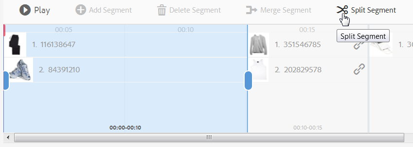

# 互動式影片{#interactive-videos}

您可以輕鬆建立互動式視訊（也稱為可購物視訊），以直接從視訊推動轉換。 檢視器會透過視訊播放器旁的側面板進行互動。 影片反白顯示專案時，面板會捲動相關服務、資訊或產品縮圖以檢視。 客戶可選取縮圖，以直接前往服務或詳細網頁。 他們也可以將商品新增到購物車中，以便立即購買。

影片結束時，會顯示所有方案的視覺化摘要，以推動call to action。 客戶有另一個機會可選取他們想要的專案。 這類可操作且特定的體驗，可增加客戶參與度和轉換率。

另請參閱[互動式影像](/help/assets/dynamic-media/interactive-images.md)。

## 互動視訊的實際運作情況 {#interactive-video-in-action}

若要檢視互動式、可購物視訊的實際運作情況，請選取「[即時示範](https://landing.adobe.com/tw/na/dynamic-media/ctir-2755/live-demos.html)」，捲動至頁面上的「**[!UICONTROL 可購物媒體]**」標題，然後選取可購物視訊以開始播放。

* 在播放期間，當視訊中使用產品時，相同的產品會在右側顯示為縮圖影像。

* 若要暫停視訊並開啟產品的快速檢視，請選取縮圖。 例如，在視訊中選取KitchenAid縮圖影像以體驗混合器的360°旋轉檢視，或放大以檢視混合器詳細資訊。

另請參閱[搭配Dynamic Media使用互動視訊](https://experienceleague.adobe.com/en/docs/experience-manager-cloud-service/content/assets/dynamicmedia/interactive-videos#dynamic-media)

<!-- 

There was a link here that showed the video frame of an interactive video and when the reader selected the frame the video would play https://experienceleague.adobe.com/tools/dynamic-media-demo/shoppable-video/AXIS/index.html. This must now call a new interactive video

-->

<!-- 

[A frame from an interactive, shoppable video](assets/chlimage_1-126.png) *A video frame capture from an interactive, shoppable video.*

-->

>[!NOTE]
>
>如果您在使用者選取縮圖影像時，建立互動視訊以啟動網頁，則某些裝置會封鎖快顯網頁的開啟。 在這種情況下，請變更裝置上的快顯封鎖程式設定。 例如，在Apple iPhone 6上，移至&#x200B;**[!UICONTROL 設定]** > **[!UICONTROL Safari]** > **[!UICONTROL 封鎖快顯視窗]**，然後將控制項滑動至&#x200B;**[!UICONTROL 關閉]**。 現在，當您播放互動式視訊並選取縮圖時，如果您想要開啟快顯視窗，系統會提示您進行選擇。 如果您接受，網頁會開啟。

### 觀看互動式視訊的建立方式 {#watch-how-interactive-videos-are-created}

觀看[互動式視訊建立方式的逐步解說](https://s7d5.scene7.com/s7viewers/html5/VideoViewer.html?videoserverurl=https://s7d5.scene7.com/is/content/&emailurl=https://s7d5.scene7.com/s7/emailFriend&serverUrl=https://s7d5.scene7.com/is/image/&config=Scene7SharedAssets/Universal_HTML5_Video_social&contenturl=https://s7d5.scene7.com/skins/&asset=S7tutorials/InteractiveVideo)（7分30秒）。
(雖然視訊逐步說明已加上Assets on Demand品牌，但Adobe Experience Manager Assets中的互動式視訊仍適用原則和步驟。)

<!-- NOT FOUND ANYMORE. FIND REPLACEMENT
### Adobe customer success webinar {#adobe-customer-success-webinar}

The [Use Interactive Video, Link Sharing, and YouTube sharing in Experience Manager Assets](https://adobecustomersuccess.adobeconnect.com/p1yxzdo4aec/) webinar teaches you how to use interactive video and other features to tie conversion driven events into your video marketing content. -->

## 快速入門：互動式影片 {#quick-start-interactive-videos}

下列逐步工作流程說明可協助您在Dynamic Media中快速啟動並執行互動式影片。

在部分快速入門工作中尋找&#x200B;**範例**&#x200B;標題。 它包含以此[啟動示範網頁為基礎的簡短教學課程，其中&#x200B;*尚未*&#x200B;新增互動功能](https://experienceleague.adobe.com/tools/dynamic-media-demo/shoppable-video/john-lewis/landing-0.html)。

範例 **可協助您說明** ，如何將互動式視訊整合在您自己的網站上。

當您完成最後一個範例區段中的教學課程時，[您的最終示範網頁會以這個方式顯示，其中包含完全整合的互動式視訊](https://experienceleague.adobe.com/tools/dynamic-media-demo/shoppable-video/john-lewis/landing-3.html)。

互動視訊步驟：

1. **（選擇性）識別Quickview變數** — 從識別現有Quickview實作所使用的動態變數開始。 當您建立互動式視訊時，可使用變數將產品縮圖對應至其對應的產品快速檢視。 請參閱[（選擇性）識別Quickview變數](#optional-identifying-quickview-variables)。
   **只有符合下列所有條件時才需要此步驟：**
   * 您要透過觸發至快速檢視，將互動性新增至視訊。
   * 您的Experience Manager實作&#x200B;*不*&#x200B;使用電子商務整合架構。 它不會從IBM®WebSphere®Commerce、Elastic Path、SAP Hybris或Intershop等解決方案將產品資料提取到Experience Manager。

1. **（選擇性）建立互動式視訊檢視器預設集** — 自訂組成播放器的各種元件的外觀和行為，例如視訊筆畫壓感和互動式縮圖。
如果您打算使用現成的互動式視訊檢視器預設集`Shoppable_Video_Light`或`Shoppable_Video_Dark`，則不需要建立自己的互動式視訊檢視器預設集。
請參閱[建立檢視器預設集](/help/assets/dynamic-media/managing-viewer-presets.md#creating-a-new-viewer-preset) （選擇性）和[建立互動式檢視器預設集的特殊考量](/help/assets/dynamic-media/managing-viewer-presets.md#special-considerations-for-creating-an-interactive-viewer-preset)。

1. **上傳視訊及其相關影像資產** — 上傳您要互動的視訊和相關影像。
請參閱[上傳視訊及其相關縮圖資產](#uploading-a-video-and-its-associated-thumbnail-assets)。

   >[!NOTE]
   >
   >Dynamic Media尚不支援MXF視訊格式用於互動式視訊。

1. **將互動性新增至您的視訊** — 新增一或多個時間區段至視訊。 然後，在這些時間區段中建立影像縮圖的關聯。 將每個影像縮圖指派給動作，例如超連結、快速檢視或體驗片段。
(如果您的互動式內容有具有相對URL的連結，尤其是指向Experience Manager Sites頁面的連結，則無法採用URL型連結方法。)
完成發佈互動式視訊資產。 發佈會建立內嵌程式碼或URL，您最終會複製並套用至您的網站登陸頁面。 請參閱[將互動性新增至視訊](#adding-interactivity-to-your-video)。
請參閱[發佈Assets](/help/assets/dynamic-media/publishing-dynamicmedia-assets.md)。

1. **在Experience Manager中，將互動式視訊新增至您的網站或網站** — 如果您使用Experience Manager Sites或eCommerce或兩者，請在Experience Manager中將互動式視訊新增至網頁。 將互動媒體元件拖曳至頁面。 請參閱[將Dynamic Media Assets新增至頁面](/help/assets/dynamic-media/adding-dynamic-media-assets-to-pages.md)。
使用內嵌程式碼或URL，將您的互動式視訊與網站體驗整合。 請參閱[將互動式視訊與您的網站整合](#integrating-an-interactive-video-with-your-website)。
如果您使用協力廠商WCM （Web內容管理員），您必須將新的互動式視訊與網站上使用的現有Quickview實作整合。 請參閱[將互動式視訊與現有的快速檢視](#integrating-an-interactive-video-with-an-existing-quickview)整合。
   [將Dynamic Media Assets新增至頁面](/help/assets/dynamic-media/adding-dynamic-media-assets-to-pages.md)

## （選用）識別快速檢視變數 {#optional-identifying-quickview-variables}

>[!NOTE]
>
>只有在下列情況為真時才需要此工作：
>
>* 您要透過觸發至快速檢視，將互動性新增至視訊。
>* 您的Experience Manager設定未使用電子商務整合架構。 它不會從IBM®WebSphere®Commerce、Elastic Path、SAP Hybris或Intershop提取產品資料。
>
>如果您的Experience Manager實作使用電子商務，您可以略過此任務並繼續下一個任務。

首先，識別您現有Quickview實作所使用的動態變數，以便您可以在互動式視訊建立程式中將產品縮圖對應至其對應的產品Quickview。

當您新增時間區段至視訊時，會指派SKU （庫存單位）和任何其他變數至您新增至區段的每個縮圖。 這類變數稍後會用於顯示正確的Quickview產品。

請務必正確識別哪些變數是觸發唯一產品Quickview的必要專案。

有時候，諮詢負責現有Quickview實作的IT專家就足夠了。 他們可能會知道在系統中識別Quickview的最小資料集。 但是，也可以簡單地分析前端計畫碼的現有行為。

大部分的「快速檢視」實作都使用下列範例：

* 使用者在網站上啟動使用者介面元素。 例如，選取「快速檢視」按鈕。
* 如有需要，網站會傳送Ajax請求至後端以載入快速檢視資料或內容。
* 快速檢視資料會轉譯成內容，以備在網頁上轉譯。
* 最後，前端程式碼會在畫面上以視覺化方式呈現此類內容。

因此，方法就是造訪現有網站中實作Quickview的不同區域。 然後觸發Quickview，並取得網頁傳送的Ajax URL以載入Quickview資料或內容。

通常您不需要使用任何專門的偵錯工具。 現代的網頁瀏覽器配備能夠執行適當工作的網頁檢查器。 以下是一些包含網頁檢查器的網頁瀏覽器範例：

* 若要檢視Google Chrome中的所有傳出HTTP要求，請按&#x200B;**F12** (Windows®)或&#x200B;**Command+Options+I** (Mac)開啟[開發人員工具]面板，然後選取&#x200B;**網路**&#x200B;索引標籤。

* 在Firefox中，使用&#x200B;**F12** (Windows®)或&#x200B;**Command+Option+I** (Mac)啟動Firebug外掛程式，並使用其&#x200B;**[!UICONTROL Net]**&#x200B;標籤。 或者，使用內建的偵測器及其&#x200B;**網路**&#x200B;標籤。

* 在Internet Explorer中，按&#x200B;**F12**&#x200B;啟動偵錯工具。

在瀏覽器中開啟網路監視時，會觸發頁面上的快速檢視。

現在，請在網路記錄中找到Quickview Ajax URL，並複製記錄的URL以供日後分析。 通常當您觸發「快速檢視」時，會有許多要求傳送至伺服器。 通常，快速檢視Ajax URL是清單中的第一個專案。 它具有複雜的查詢字串部分或路徑，而且其回應MIME型別是`text/html`、`text/xml`或`text/javascript`。

在此過程中，請務必使用不同的產品類別和型別，造訪您網站的不同區域。 原因在於「快速檢視」URL具有指定網站類別的共同部分，但只有在您造訪網站的其他區域時才會變更。

最簡單的情況是，快速檢視URL中的唯一變數部分是產品SKU。 在此情況下，在Experience Manager的互動式視訊中，將縮圖新增至時間區段所需的唯一資料片段就是產品SKU值。

對於更複雜的情境，快速檢視URL會新增產品SKU以外的欄位，例如類別ID和顏色代碼。 在這種情況下，在Experience Manager的縮圖資料定義中，每個這類元素都會變成個別變數。

請考量下列快速檢視URL範例及其產生的縮圖變數：

<table>
  <tbody>
  <tr>
    <td><p>單一SKU。 在查詢字串中找到。</p> </td>
    <td><p>錄製的快速檢視URL包含以下專案：</p>
    <ul>
      <li><p><code>https://server/json?productId=866558&amp;source=100</code></p> </li>
      <li><p><code>https://server/json?productId=1196184&amp;source=100</code></p> </li>
      <li><p><code>https://server/json?productId=1081492&amp;source=100</code></p> </li>
      <li><p><code>https://server/json?productId=1898294&amp;source=100</code></p> </li>
    </ul> <p>URL中唯一的變數部分是<code>productId=</code>查詢字串引數的值，而且它顯然是SKU值。 因此，縮圖只需要填入<strong><code>866558</code></strong>、<strong><code>1196184</code></strong>、<strong><code>1081492</code></strong>、<strong><code>1898294</code></strong>等值的SKU欄位。</p> </td>
  </tr>
  <tr>
    <td><p>單一SKU。 在URL路徑中找到。</p> </td>
    <td><p>錄製的快速檢視URL包含以下專案：</p>
    <ul>
      <li><p><code>https://server/product/6422350843</code></p> </li>
      <li><p><code>https://server/product/1607745002</code></p> </li>
      <li><p><code>https://server/product/0086724882</code></p> </li>
    </ul> <p>變數部分位於路徑的最後一部分，且會變成Experience Manager縮圖的SKU值： <strong><code>6422350843</code></strong>、<strong><code>1607745002</code></strong>、<strong><code>0086724882</code></strong>。</p> </td>
  </tr>
  <tr>
    <td><p>查詢字串中的SKU和類別ID。</p> </td>
    <td><p>錄製的快速檢視URL包含以下專案：</p>
    <ul>
      <li><p><code>https://server/quickView/product/?category=1100004&amp;prodId=305466</code></p> </li>
      <li><p><code>https://server/quickView/product/?category=1100004&amp;prodId=310181</code></p> </li>
      <li><p><code>https://server/quickView/product/?category=1740148&amp;prodId=308706</code></p> </li>
    </ul> <p>在這種情況下，URL中有兩個不同的部分。 SKU儲存在<code>prodId</code>引數中，而類別識別碼儲存在<code>category=</code>引數中。</p> <p>因此，縮圖定義成對。 即SKU值和稱為<code>categoryId</code>的額外變數。 產生的配對如下：</p>
    <ul>
      <li>SKU是<code>305466</code>，<code>categoryId</code>是 <code>1100004</code></li>
      <li>SKU是<code>310181</code>，<code>categoryId</code>是 <code>1100004</code></li>
      <li>SKU是<code>308706</code>，<code>categoryId</code>是 <code>1740148</code></li>
    </ul> <p> </p> </td>
  </tr>
  </tbody>
</table>

**範例**

將上述方法套用至範例網站時，您的網頁會有數個產品縮圖，每個縮圖都有「檢視更多」按鈕：

[https://experienceleague.adobe.com/tools/dynamic-media-demo/shoppable-video/john-lewis/landing-0.html](https://experienceleague.adobe.com/tools/dynamic-media-demo/shoppable-video/john-lewis/landing-0.html)

啟用頁面上可用的所有產品快速檢視後，您會取得向後端發出的快速檢視請求清單：

* datafeed/candles-233396346.json
* datafeed/candles-233978050.json
* datafeed/candles-234024346.json
* datafeed/candles-234024356.json
* datafeed/candles-234024359.json
* datafeed/cushions-233939848.json
* datafeed/cushions-234019477.json
* datafeed/cushions-234019483.json
* datafeed/furniture-231747479.json
* datafeed/furniture-232625621.json
* datafeed/furniture-232625626.json
* datafeed/furniture-233939810.json
* datafeed/furniture-233939825.json
* datafeed/furniture-233939828.json
* datafeed/furniture-233939853.json
* datafeed/furniture-233940334.json
* datafeed/glassware-000064007.json
* datafeed/glassware-230722193.json
* datafeed/glassware-233916550.json
* datafeed/glassware-233916597.json

檢視伺服器呼叫，產品專屬資訊只會顯示在請求路徑中。 您也會發現根本不會使用查詢字串，而且其中涉及兩種不同型別的資料片段：

* 第一種是蠟燭、墊子、傢俱和玻璃器具。 您可以將此區段稱為「產品類別」。
* 第二種是產品代碼，例如233916597。 您可以假設這是「產品SKU」。

根據此資訊，整個快速檢視URL的模式如下：

`/datafeed/$categoryId$-$SKU$.json`

根據此類分析，您得出結論：您可以針對縮圖使用下列兩個變數： `categoryId`和`SKU`。

您現在已準備好上傳視訊及其相關縮圖資產。

## （可選）建立互動式視訊檢視器預設集 {#optional-creating-an-interactive-video-viewer-preset}

如果您打算使用預設、現成可用的互動式視訊檢視器預設集型別`Shoppable_Video_dark`或`Shoppable_Video_light`，可以略過此工作並繼續下一個。

在製作環境中選取縮圖時，會出現「快速檢視」對話方塊的預覽。


您可以選擇建立自己的自訂互動式視訊檢視器預設集。 您可以決定視訊播放器的樣式、互動式縮圖，以及在視訊結尾顯示的縮圖格線檢視等。

互動式視訊檢視器預設集可正確轉譯您新增的視訊和所有時間軸區段。 當您在預覽模式中選取產品縮圖時，它也會使用預設快速檢視的範例，讓您在發佈之前測試其互動性。

儲存檢視器預設集後，其狀態會在「檢視器預設集」頁面中自動設為**On **。此狀態表示在動態媒體元件中及您使用它預覽視訊時，都可看到它。請確定您也手動發佈新的檢視器預設集。

請參閱[建立檢視器預設集](/help/assets/dynamic-media/managing-viewer-presets.md#creating-a-new-viewer-preset)以建立您自己的互動式視訊檢視器預設集。

## 上傳視訊及其相關縮圖資產 {#uploading-a-video-and-its-associated-thumbnail-assets}

如果您已上傳視訊和縮圖資產，請繼續進行[新增互動功能至視訊](#adding-interactivity-to-your-video)。

>[!NOTE]
>
>Dynamic Media尚不支援MXF視訊格式用於互動式視訊。

若您上傳了錯誤的影片或影像，或要刪除您不再需要的已上傳影片或影像，請參閱[刪除Assets](/help/assets/manage-digital-assets.md#delete-assets)。

若要上傳視訊及其相關縮圖資產：

1. 將視訊和相關聯的縮圖資產上傳到您想要的資料夾。

   請參閱[上傳資產](/help/assets/manage-digital-assets.md)。
請參閱[使用FTP工作排程](/help/assets/manage-digital-assets.md)上傳資產。

   現在，在視訊中新增互動功能。

## 將互動性新增至視訊 {#adding-interactivity-to-your-video}

您可以使用「建立互動式視訊」頁面上的就地視覺編輯器，將時間軸區段新增至視訊。

新增時間軸區段後，您即可在每個區段內新增縮圖影像。 對於您新增的每個縮圖，您都會對其套用動作。 例如，您可以將快速檢視套用至縮圖、指派超連結至縮圖或體驗片段。

請參閱[體驗片段](/help/sites-cloud/authoring/fragments/content-fragments.md)。

>[!NOTE]
>
>將檢視器內嵌在體驗片段中時，不支援互動式視訊中的社群媒體分享工具。 反之，您可以使用或建立沒有社群媒體分享工具的檢視器預設集。 這類檢視器預設集可讓您成功將其嵌入體驗片段中。

>[!NOTE]
>
>如果您的互動式內容有具有相對URL的連結，尤其是指向Experience Manager Sites頁面的連結，則無法採用URL型連結方法。

在您目前的建立/編輯作業階段期間，支援頁面右上角附近的「復原」和「重做」選項。

儲存互動式視訊後，視訊會立即開啟預覽。 從那裡，您可以選取互動式視訊檢視器預設集並播放視訊，以檢視向客戶呈現的大致呈現方式。

**若要在視訊中新增互動功能：**

1. 在Assets檢視中，導覽至您上傳且想要互動的影片。
1. 執行下列任一項作業：

   * 將滑鼠指標暫留在影像上，然後選取&#x200B;**[!UICONTROL 選取]** （核取記號圖示）。 在工具列上，選取&#x200B;**[!UICONTROL 編輯]**。

   * 將滑鼠停留在影像上，然後選取&#x200B;**[!UICONTROL 更多動作]** （三點圖示） **[!UICONTROL >編輯]**。

   * 若要在「詳細資料檢視」頁面中開啟它，請選取影像。 在工具列上，選取&#x200B;**[!UICONTROL 編輯]**。

1. 在「建立互動式視訊」頁面上，執行下列任一項作業：

   * 若要開始播放視訊，請選取&#x200B;**[!UICONTROL 播放]**&#x200B;按鈕。 當您要反白顯示的特定產品、服務或詳細資訊進入檢視畫面時，請選取工具列上的&#x200B;**[!UICONTROL 新增區段]**。 重複此步驟，直到您到達視訊結尾為止。

     對於您新增的每個時間區段，您可以為其指派一或多個縮圖影像。 然後，您可以將這些縮圖連結至快速檢視產品頁面以供客戶購買，或連結至網頁以取得詳細資訊。

   * 若要開始播放視訊，請選取&#x200B;**[!UICONTROL 播放]**&#x200B;按鈕。 檢視您要反白顯示的特定產品、服務或詳細資料時，請選取&#x200B;**[!UICONTROL 暫停]**。 選取&#x200B;**[!UICONTROL 新增區段]**。

     在您要新增區段的時間軸上的各個點繼續播放和暫停視訊，直到視訊結束。

1. （可選）向左拖曳&#x200B;**[!UICONTROL 時間軸縮放滑桿]**&#x200B;上的橫條，以放大或向右縮小。 此類動作可讓您控制新增區段的詳細程度。

   

   視視訊長度而定，「區段持續時間」會預設為下列值：

   <table>
      <tbody>
        <tr>
        <td><strong>如果影片長度為……</strong></td>
        <td><strong>「區段持續時間」設定預設為……</strong></td>
        </tr>
        <tr>
        <td>3分鐘以上</td>
        <td>60秒</td>
        </tr>
        <tr>
        <td>2-3 分鐘</td>
        <td>30秒</td>
        </tr>
        <tr>
        <td>1-2 分鐘</td>
        <td>20秒<br /> </td>
        </tr>
        <tr>
        <td>30-60秒</td>
        <td>10秒</td>
        </tr>
        <tr>
        <td>30秒以內</td>
        <td>5秒</td>
        </tr>
      </tbody>
    </table>

   視訊時間軸使用的熒幕空間量，不限其可用空間。 因此，當您調整瀏覽器大小時，您新增的區段會維持其正確寬度。

   舉例來說，以下三個熒幕擷取畫面均使用相同影片。 請注意，每個區段的寬度會隨著「時間軸比例」設定而改變。

   

   熒幕擷圖A

   上方的熒幕擷圖A顯示29秒產品視訊的預設檢視。 「時間軸比例」設定為預設值5秒。

   

   熒幕擷圖B

   在上方的熒幕擷圖B中，「時間軸比例」滑桿已從5秒的預設值拖曳至3秒。 請注意，個別「時間軸比例」時間戳記現在都以3秒為間隔設定。

   

   熒幕擷圖C

   在上方的熒幕擷圖C中，「時間軸比例」設定已移動到8秒。 請注意包含產品縮圖的區段縮小方式。 若是長影片，縮小即可檢視超過頁面寬度正常顯示之區段的概述。

1. (選用) 執行以下任一操作：

   * 調整區段的開始時間和結束時間。

     選取區段，然後拖曳前導或尾隨的藍色橢圓以分別調整開始或結束時間。 顯示的視訊影格會根據您的調整移至視訊中的適當時間。 時間軸區段的移動會根據時間軸中任何相鄰區段而受限制。 允許的區段時間下限為一秒。

     使用下列導覽捷徑快速檢查並微調視訊區段：

      * 若要直接尋找該區段開頭的視訊，請選取開頭的藍色橢圓形。
      * 若要直接搜尋視訊到該區段的結尾，請選取結尾的藍色橢圓形。
      * 若要將視訊播放傳回該區段的開頭，請選取整個區段。

   

   重新定位時間軸區段的結尾

   * 若要刪除區段

     選取時間軸上的最後一個區段，然後在工具列上選取&#x200B;**[!UICONTROL 刪除區段]**。 如果選取兩個或多個區段，則會停用`Delete Segment`功能。

     您只能刪除最後一個區段。 例如，如果您想要刪除時間軸上的所有區段，您必須一律選取最後一個區段，然後選取&#x200B;**[!UICONTROL 刪除區段]**。

1. 選取您要關聯一或多個縮圖影像的時間區段。
1. 在視訊的右側，選取&#x200B;**[!UICONTROL 內容]**&#x200B;索引標籤。
1. 在「內容」標籤下，選取&#x200B;**[!UICONTROL 選取Assets]**，然後瀏覽並選取您要與視訊搭配使用的所有影像資產。 選取的資產會新增至「內容」標籤中的「資產選擇器」面板。

1. 在「內容」標籤下方的資產選取器中，執行下列任一項作業：

   <table>
      <tbody>
        <tr>
        <td>若要將縮圖與所選時間軸區段相關聯</td>
        <td><p>在右側的資產選擇器面板中選取影像。</p> <p>您可以對時間軸區段新增任意數量的縮圖。 對於您選取的每個影像，資產選取器中的影像上方都會顯示勾號。</p> </td>
        </tr>
        <tr>
        <td>若要從選取的時間表區段移除縮圖</td>
        <td><p>執行下列任一項作業：</p>
          <ul>
          <li>在資產選擇器面板中，選取帶有勾號的影像以取消選取。 影像資產已從時間軸區段中移除。<br /> </li>
          <li>在選取的時間表區段中，選取影像，然後在工具列上選取<strong>刪除產品</strong>。</li>
          </ul> </td>
        </tr>
      </tbody>
    </table>

   

   在資產選擇器面板中選取影像，可將其新增至所選的時間軸區段。

1. 選取其中一個時間表區段內的單一縮圖影像，然後選取「**[!UICONTROL 動作]**」標籤。
1. 執行下列任一項作業：
   <table> 
    <tbody> 
      <tr> 
      <td>若要將選取的縮圖影像與快速檢視產生關聯</td> 
      <td><p>在動作型別下，選取<strong>快速檢視</strong>。</p> <p>如果您是Experience Manager Sites和電子商務客戶：</p> 
       <ul> 
       <li>請注意，「SKU值」文字欄位已預先填入所選產品的SKU （庫存單位）。 SKU是您提供的每個不同產品或服務的唯一識別碼。 當影像與Experience Manager Commerce中的產品相關聯時，會自動填入此欄位。</li> 
       <li>如果預先填入的SKU不正確，請選取「產品挑選器」圖示（放大鏡）以開啟「選取產品」頁面。 選取您要使用的產品，然後選取頁面右上角的核取標籤。 您會返回互動式視訊編輯器。</li> 
       </ul> <p> 如果您<em>不是</em> Experience Manager Sites或電子商務客戶</p> 
       <ul> 
       <li>請參閱<a href="/help/assets/dynamic-media/carousel-banners.md#identifying-hotspot-and-image-map-variables">識別熱點變數</a>。 必須定義這些變數。</li> 
       <li>依預設，此SKU欄位會使用影像資產的檔案名稱，但不含副檔名。 如果您根據SKU遵循檔案的標準命名慣例，則此欄位通常不需要任何額外的編輯。 </li> 
       <li>否則，請編輯預設值並輸入正確的SKU值。 在「SKU值」文字欄位中，輸入產品的SKU （庫存單位），這是您提供的每個不同產品或服務的唯一識別碼。 輸入的SKU值會自動填入「快速檢視」範本的變數部分，讓系統知道要將選取的影像與特定SKU的「快速檢視」建立關聯。</li> 
       </ul> <p>（選擇性）如果快速檢視中有其他變數您必須用來進一步識別產品，請選取<strong>新增一般變數</strong>。 在文字欄位中，指定額外的變數。 例如，<code>category=Womens</code>是新增的變數。</p> <p> </p> </td> 
      </tr> 
      <tr> 
      <td>若要將選取的縮圖影像與超連結產生關聯</td> 
      <td><p>在「動作型別」下，選取<strong>超連結</strong>，然後執行下列任一項作業：</p> 
       <ul> 
       <li>如果您是Experience Manager Sites客戶，請選取「網站選擇器」圖示（資料夾）以導覽至網頁。 如果您的互動式內容有具有相對URL的連結，尤其是指向Experience Manager Sites頁面的連結，則無法採用URL型連結方法。</li> 
       <li>如果您是獨立Dynamic Media客戶，請在HREF文字欄位中指定連結網頁的完整URL路徑。</li> 
       </ul> <p>請務必指定是在新的瀏覽器分頁中還是在目前的分頁中開啟連結。</p> </td> 
      </tr> 
      <tr> 
      <td>若要將選取的縮圖影像與體驗片段建立關聯</td> 
      <td><p>在「動作型別」下，選取<strong>體驗片段</strong>，然後執行下列動作：<p> 
       <ul> 
       <li>如果您是Experience Manager Sites客戶，請選取「搜尋」圖示（放大鏡）以開啟「體驗片段」頁面。 選取您要使用的體驗片段，然後選取<strong>若要返回上一頁的「動作」面板，請選取頁面右上角的</strong>。<br />檢視<a href="/help/sites-cloud/authoring/fragments/content-fragments.md">體驗片段</a>。</li> 
      </ul> 
       <ul> 
       <li>指定體驗片段在視訊中顯示的寬度和高度。</li>
       </ul><strong>注意</strong>：當您將檢視器內嵌在體驗片段中時，不支援互動式視訊中的社群媒體分享工具。 反之，您可以使用或建立沒有社群媒體分享工具的檢視器預設集。 這類檢視器預設集可讓您成功將其嵌入體驗片段中。</p></tr>&lt; 
      <tr> 
      <td>若要編輯已指派給縮圖影像的動作</td> 
      <td>在時間軸區段中，選取文字標籤右側具有鏈結連結的縮圖影像。 鏈結連結表示已為其指定動作。 若要進行變更，請選取<strong>動作</strong>標籤。</td> 
      </tr> 
      <tr> 
      <td>若要變更縮圖影像的文字標籤</td> 
      <td><p>依預設，文字標籤會使用縮圖影像的<code>Title</code>中繼資料欄位。 如果<code>Title</code>不存在，則會改用縮圖影像的檔案名稱，但不加上副檔名。</p> <p>若要變更縮圖影像的文字標籤，請在<strong>動作</strong>標籤下，直接在顯示的影像資產下方，輸入所要的文字。 請參閱下圖。</p> <p>新文字標籤僅供視訊播放器本身及時間軸區段中顯示的縮圖文字使用。 標籤變更不會影響縮圖影像的「標題」中繼資料欄位或其檔案名稱。</p> </td> 
      </tr> 
      <tr> 
      <td>還原變更</td> 
      <td>在頁面的右上角附近，選取<strong>復原</strong>或<strong>取消復原</strong>。</td> 
      </tr> 
    </tbody> 
   </table>

   

   新的文字標籤會新增至縮圖影像。

1. 執行下列任一項作業：

   * 重複步驟6至11，在視訊中的時間軸區段新增更多縮圖影像。
   * 繼續至可選步驟13。

1. （可選）執行下列任一項作業：

   * **[!UICONTROL 合併區段]** — 您可以將兩個相鄰的區段（無論是否指派了產品縮圖）合併為一個區段。

     在時間軸上，選取要合併成兩個或多個連續區段的區段。 下方影像中選取的兩個區段沒有藍色橢圓形的拖曳控點。

     在工具列上選取&#x200B;**[!UICONTROL 合併區段]**。

   

   將兩個選取的5秒區段合併為1個10秒區段。

   * **[!UICONTROL 分割區段]** — 您可以將單一區段分割成兩個計時相等的區段。 如果已有產品縮圖指派給區段，則縮圖會合併至左側區段。

     在時間軸上，選取您要分成兩半的區段，然後在工具列上選取&#x200B;**[!UICONTROL 分割區段]**。

     選取兩個或多個區段會停用&#x200B;**[!UICONTROL 分割區段]**&#x200B;功能。

   

   將選取的十秒區段分割為兩個區段，每個區段五秒。

1. 在&#x200B;**[!UICONTROL 建立互動式視訊]**&#x200B;頁面的右上角附近，會顯示目前與視訊搭配使用的選取檢視器預設集名稱。 若要選取其他檢視器預設集，請選取名稱。

   例如，`Shoppable_Video_light`檢視器預設集可讓您播放視訊，並在視訊旁邊顯示白色區域。 顯示區域是播放期間顯示可選取縮圖影像的位置。 `Shoppable_Video_dark`檢視器預設集可讓您播放視訊，且視訊旁邊會顯示黑色區域。

   如果您建立了自己的互動式視訊檢視器預設集，則可在可供您選擇的預設集清單中看到該預設集。

   完成時，選取&#x200B;**[!UICONTROL 儲存]**。

   >[!NOTE]
   >
   >當您儲存互動式視訊時，會自動 `.vtt` 儲存相關的檔案。`.vtt`檔案已儲存至`_VTT`Assets **[!UICONTROL 根目錄的]**&#x200B;資料夾。 您的互動式視訊必須有檔案和資料夾才能在網站上正確播放。因此，請勿移動、編輯或刪除資料夾 `_VTT` 或其內容。

1. 發佈互動式視訊。 發佈會建立內嵌程式碼或URL，您最終會複製並貼到您的網站上。

   如果您新增與快速檢視的互動，請僅使用內嵌程式碼；如果您新增與超連結網頁的互動，也可以使用已發佈的URL。 但請注意，如果您的互動式內容有具有相對URL的連結，尤其是指向Experience Manager Sites頁面的連結，則無法採用URL型連結方法。

   請參閱[發佈資產](publishing-dynamicmedia-assets.md)。

   >[!NOTE]
   >
   >若要發佈具有快速檢視的可購物視訊，請務必另外從您的商務區域發佈視訊的每個相關影像資產。

   新增時間軸區段並發佈互動式視訊後，您就可以將其新增至您現有的網站登陸頁面。 請參閱[將互動式視訊與您的網站整合](#integrating-an-interactive-video-with-your-website)。

## 發佈互動式視訊資產 {#publishing-interactive-video-assets}

如需如何發佈互動式視訊資產的詳細資訊，請參閱[發佈Assets](/help/assets/dynamic-media/publishing-dynamicmedia-assets.md)。

## 將互動式視訊與您的網站整合 {#integrating-an-interactive-video-with-your-website}

上傳影片、新增時間軸區段及發佈互動式影片後，您現在就能將其新增至現有網站。

如果您是Experience Manager Sites客戶，可以將互動式媒體元件拖曳至頁面，以新增互動式視訊。 請參閱[將Dynamic Media Assets新增至頁面](/help/assets/dynamic-media/adding-dynamic-media-assets-to-pages.md)。

如果您是獨立Experience Manager Assets客戶，可以手動將互動式視訊新增至您的網站，如本節所述。

1. 複製已發佈互動式視訊的內嵌程式碼或URL。
請參閱[將視訊或影像檢視器嵌入網頁](/help/assets/dynamic-media/embed-code.md)。
如果您新增與快速檢視的互動，請僅使用內嵌程式碼；如果您新增與超連結網頁的互動，也可以使用已發佈的URL。 但請注意，如果您的互動式內容有具有相對URL的連結，尤其是指向Experience Manager Sites頁面的連結，則無法採用URL型連結方法。

1. 在目標之網頁程式碼中，識別靜態視訊的位置。
1. 移除靜態視訊，並以您從Experience Manager Assets複製的內嵌程式碼或URL取代程式碼（依現狀）。
複製的內嵌程式碼是針對回應式環境所設定，因此會自動符合先前由靜態視訊佔用的區域。

>[!NOTE]
>
>此時，如果您只新增超連結網頁的互動功能，也就完成了。
>
>不過，如果您新增任何互動來觸發快速檢視，互動視訊旁的縮圖僅供顯示，尚未與您現有的快速檢視整合。 在這種情況下，您必須將互動式視訊與網站上現有的快速檢視整合。

**範例**

以示範網站為例：

[https://experienceleague.adobe.com/tools/dynamic-media-demo/shoppable-video/john-lewis/landing-0.html](https://experienceleague.adobe.com/tools/dynamic-media-demo/shoppable-video/john-lewis/landing-0.html)

請注意，視訊內嵌程式碼為標準版：

```js {.line-numbers}
<style type="text/css">
 #s7video_div.s7videoviewer{
   width:100%;
   height:auto;
 }
</style>

<script type="text/javascript" src="https://demos-pub.assetsadobe.com/etc/dam/viewers/s7viewers/html5/js/VideoViewer.js"></script>
<div id="s7video_div"></div>
<script type="text/javascript">
 var s7videoviewer = new s7viewers.VideoViewer({
  "containerId" : "s7video_div",
  "params" : {
   "serverurl" : "https://adobedemo62-h.assetsadobe.com/is/image",
   "contenturl" : "https://demos-pub.assetsadobe.com/",
   "config" : "/etc/dam/presets/viewer/Video",
   "config2": "/etc/dam/presets/analytics",
   "videoserverurl": "https://gateway-na.assetsadobe.com/DMGateway/public/demoCo",
   "posterimage": "/content/dam/marketing/shoppable-video/john-lewis/shoppable-video-john-lewis-2014.mp4",
   "asset" : "/content/dam/marketing/shoppable-video/john-lewis/shoppable-video-john-lewis-2014.mp4" }
 }).init();
</script>
```

整合就像移除視訊內嵌程式碼，並從Experience Manager將其取代為互動式視訊內嵌程式碼一樣簡單。 您可以在以下URL看到結果。 雖然它會顯示頁面上顯示的互動視訊，但尚未與現有的快速檢視整合：

[https://experienceleague.adobe.com/tools/dynamic-media-demo/shoppable-video/john-lewis/landing-1.html](https://experienceleague.adobe.com/tools/dynamic-media-demo/shoppable-video/john-lewis/landing-1.html)

## 將互動式視訊與現有的Quickview整合 {#integrating-an-interactive-video-with-an-existing-quickview}

>[!NOTE]
>
>此工作僅適用於獨立Experience Manager Assets客戶。

此程式的最後一步是將您的互動式視訊與網站上使用的現有Quickview實作整合。 整合沒有適用於所有情況的解決方案。 每個快速檢視實施都是獨一無二的。 因此，需要涉及前端IT人員協助的特定方法。

現有的快速檢視實施通常代表一連串在網頁上發生的相互關聯動作，其順序如下：

1. 使用者會在您網站的使用者介面中觸發元素。
1. 前端程式碼會根據步驟1所觸發的使用者介面元素來取得快速檢視URL。
1. 前端程式碼會使用步驟2中取得的URL傳送AJAX要求。
1. 後端邏輯會將對應的快速檢視資料或內容傳回前端程式碼。
1. 前端程式碼會載入快速檢視資料或內容。
1. 前端程式碼可選擇性將載入的Quickview資料轉換為HTML表示法。
1. 前端程式碼會顯示模型對話方塊或面板，並在畫面上為使用者呈現HTML內容。

頁面邏輯不會在任意點將這些專案直接呼叫為公用API端點。 相反地，這是一種鏈結呼叫，下個步驟的每一個都會隱藏在上一個步驟的最後一個階段（回撥）。

當互動式視訊取代步驟1和步驟2的一部分時，檢視器會處理視訊內的任何縮圖選取專案。 檢視器會將事件傳回至包含先前新增至Experience Manager之所有縮圖資料的網頁。

在此類事件處理常式中，前端程式碼會執行下列動作：

* 聆聽互動式視訊所發出的事件。
* 根據縮圖資料建構快速檢視URL。
* 觸發從後端載入快速檢視的程式；此程式會呈現在畫面上以供顯示。

此外，互動式視訊檢視器支援全熒幕操作模式。 使用者透過選擇縮圖而不離開全熒幕來觸發快速檢視。 若要實現此功能，請修改前端程式碼，以便將「快速檢視」強制回應對話方塊附加至檢視器的容器。 請勿新增當檢視器處於全熒幕模式時無法使用的檔案BODY或其他網頁元素。 執行此工作的程式碼會監聽另一個檢視器回呼，此回呼會在檢視器載入頁面後傳送。

Experience Manager傳回的內嵌程式碼已備有立即可用的事件處理常式。 如下列醒目提示的程式碼片段所示，系統會將它標籤為已註解：

```js {.line-numbers}
<style type="text/css">
 #s7interactivevideo_div.s7interactivevideoviewer{
   width:100%;
   height:auto;
 }
</style>
<script type="text/javascript" src="https://demos-pub.assetsadobe.com/etc/dam/viewers/s7viewers/html5/js/InteractiveVideoViewer.js"></script>

<div id="s7interactivevideo_div"></div>
<script type="text/javascript">
 var s7interactivevideoviewer = new s7viewers.InteractiveVideoViewer({
  "containerId" : "s7interactivevideo_div",
  "params" : {
   "serverurl" : "https://adobedemo62-h.assetsadobe.com/is/image",
   "contenturl" : "https://demos-pub.assetsadobe.com/",
   "config" : "/etc/dam/presets/viewer/Shoppable_Video_light",
   "config2": "/etc/dam/presets/analytics",
   "videoserverurl": "https://gateway-na.assetsadobe.com/DMGateway/public/demoCo",
   "interactivedata": "content/dam/_VTT/marketing/shoppable-video/john-lewis/shoppable-video-john-lewis-2014.mp4.svideo.vtt",
   "VideoPlayer.contenturl": "https://adobedemo62-h.assetsadobe.com/is/content",
   "asset" : "/content/dam/marketing/shoppable-video/john-lewis/shoppable-video-john-lewis-2014.mp4" }
 })
 /* // Example of interactive video event for quickview.
   s7interactivevideoviewer.setHandlers({
   "quickViewActivate": function(inData) {
     var sku=inData.sku; //SKU for product ID
    //To pass other parameter from the hotspot, you need to add custom parameter during the hotspot setup as parameterName=value
    loadQuickView(sku); //Replace this call with your quickview plugin
    //See your quickviewer plugin for the quickview call
    },
"initComplete":function() {
    //--- Attach quickview pop-up to viewer container so pop-up works in fullscreen mode ---
    var popup = document.getElementById('quickview_div'); // get custom quickview container
    popup.parentNode.removeChild(popup); // remove it from current DOM
    var sdkContainerId = s7interactivevideoviewer.getComponent("container").getInnerContainerId(); // get viewer container component
    var inner_container = document.getElementById(sdkContainerId);
    inner_container.appendChild(popup); //Attach custom quickview container to viewer
    }
   });
 */
 s7interactivevideoviewer.init();
</script>
```

因此，只需取消註解上述醒目提示的程式碼片段，並將虛擬處理常式本文取代為特定網頁的專屬程式碼。

標準內嵌程式碼中存在兩個預設的回呼處理常式： `quickViewActivate`和`initComplete`。 在檢視器中選取縮圖時，就會觸發`quickViewActivate`處理常式。 使用它來整合檢視器與Quickview啟用邏輯。 檢視器載入頁面時，`initComplete`處理常式只會觸發一次。 此處理常式可用來調整快速檢視對話方塊在網頁DOM中的位置。

建構快速檢視URL的程式與識別本主題先前所述縮圖變數的程式相反。 使用先前識別的快速檢視URL範例，您可以檢視快速檢視URL在各種情況下的建構方式：

<table>
  <tbody>
  <tr>
    <td><p>在查詢字串中找到單一SKU</p> </td>
    <td><code class="code">s7interactivevideoviewer.setHandlers({
      "quickViewActivate": function(inData) {
      var quickViewUrl = "https://server/json?productId=" + inData.sku + "&amp;source=100";
      },
      });</code></td>
  </tr>
  <tr>
    <td>在URL路徑中找到單一SKU</td>
    <td><code class="code">s7interactivevideoviewer.setHandlers({
      "quickViewActivate": function(inData) {
      var quickViewUrl = "https://server/product/" + inData.sku;
      },
      });</code></td>
  </tr>
  <tr>
    <td><p>查詢字串中的SKU和類別ID</p> </td>
    <td><code class="code">s7interactivevideoviewer.setHandlers({
      "quickViewActivate": function(inData) {
      var quickViewUrl = "https://server/quickView/product/?category=" + inData.categoryId + "&amp;prodId=" + inData.sku;
      },
      });</code></td>
  </tr>
  </tbody>
</table>

觸發「快速檢視」URL及啟動「快速檢視」面板的最後一個步驟，極有可能需要您IT部門的前端IT人員協助。 他們知道如何透過適當的步驟正確觸發快速檢視實施，並擁有現成的快速檢視URL。

您可以檢視這些步驟如何套用至示範網站，以將互動式視訊與Quickview程式碼完全整合。 在本主題的前面，快速檢視URL的結構識別如下：

```xml {.line-numbers}
/datafeed/$CategoryId$-$SKU$.json
```

在`quickViewActivate`中，從檢視器提供的`inData.categoryId`和`inData.sku`欄位重新建構URL，如下所示：

```js {.line-numbers}
var sku=inData.sku;
var categoryId=inData.categoryId;
var quickViewUrl = "datafeed/" + categoryId + "-" + sku + ".json";
```

示範網站正在使用簡單的`loadQuickView()`函式呼叫觸發Quickview對話方塊。 此函式僅接受一個引數，即快速檢視資料URL。 因此，整合互動式視訊的最後一步是將下列程式碼行新增到`quickViewActivate`處理常式：

```xml {.line-numbers}
loadQuickView(quickViewUrl);
```

最後，請確定您的「快速檢視」對話方塊已附加至檢視器的容器元素。 內嵌程式碼預設提供實現此功能的範例步驟。 若要取得檢視器容器元素的參考，您可以使用下列幾行程式碼：

```js {.line-numbers}
var sdkContainerId = s7interactivevideoviewer.getComponent("container").getInnerContainerId(); // get viewer container component
var inner_container = document.getElementById(sdkContainerId);
```

其中`inner_container`是檢視器所管理的`DIV`專案的參考。 您希望對話方塊成為該`DIV`的子項。

找出模組對話方塊元素並將其附加至上述容器的步驟會因大小寫而異。 同樣地，您可以向熟悉您所需快速檢視實作的前端開發人員尋求協助。

對於範例網站，快速檢視強制回應對話方塊會實作為`DIV`，且快速檢視強制回應ID會直接附加至檔案`BODY`。 因此，將該對話方塊移至檢視器容器的程式碼會直接顯示如下：

```js {.line-numbers}
var sdkContainerId = s7interactivevideoviewer.getComponent("container").getInnerContainerId(); // get viewer container component
var inner_container = document.getElementById(sdkContainerId);
inner_container.appendChild(document.getElementById("quickview-modal"));
```

完整的原始程式碼如下：

```javascript {.line-numbers}
<style type="text/css">
 #s7interactivevideo_div.s7interactivevideoviewer{
   width:100%;
   height:auto;
 }
</style>
<script type="text/javascript" src="https://demos-pub.assetsadobe.com/etc/dam/viewers/s7viewers/html5/js/InteractiveVideoViewer.js"></script>

<div id="s7interactivevideo_div"></div>
<script type="text/javascript">
 var s7interactivevideoviewer = new s7viewers.InteractiveVideoViewer({
  "containerId" : "s7interactivevideo_div",
  "params" : {
   "serverurl" : "https://adobedemo62-h.assetsadobe.com/is/image",
   "contenturl" : "https://demos-pub.assetsadobe.com/",
   "config" : "/etc/dam/presets/viewer/Shoppable_Video_light",
   "videoserverurl": "https://gateway-na.assetsadobe.com/DMGateway/public/demoCo",
   "interactivedata": "content/dam/_VTT/marketing/shoppable-video/john-lewis/shoppable-video-john-lewis-2014.mp4.svideo.vtt",
   "VideoPlayer.contenturl": "https://adobedemo62-h.assetsadobe.com/is/content",
   "asset" : "/content/dam/marketing/shoppable-video/john-lewis/shoppable-video-john-lewis-2014.mp4" }
 })
 // Example of interactive video event for quickview.
   s7interactivevideoviewer.setHandlers({
   "quickViewActivate": function(inData) {
     var sku=inData.sku; //SKU for product ID
     var categoryId=inData.categoryId; //categoryId
    var quickViewUrl = "datafeed/" + categoryId + "-" + sku + ".json";
    loadQuickView(quickViewUrl);
    },
   "initComplete":function() {
    //--- Attach quickview pop-up to viewer container so pop-up works in fullscreen mode ---
    var sdkContainerId = s7interactivevideoviewer.getComponent("container").getInnerContainerId(); // get viewer container component
    var inner_container = document.getElementById(sdkContainerId);
    inner_container.appendChild(document.getElementById("quickview-modal"));
    }
   });
 s7interactivevideoviewer.init();
</script>
```

最後示範網站與完全整合的互動式視訊看起來如下所示：

[https://experienceleague.adobe.com/tools/dynamic-media-demo/shoppable-video/john-lewis/landing-3.html](https://experienceleague.adobe.com/tools/dynamic-media-demo/shoppable-video/john-lewis/landing-3.html)

## 使用Quickview建立自訂快顯視窗® {#using-quickviews-to-create-custom-pop-ups}

請參閱[使用Quickview](/help/assets/dynamic-media/custom-pop-ups.md)建立自訂快顯視窗。
