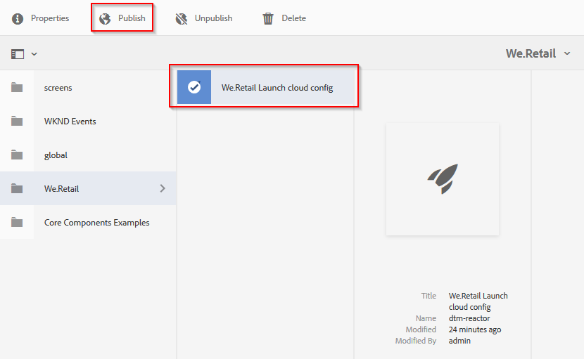

# 整合Dynamic Media檢視器與Adobe Analytics及Experience Platform Launch{#integrating-dynamic-media-viewers-with-adobe-analytics-and-adobe-launch}

## 什麼是Dynamic Media檢視器與Adobe Analytics和Experience Platform Launch整合？{#what-is-dynamic-media-viewers-integration-with-adobe-analytics-and-adobe-launch}

新的&#x200B;*Dynamic Media檢視器*&#x200B;擴充功能適用於Platform launch和Dynamic Media檢視器5.13，可讓Adobe Analytics和Platform launch的客戶在其Platform launch組態中使用檢視器專屬的事件和資料。

此整合意味著您可以追蹤Dynamic Media檢視器在您與Adobe Analytics網站上的使用情況。 同時，您也可以將檢視器公開的事件和資料與來自Adobe或第三方的任何其他Platform launch擴充功能搭配使用。

如需擴充功能的詳細資訊，請參閱Adobe使用指南中的[Experience Platform Launch擴充功能](https://experienceleague.adobe.com/docs/launch/using/extensions-ref/overview.html#adobe-extension)。

**本主題適用於以下主題：網** 站管理員、Adobe Experience Manager平台的開發人員和營運人員。

### 整合的限制{#limitations-of-the-integration}

* Dynamic Media檢視器的Experience Platform Launch整合無法在Experience Manager作者節點中運作。 在WCM頁面發佈之前，您無法看到任何追蹤。
* 「快顯」操作模式不支援Dynamic Media檢視器的Experience Platform Launch整合，在該模式下，檢視器URL是使用「資產詳細資料」頁面上的「URL」按鈕取得。
* Experience Platform Launch整合無法與舊版檢視器Analytics整合同時使用（透過`config2=`參數）。
* 視訊追蹤的支援僅限核心播放追蹤，如[追蹤概述](https://experienceleague.adobe.com/docs/media-analytics/using/sdk-implement/track-av-playback/track-core-overview.html#player-events)所述。 尤其是，不支援QoS、廣告、章節／區段或錯誤追蹤。
* 使用&#x200B;*Dynamic Media查看器*&#x200B;擴展的資料元素不支援資料元素的儲存持續時間配置。 儲存持續時間必須設定為&#x200B;**[!UICONTROL 無]**。

### 整合{#use-cases-for-the-integration}的使用案例

與Experience Platform Launch整合的主要使用案例是同時使用Experience Manager資產和Experience Manager網站的客戶。 在這些情況下，您可以在Experience Manager作者節點和Experience Platform Launch之間設定標準整合，然後將Sites實例與Experience Platform Launch屬性關聯。 之後，任何新增至「網站」頁面的Dynamic MediaWCM元件都會追蹤檢視者的資料和事件。

請參閱[關於在Experience Manager網站中追蹤Dynamic Media檢視器](https://wiki.corp.adobe.com/display/~oufimtse/Dynamic+Media+Viewers+integration+with+Adobe+Launch#DynamicMediaViewersintegrationwithAdobeLaunch-TrackingDynamicMediaViewersinAEMSites)。

整合支援的次要使用案例是僅使用Experience Manager資產或Dynamic Media經典資產的客戶。 在這種情況下，您會取得檢視器的內嵌程式碼，並將它新增至網站頁面。 然後，從Experience Platform Launch取得Experience Platform Launch程式庫生產URL，並手動將其新增至網頁程式碼。

請參閱[關於使用內嵌代碼追蹤Dynamic Media檢視器。](https://wiki.corp.adobe.com/display/~oufimtse/Dynamic+Media+Viewers+integration+with+Adobe+Launch#DynamicMediaViewersintegrationwithAdobeLaunch-TrackingDynamicMediaViewersusingEmbedcode)

## 資料和事件追蹤在整合{#how-data-and-event-tracking-works-in-the-integration}中的運作方式

整合運用兩種獨立且獨立的Dynamic Media檢視器追蹤類型：*Adobe Analytics*&#x200B;和&#x200B;*Adobe Analytics音頻和視頻*。

### 關於使用Adobe Analytics{#about-tracking-using-adobe-analytics}進行追蹤

Adobe Analytics可讓您追蹤使用者在網站上與Dynamic Media檢視器互動時所執行的動作。 Adobe Analytics也可讓您追蹤檢視器特定的資料。 例如，您可以追蹤和記錄檢視載入事件以及資產名稱、發生的任何縮放動作，以及視訊播放動作。

在Experience Platform Launch中，*資料元素*&#x200B;和&#x200B;*規則*&#x200B;的概念可搭配運作以啟用Adobe Analytics追蹤。

#### 關於Experience Platform Launch{#about-data-elements-in-adobe-launch}中的資料元素

「Experience Platform Launch中的資料元素」是指其值是靜態定義，或根據網頁或「Dynamic Media檢視器」資料的狀態動態計算的命名屬性。

「資料元素」定義的可用選項取決於「Experience Platform Launch」屬性中安裝的「擴充功能」清單。 「核心」擴充功能已預先安裝，在任何組態中都可立即使用。 此「核心」擴充功能可定義來自Cookie、JavaScript程式碼、查詢字串及許多其他來源的資料元素。

對於Adobe Analytics跟蹤，必須安裝其他幾個擴展，如[安裝和設定擴展](#installing-and-setup-of-extensions)中所述。 Dynamic Media檢視器擴充功能可新增定義資料元素的能力，此值是動態檢視器事件的引數。 例如，可參考檢視器類型，或載入時檢視器所報告的資產名稱、使用者縮放時所報告的縮放等級等等。

Dynamic Media檢視器擴充功能會自動將其「資料元素」的值保持為最新。

定義後，「資料元素」可以使用「資料元素」選取器介面工具集，用於Experience Platform LaunchUI的其他位置。 尤其是，為Dynamic Media檢視器追蹤而定義的資料元素，在規則中由Adobe Analytics擴充功能的設定變數動作引用（請參閱下文）。

請參閱《Experience Platform Launch使用手冊》中的[資料元素](https://experienceleague.adobe.com/docs/launch/using/reference/manage-resources/data-elements.html#reference)。

#### 關於Experience Platform Launch{#about-rules-in-adobe-launch}中的規則

「Experience Platform Launch中的規則」(Rule in Moginal)是一種不可知配置，它定義了構成規則的三個區域：*Events*、*Conditions*&#x200B;和&#x200B;*Actions*:

* *事件* (if)告訴Experience Platform Launch何時觸發規則。
* *條件* (if)告知Experience Platform Launch觸發規則時允許或不允許的其他限制。
* *動作* （接著）會告訴Experience Platform Launch觸發規則時該做什麼。

「事件」、「條件」和「動作」區段中可用的選項取決於「Experience Platform Launch屬性」中安裝的副檔名。 *Core*&#x200B;擴充功能已預先安裝，在任何組態中都可立即使用。 此擴充功能提供數個事件選項，例如基本的瀏覽器層級動作，包括焦點變更、按鍵和表單提交。 它也包含條件選項，例如Cookie值、瀏覽器類型等。 對於「動作」，只有「自訂代碼」選項可用。

對於Adobe Analytics跟蹤，必須安裝其他幾個擴展，如[安裝和設定擴展](#installing-and-setup-of-extensions)中所述。 具體而言：

* Dynamic Media檢視器擴充功能將支援的事件清單延伸至Dynamic Media檢視器專屬的事件，例如檢視器載入、資產交換、放大和視訊播放。
* Adobe Analytics擴充功能以傳送資料至追蹤伺服器所需的兩個動作，擴充支援動作清單：*設定變數*&#x200B;和&#x200B;*傳送信標*。

若要追蹤Dynamic Media觀眾，可使用下列任何類型：

* 來自Dynamic Media檢視器擴充功能、核心擴充功能或任何其他擴充功能的活動。
* 規則定義中的條件。 或者，您可將條件區域保留為空。

在「動作」區段中，您必須有&#x200B;*設定變數*&#x200B;動作。 此動作會告訴Adobe Analytics如何以資料填入追蹤變數。 同時，*設定變數*&#x200B;動作不會傳送任何內容至追蹤伺服器。

*設定變數*&#x200B;動作後面必須有&#x200B;*傳送信標*&#x200B;動作。 *傳送信標*&#x200B;動作實際會傳送資料至分析追蹤伺服器。 *設定變數*&#x200B;和&#x200B;*傳送信標*&#x200B;這兩個動作都來自Adobe Analytics分機。

請參閱《Experience Platform Launch使用手冊》中的[Rules](https://experienceleague.adobe.com/docs/launch/using/reference/manage-resources/rules.html#reference)。

#### 配置示例{#sample-configuration}

Experience Platform Launch中的下列範例設定示範如何在檢視器載入時追蹤資產名稱。

1. 在&#x200B;**[!UICONTROL 資料元素]**&#x200B;標籤中，定義資料元素`AssetName`，該資料元素參照來自Dynamic Media檢視器擴充功能之`LOAD`事件的`asset`參數。

   

1. 在&#x200B;**[!UICONTROL Rules]**&#x200B;標籤中，定義規則&#x200B;*TrackAssetOnLoad*。

   在此規則中，**[!UICONTROL Event]**&#x200B;欄位使用來自Dynamic Media檢視器擴充功能的&#x200B;**[!UICONTROL LOAD]**&#x200B;事件。

   

1. 「動作」設定有兩種來自Adobe Analytics擴充功能的動作類型：

   *設定變數*，將您選擇的分析變數對應至「資料元素」 `AssetName` 的值。

   *傳送信標*，將追蹤資訊傳送至Adobe Analytics。

   

1. 產生的規則設定如下所示：

   

### 關於Adobe Analytics音頻和視頻{#about-adobe-analytics-for-audio-and-video}

當訂閱Experience Cloud帳戶以使用Adobe Analytics音訊和視訊時，就足以在&#x200B;*Dynamic Media檢視器*&#x200B;擴充功能設定中啟用視訊追蹤。 視訊量度已在Adobe Analytics推出。 視訊追蹤取決於是否有「音訊與視訊擴充功能Adobe Medium分析」。

請參閱[安裝和設定擴展](#installing-and-setup-of-extensions)。

目前，視訊追蹤的支援僅限於「核心播放」追蹤，如[追蹤概述](https://experienceleague.adobe.com/docs/media-analytics/using/sdk-implement/track-av-playback/track-core-overview.html#player-events)所述。 尤其是，不支援QoS、廣告、章節／區段或錯誤追蹤。

## 使用Dynamic Media查看器擴展{#using-the-dynamic-media-viewers-extension}

如[整合的使用案例](#use-cases-for-the-integration)所述，您可在Dynamic Media網站中使用新的Experience Platform Launch整合，並使用內嵌代碼來追蹤Experience Manager檢視器。

### 追蹤Experience Manager網站中的Dynamic Media檢視器{#tracking-dynamic-media-viewers-in-aem-sites}

要在Experience Manager站點中跟蹤Dynamic Media查看器，必須執行[配置所有整合條目](#configuring-all-the-integration-pieces)部分下列的所有步驟。 具體而言，您必須建立IMS設定和Experience Platform Launch雲端設定。

在正確設定後，您使用Dynamic Media支援的WCM元件將任何Dynamic Media檢視器新增至網站頁面，會自動追蹤Adobe Analytics或Adobe Analytics的視訊資料，或兩者皆有。

請參閱[使用Adobe網站將Dynamic Media資產新增至頁面](/help/assets/dynamic-media/adding-dynamic-media-assets-to-pages.md)。

### 使用內嵌代碼{#tracking-dynamic-media-viewers-using-embed-code}追蹤Dynamic Media檢視器

未使用Experience Manager網站或將Dynamic Media檢視器內嵌至Experience Manager網站以外之網頁（或兩者兼有）的客戶，仍可使用Experience Platform Launch整合。

完成[配置Adobe Analytics](#configuring-adobe-analytics-for-the-integration)和[配置Experience Platform Launch](#configuring-adobe-launch-for-the-integration)部分中的配置步驟。 但是，不需要與Experience Manager相關的配置步驟。

在正確設定後，您可以使用Dynamic Media檢視器將Experience Platform Launch支援新增至網頁。

請參閱[新增Experience Platform Launch內嵌代碼](https://experienceleague.adobe.com/docs/launch-learn/implementing-in-websites-with-launch/configure-launch/launch-add-embed.html#configure-launch)以進一步瞭解如何使用Experience Platform Launch程式庫內嵌代碼。

若要進一步瞭解如何使用Dynamic MediaExperience Manager的內嵌程式碼功能，請參閱[將視訊或影像檢視器內嵌在網頁上](/help/assets/dynamic-media/embed-code.md)。

**若要使用內嵌代碼追蹤Dynamic Media檢視器**:

1. 準備網頁以嵌入Dynamic Media檢視器。
1. 首先登入Experience Platform Launch，以取得Experience Platform Launch程式庫的內嵌程式碼(請參閱[設定Experience Platform Launch](#configuring-adobe-launch-for-the-integration))。
1. 按一下&#x200B;**[!UICONTROL 屬性]** ，然後按一下&#x200B;**[!UICONTROL 環境]**&#x200B;頁籤。
1. 選擇與網頁環境相關的環境級別。 然後，在&#x200B;**[!UICONTROL Install]**&#x200B;欄中，按一下框表徵圖。
1. **[!UICONTROL 在「Web安裝說]** 明」對話方塊中，複製完整的Experience Platform Launch程式庫內嵌程式碼以及周圍的 `<script/>` 標籤。

## Dynamic Media查看器副檔名{#reference-guide-for-the-dynamic-media-viewers-extension}的參考指南

### 關於Dynamic Media查看器配置{#about-the-dynamic-media-viewers-configuration}

如果下列條件成立，Dynamic Media檢視器擴充功能會自動與Experience Platform Launch程式庫整合：

* Experience Platform Launch庫全局對象(`_satellite`)出現在頁面上。
* Dynamic Media查看器擴展函式`_dmviewers_v001()`定義在`_satellite`上。

* `config2=` 未指定檢視器參數，這表示檢視器不使用舊版Analytics整合。

此外，還有一個選項可在檢視器的設定中指定`launch=0`參數，以明確停用檢視器中的Experience Platform Launch整合。 此參數的預設值為`1`。

### 配置Dynamic Media查看器擴展{#configuring-the-dynamic-media-viewers-extension}

「Dynamic Media檢視器」擴充功能的唯一設定選項是「啟用音訊和視訊的Adobe Medium分析」**[!UICONTROL 。]**

當您勾選（啟用）此選項，並且安裝並設定「音訊與視訊擴充功能的Adobe Medium分析」時，視訊播放量度會傳送至Adobe Analytics的音訊與視訊解決方案。 停用此選項會關閉視訊追蹤。

如果您啟用此選項&#x200B;*而未安裝Adobe Medium音訊和視訊擴充功能分析*，則此選項無效。

### 關於Dynamic Media查看器擴展{#about-data-elements-in-the-dynamic-media-viewers-extension}中的資料元素

「動態媒體檢視器」擴充功能提供的唯一「資料元素」類型是「資 **[!UICONTROL 料元素類型」下拉式清單中的「檢]****** 視器事件」。

選取此選項後，「資料元素」編輯器會轉譯具有兩個欄位的表格：

* **[!UICONTROL DM檢視器事件資料類型]** -一個下拉式清單，可識別動態媒體檢視器擴充功能支援的所有檢視器事件 (具有引數)，加上特殊的 **[!UICONTROL COMMON]** 項目。COMMON **** 項目代表檢視器所傳送之所有類型事件的共同事件參數清單。
* **[!UICONTROL 追蹤參數]** -所選Dynamic Media檢視器事件的引數。

請參閱[Dynamic Media檢視器參考指南](https://experienceleague.adobe.com/docs/dynamic-media-developer-resources/library/viewers-aem-assets-dmc/c-html5-s7-aem-asset-viewers.html)，以取得各檢視器類型支援的事件清單；前往特定檢視器區段，然後按一下「支援Adobe Analytics追蹤」子區段。 目前，Dynamic Media檢視器參考指南不記錄事件引數。

現在，讓我們來考慮Dynamic Media檢視器&#x200B;*資料元素*&#x200B;的生命週期。 在頁面上發生對應的Dynamic Media檢視器事件後，會填入此類資料元素的值。 例如，假設「資料元素」指向&#x200B;**[!UICONTROL LOAD]**&#x200B;事件及其&quot;asset&quot;引數。 在檢視器第一次執行LOAD事件後，此類「資料元素」的值會接收有效資料。 如果資料元素指向&#x200B;**[!UICONTROL ZOOM]**&#x200B;事件及其&quot;scale&quot;引數，則此類資料元素的值會保持空白，直到檢視器第一次傳送&#x200B;**[!UICONTROL ZOOM]**&#x200B;事件為止。

同樣地，當檢視器在頁面上傳送對應事件時，資料元素的值也會自動更新。即使未在規則設定中指定特定事件，也會進行值更新。例如，假設為ZOOM事件的&quot;scale&quot;參數定義了「資料元素&#x200B;**[!UICONTROL ZoomScale]**」。 但是，規則配置中唯一存在的規則是由&#x200B;**[!UICONTROL LOAD]**&#x200B;事件觸發的。 每次使用者在檢視器內執行縮放時，**[!UICONTROL ZoomScale]**&#x200B;的值仍會更新。

任何動態媒體檢視器在網頁上都有唯一識別碼。「資料元素」會追蹤值本身，以及填入值的檢視器。 例如，假設同一頁面上有數個檢視器，且&#x200B;**[!UICONTROL AssetName]**&#x200B;資料元素指向&#x200B;**[!UICONTROL LOAD]**&#x200B;事件及其&quot;asset&quot;引數。 **[!UICONTROL AssetName]**&#x200B;資料元素會維護資產名稱的集合，這些資產名稱會與載入頁面的每個檢視器相關聯。

「資料元素」傳回的確切值取決於上下文。 如果在由Dynamic Media檢視器事件觸發的規則中要求資料元素，則會傳回啟動規則的檢視器的資料元素值。 此外，資料元素會在規則中提出要求，而規則是由某個事件從某個其他Platform launch副檔名觸發。 此時，「資料元素」的值來自上次更新此「資料元素」的檢視器。

**請考慮下列範例設定**:

* 具有兩個Dynamic Media縮放檢視器的網頁：*viewer1*&#x200B;和&#x200B;*viewer2*。

* **[!UICONTROL ZoomScaleData]** 元素指向 **** ZOOMevent及其「scale」引數。
* **[!UICONTROL TrackPanRule]** 包含下列項目：

   * 使用Dynamic Media查看器&#x200B;**[!UICONTROL PAN]**&#x200B;事件作為觸發器。
   * 將&#x200B;**[!UICONTROL ZoomScale]**&#x200B;資料元素的值發送到Adobe Analytics。

* **[!UICONTROL TrackKeyRule]** 包含下列項目：

   * 使用核心Experience Platform Launch分機的按鍵事件作為觸發器。
   * 將&#x200B;**[!UICONTROL ZoomScale]**&#x200B;資料元素的值發送到Adobe Analytics。

現在，假設使用者載入含有兩個檢視器的網頁。 在&#x200B;*viewer1*&#x200B;中，它們放大至50%比例；然後，在&#x200B;*viewer2*&#x200B;中，它們會放大至25%的比例。 在&#x200B;*viewer1*&#x200B;中，它們會平移影像，最後按鍵盤上的鍵。

使用者的活動會導致對Adobe Analytics進行下列兩個追蹤呼叫：

* 第一次呼叫的發生是因為當使用者在&#x200B;*viewer1*&#x200B;中平移時，會觸發&#x200B;**[!UICONTROL TrackPan]**&#x200B;規則。 此呼叫會傳送50%作為&#x200B;**[!UICONTROL ZoomScale]**&#x200B;資料元素的值，因為資料元素知道規則是由&#x200B;*viewer1*&#x200B;觸發，並擷取對應的比例值；
* 第二次呼叫是因為當使用者按下鍵盤上的鍵時，會觸發&#x200B;**[!UICONTROL TrackKey]**&#x200B;規則。 該呼叫會以&#x200B;**[!UICONTROL ZoomScale]**&#x200B;資料元素的值傳送25%，因為檢視器未觸發規則。 因此，「資料元素」會傳回最新的值。

上述設定的範例也會影響「資料元素」值的壽命。 即使在網頁上放置檢視器本身，由Dynamic Media檢視器管理的資料元素值仍會儲存在Experience Platform Launch程式庫程式碼中。 此功能表示，如果規則是由非Dynamic Media檢視器擴充功能所觸發並參考此類資料元素，資料元素會傳回最後一個已知值。 即使檢視器不再出現在網頁上。

無論如何，由Dynamic Media檢視器驅動的資料元素值不會儲存在本機儲存或伺服器上；而是僅保留在用戶端Experience Platform Launch庫中。 當網頁重新載入時，此類「資料元素」的值會消失。

通常，「資料元素」編輯器支援[儲存持續時間選擇](https://experienceleague.adobe.com/docs/launch/using/reference/manage-resources/data-elements.html?lang=en#create-a-data-element)。 不過，使用「Dynamic Media查看器」擴展的「資料元素」僅支援&#x200B;**[!UICONTROL 無]**&#x200B;的儲存持續時間選項。 在使用者介面中可以設定任何其他值，但「資料元素」行為在此例中並未定義。 擴充功能可自行管理資料元素的值：在整個檢視器生命週期中維護檢視器事件引數值的資料元素。

### 關於Dynamic Media查看器擴展{#about-rules-in-the-dynamic-media-viewers-extension}中的規則

在規則編輯器中，擴充功能會新增事件編輯器的設定選項。 此外，編輯器還提供了一個選項，用於在操作編輯器中手動引用事件參數，作為簡短選項，而不是使用預配置的資料元素。

#### 關於事件編輯器{#about-the-events-editor}

在「事件」編輯器中，「Dynamic Media查看器」擴展添加一個名為「**[!UICONTROL 查看器事件」的「事件類型」**[!UICONTROL 。]**]**

選中後，事件編輯器將呈現下拉式清單&#x200B;**[!UICONTROL Dynamic Media查看器事件]**，列出Dynamic Media查看器支援的所有可用事件。

#### 關於操作編輯器{#about-the-actions-editor}

「Dynamic Media檢視器」擴充功能可讓您使用Dynamic Media檢視器的事件參數，在Adobe Analytics擴充功能的「設定變數」編輯器中對應至分析變數。

最簡單的方法就是完成下列兩個步驟的程式：

* 首先，定義一或多個資料元素，其中每個資料元素代表Dynamic Media檢視器事件的參數。
* 最後，在Adobe Analytics副檔名的「設定變數」編輯器中，按一下「資料元素」選擇器表徵圖（三個堆疊磁碟）以開啟「選擇資料元素」對話框，然後從中選擇一個資料元素。

不過，您也可以使用替代方法並略過「資料元素」的建立。您可以直接參考Dynamic Media檢視器事件的引數。 在Analytics變數指派的&#x200B;**[!UICONTROL value]**&#x200B;輸入欄位中，輸入事件引數的完全限定名稱。 請確定您周圍有百分比(%)的符號。 例如，

`%event.detail.dm.LOAD.asset%`

使用資料元素和直接事件引數參考之間有重要的差異。 對於資料元素，觸發「設定變數」動作的事件並不重要。 觸發規則的事件可能與動態檢視器無關（例如從核心擴充功能按一下網頁）。 但是，在使用直接引數參考時，請務必確保觸發規則的事件與其引用的事件參數相對應。

例如，如果 `%event.detail.dm.LOAD.asset%` 規則是由動態媒體檢視器擴充功能的 **[!UICONTROL LOAD]** 事件觸發，則參照會傳回正確的資產名稱。但是，它會傳回任何其他事件的空白值。

下表列出Dynamic Media檢視器事件及其支援的引數：

<table>
 <tbody>
  <tr>
   <td>檢視器事件名稱</td>
   <td>引數參考</td>
  </tr>
  <tr>
   <td><code>COMMON</code></td>
   <td><code>%event.detail.dm.objID%</code></td>
  </tr>
  <tr>
   <td> </td>
   <td><code>%event.detail.dm.compClass%</code></td>
  </tr>
  <tr>
   <td> </td>
   <td><code>%event.detail.dm.instName%</code></td>
  </tr>
  <tr>
   <td> </td>
   <td><code>%event.detail.dm.timeStamp%</code></td>
  </tr>
  <tr>
   <td><code>BANNER</code> </td>
   <td><code>%event.detail.dm.BANNER.asset%</code></td>
  </tr>
  <tr>
   <td> </td>
   <td><code>%event.detail.dm.BANNER.frame%</code></td>
  </tr>
  <tr>
   <td> </td>
   <td><code>%event.detail.dm.BANNER.label%</code></td>
  </tr>
  <tr>
   <td><code>HREF</code></td>
   <td><code>%event.detail.dm.HREF.rollover%</code></td>
  </tr>
  <tr>
   <td><code>ITEM</code></td>
   <td><code>%event.detail.dm.ITEM.rollover%</code></td>
  </tr>
  <tr>
   <td><code>LOAD</code></td>
   <td><code>%event.detail.dm.LOAD.applicationname%</code></td>
  </tr>
  <tr>
   <td><strong> </strong></td>
   <td><code>%event.detail.dm.LOAD.asset%</code></td>
  </tr>
  <tr>
   <td><strong> </strong></td>
   <td><code>%event.detail.dm.LOAD.company%</code></td>
  </tr>
  <tr>
   <td><strong> </strong></td>
   <td><code>%event.detail.dm.LOAD.sdkversion%</code></td>
  </tr>
  <tr>
   <td><strong> </strong></td>
   <td><code>%event.detail.dm.LOAD.viewertype%</code></td>
  </tr>
  <tr>
   <td><strong> </strong></td>
   <td><code>%event.detail.dm.LOAD.viewerversion%</code></td>
  </tr>
  <tr>
   <td><code>METADATA</code></td>
   <td><code>%event.detail.dm.METADATA.length%</code></td>
  </tr>
  <tr>
   <td> </td>
   <td><code>%event.detail.dm.METADATA.type%</code></td>
  </tr>
  <tr>
   <td><code>MILESTONE</code></td>
   <td><code>%event.detail.dm.MILESTONE.milestone%</code></td>
  </tr>
  <tr>
   <td><code>PAGE</code></td>
   <td><code>%event.detail.dm.PAGE.frame%</code></td>
  </tr>
  <tr>
   <td> </td>
   <td><code>%event.detail.dm.PAGE.label%</code></td>
  </tr>
  <tr>
   <td><code>PAUSE</code></td>
   <td><code>%event.detail.dm.PAUSE.timestamp%</code></td>
  </tr>
  <tr>
   <td><code>PLAY</code></td>
   <td><code>%event.detail.dm.PLAY.timestamp%</code></td>
  </tr>
  <tr>
   <td><code>SPIN</code></td>
   <td><code>%event.detail.dm.SPIN.framenumber%</code></td>
  </tr>
  <tr>
   <td><code>STOP</code></td>
   <td><code>%event.detail.dm.STOP.timestamp%</code></td>
  </tr>
  <tr>
   <td><code>SWAP</code></td>
   <td><code>%event.detail.dm.SWAP.asset%</code></td>
  </tr>
  <tr>
   <td><code>SWATCH</code></td>
   <td><code>%event.detail.dm.SWATCH.frame%</code></td>
  </tr>
  <tr>
   <td> </td>
   <td><code>%event.detail.dm.SWATCH.label%</code></td>
  </tr>
  <tr>
   <td><code>TARG</code></td>
   <td><code>%event.detail.dm.TARG.frame%</code></td>
  </tr>
  <tr>
   <td> </td>
   <td><code>%event.detail.dm.TARG.label%</code></td>
  </tr>
  <tr>
   <td><code>ZOOM</code></td>
   <td><code>%event.detail.dm.ZOOM.scale%</code></td>
  </tr>
 </tbody>
</table>

## 配置所有整合條目{#configuring-all-the-integration-pieces}

**開始之前**

Adobe建議您在本節之前仔細閱讀所有檔案，以瞭解完整整合。

本節說明將Dynamic Media檢視器與Adobe Analytics和Adobe Analytics的音訊與視訊整合所需的設定步驟。 雖然可將Dynamic Media檢視器擴充功能用於Experience Platform Launch中的其他用途，但本檔案未涵蓋此類情況。

您將使用下列Adobe產品來設定整合：

* Adobe Analytics-用於設定追蹤變數和報表。
* Experience Platform Launch-用於定義屬性、一或多個規則以及一或多個資料元素，以啟用檢視器追蹤。

此外，如果此整合解決方案與Experience Manager網站搭配使用，則必須進行下列設定：

* Adobe I/O控制台——為Experience Platform Launch建立整合。
* Experience Manager作者節點- IMS配置和Experience Platform Launch雲配置。

在設定中，請務必存取已啟用Adobe Analytics和Experience Platform Launch的Adobe Experience Cloud公司。

## 為整合配置Adobe Analytics{#configuring-adobe-analytics-for-the-integration}

在您設定Adobe Analytics後，將針對整合設定下列項目：

* 報表套裝已就位且已選取。
* Analytics變數可用來接收追蹤資料。
* 報表可供您檢視在Adobe Analytics的收集資料。

另請參閱[Analytics實施指南](https://experienceleague.adobe.com/docs/analytics/implementation/home.html)。

**要為整合配置Adobe Analytics**:

1. 首先，從Experience Cloud[首頁](https://exc-home.experiencecloud.adobe.com/exc-home/home.html#/)訪問Adobe Analytics。 在功能表列上，按一下頁面右上角的「解決方案」圖示（3×3個點表格），然後按一下&#x200B;**[!UICONTROL Analytics]**。

   

   現在選取報表套裝。

### 選擇報表套裝{#selecting-a-report-suite}

1. 在Adobe Analytics頁面的右上角，「搜尋報表」欄位的右側，從下拉式清單中選取正確的報表套裝。****&#x200B;如果有多個報表套裝可供使用，而您不確定要使用哪個報表套裝，請連絡您的Adobe Analytics管理員，以協助您選取要使用哪個報表套裝。

   在下圖中，使用者建立了名為&#x200B;*DynamicMediaViewersExtensionDoc*&#x200B;的報表套裝，並從下拉式清單中選取它。 報表套裝名稱僅供圖例之用。 您最終選擇的報表套裝名稱由您決定。

   如果沒有可用的報表套裝，您或您的Adobe Analytics管理員必須先建立報表套裝，您才能繼續進一步進行設定。

   請參閱[報表與報表套裝](https://experienceleague.adobe.com/docs/analytics/admin/manage-report-suites/report-suites-admin.html#manage-report-suites)和[建立報表套裝](https://experienceleague.adobe.com/docs/analytics/admin/admin-console/create-report-suite.html#admin-console)。

   在Adobe Analytics，報表套裝是在&#x200B;**[!UICONTROL 管理>報表套裝]**&#x200B;下管理。

   

   現在設定Adobe Analytics變數。

### 設定Adobe Analytics變數{#setting-up-adobe-analytics-variables}

1. 指定一或多個您要用來追蹤網頁上「Adobe Analytics檢視器」行為的「Dynamic Media」變數。

   您可使用Adobe Analytics支援的任何類型變數。 變數類型(例如自訂流量[props]、轉換[eVar])的決定是由您Analytics實作的特定需求所決定。

   請參閱[Overview of props and eVars](https://experienceleague.adobe.com/docs/analytics/implementation/vars/page-vars/evar.html#vars)。

   就本檔案而言，只有自訂流量(prop)變數會被使用，因為這些變數會在網頁上發生動作後幾分鐘內就可用於分析報表。

   若要啟用新的自訂流量變數，請在工具列的Adobe Analytics，按一下「管理>報表套裝&#x200B;]**」。**[!UICONTROL 

1. 在「報 **[!UICONTROL 表套裝管理器]** 」頁面上，選取正確的報表，然後在工具列上按一下「編輯 **[!UICONTROL 設定>流量>流量變數」]**。
1. 在這裡，挑選一個未使用的變數，為其指定描述性名稱(**[!UICONTROL 檢視器資產(prop 30)]**)，並在「已啟用」欄中將組合方塊變更為「已啟用」。

   以下螢幕擷取是自訂流量變數(**[!UICONTROL prop30]**)的範例，用於追蹤檢視器使用的資產名稱：

   

1. 在變數清單底部，按一下「儲存」。****

### 設定報表{#setting-up-a-report}

1. 一般而言，在Adobe Analytics建立報表是由特定專案需求所驅動。 因此，詳細的報表設定超出此整合的範圍。

   不過，在&#x200B;**[設定Adobe Analytics變數](#setting-up-adobe-analytics-variables)**&#x200B;中設定自訂流量變數後，您就足以知道自訂流量報表會自動在Adobe Analytics使用。

   例如，檢視器資產( **[!UICONTROL prop 30)變數的報表可從「自訂流量>自訂流量21-30 >檢視器資產(prop 30)」下的「報表」功能表使用]******。

   在檢視器資產(prop 30)建 **[!UICONTROL 立後立即造訪此報表]** ，不會顯示任何資料；在這個整合階段，就是預期的。

   

## 為整合{#configuring-adobe-launch-for-the-integration}配置Experience Platform Launch

在您設定Experience Platform Launch後，將針對整合設定下列項目：

* 建立新屬性，讓您的所有組態保持一致。
* 擴充功能的安裝與設定。 屬性中安裝的所有擴充功能的用戶端程式碼會一起編譯為程式庫。 此程式庫稍後會由網頁使用。
* 設定資料元素和規則。 此設定定義要從Dynamic Media檢視器擷取哪些資料、何時觸發追蹤邏輯，以及在Adobe Analytics傳送檢視器資料的位置。
* 發佈資料庫。

**要配置整合的Experience Platform Launch**:

1. 首先，從Experience Cloud[首頁](https://exc-home.experiencecloud.adobe.com/exc-home/home.html#/)訪問Experience Platform Launch。 在功能表列上，按一下頁面右上角的「解決方案」圖示（三乘三個點表），然後按一下&#x200B;**[!UICONTROL Launch]**。

   您也可以[直接開啟Experience Platform Launch](https://launch.adobe.com/)。

   

### 在Experience Platform Launch{#creating-a-property-in-adobe-launch}中建立屬性

Experience Platform Launch中的屬性是指名稱配置，可將您的所有設定保持在一起。 會產生組態設定的程式庫，並發佈至不同的環境層級（開發、接移和生產）。

另請參閱[建立啟動屬性](https://experienceleague.adobe.com/docs/launch-learn/implementing-in-mobile-android-apps-with-launch/configure-launch/launch-create-a-property.html#configure-launch)。

1. 在Experience Platform Launch中，按一下&#x200B;**[!UICONTROL 新建屬性]**。
1. 在「建 **[!UICONTROL 立屬性]** 」對話方塊的「名稱 **** 」欄位中，輸入描述性名稱，例如網站的標題。例如， `DynamicMediaViewersProp.`
1. 在&#x200B;**[!UICONTROL 網域]**&#x200B;欄位中，輸入您網站的網域。
1. 在「進 **[!UICONTROL 階選項]** 」下拉式清單中，啟用「設定擴充功能」開發 (以後無法修改) ******，以備您要使用的擴充功能 (在本例中為「動態媒體檢視器」) 尚未發行時使用。

   

1. 按一下「**[!UICONTROL 儲存]**」。

   按一下新建立的屬性，然後繼續至&#x200B;*安裝與設定擴充功能*。

### 安裝和設定擴展{#installing-and-setup-of-extensions}

Experience Platform Launch中的所有可用擴展都列在&#x200B;**[!UICONTROL 擴展>目錄]**&#x200B;下。

要安裝擴展，請按一下&#x200B;**[!UICONTROL Install]**。 如果需要，請執行一次性擴充設定，然後按一下「儲存」。****

在需要時，必須安裝並設定下列擴充功能：

* （必要）*Experience CloudID服務*&#x200B;擴展

不需要額外的設定，只要接受任何建議的值即可。 完成後，請確定按一下&#x200B;**[!UICONTROL 保存]**。

請參閱[Experience CloudID服務擴展](https://experienceleague.adobe.com/docs/launch/using/extensions-ref/adobe-extension/id-service-extension/overview.html#extensions-ref)。

* （必要）*Adobe Analytics*&#x200B;擴充功能

若要設定此擴充功能，您需要位於Adobe Analytics **[!UICONTROL 管理>報表套裝]**&#x200B;下方的報表套裝ID，位於&#x200B;**[!UICONTROL 報表套裝ID]**&#x200B;欄標題下方。

(僅供展示之用，**[!UICONTROL DynamicMediaViewersExtensionDoc]**&#x200B;報表套裝的報表套裝ID會用於下列螢幕擷取畫面。 此ID已建立並用於 [選取報表套裝](#selecting-a-report-suite) 。)

在「安裝擴充功能」頁面的「開發報表套裝」欄位中，輸入「報表套裝ID」。此欄位包括「 **[!UICONTROL 測試報表套裝」欄位和「]** 生產報表套裝 ******** 」欄位。

*只有在您打算使用視訊追蹤時，才設定下列項目：*

在&#x200B;**[!UICONTROL 安裝擴充功能]**&#x200B;頁面上，展開&#x200B;**[!UICONTROL 一般]**，然後指定追蹤伺服器。 追蹤伺服器會遵循範本`<trackingNamespace>.sc.omtrdc.net`，其中`<trackingNamespace>`是布建電子郵件中取得的資訊。

按一下「**[!UICONTROL 儲存]**」。

請參閱[Adobe Analytics分機](https://experienceleague.adobe.com/docs/launch/using/extensions-ref/adobe-extension/analytics-extension/overview.html#extensions-ref)。

* (可選. 僅在需要視訊追蹤時才需要)*音訊和視訊Adobe Medium分析*&#x200B;擴充功能

填寫追蹤伺服器欄位。 *音訊和視訊Adobe Medium分析副檔名的追蹤伺服器與Adobe Analytics的追蹤伺服器不同。*&#x200B;它遵循範本`<trackingNamespace>.hb.omtrdc.net`，其中`<trackingNamespace>`是來自布建電子郵件的資訊。

所有其他欄位皆為選用。

請參閱[音訊和視訊擴充功能Adobe Medium分析](https://experienceleague.adobe.com/docs/launch/using/extensions-ref/adobe-extension/media-analytics-extension/overview.html#extensions-ref)。

* （必要）*Dynamic Media檢視器*&#x200B;擴充功能

選取 **[!UICONTROL 啟用Adobe Analytics for Video]** ，以啟用 (開啟) 視訊心率追蹤。

從本書開始，*Dynamic Media查看器*&#x200B;擴展僅在建立Experience Platform Launch屬性用於開發時才可用。

請參閱[在Experience Platform Launch](#creating-a-property-in-adobe-launch)中建立屬性。

安裝和安裝擴充功能後，至少會在「擴充功能>安裝」區域列出下列五個擴充功能（若您未追蹤視訊，則會列出四個擴充功能）。

### 設定資料元素和規則{#setting-up-data-elements-and-rules}

在Experience Platform Launch中，建立追蹤Dynamic Media檢視器所需的資料元素和規則。

如需使用Experience Platform Launch追蹤的概觀，請參閱[整合中的資料和事件追蹤的運作方式。](#how-data-and-event-tracking-works-in-the-integration)

請參閱[範例設定](#sample-configuration)，以取得Experience Platform Launch中示範如何在檢視器載入時追蹤資產名稱的範例設定。

如需擴充功能的詳細資訊，請參閱[設定Dynamic Media檢視器擴充功能](#configuring-the-dynamic-media-viewers-extension)。

### 發佈資料庫{#publishing-a-library}

若要變更Experience Platform Launch設定（包括設定的屬性、擴充功能、規則和資料元素），您必須&#x200B;*publish*&#x200B;此類變更。 「Experience Platform Launch中發佈」是從「屬性」設定下的「發佈」標籤執行。

platform launch可能有多個開發環境、一個測試環境和一個生產環境。 預設情況下，Platform launch中的「Experience Manager雲配置」將Experience Manager作者節點指向Platform launch的「舞台」環境。 Experience Manager發佈節點指向Platform launch的生產環境。 此安排表示有了預設的Experience Manager設定，就必須將Platform launch程式庫發佈至測試環境。 如此可讓您在Experience Manager作者中使用它。 然後，您可將它發佈至「生產」環境，以便用於Experience Manager發佈。

有關Experience Platform Launch環境的詳細資訊，請參閱[環境](https://experienceleague.adobe.com/docs/launch/using/reference/publish/environments/environments.html#environment-types)。

發佈程式庫包含下列兩個步驟：

* 將所有必要的變更（新變更和更新）加入程式庫，以新增和建立新程式庫。
* 在不同的環境層級（從開發到測試和生產）上移程式庫。

#### 添加和構建新庫{#adding-and-building-a-new-library}

1. 第一次在Experience Platform Launch中開啟「發佈」索引標籤時，程式庫清單是空的。

   在左欄中，按一下「新增程式庫」。****

   

1. 在「建立新庫」頁的&#x200B;**[!UICONTROL 名稱]**&#x200B;欄位中，輸入新庫的描述性名稱。 例如，

   *DynamicMediaViewersLib*

   從「環境」下拉清單中，選擇「環境」級別。 一開始，只有「開發」層級可供選取。 在頁面左下側附近，按一下&#x200B;**[!UICONTROL 添加所有更改的資源]**。

   

1. 在頁面的右上角附近，按一下「儲存並建立以供開發」]**。**[!UICONTROL 

   幾分鐘內，程式庫就會建立並準備使用。

   

   >[!NOTE]
   >
   >下次您變更Experience Platform Launch設定時，請前往&#x200B;**[!UICONTROL Property]**&#x200B;設定下的&#x200B;**[!UICONTROL Publishing]**&#x200B;標籤，然後按一下先前建立的程式庫。
   >
   >
   >在程式庫發佈畫面中，按一下「新增所有變更的資源」]**，然後按一下「儲存並建立以供開發」]**。**[!UICONTROL **[!UICONTROL 

#### 通過環境級別向上移動庫{#moving-a-library-up-through-environment-levels}

1. 新增程式庫後，就會在開發環境中找到它。 要將其移動到「測試環境」級別（與「已提交」列相對應），請從庫的下拉菜單中按一下「提交以供批准」**[!UICONTROL 。]**

   

1. 在確認對話框中，按一下&#x200B;**[!UICONTROL 提交]**。

   在程式庫移至「已提交」欄後，從程式庫的下拉式功能表，按一下「為測試階段建立」**[!UICONTROL 。]**

   

1. 若要將程式庫從測試環境移至生產環境（即「已發佈」欄），請遵循類似的程式。

   首先，從下拉式選單中按一下「核准發佈」。****

   

1. 從下拉式功能表，按一下「建立與發佈至生產」]**。**[!UICONTROL 

   

   如需Experience Platform Launch中發佈程式的詳細資訊，請參閱[Publishing](https://experienceleague.adobe.com/docs/launch/using/reference/publish/overview.html#reference)。

## 為整合配置Adobe Experience Manager{#configuring-adobe-experience-manager-for-the-integration}

<!-- Prerequisites list below should be verified by Sasha -->

必備條件:

* Experience Manager同時執行「作者」和「發佈」例項。
* Experience Manager作者節點設定在Dynamic Media。<!-- Scene7 run mode (dynamicmedia_s7) -->
* Dynamic MediaWCM元件已在Experience Manager網站中啟用。

Experience Manager配置由以下兩個主要步驟組成：

* Experience ManagerIMS的配置
* 配置Experience Platform Launch雲。

### 配置Experience ManagerIMS {#configuring-aem-ims}

1. 在Experience Manager作者中，按一下「工具」圖示（槌子），然後按一下「安全性>AdobeIMS設定」]**。**[!UICONTROL 

   

1. 在「AdobeIMC配置」頁的左上角附近，按一下&#x200B;**[!UICONTROL 建立]**。
1. 在&#x200B;**[!UICONTROL AdobeIMS技術帳戶配置]**&#x200B;頁面的&#x200B;**[!UICONTROL 雲端解決方案]**&#x200B;下拉式清單中，按一下&#x200B;**[!UICONTROL Experience Platform Launch]**。
1. 啟用&#x200B;**[!UICONTROL 建立新憑證]**，然後在文字欄位中，為憑證輸入任何有意義的值。 例如，*AdobeLaunchIMSCert*。 按一下&#x200B;**[!UICONTROL 建立憑證]**。

   將顯示以下資訊消息：

   *若要擷取有效的存取Token，新憑證的公開金鑰必須新增至Adobe I/O的技術帳戶！*

   要關閉「資訊」對話框，請按一下「確定」。****

   

1. 按一下&#x200B;**[!UICONTROL 下載公開密鑰]**&#x200B;將公開密鑰檔案(`*.crt`)下載到本地系統。

   >[!NOTE]
   >
   >此時，請 ***開啟*****[!UICONTROL Adobe IMS技術帳戶設定頁面]** ;不 ***要關閉頁面*** ，也不 ***要按「下一步*** 」。您稍後將在步驟中返回此頁面。

   

1. 在新的瀏覽器標籤中，瀏覽至[Adobe I/O控制台](https://console.adobe.io/integrations)。

1. 在&#x200B;**[!UICONTROL Adobe I/O控制台整合]**&#x200B;頁面，靠近右上角，按一下&#x200B;**[!UICONTROL 新整合]**。
1. 在「建 **[!UICONTROL 立新整合]** 」對話方塊中，確定已選取「 **[!UICONTROL 存取API]** 」選項按鈕，然後按一下「繼 **[!UICONTROL 續]**」。

   

1. 在第二個「 **[!UICONTROL 建立新整合]** 」頁面上，啟用 (開啟) **** Experience Platform Launch API選項按鈕。在頁面的右下角，按一下「繼 **[!UICONTROL 續]**」。

   

1. 在第三個&#x200B;**[!UICONTROL 建立新整合]**&#x200B;頁面上，執行下列動作：

   * 在&#x200B;**[!UICONTROL 名稱]**&#x200B;欄位中，輸入描述性名稱。 例如，*DynamicMediaViewersIO*。

   * 在&#x200B;**[!UICONTROL 說明]**&#x200B;欄位中，輸入整合的說明。

   * 在&#x200B;**[!UICONTROL 公開金鑰憑證]**&#x200B;區域中，上傳您先前在這些步驟中下載的公開金鑰檔案(`*.crt`)。

   * 在&#x200B;**[!UICONTROL 選擇Experience Platform LaunchAPI]**&#x200B;標題下，選擇&#x200B;**[!UICONTROL 管理]**。

   * 在&#x200B;**[!UICONTROL 為Experience Platform LaunchAPI]**&#x200B;標題選擇一個或多個產品配置檔案下，選擇名為&#x200B;**[!UICONTROL Launch - &lt;your_company_name>]**&#x200B;的產品配置檔案。

   

1. 按一下「建立整合」。****
1. 在&#x200B;**[!UICONTROL 已建立的整合]**&#x200B;頁面上，按一下&#x200B;**[!UICONTROL 繼續整合詳細資料]**。

   

1. 此時會顯示「整合詳細資料」頁面，類似下列：

   >[!NOTE]
   >
   >***請離開此「整合詳細資訊」頁面***。您只需一瞬間，就需要&#x200B;**[!UICONTROL 概述]**&#x200B;和&#x200B;**[!UICONTROL JWT]**&#x200B;標籤中的各種資訊。

   
   _整合詳細資訊頁面_

1. 返回您先前 **[!UICONTROL 未開啟的「Adobe IMS技術帳戶設定]** 」頁面。在頁面的右上角，按一下「下一 **[!UICONTROL 步]** 」以開啟「 **** Adobe IMS Technical Account Configuration **[!UICONTROL 」視窗中的「Account]** 」 (帳戶) 頁面。

   (如果您先前已關閉頁面，請返回Experience Manager作者，然後按一下「工具>安全性>AdobeIMS設定」]**。**[!UICONTROL &#x200B;按一下&#x200B;**[!UICONTROL 建立]**。在&#x200B;**[!UICONTROL 雲端解決方案]**&#x200B;下拉式清單中，選取&#x200B;**[!UICONTROL Experience Platform Launch]**。 在「證 **[!UICONTROL 書]** 」下拉式清單中，選取先前建立之憑證的名稱。

   
   _AdobeIMS技術帳戶設定——憑證頁面_

1. **[!UICONTROL Account]**&#x200B;頁面有5個欄位，需要您使用上一步驟「整合詳細資訊」頁面的資訊來填寫。

   
   _AdobeIMS技術帳戶設定——帳戶頁面_

1. 在&#x200B;**[!UICONTROL Account]**&#x200B;頁面上，填寫下列欄位：

   * **[!UICONTROL 標題]** -輸入描述性帳戶標題。
   * **[!UICONTROL 授權伺服器]** -返回您先前開啟的「整合詳細資訊」頁面。按一下&#x200B;**[!UICONTROL JWT]**&#x200B;頁籤。 複製伺服器名稱（不含路徑），如下所強調。

（範例伺服器名稱僅供圖例之用）   返回「帳 **[!UICONTROL 戶]** 」頁面，然後將名稱貼到相應欄位。例如，`https://ims-na1.adobelogin.com/`
（範例伺服器名稱僅供圖例之用）

   
   _整合詳細資訊頁- JWT頁籤_

1. **[!UICONTROL API金鑰]** -返回「整合詳細資訊」頁面。按一 **[!UICONTROL 下「概述]** 」標籤，然後按一下「 **[!UICONTROL API金鑰 (用戶端ID) 」欄位右側的]** 「復 **[!UICONTROL 制」]**。

   返回「帳 **[!UICONTROL 戶]** 」頁面，然後將金鑰貼入個別欄位。

   
   _整合詳細資訊頁面_

1. **[!UICONTROL 用戶端密碼]**-返回「整合詳細資訊」頁面。在「概述」 **[!UICONTROL 標籤中]** ，按一下「 **[!UICONTROL 擷取用戶端密碼」]**。在「用戶端密碼」欄位的 **[!UICONTROL 右側]** ，按一下「 **[!UICONTROL 複製」]**。

   返回「帳 **[!UICONTROL 戶]** 」頁面，然後將金鑰貼入個別欄位。

1. **[!UICONTROL 裝載]** -返回「整合詳細資料」頁面。從&#x200B;**[!UICONTROL JWT]**&#x200B;標籤的「JWT裝載」欄位中，複製整個JSON物件程式碼。

   返回「帳 **[!UICONTROL 戶]** 」頁面，然後將程式碼貼至個別欄位。

   
   _整合詳細資訊頁- JWT頁籤_

   「帳戶」頁面（所有欄位皆已填寫）看起來類似下列：

   

1. 在&#x200B;**[!UICONTROL Account]**&#x200B;頁面的右上角附近，按一下&#x200B;**[!UICONTROL Create]**。

   配置Experience ManagerIMS後，您現在在&#x200B;**[!UICONTROL AdobeIMS配置]**&#x200B;下列出了新的IMSAccount。

   

## 為整合{#configuring-adobe-launch-cloud-for-the-integration}配置Experience Platform Launch雲

1. 在Experience Manager作者中，在左上角附近，按一下「工具」表徵圖（槌子），然後按一下「Cloud Services」>「Experience Platform Launch配置」]**。**[!UICONTROL 

   

1. 在&#x200B;**[!UICONTROL Experience Platform Launch配置]**&#x200B;頁面的左側面板中，選擇要為其應用Experience Platform Launch配置的Experience Manager站點。

   僅供圖解之用，在下方的螢幕擷取中選取了&#x200B;**[!UICONTROL We.Retail]**&#x200B;網站。

   

1. 在頁面左上角附近，按一下「建 **[!UICONTROL 立」]**。
1. 在&#x200B;**[!UICONTROL 建立Experience Platform Launch配置]**&#x200B;窗口的&#x200B;**[!UICONTROL 常規]**&#x200B;頁（1/3頁）中，填寫以下欄位：

   * **[!UICONTROL 標題]** -輸入描述性配置標題。例如，`We.Retail Launch cloud configuration`。

   * **[!UICONTROL 關聯的AdobeIMS設定]** -選取您先前在設定Experience ManagerIMS中建 [立的IMS設定](#configuring-aem-ims)。

   * **[!UICONTROL 公司]** -從「公 **** 司」下拉式清單中，選取您的Experience Cloud公司。清單會自動填入。

   * **[!UICONTROL 屬性]** -從「屬性」下拉式清單中，選取您先前建立的Experience Platform Launch屬性。清單會自動填入。
   完成所有欄位後，您的&#x200B;**[!UICONTROL General]**&#x200B;頁面看起來會類似下列：

   

1. 在左上角附近，按一下&#x200B;**[!UICONTROL Next]**。
1. 在&#x200B;**[!UICONTROL 建立Experience Platform Launch配置]**&#x200B;窗口的&#x200B;**[!UICONTROL Staging]**&#x200B;頁（2/3頁）中，填寫以下欄位：

   在&#x200B;**[!UICONTROL 程式庫URI]**&#x200B;欄位中，檢查Experience Platform Launch程式庫的測試版本位置。 Experience Manager會自動填入此欄位。

   僅供圖例之用，此步驟使用部署至Experience Platform LaunchCDN的Adobe程式庫。

   >[!NOTE]
   >
   >檢查以確定自動填入的庫URI（統一資源標識符）未格式錯誤。 如有必要，請修正它，使URI代表通訊協定相對URI。 就是從雙正斜線開始。
   >
   >
   >例如：`//assets.adobetm.com/launch-xxxx`。

   您的&#x200B;**[!UICONTROL 測試]**&#x200B;頁面可能會顯示類似下列。 **[!UICONTROL Archive]**&#x200B;和&#x200B;**[!UICONTROL Load Library Asynchronously]**&#x200B;選項是&#x200B;***not***&#x200B;設定：

   

1. 在右上角附近，按一下&#x200B;**[!UICONTROL Next]**。
1. 在&#x200B;**[!UICONTROL 建立Experience Platform Launch配置]**&#x200B;窗口的&#x200B;**[!UICONTROL 生產]**&#x200B;頁（3/3頁）上，如果需要，修正自動填充的生產URI，其操作方式與在前一個&#x200B;**[!UICONTROL 測試]**&#x200B;頁上的操作方式類似。
1. 在右上角附近，按一下&#x200B;**[!UICONTROL 建立]**。

   您的新Experience Platform Launch雲端設定現在已建立並列在您的網站旁。

1. 選擇新的Experience Platform Launch雲配置（選中配置標題時，其左側會出現複選標籤）。 在工具列上，按一下「**[!UICONTROL 發佈]**」。

   

目前，Experience Manager作者不支援Dynamic Media檢視器與Experience Platform Launch的整合。

但是，Experience Manager發佈節點中支援它。 使用「Experience Platform Launch雲配置」的預設設定，Experience Manager發佈使用Experience Platform Launch的生產環境。 因此，在測試期間，每次都必須將Experience Platform Launch程式庫更新從開發推送至生產環境。

有可能解決這個限制。 在上述Experience Platform Launch發佈的Experience Platform Launch雲端設定中，指定Experience Manager程式庫的開發或接移URL。 這樣做會使Experience Manager發佈節點使用Experience Platform Launch庫的開發或測試版本。

如需有關設定Experience Platform Launch雲組態的詳細資訊，請參閱[整合Experience Platform Launch與Experience Manager](https://experienceleague.adobe.com/docs/experience-manager-learn/sites/integrations/experience-platform-launch/overview.html#integrations)。