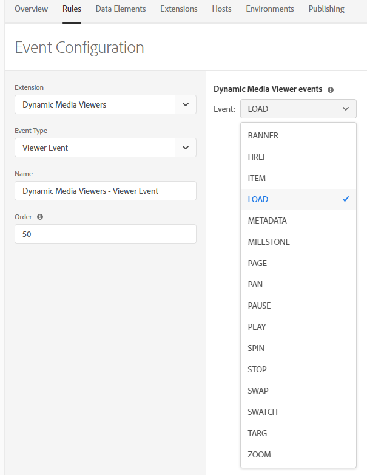
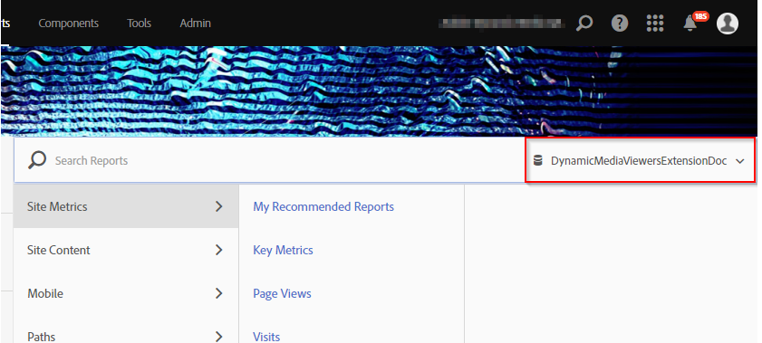

# 整合 Dynamic Media 檢視器以及 Adobe Analytics 和 Adobe Launch {#integrating-dynamic-media-viewers-with-adobe-analytics-and-adobe-launch}

## 什麼是動態媒體檢視器與Adobe Analytics和Adobe Launch的整合？ {#what-is-dynamic-media-viewers-integration-with-adobe-analytics-and-adobe-launch}

Adobe Launch的全新 *Dynamic Media Viewers* 擴充功能，以及最新版的Dynamic Media Viewers 5.13，可讓Dynamic Media、Adobe Analytics和Adobe Launch的客戶在其Adobe Launch設定中使用Dynamic Media Viewers專用的事件和資料。

此整合意味著您可以使用Adobe Analytics追蹤網站上動態媒體檢視器的使用情形。 同時，您也可以將檢視者公開的事件和資料與來自Adobe或第三方的任何其他Launch擴充功能搭配使用。

請參 [閱Experience Platform Launch使用指南中的Adobe Extension](https://docs.adobe.com/content/help/en/launch/using/extensions-ref/overview.html) ，以進一步瞭解擴充功能。

**** 誰應閱讀本檔案：AEM平台的網站管理員、開發人員，以及營運中的人員。

### 整合的限制 {#limitations-of-the-integration}

* Adobe Launch的Dynamic Media檢視器整合無法在AEM作者節點中運作。 在WCM頁面發佈之前，您無法看到任何追蹤。
* 「快顯」操作模式不支援Adobe Launch整合動態媒體檢視器，其中檢視器URL是使用「資產詳細資訊」頁面上的「URL」按鈕取得。
* Adobe Launch整合無法與舊版檢視器Analytics整合（透過參數）同時 `config2=` 使用。
* 視訊追蹤的支援僅限核心播放追蹤，如追蹤概述 [所述](https://docs.adobe.com/content/help/en/media-analytics/using/sdk-implement/track-av-playback/track-core-overview.html)。 尤其是，不支援QoS、廣告、章節／區段或錯誤追蹤。
* 使用動態媒體檢視器擴充功能的資料元素不支援資料元素的 *儲存時長設定* 。 儲存持續時間必須設定為 **[!UICONTROL 無]**。

### 整合的使用案例 {#use-cases-for-the-integration}

與Adobe Launch整合的主要使用案例是同時使用AEM Assets和AEM Sites的客戶。 在這類情況下，您可以在AEM作者節點和Adobe Launch之間設定標準整合，然後將您的Sites例項與Adobe Launch屬性建立關聯。 之後，任何新增至「網站」頁面的Dynamic Media WCM元件都會追蹤檢視器的資料和事件。

請參 [閱關於在AEM Sites中追蹤動態媒體檢視器](https://wiki.corp.adobe.com/display/~oufimtse/Dynamic+Media+Viewers+integration+with+Adobe+Launch#DynamicMediaViewersintegrationwithAdobeLaunch-TrackingDynamicMediaViewersinAEMSites)。

整合支援的次要使用案例是那些僅使用AEM Assets或Dynamic Media Classic的客戶。 在這種情況下，您會取得檢視器的內嵌代碼，並將其新增至網站頁面。 然後，從Adobe Launch取得Adobe Launch程式庫生產URL，並手動將它新增至網頁程式碼。

請參 [閱關於使用內嵌程式碼追蹤動態媒體檢視器](https://wiki.corp.adobe.com/display/~oufimtse/Dynamic+Media+Viewers+integration+with+Adobe+Launch#DynamicMediaViewersintegrationwithAdobeLaunch-TrackingDynamicMediaViewersusingEmbedcode)。

## 資料和事件追蹤在整合中的運作方式 {#how-data-and-event-tracking-works-in-the-integration}

此整合運用兩種獨立且獨立的動態媒體檢視器追蹤類型： *Adobe Analytics* 和 *Adobe Analytics for Audio and Video*。

### 關於使用Adobe Analytics進行追蹤  {#about-tracking-using-adobe-analytics}

Adobe Analytics可讓您追蹤使用者在與網站上的動態媒體檢視器互動時所執行的動作。 Adobe Analytics也可讓您追蹤檢視器特定的資料。 例如，您可以追蹤和記錄檢視載入事件以及資產名稱、發生的任何縮放動作、視訊播放動作等。

在Adobe Launch中，資料元素和 *規則的概念* , *可搭配運作* ，以啟用Adobe Analytics追蹤。

#### 關於Adobe Launch中的資料元素 {#about-data-elements-in-adobe-launch}

Adobe Launch中的「資料元素」是指名稱的屬性，其值會以靜態方式定義，或根據網頁狀態或動態媒體檢視器資料動態計算。

「資料元素」定義的可用選項取決於Adobe Launch屬性中安裝的擴充功能清單。 「核心」擴充功能已預先安裝，在任何組態中都可立即使用。 此「核心」擴充功能可定義來自Cookie、JavaScript程式碼、查詢字串和許多其他來源的資料元素。

若要追蹤Adobe Analytics，需要安裝數個額外的擴充功能，如 [安裝與設定擴充功能中所述](#installing-and-setup-of-extensions)。 動態媒體檢視器擴充功能可新增定義資料元素的功能，其值是動態檢視器事件的引數。 例如，可參考檢視器類型，或載入時檢視器所報告的資產名稱、使用者縮放時所報告的縮放等級等等。

動態媒體檢視器擴充功能會自動更新其資料元素的值。

在您定義資料元素後，您就可以使用「資料元素」選擇器Widget，在Adobe Launch UI的其他位置使用資料元素。 尤其是，為「動態媒體檢視器」追蹤而定義的「資料元素」，將會由規則中Adobe Analytics擴充功能的「設定變數動作」引用（請參閱下文）。

如需詳 [細資訊](https://docs.adobe.com/content/help/zh-Hant/launch/using/reference/manage-resources/data-elements.html) ，請參閱Experience Platform Launch使用指南中的資料元素。

#### 關於Adobe Launch中的規則 {#about-rules-in-adobe-launch}

Adobe Launch中的規則是一種不可知的設定，可定義構成規則的三個區域： *事件*、 *條件*&#x200B;和動 *作*:

* *事件* （如果）會告訴Adobe Launch何時觸發規則。
* *條件* （如果）告知Adobe Launch在觸發規則時允許或禁止哪些其他限制。
* *動作* （接著）會告訴Adobe Launch觸發規則時要執行什麼動作。

「事件」、「條件」和「動作」區段中可用的選項，取決於Adobe Launch屬性中安裝的擴充功能。 Core *擴充功能* 已預先安裝，在任何組態中都可立即使用。 此擴充功能提供數個事件選項，例如基本的瀏覽器層級動作，包括焦點變更、按鍵、表單提交等。 它也包含條件選項，例如Cookie值、瀏覽器類型等。 對於「動作」，只有「自訂代碼」選項可用。

若是Adobe Analytics追蹤，必須安裝數個額外的擴充功能，如安裝 [與設定擴充功能中所述](#installing-and-setup-of-extensions)。 具體而言：

* 動態媒體檢視器擴充功能可將支援的事件清單擴充至特定於動態媒體檢視器的事件，例如檢視器載入、資產交換、放大和視訊播放。
* Adobe Analytics擴充功能以傳送資料至追蹤伺服器所需的兩個動作，擴充支援的動作清單： *設定變數* , *傳送信標*。

若要追蹤動態媒體檢視器，可使用下列任何類型：

* 來自動態媒體檢視器擴充功能、核心擴充功能或任何其他擴充功能的事件。
* 規則定義中的條件。 或者，您可將條件區域保留為空。

在「動作」區段中，您必須執行「設定變 *數」動作* 。 此動作會告訴Adobe Analytics如何以資料填入追蹤變數。 同時，「設定變數 ** 」動作不會傳送任何內容至追蹤伺服器。

「設 *定變數* 」動作後面必須有「傳送 *信標」動作* 。 「傳 *送信標* 」動作會實際傳送資料至分析追蹤伺服器。 這兩個動 *作(設定變數**和傳送信標*)都來自Adobe Analytics擴充功能。

如需 [詳細資訊](https://docs.adobe.com/content/help/zh-Hant/launch/using/reference/manage-resources/rules.html) ，請參閱Experience Platform Launch使用指南中的規則。

#### 配置示例 {#sample-configuration}

Adobe Launch中的下列範例設定示範如何在檢視器載入時追蹤資產名稱。

1. 在「資 **[!UICONTROL 料元素]** 」標籤中，定義資料元素， `AssetName` 該資料元素會參照動 `asset` 態媒體檢視器 `LOAD` 擴充功能中的事件參數。

   

1. 在「規 **[!UICONTROL 則]** 」標籤中，定義 *規則TrackAssetOnLoad*。

   在此規則中，「事 **[!UICONTROL 件]** 」欄位使用動態媒體檢視器擴充功能的 **[!UICONTROL LOAD]** 事件。

   

1. 「動作」設定有兩種來自Adobe Analytics擴充功能的「動作」類型：

   *設定變數*，將您選擇的分析變數對應至「資料元素」 `AssetName` 的值。

   *傳送信標*，即會傳送追蹤資訊至Adobe Analytics。

   

1. 產生的規則設定如下所示：

   

### 關於Adobe Analytics for Audio and Video {#about-adobe-analytics-for-audio-and-video}

當Experience Cloud帳戶訂閱使用Adobe Analytics for Audio and Video時，就足以在動態媒體檢視器擴充功能設定中啟 *用視訊追蹤* 。 視訊量度將可在Adobe Analytics中使用。 視訊追蹤視Adobe Media Analytics for Audio and Video Extension是否存在而定。

請參 [閱安裝和設定擴充功能](#installing-and-setup-of-extensions)。

目前，視訊追蹤的支援僅限於「核心播放」追蹤，如追蹤概述 [所述](https://docs.adobe.com/content/help/en/media-analytics/using/sdk-implement/track-av-playback/track-core-overview.html)。 尤其是，不支援QoS、廣告、章節／區段或錯誤追蹤。

## 使用動態媒體檢視器擴充功能 {#using-the-dynamic-media-viewers-extension}

如整合的 [使用案例中所述](#use-cases-for-the-integration)，您可在AEM Sites中使用新的Adobe Launch整合，以及使用內嵌代碼來追蹤動態媒體檢視器。

### 追蹤AEM Sites中的動態媒體檢視器 {#tracking-dynamic-media-viewers-in-aem-sites}

若要追蹤AEM Sites中的「動態媒體」檢視器，必須執行「設定所 [有整合項目](#configuring-all-the-integration-pieces) 」區段下列出的所有步驟。 具體而言，您必須建立IMS設定和Adobe Launch Cloud設定。

在正確設定後，您使用動態媒體支援的WCM元件新增至「網站」頁面的任何動態媒體檢視器，都會自動追蹤資料至Adobe Analytics、Adobe Analytics for Video，或兩者皆有。

請參 [閱使用Adobe Sites將動態媒體資產新增至頁面](/help/assets/dynamic-media/adding-dynamic-media-assets-to-pages.md)。

### 使用內嵌程式碼追蹤動態媒體檢視器 {#tracking-dynamic-media-viewers-using-embed-code}

未使用AEM Sites或將Dynamic Media檢視器內嵌至AEM Sites以外網頁（或兩者皆未使用）的客戶，仍可使用Adobe Launch整合。

您必須完成「設定Adobe Analytics」和「 [設定Adobe Launch](#configuring-adobe-analytics-for-the-integration)[」區段的設定步驟](#configuring-adobe-launch-for-the-integration) 。不過，不需要AEM相關的設定步驟。

在正確設定後，您可以使用Dynamic Media檢視器將Adobe Launch支援新增至網頁。

請參 [閱新增Launch內嵌代碼](https://docs.adobe.com/content/help/en/launch/using/implement/configure/implement-the-launch-install-code.html) ，以進一步瞭解如何使用Adobe Launch程式庫內嵌代碼。

請參 [閱「將視訊或影像檢視器內嵌在網頁上](/help/assets/dynamic-media/embed-code.md) 」，以進一步瞭解如何使用AEM Dynamic Media的內嵌程式碼功能。

**若要使用內嵌程式碼追蹤動態媒體檢視器**

1. 讓網頁準備好嵌入動態媒體檢視器。
1. 先登入Adobe Launch，以取得Adobe Launch程式庫的內嵌代碼(請參 [閱設定Adobe Launch](#configuring-adobe-launch-for-the-integration))。
1. 按一 **[!UICONTROL 下「屬性]**」，然後按一下「 **[!UICONTROL 環境]** 」標籤。
1. 選擇與網頁環境相關的環境級別。 然後，在「安 **[!UICONTROL 裝]** 」欄中按一下方塊圖示。
1. **[!UICONTROL 在「網頁安裝指示]** 」對話方塊中，複製完整的Adobe Launch程式庫內嵌程式碼以及周圍的 `<script/>` 標籤。

## 動態媒體檢視器擴充功能的參考指南 {#reference-guide-for-the-dynamic-media-viewers-extension}

### 關於動態媒體檢視器設定 {#about-the-dynamic-media-viewers-configuration}

如果下列所有條件都成立，Dynamic Media Viewer擴充功能會自動與Adobe Launch程式庫整合：

* Adobe Launch程式庫全域物 `_satellite`件()出現在頁面上。
* 動態媒體檢視器擴充功能 `_dmviewers_v001()` 已定義於 `_satellite`。

* `config2=` 未指定檢視器參數，這表示檢視器不使用舊版Analytics整合。

此外，還有選項可在檢視器的設定中指定參數，以明確 `launch=0` 停用檢視器中的Adobe Launch整合。 此參數的預設值為 `1`。

### 設定動態媒體檢視器擴充功能 {#configuring-the-dynamic-media-viewers-extension}

「動態媒體檢視器」擴充功能的唯一設定選項是「 **[!UICONTROL 啟用音訊和視訊的Adobe Media Analytics」]**。

當您勾選（啟用或「開啟」）此選項，而且如果已安裝並正確設定Adobe Media Analytics for Audio and Video Extension，視訊播放量度會傳送至Adobe Analytics for Audio and Video解決方案。 停用此選項會關閉視訊追蹤。

請注意，如果您啟用此選 *項* ，而未安裝Adobe Media Analytics for Audio and Video Extension，此選項將無效。

### 關於動態媒體檢視器擴充功能中的資料元素 {#about-data-elements-in-the-dynamic-media-viewers-extension}

「動態媒體檢視器」擴充功能提供的唯一「資料元素」類型是「資 **[!UICONTROL 料元素類型」下拉式清單中的「檢]****** 視器事件」。

選取此選項後，「資料元素」編輯器會轉譯具有兩個欄位的表格：

* **[!UICONTROL DM檢視器事件資料類型]** -一個下拉式清單，可識別動態媒體檢視器擴充功能支援的所有檢視器事件 (具有引數)，加上特殊的 **[!UICONTROL COMMON]** 項目。COMMON **** 項目代表檢視器所傳送之所有類型事件的共同事件參數清單。
* **[!UICONTROL 追蹤參數]** -所選動態媒體檢視器事件的引數。

請參閱動 [態媒體檢視器參考指南](https://docs.adobe.com/content/help/en/dynamic-media-developer-resources/library/viewers-aem-assets-dmc/c-html5-s7-aem-asset-viewers.html) ，以取得各檢視器類型支援的事件清單； 前往特定檢視器區段，然後按一下「支援Adobe Analytics追蹤」子區段。 目前，動態媒體檢視器參考指南不記錄事件引數。

現在，讓我們考慮動態媒體檢視器資料元素的 *生命週期*。 在頁面上發生對應的動態媒體檢視器事件後，會填入此類資料元素的值。 例如，如果「資料元素」指向 **[!UICONTROL LOAD]** 事件及其「asset」引數，則此類「資料元素」的值會在檢視器第一次執行LOAD事件後接收有效資料。 如果資料元素指向 **[!UICONTROL ZOOM]** 事件及其「縮放」引數，此類資料元素的值將維持空白，直到檢視器第一次傳送 **[!UICONTROL ZOOM]** 事件為止。

同樣地，當檢視器在頁面上傳送對應事件時，資料元素的值也會自動更新。即使未在規則設定中指定特定事件，也會進行值更新。例如，如果為ZOOM事件的「縮放」參數定義了「資料元素 **[!UICONTROL ZoomScale]** 」，但「規則」設定中唯一存在的規則是由 **[!UICONTROL LOAD]** 事件觸發，則每當使用者在檢視器內執行縮放時， **** ZoomScale的值仍會更新。

任何動態媒體檢視器在網頁上都有唯一識別碼。「資料元素」會追蹤值本身，以及填入值的檢視器。這表示，如果同一頁面上有數個檢視器，且有 **[!UICONTROL AssetName]** Data Element指向 **[!UICONTROL LOAD事件及其「asset」引數，]** AssetName **** Data Element會維護與頁面上載入的每個檢視器相關聯的資產名稱集合。

「資料元素」傳回的確切值取決於上下文。 如果「規則」中要求「資料元素」，而「規則」是由動態媒體檢視器事件觸發，則會傳回啟動「規則」的檢視器的「資料元素」值。 此外，如果「資料元素」是在某個規則中請求，而該規則是由某個事件從某個其他Adobe Launch擴充功能觸發，則「資料元素」的值是檢視器中最後一個用來更新此「資料元素」的值。

**請考慮下列範例設定**:

* 網頁包含兩個動態媒體縮放檢視器； 我們會將它們稱為 *viewer1* 和 *viewer2*。

* **[!UICONTROL ZoomScale]** Data Element指向 **[!UICONTROL ZOOM]** 事件及其「scale」引數。
* **[!UICONTROL TrackPan規則]** ，包含下列項目：

   * 使用Dynamic Media Viewer **[!UICONTROL PAN]** 事件做為觸發器。
   * 傳送 **[!UICONTROL ZoomScale]** Data Element的值至Adobe Analytics。

* 
   * **[!UICONTROL TrackKey規則]** ，包含下列項目：

   * 使用核心Adobe Launch擴充功能的按鍵事件做為觸發器。
   * 傳送 **[!UICONTROL ZoomScale]** Data Element的值至Adobe Analytics。

現在，假設使用者載入含有兩個檢視器的網頁。 在 *viewer1*，它們放大至50%的比例； 然後，在 *viewer2中*，它們會放大至25%的比例。 在 *viewer1中*，他們可以四處平移影像，最後按下鍵盤上的鍵。

使用者的活動會導致對Adobe Analytics進行下列兩個追蹤呼叫：

* 第一個呼叫發生是因為 **[!UICONTROL 當使用者在Viewer1中捲動時，會觸發]** TrackPan規則 **。 此呼叫會傳送50%作為 **[!UICONTROL ZoomScale]** Data Element的值，因為資料元素會知道規則是由 ** viewer1觸發，並擷取對應的比例值；
* 第二次呼叫是因為當使 **[!UICONTROL 用者按下鍵盤上的鍵時，會觸發TrackKey]** Rule。 該呼叫會以 **[!UICONTROL ZoomScale]** Data Element的值傳送25%，因為「規則」並非由檢視器觸發。 因此，「資料元素」會傳回最新的值。

上述設定的範例也會影響「資料元素」值的壽命。 即使檢視器本身已置於網頁上，動態媒體檢視器所管理的資料元素值仍會儲存在Adobe Launch程式庫程式碼中。 這表示如果規則是由非動態媒體檢視器擴充功能所觸發並參考資料元素，資料元素會傳回最後一個已知值，即使檢視器不再存在於網頁上亦然。

無論如何，動態媒體檢視器所驅動之資料元素的值不會儲存在本機儲存或伺服器上； 而是僅保留在用戶端的Adobe Launch程式庫中。 當網頁重新載入時，此類「資料元素」的值會消失。

通常，「資料元素」編輯器支援 [儲存時間選擇](https://docs.adobe.com/content/help/zh-Hant/launch/using/reference/manage-resources/data-elements.html#create-a-data-element)。 不過，使用動態媒體檢視器擴充功能的資料元素僅支援「無」的儲存持續 **[!UICONTROL 時間選項]**。 在使用者介面中可以設定任何其他值，但「資料元素」行為在此例中並未定義。 擴充功能可自行管理資料元素的值： 在整個檢視器生命週期中維護檢視器事件引數值的資料元素。

### 關於動態媒體檢視器擴充功能中的規則 {#about-rules-in-the-dynamic-media-viewers-extension}

在規則編輯器中，擴充功能會新增事件編輯器的設定選項。 另外，還提供一個選項，可以在「動作」編輯器中以手動方式引用事件參數，作為簡短選項，而不是使用預配置的「資料元素」。

#### 關於事件編輯器 {#about-the-events-editor}

在「事件」編輯器中，「動態媒體檢視器」擴充功能會新增一 **[!UICONTROL 個稱為]** 「檢 **[!UICONTROL 視器事件」的事件類型]**。

選取後，事件編輯器會轉譯下拉式 **[!UICONTROL Dynamic Media Viewer事件]**，列出動態媒體檢視器支援的所有可用事件。

#### 關於動作編輯器 {#about-the-actions-editor}

「動態媒體檢視器」擴充功能可讓您使用動態媒體檢視器的事件參數，在Adobe Analytics擴充功能的「設定變數」編輯器中對應至分析變數。

最簡單的方法就是完成下列兩個步驟的程式：

* 首先，定義一或多個資料元素，其中每個資料元素代表動態媒體檢視器事件的參數。
* 最後，在Adobe Analytics擴充功能的「設定變數」編輯器中，按一下「資料元素」選取器圖示（三個堆疊磁碟）以開啟「選取資料元素」對話方塊，然後從中選取「資料元素」。

不過，您也可以使用替代方法並略過「資料元素」的建立。您可以在Analytics變數指派的值輸入欄位中輸入事件引數的完全限定名稱，並以百分比(%)符號包圍，直接參照動態媒體檢視器事件的引數。****&#x200B;例如，

`%event.detail.dm.LOAD.asset%`

請注意，使用資料元素和直接事件引數參考之間有重要差異。 對於資料元素，觸發「設定變數」動作的事件與事件無關，觸發規則的事件可能與動態檢視器無關（例如核心擴充功能網頁上的滑鼠點按）。 但是，在使用直接引數參考時，請務必確保觸發規則的事件與其引用的事件參數相對應。

例如，如果 `%event.detail.dm.LOAD.asset%` 規則是由動態媒體檢視器擴充功能的 **[!UICONTROL LOAD]** 事件觸發，則參照會傳回正確的資產名稱。但是，它會傳回任何其他事件的空白值。

下表列出動態媒體檢視器事件及其支援的引數：

<table>
 <tbody>
  <tr>
   <td>檢視器事件名稱</td>
   <td>引數參考</td>
  </tr>
  <tr>
   <td><code>COMMON</code></td>
   <td><code>%event.detail.dm.objID%</code></td>
  </tr>
  <tr>
   <td> </td>
   <td><code>%event.detail.dm.compClass%</code></td>
  </tr>
  <tr>
   <td> </td>
   <td><code>%event.detail.dm.instName%</code></td>
  </tr>
  <tr>
   <td> </td>
   <td><code>%event.detail.dm.timeStamp%</code></td>
  </tr>
  <tr>
   <td><code>BANNER</code> </td>
   <td><code>%event.detail.dm.BANNER.asset%</code></td>
  </tr>
  <tr>
   <td> </td>
   <td><code>%event.detail.dm.BANNER.frame%</code></td>
  </tr>
  <tr>
   <td> </td>
   <td><code>%event.detail.dm.BANNER.label%</code></td>
  </tr>
  <tr>
   <td><code>HREF</code></td>
   <td><code>%event.detail.dm.HREF.rollover%</code></td>
  </tr>
  <tr>
   <td><code>ITEM</code></td>
   <td><code>%event.detail.dm.ITEM.rollover%</code></td>
  </tr>
  <tr>
   <td><code>LOAD</code></td>
   <td><code>%event.detail.dm.LOAD.applicationname%</code></td>
  </tr>
  <tr>
   <td><strong> </strong></td>
   <td><code>%event.detail.dm.LOAD.asset%</code></td>
  </tr>
  <tr>
   <td><strong> </strong></td>
   <td><code>%event.detail.dm.LOAD.company%</code></td>
  </tr>
  <tr>
   <td><strong> </strong></td>
   <td><code>%event.detail.dm.LOAD.sdkversion%</code></td>
  </tr>
  <tr>
   <td><strong> </strong></td>
   <td><code>%event.detail.dm.LOAD.viewertype%</code></td>
  </tr>
  <tr>
   <td><strong> </strong></td>
   <td><code>%event.detail.dm.LOAD.viewerversion%</code></td>
  </tr>
  <tr>
   <td><code>METADATA</code></td>
   <td><code>%event.detail.dm.METADATA.length%</code></td>
  </tr>
  <tr>
   <td> </td>
   <td><code>%event.detail.dm.METADATA.type%</code></td>
  </tr>
  <tr>
   <td><code>MILESTONE</code></td>
   <td><code>%event.detail.dm.MILESTONE.milestone%</code></td>
  </tr>
  <tr>
   <td><code>PAGE</code></td>
   <td><code>%event.detail.dm.PAGE.frame%</code></td>
  </tr>
  <tr>
   <td> </td>
   <td><code>%event.detail.dm.PAGE.label%</code></td>
  </tr>
  <tr>
   <td><code>PAUSE</code></td>
   <td><code>%event.detail.dm.PAUSE.timestamp%</code></td>
  </tr>
  <tr>
   <td><code>PLAY</code></td>
   <td><code>%event.detail.dm.PLAY.timestamp%</code></td>
  </tr>
  <tr>
   <td><code>SPIN</code></td>
   <td><code>%event.detail.dm.SPIN.framenumber%</code></td>
  </tr>
  <tr>
   <td><code>STOP</code></td>
   <td><code>%event.detail.dm.STOP.timestamp%</code></td>
  </tr>
  <tr>
   <td><code>SWAP</code></td>
   <td><code>%event.detail.dm.SWAP.asset%</code></td>
  </tr>
  <tr>
   <td><code>SWATCH</code></td>
   <td><code>%event.detail.dm.SWATCH.frame%</code></td>
  </tr>
  <tr>
   <td> </td>
   <td><code>%event.detail.dm.SWATCH.label%</code></td>
  </tr>
  <tr>
   <td><code>TARG</code></td>
   <td><code>%event.detail.dm.TARG.frame%</code></td>
  </tr>
  <tr>
   <td> </td>
   <td><code>%event.detail.dm.TARG.label%</code></td>
  </tr>
  <tr>
   <td><code>ZOOM</code></td>
   <td><code>%event.detail.dm.ZOOM.scale%</code></td>
  </tr>
 </tbody>
</table>

## 設定所有整合項目 {#configuring-all-the-integration-pieces}

**開始之前**

如果您尚未完成此作業，Adobe建議您在本節之前仔細檢視所有檔案，以瞭解完整整合。

本節說明整合動態媒體檢視器與Adobe Analytics和Adobe Analytics for Audio and Video的必要設定步驟。 雖然Adobe Launch可能會將動態媒體檢視器擴充功能用於其他用途，但本檔案未涵蓋此類案例。

您將在下列Adobe產品中設定整合：

* Adobe Analytics —— 您將設定追蹤變數和報表。
* Adobe Launch —— 您將定義屬性、一或多個規則以及一或多個資料元素，以啟用檢視器追蹤。

此外，如果此整合解決方案與AEM Sites搭配使用，也需要進行下列設定：

* Adobe I/O Console —— 已針對Adobe Launch建立整合。
* AEM作者節點- IMS設定和Adobe Launch雲端設定。

在設定中，請確定您有權存取已啟用Adobe Analytics和Adobe Launch的Adobe Experience Cloud公司。

## 設定Adobe Analytics以進行整合 {#configuring-adobe-analytics-for-the-integration}

在您設定Adobe Analytics後，將會針對整合設定下列項目：

* 報表套裝已就位且已選取。
* Analytics變數可用來接收追蹤資料。
* 報表可用於檢視Adobe Analytics內部收集的資料。

另請參閱 [Analytics實施指南](https://docs.adobe.com/content/help/en/analytics/implementation/home.html)。

**若要設定Adobe Analytics進行整合**:

1. 首先，從Experience Cloud首頁存取Adobe [Analytics](https://exc-home.experiencecloud.adobe.com/exc-home/home.html#/)。 在功能表列上，按一下頁面右上角的「解決方案」圖示（3×3個點表格），然後按一下「分 **[!UICONTROL 析」]**。

   

   您現在將選取報表套裝。

### 選取報表套裝 {#selecting-a-report-suite}

1. 在Adobe Analytics頁面的右上角，「搜尋報表」欄位的右側，從下拉式清單中選取正確的報表套裝。****&#x200B;如果有多個報表套裝可供使用，而您不確定要使用哪個報表套裝，請連絡您的Adobe Analytics管理員，以協助您選取要使用哪個報表套裝。

   在下圖中，使用者建立了名為 ** DynamicMediaViewersExtensionDoc的報表套裝，並從下拉式清單中選取它。 報表套裝名稱僅供圖示之用； 您最終選擇的報表套裝名稱會有所不同。

   如果沒有可用的報表套裝，您或您的Adobe Analytics管理員必須先建立報表套裝，您才能繼續進一步進行設定。

   請參 [閱報表和報表套裝](https://docs.adobe.com/content/help/en/analytics/implementation/analytics-basics/ref-reports-report-suites.html) , [以及建立報表套裝](https://docs.adobe.com/content/help/en/analytics/admin/admin-console/create-report-suite.html)。

   在Adobe Analytics中，報表套裝是在「管理>報 **[!UICONTROL 表套裝」下管理]**。

   

   您現在將設定Adobe Analytics變數。

### 設定Adobe Analytics變數 {#setting-up-adobe-analytics-variables}

1. 您現在將指定一或多個Adobe Analytics變數，以用來追蹤網頁上的動態媒體檢視器行為。

   您可以使用Adobe Analytics支援的任何類型的變數。 變數類型(例如自訂流量 [prop]、轉換 [eVar])的決定應由您Analytics實作的特定需求所決定。

   請參 [閱Prop和eVar概觀](https://docs.adobe.com/content/help/en/analytics/implementation/analytics-basics/traffic-props-evars/props-evars.html)。

   就本檔案而言，只有自訂流量(prop)變數會被使用，因為這些變數會在網頁上發生動作後幾分鐘內提供至Analytics報表。

   若要啟用新的自訂流量變數，請在Adobe Analytics的工具列上，按一下「管理>報 **[!UICONTROL 表套裝」]**。

1. 在「報 **[!UICONTROL 表套裝管理器]** 」頁面上，選取正確的報表，然後在工具列上按一下「編輯 **[!UICONTROL 設定>流量>流量變數」]**。
1. 在此處，挑選未使用的變數，為其指定描述性名稱(檢視器資產( **[!UICONTROL prop 30)]**)，並將「啟用」欄中的組合方塊變更為「啟用」。

   以下螢幕擷取是自訂流量變數( **[!UICONTROL prop30]**)的範例，用於追蹤檢視器使用的資產名稱：

   

1. 在變數清單底部，按一下「儲 **[!UICONTROL 存」]**。

### 設定報表 {#setting-up-a-report}

1. 通常，在Adobe Analytics中設定報表是由特定專案需求所驅動。 因此，詳細的報表設定超出此整合的範圍。

   不過，在設定Adobe Analytics變數中設定自訂流量變數後，您就足以知道自訂流量報表 **[會自動在Adobe Analytics中使用](#setting-up-adobe-analytics-variables)**。

   例如，檢視器資產( **[!UICONTROL prop 30)變數的報表可從「自訂流量>自訂流量21-30 >檢視器資產(prop 30)」下的「報表」功能表使用]******。

   在檢視器資產(prop 30)建 **[!UICONTROL 立後立即造訪此報表]** ，不會顯示任何資料；在這個整合階段，就是預期的。

   

## 設定Adobe Launch以進行整合 {#configuring-adobe-launch-for-the-integration}

在您設定Adobe Launch後，將會針對整合設定下列項目：

* 建立新屬性，讓您的所有組態保持一致。
* 擴充功能的安裝與設定。 屬性中安裝的所有擴充功能的用戶端程式碼會一起編譯為程式庫。 此程式庫稍後會由網頁使用。
* 設定資料元素和規則。 此設定定義要從動態媒體檢視器擷取哪些資料、何時觸發追蹤邏輯，以及在Adobe Analytics中傳送檢視器資料的位置。
* 發佈資料庫。

**若要設定整合的Adobe Launch**:

1. 首先，從Experience Cloud首頁存取Adobe [Launch](https://exc-home.experiencecloud.adobe.com/exc-home/home.html#/)。 在功能表列上，按一下頁面右上角的「解決方案」圖示（三個點乘以三個點表），然後按一下「啟 **[!UICONTROL 動」]**。

   您也可以直 [接開啟Adobe Launch](https://launch.adobe.com/)。

   

### 在Adobe Launch中建立屬性 {#creating-a-property-in-adobe-launch}

Adobe Launch中的屬性是指名的設定，可讓所有設定保持一致。 會產生組態設定的程式庫，並發佈至不同的環境層級（開發、接移和生產）。

另請參閱 [建立屬性](https://docs.adobe.com/content/help/en/launch/using/implement/configure/create-a-property.html)。

1. 在Adobe Launch中，按一下「 **[!UICONTROL 新屬性」]**。
1. 在「建 **[!UICONTROL 立屬性]** 」對話方塊的「名稱 **** 」欄位中，輸入描述性名稱，例如網站的標題。例如， `DynamicMediaViewersProp.`
1. 在「網 **[!UICONTROL 域]** 」欄位中，輸入您網站的網域。
1. 在「進 **[!UICONTROL 階選項]** 」下拉式清單中，啟用「設定擴充功能」開發 (以後無法修改) ******，以備您要使用的擴充功能 (在本例中為「動態媒體檢視器」) 尚未發行時使用。

   

1. 按一下&#x200B;**[!UICONTROL 「儲存」]**。

   按一下新建立的屬性，然後繼續至「安 *裝與設定擴充功能」*。

### 安裝和設定擴展 {#installing-and-setup-of-extensions}

Adobe Launch中所有可用的擴充功能都列在「擴充功能> **[!UICONTROL 目錄」下]**。

若要安裝擴充功能，請按一下「 **[!UICONTROL 安裝]**」。 如有需要，請執行一次性擴充設定，然後按一下「 **[!UICONTROL 儲存]**」。

在需要時，必須安裝並設定下列擴充功能：

* （必要） *Experience Cloud ID服務擴充*

不需要額外的設定，只要接受任何建議的值即可。 完成後，請確定按一下「保 **[!UICONTROL 存」]**。

請參 [閱Experience Cloud ID服務擴充功能](https://docs.adobe.com/content/help/en/launch/using/extensions-ref/adobe-extension/id-service-extension/overview.html)。

* （必要） *Adobe Analytics擴充功能*

若要設定此擴充功能，您首先需要Adobe Analytics中「管理>報表套裝」下方的「報表套裝ID」( **[!UICONTROL Admin > Report Suite]**)，位於「 **[!UICONTROL 報表套裝ID]** 」欄標題下。

(僅供展示之用， **[!UICONTROL DynamicMediaViewersExtensionDoc]** Report Suite的報表套裝ID將用於下列螢幕擷取畫面。此ID已建立並用於 [選取報表套裝](#selecting-a-report-suite) 。)

在「安裝擴充功能」頁面的「開發報表套裝」欄位中，輸入「報表套裝ID」。此欄位包括「 **[!UICONTROL 測試報表套裝」欄位和「]** 生產報表套裝 ******** 」欄位。

*只有在您打算使用視訊追蹤時，才設定下列項目：*

在「安 **[!UICONTROL 裝擴充功能]** 」頁面上，展 **[!UICONTROL 開「一般]**」，然後指定追蹤伺服器。 追蹤伺服器會遵循範本 `<trackingNamespace>.sc.omtrdc.net`，其中 `<trackingNamespace>` 是布建電子郵件中取得的資訊。

按一下&#x200B;**[!UICONTROL 「儲存」]**。

請參 [閱Adobe Analytics Extension](https://docs.adobe.com/content/help/en/launch/using/extensions-ref/adobe-extension/analytics-extension/overview.html)。

* (可選. 只有在需要視訊追蹤時才需要) *Adobe Media Analytics for Audio and Video* Extension

填寫追蹤伺服器欄位。 Adobe Media Analytics for Audio and Video ** extension的追蹤伺服器與Adobe Analytics所用的追蹤伺服器不同。 它遵循範本 `<trackingNamespace>.hb.omtrdc.net`，其中 `<trackingNamespace>` 是來自布建電子郵件的資訊。

所有其他欄位皆為選用。

請參 [閱Adobe Media Analytics for Audio and Video Extension](https://docs.adobe.com/content/help/en/launch/using/extensions-ref/adobe-extension/media-analytics-extension/overview.html)。

* （必要）動 *態媒體檢視器擴充*

選取 **[!UICONTROL 啟用Adobe Analytics for Video]** ，以啟用 (開啟) 視訊心率追蹤。

請注意，在編寫本文時，只有在建立Adobe Launch屬性以進行開發時，才能使用 *Dynamic Media Viewers* extension。

請參 [閱在Adobe Launch中建立屬性](#creating-a-property-in-adobe-launch)。

安裝和安裝擴充功能後，至少會在「擴充功能>安裝」區域列出下列五個擴充功能（若您未追蹤視訊，則會列出四個擴充功能）。

### 設定資料元素和規則 {#setting-up-data-elements-and-rules}

在Adobe Launch中，建立追蹤動態媒體檢視器所需的資料元素和規則。

如需 [使用Adobe Launch進行追蹤的概觀](#how-data-and-event-tracking-works-in-the-integration) ，請參閱資料和事件追蹤在整合中的運作方式。

請參 [閱Adobe Launch中](#sample-configuration) ，示範如何在檢視器載入時追蹤資產名稱的範例設定。

如需 [擴充功能的詳細資訊](#configuring-the-dynamic-media-viewers-extension) ，請參閱設定動態媒體檢視器擴充功能。

### 發佈資料庫 {#publishing-a-library}

若要在Adobe Launch設定中進行變更（包括屬性、擴充功能、規則和資料元素設定），您必須發 *布* 此類變更。 在Adobe Launch中進行發佈是從「屬性」設定下的「發佈」標籤執行。

Adobe Launch可能有多個開發環境、一個測試環境和一個生產環境。 依預設，AEM中的Adobe Launch Cloud設定會將AEM作者節點指向Adobe Launch的「舞台」環境，並將AEM發佈節點指向Adobe Launch的「生產」環境。 這種安排表示，有了預設的AEM設定，就必須將Adobe Launch程式庫發佈至「測試」環境，以便在AEM作者中使用它，然後將它發佈至「生產」環境，以便用於AEM發佈。

如需 [Adobe Launch環境的詳細資訊](https://docs.adobe.com/content/help/en/launch/using/reference/publish/environments.html) ，請參閱「環境」。

發佈程式庫包含下列兩個步驟：

* 將所有必要的變更（新變更和更新）加入程式庫，以新增和建立新程式庫。
* 在不同的環境級別（從開發到測試和生產）中向上移動庫

#### 新增和建立新的資料庫 {#adding-and-building-a-new-library}

1. 第一次在Adobe Launch中開啟「發佈」標籤時，程式庫清單是空的。

   在左欄中，按一下「新 **[!UICONTROL 增程式庫」]**。

   

1. 在「建立新庫」頁的「名稱 **[!UICONTROL 」欄位]** ，為新庫輸入描述性名稱。 例如，

   *DynamicMediaViewersLib*

   從「環境」下拉清單中，選擇「環境」級別。 一開始，只有「開發」層級可供選取。 在頁面左下側附近，按一下「新增所有變 **[!UICONTROL 更的資源」]**。

   

1. Near the upper-right corner of the page, click **[!UICONTROL Save &amp; Build for Development]**.

   幾分鐘內，程式庫就會建立並準備使用。

   

   >[!NOTE]
   >
   >下次您變更Adobe Launch設定時，請前往「屬性設定」下的「 **[!UICONTROL Publishing]****** 」標籤，然後按一下先前建立的程式庫。
   >
   >
   >在程式庫發佈畫面中，按一下「新 **[!UICONTROL 增所有變更的資源」]**，然後按 **[!UICONTROL 一下「儲存並建立供開發使用」]**。

#### 在環境級別上移動庫 {#moving-a-library-up-through-environment-levels}

1. 新增程式庫後，它最初會位於「開發」環境中。 若要將它移至「測試環境」層級（與「已提交」欄相對應），請從程式庫的下拉式功能表，按一下「 **[!UICONTROL 送出以供核准」]**。

   

1. 在確認對話方塊中，按一下「 **[!UICONTROL 提交]**」。

   在程式庫移至「已提交」欄後，從程式庫的下拉式功能表，按一下「建立 **[!UICONTROL 預備」]**。

   

1. 依照類似程式，將程式庫從測試環境移至生產環境（即「已發佈」欄）。

   首先，從下拉式選單中，按一下「核 **[!UICONTROL 準發佈」]**。

   

1. 從下拉式選單中，按一下「 **[!UICONTROL 建立並發佈至生產」]**。

   

   如需 [Adobe Launch中](https://docs.adobe.com/content/help/en/launch/using/reference/publish/overview.html) ，有關發佈程式的詳細資訊，請參閱發佈。

## 設定Adobe Experience Manager以進行整合 {#configuring-adobe-experience-manager-for-the-integration}

<!-- Prerequisites lost below should be verified by Sasha -->

必備條件:

* AEM會同時執行「作者」和「發佈」例項。
* AEM作者節點已在Dynamic Media中設定。 <!-- Scene7 run mode (dynamicmedia_s7) -->
* 動態媒體WCM元件已在AEM Sites中啟用。

AEM設定包含下列兩個主要步驟：

* AEM IMS的設定
* Adobe Launch Cloud的設定。

### 設定AEM IMS {#configuring-aem-ims}

1. 在AEM作者中，按一下「工具」圖示（槌子），然後按一下「 **[!UICONTROL 安全性> Adobe IMS設定」]**。

   

1. 在Adobe IMC配置頁面左上角附近，按一下創 **[!UICONTROL 建]**。
1. 在「 **[!UICONTROL Adobe IMS技術帳戶設定]** 」頁面的「 **[!UICONTROL Cloud Solution]** 」下拉式清單中，按一下「 **[!UICONTROL Adobe Launch]**」。
1. 啟用 **[!UICONTROL 建立新憑證]**，然後在文字欄位中，為憑證輸入任何有意義的值。 例如， *AdobeLaunchIMSCert*。 按一下&#x200B;**[!UICONTROL 建立憑證]**。

   將顯示以下資訊消息：

   *若要擷取有效的存取 Token，必須將新憑證的公開金鑰新增至 Adobe I/O 上的技術帳戶!*.

   按一下 **[!UICONTROL 確定]** ，關閉「資訊」(Info)對話框。

   

1. 按一 **[!UICONTROL 下「下載公開金鑰]** 」，將公開金鑰檔案(`*.crt`)下載至您的本機系統。

   >[!NOTE]
   >
   >此時，請 ***開啟*****[!UICONTROL Adobe IMS技術帳戶設定頁面]** ;不 ***要關閉頁面*** ，也不 ***要按「下一步*** 」。您稍後將在步驟中返回此頁面。

   

1. 在新的瀏覽器標籤中，導覽至 [Adobe I/O Console](https://console.adobe.io/integrations)。

1. 從 **[!UICONTROL Adobe I/O Console整合頁面]** （靠近右上角），按一下新 **[!UICONTROL 增整合]**。
1. 在「建 **[!UICONTROL 立新整合]** 」對話方塊中，確定已選取「 **[!UICONTROL 存取API]** 」選項按鈕，然後按一下「繼 **[!UICONTROL 續]**」。

   

1. 在第二個「 **[!UICONTROL 建立新整合]** 」頁面上，啟用 (開啟) **** Experience Platform Launch API選項按鈕。在頁面的右下角，按一下「繼 **[!UICONTROL 續]**」。

   

1. 在第三個「 **[!UICONTROL 建立新整合]** 」頁面上，執行下列動作：

   * 在「名 **[!UICONTROL 稱]** 」欄位中輸入描述性名稱。 例如， *DynamicMediaViewersIO*。

   * 在「說 **[!UICONTROL 明]** 」欄位中，輸入整合的說明。

   * 在「公 **[!UICONTROL 開金鑰憑證]** 」區域中，上傳您先前在這些步驟中下載的公開金鑰檔案(`*.crt`)。

   * Under the **[!UICONTROL Select a role for Experience Platform Launch API]** heading, select **[!UICONTROL Admin]**.

   * 在「為 **[!UICONTROL Experience Platform Launch API選取一或多個產品設定檔」標題下]** ，選取名為 **[!UICONTROL Launch - &lt;your_company_name>的產品設定檔]**。
   

1. Click **[!UICONTROL Create integration]**.
1. 在「已建 **[!UICONTROL 立的整合]** 」頁面上，按一 **[!UICONTROL 下「繼續」以整合詳細資訊]**。

   

1. 此時會顯示「整合詳細資料」頁面，類似下列：

   >[!NOTE]
   >
   >***請離開此「整合詳細資訊」頁面***。您只需片刻，就能從「概述」( **[!UICONTROL Overview]** )和「 **[!UICONTROL JWT]** 」(JWT)頁籤中獲得各種資訊。

   
   _整合詳細資訊頁面_

1. 返回您先前 **[!UICONTROL 未開啟的「Adobe IMS技術帳戶設定]** 」頁面。在頁面的右上角，按一下「下一 **[!UICONTROL 步]** 」以開啟「 **** Adobe IMS Technical Account Configuration **[!UICONTROL 」視窗中的「Account]** 」 (帳戶) 頁面。

   (如果您先前意外關閉頁面，請返回AEM作者，然後按一下「工 **[!UICONTROL 具>安全性> Adobe IMS設定」]**。按一下&#x200B;**[!UICONTROL 建立]**。在「雲 **[!UICONTROL 端解決方案]** 」下拉式清單中，選 **[!UICONTROL 取Adobe Launch]**。在「證 **[!UICONTROL 書]** 」下拉式清單中，選取先前建立之憑證的名稱。

   
   _Adobe IMS技術帳戶設定——認證頁面_

1. 「帳 **[!UICONTROL 戶]** 」頁面有5個欄位，需要您使用上一步驟「整合詳細資訊」頁面的資訊來填寫。

   
   _Adobe IMS技術帳戶設定——帳戶頁面_

1. 在「帳 **[!UICONTROL 戶]** 」頁面上，填寫下列欄位：

   * **[!UICONTROL 標題]** -輸入描述性帳戶標題。
   * **[!UICONTROL 授權伺服器]** -返回您先前開啟的「整合詳細資訊」頁面。 按一下「 **[!UICONTROL JWT]** 」頁籤。 複製伺服器名稱（不含路徑），如下所強調。
   
（範例伺服器名稱僅供圖例之用）****`https://ims-na1.adobelogin.com/`

   返回「帳 **[!UICONTROL 戶]** 」頁面，然後將名稱貼到相應欄位。例如， `https://ims-na1.adobelogin.com/`（範例伺服器名稱僅供圖例之用）](assets/2019-07-25_15-01-53.png)   

1. _整合詳細資訊頁- JWT頁籤_]**************

   **[!UICONTROL API金鑰]** -返回「整合詳細資訊」頁面。按一 **[!UICONTROL 下「概述]** 」標籤，然後按一下「 **[!UICONTROL API金鑰 (用戶端ID) 」欄位右側的]** 「復 **[!UICONTROL 制」]**。

   返回「帳 **[!UICONTROL 戶]** 」頁面，然後將金鑰貼入個別欄位。](assets/2019-07-25_14-35-333.png)   

1. _整合詳細資訊頁面_]******************

   **[!UICONTROL 用戶端密碼]**-返回「整合詳細資訊」頁面。在「概述」 **[!UICONTROL 標籤中]** ，按一下「 **[!UICONTROL 擷取用戶端密碼」]**。在「用戶端密碼」欄位的 **[!UICONTROL 右側]** ，按一下「 **[!UICONTROL 複製」]**。

1. 返回「帳 **[!UICONTROL 戶]** 」頁面，然後將金鑰貼入個別欄位。****

   **[!UICONTROL Payload]** - Return to the Integration details page. 從「 **[!UICONTROL JWT]** 」標籤的「JWT裝載」欄位中，複製整個JSON物件程式碼。

   返回「帳 **[!UICONTROL 戶]** 」頁面，然後將程式碼貼至個別欄位。](assets/2019-07-25_21-59-12.png)   

   _整合詳細資訊頁- JWT頁籤_

   

1. ]******

   Near the upper-right corner of the **[!UICONTROL Account]** page, click **[!UICONTROL Create]**.

   在設定AEM IMS後，您現在會在「 **[!UICONTROL Adobe IMS設定」下列出新的IMSAccount]**。](assets/image2019-7-15_14-17-54.png)

## 

1. 設定Adobe Launch Cloud以進行整合 {#configuring-adobe-launch-cloud-for-the-integration}]**

   在AEM作者中，在左上角附近按一下「工具」圖示（槌子），然後按一下「 **[!UICONTROL Cloud Services > Adobe Launch Configurations」]**。](assets/2019-07-26_12-10-38.png)

1. ]**

   在「 **[!UICONTROL Adobe Launch Configurations]** 」頁面的左側面板中，選取您要套用Adobe Launch Configuration的AEM網站。

   僅供圖例之用， **[!UICONTROL We.Retail]** Site會在下方的螢幕擷取中選取。](assets/2019-07-26_12-20-06.png)

1. ]**
1. 在頁面左上角附近，按一下「建 **[!UICONTROL 立」]**。****

   * 在「建 **[!UICONTROL 立]** Adobe啟動設定」視窗的「一般資訊」頁面 (1/3頁) **** 上，填寫下列欄位：

   * **[!UICONTROL 標題]** -輸入描述性配置標題。 For example, `We.Retail Launch cloud configuration`.](#configuring-aem-ims)

   * **[!UICONTROL 關聯的Adobe IMS設定]** -選取您先前在設定AEM IMS中建 [立的IMS設定](#configuring-aem-ims)。]**

   * **[!UICONTROL 公司]** -從「公 **[!UICONTROL 司]** 」下拉式清單中，選取您的Experience Cloud公司。 清單會自動填入。
   **[!UICONTROL 屬性]** -從「屬性」下拉式清單中，選取您先前建立的Adobe Launch屬性。 清單會自動填入。

   完成所有欄位後，您的「一 **[!UICONTROL 般資訊]** 」頁面看起來會類似下列：](assets/image2019-7-15_14-34-23.png)

1. ]**
1. 在左上角附近，按一下「下 **[!UICONTROL 一步]**」。****

   在「建 **[!UICONTROL 立]** Adobe啟動設定」視窗的「預備」頁面 (2/3頁) **** 上，填入下列欄位：

   在「程 **[!UICONTROL 式庫URI]** 」欄位中，檢查Adobe Launch程式庫的測試版本位置。AEM會自動填入此欄位。

   >[!NOTE]僅供圖例之用，此步驟將使用部署至Adobe CDN的Adobe Launch程式庫。
   >
   >[!NOTE]
   >
   >
   >檢查以確定自動填入的庫URI（統一資源標識符）未格式錯誤。 如有必要，請修正它，使URI代表通訊協定相對URI。 就是從雙正斜線開始。`//assets.adobetm.com/launch-xxxx`

   For example: `//assets.adobetm.com/launch-xxxx`.]****************

   您的 **[!UICONTROL 測試頁]** ，看起來應類似下列。請注意，未 **[!UICONTROL 設定「]** Archive and **[!UICONTROL Load Library Assorly]** (存檔 ***和載入庫非同步*** )」選項：](assets/image2019-7-15_15-21-8.png)

1. ]**
1. 在右上角附近，按一下「下 **[!UICONTROL 一步]**」。********
1. 在「建 **[!UICONTROL 立]** Adobe Launch Configuration **[!UICONTROL 」視窗的「生產」頁面 (3/3頁) 上，視需要修正自動填入的生產URI，就像在上一個「測試」頁面上所做的]****** 一樣。

   在右上角附近，按一下「建 **[!UICONTROL 立」]**。

1. 您的新Adobe Launch Cloud設定現在已建立並列在您的網站旁。****

   選取您的新Adobe Launch Cloud設定（選取時，設定標題左側會出現核取標籤）。 在工具列上，按一下「 **[!UICONTROL 發佈」]**。](assets/image2019-7-15_15-47-6.png)

目前，AEM作者不支援Dynamic Media Viewers與Adobe Launch的整合。

不過，AEM發佈節點也支援它。 AEM發佈會使用Adobe Launch Cloud設定的預設設定，來使用Adobe Launch的生產環境。 因此，在測試期間，每次都必須將Adobe Launch程式庫更新從「開發」推送至「生產」環境。

在上述AEM發佈的Adobe Launch Cloud設定中，指定Adobe Launch程式庫的「開發」或「測試URL」，即可解決此限制。 如此，AEM發佈節點就會使用Adobe Launch程式庫的「開發」或「測試」版本。[-ERR:REF-NOT-FOUND-