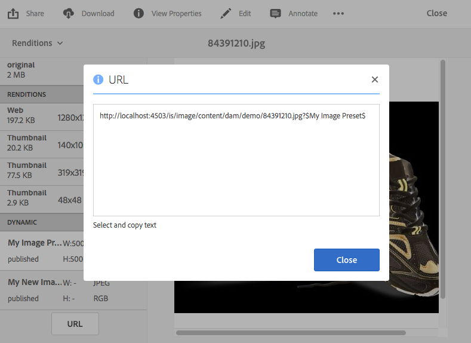

# 將 URL 連結至您的 Web 應用程式 {#linking-urls-to-your-web-application}

您的網站和應用程式會透過URL呼叫存取動態媒體服務。 在您發佈資產後，動態媒體會啟動參照資產的URL字串。 您可以將這些URL貼入網頁瀏覽器以進行測試。

您只有在未將AEM用作WCM *時* ，才會連結至URL。 連結與內嵌——是當您想要將視訊播放器當成快顯視窗或強制視窗時使用。 如果您使用AEM做為WCM, [就直接在頁面上新增資產。](adding-dynamic-media-assets-to-pages.md)

若要將這些URL字串置於您的網頁和應用程式中，請從Dynamic Media複製。

>[!NOTE]
>
>URL字串僅適用於資產的動態轉譯。 它們目前不適用於駐留在DAM中的靜態資產，而非動態媒體伺服器。 URL按鈕不會針對靜態轉譯顯示。

See also [Embedding the Video or Image Viewer on a Web Page.](embed-code.md)

另請參閱 [將YouTube URL連結至您的Web應用程式。](video.md)

See also [Delivering Optimized Images for a Responsive Site.](responsive-site.md)

另請參閱 [上傳資產。](/help/assets/manage-digital-assets.md#uploading-assets)

## 取得資產的URL {#obtaining-a-url-for-an-asset}

您可以取得影像預設集或檢視器預設集產生的URL字串。 複製URL後，它會進入剪貼簿，如此您就可視需要將它貼至網站或應用程式的頁面。

>[!NOTE]
>
>在您發佈所選資產之前，URL無法複製。 此外，您也必須發佈檢視器預設集或影像預設集。
>
>請參閱 [發佈資產](publishing-dynamicmedia-assets.md)。
>
>請參 [閱Publishing Viewer預設集](managing-viewer-presets.md#publishing-viewer-presets)。
>
>請參閱 [發佈影像預設集](managing-image-presets.md#publishing-image-presets)。

您有幾種不同的方式可取得URL字串。 不過，下列步驟僅顯示一個可使用的方法。

**若要取得資產的URL**

1. 導覽至您 ** 要複製其影像預設集URL或檢視器預設集URL的已發佈資產，然後點選資產以開啟它。

   請記住，URL僅可在您首次發 *布資產* 後 *複製* 。此外，檢視器預設集或影像預設集也必須發佈。

   請參閱 [發佈資產。](publishing-dynamicmedia-assets.md)

   請參 [閱Publishing Viewer預設集](managing-viewer-presets.md#publishing-viewer-presets)。

   請參閱 [發佈影像預設集](managing-image-presets.md#publishing-image-presets)。

1. 根據您選取的資產，執行下列其中一項作業：

   * 如果您選取了影像，請在下拉式選單中，點選「轉 **[!UICONTROL 譯」]**。

      在「動 **[!UICONTROL 態]** 」標題下，點選預設名稱，以在正確的影格中檢視其轉譯。 您可能需要捲動「轉譯」清單，才能查看「動態」標題。

      在左側導軌底部，點選 **[!UICONTROL URL]**。

      

   * 如果您在下拉式選單中選取回轉集、影像集、轉盤集或視訊，請點選「檢 **[!UICONTROL 視器]**」。

      在左側導軌中，點選檢視器預設集名稱。 該集或視訊的預覽會在個別頁面中開啟。

      在左側導軌底部，點選 **[!UICONTROL URL]**。

      

1. 選取文字並複製至您的網頁瀏覽器，以預覽資產或新增至網頁內容頁面。

   若要退出URL視窗，請點選 **[!UICONTROL X]** 或點選 **[!UICONTROL 關閉]**。

## 取得靜態資產的URL {#obtaining-a-url-for-a-static-asset}

Dynamic Media支援傳送靜態資產，這些資產不只是影像和視訊而已。 支援的靜態資產格式包括：

* GIF動畫
* 音訊檔案
* CSS
* JavaScript（當您的公司設定了自己的網域時）
* PDF
* SVG
* XML
* ZIP

**若要取得靜態資產的URL**

1. 導覽至您要複製其URL的*plished *static資產，然後點選資產以開啟它。

   Remember that URLs are only available to copy *after* you have first *published* the static asset.

   請參閱 [發佈資產。](publishing-dynamicmedia-assets.md)

1. 使用下列任一方法來取得已發佈的靜態資產的URL:

   * `The URL of the published static is the following:`

      * `https://*<server_name>*/is/content/*<company_name>*/*<static_asset_filename>*.*<extension>*`

         For example, `https://aem.com/is/content/adobe/image.gif`.
   * 按一 **[!UICONTROL 下「資產>動態轉譯]**」，然後點選靜態資產的動態轉譯並複製URL。

      變更複製的URL，以 `is/content` 在路徑中使用 `is/image/`。

## 取得已發佈視訊轉譯的視訊URL {#obtaining-a-video-url-for-a-published-video-rendition}

1. 在AEM中，導覽至「工 **[!UICONTROL 具>部署>雲端>雲端服務」]**。
1. 在「 **[!UICONTROL Cloud Services]** 」頁面上 **[!UICONTROL ，向下捲動至「]** Dynamic Media Cloud Services **[!UICONTROL 」標題，然後點選「]** Show Configurations」。
1. 在「 **[!UICONTROL 可用配置]**」下，點選所需配置的名稱。

1. 在「動 **[!UICONTROL 態Media Cloud設定]** 」頁面的「 **[!UICONTROL 視訊服務URL」下]**，複製整個URL路徑。 您稍後在步驟中需要複製的URL路徑。

   例如，URL路徑可能與下列內容類似：

   `https://s7athens.macromedia.com:9090/DMGateway/`

   (上述路徑僅供圖例之用； 它不是您複製的實際路徑)。

1. 在「 **[!UICONTROL 註冊ID]**」下方，複製ID最後一部分中找到的客戶名稱。

   例如，如果註冊ID為 `87654321|MyCompany`，則客戶名稱為 `MyCompany`。

1. 在頁面的左上角附近，點選 **[!UICONCONTROL Cloud Services**，然後點選AEM圖示並導覽至「一般> **[!UICONTROL CRXDE Lite]**」。
1. 從JCR(Java Content Repository)複製整個視訊轉譯路徑。

   例如，視訊的轉譯路徑可能會如下所示：

   `/_renditions_/0bd/0bd28743-a616-4fe6-92aa-6eae7c2112f/avs/Momentum_1080-0x720-2600k.mp4`

   (上述路徑僅供圖例之用； 它不是您複製的實際路徑)。

1. 依下列順序排列複製的資訊，以形成完整的URL路徑：

   `<Video_Service_URL>/public/<Customer_name_from_Registration_ID>/<Video_rendition_path>`

   例如，使用上述步驟中的範例路徑和範例客戶名稱，完整路徑會顯示如下：

   `https://s7athens.macromedia.com:9090/DMGateway/public/MyCompany/_renditions_/0bd/0bd28743-a616-4fe6-92aa-6eae7c2112ff/avs/Momentum_1080-0x720-2600k.mp4`

   這是已發佈視訊轉譯的完整視訊URL。

## 取得最適化串流(HLS)的視訊URL {#obtaining-a-video-url-for-adaptive-streaming-hls}

1. 在AEM中，導覽至「工 **[!UICONTROL 具>部署>雲端>雲端服務」]**。
1. 在「 **[!UICONTROL Cloud Services]** 」頁面上 **[!UICONTROL ，向下捲動至「]** Dynamic Media Cloud Services **[!UICONTROL 」標題，然後點選「]** Show Configurations」。
1. 在「 **[!UICONTROL 可用配置]**」下，點選所需配置的名稱。
1. 在「動 **[!UICONTROL 態媒體雲端服務設定]** 」頁面上，執行下列動作：

   * 在「 **[!UICONTROL 視訊服務URL]**」下，複製整個URL路徑。 您稍後在這些步驟中將需要複製的URL路徑。 例如，URL路徑可能與下列內容類似：
   `https://gateway-na.assetsadobe.com/DMGateway/`

   (上述路徑僅供圖例之用； 它不是您複製的實際路徑)。

   * 在「 **[!UICONTROL 註冊ID]**」下方，複製ID最後一部分中找到的客戶名稱。您稍後將需要這些步驟中複製的客戶名稱。

      例如，如果註冊ID是 `87654321|demoCo`您複製的客戶名稱 `demoCo`。

1. 根據您使用的視訊傳送通訊協定，複製個別的通訊協定選擇器。 在這些步驟中，您稍後將需要複製的協定選擇器。

   <table>
    <tbody>
      <tr>
      <td><strong>您使用的視訊傳送通訊協定</strong></td>
      <td><strong>要使用的協定選擇器</strong></td>
      </tr>
      <tr>
      <td>
HTTP
 
如果您使用HTTP（非安全視訊傳送），請務必在先前 <code>https</code> 複製 <code>http</code> 的視訊服務URL值中變更為。
 </td>
      <td><code>public/</code></td>
      </tr>
      <tr>
      <td>HTTPS</td>
      <td><code>public-ssl/</code></td>
      </tr>
    </tbody>
   </table>

1. 在AEM中複製完整的視訊資產路徑，由Dynamic Media處理。 您稍後在這些步驟中將需要此複製的視訊資產路徑。

   例如：

   `/content/dam/marketing/MyVideo.mp4`

1. 將先前複製的所有部分合併，以建立字串：

   &lt; `video service URL`>&lt; `protocol selector`>&lt; `customer name`>&lt; `video asset path`>

   例如，使用這些步驟中範例中複製的資訊，字串會顯示如下：

   `https://gateway-na.assetsadobe.com/DMGateway/public-ssl/demoCo/content/dam/marketing/MyVideo.mp4`

1. 附加至字串的 `.m3u8` 結尾以完成URL。 例如，從上 `.m3u8` 一步驟附加至字串時，完整的URL路徑會顯示如下：

   `https://gateway-na.assetsadobe.com/DMGateway/public-ssl/demoCo/content/dam/marketing/MyVideo.mp4.m3u8`

## 使用HTTP/2來傳送您的動態媒體資產 {#using-http-to-deliver-your-dynamic-media-assets}

HTTP/2是全新、更新的Web通訊協定，可改善瀏覽器和伺服器的通訊方式。 它提供更快速的資訊傳輸，並降低所需的處理能力。 動態媒體資產的傳送現在可透過HTTP/2，提供更佳的回應和載入時間。

如需 [您的動態媒體帳戶開始使用HTTP/2的完整詳細資訊，請參閱HTTP2內容傳送](http2faq.md) 。
