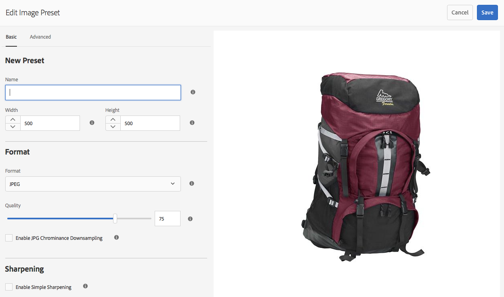
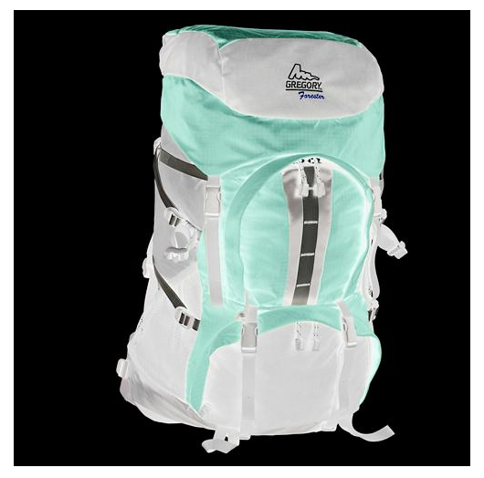
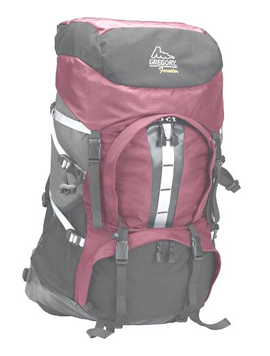
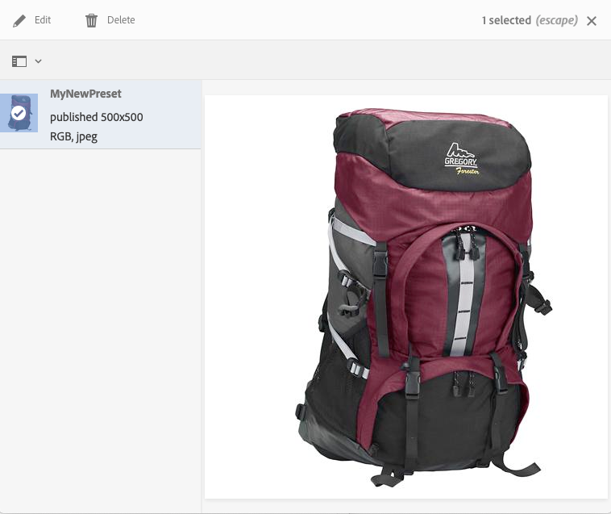

# Managing Image Presets{#managing-image-presets}

「影像預設集」可讓AEM Assets以不同大小、不同格式或其他動態產生的影像屬性動態傳送影像。 每個影像預設集代表一組預先定義的影像大小調整和格式設定指令，以顯示影像。 當您建立影像預設集時，可以選擇影像傳送的大小。 您也可以選擇格式命令，以便在傳送影像供檢視時，將影像的外觀最佳化。

管理員可以建立預設集，以匯出資產。 使用者在匯出影像時可以選擇預設集，這也會依照管理員指定的規格重新格式化影像。

您也可以建立回應式影像預設集。 如果您將回應式影像預設集套用至您的資產，則會依據所檢視的裝置或螢幕大小而變更。 除了RGB或灰色外，您還可以設定影像預設集，在色域中使用CMYK。

本節說明如何建立、修改及一般管理影像預設集。 您可以隨時預覽影像，將影像預設集套用至影像。 請參閱 [套用影像預設集](/help/assets/dynamic-media/image-presets.md)。

>[!NOTE]
>
>智慧型影像功能可與您現有的影像預設集搭配使用，並在傳送時的最後一毫秒使用智慧功能，根據瀏覽器或網路連線速度進一步降低影像檔案大小。 如需詳 [細資訊](/help/assets/dynamic-media/imaging-faq.md) ，請參閱智慧型影像。

## 瞭解影像預設集 {#understanding-image-presets}

像宏一樣，「影像預設集」是預先定義的一組大小和格式命令，這些命令以名稱保存。 為了瞭解影像預設集的運作方式，假設您的網站要求每個產品影像以不同的大小、不同的格式和壓縮率顯示，以用於桌上型電腦和行動裝置傳送。

您可以建立兩個影像預設集： 桌上型電腦版本為500 x 500像素，行動版本為150 x 150像素。 您可以建立兩個影像預設集，一個 `Enlarge` 稱為以500x500像素顯示影像，另一個 `Thumbnail` 稱為以150x150像素顯示影像。 若要以大小和大 `Enlarge` 小傳 `Thumbnail` 送影像，AEM會尋找放大影像預設集和縮圖影像預設集的定義。 然後，AEM會以每個影像預設集的大小和格式規格動態產生影像。

動態傳送時，影像大小會變小，而影像會失去清晰度和細節。 因此，每個影像預設集都包含格式控制項，以最佳化以特定大小傳送的影像。 這些控制項可確保您的影像在傳送到您的網站或應用程式時清晰銳利。

管理員可以建立影像預設集。 若要建立影像預設集，您可以從頭開始，或從現有影像預設集開始，然後以新名稱儲存。

## Managing Image Presets {#managing-image-presets-1}

您可以點選或按一下AEM標誌來存取全域導覽主控台，然後點選或按一下「工具」圖示，並導覽至「資產>影像預設集」，以管理AEM中的 **[!UICONTROL 影像預設集]**。


>[!NOTE]
>
>當您預覽或傳送資產時，您建立的任何影像預設集也可當成動態轉譯。
>
>您不需 *要發佈* 影像預設集，因為影像預設集會自動發佈。
>
>請參閱 [發佈影像預設集。](#publishing-image-presets)

>[!NOTE]
>
>當您在資產的「詳細資料檢視」中選取「轉譯 **[!UICONTROL 」]** 時，系統會顯示多種轉譯。 您可以增加或減少顯示的影像預設集數目。 See [Increasing the number of image presets that display](#increasing-or-decreasing-the-number-of-image-presets-that-display).

### Adobe Illustrator(AI)、Postscript(EPS)和PDF檔案格式 {#adobe-illustrator-ai-postscript-eps-and-pdf-file-formats}

如果您想要支援擷取AI、EPS和PDF檔案，以便產生這些檔案格式的動態轉譯，您可能需要先檢閱下列資訊，再建立影像預設集。

Adobe Illustrator的檔案格式是PDF的變體。 在AEM Assets的背景中，主要差異如下：

* Adobe Illustrator檔案由單一頁面和多個圖層組成。 每個圖層都會擷取為主要Illustrator資產下的PNG子資產。
* PDF檔案由一或多頁組成。 每個頁面都會擷取為主多頁PDF檔案下的單一頁面PDF子資產。

子資產由整個工作流程 `Create Sub Asset process` 中的元件建 `DAM Update Asset` 立。 要在工作流中查看此流程元件，請按一下「工 **[!UICONTROL 具」>「工作流」>「模型」>「DAM更新資產」>「編輯」]**。

<!-- See also [Viewing pages of a multi-page file](/help/assets/manage-linked-subassets.md#view-pages-of-a-multi-page-file). -->

當您開啟資產時，可以檢視子資產或頁面、點選「內容」功能表，然後選取「子資 **[!UICONTROL 產]** 」或 **[!UICONTROL 「頁面」]**。 子資產是真實資產。 也就是說，PDF頁面是由工作流程元件 `Create Sub Asset` 所擷取。 然後，這些資產會 `page1.pdf`儲存為 `page2.pdf`主要資產下方的資產，依此類推。 儲存後，工作流程會處 `DAM Update Asset` 理這些項目。

若要使用動態媒體來預覽並產生AI、EPS或PDF檔案的動態轉譯，需要下列處理步驟：

1. 在工作 `DAM Update Asset` 流程中，流 `Rasterize PDF/AI Image Preview Rendition` 程元件使用配置的解析度將原始資產的第一頁柵格化為格 `cqdam.preview.png` 式副本。

1. 然後 `cqdam.preview.png` ，該轉譯會由工作流中的流程元件 `Dynamic Media Process Image Assets` 優化為PTIFF。

>[!NOTE]
>
>在「DAM更新資產」工作流程中， **[!UICONTROL EPS縮圖步驟]** ，會為EPS檔案生成縮圖。

#### PDF/AI/EPS資產中繼資料屬性 {#pdf-ai-eps-asset-metadata-properties}

| **中繼資料屬性** | **說明** |
|---|---|
| dam:Physicalwidthininches | 檔案寬度（英吋）。 |
| dam：物理高度英吋 | 檔案高度（英吋）。 |

通過工 `Rasterize PDF/AI Image Preview Rendition` 作流訪問流程元件 `DAM Update Asset` 選項。

點選左上角的Adobe Experience Manager，導覽至「工具>工 **[!UICONTROL 作流程>模型」]**。 在「工作流模型」頁面上，選擇「 **[!UICONTROL DAM更新資產]**」，然後在工具列上點選「編 **[!UICONTROL 輯」]**。 在「DAM更新資產」工作流程頁面上，點選兩下流程 `Rasterize PDF/AI Image Preview Rendition` 元件以開啟其「步驟屬性」對話方塊。

#### Rasterize PDF/AI Image Preview Rendition options {#rasterize-pdf-ai-image-preview-rendition-options}


點陣化PDF或AI工作流程的引數

<table>
 <tbody>
  <tr>
   <td><strong>進程參數</strong></td>
   <td><strong>預設設定</strong></td>
   <td><strong>說明</strong></td>
  </tr>
  <tr>
   <td>Mime 類型</td>
   <td><p>application/pdf</p> <p>application/postscript</p> <p>application/illustrator<br /> </p> </td>
   <td>被視為PDF或Illustrator檔案的檔案MIME類型清單。<br /> </td>
  </tr>
  <tr>
   <td>寬度上限</td>
   <td>2048</td>
   <td>產生的預覽轉譯的最大寬度（以像素為單位）。<br /> </td>
  </tr>
  <tr>
   <td>高度上限</td>
   <td>2048</td>
   <td>產生的預覽轉譯的最高高度（以像素為單位）。<br /> </td>
  </tr>
  <tr>
   <td>解析度</td>
   <td>72</td>
   <td>解析度，以ppi為單位點陣化第一頁（每英吋像素）。</td>
  </tr>
 </tbody>
</table>

使用預設的處理引數，PDF/AI檔案的第一頁點陣化為72 ppi，而產生的預覽影像大小為2048 x 2048像素。 對於一般部署，您可能想要將解析度提高至至少150 ppi或以上。 例如，美國字母大小為300 ppi的檔案要求最大寬度和高度分別為2550 x 3300像素。

「最大寬度」和「最大高度」會限制點陣化的解析度。 例如，如果最大值未變更，而「解析度」設定為300 ppi，則美國字母檔案點陣化為186 ppi。 也就是說，檔案是1581 x 2046像素。

進 `Rasterize PDF/AI Image Preview Rendition` 程元件已定義最大值，以確保不會在記憶體中建立過大的映像。 此類大型映像可能會使提供給JVM（Java虛擬機）的記憶體溢出。 請務必為JVM提供足夠的記憶體來管理已配置的並行工作流數，每個工作流都有可能以最大配置的大小建立映像。

### InDesign(INDD)檔案格式 {#indesign-indd-file-format}

如果您想要支援擷取INDD檔案，以便產生此檔案格式的動態轉譯，您可能需要先檢閱下列資訊，再建立影像預設集。

若是InDesign檔案，子資產只會在Adobe InDesign伺服器與AEM整合時提取。 參考的資產會根據其中繼資料進行連結。 連結時不需要InDesign Server。 不過，在處理InDesign檔案之前，必須先在AEM中顯示參考的資產，才能在InDesign檔案和參考的資產之間建立連結。

<!-- See [Integrating AEM Assets with InDesign Server](/help/assets/indesign.md). -->

工作流程中的「媒體擷取」程 `DAM Update Asset` 序元件會執行數個預先設定的擴充指令碼，以處理InDesign檔案。


DAM更新資產工作流程中媒體擷取程式元件引數中的ExtendScript路徑。

Dynamic Media整合使用下列指令碼：

<table>
 <tbody>
  <tr>
   <td><strong>擴充指令碼名稱</strong></td>
   <td><strong>預設</strong></td>
   <td><strong>說明</strong></td>
  </tr>
  <tr>
   <td>ThumbnailExport.jsx</td>
   <td>是</td>
   <td>產生300 ppi的轉譯 <code>thumbnail.jpg</code> ，經過最佳化，並透過處理元件轉換為PTIFF <code>Dynamic Media Process Image Assets</code> 轉譯。<br /> </td>
  </tr>
  <tr>
   <td>JPEGPagesExport.jsx</td>
   <td>是</td>
   <td>為每個頁面產生300 ppi的JPEG子資產。 JPEG子資產是儲存在InDesign資產下的實際資產。 此外，它還經過工作流程的最佳化，並轉變成PTIFF <code>DAM Update Asset</code> 格式。<br /> </td>
  </tr>
  <tr>
   <td>PDFPagesExport.jsx</td>
   <td>否</td>
   <td>為每個頁面產生PDF子資產。 PDF子資產會如前所述處理。 由於PDF僅包含單一頁面，因此不會產生子資產。<br /> </td>
  </tr>
 </tbody>
</table>

### 設定影像縮圖大小 {#configuring-image-thumbnail-size}

您可以在 **[!UICONTROL DAM Update Asset工作流程中設定這些設定，以設定縮圖的大小]** 。 工作流程中有兩個步驟可讓您設定影像資產的縮圖大小。 雖然其中一個(**[!UICONTROL Dynamic Media Process Image Assets]**)用於動態影像資產，而另一個(**[!UICONTROL Process Thumbnails]**)用於靜態縮圖產生，或當所有其他程式無法產生縮圖時，兩者的設定 ** 應相同。

在「動 **[!UICONTROL 態媒體處理影像資產」步驟中]** ，影像伺服器會產生縮圖，此組態與套用至「處理縮圖」步驟的組態無關 **** 。透過「處理縮圖 **[!UICONTROL 」步驟產生縮圖]** ，是建立縮圖的最慢且記憶體最耗用的方式。

縮圖大小定義如下： **[!UICONTROL width:height:center]**，例如 *80:80:false*。 寬度和高度決定縮圖的大小（以像素為單位）; 中心值為false或true，若設為true，則表示縮圖影像的大小與設定中的大小完全相同。 如果調整大小的影像較小，則會置於縮圖中。

>[!NOTE]
>
>* EPS檔案的縮圖大小是在 **[!UICONTROL EPS縮圖步驟(「縮圖]** 」(Thumbnails)下的「參數」( **[!UICONTROL Arguments]** )頁籤中配置的。
   >
   >
* 視訊的縮圖大小是在「參數」下的「 **[!UICONTROL Process]** 」 (處理) 頁籤的「 **[!UICONTROL FFmpeg縮圖]** 」步驟中設定 ****。
>


**若要設定影像縮圖大小**

1. 點選「 **[!UICONTROL 工具>工作流程>模型> DAM更新資產>編輯」]**。
1. 點選「動 **[!UICONTROL 態媒體處理影像資產」步驟]** ，然後點選「縮 **[!UICONTROL 圖]** 」標籤。 視需要變更縮圖大小，然後點選「 **[!UICONTROL 確定]**」。

   

1. 點選「處 **[!UICONTROL 理縮圖]** 」步驟，然後點選「縮 **[!UICONTROL 圖]** 」標籤。視需要變更縮圖大小，然後點選「 **[!UICONTROL 確定]**」。

   >[!NOTE]
   >
   >「處理縮圖」步驟中縮圖引數中 **[!UICONTROL 的值必須與「動態媒體處理影像資產」]** 步驟中的縮圖引數相符 **** 。

1. 點選「 **[!UICONTROL 儲存]** 」以儲存對工作流程所做的變更。

### 增加或減少顯示的影像預設集數目 {#increasing-or-decreasing-the-number-of-image-presets-that-display}

當您預覽資產時，您建立的影像預設集會以動態轉譯的形式提供。 AEM會在從「詳細資料檢視>轉譯」檢視資產時，顯 **[!UICONTROL 示多種動態轉譯]**。 您可以增加或減少顯示的轉譯限制。

**增加或減少顯示的影像預設集數目**

1. 導覽至CRXDE Lite([https://localhost:4502/crx/de](https://localhost:4502/crx/de))。
1. 導覽至位於的影像預設集清單節點 `/libs/dam/gui/coral/content/commons/sidepanels/imagepresetsdetail/imgagepresetslist`

   

1. 在 **[!UICONTROL limit]** 屬性中，將預設設 ****&#x200B;定為15的值變更為所要的數字。
1. 導覽至影像預設集資料來源，網址為 `/libs/dam/gui/coral/content/commons/sidepanels/imagepresetsdetail/imgagepresetslist/datasource`

   

1. 在limit屬性中，將數字變更為所需的數字，例如 `{empty requestPathInfo.selectors[1] ? "20" : requestPathInfo.selectors[1]}`
1. 點選「 **[!UICONTROL 全部儲存]**」。

### 建立影像預設集 {#creating-image-presets}

建立影像預設集可讓您在預覽或發佈時，將這些設定套用至任何影像。

>[!NOTE]
>
>如果使用Internet Explorer 9，在儲存後建立預設集不會立即出現在預設集清單中。 若要解決此問題，請停用IE9的快取。

如果您想要支援擷取AI、PDF和EPS檔案，以便產生這些檔案格式的動態轉譯，您可能需要先檢閱下列資訊，再建立影像預設集。
請參 [閱Adobe Illustrator(AI)、Postscript(EPS)和PDF檔案格式](#adobe-illustrator-ai-postscript-eps-and-pdf-file-formats)。

如果您想要支援擷取INDD檔案，以便產生此檔案格式的動態轉譯，您可能需要先檢閱下列資訊，再建立影像預設集。
請參 [閱InDesign(INDD)檔案格式](#indesign-indd-file-format)。

**若要建立影像預設集**

1. In AEM, tap the AEM logo to access the global navigation console, then tap **[!UICONTROL Tools > Assets > Image Presets]**.
1. 按一下&#x200B;**[!UICONTROL 建立]**。「編 **[!UICONTROL 輯影像預設集]** 」視窗隨即開啟。

   

   >[!NOTE]
   >
   >若要讓此影像預設變得自適應，請擦除 **[!UICONTROL 寬度]****[!UICONTROL 和高度欄]** 位中的值，並保留空白。

1. 視需要在「基 **[!UICONTROL 本]** 」和「 **[!UICONTROL 進階]** 」標籤中輸入值，包括名稱。這些選項在「影像預設 [集選項」中概述](#image-preset-options)。預設集會出現在左窗格中，並可與其他資產一起即時使用。

   

1. 按一下 **[!UICONTROL保存**。

### Creating a responsive Image Preset {#creating-a-responsive-image-preset}

若要建立互動式影像預設集，請執行「建立影像預 [設集」中的步驟](#creating-image-presets)。 在「編輯影像預設集」窗口中輸入高 **[!UICONTROL 度和寬度時]** ，請拭除這些值並將其留空。

保留空白會告訴AEM此影像預設集是自適應的。 您可以視需要調整其他值。

>[!NOTE]
>
>若要在套用 **[!UICONTROL 影像預設集]** 至資產時查看 **** URL和RESS按鈕，必須發佈資產。
>
>
>
>請注意，影像預設集和影像資產會自動發佈。

### 影像預設集選項 {#image-preset-options}

當您建立或編輯影像預設集時，您可以選擇本節所述的選項。 此外，Adobe建議您從下列「最佳實務」選項開始：

* **[!UICONTROL格式** (基本&#x200B;**[!UICONTROL 頁籤]** )-選擇 **[!UICONTROL JPEG]** 或其它符合您要求的格式。所有網頁瀏覽器都支援JPEG影像格式；它在小檔案大小和影像品質之間提供良好的平衡。但是，JPEG格式影像使用有損壓縮方案，如果壓縮設定太低，則該壓縮方案會引入不想要的影像偽影。因此，Adobe建議將壓縮品質設為75。此設定在影像品質和檔案大小之間取得良好的平衡。

* **[!UICONTROL 啟用簡單銳利化]** -請勿選取「啟用簡 **** 單銳利化」 (此銳利化濾鏡提供的控制力比「非銳利化遮色片」設定少)。

* **[!UICONTROL 銳利化： 重新取樣模式]** -選 **[!UICONTROL 取「雙三次方」]**。

#### 基本標籤選項 {#basic-tab-options}

<table>
 <tbody>
  <tr>
   <td><strong>欄位</strong></td>
   <td><strong>說明</strong></td>
  </tr>
  <tr>
   <td><strong>名稱</strong></td>
   <td>輸入不含空格的描述性名稱。在名稱中加入影像大小規格可幫助使用者識別此影像預設集。</td>
  </tr>
  <tr>
   <td><strong>寬度和高度</strong></td>
   <td>以像素輸入影像傳送的大小。 寬度和高度必須大於0像素。 如果其中一個值為0，則不會建立預設。 如果這兩個值都為空，則建立自適應影像預設。</td>
  </tr>
  <tr>
   <td><strong>格式</strong></td>
   <td><p>從功能表選擇格式。</p> <p>選擇 <strong>JPEG</strong> ，可提供下列其他選項：</p>
    <ul>
     <li><strong>品質</strong> -控制JPEG壓縮等級。 此設定會影響檔案大小和影像品質。 JPEG品質等級為1-100。 拖曳滑桿時，可看到縮放。</li>
     <li><strong>啟用JPG色度縮減取樣</strong> -由於眼睛對高頻色彩資訊的敏感度低於高頻亮度，因此JPEG影像會將影像資訊分為明度和色彩元件。 當JPEG影像被壓縮時，亮度分量保留為全解析度，而顏色分量通過平均一組像素被縮減採樣。 縮減取樣可將資料量減少一半或三分之一，幾乎不會影響感知的品質。 縮減取樣不適用於灰階影像。 此技術可降低對高對比度影像（例如具有覆蓋文字的影像）有用的壓縮量。</li>
    </ul>
    <div>
      選擇 <strong>GIF</strong> 或 <strong>GIF with alpha</strong> ，可提供下列其他 <strong>GIF色彩量化選項</strong> :
    </div>
    <ul>
     <li><strong>鍵 </strong>入——選 <strong>擇Adaptive</strong> （預設）、 <strong>Web</strong>或 <strong>Macintosh</strong>。 If you select <strong>GIF with Alpha</strong>, the Macintosh option is not available.</li>
     <li><strong>混色</strong> -選取「 <strong>擴散</strong> 」或「 <strong>關閉」</strong>。</li>
     <li><strong>顏色數 </strong>-輸入2到256之間的數字。</li>
     <li><strong>顏色清單</strong> -輸入逗號分隔的清單。 例如，對於白色、灰色和黑色，請輸入000000,888888,ffffff。</li>
    </ul>
    <div>
      選擇 <strong>PDF</strong>、 <strong>TIFF</strong>或 <strong>TIFF with alpha</strong> ，提供下列其他選項：
    </div>
    <ul>
     <li><strong>壓縮</strong> -選擇壓縮演算法。 PDF的演算法選項 <strong>有None</strong>、 <strong>Zip</strong>和 <strong>Jpeg</strong>; for TIFF <strong>None</strong><strong>None</strong>、 <strong>LZW</strong>、 <strong>Jpeg</strong>和ZipZipHere; 對於含Alpha的TIFF，則 <strong>為None</strong>、 <strong>LZW</strong>和 <strong>Zip</strong>。</li>
    </ul> <p>選擇 <strong>PNG</strong>、 <strong>PNG with Alpha</strong> 或 <strong>EPS</strong> 不提供其他選項。</p> </td>
  </tr>
  <tr>
   <td><strong>銳利化</strong></td>
   <td>Select the <strong>Enable Simple Sharpening</strong> option to apply a basic sharpening filter to the image after all scaling takes place. Sharpening can help compensate for blurriness that can result when you display an image at a different size. </td>
  </tr>
 </tbody>
</table>

#### 進階標籤選項 {#advanced-tab-options}

<table>
 <tbody>
  <tr>
   <td><strong>欄位</strong></td>
   <td><strong>說明</strong></td>
  </tr>
  <tr>
   <td><strong>色域</strong></td>
   <td>選擇 <strong>RGB、CMYK</strong> 或 <strong>「灰階</strong> 」作為色域。</td>
  </tr>
  <tr>
   <td><strong>色彩設定檔</strong></td>
   <td>如果資產與使用中的描述檔不同，請選取該資產應轉換的輸出色域描述檔。</td>
  </tr>
  <tr>
   <td><strong>渲染方法</strong></td>
   <td>您可以覆寫預設的演算方式。 演算方式會決定無法在目標色彩描述檔（溢色）中重制的色彩會如何。 如果「渲染方式」與ICC配置檔案不相容，則會忽略它。
    <ul>
     <li>選擇「 <strong>感知</strong> 」，當原始影像中的一個或多個顏色超出目標色域的色域時，將總色域從一個色域壓縮到另一個色域。</li>
     <li>當目 <strong>標顏色空間中的顏色超出色域時，選擇「相對比色</strong> 」，並希望將其映射到目標顏色空間的色域中最接近的顏色，而不影響任何其他顏色。 </li>
     <li>選取「 <strong>飽和度</strong> 」，在轉換為目標色域時重制原始影像色彩飽和度。 </li>
     <li>選取「 <strong>絕對比色</strong> 」，以精確比對顏色，而不會調整會改變影像亮度的白點或黑點。</li>
    </ul> </td>
  </tr>
  <tr>
   <td><strong>黑點補償</strong></td>
   <td>如果輸出配置檔案支援此功能，請選擇此選項。 如果黑點補償與指定的ICC配置檔案不相容，則忽略它。</td>
  </tr>
  <tr>
   <td><strong>正在遞色</strong></td>
   <td>選取這個選項可能會避免或減少色帶不自然。 </td>
  </tr>
  <tr>
   <td><strong>銳利化文字</strong></td>
   <td><p>選擇「 <strong>無</strong>」、「銳 <strong>化」</strong>或「銳 <strong>化」或「銳化遮色片</strong>」。 </p>
    <ul>
     <li>選擇「 <strong>無</strong> 」可禁用銳利化。</li>
     <li>選取「 <strong>銳利 </strong>化」，在進行所有縮放後，將基本銳利化濾鏡套用至影像。 銳利化有助於補償以不同大小顯示影像時可能產生的模糊性。 </li>
     <li>Select<strong> Unsharp mask</strong> to fine-tune a sharpening filter effect on the final downsampled image. 您可以控制效果的強度、效果半徑（以像素計量）以及將忽略的對比度臨界值。 此效果使用的選項與 Photoshop的「遮色片銳利化」濾鏡相同。</li>
    </ul> <p>在「 <strong>銳利化遮色片</strong>」中，您有下列選項：</p>
    <ul>
     <li><strong>量</strong> -控制套用至邊緣像素的對比度。 預設實數值為1.0。 對於高解析度的影像，您可將影像放大至高達5.0。 將「量」視為濾鏡強度的度量。</li>
     <li><strong>半徑</strong> -決定影響銳利化的邊緣像素周圍的像素數。 對於高解析度影像，請輸入1到2的實數。 低值只會銳化邊緣像素； 高值會銳化更寬的像素帶。 正確值取決於影像的大小。</li>
     <li><strong>閾值</strong> -決定套用非銳利遮色片濾鏡時要忽略的對比範圍。 換言之，此選項可決定銳化的像素在被視為邊緣像素並銳化之前，必須與周圍區域有多大差異。 為避免引入雜訊，請嘗試2到20之間的整數值。 </li>
     <li><strong>套用至</strong> -判斷未銳利化套用至每種顏色或亮度。</li>
    </ul>
    <div>
      銳利化影像中會 <a href="https://docs.adobe.com/content/help/en/dynamic-media-classic/using/assets/s7_sharpening_images.pdf">說明銳利化</a>。
    </div> </td>
  </tr>
  <tr>
   <td><strong>重新取樣模式</strong></td>
   <td>選取「重新 <strong>取樣模式</strong> 」選項。 這些選項會在縮減取樣時銳利化影像：
    <ul>
     <li><strong>雙線性</strong> -最快速的重新取樣方法。 有些鋸齒不自然現象會很明顯。</li>
     <li><strong>雙三次方</strong> -提高CPU使用量，但產生更銳利的影像，並減少明顯的鋸齒不自然現象。</li>
     <li><strong>Sharp2</strong> —— 產生比Bi-Cubic更銳利的結果，但CPU成本更高。</li>
     <li><strong>Bi-Sharp</strong> —— 選取Photoshop預設重新取樣器以減小影像大小，在Adobe Photoshop中 <strong>稱為bicubic sharp</strong> 。</li>
     <li><strong>每種顏色</strong> 和亮 <strong>度</strong> -每種方法都可以基於顏色或亮度。 依預設 <strong>選取「每種顏色</strong> 」。</li>
    </ul> </td>
  </tr>
  <tr>
   <td><strong>列印解析度</strong></td>
   <td>選擇打印此影像的解析度； 預設值為72像素。</td>
  </tr>
  <tr>
   <td><strong>影像修飾元</strong></td>
   <td><p>除了UI中的常用影像設定外，Dynamic Media還支援許多進階影像修改，您可在「影像修飾元」欄位中 <strong>指定</strong> 。 這些參數在「映像伺服器協 <a href="https://marketing.adobe.com/resources/help/en_US/s7/is_ir_api/is_api/http_ref/c_command_reference.html">議」命令參考中定義</a>。</p> <p>重要： 不支援API中列出的下列功能：</p>
    <ul>
     <li>基本範本和文字轉換指令： <code>text= textAngle= textAttr= textFlowPath= textFlowXPath= textPath=</code> 和 <code>textPs=</code></li>
     <li>本地化命令： <code>locale=</code> 和 <code>req=xlate</code></li>
     <li><code>req=set</code> 無法用於一般用途。</li>
     <li><code>req=mbrset</code></li>
     <li><code>req=saveToFile</code></li>
     <li><code>req=targets</code></li>
     <li><code>template=</code></li>
     <li>非核心動態媒體服務： SVG、影像轉換和網路印刷</li>
    </ul> </td>
  </tr>
 </tbody>
</table>

### 使用影像修飾元定義影像預設集選項 {#defining-image-preset-options-with-image-modifiers}

除了「基本」和「進階」標籤中的可用選項外，您還可以定義影像修飾元，以在定義影像預設集時提供更多選項。 影像演算需仰賴Scene7影像演算API，並在 [HTTP通訊協定參考中詳細定義](https://microsite.omniture.com/t2/help/en_US/s7/is_ir_api/is_api/http_ref/c_http_protocol_reference.html)。

以下是一些基本範例，說明您可以使用影像修飾元。

>[!NOTE]
>
>有些影像修飾 [元無法用於AEM](#advanced-tab-options)。

* [op_invert](https://microsite.omniture.com/t2/help/en_US/s7/is_ir_api/is_api/http_ref/r_op_invert.html) —— 反轉每個顏色元件以產生負面影像效果。

   ```xml
   &op_invert=1
   ```

   

* [op_blur](https://microsite.omniture.com/t2/help/en_US/s7/is_ir_api/is_api/http_ref/r_op_blur.html) —— 對影像套用模糊濾鏡。

   ```xml
   &op_blur=7
   ```

   

* 組合命令- op_blur和op-invert

   ```xml
   &op_invert=1&op_blur=7
   ```

   

* [op_brightness](https://microsite.omniture.com/t2/help/en_US/s7/is_ir_api/is_api/http_ref/r_op_brightness.html) —— 降低或增加亮度。

   ```xml
   &op_brightness=58
   ```

   

* [opac](https://microsite.omniture.com/t2/help/en_US/s7/is_ir_api/is_api/http_ref/r_opac.html) —— 調整影像不透明度。 可讓您降低前景不透明度。

   ```xml
   opac=29
   ```

   

### 編輯影像預設集 {#modifying-image-presets}

1. In AEM, tap the AEM logo to access the global navigation console, then tap **[!UICONTROL Tools > Assets > Image Presets]**.

   

1. 選取預設集，然後按一下「 **[!UICONTROL 編輯」]**。 「編 **[!UICONTROL 輯影像預設集]** 」視窗隨即開啟。
1. 進行變更，然後按一 **[!UICONTROL 下「儲存]** 」以儲存變更，或 **[!UICONTROL 按一下「取消]** 」以取消變更。

### 發佈影像預設集 {#publishing-image-presets}

影像預設集會自動為您發佈。

### 刪除影像預設集 {#deleting-image-presets}

1. 在AEM中，點選AEM標誌以存取全域導覽主控台，點選或按一下「工具」圖示，並導覽至「資產> **[!UICONTROL 影像預設集」]**。
1. 選擇預設集，然後按一下「 **[!UICONTROL刪除」**。 動態媒體會確認您要刪除它。 點選「 **[!UICONTROL 刪除]** 」以刪除，或點選「取 **[!UICONTROL 消]** 」以中止。
