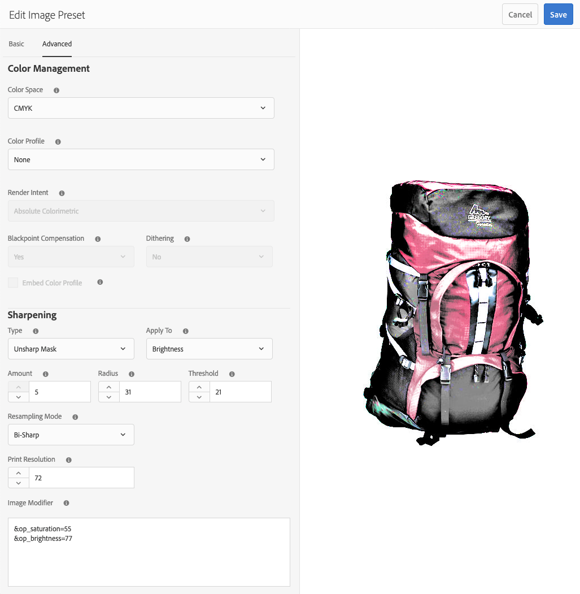

# 管理影像預設集{#managing-image-presets}

影像預設集可讓Adobe Experience Manager Assets以動態方式傳送不同大小、不同格式或其他動態產生影像屬性的影像。 每個影像預設集代表預先定義的一組大小調整和格式指令，用於顯示影像。 建立影像預設集時，您可以選取影像傳送的大小。 您也可以選擇格式化指令，以便在傳送影像供檢視時最佳化影像外觀。

管理員可以建立預設集來匯出資產。 使用者可以在匯出影像時選擇預設集，這樣也會將影像重新格式化為管理員指定的規格。

您也可以建立有回應的影像預設集。 如果您將回應式影像預設集套用至資產，預設集會隨著裝置或熒幕大小而變更。 您可以設定影像預設集以在RGB或灰階以外的色域中使用CMYK。

本節說明如何建立、修改和一般管理影像預設集。 您隨時都可以將「影像預設集」套用至影像。 請參閱[套用影像預設集](/help/assets/dynamic-media/image-presets.md)。

>[!NOTE]
>
>智慧型影像可與您現有的影像預設集搭配使用，並在最後毫秒的傳送中使用智慧型功能，根據瀏覽器或網路連線速度進一步縮小影像檔案大小。 如需詳細資訊，請參閱[智慧型影像](/help/assets/dynamic-media/imaging-faq.md)。

## 瞭解影像預設集 {#understanding-image-presets}

像巨集一樣，影像預設集是預先定義的集合，其中包含以名稱儲存的調整大小和格式指令。 若要瞭解影像預設集如何運作，假設您的網站要求每個產品影像以不同大小、不同格式和壓縮率顯示，以用於桌上型電腦和行動傳送。

您可以建立兩個影像預設集：500 x 500畫素用於案頭，150 x 150畫素用於行動裝置。 您建立兩個影像預設集，一個稱為`Enlarge`，以500x500畫素顯示影像，另一個稱為`Thumbnail`，以150 x 150畫素顯示影像。 若要以`Enlarge`和`Thumbnail`大小傳送影像，Experience Manager找到`Enlarge Image Preset`和`Thumbnail Image Preset`的定義。 接著Experience Manager會根據每個影像預設集的大小和格式規格，動態產生影像。

動態傳送影像時若縮小影像大小，可能會失去銳利度和細節。 因此，每個影像預設集都包含格式化控制項，可在影像以特定大小傳送時最佳化影像。 這些控制項可確保影像在傳送至您的網站或應用程式時呈現銳利而清晰的影像。

管理員可以建立影像預設集。 若要建立影像預設集，您可以從頭開始，也可以從現有的影像預設集開始，並以新名稱儲存。

## 管理影像預設集 {#managing-image-presets-1}

若要在Experience Manager中管理影像預設集，請選取Experience Manager標誌以存取全域導覽主控台，然後選取「工具」圖示並導覽至&#x200B;**[!UICONTROL Assets]** > **[!UICONTROL 影像預設集]**。


>[!NOTE]
>
>您建立的任何影像預設集，也可在預覽或傳送資產時作為動態轉譯使用。
>
>您&#x200B;*不*&#x200B;需要發佈影像預設集，因為影像預設集會自動發佈。
>
>請參閱[發佈影像預設集](#publishing-image-presets)。

>[!NOTE]
>
>當您在資產的詳細資料檢視中選取&#x200B;**[!UICONTROL 轉譯]**&#x200B;時，系統會顯示各種轉譯。 您可以增加或減少顯示的影像預設集數目。 請參閱[增加顯示的影像預設集數目](#increasing-or-decreasing-the-number-of-image-presets-that-display)。

## 影像預設集與轉譯的相關性 {#how-image-presets-relate-to-renditions}

影像預設集定義Dynamic Media傳送影像的方式，包括調整大小、格式設定、壓縮和其他顯示引數。 預設集本身不會產生轉譯。 相反地，這類資產會依賴處理資產時建立的轉譯。

### AEM as a Cloud Service中的轉譯產生{#rendition-generation-in-aemaacs}

在AEM as a Cloud Service中，轉譯是使用&#x200B;**資產微服務**&#x200B;產生。 DAM更新資產工作流程無法在Cloud Service中進行自訂。

重要考量事項包括：

* 轉譯會在上傳時產生。
* 處理設定檔的變更會影響新上傳的資產。 如果需要新轉譯，則必須重新處理現有資產。
* AEM as a Cloud Service不支援自訂工作流程模型以產生轉譯。

影像預設集會參考傳送時可用的轉譯。 在設定或使用影像預設集之前，請確認必要轉譯存在。

**若要控制產生哪些轉譯：**

1. 建立或編輯[處理設定檔](https://experienceleague.adobe.com/en/docs/experience-manager-cloud-service/content/assets/manage/asset-microservices-configure-and-use#)。
2. 設定必要的轉譯定義。
3. 將處理設定檔套用至適當的資料夾。

當資產上傳至已套用處理設定檔的資料夾時，資產微服務會自動產生定義的轉譯。

<!--
### Adobe Illustrator (AI), PostScript&reg; (EPS), and PDF file formats {#adobe-illustrator-ai-postscript-eps-and-pdf-file-formats}

If you intend to support the ingestion of AI, EPS, and PDF files so that you can generate dynamic renditions of these file formats, review the following information before you create Image Presets.

Adobe Illustrator's file format is a variant of PDF. The main differences, in the context of Experience Manager Assets, are the following:

* Adobe Illustrator documents consist of a single page with multiple layers. Each layer is extracted as a PNG subasset under the main Illustrator asset.
* PDF documents consist of one or more pages. Each page is extracted as a single page PDF subasset under the main multi-page PDF document.

The `Create Sub Asset process` component creates the subassets within the overall `DAM Update Asset` workflow. To see this process component within the workflow, navigate to **[!UICONTROL Tools]** > **[!UICONTROL Workflow]** > **[!UICONTROL Models]** > **[!UICONTROL DAM Update Asset]** > **[!UICONTROL Edit]**.

See also [Viewing pages of a multi-page file](/help/assets/manage-linked-subassets.md#view-pages-of-a-multi-page-file).

You can view the subassets or the pages when you open the asset, select the Content menu, and select **[!UICONTROL Subassets]** or **[!UICONTROL Pages]**. The subassets are real assets. The `Create Sub Asset` workflow component extracts the PDF pages. They are then stored as `page1.pdf`, `page2.pdf`, and so on, below the main asset. After they are stored, the `DAM Update Asset` workflow processes them.

To use Dynamic Media to preview and generate dynamic renditions for AI, EPS or PDF files, the following processing steps are required:

1. In the `DAM Update Asset` workflow, the `Rasterize PDF/AI Image Preview Rendition` process component rasterizes the first page of the original asset &ndash; using the configured resolution &ndash; into a `cqdam.preview.png` rendition.

1. The `Dynamic Media Process Image Assets` process component within the workflow optimizes the `cqdam.preview.png` rendition into a PTIFF.

>[!NOTE]
>
>In the DAM Update Asset workflow, the **[!UICONTROL EPS thumbnails]** step generates thumbnails for EPS files.

#### PDF/AI/EPS asset metadata properties {#pdf-ai-eps-asset-metadata-properties}

| **Metadata property** |**Description** |
|---|---|
| `dam:Physicalwidthininches` |Document width in inches. |
| `dam:Physicalheightininches` |Document height in inches. |

You access `Rasterize PDF/AI Image Preview Rendition` process component options by way of the `DAM Update Asset` workflow.

Select Adobe Experience Manager in the upper left, the click **[!UICONTROL Tools]** > **[!UICONTROL Workflow]** > **[!UICONTROL Models]**. On the Workflow Models page, select **[!UICONTROL DAM Update Asset]**, then on the toolbar select **[!UICONTROL Edit]**. On the DAM Update Asset workflow page, double-select the `Rasterize PDF/AI Image Preview Rendition` process component to open its Step Properties dialog box.

#### Rasterize PDF/AI Image Preview Rendition options {#rasterize-pdf-ai-image-preview-rendition-options}


Arguments to rasterize PDF or AI workflow

|Process Argument | Default setting | Description |
|---|---|---|
| Mime Types | application/pdf<br>application/postscript<br>application/illustrator| List of document mime-types that are considered to be PDF or Illustrator documents. |
| Max Width | 2048 | Maximum width of the generated preview rendition, in pixels.|
| Max Height | 2048| Maximum height of the generated preview rendition, in pixels. |
| Resolution | 72 | Resolution to rasterize the first page, in ppi (pixels per inch). |

Using the default process arguments, the first page of a PDF/AI document is rasterized at 72 ppi and the generated preview image is sized at 2048 x 2048 pixels. For a typical deployment, you can increase the resolution to a minimum of 150 ppi or more. For example, a US letter size document at 300 ppi requires a maximum width and height of 2550 x 3300 pixels, respectively.

Max Width and Max Height limit the resolution at which to rasterize. For example, if the maximums are unchanged, and Resolution is set to 300 ppi, a US Letter document is rasterized at 186 ppi. That is, the document is 1581 x 2046 pixels.

The `Rasterize PDF/AI Image Preview Rendition` process component has a maximum defined to ensure that it does not create overly large images in memory. Such large images can overflow the memory provided to the JVM (Java&trade; Virtual Machine). Care must be taken to provide the JVM with enough memory to manage the configured number of parallel workflows, with each having the potential to create an image at the maximum configured size. -->

<!--
### InDesign (INDD) file format {#indesign-indd-file-format}

If you intend to support the ingestion of INDD files so that you can generate dynamic rendition of this file format, review the following information before you create Image Presets.

For InDesign files, sub assets are extracted only if the Adobe InDesign Server is integrated with Experience Manager. Referenced assets are linked based on their metadata. InDesign Server is not required for linking. However, the referenced assets must be present within Experience Manager before the InDesign files are processed for the links to be created between the InDesign files and the referenced assets.

See [Integrate Experience Manager Assets with InDesign Server](/help/assets/indesign.md).

The Media Extraction process component in the `DAM Update Asset` workflow runs several pre-configured Extend Scripts to process InDesign files.


The ExtendScript paths in the arguments of the Media Extraction process component in the DAM Update Asset workflow.

The following scripts are used by Dynamic Media integration:


|ExtendScript name | Default | Description |
|---|---|---|
| ThumbnailExport.jsx | Yes  | Generates a 300 PPI `thumbnail.jpg` rendition that is optimized and turned into a PTIFF rendition by `Dynamic Media Process Image Assets` process component.  |
| JPEGPagesExport.jsx | Yes | Generates a 300 PPI JPEG subasset for each page. The JPEG subasset is a real asset stored under the InDesign asset. The `DAM Update Asset` workflow optimizes and converts it into a PTIFF. |
| PDFPagesExport.jsx | No | Generates a PDF subasset for each page. The PDF subasset gets processed as described earlier. Because the PDF contains a single page only, no subassets are generated. |
-->

<!--
### Configure the image thumbnail size {#configuring-image-thumbnail-size}

You can configure the size of thumbnails by configuring those settings in the **[!UICONTROL DAM Update Asset]** workflow. There are two steps in the workflow where you can configure the thumbnail size of image assets. One (**[!UICONTROL Dynamic Media Process Image Assets]**) is used for dynamic image assets. The other (**[!UICONTROL Process Thumbnails]**) is used for static thumbnail generation or when all other processes fail to generate thumbnails. Regardless, *both* must have the same settings.

The **[!UICONTROL Dynamic Media Process Image Assets]** step uses the image server to generate thumbnails, independently of the configuration applied to the **[!UICONTROL Process Thumbnails]** step. Generating thumbnails through the **[!UICONTROL Process Thumbnails]** step is the slowest and most memory intensive way to create thumbnails.

Thumbnail sizing is defined in the following format: **[!UICONTROL width:height:center]**, for example, `80:80:false`. The width and height determine the size in pixels of the thumbnail. The center value is either false or true. If set to true, it indicates that the thumbnail image has exactly the size given in the configuration. If the resized image is smaller, it is centered within the thumbnail.

>[!NOTE]
>
>* Thumbnail sizes for EPS files are configured in the **[!UICONTROL EPS thumbnails]** step, in the **[!UICONTROL Arguments]** tab under Thumbnails.
>
>* Thumbnail sizes for videos are configured in the **[!UICONTROL FFmpeg thumbnails]** step, in the **[!UICONTROL Process]** tab under **[!UICONTROL Arguments]**.
>

**To configure the image thumbnail size:**

1. Navigate to **[!UICONTROL Tools]** > **[!UICONTROL Workflow]** > **[!UICONTROL Models]** > **[!UICONTROL DAM Update Asset]** > **[!UICONTROL Edit]**.
1. Select the **[!UICONTROL Dynamic Media Process Image Assets]** step and select the **[!UICONTROL Thumbnails]** tab. Change the thumbnail size, as needed, then select **[!UICONTROL OK]**.

   

1. Select the **[!UICONTROL Process Thumbnails]** step, then select the **[!UICONTROL Thumbnails]** tab. Change the thumbnail size, as needed, then select **[!UICONTROL OK]**.

   >[!NOTE]
   >
   >The values in the thumbnails argument in the **[!UICONTROL Process Thumbnails]** step must match the thumbnails argument in the **[!UICONTROL Dynamic Media Process Image Assets]** step.

1. Select **[!UICONTROL Save]** to save the changes to the workflow.
-->

### 增加或減少顯示的影像預設集數目 {#increasing-or-decreasing-the-number-of-image-presets-that-display}

預覽資產時，您建立的影像預設集可做為動態轉譯使用。 從&#x200B;**[!UICONTROL 詳細資料檢視>轉譯]**&#x200B;檢視資產時，Experience Manager會顯示各種動態轉譯。 您可以增加或減少顯示的轉譯限制。

**若要增加或減少顯示的影像預設集數目：**

1. 導覽至CRXDE Lite ([https://localhost:4502/crx/de](https://localhost:4502/crx/de))。
1. 導覽至影像預設集，清單節點位於`/libs/dam/gui/coral/content/commons/sidepanels/imagepresetsdetail/imgagepresetslist`

   

1. 在 **[!UICONTROL limit]** 屬性中，將預設設 **&#x200B;**&#x200B;定為15的值變更為所要的數字。
1. 導覽至`/libs/dam/gui/coral/content/commons/sidepanels/imagepresetsdetail/imgagepresetslist/datasource`的影像預設集資料來源

   

1. 在limit屬性中，將數字變更為所要的數字，例如`{empty requestPathInfo.selectors[1] ? "20" : requestPathInfo.selectors[1]}`
1. 選取&#x200B;**[!UICONTROL 全部儲存]**。

### 建立影像預設集 {#creating-image-presets}

建立影像預設集，以便在您預覽或發佈時，跨影像一致地套用設定。

>[!NOTE]
>
>如果使用Internet Explorer 9，建立預設集不會在儲存後立即出現在預設集清單中。 若要解決此問題，請停用IE9的快取。

如果您想要支援AI、PDF和EPS檔案的擷取，以便產生這些檔案格式的動態轉譯，請在建立影像預設集之前檢閱下列資訊。

請參閱[Adobe Illustrator (AI)、PostScript® (EPS)和PDF檔案格式](#adobe-illustrator-ai-postscript-eps-and-pdf-file-formats)。

如果您想要支援INDD檔案的擷取，以便產生此檔案格式的動態轉譯，請在建立「影像預設集」之前檢閱下列資訊。

請參閱[InDesign (INDD)檔案格式](#indesign-indd-file-format)。

**若要建立影像預設集：**

1. 在Experience Manager中，選取Experience Manager標誌以存取全域導覽主控台，然後前往&#x200B;**[!UICONTROL 工具]** > **[!UICONTROL Assets]** > **[!UICONTROL 影像預設集]**。
1. 選取「**[!UICONTROL 建立]**」。

   

   >[!NOTE]
   >
   >若要讓此影像預設集具有回應性，請擦除&#x200B;**[!UICONTROL 寬度]**&#x200B;和&#x200B;**[!UICONTROL 高度]**&#x200B;欄位中的值，並保留空白。

1. 在&#x200B;**[!UICONTROL 編輯影像預設集]**&#x200B;視窗中，視需要在&#x200B;**[!UICONTROL 基本]**&#x200B;和&#x200B;**[!UICONTROL 進階]**&#x200B;標籤中輸入值，包括名稱。 這些選項在「影像預設 [集選項」中概述](#image-preset-options)。預設集會出現在左窗格中，並可與其他資產一起即時使用。

   

1. 選取「**[!UICONTROL 儲存]**」。

### 建立回應式影像預設集 {#creating-a-responsive-image-preset}

若要建立回應式影像預設集，請執行[建立影像預設集](#creating-image-presets)中的步驟。 在&#x200B;**[!UICONTROL 編輯影像預設集]**&#x200B;視窗中輸入高度和寬度時，請擦除值並保留空白。

將其保留為空白會告知Experience Manager此影像預設集有回應。 您可以適當地調整其他值。

>[!NOTE]
>
>若要在套用影像預設集至資產時檢視&#x200B;**[!UICONTROL URL]**&#x200B;和&#x200B;**[!UICONTROL RESS]**&#x200B;按鈕，必須發佈資產。
>
>
>
>影像預設集和影像資產會自動發佈。

### 影像預設集選項 {#image-preset-options}

當您建立或編輯「影像預設集」時，會有本節所述的選項。 此外，Adobe建議從下列「最佳實務」選項選擇開始：

* **[!UICONTROL 格式]** （**[!UICONTROL 基本]**&#x200B;標籤） — 選取&#x200B;**[!UICONTROL JPEG]**&#x200B;或其他符合您需求的格式。 所有網頁瀏覽器都支援JPEG影像格式；它在小檔案大小和影像品質之間提供良好的平衡。但是，JPEG格式影像使用有損壓縮方案，如果壓縮設定太低，則該壓縮方案會引入不想要的影像偽影。因此，Adobe建議將壓縮品質設為75。此設定在影像品質和檔案大小之間取得良好的平衡。

* **[!UICONTROL 啟用簡單銳利化]** -請勿選取「啟用簡 **&#x200B;**&#x200B;單銳利化」 (此銳利化濾鏡提供的控制力比「非銳利化遮色片」設定少)。

* **[!UICONTROL 銳利化：重新取樣模式]** — 選取&#x200B;**[!UICONTROL 銳利化2]**。

#### 基本索引標籤選項 {#basic-tab-options}

| 欄位 | 說明 |
| --- | --- |
| **名稱** | 輸入不含空格的描述性名稱。 為協助使用者識別此影像預設集，請在名稱中包含影像大小規格。 |
| **寬度和高度** | 輸入遞送影像的畫素大小。 寬度和高度必須大於0畫素。 如果任一值為0，則不會建立預設集。 如果兩個值都為空白，則會建立回應式影像預設集。 |
| **格式** | 從功能表中選擇格式。<br>選擇&#x200B;**JPEG**&#x200B;提供下列其他選項：<br>· **品質** - JPEG品質比例為1-100。 當您拖曳滑桿時，比例是可見的。<br>· **啟用JPG色度縮減取樣** — 因為眼睛對高頻色彩資訊的敏感性低於高頻明度，所以JPEG影像會將影像資訊分成明度和色彩元件。 壓縮JPEG影像時，明度分量會保留為完整解析度，而色彩分量會透過將畫素群組平均來縮減取樣。 縮減取樣將資料量減少一半或三分之一，對感知品質的影響極小。 縮減取樣不適用於灰階影像。 此技術會減少高對比影像（例如文字重疊的影像）的可用壓縮量。<br><br>選擇&#x200B;**GIF**&#x200B;或&#x200B;**含Alpha的GIF**&#x200B;可提供這些額外的&#x200B;**GIF色彩量化**&#x200B;選項：<br>· **型別** — 選取&#x200B;**最適化** （預設）、**網頁**&#x200B;或&#x200B;**Macintosh**。 如果您選取&#x200B;**具有Alpha**&#x200B;的GIF，則Macintosh選項無法使用。<br>· **遞色** — 選取&#x200B;**擴散**&#x200B;或&#x200B;**關閉**。<br>· **色彩數目** — 輸入數字2 - 256。<br>· **色彩清單** — 輸入逗號分隔的清單。 例如，對於白色、灰色和黑色，請輸入`000000,888888,ffffff`。<br><br>選擇&#x200B;**PDF**、**TIFF**&#x200B;或含Alpha **的** TIFF可提供此額外選項：<br>· **壓縮** — 選取壓縮演演算法。 PDF的演演算法選項為&#x200B;**None**、**Zip**&#x200B;和&#x200B;**Jpeg**；TIFF的演演算法選項為&#x200B;**None**、**LZW**、**Jpeg**&#x200B;和&#x200B;**Zip**；搭配Alpha的TIFF的演演算法選項為&#x200B;**None**、**LZW**&#x200B;和&#x200B;**Zip**。<br><br>選擇&#x200B;**PNG**、使用Alpha的&#x200B;**PNG**&#x200B;或&#x200B;**EPS**&#x200B;不提供其他選項。 |
| **銳利化** | 選取&#x200B;**「啟用簡單銳利化」**，在所有縮放完成後將基本銳利化濾鏡套用至影像。 銳利化有助於彌補以不同大小顯示影像時可能產生的模糊。 |

#### 進階索引標籤選項 {#advanced-tab-options}

<table>
 <tbody>
  <tr>
   <td><strong>欄位</strong></td>
   <td><strong>說明</strong></td>
  </tr>
  <tr>
   <td><strong>色彩空間</strong></td>
   <td>選取色域的<strong>RGB、CMYK、</strong>或<strong>灰階</strong>。</td>
  </tr>
  <tr>
   <td><strong>色彩設定檔</strong></td>
   <td>如果資產與正在處理的設定檔不同，請選取要轉換為該資產的輸出色域設定檔。</td>
  </tr>
  <tr>
   <td><strong>渲染方法</strong></td>
   <td>您可以覆寫預設的色彩演算比對方式。 彩現意圖決定了在目標色彩設定檔中無法重現（超出色域）的色彩會發生什麼情況。 如果演算色彩比對方式與ICC設定檔不相容，則會予以忽略。
    <ul>
     <li>選取<strong>可感知</strong>，當原始影像中的一或多個顏色超出目的地色域的色域時，將總色域從一個色域壓縮到另一個色域。</li>
     <li>選取<strong>相對色度</strong> （當目前色域中的顏色超出目標色域的色域時）。 而且您想要將其對應到最接近的目標色域，而不變更其他顏色。 </li>
     <li>如果您想要在轉換為目標色域時重現原始影像色彩飽和度，請選取<strong>飽和度</strong>。 </li>
     <li>選取<strong>絕對比色</strong>以完全符合顏色，不會調整會改變影像亮度的白點或黑點。</li>
    </ul> </td>
  </tr>
  <tr>
   <td><strong>黑點補償</strong></td>
   <td>如果輸出設定檔支援此功能，請選取此選項。 如果黑點補償與指定的ICC設定檔不相容，則會忽略黑點補償。</td>
  </tr>
  <tr>
   <td><strong>正在遞色</strong></td>
   <td>選取此選項可避免或減少可能的色階誤差。 </td>
  </tr>
  <tr>
   <td><strong>銳利化型別</strong></td>
   <td><p>選取<strong>無</strong>、<strong>銳利化</strong>或<strong>不銳利化遮色片</strong>。 </p>
    <ul>
     <li>若要停用銳利化，請選取<strong>無</strong>。</li>
     <li>選取「<strong>銳利化</strong>」可在所有縮放完成後套用基本銳利化濾鏡至影像。 銳利化有助於彌補以不同大小顯示影像時可能產生的模糊。 </li>
     <li>如果要微調最終縮減取樣影像的銳利化濾鏡效果，請選取<strong>不銳利化遮色片</strong>。 您可以控制效果的強度、效果的半徑（以畫素測量）以及被忽略的對比度臨界值。 此效果使用與Photoshop的「遮色片銳利化」濾鏡相同的選項。</li>
    </ul> <p>在<strong>不銳利化遮色片</strong>中，您有以下選項：</p>
    <ul>
     <li><strong>Amount</strong> — 控制套用至邊緣畫素的對比量。 預設實數值為1.0。若是高解析度的影像，最高可增加到5.0。將「數量」視為濾鏡強度的量度。</li>
     <li><strong>半徑</strong> — 決定邊緣畫素周圍影響銳利化的畫素數量。 對於高解析度的影像，請輸入從1到2的實數。 低值只會銳利化邊緣畫素；高值會銳利化較寬的畫素範圍。 正確的值取決於影像的大小。</li>
     <li><strong>臨界值</strong> — 決定套用「遮色片銳利化」濾鏡時要忽略的對比範圍。 換言之，此選項會定義銳利化的畫素與周圍區域的差異程度，才會被視為邊緣畫素並予以銳利化。 為避免引入雜訊，請嘗試使用2到20的整數值。 </li>
     <li><strong>套用至</strong> — 決定取消銳利化是套用至每個色彩還是亮度。</li>
    </ul>
    <div>
      銳利化的說明請參閱
     <a href="https://experienceleague.adobe.com/en/docs/experience-manager-learn/assets/dynamic-media/images/dynamic-media-image-sharpening-feature-video-use#dynamic-media">搭配Experience Manager Dynamic Media使用影像銳利化</a>影片、<a href="https://experienceleague.adobe.com/en/docs/dynamic-media-classic/using/master-files/sharpening-image#master-files">銳利化影像</a>線上說明主題，以及<a href="https://experienceleague.adobe.com/docs/dynamic-media-classic/assets/s7_sharpening_images.pdf">在Dynamic Media Classic中銳利化影像的最佳作法</a>可下載的PDF。
    </div> </td>
  </tr>
  <tr>
   <td><strong>重新取樣模式</strong></td>
   <td>選取<strong>重新取樣模式</strong>選項。 這些選項會在縮減取樣影像時銳利化影像：
    <ul>
     <li><strong>雙線性式</strong> — 最快速的重新取樣方法。 會產生某些明顯的鋸齒狀不自然感。</li>
     <li><strong>雙立方式</strong> — 增加CPU使用量，但會產生較清晰的影像，且鋸齒狀不自然感比較不明顯。</li>
     <li><strong>銳利化2</strong> — 產生的結果可能會比「雙立方式」稍微銳利，但耗用的CPU成本更高。</li>
     <li><strong>Bi-Sharp</strong> — 選取Photoshop預設的重新取樣器以縮減影像大小，在Adobe Photoshop中稱為<strong>雙立方銳利化</strong>。</li>
     <li><strong>每個色彩</strong>和<strong>亮度</strong> — 每個方法都可以根據色彩或亮度。 依預設，<strong>會選取每個色彩</strong>。</li>
    </ul> </td>
  </tr>
  <tr>
   <td><strong>列印解析度</strong></td>
   <td>選取列印此影像的解析度；預設為72畫素。</td>
  </tr>
  <tr>
   <td><strong>影像修飾元</strong></td>
   <td><p>除了UI中可用的通用影像設定之外，Dynamic Media還支援您可以在<strong>影像修飾元</strong>欄位中指定的多項進階影像修改。 這些引數定義於<a href="https://experienceleague.adobe.com/en/docs/dynamic-media-developer-resources/image-serving-api/image-serving-api/http-protocol-reference/syntax-and-features/image-serving-http/c-command-overview">影像伺服器通訊協定命令參考</a>。</p> <p>重要：不支援API中列出的以下功能：</p>
    <ul>
     <li>基本範本化和文字演算命令： <code>text= textAngle= textAttr= textFlowPath= textFlowXPath= textPath=</code>和 <code>textPs=</code></li>
     <li>本地化命令： <code>locale=</code>和 <code>req=xlate</code></li>
     <li><code>req=set</code> 無法用於一般用途。</li>
     <li><code>req=mbrset</code></li>
     <li><code>req=saveToFile</code></li>
     <li><code>req=targets</code></li>
     <li><code>template=</code></li>
     <li>非核心Dynamic Media服務：SVG、影像演算和Web對列印</li>
    </ul> </td>
  </tr>
 </tbody>
</table>

### 使用影像修飾元定義影像預設集選項 {#defining-image-preset-options-with-image-modifiers}

除了「基本」和「進階」標籤中的可用選項外，您也可以定義影像修飾元，以便在定義「影像預設集」時提供更多選項。 影像演算依賴Dynamic Media影像演算API，並在[HTTP通訊協定參考](https://experienceleague.adobe.com/en/docs/dynamic-media-developer-resources/image-serving-api/image-rendering-api/http-protocol-reference/c-ir-introduction#image-rendering-api)中詳細定義。

以下是一些您可以使用影像修飾元進行操作的基本範例。

>[!NOTE]
>
>部分影像修飾元[無法在Experience Manager](#advanced-tab-options)中使用。

* [op_invert](https://experienceleague.adobe.com/en/docs/dynamic-media-developer-resources/image-serving-api/image-serving-api/http-protocol-reference/command-reference/r-op-invert) — 將每個顏色元件反轉成負影像效果。

  ```xml {.line-numbers}
  &op_invert=1
  ```

  

* [op_blur](https://experienceleague.adobe.com/en/docs/dynamic-media-developer-resources/image-serving-api/image-serving-api/http-protocol-reference/command-reference/r-op-blur) — 將模糊濾鏡套用至影像。

  ```xml {.line-numbers}
  &op_blur=7
  ```

  

* 組合指令 — op_blur和op-inversion

  ```xml {.line-numbers}
  &op_invert=1&op_blur=7
  ```

  

* [op_brightness](https://experienceleague.adobe.com/en/docs/dynamic-media-developer-resources/image-serving-api/image-serving-api/http-protocol-reference/command-reference/r-op-brightness) — 減少或增加亮度。

  ```xml {.line-numbers}
  &op_brightness=58
  ```

  

* [opac](https://experienceleague.adobe.com/en/docs/dynamic-media-developer-resources/image-serving-api/image-serving-api/http-protocol-reference/command-reference/r-opac) — 調整影像不透明度。 可讓您減少前景不透明度。

  ```xml {.line-numbers}
  opac=29
  ```

  

### 編輯影像預設集 {#modifying-image-presets}

1. 在Experience Manager中，選取Experience Manager標誌以存取全域導覽主控台，然後前往&#x200B;**[!UICONTROL 工具]** > **[!UICONTROL Assets]** > **[!UICONTROL 影像預設集]**。

   

1. 選取預設集，然後選取&#x200B;**[!UICONTROL 編輯]**。 **[!UICONTROL 編輯影像預設集]**&#x200B;視窗隨即開啟。
1. 進行變更並選取&#x200B;**[!UICONTROL 儲存]**&#x200B;以儲存您的變更，或選取&#x200B;**[!UICONTROL 取消]**&#x200B;以取消您的變更。

### 發佈影像預設集 {#publishing-image-presets}

影像預設集會自動為您發佈。

### 刪除影像預設集 {#deleting-image-presets}

1. 在Experience Manager中，選取Experience Manager標誌以存取全域導覽主控台，並選取「工具」圖示。
1. 導覽至&#x200B;**[!UICONTROL Assets]** > **[!UICONTROL 影像預設集]**。
1. 選取預設集，然後選取&#x200B;**[!UICONTROL 刪除]**。 Dynamic Media會確認您要刪除它。 選取&#x200B;**[!UICONTROL 刪除]**&#x200B;以移除，或選取&#x200B;**[!UICONTROL 取消]**&#x200B;以返回影像預設集。
