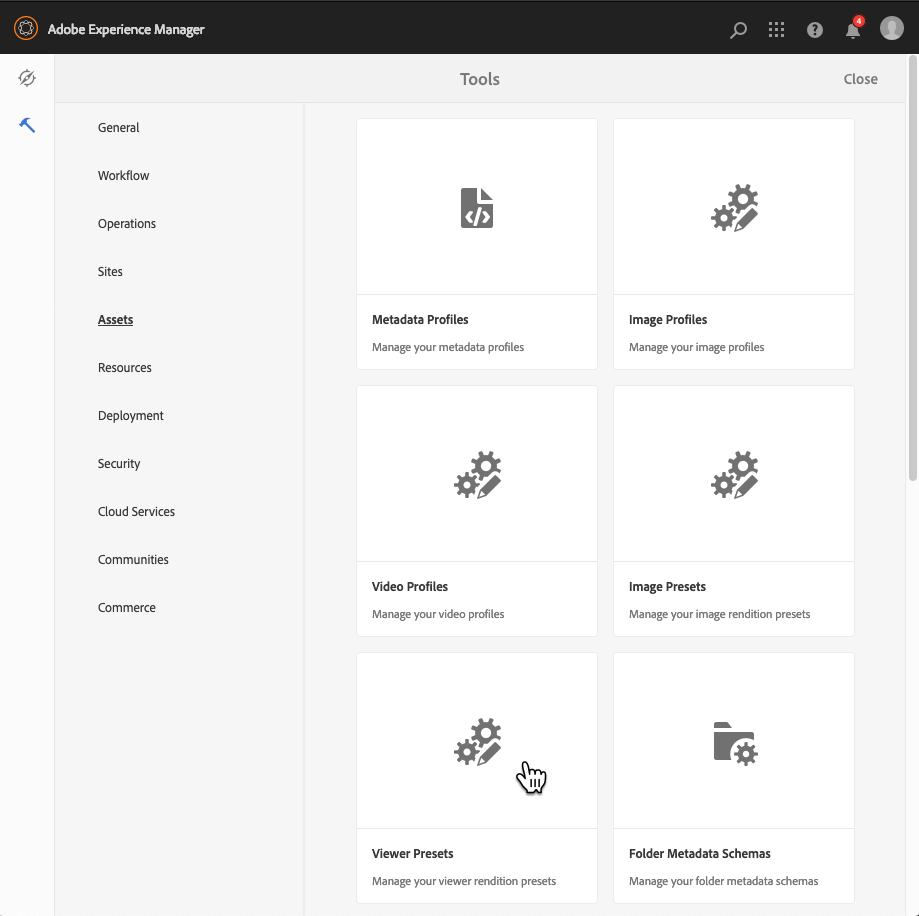

# 管理查看器預設{#managing-viewer-presets}

查看器預設是一組設定，用於確定用戶如何在其電腦螢幕和移動設備上查看富媒體資產。 如果您是管理員，則可以建立查看器預設。 設定可用於查看器配置選項的陣列。 例如，可以更改查看器顯示大小或縮放行為。

<!-- OBSOLETE SDK withdrawn from public view. Available internally only at `http://staging.scene7.com/s7sdk/3.8/docs/jsdoc/symbols/_s7sdk.html` 

For instructions on creating and customizing your own HTML5 viewer presets, see the *Adobe Scene7 HTML5 Viewer SDK*. The SDK is available on the IS publish server embedded in the SDK itself. Each library version has its own SDK documentation included.

Path: `<scene7_domain>/s7sdk/<library_version>/docs/jsdocs/index.html`.
For example, 3.5 SDK: [https://s7d1.scene7.com/s7sdk/3.5/docs/jsdoc/index.html](https://s7d1.scene7.com/s7sdk/3.5/docs/jsdoc/index.html)

-->

另請參閱 [Dynamic Media觀眾參考指南](https://experienceleague.adobe.com/docs/dynamic-media-developer-resources.html)。

本節介紹如何建立、編輯和管理查看器預設。 您可以隨時將查看器預設應用於資產。 請參閱 [應用查看器預設](#applying-a-viewer-preset-to-an-asset)。

>[!NOTE]
>
>編輯任意 *預定義的現成查看器預設* 不是支援的方案。 如果嘗試編輯現成查看器預設，系統會提示您使用新名稱保存查看器預設。

## 查看器的鍵盤輔助功能 {#keyboard-accessibility-for-viewers}

所有出廠設定查看器都支援鍵盤輔助功能。

另請參閱 [鍵盤輔助功能和導航](https://experienceleague.adobe.com/docs/dynamic-media-developer-resources/library/c-keyboard-accessibility.html)。

## 管理查看器預設 {#managing-viewer-presets-1}

通過導航到Adobe Experience Manager，可以添加、編輯、刪除、發佈、取消發佈和預覽查看器預設 **[!UICONTROL 工具]** （錘子表徵圖）> **[!UICONTROL 資產] > [!UICONTROL 查看器預設]**。

>[!NOTE]
>
>預設情況下，在資產的詳細資訊視圖中選擇「查看器」時，系統會顯示15個查看器預設。 您可以提高此限制。請參閱 [增加顯示的查看器預設數](#increasing-the-number-of-viewer-presets-that-display)。

### 對響應性設計的網頁的查看器支援 {#viewer-support-for-responsive-designed-web-pages}

不同的網頁有不同的需求。 例如，有時您需要一個提供連結的網頁，該連結在單獨的瀏覽器窗口中開啟HTML5查看器。 在其它情況下，需要將HTML5查看器直接嵌入到托管頁面。 在後一種情況下，網頁具有靜態佈局。 或者，它「響應」，在不同設備上或不同瀏覽器窗口大小時顯示不同。 為滿足這些需求，Dynamic Media隨附的所有預定義的開箱即用HTML5查看器都支援靜態網頁和響應性設計的網頁。

請參閱 [響應靜態映像庫](https://experienceleague.adobe.com/docs/dynamic-media-developer-resources/image-serving-api/image-serving-api/responsive-static-image-library/c-about-responsive-static-image-library.html#about-responsive-image-library) 的 *Dynamic Media影像服務和呈現API幫助* 的子菜單。

>[!NOTE]
>
>在首次使用所有現成查看器之前，先發佈所有現成查看器。
>請參閱 [發佈查看器預設](#publishing-viewer-presets)。

### 查看器預設系統相容性  {#viewer-preset-system-compatibility}

Dynamic Media附帶的所有現成查看器預設都與以下系統完全相容：

* 台式機
* AppleiPhone
* AppleiPad
* Android™智慧手機
* Android™平板電腦

<!-- OUTDATED 2/25/22 * For video, extra support for MP4 playback is provided for [BlackBerry®](https://developer.blackberry.com/devzone/develop/supported_media/bb_media_support_at_a_glance.html#kba1328730952678) and [Windows® Phone](https://docs.microsoft.com/en-us/windows/uwp/audio-video-camera/supported-codecs). -->

### 查看器預設的富媒體類型 {#rich-media-types-for-viewer-presets}

管理員在建立查看器預設時可以添加和自定義以下富媒體類型。

<table>
 <tbody>
  <tr>
   <td><strong>傳送集</strong>  </td>
   <td>
熱點或影像映射，或兩者都添加到一系列兩個或多個影像中。 客戶可以向左或向右平移影像，然後在影像上選擇一個熱點，以瞭解更多詳細資訊或直接從網站的登錄、類別或首頁購買。
 </td>
  </tr>
    <tr>
   <td><strong>維度</strong>  </td>
   <td>
顯示3D場景，讓您可以旋轉、平移、縮放或重新輸入相機。
 </td>
  </tr>
  <tr>
   <td><strong>彈出式縮放</strong></td>
   <td>
在原始影像旁邊顯示縮放區域的第二影像。 沒有要使用的控制項 — 用戶將所選內容移到要查看的區域上。
 
確定此查看器的完整頻寬使用時，請考慮主影像和浮出影像都在查看器中提供。 主影像大小（階段寬度和高度）和縮放因子決定了飛出影像大小。 要防止浮出檔案大小變得過大，請平衡以下兩個值：如果主影像大小較大，請降低「縮放因子」值。 (「浮出寬度」(Flyout Width)和「浮出高度」(Flyout Height)確定浮出窗口的大小，但不確定提供給查看器的浮出影像的大小。)
 
例如，如果主影像大小為350 x 350像素，且「縮放因子」為3，則生成的浮出影像為1050 x 1050像素。 如果主影像大小為300 x 300像素，且「縮放因子」為4，則浮出影像為1200 x 1200像素。 根據JPEG質量設定（建議的設定介於80到90之間），您可以顯著減小檔案大小。 建議的縮放系數為2.5到4，具體取決於主影像的大小。
 </td>
  </tr>
  <tr>
   <td><strong>內聯縮放</strong></td>
   <td>顯示原始查看器中縮放區域的影像。 沒有可使用的控制項。 即，用戶將所選內容移到要查看的區域。</td>
  </tr>
  <tr>
   <td><strong>影像集</strong></td>
   <td>在「影像集」查看器中，用戶可以通過選擇縮略圖來查看項目的不同視圖或顏色變化。 此查看器還提供了用於仔細檢查影像的縮放工具。</td>
  </tr>
  <tr>
   <td><strong>互動影像</strong></td>
   <td>熱點會添加到影像的部分，然後客戶可以選擇這些部分以獲取更多詳細資訊或直接從網站的登錄、類別或首頁購買。</td>
  </tr>
  <tr>
   <td><strong>互動視訊</strong></td>
   <td>縮略圖會添加到視頻中的時間軸段，然後客戶可以選擇這些段以獲取更多詳細資訊或直接從網站的登錄頁、類別或首頁購買。</td>
  </tr>
  <tr>
   <td><strong>混合媒體</strong></td>
   <td>在一個查看器中顯示不同類型的媒體。 可以包括旋轉集、影像集、影像和視頻。</td>
  </tr>
  <tr>
   <td><strong>全景影像</strong></td>
   <td>
全景影像和全景VR觀看器可呈現球形全景影像，讓用戶沈浸在360°的房間、房產、位置或景觀的觀看體驗中。
 
要將上載的影像限定為球形全景圖，它必須具有以下任一或兩者：

    <ul>
     <li>寬高比為2:1。</li>
     <li>用關鍵字標籤 <code>equirectangular</code>或 <code>spherical</code> 和 <code>panorama</code>或 <code>spherical </code>和 <code>panoramic</code>。 請參閱 <a href="/help/sites-cloud/authoring/features/tags.md">使用標籤</a>。</li>
    </ul> 
縱橫比和關鍵字條件都適用於資產詳細資訊頁面和「全景媒體」 WCM元件的全景資產。
</td>
  </tr>
    <tr>
   <td><strong>智慧型裁切視訊</strong>  </td>
   <td>
使用此查看器可自動檢測並裁剪到任何視頻中的焦點。
 </td>
  </tr>
  <tr>
   <td><strong>迴轉集</strong></td>
   <td>提供影像的多個視圖，以便用戶可以旋轉對象以檢查不同的側面和角度。</td>
  </tr>
  <tr>
   <td><strong>360視頻</strong></td>
   <td>
使用360/VR視頻查看器可以呈現等長形視頻，讓您在房間、房產、位置、景觀或醫療程式中體驗身臨其境的觀看體驗。
 
在平面顯示器上回放期間，用戶控制視角。 在移動設備上播放時使用其內置的陀螺控制。
 
觀眾包括對360個視頻資產的本機支援。 預設情況下，查看或回放不需要其他配置。 使用標準視頻擴展(如.mp4、.mkv和.mov)提供360視頻。 最常見的編解碼器是H.264。
 </td>
  </tr>
  <tr>
   <td><strong>影片</strong></td>
   <td>
使用逐行或自適應比特率流播放視頻。 自適應比特率流自動執行設備和頻寬檢測以以適當的格式提供適當質量的視頻。
 </td>
  </tr>
  <tr>
   <td><strong>垂直縮放</strong></td>
   <td>
「垂直縮放」查看器使您能夠最大限度地提高產品影像的查看體驗，從而為用戶提供產品的最佳表現。 色板的垂直位置執行以下操作：

    <ul>
     <li>確保色板「位於折線上方」。  使用水準色板（取決於用戶的案頭螢幕大小），在用戶向下滾動頁面之前，色板不可見。 通過將色板垂直放置在查看器中，它可確保無論用戶的螢幕大小如何都可見。</li>
     <li>最大化主映像大小。  使用水準色板，必須在頁面上保留空間，以確保它們可見。 此定位縮小了主影像的大小。 但是，使用垂直色板佈局時，不需要分配此空間。 因此，可以最大化主影像大小。</li>
    </ul> </td>
  </tr>
  <tr>
   <td><strong>縮放</strong></td>
   <td>允許用戶通過選擇區域來放大區域。 用戶可以選擇控制項以放大、縮小影像並將影像重置為其預設大小。</td>
  </tr>
 </tbody>
</table>

### 現成查看器預設清單 {#list-of-out-of-the-box-viewer-presets}

下表標識了隨Dynamic Media提供的所有預定義的現成查看器預設。

另請參閱 [現場演示](https://landing.adobe.com/tw/na/dynamic-media/ctir-2755/live-demos.html)。

有關Viewer支援的Web瀏覽器和作業系統版本的資訊，可以查看Viewers發行說明。

請參閱目錄中的「查看器發行說明」 [查看器參考指南](https://experienceleague.adobe.com/docs/dynamic-media-developer-resources.html)。

>[!NOTE]
>
>Dynamic Media的所有現成查看器預設都已激活（開啟），但必須發佈這些預設。
>請參閱 [發佈查看器預設](#publishing-viewer-presets)。
>
>您建立和添加的任何新查看器預設必須同時激活*和*已發佈。
>請參閱 [激活或停用查看器預設](#activating-or-deactivating-viewer-presets) 和 [發佈查看器預設](#publishing-viewer-presets)。

<table>
 <tbody>
  <tr>
   <td><strong>查看器預設標題</strong></td>
   <td><strong>類型</strong></td>
   <td><strong>CSS 檔案名稱</strong>  </td>
  </tr>
  <tr>
   <td>旋轉軸虛線深色</td>
   <td>旋轉軸集</td>
   <td><code>html5_carouselviewer_dotted_dark.css</code></td>
  </tr>
  <tr>
   <td>旋轉軸點光</td>
   <td>旋轉軸集</td>
   <td><code>html5_carouselviewer_dotted_light.css</code></td>
  </tr>
  <tr>
   <td>旋轉軸_數字_暗</td>
   <td>旋轉軸集</td>
   <td><code>html5_carouselviewer_numeric_dark.css</code></td>
  </tr>
  <tr>
   <td>旋轉軸_數字_光</td>
   <td>旋轉軸集</td>
   <td><code>html5_carouselviewer_numeric_light.css</code></td>
  </tr>
  <tr>
   <td>飛出</td>
   <td>浮動(_Z)</td>
   <td><code>html5_flyoutviewer.css</code></td>
  </tr>
  <tr>
   <td>影像集(_D)</td>
   <td>影像集</td>
   <td><code>html5_zoomviewer_dark.css</code></td>
  </tr>
  <tr>
   <td>ImageSet_light</td>
   <td>影像集</td>
   <td><code>html5_zoomviewer_light.css</code></td>
  </tr>
  <tr>
   <td>InlineMixedMedia_dark</td>
   <td>混合媒體</td>
   <td><code>html5_inlinemixedmediaviewer_dark.css</code></td>
  </tr>
  <tr>
   <td>InlineMixedMedia_light</td>
   <td>混合媒體</td>
   <td><code>html5_inlinemixedmediaviewer_light.css</code></td>
  </tr>
  <tr>
   <td>內聯縮放</td>
   <td>浮動(_Z)</td>
   <td><code>html5_inlinezoomviewer.css</code></td>
  </tr>
  <tr>
   <td>混合媒體_dark</td>
   <td>混合媒體</td>
   <td><code>html5_mixedmediaviewer_dark.css</code></td>
  </tr>
  <tr>
   <td>混合媒體_light</td>
   <td>混合媒體</td>
   <td><code>html5_mixedmediaviewer_light.css</code></td>
  </tr>
  <tr>
   <td>全景影像</td>
   <td>全景影像</td>
   <td><code>html5_panoramicimage.css</code></td>
  </tr>
  <tr>
   <td>全景影像VR</td>
   <td>全景影像</td>
   <td><code>html5_panoramicimage.css</code></td>
  </tr>
  <tr>
   <td>可購物橫幅</td>
   <td>互動式影像</td>
   <td><code>html5_interactiveimage.css</code></td>
  </tr>
  <tr>
   <td>可購物_視頻_暗</td>
   <td>互動式視頻</td>
   <td><code>html5_interactivevideoviewer_dark.css</code></td>
  </tr>
  <tr>
   <td>可購物視頻輕</td>
   <td>互動式視頻</td>
   <td><code>html5_interactivevideovewer_light.css</code></td>
  </tr>
  <tr>
   <td>自旋集_dark</td>
   <td>旋轉集</td>
   <td><code>html5_spinviewer_dark.css</code></td>
  </tr>
  <tr>
   <td>旋轉集_light</td>
   <td>旋轉集</td>
   <td><code>html5_spinviewer_light.css</code></td>
  </tr>
  <tr>
   <td>
影片
 
（包括對字幕的支援）
 </td>
   <td>影片</td>
   <td><code>html5_videoviewer.css</code></td>
  </tr>
  <tr>
   <td>
Video360_social
 
（包括基本視頻播放控制項，視頻渲染以立體模式完成，手動視點控制項關閉，但陀螺儀控制項開啟，且沒有社交媒體功能）
 </td>
   <td>視頻_360</td>
   <td><code>html5_video360viewersocial.css</code></td>
  </tr>
  <tr>
   <td>
Video360VR
 
(專為使用虛擬現實眼鏡的最終用戶設計。 包括基本視頻播放控制項和社交媒體功能)
 </td>
   <td>視頻_360</td>
   <td><code>html5_video360viewer.css</code></td>
  </tr>
  <tr>
   <td>
視頻_社交
 
（包括對字幕和社交媒體的支援）
 </td>
   <td>影片</td>
   <td><code>html5_videoviewersocial.css</code></td>
  </tr>
  <tr>
   <td>縮放(_D)  </td>
   <td>縮放  </td>
   <td><code>html5_basiczoomviewer_dark.css</code></td>
  </tr>
  <tr>
   <td>縮放(_L)  </td>
   <td>縮放</td>
   <td><code>html5_basiczoomviewer_light.css</code></td>
  </tr>
  <tr>
   <td>縮放垂直深暗  </td>
   <td>垂直縮放</td>
   <td><code>html5_zoomverticalviewer_dark.css</code></td>
  </tr>
  <tr>
   <td>縮放垂直光</td>
   <td>垂直縮放</td>
   <td><code>html5_zoomverticalviewer_light.css</code></td>
  </tr>
 </tbody>
</table>

### 支援的移動觀眾手勢矩陣 {#supported-mobile-viewers-gestures-matrix}

下表列出了iOS、Android™ 2.x和Android™ 3.x設備支援的移動查看器手勢。

<table>
 <tbody>
  <tr>
   <td><strong>手勢</strong></td>
   <td><strong>彈出式縮放</strong></td>
   <td><strong>縮放</strong></td>
   <td><strong>迴轉</strong></td>
  </tr>
  <tr>
   <td>
<strong>拖動</strong>
 </td>
   <td>
潘
 </td>
   <td>
潘
 </td>
   <td>
潘
 </td>
  </tr>
  <tr>
   <td>
<strong>點擊</strong>
 </td>
   <td>
顯示彈出窗口
 </td>
   <td>
顯示或隱藏用戶介面
 </td>
   <td>
顯示或隱藏用戶介面
 </td>
  </tr>
  <tr>
   <td>
<strong>按兩下</strong>
 </td>
   <td>
不適用
 </td>
   <td>
放大或重置
 </td>
   <td>
放大或重置
 </td>
  </tr>
  <tr>
   <td>
<strong>捏開</strong>
 </td>
   <td>
不適用
 </td>
   <td>
放大(僅限iOS和Android™ 3x)
 </td>
   <td>
放大(僅限iOS和Android™ 3x)
 </td>
  </tr>
  <tr>
   <td>
<strong>捏合閉合</strong>
 </td>
   <td>
不適用
 </td>
   <td>
放大(僅限iOS和Android™ 3x)
 </td>
   <td>
放大(僅限iOS和Android™ 3x)
 </td>
  </tr>
  <tr>
   <td>
<strong>撥動</strong>
 </td>
   <td>
滾動色板條
 </td>
   <td>
滾動影像
 </td>
   <td>
自旋
 </td>
  </tr>
  <tr>
   <td>
<strong>弗利克</strong>
 </td>
   <td>
滾動色板條
 </td>
   <td>
滾動影像
 </td>
   <td>
自旋
 </td>
  </tr>
 </tbody>
</table>

## 增加顯示的查看器預設數 {#increasing-the-number-of-viewer-presets-that-display}

Experience Manager在從中查看資產時顯示多種查看器預設 **[!UICONTROL 詳細資訊視圖]** > **[!UICONTROL 查看者]**。 可以增加或減少顯示的查看器數。

**要增加顯示的查看器預設數：**

1. 導航到CRXDE Lite([https://localhost:4502/crx/de](https://localhost:4502/crx/de))。
1. 導航到位於的查看器預設清單節點 `/libs/dam/gui/coral/content/commons/sidepanels/viewerpresets/viewerpresetslist`

   

1. 在 **[!UICONTROL limit]** 屬性中，將預設設 ****&#x200B;定為15的值變更為所要的數字。
1. 導航到位於的查看器預設資料源 `/libs/dam/gui/coral/content/commons/sidepanels/viewerpresets/viewerpresetslist/datasource`

   

1. 在limit屬性中，將數字更改為所需的數字，例如 `{empty requestPathInfo.selectors[1] ? "20" : requestPathInfo.selectors[1]}`
1. 選擇 **[!UICONTROL 全部保存]**。

## 建立查看器預設 {#creating-a-new-viewer-preset}

建立查看器預設允許您應用各種設定來查看和與資產交互。 但是，您不需要建立查看器預設。 如果您願意，可以使用已隨Experience Manager Assets附帶的預設現成查看器預設。

如果選擇建立查看器預設，則在保存後，將自動激活查看器的狀態(設定為 **[!UICONTROL 開]**)。 此狀態表示在Dynamic Media元件和互動式媒體元件中以及在您預覽影像或視頻時都可看到它。

某些查看器預設具有排他性設定，這些設定可能影響查看器的使用和整體行為。 根據您建立的查看器預設，您需要瞭解這些特殊注意事項。

請參閱 [建立互動式查看器預設的特殊注意事項](#special-considerations-for-creating-an-interactive-viewer-preset)。

請參閱 [建立Carousel Banner Viewer預設的特殊注意事項](#special-considerations-for-creating-a-carousel-banner-viewer-preset)。

**要建立查看器預設：**

1. 在Experience Manager的左上角，選擇Experience Manager徽標，然後在左滑軌中，轉到 **[!UICONTROL 工具]** （錘子表徵圖）> **[!UICONTROL 資產]** > **[!UICONTROL 查看器預設]**。

   

1. 在「查看器預設」頁面的工具欄上，選擇 **[!UICONTROL 建立]**。
1. 在 **[!UICONTROL 新建查看器預設]** 對話框 **[!UICONTROL 預設名稱]** 欄位，輸入新預設的名稱。 仔細選擇名稱 — 在選擇後，這些名稱不可編輯 **[!UICONTROL 建立]**。

   稍後在這些步驟中保存預設時，該名稱將顯示在「查看器預設」頁面的「預設標題」列標題下。

1. 在「富媒體類型」下拉菜單中，選擇要建立的查看器預設的類型，然後在頁面右上角選擇 **[!UICONTROL 建立]**。

   請參閱 [查看器預設的富媒體類型](#rich-media-types-for-viewer-presets)。

1. 在「查看器預設編輯器」頁面上，選擇 **[!UICONTROL 外觀]** 頁籤。
1. 執行下列操作之一：

   * 在 **[!UICONTROL 所選類型]** 下拉菜單，選擇要自定義其可視設計的元件。 或者，可以在查看器中選擇任何可視元素以將其選中進行配置。

      可視編輯器允許您查看某個屬性對樣式有何影響。 設定或調整任何屬性，以便使用編輯器左側的示例立即查看它對查看器的影響。

      「定制」中介紹了每種類型的查看器預設的CSS樣式屬性 *`<viewer name>`* 查看器中的幫助主題 [查看器參考指南](https://experienceleague.adobe.com/docs/dynamic-media-developer-resources.html)。 例如，如果要建立類型的查看器預設 `Mixed_Media`，請參閱 [自定義混合媒體查看器](https://experienceleague.adobe.com/docs/dynamic-media-developer-resources/library/viewers-aem-assets-dmc/mixed-media/customing-mixed-media/c-html5-mixedmedia-viewer-customizingviewer.html) 的子菜單。

   * 如果在單獨的CSS檔案中定義了樣式設定，則可以將CSS檔案上載到Experience Manager Assets。 要查找上載的CSS檔案並將其與查看器預設關聯，請選擇 **[!UICONTROL 導入CSS]** 下方 **[!UICONTROL 所選類型]** 下拉菜單（如有必要，向上滾動可視編輯器以查看它）。

      導入CSS檔案時，可視編輯器會檢查CSS是否使用了正確的查看器標籤。 例如，如果要建立縮放查看器，則必須使用其查看器類名定義導入的所有CSS規則 `.s7mixedmediaviewer` 在父查看器元素上定義。

      只要正確定義給定查看器的CSS標籤，就可以導入任意手工CSS。 (CSS標籤在任何「自定義」 *&lt;viewer name=&quot;&quot;>* 查看器中的幫助主題 [查看器參考指南](https://experienceleague.adobe.com/docs/dynamic-media-developer-resources.html)。 例如，如果要閱讀有關縮放查看器的CSS標籤，請參見 [自定義縮放查看器](https://experienceleague.adobe.com/docs/dynamic-media-developer-resources/library/viewers-aem-assets-dmc/zoom/customizing-zoom/c-html5-20-zoom-viewer-customizingviewer.html)。) 但是，可視編輯器可能不理解某些CSS值。 在這種情況下，可視編輯器會嘗試覆蓋錯誤，以便CSS仍能工作。
   >[!NOTE]
   >
   >如果希望直接以原始格式編輯CSS，請選擇 **[!UICONTROL 顯示/隱藏CSS]** 在「選定類型」下拉菜單下（如有必要，向上滾動可視編輯器以查看它）。
   >與可視編輯器一樣，當您直接在CSS中更改屬性時，您可以立即查看它對查看器示例的影響。 而且，同一屬性會在可視編輯器中同時自動更新。 因此，您可以使用原始CSS編輯器或可視編輯器，或者兩者交替使用。

   >[!NOTE]
   >
   >對於按鈕圖稿，選擇2x影像並上傳高解析度藝術作品。 使用互動式影像和可購物的橫幅時，您還可以從各種現成熱點按鈕中進行選擇。

1. （可選）在「編輯查看器預設」頁面頂部附近，選擇 **[!UICONTROL 案頭]**。 **[!UICONTROL 平板電腦]**&#x200B;或 **[!UICONTROL 電話]** 以為不同的設備和螢幕類型唯一定義可視樣式。
1. 在「查看器預設編輯器」頁面上，選擇 **[!UICONTROL 行為]** 頁籤。 或者，可以在查看器中選擇任何可視元素以將其選中進行配置。
1. 從「選 **[!UICONTROL 定類型]** 」(Selected Type)下拉菜單中，選擇要更改其行為的元件。

   可視編輯器中的許多元件都有與其關聯的詳細說明。 展開元件以顯示其關聯參數時，這些說明會顯示在藍色框中。

   有些檢視器類型具有可讓您在「 **[!UICONTROL IS Command」 (IS命令) 文字欄位中指定「Image Serving]** 」 (影像伺服) 命令的元件。如需您可使用的指令清單，請參 [閱影像伺服API參考](https://experienceleague.adobe.com/docs/dynamic-media-developer-resources/image-serving-api/image-serving-api/c-is-home.html)。

   >[!NOTE]
   >
   >**如果你在使用觸摸設備，如電話或平板電腦……**
   >
   >
   >在文本欄位中鍵入值後，請在用戶介面的其他位置選擇以提交更改並關閉虛擬鍵盤。 如果選擇 **[!UICONTROL 輸入]**，不執行任何操作。

1. 在頁面右上角附近，選擇 **[!UICONTROL 保存]**。
1. 發佈新查看器預設。 必須先發佈預設，然後才能在您的網站上使用它。

   請參閱 [發佈查看器預設](#publishing-viewer-presets)。

### 建立互動式查看器預設的特殊注意事項 {#special-considerations-for-creating-an-interactive-viewer-preset}

**關於面板中影像縮略圖的顯示模式：**

建立或編輯互動式視頻查看器預設時，可以選擇使用哪種「顯示模式」設定。 當您選擇 `InteractiveSwatches` 從 **[!UICONTROL 所選元件]** 下面的下拉菜單 **[!UICONTROL 行為]** 頁籤。 您選擇的「顯示」模式會影響縮圖在視訊播放時的顯示方式和時間。您可以選擇「顯 `segment`示」模式 (預設) 或「顯 `continuous` 示」模式。

<table>
 <tbody>
  <tr>
   <td><strong>顯示模式</strong></td>
   <td><strong>說明</strong></td>
  </tr>
  <tr>
   <td>區段</td>
   <td>
<code>Segment </code>是現成Interactive Video Viewer預設的預設顯示模式 <code>Shoppable_Video_light</code> 和 <code>Shoppable_Video_dark</code> 以及您自己建立的任何Interactive Video Viewer預設。
 
在此模式下，假設分配給視頻段的縮略圖數少於顯示面板中可見點數。 在這種情況下，下一個或上一個子段的縮略圖 <i>不 </i>拉進來填充面板中的空點。 即，它保留分配給特定視頻段的色板的顯示。
 </td>
  </tr>
  <tr>
   <td>連續</td>
   <td>
在 <code>continuous </code>顯示模式，假設段中縮略圖的數量小於面板中可見的數量。 在這種情況下，查看器自動包括顯示下一段或上一段的縮略圖，其中顯示最後一段縮略圖。
 
的 <a href="/help/assets/dynamic-media/interactive-videos.md">本主題的視頻</a> 是 <code>continuous </code>顯示模式。
 </td>
  </tr>
 </tbody>
</table>

**關於互動式視頻查看器中的自動滾動行為：**

交互視頻查看器中縮略圖的自動滾動行為與所選顯示模式無關。

當您建立或編輯互動式視訊檢視器預設集時，可從「行為」標籤存取「自動捲動」。在「行為」(Behavior)頁籤中， **[!UICONTROL 所選元件]** 下拉菜單，選擇 **[!UICONTROL 交互色板]**。 「自動捲動」(Auto Scroll)複選框列在「IS命令」(IS Command)文本欄位下。

如果您在檢視器預設集中停用「自動捲動 **** 」 (清除核取方塊)，當使用者播放視訊時，面板只會顯示整個視訊長度的第一個縮圖影像。不過，使用者可視需要使用向上和向下箭頭圖示手動捲動縮圖。

當您在檢視器預設集中啟用 (選取) 「自動捲動 **** 」時，在視訊播放期間，指派給視訊區段的縮圖影像會在區段開始時捲動至檢視中。但是，有些例項會顯示區段中某些縮圖的長度，是其前後縮圖的兩倍。發生此行為是因為區段中的縮圖數目大於面板中顯示的數目，且不可平均分割。

為了說明問題，假設您有一個30秒的視頻段。 在30秒內總共有9個縮略圖要顯示。 您的瀏覽器的大小決定了在顯示面板中有四個可見縮略圖位置。 30秒視頻時間段分為三個子段。 下表顯示了給定時間子段顯示縮略圖的細目：

| **視頻子段** | **子段時間（秒）** | **在面板中可見的縮略圖** |
|---|---|---|
| 1 | 0-10 | 1、2、3、4 |
| 2 | 十至二十 | 4、5、6、7 |
| 3 | 20-30 | 6、7、8、9 |

視頻子段3不會擴展到分配給它的縮略圖之外。 另請注意，縮略圖4、6和7在面板中的可見時間是其他縮略圖的兩倍。

查看器根據可用位置的數量在面板中顯示多少縮略圖所使用的邏輯如下：

* 子段數=向上捨入到下一個子段（縮略圖數/縮略圖面板中可見插槽數，基於瀏覽器窗口大小）。
使用上表中的示例，9個縮略圖/4個插槽= 2.25;查看器邏輯將其捨入為三個子段。

* 縮略圖數=向上捨入到下一個縮略圖（縮略圖數/視頻子段數）。
使用上表中的示例，9個縮略圖/3個視頻子段= 3個縮略圖。

* 子段的持續時間=總視頻持續時間/視頻子段數。
使用上表中的示例， 30秒/ 3個視頻子段=每個視頻子段的10秒顯示。

#### 建立Carousel Banner查看器預設的特殊注意事項 {#special-considerations-for-creating-a-carousel-banner-viewer-preset}

建立Carousel Banner查看器預設時，可以按如下方式訪問更改熱點的樣式：

|  | **說明** | **動作** |
|---|---|---|
| **[!UICONTROL 熱點表徵圖]** | 更改用於熱點的表徵圖 | 要更改熱點表徵圖影像，請在 **[!UICONTROL 外觀]** 中 **[!UICONTROL 所選元件]**&#x200B;選中 **[!UICONTROL 影像映射效果]**。 下 **[!UICONTROL 表徵圖]**&#x200B;選中 **[!UICONTROL 背景]** 在 **[!UICONTROL 影像]** 欄位導航到所需的背景影像。 |

## 激活或停用查看器預設 {#activating-or-deactivating-viewer-presets}

用戶介面中可用的查看器預設取決於在「作者」模式下哪些預設處於活動狀態。 預設情況下，建立查看器預設後，該預設為「開啟」。 如果關閉預設，則在「作者」模式下看不到預設。 如果發佈預設，則無論其是開啟還是關閉，都始終發佈預設。 如果清單變得太笨重，或者您不希望讓查看器預設可用，則停用查看器預設。

**要激活或停用查看器預設，請執行以下操作：**

1. 在Experience Manager的左上角，選擇Experience Manager徽標，然後在左滑軌中，選擇 **[!UICONTROL 工具]** （錘子表徵圖）> **[!UICONTROL 資產]** > **[!UICONTROL 查看器預設]**。
1. 在「查看器預設」頁面上，在 **[!UICONTROL 州]** 列標題，選擇切換以激活或停用查看器預設。

   激活的查看器預設使切換出現在藍色框的右側；停用的查看器預設使切換出現在左側，位於淺灰色框內。

## 發佈查看器預設 {#publishing-viewer-presets}

激活（或開啟「開啟」）查看器預設狀態意味著它在Dynamic Media元件、互動式媒體元件中以及在您查看資產時都可見。

但是， *送* 具有查看器預設的資產，也必須發佈查看器預設。 必須激活所有查看器預設 *和* 已發佈以獲取資產的URL或嵌入代碼。 激活並發佈隨Dynamic Media提供的所有現成查看器預設。 您建立和新增的自訂檢視器預設集會自動啟動，但也必須發佈。

請參閱 [激活或停用查看器預設](#activating-or-deactivating-viewer-presets)。

另請參閱 [預覽資產](/help/assets/dynamic-media/previewing-assets.md)。

**要發佈查看器預設：**

1. 在Experience Manager的左上角，選擇Experience Manager徽標，然後在左滑軌中，選擇 **[!UICONTROL 工具]** （錘子表徵圖）> **[!UICONTROL 資產] > [!UICONTROL 查看器預設]**。
1. 選擇要發佈的一個或多個查看器預設。
1. 在工具欄上，選擇 **[!UICONTROL 發佈]** 表徵圖

## 對查看器預設排序 {#sorting-viewer-presets}

1. 在Experience Manager的左上角，選擇Experience Manager徽標，然後在左滑軌中，選擇 **[!UICONTROL 工具]** （錘子表徵圖）> **[!UICONTROL 資產] > [!UICONTROL 查看器預設]**。
1. 選擇 **[!UICONTROL 預設標題]**。 **[!UICONTROL 類型]**。 **[!UICONTROL 已發佈]**&#x200B;或 **[!UICONTROL 州]** 按列標題排序。 例如，選擇 **[!UICONTROL 類型]**  按字母順序或反字母順序對查看器預設類型進行排序。

## 編輯查看器預設 {#editing-viewer-presets}

編輯任意 *預定義的現成查看器預設* 不是支援的方案。 如果編輯現成查看器預設，系統將提示您使用新名稱保存。

**要編輯查看器預設：**

1. 在Experience Manager的左上角，選擇Experience Manager徽標，然後在左滑軌中，選擇 **[!UICONTROL 工具]** （錘子表徵圖）> **[!UICONTROL 資產]** > **[!UICONTROL 查看器預設]**。
1. 通過選中查看器預設標題左側的框來選擇預設。
1. 在工具欄上，選擇 **[!UICONTROL 編輯]**。
1. 在 **[!UICONTROL 查看器預設編輯器]** 的子菜單。 **[!UICONTROL 外觀]** 和 **[!UICONTROL 行為]** 頁籤。

   從 **[!UICONTROL 外觀]** 頁籤，在「查看器預設編輯器」頁的左上角附近，選擇 **[!UICONTROL 案頭]**。 **[!UICONTROL 平板電腦]**&#x200B;或 **[!UICONTROL 電話]** 的子菜單。

1. 在頁面的右上角，執行下列操作之一：

   * 選擇 **[!UICONTROL 保存]** 以保存更改並返回「查看器預設」頁。
   * 選擇 **[!UICONTROL 取消]** 撤消您所做的任何更改並返回到「查看器預設」頁。

## 刪除自定義查看器預設 {#deleting-custom-viewer-presets}

您可以刪除已建立並添加到Dynamic Media的查看器預設。

**要刪除自定義查看器預設，請執行以下操作：**

1. 在Experience Manager的左上角，選擇Experience Manager徽標，然後在左滑軌中，選擇 **[!UICONTROL 工具]** （錘子表徵圖）> **[!UICONTROL 資產] > [!UICONTROL 查看器預設]**。
1. 在「查看器預設」頁面上，選中「預設標題」，然後選擇 **[!UICONTROL 垃圾]** 表徵圖
1. 選擇 **[!UICONTROL 刪除]**。

## 將查看器預設應用於資產 {#applying-a-viewer-preset-to-an-asset}

如果您已發佈資產和選取的檢視器， **[!UICONTROL URL]** 和 **[!UICONTROL Embed]**  (內嵌) 按鈕會在您選取檢視器預設集後顯示。

**要將查看器預設應用於資產：**

1. 開啟資產並靠近頁面左上角，選擇下拉菜單，然後選擇 **[!UICONTROL 查看者]**。

   >[!NOTE]
   >
   >如果您已發佈資產和選取的檢視器， **[!UICONTROL URL]** 和 **[!UICONTROL Embed]**  (內嵌) 按鈕會在您選取檢視器預設集後顯示。

1. 要將其應用於資產，請從左窗格中選擇一個查看器預設。

   你可以 [複製要共用的URL](/help/assets/dynamic-media/linking-urls-to-yourwebapplication.md) 與其他用戶。

## 使用查看器預設交付資產 {#delivering-assets-with-viewer-presets}

要獲取查看器預設的URL，請參見 [將URL連結到Web應用程式](/help/assets/dynamic-media/linking-urls-to-yourwebapplication.md)。 另請參閱 [將視頻查看器嵌入網頁](/help/assets/dynamic-media/embed-code.md)。

如果將Experience Manager用作WCM，則可以使用頁面上的查看器預設直接添加資產。 請參閱 [將Dynamic Media資產添加到頁面](/help/assets/dynamic-media/adding-dynamic-media-assets-to-pages.md)。
