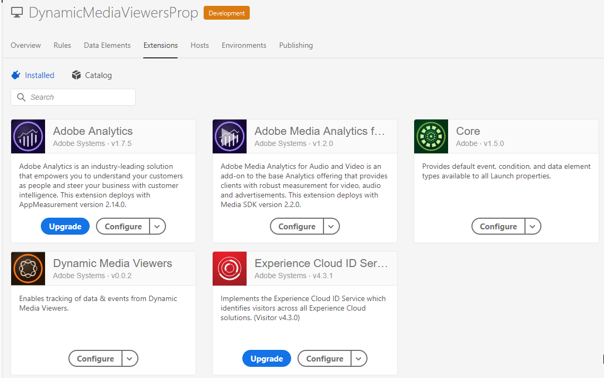
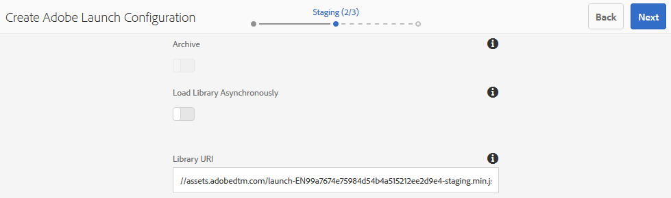

# 將Dynamic Media觀眾與Adobe Analytics和Experience Platform標籤整合 {#integrating-dynamic-media-viewers-with-adobe-analytics-and-adobe-launch}

## 什麼是Dynamic Media觀眾與Adobe Analytics和Experience Platform標籤的整合？ {#what-is-dynamic-media-viewers-integration-with-adobe-analytics-and-adobe-launch}

<!-- Leave this hidden path here; it points to the topic source from Sasha https://wiki.corp.adobe.com/pages/viewpage.action?spaceKey=~oufimtse&title=Dynamic+Media+Viewers+integration+with+Adobe+Launch 

name used to be Experience Platform Launch. Changed to Experience Platform Data Collection-->

*Dynamic Media觀眾* 「Experience Platform標籤」和「Dynamic Media查看器5.13」的擴展，允許Adobe Analytics和Experience Platform標籤客戶在其「Experience Platform標籤」配置中使用特定於Dynamic Media查看器的事件和資料。

這種整合意味著您可以跟蹤Dynamic Media觀眾在您與Adobe Analytics的網站上的使用情況。 同時，您可以將查看者公開的事件和資料與來自Adobe或第三方的任何其他Experience Platform標籤擴展一起使用。

要瞭解有關Adobe擴展或第三方擴展的詳細資訊，請參閱 [Adobe擴展](https://experienceleague.adobe.com/docs/experience-platform/tags/extensions/overview.html) Experience Platform標籤使用手冊。

**本主題的目的如下：** 站點管理員、Adobe Experience Manager項目的開發人員和操作人員。

### 整合的局限性 {#limitations-of-the-integration}

* Experience PlatformDynamic Media查看器的標籤整合在Experience Manager作者節點中不起作用。 在WCM頁面發佈之前，您無法看到任何跟蹤。
* 「彈出」操作模式不支援Dynamic Media查看器的Experience Platform標籤整合，在該模式下，使用「資產詳細資訊」頁面上的「URL」按鈕獲取查看器URL。
* Experience Platform標籤整合不能與舊式查看器分析整合同時使用(通過 `config2=` )。
* 對視頻跟蹤的支援僅限於核心播放跟蹤，如所述 [跟蹤概述](https://experienceleague.adobe.com/docs/media-analytics/using/sdk-implement/track-av-playback/track-core-overview.html#player-events)。 特別是，不支援QoS、廣告、章節/段或錯誤跟蹤。
* 使用的資料元素不支援資料元素的儲存持續時間配置 *Dynamic Media觀眾* 擴展。 儲存持續時間必須設定為 **[!UICONTROL 無]**。

### 整合的使用案例 {#use-cases-for-the-integration}

與「Experience Platform標籤」整合的主要使用案例是同時使用Experience Manager Assets和Experience Manager Sites的客戶。 在這些情況下，您可以在Experience Manager作者節點和Experience Platform標籤之間設定標準整合，然後將您的站點實例與Experience Platform標籤屬性相關聯。 此後，添加到「站點」頁面的任何Dynamic MediaWCM元件都將跟蹤查看者的資料和事件。

請參閱 [跟蹤Dynamic MediaExperience Manager Sites觀眾](#tracking-dynamic-media-viewers-in-aem-sites)。

整合支援的輔助使用案例是那些僅使用Experience Manager Assets或Dynamic Media Classic的客戶。 在這種情況下，您將獲取查看器的嵌入代碼並將其添加到網站頁面。 然後，從Experience Platform標籤中獲取Experience Platform標籤庫生產URL，並手動將其添加到網頁代碼中。

請參閱 [使用嵌入代碼跟蹤Dynamic Media觀眾](#tracking-dynamic-media-viewers-using-embed-code)。

## 資料和事件跟蹤如何在整合中工作 {#how-data-and-event-tracking-works-in-the-integration}

整合利用了兩種獨立的Dynamic Media觀眾跟蹤類型： *Adobe Analytics* 和 *Adobe Analytics音像*。

### 關於使用Adobe Analytics  {#about-tracking-using-adobe-analytics}

Adobe Analytics允許您跟蹤最終用戶在您網站上與Dynamic Media查看者交互時執行的操作。 Adobe Analytics還允許您跟蹤特定於查看者的資料。 例如，您可以跟蹤和記錄視圖載入事件以及資產名稱、發生的任何縮放操作和視頻播放操作。

在Experience Platform標籤中， *資料元素* 和 *規則* 共同努力，實現Adobe Analytics跟蹤。

#### 關於Experience Platform標籤中的資料元素 {#about-data-elements-in-adobe-launch}

「Experience Platform標籤中的資料元素」是一個命名屬性，其值是靜態定義的，或是基於網頁或Dynamic Media查看器資料的狀態動態計算的。

可用於資料元素定義的選項取決於安裝在「Experience Platform標籤」屬性中的擴展清單。 「Core」擴展已預裝，並且在任何配置中都可出廠預裝。 此「核心」擴展允許定義一個資料元素，該資料元素的值來自cookie、JavaScript代碼、查詢字串和許多其他源。

對於Adobe Analytics，必須安裝其他幾個擴展，如中所述 [安裝和設定擴展](#installing-and-setup-of-extensions)。 Dynamic Media查看器擴展增加了定義資料元素的功能，該資料元素的值是動態查看器事件的參數。 例如，可以引用查看器類型或查看器在載入時報告的資產名稱、最終用戶縮放時報告的縮放級別等。

Dynamic Media查看器擴展自動使其資料元素的值保持最新。

定義後，可以使用資料元素選取器構件在Experience Platform標籤UI的其他位置使用資料元素。 特別是，為Dynamic Media查看器跟蹤而定義的資料元素由規則中Adobe Analytics擴展的設定變數操作引用（見下文）。

請參閱 [資料元素](https://experienceleague.adobe.com/docs/experience-platform/tags/ui/data-elements.html) Experience Platform標籤使用手冊。

#### 關於Experience Platform標籤中的規則 {#about-rules-in-adobe-launch}

「Experience Platform標籤中的規則」是一個不可知配置，它定義了構成規則的三個區域： *事件*。 *條件*, *操作*:

* *事件* (if)告訴Experience Platform標籤何時觸發規則。
* *條件* (if)告知Experience Platform標籤觸發規則時允許或不允許的其他限制。
* *操作* （然後）告訴Experience Platform標籤觸發規則時要執行的操作。

「事件」、「條件」和「操作」部分中可用的選項取決於在「Experience Platform標籤屬性」中安裝的擴展。 的 *核心* 擴展已預安裝，並且在任何配置中都可開箱使用。 該擴展為「事件」提供了幾個選項，如基本的瀏覽器級操作，包括焦點更改、按鍵和表單提交。 它還包括條件選項，如cookie值、瀏覽器類型等。 對於「操作」，只有「自定義代碼」選項可用。

對於Adobe Analytics跟蹤，必須安裝其他幾個擴展，如中所述 [安裝和設定擴展](#installing-and-setup-of-extensions)。 具體來說：

* Dynamic Media觀眾擴展將支援的事件清單擴展到特定於Dynamic Media觀眾的事件，如觀眾負載、資產交換、放大和視頻播放。
* Adobe Analytics擴展擴展了支援的操作清單，其中包含向跟蹤伺服器發送資料所需的兩個操作： *設定變數* 和 *發送信標*。

要跟蹤Dynamic Media觀眾，可以使用以下任何類型：

* 來自Dynamic Media觀眾分機、核心分機或任何其他分機的事件。
* 規則定義中的條件。 或者，可以將條件區域留空。

在「操作」部分，需要您 *設定變數* 操作。 此操作將告訴Adobe Analytics如何用資料填充跟蹤變數。 同時， *設定變數* 操作不會向跟蹤伺服器發送任何內容。

的 *設定變數* 操作後必須有 *發送信標* 操作。 的 *發送信標* 操作實際會將資料發送到分析跟蹤伺服器。 這兩個動作， *設定變數* 和 *發送信標*&#x200B;從Adobe Analytics分機。

請參閱 [規則](https://experienceleague.adobe.com/docs/experience-platform/tags/ui/rules.html) Experience Platform標籤使用手冊。

#### 示例配置 {#sample-configuration}

Experience Platform標籤中的以下示例配置演示了如何在查看器載入時跟蹤資產名稱。

1. 從 **[!UICONTROL 資料元素]** 頁籤，定義資料元素 `AssetName` 引用 `asset` 參數 `LOAD` Dynamic Media觀眾分機。

   

1. 從 **[!UICONTROL 規則]** 頁籤，定義規則 *跟蹤AssetOnLoad*。

   在此規則中， **[!UICONTROL 事件]** 欄位使用 **[!UICONTROL 載入]** Dynamic Media觀眾分機。

   

1. 「操作」配置有來自Adobe Analytics擴展的兩種操作類型：

   *設定變數*，它將您選擇的分析變數映射到 `AssetName` 資料元素。

   *發送信標*&#x200B;向Adobe Analytics發送跟蹤資訊。

   

1. 生成的規則配置如下所示：

   

### 關於Adobe Analytics的音頻和視頻 {#about-adobe-analytics-for-audio-and-video}

訂閱Experience Cloud帳戶以使用Adobe Analytics進行音頻和視頻時，就足以在 *Dynamic Media觀眾* 擴展設定。 視頻指標在Adobe Analytics上市。 視頻跟蹤取決於Adobe Medium分析是否存在音頻和視頻擴展。

請參閱 [安裝和設定擴展](#installing-and-setup-of-extensions)。

目前，對視頻跟蹤的支援僅限於「核心回放」跟蹤，如所述 [跟蹤概述](https://experienceleague.adobe.com/docs/media-analytics/using/sdk-implement/track-av-playback/track-core-overview.html#player-events)。 特別是，不支援QoS、廣告、章節/段或錯誤跟蹤。

## 使用Dynamic Media查看器擴展 {#using-the-dynamic-media-viewers-extension}

如中所述 [整合的使用案例](#use-cases-for-the-integration)通過在Experience Manager Sites整合新的Experience Platform標籤，並使用嵌入代碼，可以跟蹤Dynamic Media觀眾。

### 跟蹤Dynamic MediaExperience Manager Sites觀眾 {#tracking-dynamic-media-viewers-in-aem-sites}

要跟蹤Experience Manager Sites的Dynamic Media觀眾，請列出以下所有步驟 [配置所有整合項](#configuring-all-the-integration-pieces) 必須執行節。 具體而言，必須建立IMS配置和Experience Platform標籤雲配置。

在正確配置後，使用Dynamic Media支援的WCM元件添加到「站點」頁面的任何Dynamic Media查看器都會自動跟蹤到Adobe Analytics或Adobe Analytics的視頻資料，或同時跟蹤視頻資料。

請參閱 [使用Dynamic Media站點將Adobe資產添加到頁面](/help/assets/dynamic-media/adding-dynamic-media-assets-to-pages.md)。

### 使用嵌入代碼跟蹤Dynamic Media觀眾 {#tracking-dynamic-media-viewers-using-embed-code}

不使用Experience Manager Sites或將Dynamic Media觀眾嵌入Experience Manager Sites以外的網頁或兩者兼而有之的客戶，仍然可以使用Experience Platform標籤整合。

完成配置步驟 [配置Adobe Analytics](#configuring-adobe-analytics-for-the-integration) 和 [配置Experience Platform標籤](#configuring-adobe-launch-for-the-integration) 的下界。 但是，不需要與Experience Manager相關的配置步驟。

在正確配置後，可以使用Dynamic Media查看器將Experience Platform標籤支援添加到網頁。

See [Add the Experience Platform Tags Embed Code](https://experienceleague.adobe.com/docs/launch-learn/implementing-in-websites-with-launch/configure-launch/launch-add-embed.html#configure-launch) to learn more about how to use Experience Platform Tags library embed code.

To learn more about how to use the embed code feature of Experience Manager Dynamic Media, see [Embedding the Video or Image Viewer on a web page](/help/assets/dynamic-media/embed-code.md).

**使用嵌入代碼跟蹤Dynamic Media觀眾：**

1. 準備一個網頁以嵌入Dynamic Media查看器。
1. 通過首先登錄到Experience Platform標籤來獲取Experience Platform標籤庫的嵌入代碼(請參閱 [配置Experience Platform標籤](#configuring-adobe-launch-for-the-integration))。
1. 選擇 **[!UICONTROL 屬性]**，然後選擇 **[!UICONTROL 環境]** 頁籤。
1. 選擇與網頁環境相關的「環境」級別。 然後，在 **[!UICONTROL 安裝]** 的子菜單。
1. **[!UICONTROL 在Web安裝說明中]** 對話框，複製完整的Experience Platform標籤庫嵌入代碼以及周圍的代碼 `<script/>` 標籤。

## Dynamic Media觀眾分機參考指南 {#reference-guide-for-the-dynamic-media-viewers-extension}

### 關於Dynamic Media觀眾配置 {#about-the-dynamic-media-viewers-configuration}

如果以下條件為真，Dynamic Media查看器擴展將自動與Experience Platform標籤庫整合：

* Experience Platform標籤庫全局對象( `_satellite`)。
* Dynamic Media觀眾擴展功能 `_dmviewers_v001()` 定義於 `_satellite`。

* `config2=` 未指定查看器參數，這意味著查看器不使用舊式分析整合。

此外，還有一個選項，可通過指定 `launch=0` 的下界。 此參數的預設值為 `1`。

### 配置Dynamic Media查看器擴展 {#configuring-the-dynamic-media-viewers-extension}

Dynamic Media查看器擴展的唯一配置選項是 **[!UICONTROL 啟用Adobe Medium分析以進行音頻和視頻]**。

選中（啟用）此選項後，安裝並配置了Adobe Medium分析的音頻和視頻擴展後，視頻播放度量將發送到Adobe Analytics的音頻和視頻解決方案。 禁用此選項將關閉視頻跟蹤。

如果啟用此選項 *無* 安裝了Adobe Medium分析的音頻和視頻擴展，該選項無效。

### 關於Dynamic Media查看器擴展中的資料元素 {#about-data-elements-in-the-dynamic-media-viewers-extension}

「動態媒體檢視器」擴充功能提供的唯一「資料元素」類型是「資 **[!UICONTROL 料元素類型」下拉式清單中的「檢]****** 視器事件」。

選中後，「資料元素」編輯器將呈現一個包含兩個欄位的表單：

* **[!UICONTROL DM檢視器事件資料類型]** -一個下拉式清單，可識別動態媒體檢視器擴充功能支援的所有檢視器事件 (具有引數)，加上特殊的 **[!UICONTROL COMMON]** 項目。COMMON **** 項目代表檢視器所傳送之所有類型事件的共同事件參數清單。
* **[!UICONTROL 跟蹤參數]**  — 所選Dynamic Media查看器事件的參數。

查看 [Dynamic Media觀眾參考指南](https://experienceleague.adobe.com/docs/dynamic-media-developer-resources/library/viewers-aem-assets-dmc/c-html5-s7-aem-asset-viewers.html) 查看每種查看器類型支援的事件清單；轉至特定查看器部分，然後選擇「支援Adobe Analytics跟蹤」子部分。 目前，《Dynamic Media觀眾參考指南》未記錄事件參數。

我們再來關注一下Dynamic Media觀眾的生命週期 *資料元素*。 在頁面上發生相應的Dynamic Media查看器事件後，將填充此資料元素的值。 例如，假設「資料元素」指向 **[!UICONTROL 載入]** 事件及其「資產」參數。 在查看器首次運行LOAD事件後，此類資料元素的值將接收有效資料。 如果資料元素指向 **[!UICONTROL 縮放]** 事件及其「scale」參數，此類資料元素的值將保持為空，直到查看器發送 **[!UICONTROL 縮放]** 第一次。

同樣地，當檢視器在頁面上傳送對應事件時，資料元素的值也會自動更新。即使未在規則設定中指定特定事件，也會進行值更新。例如，假設資料元素 **[!UICONTROL 縮放比例]** 為ZOOM事件的「scale」參數定義。 但是，規則配置中唯一存在的規則是由 **[!UICONTROL 載入]** 的子菜單。 值 **[!UICONTROL 縮放比例]** 仍然會在每次用戶在查看器內運行縮放時更新。

任何動態媒體檢視器在網頁上都有唯一識別碼。「資料元素」跟蹤值本身，並跟蹤填充了該值的查看器。 例如，假設同一頁上有多個查看者，並且 **[!UICONTROL 資產名稱]** 指向 **[!UICONTROL 載入]** 事件及其「資產」參數。 的 **[!UICONTROL 資產名稱]** 資料元素維護與頁面上載入的每個查看器關聯的資產名稱的集合。

資料元素返回的準確值取決於上下文。 如果在由Dynamic Media查看器事件觸發的規則中請求資料元素，則為啟動該規則的查看器返回資料元素值。 而且，資料元素在規則中被請求，該規則由來自其他某個Experience Platform標籤擴展的事件觸發。 此時，資料元素的值來自上次更新此資料元素的查看器。

**請考慮以下示例設定：**

* 一個網頁，有兩個Dynamic Media縮放查看器： *查看器1* 和 *查看器2*。

* **[!UICONTROL 縮放比例]** 資料元素指向 **[!UICONTROL 縮放]** 事件及其「規模」參數。
* **[!UICONTROL 跟蹤盤]** 規則，包括以下內容：

   * 使用Dynamic Media查看器 **[!UICONTROL 潘]** 事件作為觸發器。
   * 發送值 **[!UICONTROL 縮放比例]** 資料元素到Adobe Analytics。

* **[!UICONTROL 跟蹤鍵]** 規則，包括以下內容：

   * 將核心Experience Platform標籤擴展中的按鍵事件用作觸發器。
   * 發送值 **[!UICONTROL 縮放比例]** 資料元素到Adobe Analytics。

現在，假設最終用戶使用兩個查看器載入網頁。 在 *查看器1*&#x200B;放大到50%;然後，在 *查看器2*&#x200B;它們放大到25%的比例。 在 *查看器1*，它們會在周圍播放影像，最後按鍵盤上的鍵。

最終用戶的活動導致向Adobe Analytics發出以下兩個跟蹤呼叫：

* 第一個呼叫發生是因為 **[!UICONTROL 跟蹤盤]** 當用戶在 *查看器1*。 該呼叫發送50%作為值 **[!UICONTROL 縮放比例]** 資料元素，因為資料元素知道規則由 *查看器1* 提取相應的比例值；
* 第二個呼叫發生是因為 **[!UICONTROL 跟蹤鍵]** 當用戶按鍵盤上的鍵時，將觸發規則。 該呼叫發送25%作為 **[!UICONTROL 縮放比例]** 資料元素，因為該規則未由查看器觸發。 因此，資料元素返回最新值。

上面設定的示例還會影響「資料元素」值的壽命。 由Dynamic Media查看器管理的資料元素的值儲存在Experience Platform標籤庫代碼中，即使在將查看器本身放置在網頁上之後也是如此。 此功能意味著，如果存在由非Dynamic Media查看器擴展觸發並引用此類資料元素的規則，則資料元素將返回最後一個已知值。 即使網頁上不再顯示查看器。

無論如何，由Dynamic Media查看器驅動的資料元素的值不會儲存在本地儲存或伺服器上；而是僅將其保留在客戶端Experience Platform標籤庫中。 當網頁重新載入時，此類資料元素的值將消失。

通常，資料元素編輯器支援 [儲存持續時間選擇](https://experienceleague.adobe.com/docs/experience-platform/tags/ui/data-elements.html#create-a-data-element)。 However, Data Elements that use the Dynamic Media Viewers extension only supports the storage duration option of **[!UICONTROL None]**. 在用戶介面中可以設定任何其他值，但在本例中未定義「資料元素」行為。 The extension manages the value of the Data Element on its own: the Data Element that maintains the value of the viewer event argument during the entire viewer life cycle.

### 關於Dynamic Media查看器擴展中的規則 {#about-rules-in-the-dynamic-media-viewers-extension}

在規則編輯器中，擴展為「事件」編輯器添加新的配置選項。 此外，編輯器還提供了一個選項，可以將操作編輯器中的事件參數手動引用為一個簡短選項，而不是使用預配置的資料元素。

#### 關於事件編輯器 {#about-the-events-editor}

在事件編輯器中，Dynamic Media查看器擴展添加 **[!UICONTROL 事件類型]** 調用 **[!UICONTROL 查看器事件]**。

選中後，事件編輯器將呈現下拉框 **[!UICONTROL Dynamic Media觀眾事件]**，列出Dynamic Media觀眾支援的所有可用事件。

#### 關於操作編輯器 {#about-the-actions-editor}

「Dynamic Media查看器」擴展允許您使用Dynamic Media查看器的事件參數映射到Adobe Analytics擴展的「設定變數」編輯器中的分析變數。

最簡單的方法是完成以下兩步過程：

* 首先，定義一個或多個資料元素，其中每個資料元素表示Dynamic Media查看器事件的參數。
* 最後，在Adobe Analytics副檔名的「設定變數」編輯器中，選擇「資料元素」選取器表徵圖（三個堆疊的磁碟）以開啟「選擇資料元素」對話框，然後從中選擇資料元素。

不過，您也可以使用替代方法並略過「資料元素」的建立。可以直接引用Dynamic Media查看器事件中的參數。 在 **[!UICONTROL 值]** 分析變數賦值的輸入欄位。 請確保您周圍有百分比(%)的標籤。 例如，

`%event.detail.dm.LOAD.asset%`

使用資料元素和直接事件參數引用之間有重要區別。 對於資料元素，觸發「設定變數」操作的事件不重要。 觸發規則的事件可能與動態查看器無關（例如從核心擴展中選擇網頁）。 但是，在使用直接參數引用時，必須確保觸發規則的事件與它引用的事件參數相對應。

例如，如果 `%event.detail.dm.LOAD.asset%` 規則是由動態媒體檢視器擴充功能的 **[!UICONTROL LOAD]** 事件觸發，則參照會傳回正確的資產名稱。但是，它會傳回任何其他事件的空白值。

下表列出了Dynamic Media查看器事件及其支援的參數：

<table>
 <tbody>
  <tr>
   <td>查看器事件名稱</td>
   <td>參數引用</td>
  </tr>
  <tr>
   <td><code>COMMON</code></td>
   <td><code>%event.detail.dm.objID%</code></td>
  </tr>
  <tr>
   <td> </td>
   <td><code>%event.detail.dm.compClass%</code></td>
  </tr>
  <tr>
   <td> </td>
   <td><code>%event.detail.dm.instName%</code></td>
  </tr>
  <tr>
   <td> </td>
   <td><code>%event.detail.dm.timeStamp%</code></td>
  </tr>
  <tr>
   <td><code>BANNER</code> </td>
   <td><code>%event.detail.dm.BANNER.asset%</code></td>
  </tr>
  <tr>
   <td> </td>
   <td><code>%event.detail.dm.BANNER.frame%</code></td>
  </tr>
  <tr>
   <td> </td>
   <td><code>%event.detail.dm.BANNER.label%</code></td>
  </tr>
  <tr>
   <td><code>HREF</code></td>
   <td><code>%event.detail.dm.HREF.rollover%</code></td>
  </tr>
  <tr>
   <td><code>ITEM</code></td>
   <td><code>%event.detail.dm.ITEM.rollover%</code></td>
  </tr>
  <tr>
   <td><code>LOAD</code></td>
   <td><code>%event.detail.dm.LOAD.applicationname%</code></td>
  </tr>
  <tr>
   <td><strong> </strong></td>
   <td><code>%event.detail.dm.LOAD.asset%</code></td>
  </tr>
  <tr>
   <td><strong> </strong></td>
   <td><code>%event.detail.dm.LOAD.company%</code></td>
  </tr>
  <tr>
   <td><strong> </strong></td>
   <td><code>%event.detail.dm.LOAD.sdkversion%</code></td>
  </tr>
  <tr>
   <td><strong> </strong></td>
   <td><code>%event.detail.dm.LOAD.viewertype%</code></td>
  </tr>
  <tr>
   <td><strong> </strong></td>
   <td><code>%event.detail.dm.LOAD.viewerversion%</code></td>
  </tr>
  <tr>
   <td><code>METADATA</code></td>
   <td><code>%event.detail.dm.METADATA.length%</code></td>
  </tr>
  <tr>
   <td> </td>
   <td><code>%event.detail.dm.METADATA.type%</code></td>
  </tr>
  <tr>
   <td><code>MILESTONE</code></td>
   <td><code>%event.detail.dm.MILESTONE.milestone%</code></td>
  </tr>
  <tr>
   <td><code>PAGE</code></td>
   <td><code>%event.detail.dm.PAGE.frame%</code></td>
  </tr>
  <tr>
   <td> </td>
   <td><code>%event.detail.dm.PAGE.label%</code></td>
  </tr>
  <tr>
   <td><code>PAUSE</code></td>
   <td><code>%event.detail.dm.PAUSE.timestamp%</code></td>
  </tr>
  <tr>
   <td><code>PLAY</code></td>
   <td><code>%event.detail.dm.PLAY.timestamp%</code></td>
  </tr>
  <tr>
   <td><code>SPIN</code></td>
   <td><code>%event.detail.dm.SPIN.framenumber%</code></td>
  </tr>
  <tr>
   <td><code>STOP</code></td>
   <td><code>%event.detail.dm.STOP.timestamp%</code></td>
  </tr>
  <tr>
   <td><code>SWAP</code></td>
   <td><code>%event.detail.dm.SWAP.asset%</code></td>
  </tr>
  <tr>
   <td><code>SWATCH</code></td>
   <td><code>%event.detail.dm.SWATCH.frame%</code></td>
  </tr>
  <tr>
   <td> </td>
   <td><code>%event.detail.dm.SWATCH.label%</code></td>
  </tr>
  <tr>
   <td><code>TARG</code></td>
   <td><code>%event.detail.dm.TARG.frame%</code></td>
  </tr>
  <tr>
   <td> </td>
   <td><code>%event.detail.dm.TARG.label%</code></td>
  </tr>
  <tr>
   <td><code>ZOOM</code></td>
   <td><code>%event.detail.dm.ZOOM.scale%</code></td>
  </tr>
 </tbody>
</table>

## 配置所有整合項 {#configuring-all-the-integration-pieces}

**開始之前**

Adobe建議您在本節之前全面查看所有文檔，以便瞭解完整整合。

本節介紹將Dynamic Media觀眾與Adobe Analytics和Adobe Analytics進行音頻和視頻整合所需的配置步驟。 雖然可以在「Experience Platform標籤」中將「Dynamic Media查看器」擴展用於其他目的，但本文檔中未包括此類情形。

您將使用以下Adobe產品配置整合：

* Adobe Analytics — 用於配置跟蹤變數和報告。
* Experience Platform標籤 — 用於定義屬性、一個或多個規則以及一個或多個資料元素以啟用查看器跟蹤。

此外，如果此整合解決方案與Experience Manager Sites一起使用，則必須進行以下配置：

* Adobe I/O控制台 — 為Experience Platform標籤建立整合。
* Experience Manager作者節點 — IMS配置和Experience Platform標籤雲配置。

作為配置的一部分，請確保您有權訪問已啟用Adobe Analytics和Experience Platform標籤的Adobe Experience Cloud公司。

## 配置Adobe Analytics以進行整合 {#configuring-adobe-analytics-for-the-integration}

配置Adobe Analytics後，將為整合設定以下內容：

* 「報告套件」已就位且已選定。
* 分析變數可用於接收跟蹤資料。
* 報告可用於查看Adobe Analytics內收集的資料。

另請參閱 [分析實施指南](https://experienceleague.adobe.com/docs/analytics/implementation/home.html)。

**要配置Adobe Analytics以進行整合：**

1. 從訪問Adobe Analytics開始，從Experience Cloud [首頁](https://experience.adobe.com/#/home)。 在菜單欄上，選擇靠近頁面右上角的「解決方案」表徵圖（三對三個圓點表），然後選擇 **[!UICONTROL 分析]**。

   

   現在選擇報告套件。

### 選擇報表套件 {#selecting-a-report-suite}

1. 在Adobe Analytics頁面的右上角，「搜尋報表」欄位的右側，從下拉式清單中選取正確的報表套裝。****&#x200B;如果有多個報表套裝可供使用，而您不確定要使用哪個報表套裝，請連絡您的Adobe Analytics管理員，以協助您選取要使用哪個報表套裝。

   在以下示例中，用戶建立了一個名為 *動態媒體查看器擴展文檔* 並從下拉清單中選擇了它。 報表套件名稱僅是一個示例。 您最終選擇的報告套件的名稱由您決定。

   如果沒有可用的報告套件，則您或您的Adobe Analytics管理員必須先建立一個報告套件，然後才能繼續配置。

   請參閱 [報告和報告套件](https://experienceleague.adobe.com/docs/analytics/admin/manage-report-suites/report-suites-admin.html#manage-report-suites) 和 [建立報表套件](https://experienceleague.adobe.com/docs/analytics/admin/manage-report-suites/new-report-suite/t-create-a-report-suite.html#manage-report-suites)。

   在Adobe Analytics，報告套件由 **[!UICONTROL 管理]** > **[!UICONTROL 報表套件]**。

   

   現在設定Adobe Analytics變數。

### 設定Adobe Analytics變數 {#setting-up-adobe-analytics-variables}

1. 指定一個或多個要用於跟蹤網頁上的Adobe Analytics查看器行為的Dynamic Media變數。

   可以使用Adobe Analytics支援的任何類型的變數。 關於變數類型（如自定義通信量）的決策 [道]，轉換 [eVar])由分析實施的特定需求驅動。

   See [Overview of props and eVars](https://experienceleague.adobe.com/docs/analytics/implementation/vars/page-vars/evar.html#vars).

   就本文檔而言，只使用自定義通信（道具）變數，因為在網頁上發生操作後幾分鐘內，這些變數就可在分析報告中使用。

   To enable a new Custom Traffic variable, in Adobe Analytics, on the toolbar, go to **[!UICONTROL Admin]** > **[!UICONTROL Report Suites]**.

1. 在 **[!UICONTROL 報表套件管理器]** 的子菜單，然後在工具欄上轉到 **[!UICONTROL 編輯設定]** > **[!UICONTROL 流量]** > **[!UICONTROL 流量變數]**。
1. 選擇一個未使用的變數，給它描述性名稱( **[!UICONTROL 查看器資產（第30條）]**)，然後在「已啟用」列中將組合框更改為「已啟用」。

   以下螢幕快照是「自定義流量」變數( **[!UICONTROL prop30]**)，用於跟蹤查看器使用的資產名稱：

   

1. 在變數清單的底部，選擇 **[!UICONTROL 保存]**。

### 設定報告 {#setting-up-a-report}

1. 通常，在Adobe Analytics建立報告是受特定項目需要的驅動。 因此，詳細報告設定超出了此整合的範圍。

   但是，在以下位置設定自定義流量變數後，您就足以知道自定義流量報告在Adobe Analytics自動可用 **[設定Adobe Analytics變數](#setting-up-adobe-analytics-variables)**。

   例如， **[!UICONTROL 查看器資產（第30條）]** 變數可從「報告」(Reports)菜單 **[!UICONTROL 自定義通信]** > **[!UICONTROL 自定義流量21-30]** > **[!UICONTROL 查看器資產（第30條）]**。

   在檢視器資產(prop 30)建 **[!UICONTROL 立後立即造訪此報表]** ，不會顯示任何資料；在這個整合階段，就是預期的。

   

## 配置整合的Experience Platform標籤 {#configuring-adobe-launch-for-the-integration}

配置Experience Platform標籤後，將為整合設定以下內容：

* 建立新屬性，使所有配置保持一致。
* 擴展的安裝和設定。 屬性中安裝的所有擴展的客戶端代碼都編譯到庫中。 此庫稍後由網頁使用。
* 資料元素和規則的配置。 此配置定義從Dynamic Media查看器獲取哪些資料、何時觸發跟蹤邏輯以及在Adobe Analytics將查看器資料發送到何處。
* 正在發佈庫。

**要配置整合的Experience Platform標籤，請執行以下操作：**

1. 從訪問Experience Platform標籤開始Experience Cloud [首頁](https://experience.adobe.com/#/home)。 在菜單欄上，選擇靠近頁面右上角的「解決方案」表徵圖（三對三個圓點表），然後選擇 **[!UICONTROL 標籤]**。

   您也可以 [直接開啟Experience Platform標籤](https://launch.adobe.com/)。

   

### 在Experience Platform標籤中建立屬性 {#creating-a-property-in-adobe-launch}

「Experience Platform標籤」中的屬性是使所有設定保持一致的命名配置。 將生成配置設定庫並將其發佈到不同的環境級別（開發、轉移和生產）。

另請參閱 [建立標籤屬性](https://experienceleague.adobe.com/docs/launch-learn/implementing-in-mobile-android-apps-with-launch/configure-launch/launch-create-a-property.html#configure-launch)。

**要在Experience Platform標籤中建立屬性：**

1. 在Experience Platform標籤中，選擇 **[!UICONTROL 新建屬性]**。
1. 在「建 **[!UICONTROL 立屬性]** 」對話方塊的「名稱 **** 」欄位中，輸入描述性名稱，例如網站的標題。例如， `DynamicMediaViewersProp.`
1. In the **[!UICONTROL Domains]** field, enter your website&#39;s domain.
1. 在「進 **[!UICONTROL 階選項]** 」下拉式清單中，啟用「設定擴充功能」開發 (以後無法修改) ******，以備您要使用的擴充功能 (在本例中為「動態媒體檢視器」) 尚未發行時使用。

   

1. 選擇 **[!UICONTROL 保存]**。

   選擇新建立的屬性，然後繼續 *安裝和設定擴展*。

### 安裝和設定擴展 {#installing-and-setup-of-extensions}

「Experience Platform標籤」中的所有可用擴展都列在 **[!UICONTROL 擴展]** > **[!UICONTROL 目錄]**。

要安裝擴展，請選擇 **[!UICONTROL 安裝]**。 如果需要，請執行一次擴展配置，然後選擇 **[!UICONTROL 保存]**。

如果需要，必須安裝和配置以下擴展：

* （必需） *Experience CloudID服務* 擴展

無需其他配置，接受任何建議的值。 完成後，請確保選擇 **[!UICONTROL 保存]**。

請參閱 [Experience Cloud身份服務擴展](https://experienceleague.adobe.com/docs/experience-platform/tags/extensions/adobe/id-service/overview.html)。

* （必需） *Adobe Analytics* 擴展

要配置此擴展，您需要在Adobe Analytics下的 **[!UICONTROL 管理]** > **[!UICONTROL 報表套件]**，也請參見Wiki頁。 **[!UICONTROL 報表套件ID]** 列標題。

(僅供演示之用， **[!UICONTROL 動態媒體查看器擴展文檔]** 報告套件用於以下螢幕抓圖。 此ID已建立並用於 [選取報表套裝](#selecting-a-report-suite) 。)

在「安裝擴充功能」頁面的「開發報表套裝」欄位中，輸入「報表套裝ID」。此欄位包括「 **[!UICONTROL 測試報表套裝」欄位和「]** 生產報表套裝 ******** 」欄位。

*僅當您要使用視頻跟蹤時才配置以下項：*

在 **[!UICONTROL 安裝擴展]** 頁面，展開 **[!UICONTROL 常規]**，然後指定跟蹤伺服器。 跟蹤伺服器遵循模板 `<trackingNamespace>.sc.omtrdc.net`，也請參見Wiki頁。 `<trackingNamespace>` 是預配電子郵件中獲得的資訊。

選擇 **[!UICONTROL 保存]**。

請參閱 [Adobe Analytics分機](https://experienceleague.adobe.com/docs/experience-platform/tags/extensions/adobe/analytics/overview.html)。

* (可選. 僅當需要視頻跟蹤時才需要) *Adobe Medium音頻和視頻分析* 擴展

填寫跟蹤伺服器欄位。 跟蹤伺服器 *Adobe Medium音頻和視頻分析* 擴展與用於Adobe Analytics的跟蹤伺服器不同。 它遵循模板 `<trackingNamespace>.hb.omtrdc.net`，也請參見Wiki頁。 `<trackingNamespace>` 是預配電子郵件中的資訊。

所有其它欄位都是可選的。

See [Adobe Media Analytics for Audio and Video extension](https://experienceleague.adobe.com/docs/experience-platform/tags/extensions/adobe/media-analytics/overview.html).

* (Required) *Dynamic Media Viewers* extension

選取 **[!UICONTROL 啟用Adobe Analytics for Video]** ，以啟用 (開啟) 視訊心率追蹤。

在這篇文章中， *Dynamic Media觀眾* 僅當為開發建立Experience Platform標籤屬性時，擴展才可用。

請參閱 [在Experience Platform標籤中建立屬性](#creating-a-property-in-adobe-launch)。

安裝和安裝擴展後，「擴展」>「已安裝」區域將至少列出以下五個擴展（如果您沒有跟蹤視頻，則為四個）。

### 設定資料元素和規則 {#setting-up-data-elements-and-rules}

在Experience Platform標籤中，建立跟蹤Dynamic Media查看器所必需的資料元素和規則。

請參閱 [資料和事件跟蹤如何在整合中工作](#how-data-and-event-tracking-works-in-the-integration) 的子菜單。

請參閱 [示例配置](#sample-configuration) Experience Platform標籤中的示例配置，演示如何在查看器載入時跟蹤資產名稱。

請參閱 [配置Dynamic Media查看器擴展](#configuring-the-dynamic-media-viewers-extension) 獲取有關擴展功能的詳細資訊。

### 發佈庫 {#publishing-a-library}

要更改Experience Platform標籤配置（包括設定的屬性、擴展、規則和資料元素），必須 *發佈* 這些變化。 在Experience Platform標籤中發佈是從屬性配置下的發佈頁籤執行的。

Experience Platform標籤可能具有多個開發環境、一個暫存環境和一個生產環境。 預設情況下，Experience Platform中的Experience Manager標籤雲配置將Experience Manager作者節點指向平台標籤的階段環境。 「Experience Manager發佈」節點指向「Experience Platform標籤」的生產環境。 這種安排意味著，使用預設的Experience Manager設定，必須將Experience Platform標籤庫發佈到臨時環境。 這樣，您就可以在Experience Manager作者中使用它。 然後，可以將其發佈到生產環境中，以便可以在Experience Manager發佈中使用。

請參閱 [環境](https://experienceleague.adobe.com/docs/experience-platform/tags/publish/environments/environments.html) 的子菜單。

發佈庫涉及以下兩個步驟：

* 通過將所有必要更改（新更改和更新）包括到庫中，添加並構建新庫。
* 通過不同的環境級別（從開發到準備和生產）向上移動庫。

#### 添加並生成新庫 {#adding-and-building-a-new-library}

1. 首次開啟「Experience Platform標籤」中的「發佈」頁籤時，庫清單為空。

   在左欄中，選擇 **[!UICONTROL 添加新庫]**。

   

1. 在「建立新庫」頁上，在 **[!UICONTROL 名稱]** 欄位中，輸入新庫的描述性名稱。 例如，

   *動態媒體查看器庫*

   從「環境」(Environment)下拉清單中，選擇「環境」(Environment)級別。 最初，只有「開發」級別可供選擇。 在頁面左下側附近，選擇 **[!UICONTROL 添加所有更改的資源]**。

   

1. 在頁面右上角附近，選擇 **[!UICONTROL 保存並生成以供開發]**。

   In a few minutes, the library is created and ready to use.

   

   >[!NOTE]
   >
   >下次更改Experience Platform標籤配置時，請轉到 **[!UICONTROL 發佈]** 頁籤 **[!UICONTROL 屬性]** ，然後選擇以前建立的庫。
   >
   >
   >從庫發佈螢幕中，選擇 **[!UICONTROL 添加所有更改的資源]**，然後選擇 **[!UICONTROL 保存並生成以供開發]**。

#### 通過環境級別上移庫 {#moving-a-library-up-through-environment-levels}

1. 添加新庫後，將在「開發」環境中找到它。 要將其移到「暫存」環境級別（與「已提交」列相對應），請從庫的下拉菜單中選擇 **[!UICONTROL 提交以供審批]**。

   

1. 在確認對話框中，選擇 **[!UICONTROL 提交]**。

   在庫移到「已提交」列後，從庫的下拉菜單中選擇 **[!UICONTROL 生成用於暫存]**。

   

1. 要將庫從「暫存」環境移到「生產」環境（即「已發佈」列），請執行類似的過程。

   首先，從下拉菜單中，選擇 **[!UICONTROL 批准發佈]**。

   

1. 從下拉菜單中，選擇 **[!UICONTROL 生成並發佈到生產]**。

   

   請參閱 [發佈](https://experienceleague.adobe.com/docs/experience-platform/tags/publish/overview.html) 的子菜單。

## 配置Adobe Experience Manager以進行整合 {#configuring-adobe-experience-manager-for-the-integration}

<!-- Prerequisites list below should be verified by Sasha -->

必備條件:

* Experience Manager同時運行「作者」和「發佈」實例。
* Experience Manager作者節點在Dynamic Media。 <!-- Scene7 run mode (dynamicmedia_s7) -->
* Dynamic MediaWCM元件在Experience Manager Sites啟用。

Experience Manager配置包括以下兩個主要步驟：

* Experience ManagerIMS的配置
* Experience Platform標籤雲的配置。

### 配置Experience ManagerIMS {#configuring-aem-ims}

1. 在Experience Manager作者中，選擇「工具」表徵圖（錘頭），然後轉到 **[!UICONTROL 安全]** > **[!UICONTROL Adobe IMS配置]**。

   

1. 在「AdobeIMC配置」頁左上角附近，選擇 **[!UICONTROL 建立]**。
1. 在 **[!UICONTROL Adobe IMS技術帳戶配置]** 的 **[!UICONTROL 雲解決方案]** 下拉清單，選擇 **[!UICONTROL Experience Platform資料收集]**。
1. 啟用 **[!UICONTROL 建立新證書]**，然後在文本欄位中，為證書輸入任何有意義的值。 比如說， *AdobeLaunchIMSCert*。 選擇 **[!UICONTROL 建立證書]**。

   將顯示以下「資訊」消息：

   *要檢索有效的訪問令牌，必須將新證書的公鑰添加到Adobe I/O時的技術帳戶中！*

   要關閉「資訊」對話框，請選擇 **[!UICONTROL 確定]**。

   

1. 選擇 **[!UICONTROL 下載公鑰]** 下載公鑰檔案(`*.crt`)。

   >[!NOTE]
   >
   >現在， ***開啟*** 這樣 **[!UICONTROL Adobe IMS技術帳戶配置]** 頁面； ***不*** 關閉頁面， ***不*** 選擇 **[!UICONTROL 下一個]**。 您稍後將在步驟中返回此頁。

   

1. 在新瀏覽器頁籤中，導航至 [Adobe I/O控制台](https://console.adobe.io/integrations)。

1. 從 **[!UICONTROL Adobe I/O控制台整合]** 頁面，靠近右上角，選擇 **[!UICONTROL 新整合]**。
1. 在 **[!UICONTROL 建立新整合]** 對話框，確保 **[!UICONTROL 訪問API]** 選擇單選按鈕，然後選擇 **[!UICONTROL 繼續]**。

   

1. 第二 **[!UICONTROL 建立新整合]** 頁，啟用（開啟） **[!UICONTROL Experience Platform標籤API]** 按鈕。 在頁面的右下角，選擇 **[!UICONTROL 繼續]**。

   

1. 第三天 **[!UICONTROL 建立新整合]** 頁，執行以下操作：

   * 在 **[!UICONTROL 名稱]** 欄位中輸入描述性名稱。 比如說， *動態媒體查看器IO*。

   * 在 **[!UICONTROL 說明]** 欄位中，輸入整合的說明。

   * 在 **[!UICONTROL 公鑰證書]** 區域，上載公鑰檔案(`*.crt`)。

   * 在 **[!UICONTROL 選擇Experience Platform標籤API的角色]** 標題，選擇 **[!UICONTROL 管理]**。

   * 在 **[!UICONTROL 為Experience Platform標籤API選擇一個或多個產品配置檔案]** 標題，選擇名為 **[!UICONTROL 標籤 —  &lt;your_company_name>]**。

   

1. Select **[!UICONTROL Create integration]**.
1. 在 **[!UICONTROL 已建立整合]** ，選擇 **[!UICONTROL 繼續整合詳細資訊]**。

   

1. 此時將顯示「整合詳細資訊」頁，與以下內容類似：

   >[!NOTE]
   >
   >***請離開此「整合詳細資訊」頁面***。You are going to need various pieces of information from the **[!UICONTROL Overview]** and **[!UICONTROL JWT]** tabs in just a moment.

   
   _「整合詳細資訊」頁_

1. 返回您先前 **[!UICONTROL 未開啟的「Adobe IMS技術帳戶設定]** 」頁面。在頁面的右上角，選擇 **[!UICONTROL 下一個]** 開啟 **[!UICONTROL 帳戶]** 的 **[!UICONTROL Adobe IMS技術帳戶配置]** 的子菜單。

   (如果先前已關閉頁面，請返回Experience Manager作者，然後轉到 **[!UICONTROL 工具]** > **[!UICONTROL 安全]** > **[!UICONTROL Adobe IMS配置]**。 選擇 **[!UICONTROL 建立]**。在 **[!UICONTROL 雲解決方案]** 下拉清單，選擇 **[!UICONTROL Experience Platform標籤]**。 在「證 **[!UICONTROL 書]** 」下拉式清單中，選取先前建立之憑證的名稱。

   
   _「Adobe IMS技術帳戶配置 — 證書」頁_

1. 的 **[!UICONTROL 帳戶]** 頁面中有五個欄位，需要您使用上一步「整合詳細資訊」頁面中的資訊填寫。

   
   _「Adobe IMS技術帳戶配置 — 帳戶」頁_

1. 在 **[!UICONTROL 帳戶]** 的子菜單。

   * **[!UICONTROL 標題]**  — 輸入說明性帳戶標題。
   * **[!UICONTROL 授權伺服器]**  — 返回到先前開啟的「整合詳細資訊」頁。 選擇 **[!UICONTROL JWT]** 頁籤。 複製伺服器名稱（不帶路徑），如下所示。

（示例伺服器名稱僅供說明）   返回「帳 **[!UICONTROL 戶]** 」頁面，然後將名稱貼到相應欄位。比如說， `https://ims-na1.adobelogin.com/`
（示例伺服器名稱僅供說明）

   
   _整合詳細資訊頁 — JWT頁籤_

1. **[!UICONTROL API金鑰]** -返回「整合詳細資訊」頁面。選擇 **[!UICONTROL 概述]** 的下界 **[!UICONTROL API密鑰（客戶端ID）]** 欄位，選擇 **[!UICONTROL 複製]**。

   返回「帳 **[!UICONTROL 戶]** 」頁面，然後將金鑰貼入個別欄位。

   
   _「整合詳細資訊」頁_

1. **[!UICONTROL 用戶端密碼]**-返回「整合詳細資訊」頁面。從 **[!UICONTROL 概述]** 頁籤 **[!UICONTROL 檢索客戶端密鑰]**。 在 **[!UICONTROL 客戶端密碼]** 欄位，選擇 **[!UICONTROL 複製]**。

   返回「帳 **[!UICONTROL 戶]** 」頁面，然後將金鑰貼入個別欄位。

1. **[!UICONTROL 負載]**  — 返回「整合詳細資訊」頁。 從 **[!UICONTROL JWT]** 頁籤，在「JWT負載」欄位中，複製整個JSON對象代碼。

   返回「帳 **[!UICONTROL 戶]** 」頁面，然後將程式碼貼至個別欄位。

   
   _「整合詳細資訊」頁 — 「JWT」頁籤_

   「帳戶」頁面（所有欄位都已填寫）與以下內容類似：

   

1. 靠近 **[!UICONTROL 帳戶]** ，選擇 **[!UICONTROL 建立]**。

   配置Experience ManagerIMS後，您現在將新的IMSAccount列在 **[!UICONTROL Adobe IMS配置]**。

   

## 配置Experience Platform標籤雲以進行整合 {#configuring-adobe-launch-cloud-for-the-integration}

1. 在Experience Manager作者中，在左上角附近，選擇「工具」表徵圖（錘頭），然後轉到 **[!UICONTROL Cloud Services]** > **[!UICONTROL Experience Platform標籤配置]**。

   

1. 在 **[!UICONTROL Experience Platform標籤配置]** 頁，在左面板中，選擇要為其應用Experience Manager標籤配置的Experience Platform站點。

   僅供示例之用， **`We.Retail`** 在下面的螢幕截圖中選擇了站點。

   

1. 在頁面左上角附近，選擇 **[!UICONTROL 建立]**。
1. 在 **[!UICONTROL 常規]** 第（1/3頁） **[!UICONTROL 建立Experience Platform標籤配置]** 的子菜單。

   * **[!UICONTROL 標題]**  — 輸入描述性配置標題。 比如說， `We.Retail Tags cloud configuration`。

   * **[!UICONTROL 關聯的Adobe IMS配置]**  — 選擇您在中早些時候建立的IMS配置 [配置Experience ManagerIMS](#configuring-aem-ims)。

   * **[!UICONTROL 公司]**  — 從 **[!UICONTROL 公司]** 下拉清單，選擇您的Experience Cloud公司。 清單將自動填充。

   * **[!UICONTROL 屬性]**  — 從「屬性」(Property)下拉清單中，選擇您以前建立的「Experience Platform標籤」(Tags)屬性。 清單將自動填充。
   完成所有欄位後， **[!UICONTROL 常規]** 頁面的內容與以下內容類似：

   

1. 在左上角附近，選擇 **[!UICONTROL 下一個]**。
1. 在 **[!UICONTROL 暫存]** 第（2/3頁） **[!UICONTROL 建立Experience Platform標籤配置]** 的子菜單。

   在 **[!UICONTROL 庫URI]** （統一資源標識符）欄位，檢查Experience Platform標籤庫的暫存版本的位置。 Experience Manager自動填充此欄位。

   For explanation purposes only, this step uses Experience Platform Tags libraries that are deployed to Adobe CDN.

   >[!NOTE]
   >
   >檢查以確保自動填充的庫URI（統一資源標識符）的格式不正確。 如有必要，請修復它，使URI表示協定相對URI。 就是從一個雙正斜槓開始。
   >
   >
   >例如： `//assets.adobetm.com/launch-xxxx`。

   您 **[!UICONTROL 暫存]** 頁面可能與以下內容類似。 The **[!UICONTROL Archive]** and **[!UICONTROL Load Library Asynchronously]** options are ***not*** set:

   

1. 靠近右上角，選擇 **[!UICONTROL 下一個]**。
1. 在 **[!UICONTROL 生產]** 第（3/3頁） **[!UICONTROL 建立Experience Platform標籤配置]** 窗口，如果需要，修復自動填充的生產URI，類似於在上一個URI上完成的操作 **[!UICONTROL 暫存]** 的子菜單。
1. 靠近右上角，選擇 **[!UICONTROL 建立]**。

   您的新Experience Platform標籤雲配置現在已建立並列在您的網站旁邊。

1. 選擇新Experience Platform標籤雲配置（選中配置標題時，其左側會出現複選標籤）。 在工具欄上，選擇 **[!UICONTROL 發佈]**。

   

目前，Experience Manager作者不支援將Dynamic Media觀眾與Experience Platform標籤整合。

但是，Experience Manager發佈節點支援它。 使用Experience Platform標籤雲配置的預設設定，Experience Manager發佈使用Experience Platform標籤的生產環境。 因此，在Experience Platform期間，每次必須將「開發」中的「test標籤」庫更新推送到生產環境。

可以繞過這一限制。 在Experience Platform標籤雲配置中指定Experience Platform標籤庫的開發或臨時URL，以便在上面發佈Experience Manager。 這樣，Experience Manager發佈節點就使用Experience Platform標籤庫的開發或暫存版本。

請參閱 [整合Experience Platform標籤和Experience Manager](https://experienceleague.adobe.com/docs/experience-manager-learn/sites/integrations/experience-platform-launch/overview.html#integrations) 的子菜單。
