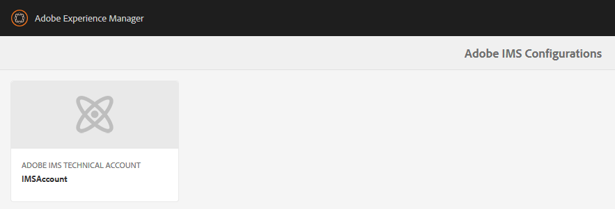

# 整合Dynamic Media檢視器與Adobe Analytics和Experience Platform標籤 {#integrating-dynamic-media-viewers-with-adobe-analytics-and-adobe-launch}

## 什麼是Dynamic Media Viewers與Adobe Analytics和Experience Platform標籤的整合？ {#what-is-dynamic-media-viewers-integration-with-adobe-analytics-and-adobe-launch}

<!-- Leave this hidden path here; it points to the topic source from Sasha https://wiki.corp.adobe.com/pages/viewpage.action?spaceKey=~oufimtse&title=Dynamic+Media+Viewers+integration+with+Adobe+Launch 

name used to be Experience Platform Launch. Changed to Experience Platform Data Collection-->

適用於Dynamic Media Tags和Dynamic Media Viewers 5.13的&#x200B;*Experience Platform Viewers*&#x200B;擴充功能可讓Adobe Analytics和Experience Platform Tags客戶在其Experience Platform Tags設定中使用特定於Dynamic Media Viewers的事件和資料。

此整合表示您可以使用Adobe Analytics追蹤網站上Dynamic Media Viewers的使用情況。 同時，您也可以將檢視器公開的事件和資料，與任何來自Adobe或協力廠商的其他Experience Platform標籤擴充功能搭配使用。

若要深入瞭解Adobe擴充功能或協力廠商擴充功能，請參閱Experience Platform標籤使用手冊中的[Adobe擴充功能](https://experienceleague.adobe.com/docs/experience-platform/tags/extensions/overview.html)。

**本主題適用於下列人員：**&#x200B;網站管理員、Adobe Experience Manager程式開發人員，以及營運人員。

### 整合的限制 {#limitations-of-the-integration}

* Dynamic Media檢視器的Experience Platform標籤整合無法在Experience Manager作者節點中運作。 在發佈之前，您無法從WCM頁面看到任何追蹤。
* Dynamic Media檢視器的Experience Platform標籤整合不支援「快顯」作業模式，此模式是使用「資產詳細資料」頁面上的「URL」按鈕取得檢視器URL。
* Experience Platform標籤整合不能與舊版檢視器Analytics整合約時使用（透過`config2=`引數）。
* 視訊追蹤支援僅限於核心播放追蹤，如[追蹤概述](https://experienceleague.adobe.com/docs/media-analytics/using/tracking/track-av-playback/track-core-overview.html?lang=en#player-events)所述。 特別不支援QoS、廣告、章節/區段或錯誤追蹤。
* 使用&#x200B;*Dynamic Media檢視器*&#x200B;擴充功能的資料元素不支援資料元素的儲存期間設定。 儲存期間必須設定為&#x200B;**[!UICONTROL 無]**。

### 整合的使用案例 {#use-cases-for-the-integration}

與Experience Platform標籤整合的主要使用案例是同時使用Experience Manager Assets和Experience Manager Sites的客戶。 在這種情況下，您可以設定Experience Manager製作節點與Experience Platform標籤之間的標準整合，然後將您的Sites例項與Experience Platform標籤屬性建立關聯。 之後，新增至Sites頁面的任何Dynamic Media WCM元件都將追蹤檢視器的資料和事件。

請參閱[在Experience Manager Sites中追蹤Dynamic Media檢視器](#tracking-dynamic-media-viewers-in-aem-sites)。

整合支援的次要使用案例為僅使用Experience Manager Assets或Dynamic Media Classic的客戶。 在這種情況下，您需要取得檢視器的內嵌程式碼，並將其新增至網站頁面。 接著，從Experience Platform標籤取得Experience Platform標籤程式庫生產URL，並手動將其新增至網頁程式碼。

請參閱[使用內嵌程式碼追蹤Dynamic Media檢視器](#tracking-dynamic-media-viewers-using-embed-code)。

## 資料和事件追蹤在整合中的運作方式 {#how-data-and-event-tracking-works-in-the-integration}

此整合利用了兩種獨立的Dynamic Media檢視器追蹤型別： *Adobe Analytics*&#x200B;和&#x200B;*Adobe Analytics for Audio and Video*。

### 關於使用Adobe Analytics進行追蹤  {#about-tracking-using-adobe-analytics}

Adobe Analytics可讓您追蹤使用者在您網站上與Dynamic Media Viewers互動時所執行的動作。 Adobe Analytics也可讓您追蹤檢視器特定資料。 例如，您可以追蹤並記錄檢視載入事件以及資產名稱、任何已發生的縮放動作和視訊播放動作。

在Experience Platform標籤中，*資料元素*&#x200B;和&#x200B;*規則*&#x200B;的概念可共同啟用Adobe Analytics追蹤。

#### 關於Experience Platform標籤中的資料元素 {#about-data-elements-in-adobe-launch}

Experience Platform標籤中的資料元素是一個已命名屬性，其值會以靜態方式定義，或根據網頁的狀態或Dynamic Media檢視器資料進行動態計算。

資料元素定義可用的選項取決於Experience Platform標籤屬性中安裝的擴充功能清單。 「核心」擴充功能已預先安裝，並可立即用於任何設定。 此「核心」擴充功能可定義資料元素，其值來自Cookie、JavaScript程式碼、查詢字串和許多其他來源。

為了追蹤Adobe Analytics，必須安裝數個其他擴充功能，如[擴充功能的安裝和設定](#installing-and-setup-of-extensions)中所述。 Dynamic Media Viewers擴充功能新增定義「資料元素」的功能，而該值的引數為動態檢視器事件。 例如，它可以參照檢視器型別，或檢視器載入時報告的資產名稱、一般使用者縮放時報告的縮放等級等等。

Dynamic Media Viewer擴充功能會自動使其資料元素的值保持最新。

定義資料元素後，您就可以使用資料元素選擇器Widget，將其用於Experience Platform標籤UI的其他位置。 尤其是，為了Dynamic Media檢視器追蹤而定義的資料元素，會由「規則」中Adobe Analytics擴充功能的「設定變數」動作參照（請參閱下文）。

請參閱Experience Platform標籤使用手冊中的[資料元素](https://experienceleague.adobe.com/docs/experience-platform/tags/ui/data-elements.html)。

#### 關於Experience Platform標籤中的規則 {#about-rules-in-adobe-launch}

Experience Platform標籤中的規則是無法辨識的設定，它定義了構成規則的三個區域： *事件*、*條件*&#x200B;和&#x200B;*動作*：

* *事件* (if)會告知Experience Platform標籤何時觸發規則。
* *條件* (if)會告知Experience Platform標籤在觸發規則時允許或禁止哪些其他限制。
* *動作* （然後）告訴Experience Platform標籤規則觸發時要做什麼。

「事件」、「條件」和「動作」區段中可用的選項取決於安裝在「Experience Platform標籤」屬性中的擴充功能。 *Core*&#x200B;擴充功能已預先安裝，且在任何組態中都可以立即使用。 擴充功能提供數個事件選項，例如基本的瀏覽器層級動作，包括焦點變更、按鍵按下及表單提交。 此外也包含條件的選項，例如Cookie值、瀏覽器型別等。 針對「動作」，只有「自訂程式碼」選項可用。

針對Adobe Analytics追蹤，必須安裝數個其他擴充功能，如[擴充功能的安裝及設定](#installing-and-setup-of-extensions)中所述。 具體來說：

* Dynamic Media Viewers擴充功能可將支援的事件清單擴充至Dynamic Media檢視器專屬的事件，例如檢視器載入、資產交換、放大和視訊播放。
* Adobe Analytics擴充功能擴充了支援的動作清單，包含傳送資料至追蹤伺服器所需的兩個動作： *設定變數*&#x200B;和&#x200B;*傳送信標*。

若要追蹤Dynamic Media檢視器，您可以使用下列任何型別：

* Dynamic Media Viewers擴充功能、核心擴充功能或任何其他擴充功能中的事件。
* 規則定義中的條件。 或者，您也可以將條件區域保持空白。

在「動作」區段中，您必須有&#x200B;*設定變數*&#x200B;動作。 此動作會告訴Adobe Analytics如何使用資料填入追蹤變數。 同時，*設定變數*&#x200B;動作不會傳送任何內容至追蹤伺服器。

*設定變數*&#x200B;動作之後必須是&#x200B;*傳送信標*&#x200B;動作。 *傳送信標*&#x200B;動作會實際將資料傳送至Analytics追蹤伺服器。 這兩個動作&#x200B;*設定變數*&#x200B;和&#x200B;*傳送信標*&#x200B;都來自Adobe Analytics擴充功能。

請參閱Experience Platform標籤使用手冊中的[規則](https://experienceleague.adobe.com/docs/experience-platform/tags/ui/rules.html)。

#### 設定範例 {#sample-configuration}

Experience Platform標籤內的下列設定範例示範如何在檢視器載入時追蹤資產名稱。

1. 從&#x200B;**[!UICONTROL 資料元素]**&#x200B;索引標籤，定義參照Dynamic Media檢視器擴充功能中`LOAD`事件的`asset`引數的資料元素`AssetName`。

   

1. 從&#x200B;**[!UICONTROL 規則]**&#x200B;索引標籤，定義規則&#x200B;*TrackAssetOnLoad*。

   在此規則中，**[!UICONTROL Event]**&#x200B;欄位會使用Dynamic Media Viewers擴充功能中的&#x200B;**[!UICONTROL LOAD]**&#x200B;事件。

   

1. 動作設定有Adobe Analytics擴充功能中的兩種動作型別：

   *設定變數*，將您選擇的分析變數對應至`AssetName`資料元素的值。

   *傳送信標*，這會傳送追蹤資訊至Adobe Analytics。

   

1. 產生的規則設定如下所示：

   

### 關於適用於音訊和視訊的Adobe Analytics {#about-adobe-analytics-for-audio-and-video}

當Experience Cloud帳戶訂閱使用Adobe Analytics進行音訊和視訊時，就足以在&#x200B;*Dynamic Media檢視器*&#x200B;擴充功能設定中啟用視訊追蹤。 視訊量度可在Adobe Analytics中使用。 視訊追蹤取決於Adobe Medium Analytics for Audio and Video擴充功能的存在。

請參閱[擴充功能的安裝及設定](#installing-and-setup-of-extensions)。

目前，視訊追蹤支援僅限「核心播放」追蹤，如[追蹤概述](https://experienceleague.adobe.com/docs/media-analytics/using/tracking/track-av-playback/track-core-overview.html?lang=en#player-events)所述。 特別不支援QoS、廣告、章節/區段或錯誤追蹤。

## 使用Dynamic Media Viewers擴充功能 {#using-the-dynamic-media-viewers-extension}

如整合的[使用案例](#use-cases-for-the-integration)中所述，您可以在Dynamic Media中使用內嵌程式碼透過Experience Manager Sites中的新Experience Platform標籤整合來追蹤檢視器。

### 在Experience Manager Sites中追蹤Dynamic Media檢視器 {#tracking-dynamic-media-viewers-in-aem-sites}

若要在Experience Manager Sites中追蹤Dynamic Media檢視器，必須執行[設定所有整合專案](#configuring-all-the-integration-pieces)區段底下所列的所有步驟。 具體來說，您必須建立IMS設定和Experience Platform標籤雲端設定。

在正確設定後，您使用Dynamic Media支援的WCM元件新增至網站頁面的任何Dynamic Media檢視器都會自動追蹤資料至Adobe Analytics或Adobe Analytics for Video，或兩者皆追蹤。

請參閱[使用Adobe網站將Dynamic Media Assets新增至頁面](/help/assets/dynamic-media/adding-dynamic-media-assets-to-pages.md)。

### 使用內嵌程式碼追蹤Dynamic Media檢視器 {#tracking-dynamic-media-viewers-using-embed-code}

客戶若未使用Experience Manager Sites或（或）將Dynamic Media檢視器內嵌至Experience Manager Sites以外的網頁，仍可使用Experience Platform標籤整合。

完成[設定Adobe Analytics](#configuring-adobe-analytics-for-the-integration)和[設定Experience Platform標籤](#configuring-adobe-launch-for-the-integration)區段的設定步驟。 不過，不需要Experience Manager相關的設定步驟。

在正確設定後，您可以使用Dynamic Media檢視器將Experience Platform標籤支援新增至網頁。

請參閱[新增Experience Platform標籤內嵌程式碼](https://experienceleague.adobe.com/docs/platform-learn/implement-in-websites/configure-tags/add-embed-code.html)，深入瞭解如何使用Experience Platform標籤程式庫內嵌程式碼。

若要進一步瞭解如何使用Experience Manager Dynamic Media的內嵌程式碼功能，請參閱[將視訊或影像檢視器內嵌在網頁上](/help/assets/dynamic-media/embed-code.md)。

**使用內嵌程式碼追蹤Dynamic Media檢視器：**

1. 建立可內嵌Dynamic Media檢視器的網頁。
1. 請先登入Experience Platform標籤，取得Experience Platform標籤程式庫的內嵌程式碼(請參閱[設定Experience Platform標籤](#configuring-adobe-launch-for-the-integration))。
1. 選取&#x200B;**[!UICONTROL 屬性]**，然後選取&#x200B;**[!UICONTROL 環境]**&#x200B;索引標籤。
1. 挑選與網頁環境相關的環境層級。 然後，在&#x200B;**[!UICONTROL Install]**&#x200B;欄中選取方塊圖示。
1. **[!UICONTROL 在Web安裝指示]**&#x200B;對話方塊中，複製完整的Experience Platform標籤程式庫內嵌程式碼，以及周圍的`<script/>`標籤。

## Dynamic Media Viewers擴充功能參考指南 {#reference-guide-for-the-dynamic-media-viewers-extension}

### 關於Dynamic Media檢視器設定 {#about-the-dynamic-media-viewers-configuration}

如果下列條件為真，Dynamic Media Viewer擴充功能會自動與Experience Platform標籤程式庫整合：

* 頁面中有Experience Platform標籤程式庫全域物件( `_satellite`)。
* Dynamic Media Viewers擴充功能函式`_dmviewers_v001()`定義於`_satellite`。

* 未指定`config2=`檢視器引數，這表示檢視器不使用舊版Analytics整合。

此外，在檢視器的設定中指定`launch=0`引數，也可以選擇明確停用Experience Platform標籤在檢視器中的整合。 此引數的預設值為`1`。

### 設定Dynamic Media Viewers擴充功能 {#configuring-the-dynamic-media-viewers-extension}

Dynamic Media Viewers擴充功能的唯一設定選項是&#x200B;**[!UICONTROL 啟用Adobe Medium Analytics for Audio and Video]**。

勾選（啟用）此選項，且已安裝並設定Adobe Medium Analytics for Audio and Video擴充功能時，視訊播放量度會傳送至Adobe Analytics for Audio and Video解決方案。 停用此選項會關閉視訊追蹤。

如果啟用此選項&#x200B;*而沒有*&#x200B;安裝Adobe Medium Analytics for Audio and Video擴充功能，則選項無效。

### 關於Dynamic Media檢視器擴充功能中的資料元素 {#about-data-elements-in-the-dynamic-media-viewers-extension}

「動態媒體檢視器」擴充功能提供的唯一「資料元素」類型是「資 **[!UICONTROL 料元素類型」下拉式清單中的「檢]****** 視器事件」。

選取後，資料元素編輯器會呈現包含兩個欄位的表單：

* **[!UICONTROL DM檢視器事件資料類型]** -一個下拉式清單，可識別動態媒體檢視器擴充功能支援的所有檢視器事件 (具有引數)，加上特殊的 **[!UICONTROL COMMON]** 項目。COMMON **** 項目代表檢視器所傳送之所有類型事件的共同事件參數清單。
* **[!UICONTROL 追蹤引數]** — 所選Dynamic Media檢視器事件的引數。

請參閱[Dynamic Media檢視器參考指南](https://experienceleague.adobe.com/docs/dynamic-media-developer-resources/library/viewers-aem-assets-dmc/c-html5-s7-aem-asset-viewers.html)，以取得各種檢視器型別所支援的事件清單；移至特定檢視器區段，然後選取[支援Adobe Analytics追蹤]子區段。 目前，Dynamic Media檢視器參考指南不會記錄事件引數。

現在來考慮Dynamic Media Viewers *資料元素*&#x200B;的生命週期。 此資料元素的值會在頁面上發生對應的Dynamic Media檢視器事件後填入。 例如，假設資料元素指向&#x200B;**[!UICONTROL LOAD]**&#x200B;事件及其「asset」引數。 在檢視器首次執行LOAD事件後，此資料元素的值會收到有效資料。 如果資料元素指向&#x200B;**[!UICONTROL ZOOM]**&#x200B;事件及其「縮放」引數，則此資料元素的值會維持空白，直到檢視器首次傳送&#x200B;**[!UICONTROL ZOOM]**&#x200B;事件為止。

同樣地，當檢視器在頁面上傳送對應事件時，資料元素的值也會自動更新。即使未在規則設定中指定特定事件，也會進行值更新。例如，假設資料元素&#x200B;**[!UICONTROL ZoomScale]**&#x200B;已針對ZOOM事件的「縮放」引數定義。 但是，規則組態中唯一存在的規則是由&#x200B;**[!UICONTROL LOAD]**&#x200B;事件觸發。 每次使用者在檢視器內執行縮放時，**[!UICONTROL ZoomScale]**&#x200B;的值仍會更新。

任何動態媒體檢視器在網頁上都有唯一識別碼。資料元素會追蹤值本身，以及填入值的檢視器。 例如，假設相同頁面上有數個檢視器，以及指向&#x200B;**[!UICONTROL LOAD]**&#x200B;事件及其「asset」引數的&#x200B;**[!UICONTROL AssetName]**&#x200B;資料元素。 **[!UICONTROL AssetName]**&#x200B;資料元素會維護與頁面上載入的每個檢視器相關聯的資產名稱集合。

資料元素傳回的確切值取決於上下文。 若資料元素是在由Dynamic Media檢視器事件觸發的規則中要求，則會為啟動規則的檢視器傳回資料元素值。 此外，資料元素請求使用的規則是由某個其他Experience Platform標籤擴充功能中的事件所觸發。 此時，資料元素的值來自上次更新此資料元素的檢視器。

**請考慮下列範例設定：**

* 具有兩個Dynamic Media縮放檢視器的網頁： *檢視器1*&#x200B;和&#x200B;*檢視器2*。

* **[!UICONTROL ZoomScale]**&#x200B;資料元素指向&#x200B;**[!UICONTROL ZOOM]**&#x200B;事件及其「縮放」引數。
* **[!UICONTROL TrackPan]**&#x200B;規則包含下列專案：

   * 使用Dynamic Media檢視器&#x200B;**[!UICONTROL PAN]**&#x200B;事件作為觸發器。
   * 將&#x200B;**[!UICONTROL ZoomScale]**&#x200B;資料元素的值傳送至Adobe Analytics。

* **[!UICONTROL TrackKey]**&#x200B;規則包含下列專案：

   * 使用核心Experience Platform標籤擴充功能的按鍵事件作為觸發器。
   * 將&#x200B;**[!UICONTROL ZoomScale]**&#x200B;資料元素的值傳送至Adobe Analytics。

現在，假設使用者透過兩個檢視器載入網頁。 在&#x200B;*檢視器1*&#x200B;中，他們放大至50%的縮放比例；然後在&#x200B;*檢視器2*&#x200B;中，他們放大至25%的縮放比例。 在&#x200B;*檢視器1*&#x200B;中，他們移動影像，最後按鍵盤上的鍵。

使用者的活動會導致系統對Adobe Analytics進行以下兩個追蹤呼叫：

* 第一次呼叫發生的原因是&#x200B;**[!UICONTROL TrackPan]**&#x200B;規則是在使用者在&#x200B;*檢視器1*&#x200B;中平移時觸發。 該呼叫會傳送50%作為&#x200B;**[!UICONTROL ZoomScale]** Data Element的值，因為資料元素知道規則是由&#x200B;*檢視器1*&#x200B;觸發，並擷取對應的縮放值；
* 發生第二個呼叫，因為使用者按下鍵盤上的按鍵時已觸發&#x200B;**[!UICONTROL TrackKey]**&#x200B;規則。 該呼叫會傳送25%作為&#x200B;**[!UICONTROL ZoomScale]**&#x200B;資料元素的值，因為檢視器未觸發規則。 因此，資料元素會傳回最新值。

上述設定的範例也會影響資料元素值的生命週期。 即使檢視器本身已放置在網頁上，Dynamic Media檢視器所管理的資料元素值仍會儲存在Experience Platform標籤程式庫程式碼中。 此功能表示如果非Dynamic Media Viewer擴充功能觸發規則，並參考此類資料元素，資料元素會傳回最後一個已知值。 即使檢視器不再出現在網頁上。

無論如何，Dynamic Media檢視器所驅動的資料元素值不會儲存在本機儲存空間或伺服器上，而是只會儲存在使用者端Experience Platform標籤資料庫上。 網頁重新載入時，此資料元素的值會消失。

一般而言，資料元素編輯器支援[儲存期間選擇](https://experienceleague.adobe.com/docs/experience-platform/tags/ui/data-elements.html#create-a-data-element)。 不過，使用Dynamic Media Viewers擴充功能的資料元素只支援&#x200B;**[!UICONTROL 無]**&#x200B;的儲存持續時間選項。 您可以在使用者介面中設定任何其他值，但在此情況下不會定義資料元素行為。 擴充功能會自行管理「資料元素」的值：「資料元素」會在整個檢視器生命週期中維護檢視器事件引數的值。

### 關於Dynamic Media檢視器擴充功能中的規則 {#about-rules-in-the-dynamic-media-viewers-extension}

在規則編輯器中，擴充功能會為事件編輯器新增設定選項。 此外，編輯器也提供在動作編輯器中手動參考事件引數的選項，作為簡易選項，而不使用預先設定的資料元素。

#### 關於事件編輯器 {#about-the-events-editor}

在事件編輯器中，Dynamic Media Viewers擴充功能新增名為&#x200B;**[!UICONTROL 檢視器事件]**&#x200B;的&#x200B;**[!UICONTROL 事件型別]**。

選取後，事件編輯器會呈現下拉式&#x200B;**[!UICONTROL Dynamic Media Viewer事件]**，列出Dynamic Media Viewers支援的所有可用事件。

#### 關於動作編輯器 {#about-the-actions-editor}

Dynamic Media檢視器擴充功能可讓您使用Dynamic Media檢視器的事件引數，對應至Adobe Analytics擴充功能的「設定變數」編輯器中的分析變數。

最簡單的方法是完成以下兩個步驟的流程：

* 首先，定義一或多個資料元素，其中每個資料元素代表Dynamic Media Viewer事件的引數。
* 最後，在Adobe Analytics擴充功能的「設定變數」編輯器中，選取「資料元素」選擇器圖示（三個棧疊的磁碟）以開啟「選取資料元素」對話方塊，然後從其中選取資料元素。

不過，您也可以使用替代方法並略過「資料元素」的建立。您可以直接參照Dynamic Media Viewer事件的引數。 在Analytics變數指派的&#x200B;**[!UICONTROL 值]**&#x200B;輸入欄位中，輸入事件引數的完整限定名稱。 請務必以百分比(%)符號括住。 例如，

`%event.detail.dm.LOAD.asset%`

使用資料元素與直接事件引數參考之間有重要的差異。 對於資料元素，哪個事件會觸發「設定變數」動作並不重要。 觸發規則的事件可能與動態檢視器無關（例如從核心擴充功能選取網頁）。 但是，使用直接引數參考時，請務必確保觸發規則的事件對應到它參考的事件引數。

例如，如果 `%event.detail.dm.LOAD.asset%` 規則是由動態媒體檢視器擴充功能的 **[!UICONTROL LOAD]** 事件觸發，則參照會傳回正確的資產名稱。但是，它會傳回任何其他事件的空白值。

下表列出Dynamic Media Viewer事件及其支援的引數：

<table>
 <tbody>
  <tr>
   <td>檢視器事件名稱</td>
   <td>引數參考</td>
  </tr>
  <tr>
   <td><code>COMMON</code></td>
   <td><code>%event.detail.dm.objID%</code></td>
  </tr>
  <tr>
   <td> </td>
   <td><code>%event.detail.dm.compClass%</code></td>
  </tr>
  <tr>
   <td> </td>
   <td><code>%event.detail.dm.instName%</code></td>
  </tr>
  <tr>
   <td> </td>
   <td><code>%event.detail.dm.timeStamp%</code></td>
  </tr>
  <tr>
   <td><code>BANNER</code>  </td>
   <td><code>%event.detail.dm.BANNER.asset%</code></td>
  </tr>
  <tr>
   <td> </td>
   <td><code>%event.detail.dm.BANNER.frame%</code></td>
  </tr>
  <tr>
   <td> </td>
   <td><code>%event.detail.dm.BANNER.label%</code></td>
  </tr>
  <tr>
   <td><code>HREF</code></td>
   <td><code>%event.detail.dm.HREF.rollover%</code></td>
  </tr>
  <tr>
   <td><code>ITEM</code></td>
   <td><code>%event.detail.dm.ITEM.rollover%</code></td>
  </tr>
  <tr>
   <td><code>LOAD</code></td>
   <td><code>%event.detail.dm.LOAD.applicationname%</code></td>
  </tr>
  <tr>
   <td><strong> </strong></td>
   <td><code>%event.detail.dm.LOAD.asset%</code></td>
  </tr>
  <tr>
   <td><strong> </strong></td>
   <td><code>%event.detail.dm.LOAD.company%</code></td>
  </tr>
  <tr>
   <td><strong> </strong></td>
   <td><code>%event.detail.dm.LOAD.sdkversion%</code></td>
  </tr>
  <tr>
   <td><strong> </strong></td>
   <td><code>%event.detail.dm.LOAD.viewertype%</code></td>
  </tr>
  <tr>
   <td><strong> </strong></td>
   <td><code>%event.detail.dm.LOAD.viewerversion%</code></td>
  </tr>
  <tr>
   <td><code>METADATA</code></td>
   <td><code>%event.detail.dm.METADATA.length%</code></td>
  </tr>
  <tr>
   <td> </td>
   <td><code>%event.detail.dm.METADATA.type%</code></td>
  </tr>
  <tr>
   <td><code>MILESTONE</code></td>
   <td><code>%event.detail.dm.MILESTONE.milestone%</code></td>
  </tr>
  <tr>
   <td><code>PAGE</code></td>
   <td><code>%event.detail.dm.PAGE.frame%</code></td>
  </tr>
  <tr>
   <td> </td>
   <td><code>%event.detail.dm.PAGE.label%</code></td>
  </tr>
  <tr>
   <td><code>PAUSE</code></td>
   <td><code>%event.detail.dm.PAUSE.timestamp%</code></td>
  </tr>
  <tr>
   <td><code>PLAY</code></td>
   <td><code>%event.detail.dm.PLAY.timestamp%</code></td>
  </tr>
  <tr>
   <td><code>SPIN</code></td>
   <td><code>%event.detail.dm.SPIN.framenumber%</code></td>
  </tr>
  <tr>
   <td><code>STOP</code></td>
   <td><code>%event.detail.dm.STOP.timestamp%</code></td>
  </tr>
  <tr>
   <td><code>SWAP</code></td>
   <td><code>%event.detail.dm.SWAP.asset%</code></td>
  </tr>
  <tr>
   <td><code>SWATCH</code></td>
   <td><code>%event.detail.dm.SWATCH.frame%</code></td>
  </tr>
  <tr>
   <td> </td>
   <td><code>%event.detail.dm.SWATCH.label%</code></td>
  </tr>
  <tr>
   <td><code>TARG</code></td>
   <td><code>%event.detail.dm.TARG.frame%</code></td>
  </tr>
  <tr>
   <td> </td>
   <td><code>%event.detail.dm.TARG.label%</code></td>
  </tr>
  <tr>
   <td><code>ZOOM</code></td>
   <td><code>%event.detail.dm.ZOOM.scale%</code></td>
  </tr>
 </tbody>
</table>

## 設定所有整合專案 {#configuring-all-the-integration-pieces}

**開始之前**

Adobe建議您詳閱本節之前的所有檔案，以便瞭解完整的整合。

本節說明整合Dynamic Media檢視器與Adobe Analytics和用於音訊與視訊的Adobe Analytics所需的設定步驟。 雖然將Dynamic Media檢視器擴充功能用於Experience Platform標籤中的其他用途是可行的，但本檔案未涵蓋這類案例。

您即將使用下列Adobe產品來設定整合：

* Adobe Analytics — 用於設定追蹤變數和報表。
* Experience Platform標籤 — 用於定義屬性、一個或多個規則以及一個或多個資料元素，以啟用檢視器追蹤。

此外，如果此整合解決方案與Experience Manager Sites搭配使用，則必須完成下列設定：

* [Adobe Developer Console](https://developer.adobe.com/console/home) — 已為Experience Platform標籤建立整合。
* Experience Manager製作節點 — IMS設定和Experience Platform標籤雲端設定。

在設定中，請確定您有權存取Adobe Experience Cloud中已啟用Adobe Analytics和Experience Platform標籤的公司。

## 設定Adobe Analytics以進行整合 {#configuring-adobe-analytics-for-the-integration}

設定Adobe Analytics後，系統會針對整合進行下列設定：

* 報告套裝已就位並選取。
* Analytics變數可用來接收追蹤資料。
* 報表可用來檢視Adobe Analytics中收集的資料。

另請參閱[Analytics實作指南](https://experienceleague.adobe.com/docs/analytics/implementation/home.html)。

**若要設定Adobe Analytics以進行整合：**

1. 從Experience Cloud[首頁](https://experience.adobe.com/#/home)存取Adobe Analytics開始。 在功能表列上，選取頁面右上角附近的解決方案圖示（三乘三的點表），然後選取&#x200B;**[!UICONTROL Analytics]**。

   

   現在選取報表套裝。

### 選取報表套裝 {#selecting-a-report-suite}

1. 在Adobe Analytics頁面的右上角，「搜尋報表」欄位的右側，從下拉式清單中選取正確的報表套裝。****&#x200B;如果有多個報表套裝可供使用，而您不確定要使用哪個報表套裝，請連絡您的Adobe Analytics管理員，以協助您選取要使用哪個報表套裝。

   在下列範例中，使用者已建立名為&#x200B;*DynamicMediaViewersExtensionDoc*&#x200B;的報表套裝，並從下拉式清單中選取它。 報表套裝名稱僅供範例使用。 您最終選取的報表套裝名稱由您決定。

   如果沒有可用的報表套裝，您或您的Adobe Analytics管理員必須先建立一個報表套裝，然後才能繼續進行設定。

   請參閱[報表與報表套裝](https://experienceleague.adobe.com/docs/analytics/admin/admin-tools/manage-report-suites/report-suites-admin.html)和[建立報表套裝](https://experienceleague.adobe.com/docs/analytics/admin/admin-tools/manage-report-suites/c-new-report-suite/t-create-a-report-suite.html)。

   在Adobe Analytics中，報表套裝是在&#x200B;**[!UICONTROL 管理員]** > **[!UICONTROL 報表套裝]**&#x200B;下管理。

   

   現在設定Adobe Analytics變數。

### 設定Adobe Analytics變數 {#setting-up-adobe-analytics-variables}

1. 指定一或多個Adobe Analytics變數，用來追蹤網頁上的Dynamic Media檢視器行為。

   您可以使用Adobe Analytics支援的任何變數型別。 變數型別(如自訂流量[prop]、轉換[eVar])的決定是由您的Analytics實作的特定需求所驅動。

   請參閱[Prop和eVar概觀](https://experienceleague.adobe.com/docs/analytics/implementation/vars/page-vars/evar.html#vars)。

   就本檔案而言，僅會使用自訂流量(prop)變數，因為它們在網頁上發生動作後的幾分鐘內，就能在Analytics報表中使用。

   若要啟用新的自訂流量變數，請在Adobe Analytics的工具列上，前往&#x200B;**[!UICONTROL 管理員]** > **[!UICONTROL 報表套裝]**。

1. 在&#x200B;**[!UICONTROL 報告套裝管理員]**&#x200B;頁面上，選取正確的報告，然後在工具列上，移至&#x200B;**[!UICONTROL 編輯設定]** > **[!UICONTROL 流量]** > **[!UICONTROL 流量變數]**。
1. 挑選未使用的變數，為其指定描述性名稱(**[!UICONTROL 檢視器資產(prop 30)]**)，然後在「已啟用」欄中將下拉式方塊變更為「已啟用」。

   下列熒幕擷圖為自訂流量變數( **[!UICONTROL prop30]**)的範例，用於追蹤檢視器使用的資產名稱：

   

1. 在變數清單底部，選取&#x200B;**[!UICONTROL 儲存]**。

### 設定報表 {#setting-up-a-report}

1. 一般而言，在Adobe Analytics中設定報表是受特定專案需求的驅動。 因此，詳細報告設定不在此整合的範圍之內。

   不過，只要您在&#x200B;**[設定Adobe Analytics變數](#setting-up-adobe-analytics-variables)**&#x200B;中設定自訂流量變數後，就能知道自訂流量報表在Adobe Analytics中自動可用。

   例如，**[!UICONTROL 檢視器資產(prop 30)]**&#x200B;變數的報表可從&#x200B;**[!UICONTROL 自訂流量]** > **[!UICONTROL 自訂流量21-30]** > **[!UICONTROL 檢視器資產(prop 30)]**&#x200B;下的「報表」功能表取得。

   在檢視器資產(prop 30)建 **[!UICONTROL 立後立即造訪此報表]** ，不會顯示任何資料；在這個整合階段，就是預期的。

   

## 設定整合的Experience Platform標籤 {#configuring-adobe-launch-for-the-integration}

設定Experience Platform標籤後，系統會針對整合進行下列設定：

* 建立新屬性以將您的所有設定保持在一起。
* 擴充功能的安裝和設定。 屬性中安裝的所有擴充功能的使用者端程式碼會一起編譯至程式庫中。 網頁稍後會使用此資料庫。
* 資料元素和規則的設定。 此設定會定義要從Dynamic Media檢視器取得哪些資料、何時觸發追蹤邏輯，以及在Adobe Analytics中將檢視器資料傳送至何處。
* 程式庫的發佈。

**若要設定整合的Experience Platform標籤：**

1. 從Experience Cloud[首頁](https://experience.adobe.com/#/home)存取Experience Platform標籤開始。 在功能表列上，選取頁面右上角附近的解決方案圖示（三乘三的點表），然後選取&#x200B;**[!UICONTROL 標籤]**。

   您也可以直接[開啟Experience Platform標籤](https://launch.adobe.com/)。

   

### 在Experience Platform標籤中建立屬性 {#creating-a-property-in-adobe-launch}

Experience Platform標籤中的屬性是具名設定，可讓所有設定保持在一起。 系統會產生一個組態設定程式庫，並發佈至不同的環境層級（開發、測試和生產）。

另請參閱[設定選取的屬性](https://experienceleague.adobe.com/docs/platform-learn/implement-mobile-sdk/initial-configuration/configure-tags.html)。

**若要在Experience Platform標籤中建立屬性：**

1. 在Experience Platform標籤中，選取&#x200B;**[!UICONTROL 新增屬性]**。
1. 在「建 **[!UICONTROL 立屬性]** 」對話方塊的「名稱 **** 」欄位中，輸入描述性名稱，例如網站的標題。例如 `DynamicMediaViewersProp.`
1. 在&#x200B;**[!UICONTROL 網域]**&#x200B;欄位中，輸入您網站的網域。
1. 在「進 **[!UICONTROL 階選項]** 」下拉式清單中，啟用「設定擴充功能」開發 (以後無法修改) ******，以備您要使用的擴充功能 (在本例中為「動態媒體檢視器」) 尚未發行時使用。

   

1. 選取「**[!UICONTROL 儲存]**」。

   選取建立的屬性，然後繼續進行&#x200B;*擴充功能的安裝及設定*。

### 安裝及設定擴充功能 {#installing-and-setup-of-extensions}

Experience Platform標籤中所有可用的擴充功能都會列在&#x200B;**[!UICONTROL 擴充功能]** > **[!UICONTROL 目錄]**&#x200B;下。

若要安裝擴充功能，請選取&#x200B;**[!UICONTROL 安裝]**。 如有需要，請執行一次性擴充功能組態，然後選取&#x200B;**[!UICONTROL 儲存]**。

必要時，必須安裝並設定下列擴充功能：

* （必要） *Experience Cloud識別碼服務*&#x200B;延伸

無需額外設定，接受任何建議值。 完成時，請務必選取&#x200B;**[!UICONTROL 儲存]**。

請參閱[Experience Cloud識別服務延伸模組](https://experienceleague.adobe.com/docs/experience-platform/tags/extensions/client/id-service/overview.html)。

* （必要） *Adobe Analytics*&#x200B;延伸模組

若要設定此擴充功能，您需要Adobe Analytics中&#x200B;**[!UICONTROL 管理員]** > **[!UICONTROL 報表套裝]**&#x200B;下，**[!UICONTROL 報表套裝ID]**&#x200B;欄標題下的報表套裝ID。

(僅供展示之用，**[!UICONTROL DynamicMediaViewersExtensionDoc]**&#x200B;報表套裝的報表套裝ID用於下列熒幕擷取畫面中。 此ID已建立並用於 [選取報表套裝](#selecting-a-report-suite) 。)

在「安裝擴充功能」頁面的「開發報表套裝」欄位中，輸入「報表套裝ID」。此欄位包括「 **[!UICONTROL 測試報表套裝」欄位和「]** 生產報表套裝 ******** 」欄位。

*只有在您打算使用視訊追蹤時，才設定下列專案：*

在&#x200B;**[!UICONTROL 安裝擴充功能]**&#x200B;頁面上，展開&#x200B;**[!UICONTROL 一般]**，然後指定追蹤伺服器。 追蹤伺服器遵循範本`<trackingNamespace>.sc.omtrdc.net`，其中`<trackingNamespace>`是在布建電子郵件中取得的資訊。

選取「**[!UICONTROL 儲存]**」。

請參閱[Adobe Analytics擴充功能](https://experienceleague.adobe.com/docs/experience-platform/tags/extensions/client/analytics/overview.html)。

* (選擇性。 只有在需要視訊追蹤時才需要) *Adobe Medium Analytics for Audio and Video*&#x200B;擴充功能

填寫追蹤伺服器欄位。 *Adobe Medium Analytics for Audio and Video*&#x200B;擴充功能的追蹤伺服器與Adobe Analytics所使用的追蹤伺服器不同。 它會依循範本`<trackingNamespace>.hb.omtrdc.net`，其中`<trackingNamespace>`是來自布建電子郵件的資訊。

所有其他欄位都是選用的。

請參閱[Adobe Medium Analytics for Audio and Video擴充功能](https://experienceleague.adobe.com/docs/experience-platform/tags/extensions/client/media-analytics/overview.html)。

* （必要） *Dynamic Media Viewers*&#x200B;擴充功能

選取 **[!UICONTROL 啟用Adobe Analytics for Video]** ，以啟用 (開啟) 視訊心率追蹤。

截至撰寫之時，*Dynamic Media Viewers*&#x200B;擴充功能只有在已針對開發建立Experience Platform標籤屬性時才能使用。

請參閱[在Experience Platform標籤](#creating-a-property-in-adobe-launch)中建立屬性。

安裝並設定擴充功能後，擴充功能>已安裝區域至少會列出下列五個擴充功能（若您未追蹤視訊，則四個）。

### 設定資料元素和規則 {#setting-up-data-elements-and-rules}

在Experience Platform標籤中，建立追蹤Dynamic Media檢視器所需的資料元素和規則。

請參閱[資料與事件追蹤在整合](#how-data-and-event-tracking-works-in-the-integration)中的運作方式，以取得使用Experience Platform標籤進行追蹤的概觀。

請參閱[範例組態](#sample-configuration)，以瞭解Experience Platform標籤中示範如何在檢視器載入時追蹤資產名稱的範例組態。

如需擴充功能的深入資訊，請參閱[設定Dynamic Media Viewers擴充功能](#configuring-the-dynamic-media-viewers-extension)。

### Publish a程式庫 {#publishing-a-library}

若要變更Experience Platform標籤設定（包括屬性、擴充功能、規則和設定的資料元素），您必須&#x200B;*發佈*&#x200B;此類變更。 從「屬性」設定下的「發佈」標籤中，執行「Experience Platform標籤」中的發佈。

Experience Platform標籤可能具有多個開發環境、一個測試環境及一個生產環境。 根據預設，Experience Manager中的「Experience Platform標籤雲端設定」會將Experience Manager作者節點指向Platform標籤的「預備」環境。 Experience ManagerPublish節點指向Experience Platform標籤的生產環境。 這種排列表示在預設Experience Manager設定下，必須將Experience Platform標籤程式庫發佈到測試環境。 如此可讓您在Experience Manager作者中使用它。 然後，您可以將其發佈到生產環境，以便用於Experience Manager發佈。

請參閱[環境](https://experienceleague.adobe.com/docs/experience-platform/tags/publish/environments/environments.html?lang=zh-Hant)，以取得有關Experience Platform標籤環境的詳細資訊。

發佈程式庫需執行下列兩個步驟：

* 將所有必要的變更（新變更和更新）加入程式庫，以新增和建立新程式庫。
* 在不同環境層級（從開發到測試與生產）中向上移動程式庫。

#### 新增及建置新程式庫 {#adding-and-building-a-new-library}

1. 第一次在Experience Platform標籤中開啟「發佈」標籤時，資料庫清單是空的。

   在左欄中，選取&#x200B;**[!UICONTROL 新增程式庫]**。

   

1. 在[建立新程式庫]頁面的&#x200B;**[!UICONTROL 名稱]**&#x200B;欄位中，輸入新程式庫的描述性名稱。 例如，

   *DynamicMediaViewerLib*

   從「環境」下拉式清單中，選擇「環境」層級。 一開始，只有開發層級可供選取。 在頁面的左下角附近，選取&#x200B;**[!UICONTROL 新增所有變更的資源]**。

   

1. 在頁面的右上角附近，選取&#x200B;**[!UICONTROL 儲存並建置以供開發]**。

   幾分鐘後，程式庫就會建立並準備使用。

   

   >[!NOTE]
   >
   >下次變更Experience Platform標籤設定時，請移至&#x200B;**[!UICONTROL 屬性]**&#x200B;設定下的&#x200B;**[!UICONTROL 發佈]**&#x200B;標籤，然後選取您先前建立的資料庫。
   >
   >
   >在程式庫發佈畫面中，選取&#x200B;**[!UICONTROL 新增所有變更的資源]**，然後選取&#x200B;**[!UICONTROL 儲存並建置以供開發]**。

#### 在環境層級中向上移動程式庫 {#moving-a-library-up-through-environment-levels}

1. 新增程式庫後，即可在開發環境中找到該程式庫。 若要將其移至測試環境層級（與「已提交」欄相對應），請從程式庫的下拉式功能表中，選取&#x200B;**[!UICONTROL 提交以供核准]**。

   

1. 在確認對話方塊中，選取&#x200B;**[!UICONTROL 提交]**。

   程式庫移至「已提交」欄後，從程式庫的下拉式功能表中，選取&#x200B;**[!UICONTROL 為暫存環境建置]**。

   

1. 若要將程式庫從測試環境移至生產環境（亦即「已發佈」欄），請遵循類似的程式。

   首先，從下拉式功能表中選取&#x200B;**[!UICONTROL 核准發佈]**。

   

1. 從下拉式功能表中，選取&#x200B;**[!UICONTROL 建置和Publish至生產環境]**。

   

   請參閱[發佈](https://experienceleague.adobe.com/docs/experience-platform/tags/publish/overview.html)，以取得有關Experience Platform標籤中發佈程式的詳細資訊。

## 設定Adobe Experience Manager以進行整合 {#configuring-adobe-experience-manager-for-the-integration}

<!-- Prerequisites list below should be verified by Sasha -->

先決條件：

* Experience Manager會執行作者和Publish例項。
* Experience Manager作者節點是在Dynamic Media中設定。<!-- Scene7 run mode (dynamicmedia_s7) -->
* Dynamic Media WCM元件會在Experience Manager Sites中啟用。

Experience Manager設定包含下列兩個主要步驟：

* Experience ManagerIMS的設定。
* Experience Platform標籤雲端的設定。

### 設定Experience ManagerIMS {#configuring-aem-ims}

1. 在Experience Manager作者中，選取「工具」圖示（槌子），然後前往&#x200B;**[!UICONTROL 安全性]** > **[!UICONTROL Adobe IMS設定]**。

   

1. 在「AdobeIMC設定」頁面的左上角附近，選取「**[!UICONTROL 建立]**」。
1. 在&#x200B;**[!UICONTROL Adobe IMS技術帳戶設定]**&#x200B;頁面的&#x200B;**[!UICONTROL 雲端解決方案]**&#x200B;下拉式清單中，選取&#x200B;**[!UICONTROL Experience Platform資料集合]**。
1. 啟用&#x200B;**[!UICONTROL 建立新憑證]**，然後在文字欄位中，為您的憑證輸入任何有意義的值。 例如，*AdobeLaunchIMSCert*。 選取&#x200B;**[!UICONTROL 建立憑證]**。

   會顯示下列資訊訊息：

   *若要擷取有效的存取Token，必須將新憑證的公開金鑰新增至Adobe Developer上的技術帳戶！*

   若要關閉[資訊]對話方塊，請選取[確定]。****

   

1. 選取&#x200B;**[!UICONTROL 下載公開金鑰]**&#x200B;以將公開金鑰檔案(`*.crt`)下載到您的本機系統。

   >[!NOTE]
   >
   >此時，***保持開啟*** **[!UICONTROL Adobe IMS技術帳戶設定]**&#x200B;頁面；***不***&#x200B;關閉頁面，且&#x200B;***不***&#x200B;選取&#x200B;**[!UICONTROL 下一步]**。 您稍後將在步驟中返回此頁面。

   

1. 在新的瀏覽器分頁中導覽至[Adobe Developer Console](https://developer.adobe.com/console/integrations)。

1. 從&#x200B;**[!UICONTROL Adobe Developer Console整合]**&#x200B;頁面，在右上角附近選取&#x200B;**[!UICONTROL 新整合]**。
1. 在&#x200B;**[!UICONTROL 建立新整合]**&#x200B;對話方塊中，確定已選取&#x200B;**[!UICONTROL 存取API]**&#x200B;選項按鈕，然後選取&#x200B;**[!UICONTROL 繼續]**。

1. 在第二個&#x200B;**[!UICONTROL 建立新整合]**&#x200B;頁面上，啟用（開啟） **[!UICONTROL Experience Platform標籤API]**&#x200B;選項按鈕。 在頁面的右下角，選取&#x200B;**[!UICONTROL 繼續]**。

   

1. 在第三個&#x200B;**[!UICONTROL 建立新整合]**&#x200B;頁面上，執行下列動作：

   * 在&#x200B;**[!UICONTROL 名稱]**&#x200B;欄位中，輸入描述性名稱。 例如，*DynamicMediaViewersIO*。

   * 在&#x200B;**[!UICONTROL 描述]**&#x200B;欄位中，輸入整合的描述。

   * 在&#x200B;**[!UICONTROL 公開金鑰憑證]**&#x200B;區域中，上傳您先前在這些步驟中下載的公開金鑰檔案(`*.crt`)。

   * 在&#x200B;**[!UICONTROL 選取Experience Platform標籤API]**&#x200B;標題的角色下，選取&#x200B;**[!UICONTROL 管理員]**。

   * 在&#x200B;**[!UICONTROL 為Experience Platform標籤API]**&#x200B;標題選取一或多個產品設定檔，然後選取名為&#x200B;**[!UICONTROL 標籤 — &lt;your_company_name>]**&#x200B;的產品設定檔。

   

1. 選取&#x200B;**[!UICONTROL 建立整合]**。
1. 在&#x200B;**[!UICONTROL 已建立的整合]**&#x200B;頁面上，選取&#x200B;**[!UICONTROL 繼續前往整合詳細資料]**。

   

1. 整合詳細資訊頁面隨即顯示，如下所示：

   >[!NOTE]
   >
   >***請離開此「整合詳細資訊」頁面***。您稍後將需要&#x200B;**[!UICONTROL 概觀]**&#x200B;和&#x200B;**[!UICONTROL JWT]**&#x200B;標籤中的各種資訊。

   
   *整合詳細資料頁面*

1. 返回您先前 **[!UICONTROL 未開啟的「Adobe IMS技術帳戶設定]** 」頁面。在頁面的右上角，選取「**[!UICONTROL 下一步]**」以在「**[!UICONTROL Adobe IMS技術帳戶設定]**」視窗中開啟「**[!UICONTROL 帳戶]**」頁面。

   (如果您先前關閉頁面，請返回Experience Manager作者，然後前往&#x200B;**[!UICONTROL 工具]** > **[!UICONTROL 安全性]** > **[!UICONTROL Adobe IMS設定]**。 選擇 **[!UICONTROL 建立]**。在&#x200B;**[!UICONTROL 雲端解決方案]**&#x200B;下拉式清單中，選取&#x200B;**[!UICONTROL Experience Platform標籤]**。 在「證 **[!UICONTROL 書]** 」下拉式清單中，選取先前建立之憑證的名稱。

   
   *Adobe IMS技術帳戶設定 — 憑證頁面*

1. **[!UICONTROL 帳戶]**&#x200B;頁面有五個欄位，需要您使用上一步的整合詳細資訊頁面中的資訊填寫。

   
   *Adobe IMS技術帳戶設定 — 帳戶頁面*

1. 在&#x200B;**[!UICONTROL 帳戶]**&#x200B;頁面上，填寫下列欄位：

   * **[!UICONTROL 標題]** — 輸入描述性帳戶標題。
   * **[!UICONTROL 授權伺服器]** — 返回您先前開啟的整合詳細資訊頁面。 選取&#x200B;**[!UICONTROL JWT]**&#x200B;索引標籤。 複製伺服器名稱（不含路徑），如下方醒目提示。

   返回&#x200B;**[!UICONTROL 帳戶]**頁面，然後將名稱貼到個別欄位。
例如，`https://ims-na1.adobelogin.com/`
（伺服器名稱範例僅供說明之用）

   
   *整合詳細資料頁面 — JWT索引標籤*

1. **[!UICONTROL API金鑰]** -返回「整合詳細資訊」頁面。選取&#x200B;**[!UICONTROL 概述]**&#x200B;標籤，然後在&#x200B;**[!UICONTROL API金鑰（使用者端識別碼）]**&#x200B;欄位的右側，選取&#x200B;**[!UICONTROL 複製]**。

   返回「帳 **[!UICONTROL 戶]** 」頁面，然後將金鑰貼入個別欄位。

   
   *整合詳細資料頁面*

1. **[!UICONTROL 用戶端密碼]**-返回「整合詳細資訊」頁面。在&#x200B;**[!UICONTROL 總覽]**&#x200B;標籤中，選取&#x200B;**[!UICONTROL 擷取使用者端密碼]**。 在&#x200B;**[!UICONTROL 使用者端密碼]**&#x200B;欄位的右側，選取&#x200B;**[!UICONTROL 複製]**。

   返回「帳 **[!UICONTROL 戶]** 」頁面，然後將金鑰貼入個別欄位。

1. **[!UICONTROL 承載]** — 返回「整合詳細資訊」頁面。 從&#x200B;**[!UICONTROL JWT]**&#x200B;索引標籤的JWT裝載欄位中，複製整個JSON物件程式碼。

   返回「帳 **[!UICONTROL 戶]** 」頁面，然後將程式碼貼至個別欄位。

   
   *整合詳細資料頁面 — JWT索引標籤*

   「帳戶」頁面（已填寫所有欄位）顯示如下：

   

1. 在&#x200B;**[!UICONTROL 帳戶]**&#x200B;頁面的右上角附近，選取&#x200B;**[!UICONTROL 建立]**。

   設定Experience ManagerIMS後，您現在會在&#x200B;**[!UICONTROL Adobe IMS設定]**&#x200B;下列出新的IMSAccount。

   

## 設定Experience Platform標籤雲端以整合 {#configuring-adobe-launch-cloud-for-the-integration}

1. 在Experience Manager作者中，在左上角附近，選取「工具」圖示（槌子），然後前往&#x200B;**[!UICONTROL Cloud Service]** > **[!UICONTROL Experience Platform標籤設定]**。

   

1. 在&#x200B;**[!UICONTROL Experience Platform標籤設定]**&#x200B;頁面的左側面板中，選取您要套用Experience Platform標籤設定的Experience Manager網站。

   僅供範例使用，在下方熒幕擷圖中選擇&#x200B;**`We.Retail`**&#x200B;網站。

   

1. 在頁面的左上角附近，選取&#x200B;**[!UICONTROL 建立]**。
1. 在&#x200B;**[!UICONTROL 建立Experience Platform標籤組態]**&#x200B;視窗的&#x200B;**[!UICONTROL 一般]**&#x200B;頁面（1/3頁）上，填寫下列欄位：

   * **[!UICONTROL 標題]** — 輸入描述性設定標題。 例如，`We.Retail Tags cloud configuration`。

   * **[!UICONTROL 關聯的Adobe IMS設定]** — 選取您先前在[設定Experience ManagerIMS](#configuring-aem-ims)中建立的IMS設定。

   * **[!UICONTROL 公司]** — 從&#x200B;**[!UICONTROL 公司]**&#x200B;下拉式清單中，選取您的Experience Cloud公司。 清單會自動填入。

   * **[!UICONTROL 屬性]** — 從「屬性」下拉式清單中，選取您先前建立的Experience Platform標籤屬性。 清單會自動填入。

完成所有欄位後，您的&#x200B;**[!UICONTROL 一般]**&#x200B;頁面將類似於以下內容：

1. 在左上角附近，選取&#x200B;**[!UICONTROL 下一步]**。
1. 在&#x200B;**[!UICONTROL 建立Experience Platform標籤組態]**&#x200B;視窗的&#x200B;**[!UICONTROL 測試]**&#x200B;頁面（2/3頁）上，填寫下列欄位：

   在&#x200B;**[!UICONTROL 資料庫URI]** （統一資源識別碼）欄位中，檢查Experience Platform標籤資料庫的測試版本位置。 Experience Manager會自動填入此欄位。

   此步驟使用部署至Experience PlatformCDN的Adobe標籤程式庫，僅供說明之用。

   >[!NOTE]
   >
   >檢查以確定自動填入的資料庫URI （統一資源識別碼）的格式不正確。 如有必要，請修正此錯誤，使URI代表協定相對URI。 也就是說，它會從雙正斜線開始。
   >
   >
   >例如：`//assets.adobetm.com/launch-xxxx`。

   您的&#x200B;**[!UICONTROL 測試]**&#x200B;頁面可能會顯示類似下列內容。 **[!UICONTROL 封存]**&#x200B;和&#x200B;**[!UICONTROL 非同步載入程式庫]**&#x200B;選項是&#x200B;***未***&#x200B;設定：

   

1. 在右上角附近，選取&#x200B;**[!UICONTROL 下一步]**。
1. 在&#x200B;**[!UICONTROL 建立Experience Platform標籤組態]**&#x200B;視窗的&#x200B;**[!UICONTROL 生產]**&#x200B;頁面（3/3頁）上，視需要修正自動填入的生產URI，就像在上一個&#x200B;**[!UICONTROL 測試]**&#x200B;頁面上所做的一樣。
1. 在右上角附近，選取&#x200B;**[!UICONTROL 建立]**。

   您的新Experience Platform標籤雲端設定現已建立，並列於您的網站旁邊。

1. 選取您的新Experience Platform標籤雲端設定（選取時，設定標題左側會出現核取標籤）。 在工具列中選取&#x200B;**[!UICONTROL Publish]**。

   

目前，Experience Manager作者不支援整合Dynamic Media Viewers與Experience Platform標籤。

但是，Experience Manager發佈節點支援此功能。 使用Experience Platform標籤雲端設定的預設設定，Experience Manager發佈會使用Experience Platform標籤的生產環境。 因此，每次在測試期間，都必須將Experience Platform標籤程式庫更新從開發推送至生產環境。

您可以繞過此限制。 在上方的Experience Platform標籤雲端設定中，指定Experience Platform標籤程式庫的開發或預備URL，以進行Experience Manager發佈。 這麼做會讓Experience Manager發佈節點使用Experience Platform標籤程式庫的開發或測試版本。

請參閱[整合Experience Platform標籤與Experience Manager](https://experienceleague.adobe.com/docs/experience-manager-learn/sites/integrations/experience-platform-launch/overview.html#integrations)，以取得關於設定Experience Platform標籤雲端設定的詳細資訊。
