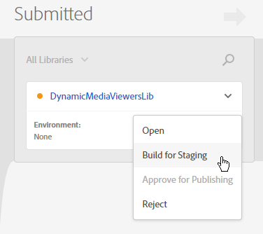

# 整合 Dynamic Media 檢視器與 Analytics 和 Adobe Experience Platform 標記 {#integrating-dynamic-media-viewers-with-adobe-analytics-and-adobe-launch}

## 什麼是Dynamic Media檢視器與Adobe Analytics和Experience Platform標籤整合？ {#what-is-dynamic-media-viewers-integration-with-adobe-analytics-and-adobe-launch}

<!-- Leave this hidden path here; it points to the topic source from Sasha https://wiki.corp.adobe.com/pages/viewpage.action?spaceKey=~oufimtse&title=Dynamic+Media+Viewers+integration+with+Adobe+Launch 

name used to be Experience Platform Launch. Changed to Experience Platform Data Collection-->

*Dynamic Media檢視器* 「Experience Platform標籤」和「Dynamic Media檢視器5.13」的擴充功能可讓Adobe Analytics和「Experience Platform標籤」客戶在「Experience Platform標籤」設定中使用Dynamic Media檢視器專屬的事件和資料。

這項整合表示您可以透過Adobe Analytics追蹤Dynamic Media檢視器在您網站上的使用情況。 同時，您可以將檢視器公開的事件和資料與來自Adobe或第三方的任何其他Experience Platform標籤擴充功能搭配使用。

若要深入了解Adobe擴充功能或協力廠商擴充功能，請參閱 [Adobe擴充功能](https://experienceleague.adobe.com/docs/experience-platform/tags/extensions/overview.html) (在「Experience Platform標籤」使用指南中)。

**本主題旨在：** 網站管理員、Adobe Experience Manager計畫的開發人員和營運人員。

### 整合的限制 {#limitations-of-the-integration}

* Dynamic Media檢視器的Experience Platform標籤整合無法在Experience Manager製作節點中運作。 在WCM頁面發佈前，您無法看到任何追蹤。
* Dynamic Media檢視器的Experience Platform標籤整合不支援「快顯」操作模式，即使用「資產詳細資料」頁面上的「URL」按鈕取得檢視器URL。
* Experience Platform標籤整合無法與舊版檢視器Analytics整合同時使用(透過 `config2=` 參數)。
* 視訊追蹤支援僅限於核心播放追蹤，如 [追蹤概述](https://experienceleague.adobe.com/docs/media-analytics/using/tracking/track-av-playback/track-core-overview.html?lang=en#player-events). 尤其是不支援QoS、廣告、章節/區段或錯誤追蹤。
* 資料元素不支援使用 *Dynamic Media檢視器* 擴充功能。 儲存持續時間必須設定為 **[!UICONTROL 無]**.

### 整合的使用案例 {#use-cases-for-the-integration}

與「Experience Platform標籤」整合的主要使用案例是同時使用Experience Manager Assets和Experience Manager Sites的客戶。 在這類情況下，您可以在Experience Manager製作節點和Experience Platform標籤之間設定標準整合，然後將您的Sites例項與Experience Platform標籤屬性建立關聯。 之後，任何新增至Sites頁面的Dynamic Media WCM元件都會追蹤檢視器的資料和事件。

請參閱 [在Experience Manager Sites中追蹤Dynamic Media檢視器](#tracking-dynamic-media-viewers-in-aem-sites).

整合支援的次要使用案例為僅使用Experience Manager Assets或Dynamic Media Classic的客戶。 在這種情況下，您會取得檢視器的內嵌程式碼，並將其新增至網站頁面。 然後，從「Experience Platform標籤」中取得「Experience Platform標籤」程式庫生產URL，並手動將其新增至網頁程式碼。

請參閱 [使用內嵌程式碼追蹤Dynamic Media檢視器](#tracking-dynamic-media-viewers-using-embed-code).

## 資料和事件追蹤在整合中的運作方式 {#how-data-and-event-tracking-works-in-the-integration}

此整合利用兩種不同且獨立的Dynamic Media檢視器追蹤類型： *Adobe Analytics* 和 *Adobe Analytics for Audio and Video*.

### 關於使用Adobe Analytics追蹤  {#about-tracking-using-adobe-analytics}

Adobe Analytics可讓您追蹤使用者在您網站上與Dynamic Media檢視器互動時所執行的動作。 Adobe Analytics也可讓您追蹤檢視器專屬的資料。 例如，您可以追蹤並記錄檢視載入事件以及資產名稱、發生的任何縮放動作，以及視訊播放動作。

在Experience Platform標籤中， *資料元素* 和 *規則* 共同啟用Adobe Analytics追蹤。

#### 關於Experience Platform標籤中的資料元素 {#about-data-elements-in-adobe-launch}

「Experience Platform標籤」中的「資料元素」是指定的屬性，其值會靜態定義，或根據網頁或Dynamic Media檢視器資料的狀態動態計算。

「資料元素」定義可用的選項取決於「Experience Platform標籤」屬性中安裝的擴充功能清單。 「核心」擴充功能已預先安裝，且可在任何設定中立即使用。 此「核心」擴充功能可定義資料元素，其值來自Cookie、JavaScript程式碼、查詢字串和許多其他來源。

針對Adobe Analytics追蹤，必須安裝數個其他擴充功能，如 [安裝及設定擴充功能](#installing-and-setup-of-extensions). Dynamic Media檢視器擴充功能新增了定義資料元素的功能，該值是動態檢視器事件的引數。 例如，可參考檢視器類型或檢視器在載入時報告的資產名稱、使用者縮放時報告的縮放等級等等。

Dynamic Media檢視器擴充功能會自動保留其資料元素的值為最新。

定義資料元素後，您就可以使用資料元素選擇器Widget，在Experience Platform標籤UI的其他位置使用資料元素。 尤其是為Dynamic Media檢視器追蹤目的而定義的資料元素，是由規則中Adobe Analytics擴充功能的「設定變數動作」參照（請參閱下方）。

請參閱 [資料元素](https://experienceleague.adobe.com/docs/experience-platform/tags/ui/data-elements.html) (在「Experience Platform標籤」使用指南中)。

#### 關於Experience Platform標籤中的規則 {#about-rules-in-adobe-launch}

「Experience Platform標籤」中的規則是一種多種結構的設定，定義組成規則的三個區域： *事件*, *條件*，和 *動作*:

* *事件* (if)告知Experience Platform標籤何時觸發規則。
* *條件* (if)告知Experience Platform標籤觸發規則時要允許或不允許的其他限制。
* *動作* (then)告訴Experience Platform標籤觸發規則時該做什麼。

「事件」、「條件」和「動作」區段中可用的選項，取決於「Experience Platform標籤屬性」中安裝的擴充功能。 此 *核心* 擴充功能已預先安裝，且可在任何設定中立即使用。 擴充功能提供事件的數個選項，例如基本的瀏覽器層級動作，包括焦點變更、按下按鍵和表單提交。 也包含條件選項，例如Cookie值、瀏覽器類型等。 若為「動作」，則只有「自訂程式碼」選項可供使用。

針對Adobe Analytics追蹤，必須安裝數個其他擴充功能，如 [安裝及設定擴充功能](#installing-and-setup-of-extensions). 具體說明：

* Dynamic Media檢視器擴充功能將支援的事件清單延伸至Dynamic Media檢視器專屬的事件，例如檢視器載入、資產交換、放大和視訊播放。
* Adobe Analytics擴充功能擴充了支援動作的清單，其中包含傳送資料至追蹤伺服器所需的兩個動作： *設定變數* 和 *傳送信標*.

若要追蹤Dynamic Media檢視器，可使用下列任何類型：

* 來自Dynamic Media檢視器擴充功能、核心擴充功能或任何其他擴充功能的事件。
* 規則定義中的條件。 或者，您可以將條件區域保留為空白。

在「動作」區段中，您必須具備 *設定變數* 動作。 此動作會告訴Adobe Analytics如何將資料填入追蹤變數。 同時， *設定變數* 動作不會傳送任何內容至追蹤伺服器。

此 *設定變數* 動作後面必須有 *傳送信標* 動作。 此 *傳送信標* 動作會實際將資料傳送至analytics追蹤伺服器。 兩個動作， *設定變數* 和 *傳送信標*，來自Adobe Analytics擴充功能。

請參閱 [規則](https://experienceleague.adobe.com/docs/experience-platform/tags/ui/rules.html) (在「Experience Platform標籤」使用指南中)。

#### 設定範例 {#sample-configuration}

下列Experience Platform標籤中的範例設定示範如何在檢視器載入時追蹤資產名稱。

1. 從 **[!UICONTROL 資料元素]** 索引標籤，定義資料元素 `AssetName` 引用 `asset` 參數 `LOAD` 事件。

   

1. 從 **[!UICONTROL 規則]** 標籤，定義規則 *TrackAssetOnLoad*.

   在此規則中， **[!UICONTROL 事件]** 欄位使用 **[!UICONTROL 載入]** 事件。

   

1. 「動作」設定有來自Adobe Analytics擴充功能的兩種「動作」類型：

   *設定變數*，會將您選取的analytics變數對應至 `AssetName` 資料元素。

   *傳送信標*，會將追蹤資訊傳送至Adobe Analytics。

   

1. 產生的規則設定如下所示：

   

### 關於Adobe Analytics for Audio and Video {#about-adobe-analytics-for-audio-and-video}

訂閱Experience Cloud帳戶後，即可使用Adobe Analytics for Audio and Video，這足以在 *Dynamic Media檢視器* 擴充功能設定。 視訊量度可在Adobe Analytics中使用。 視訊追蹤取決於是否有Adobe MediumAnalytics for Audio and Video擴充功能。

請參閱 [安裝及設定擴充功能](#installing-and-setup-of-extensions).

目前，視訊追蹤的支援僅限於「核心播放」追蹤，如 [追蹤概述](https://experienceleague.adobe.com/docs/media-analytics/using/tracking/track-av-playback/track-core-overview.html?lang=en#player-events). 尤其是不支援QoS、廣告、章節/區段或錯誤追蹤。

## 使用Dynamic Media Viewers擴充功能 {#using-the-dynamic-media-viewers-extension}

如 [整合的使用案例](#use-cases-for-the-integration)，即可透過Experience Manager Sites中的新「Experience Platform標籤」整合及使用內嵌程式碼來追蹤Dynamic Media檢視器。

### 在Experience Manager Sites中追蹤Dynamic Media檢視器 {#tracking-dynamic-media-viewers-in-aem-sites}

若要在Experience Manager Sites中追蹤Dynamic Media檢視器， [配置所有整合元件](#configuring-all-the-integration-pieces) 區段。 具體來說，您必須建立IMS設定和Experience Platform標籤雲端設定。

在正確設定後，您使用Dynamic Media支援的WCM元件新增至Sites頁面的任何Dynamic Media檢視器，都會自動追蹤Adobe Analytics或Adobe Analytics的視訊資料，或兩者皆有。

請參閱 [使用Dynamic Media Sites將Adobe新增至頁面](/help/assets/dynamic-media/adding-dynamic-media-assets-to-pages.md).

### 使用內嵌程式碼追蹤Dynamic Media檢視器 {#tracking-dynamic-media-viewers-using-embed-code}

若客戶未使用Experience Manager Sites，或將Dynamic Media檢視器內嵌至Experience Manager Sites以外的網頁或兩者皆不使用，仍可使用Experience Platform標籤整合。

完成下列配置步驟： [設定Adobe Analytics](#configuring-adobe-analytics-for-the-integration) 和 [設定Experience Platform標籤](#configuring-adobe-launch-for-the-integration) 區段。 不過，不需要Experience Manager相關的設定步驟。

在正確設定後，您可以使用Dynamic Media檢視器將Experience Platform標籤支援新增至網頁。

請參閱 [新增Experience Platform標籤內嵌程式碼](https://experienceleague.adobe.com/docs/platform-learn/implement-in-websites/configure-tags/add-embed-code.html) 若要進一步了解如何使用Experience Platform標籤程式庫內嵌程式碼。

若要進一步了解如何使用Experience ManagerDynamic Media的內嵌程式碼功能，請參閱 [將視訊或影像檢視器內嵌在網頁上](/help/assets/dynamic-media/embed-code.md).

**使用內嵌程式碼追蹤Dynamic Media檢視器：**

1. 為內嵌Dynamic Media檢視器的網頁做好準備。
1. 先登入「Experience Platform標籤」，取得「Experience Platform標籤」程式庫的內嵌程式碼(請參閱 [設定Experience Platform標籤](#configuring-adobe-launch-for-the-integration))。
1. 選擇 **[!UICONTROL 屬性]**，然後選取 **[!UICONTROL 環境]** 標籤。
1. 挑選與網頁環境相關的環境層級。 然後，在 **[!UICONTROL 安裝]** 欄，選擇框表徵圖。
1. **[!UICONTROL 在Web安裝說明中]** 對話方塊，複製完整的Experience Platform標籤程式庫內嵌程式碼以及周圍的 `<script/>` 標籤。

## Dynamic Media檢視器擴充功能參考指南 {#reference-guide-for-the-dynamic-media-viewers-extension}

### 關於Dynamic Media檢視器設定 {#about-the-dynamic-media-viewers-configuration}

如果下列條件為true,Dynamic Media檢視器擴充功能會自動與Experience Platform標籤程式庫整合：

* Experience Platform標籤庫全局對象( `_satellite`)存在於頁面上。
* Dynamic Media檢視器擴充功能 `_dmviewers_v001()` 定義於 `_satellite`.

* `config2=` 檢視器參數未指定，這表示檢視器不使用舊版Analytics整合。

此外，也可以選擇透過指定 `launch=0` 參數。 此參數的預設值為 `1`.

### 設定Dynamic Media Viewers擴充功能 {#configuring-the-dynamic-media-viewers-extension}

Dynamic Media檢視器擴充功能的唯一設定選項是 **[!UICONTROL 啟用Adobe MediumAnalytics for Audio and Video]**.

當您勾選（啟用）此選項，並安裝及設定「Adobe MediumAnalytics for Audio and Video」擴充功能時，視訊播放量度會傳送至Adobe Analytics for Audio and Video解決方案。 停用此選項會關閉視訊追蹤。

如果啟用此選項 *無* 已安裝Adobe MediumAnalytics for Audio and Video擴充功能，選項沒有作用。

### 關於Dynamic Media檢視器擴充功能中的資料元素 {#about-data-elements-in-the-dynamic-media-viewers-extension}

「動態媒體檢視器」擴充功能提供的唯一「資料元素」類型是「資 **[!UICONTROL 料元素類型」下拉式清單中的「檢]****** 視器事件」。

選取後，資料元素編輯器會轉譯包含兩個欄位的表單：

* **[!UICONTROL DM檢視器事件資料類型]** -一個下拉式清單，可識別動態媒體檢視器擴充功能支援的所有檢視器事件 (具有引數)，加上特殊的 **[!UICONTROL COMMON]** 項目。COMMON **** 項目代表檢視器所傳送之所有類型事件的共同事件參數清單。
* **[!UICONTROL 追蹤參數]**  — 所選Dynamic Media檢視器事件的引數。

請參閱 [Dynamic Media檢視器參考指南](https://experienceleague.adobe.com/docs/dynamic-media-developer-resources/library/viewers-aem-assets-dmc/c-html5-s7-aem-asset-viewers.html) 以取得每個檢視器類型支援的事件清單；前往「特定檢視器」區段，然後選取「支援Adobe Analytics追蹤」區段。 目前，Dynamic Media檢視器參考指南不會記錄事件引數。

現在來看看Dynamic Media檢視器的生命週期 *資料元素*. 此類「資料元素」的值會在頁面上發生對應的Dynamic Media檢視器事件後填入。 例如，假設資料元素指向 **[!UICONTROL 載入]** 事件及其「asset」引數。 檢視器首次執行LOAD事件後，此類資料元素的值會接收有效資料。 如果資料元素指向 **[!UICONTROL 縮放]** 事件及其「scale」引數中，此類資料元素的值會維持空白，直到檢視器傳送 **[!UICONTROL 縮放]** 事件。

同樣地，當檢視器在頁面上傳送對應事件時，資料元素的值也會自動更新。即使未在規則設定中指定特定事件，也會進行值更新。例如，假設資料元素 **[!UICONTROL 縮放比例]** 是針對ZOOM事件的「縮放」參數定義。 不過，規則設定中唯一存在的規則是由 **[!UICONTROL 載入]** 事件。 的值 **[!UICONTROL 縮放比例]** 每次使用者在檢視器內執行縮放時，仍會更新。

任何動態媒體檢視器在網頁上都有唯一識別碼。「資料元素」會追蹤值本身，以及填入值的檢視器。 例如，假設同一頁面上有數個檢視器，且 **[!UICONTROL AssetName]** 指向 **[!UICONTROL 載入]** 事件及其「asset」引數。 此 **[!UICONTROL AssetName]** 「資料元素」會維護與頁面上載入的每個檢視器相關聯的資產名稱集合。

資料元素傳回的確切值取決於內容。 如果在由Dynamic Media檢視器事件觸發的規則中請求資料元素，則會為啟動規則的檢視器傳回資料元素值。 而且，資料元素是在某個其他Experience Platform標籤擴充功能的事件所觸發的規則中請求。 此時，資料元素的值會來自上次更新此資料元素的檢視器。

**請考量下列範例設定：**

* 具有兩個Dynamic Media縮放檢視器的網頁： *viewer1* 和 *viewer2*.

* **[!UICONTROL 縮放比例]** 資料元素指向 **[!UICONTROL 縮放]** 事件及其「規模」引數。
* **[!UICONTROL TrackPan]** 規則，包含下列項目：

   * 使用Dynamic Media檢視器 **[!UICONTROL 潘]** 事件。
   * 傳送 **[!UICONTROL 縮放比例]** 資料元素轉換為Adobe Analytics。

* **[!UICONTROL TrackKey]** 規則，包含下列項目：

   * 使用核心Experience Platform標籤擴充功能的按鍵事件作為觸發器。
   * 傳送 **[!UICONTROL 縮放比例]** 資料元素轉換為Adobe Analytics。

現在，假設使用者載入包含兩個檢視器的網頁。 在 *viewer1*&#x200B;放大到50%;然後，在 *viewer2*&#x200B;放大到25%。 在 *viewer1*，它們會平移影像，最後按鍵盤上的鍵。

一般使用者的活動會導致對Adobe Analytics進行下列兩個追蹤呼叫：

* 第一次呼叫的發生原因是 **[!UICONTROL TrackPan]** 當使用者在 *viewer1*. 該呼叫會傳送50%作為 **[!UICONTROL 縮放比例]** 資料元素，因為資料元素知道規則是由 *viewer1* 並提取相應的刻度值；
* 第二個呼叫的發生原因是 **[!UICONTROL TrackKey]** 當使用者按下鍵盤上的鍵時，便會觸發規則。 該呼叫會傳送25%作為 **[!UICONTROL 縮放比例]** 資料元素，因為檢視器未觸發規則。 因此，資料元素會傳回最新的值。

上述設定的範例也會影響「資料元素」值的壽命。 即使檢視器本身已放置在網頁上，由Dynamic Media檢視器管理的「資料元素」值仍會儲存在「Experience Platform標籤」程式庫程式碼中。 此功能表示，如果有非Dynamic Media檢視器擴充功能觸發的規則並參考這類資料元素，資料元素會傳回最後一個已知值。 即使檢視器不再存在於網頁上。

無論如何，由Dynamic Media檢視器驅動的資料元素值不會儲存在本機儲存體或伺服器上；而是只會保留在用戶端Experience Platform標籤程式庫中。 當網頁重新載入時，這類資料元素的值會消失。

資料元素編輯器通常支援 [儲存期間選擇](https://experienceleague.adobe.com/docs/experience-platform/tags/ui/data-elements.html#create-a-data-element). 不過，使用Dynamic Media檢視器擴充功能的資料元素僅支援的儲存期間選項 **[!UICONTROL 無]**. 在使用者介面中可設定任何其他值，但在此情況下未定義資料元素行為。 擴充功能會自行管理資料元素的值：在整個檢視器生命週期中維護檢視器事件引數值的資料元素。

### 關於Dynamic Media檢視器擴充功能中的規則 {#about-rules-in-the-dynamic-media-viewers-extension}

在規則編輯器中，擴充功能會為事件編輯器新增設定選項。 此外，編輯器也提供選項，讓您以簡短選項的形式手動參考動作編輯器中的事件參數，而非使用預先設定的資料元素。

#### 關於事件編輯器 {#about-the-events-editor}

在事件編輯器中，Dynamic Media檢視器擴充功能會新增 **[!UICONTROL 事件類型]** 呼叫 **[!UICONTROL 檢視器事件]**.

選取時，事件編輯器會轉譯下拉式清單 **[!UICONTROL Dynamic Media檢視器事件]**，列出Dynamic Media檢視器支援的所有可用事件。

#### 關於動作編輯器 {#about-the-actions-editor}

Dynamic Media檢視器擴充功能可讓您使用Dynamic Media檢視器的事件參數，對應至Adobe Analytics擴充功能的「設定變數」編輯器中的分析變數。

最簡單的方法是完成下列兩步驟程式：

* 首先，定義一或多個資料元素，其中每個資料元素代表Dynamic Media檢視器事件的參數。
* 最後，在Adobe Analytics擴充功能的「設定變數」編輯器中，選取「資料元素」選取器圖示（三個堆疊磁碟）以開啟「選取資料元素」對話方塊，然後從中選取資料元素。

不過，您也可以使用替代方法並略過「資料元素」的建立。您可以直接參考Dynamic Media檢視器事件的引數。 在 **[!UICONTROL value]** Analytics變數指派的輸入欄位。 請務必加上百分比(%)符號。 例如，

`%event.detail.dm.LOAD.asset%`

使用資料元素和直接事件引數參考之間有重要的差異。 對於資料元素，哪個事件觸發「設定變數」動作並不重要。 觸發規則的事件可能與動態檢視器無關（例如從核心擴充功能中選取網頁）。 但是，使用直接引數參考時，請務必確保觸發規則的事件與其參考的事件引數相對應。

例如，如果 `%event.detail.dm.LOAD.asset%` 規則是由動態媒體檢視器擴充功能的 **[!UICONTROL LOAD]** 事件觸發，則參照會傳回正確的資產名稱。但是，它會傳回任何其他事件的空白值。

下表列出Dynamic Media檢視器事件及其支援的引數：

<table>
 <tbody>
  <tr>
   <td>檢視器事件名稱</td>
   <td>引數參考</td>
  </tr>
  <tr>
   <td><code>COMMON</code></td>
   <td><code>%event.detail.dm.objID%</code></td>
  </tr>
  <tr>
   <td> </td>
   <td><code>%event.detail.dm.compClass%</code></td>
  </tr>
  <tr>
   <td> </td>
   <td><code>%event.detail.dm.instName%</code></td>
  </tr>
  <tr>
   <td> </td>
   <td><code>%event.detail.dm.timeStamp%</code></td>
  </tr>
  <tr>
   <td><code>BANNER</code> </td>
   <td><code>%event.detail.dm.BANNER.asset%</code></td>
  </tr>
  <tr>
   <td> </td>
   <td><code>%event.detail.dm.BANNER.frame%</code></td>
  </tr>
  <tr>
   <td> </td>
   <td><code>%event.detail.dm.BANNER.label%</code></td>
  </tr>
  <tr>
   <td><code>HREF</code></td>
   <td><code>%event.detail.dm.HREF.rollover%</code></td>
  </tr>
  <tr>
   <td><code>ITEM</code></td>
   <td><code>%event.detail.dm.ITEM.rollover%</code></td>
  </tr>
  <tr>
   <td><code>LOAD</code></td>
   <td><code>%event.detail.dm.LOAD.applicationname%</code></td>
  </tr>
  <tr>
   <td><strong> </strong></td>
   <td><code>%event.detail.dm.LOAD.asset%</code></td>
  </tr>
  <tr>
   <td><strong> </strong></td>
   <td><code>%event.detail.dm.LOAD.company%</code></td>
  </tr>
  <tr>
   <td><strong> </strong></td>
   <td><code>%event.detail.dm.LOAD.sdkversion%</code></td>
  </tr>
  <tr>
   <td><strong> </strong></td>
   <td><code>%event.detail.dm.LOAD.viewertype%</code></td>
  </tr>
  <tr>
   <td><strong> </strong></td>
   <td><code>%event.detail.dm.LOAD.viewerversion%</code></td>
  </tr>
  <tr>
   <td><code>METADATA</code></td>
   <td><code>%event.detail.dm.METADATA.length%</code></td>
  </tr>
  <tr>
   <td> </td>
   <td><code>%event.detail.dm.METADATA.type%</code></td>
  </tr>
  <tr>
   <td><code>MILESTONE</code></td>
   <td><code>%event.detail.dm.MILESTONE.milestone%</code></td>
  </tr>
  <tr>
   <td><code>PAGE</code></td>
   <td><code>%event.detail.dm.PAGE.frame%</code></td>
  </tr>
  <tr>
   <td> </td>
   <td><code>%event.detail.dm.PAGE.label%</code></td>
  </tr>
  <tr>
   <td><code>PAUSE</code></td>
   <td><code>%event.detail.dm.PAUSE.timestamp%</code></td>
  </tr>
  <tr>
   <td><code>PLAY</code></td>
   <td><code>%event.detail.dm.PLAY.timestamp%</code></td>
  </tr>
  <tr>
   <td><code>SPIN</code></td>
   <td><code>%event.detail.dm.SPIN.framenumber%</code></td>
  </tr>
  <tr>
   <td><code>STOP</code></td>
   <td><code>%event.detail.dm.STOP.timestamp%</code></td>
  </tr>
  <tr>
   <td><code>SWAP</code></td>
   <td><code>%event.detail.dm.SWAP.asset%</code></td>
  </tr>
  <tr>
   <td><code>SWATCH</code></td>
   <td><code>%event.detail.dm.SWATCH.frame%</code></td>
  </tr>
  <tr>
   <td> </td>
   <td><code>%event.detail.dm.SWATCH.label%</code></td>
  </tr>
  <tr>
   <td><code>TARG</code></td>
   <td><code>%event.detail.dm.TARG.frame%</code></td>
  </tr>
  <tr>
   <td> </td>
   <td><code>%event.detail.dm.TARG.label%</code></td>
  </tr>
  <tr>
   <td><code>ZOOM</code></td>
   <td><code>%event.detail.dm.ZOOM.scale%</code></td>
  </tr>
 </tbody>
</table>

## 配置所有整合元件 {#configuring-all-the-integration-pieces}

**開始之前**

Adobe建議您仔細檢閱本節之前的所有檔案，以了解完整的整合。

本節說明整合Dynamic Media檢視器與Adobe Analytics和Adobe Analytics for Audio and Video所需的設定步驟。 雖然可在「Experience Platform標籤」中將Dynamic Media檢視器擴充功能用於其他用途，但本檔案未涵蓋這類案例。

您將使用下列Adobe產品來設定整合：

* Adobe Analytics — 用來設定追蹤變數和報表。
* Experience Platform標籤 — 用來定義屬性、一或多個規則及一或多個資料元素，以啟用檢視器追蹤。

此外，如果此整合解決方案與Experience Manager Sites搭配使用，必須完成下列設定：

* [Adobe Developer Console](https://developer.adobe.com/console/home)  — 已為Experience Platform標籤建立整合。
* Experience Manager製作節點 — IMS設定和Experience Platform標籤雲端設定。

在設定中，請確定您擁有已啟用Adobe Analytics和Experience Platform標籤之Adobe Experience Cloud公司的存取權。

## 設定Adobe Analytics以進行整合 {#configuring-adobe-analytics-for-the-integration}

設定Adobe Analytics後，將針對整合設定下列項目：

* 報表套裝已就緒且已選取。
* Analytics變數可用來接收追蹤資料。
* 報表可用來檢視Adobe Analytics內收集的資料。

另請參閱 [Analytics實施指南](https://experienceleague.adobe.com/docs/analytics/implementation/home.html).

**若要設定Adobe Analytics以進行整合：**

1. 首先，從Experience Cloud存取Adobe Analytics [首頁](https://experience.adobe.com/#/home). 在功能表列中，選取頁面右上角附近的「解決方案」圖示（由三個點組成的表格），然後選取 **[!UICONTROL Analytics]**.

   

   現在選取報表套裝。

### 選取報表套裝 {#selecting-a-report-suite}

1. 在Adobe Analytics頁面的右上角，「搜尋報表」欄位的右側，從下拉式清單中選取正確的報表套裝。****&#x200B;如果有多個報表套裝可供使用，而您不確定要使用哪個報表套裝，請連絡您的Adobe Analytics管理員，以協助您選取要使用哪個報表套裝。

   在以下範例中，使用者建立的報表套裝名稱為 *DynamicMediaViewersExtensionDoc* 並從下拉式清單中選取。 報表套裝名稱僅是範例。 您最終選取的報表套裝名稱由您決定。

   如果沒有可用的報表套裝，您或您的Adobe Analytics管理員必須先建立報表套裝，才能繼續進行設定。

   請參閱 [報表與報表套裝](https://experienceleague.adobe.com/docs/analytics/admin/admin-tools/manage-report-suites/report-suites-admin.html) 和 [建立報表套裝](https://experienceleague.adobe.com/docs/analytics/admin/admin-tools/manage-report-suites/c-new-report-suite/t-create-a-report-suite.html).

   在Adobe Analytics中，報表套裝的管理方式為 **[!UICONTROL 管理]** > **[!UICONTROL 報表套裝]**.

   

   現在設定Adobe Analytics變數。

### 設定Adobe Analytics變數 {#setting-up-adobe-analytics-variables}

1. 指定一或多個您要用來追蹤網頁上Adobe Analytics檢視器行為的Dynamic Media變數。

   您可以使用Adobe Analytics支援的任何類型變數。 關於變數類型（如自訂流量）的決策 [prop]，轉換 [eVar])是由Analytics實作的特定需求所驅動。

   請參閱 [Prop和eVar概觀](https://experienceleague.adobe.com/docs/analytics/implementation/vars/page-vars/evar.html#vars).

   在本檔案中，只有自訂流量(prop)變數會被使用，因為這些變數會在網頁上發生動作後幾分鐘內，便可在Analytics報表中使用。

   若要啟用新的自訂流量變數，請在工具列的Adobe Analytics中，前往 **[!UICONTROL 管理]** > **[!UICONTROL 報表套裝]**.

1. 在 **[!UICONTROL 報表套裝管理器]** 頁，選擇正確的報表，然後在工具欄上，轉到 **[!UICONTROL 編輯設定]** > **[!UICONTROL 流量]** > **[!UICONTROL 流量變數]**.
1. 挑選未使用的變數，並為其指定描述性名稱( **[!UICONTROL 檢視器資產(prop 30)]**)，然後將「已啟用」欄中的下拉式方塊變更為「已啟用」。

   以下螢幕擷圖為自訂流量變數( **[!UICONTROL prop30]**)，以追蹤檢視器使用的資產名稱：

   

1. 在變數清單的底部，選取 **[!UICONTROL 儲存]**.

### 設定報表 {#setting-up-a-report}

1. 一般而言，在Adobe Analytics中設定報表是由特定專案需求所驅動。 因此，詳細的報表設定不在此整合的範圍內。

   不過，只要知道在Adobe Analytics中設定自訂流量變數後，自訂流量報表即可自動供您使用 **[設定Adobe Analytics變數](#setting-up-adobe-analytics-variables)**.

   例如， **[!UICONTROL 檢視器資產(prop 30)]** 變數可從「報表」功能表的 **[!UICONTROL 自訂流量]** > **[!UICONTROL 自訂流量21-30]** > **[!UICONTROL 檢視器資產(prop 30)]**.

   在檢視器資產(prop 30)建 **[!UICONTROL 立後立即造訪此報表]** ，不會顯示任何資料；在這個整合階段，就是預期的。

   

## 設定整合的Experience Platform標籤 {#configuring-adobe-launch-for-the-integration}

設定Experience Platform標籤後，將針對整合設定下列項目：

* 建立新屬性以將所有設定保持在一起。
* 擴充功能的安裝與設定。 屬性中安裝之所有擴充功能的用戶端程式碼會一併編譯至程式庫中。 網頁稍後會使用此程式庫。
* 資料元素和規則的設定。 此設定會定義要從Dynamic Media檢視器取得的資料、觸發追蹤邏輯的時機，以及在Adobe Analytics中傳送檢視器資料的位置。
* 程式庫的發佈。

**若要設定整合的Experience Platform標籤：**

1. 首先，從Experience Platform存取Experience Cloud標籤 [首頁](https://experience.adobe.com/#/home). 在功能表列中，選取頁面右上角附近的「解決方案」圖示（三乘三個點表格），然後選取 **[!UICONTROL 標籤]**.

   您也可以 [直接開啟Experience Platform標籤](https://launch.adobe.com/).

   

### 在Experience Platform標籤中建立屬性 {#creating-a-property-in-adobe-launch}

「Experience Platform標籤」中的屬性是已命名的設定，可保留所有設定。 會產生配置設定的程式庫，並發佈至不同的環境層級（開發、測試和生產）。

另請參閱 [設定點選屬性](https://experienceleague.adobe.com/docs/platform-learn/implement-mobile-sdk/initial-configuration/configure-tags.html).

**若要在Experience Platform標籤中建立屬性：**

1. 在Experience Platform標籤中，選取 **[!UICONTROL 新屬性]**.
1. 在「建 **[!UICONTROL 立屬性]** 」對話方塊的「名稱 **** 」欄位中，輸入描述性名稱，例如網站的標題。例如， `DynamicMediaViewersProp.`
1. 在 **[!UICONTROL 網域]** 欄位，輸入網站的網域。
1. 在「進 **[!UICONTROL 階選項]** 」下拉式清單中，啟用「設定擴充功能」開發 (以後無法修改) ******，以備您要使用的擴充功能 (在本例中為「動態媒體檢視器」) 尚未發行時使用。

   

1. 選取&#x200B;**[!UICONTROL 儲存]**。

   選取新建立的屬性，然後繼續 *安裝及設定擴充功能*.

### 安裝及設定擴充功能 {#installing-and-setup-of-extensions}

「Experience Platform標籤」中的所有可用擴充功能會列在 **[!UICONTROL 擴充功能]** > **[!UICONTROL 目錄]**.

若要安裝擴充功能，請選取 **[!UICONTROL 安裝]**. 視需要執行一次性擴充功能設定，然後選取 **[!UICONTROL 儲存]**.

視需要，必須安裝並設定下列擴充功能：

* （必要） *Experience CloudID服務* 擴充功能

無需額外設定，接受任何建議的值。 完成後，請務必選取 **[!UICONTROL 儲存]**.

請參閱 [Experience CloudIdentity Service擴充功能](https://experienceleague.adobe.com/docs/experience-platform/tags/extensions/client/id-service/overview.html).

* （必要） *Adobe Analytics* 擴充功能

若要設定此擴充功能，您需要位於下方的Adobe Analytics中的報表套裝ID: **[!UICONTROL 管理]** > **[!UICONTROL 報表套裝]**，在 **[!UICONTROL 報表套裝ID]** 欄標題。

(僅供展示之用， **[!UICONTROL DynamicMediaViewersExtensionDoc]** 報表套裝用於下列螢幕擷取畫面。 此ID已建立並用於 [選取報表套裝](#selecting-a-report-suite) 。)

在「安裝擴充功能」頁面的「開發報表套裝」欄位中，輸入「報表套裝ID」。此欄位包括「 **[!UICONTROL 測試報表套裝」欄位和「]** 生產報表套裝 ******** 」欄位。

*只有在您要使用視訊追蹤時，才設定下列項目：*

在 **[!UICONTROL 安裝擴充功能]** 頁面，展開 **[!UICONTROL 一般]**，然後指定追蹤伺服器。 追蹤伺服器會遵循範本 `<trackingNamespace>.sc.omtrdc.net`，其中 `<trackingNamespace>` 是在布建電子郵件中取得的資訊。

選取&#x200B;**[!UICONTROL 儲存]**。

請參閱 [Adobe Analytics擴充功能](https://experienceleague.adobe.com/docs/experience-platform/tags/extensions/client/analytics/overview.html).

* (選用. 只有在需要視訊追蹤時才需要) *Adobe MediumAnalytics for Audio and Video* 擴充功能

填寫追蹤伺服器欄位。 的追蹤伺服器 *Adobe MediumAnalytics for Audio and Video* 擴充功能與用於Adobe Analytics的追蹤伺服器不同。 它遵循範本 `<trackingNamespace>.hb.omtrdc.net`，其中 `<trackingNamespace>` 是布建電子郵件中的資訊。

所有其他欄位均為選用。

請參閱 [Adobe MediumAnalytics for Audio and Video擴充功能](https://experienceleague.adobe.com/docs/experience-platform/tags/extensions/client/media-analytics/overview.html).

* （必要） *Dynamic Media檢視器* 擴充功能

選取 **[!UICONTROL 啟用Adobe Analytics for Video]** ，以啟用 (開啟) 視訊心率追蹤。

至於本文， *Dynamic Media檢視器* 只有為開發建立「Experience Platform標籤屬性」時，才能使用擴充功能。

請參閱 [在Experience Platform標籤中建立屬性](#creating-a-property-in-adobe-launch).

安裝擴充功能並完成設定後，至少下列五個擴充功能（若您未追蹤視訊，則為四個）會列在「擴充功能>已安裝」區域中。

### 設定資料元素和規則 {#setting-up-data-elements-and-rules}

在「Experience Platform標籤」中，建立追蹤Dynamic Media檢視器所需的資料元素和規則。

請參閱 [資料和事件追蹤在整合中的運作方式](#how-data-and-event-tracking-works-in-the-integration) 以取得「Experience Platform標籤」追蹤的概觀。

請參閱 [設定範例](#sample-configuration) 「Experience Platform標籤」中的範例設定，示範如何在檢視器載入時追蹤資產名稱。

請參閱 [設定Dynamic Media Viewers擴充功能](#configuring-the-dynamic-media-viewers-extension) 以深入了解擴充功能的功能。

### 發佈程式庫 {#publishing-a-library}

若要變更「Experience Platform標籤」設定（包括設定的「屬性」、「擴充功能」、「規則」和「資料元素」），您必須 *發佈* 這種變化。 在「Experience Platform標籤」中發佈是從「屬性」設定下的「發佈」標籤執行。

Experience Platform標籤可能有多個開發環境、一個測試環境和一個生產環境。 依預設，Experience Manager中的「Experience Platform標籤雲端設定」會將Experience Manager製作節點指向「平台標籤」的「階段」環境。 「Experience Manager發佈」節點指向「Experience Platform標籤」的生產環境。 這表示使用預設的Experience Manager設定時，必須將Experience Platform標籤程式庫發佈至測試環境。 這麼做可讓您在Experience Manager作者中使用。 接著，您就可以將其發佈至生產環境，以便用於Experience Manager發佈。

請參閱 [環境](https://experienceleague.adobe.com/docs/experience-platform/tags/publish/environments/environments.html) 以取得Experience Platform標籤環境的詳細資訊。

發佈程式庫包含下列兩個步驟：

* 將所有必要的變更（新的變更和更新）加入程式庫，以新增和建置新程式庫。
* 在不同環境層級（從開發到測試和生產）中向上移動程式庫。

#### 新增並建置新程式庫 {#adding-and-building-a-new-library}

1. 第一次在「Experience Platform標籤」中開啟「發佈」索引標籤時，程式庫清單為空。

   在左欄中，選取 **[!UICONTROL 新增程式庫]**.

   

1. 在「建立新程式庫」頁面上， **[!UICONTROL 名稱]** 欄位中輸入新庫的描述性名稱。 例如，

   *DynamicMediaViewersLib*

   從「環境」下拉式清單中，選擇「環境」層級。 起初，僅可選取開發層級。 在頁面左下側附近，選取 **[!UICONTROL 新增所有已變更的資源]**.

   

1. 在頁面的右上角附近，選取 **[!UICONTROL 儲存並建置以供開發]**.

   幾分鐘後，程式庫就會建立並可供使用。

   

   >[!NOTE]
   >
   >下次您變更Experience Platform標籤設定時，請前往 **[!UICONTROL 發佈]** 標籤 **[!UICONTROL 屬性]** 設定，然後選取您先前建立的程式庫。
   >
   >
   >在程式庫發佈畫面中，選取 **[!UICONTROL 新增所有已變更的資源]**，然後選取 **[!UICONTROL 儲存並建置以供開發]**.

#### 在環境層級上移動程式庫 {#moving-a-library-up-through-environment-levels}

1. 新增程式庫後，即可在開發環境中找到。 若要將其移至測試環境層級（與已提交欄相對應），請從程式庫的下拉式功能表中選取 **[!UICONTROL 提交以進行核准]**.

   

1. 在確認對話方塊中，選取 **[!UICONTROL 提交]**.

   程式庫移至「已提交」欄後，從程式庫的下拉式功能表中選取 **[!UICONTROL 為測試環境建置]**.

   

1. 若要將程式庫從測試環境移至生產環境（即「已發佈」欄），請遵循類似的程式。

   首先，從下拉式功能表中選取 **[!UICONTROL 核准以發佈]**.

   

1. 從下拉式功能表中，選取 **[!UICONTROL 建置並發佈到生產環境]**.

   

   請參閱 [發佈](https://experienceleague.adobe.com/docs/experience-platform/tags/publish/overview.html) 以取得「Experience Platform標籤」中發佈程式的詳細資訊。

## 設定Adobe Experience Manager以進行整合 {#configuring-adobe-experience-manager-for-the-integration}

<!-- Prerequisites list below should be verified by Sasha -->

必備條件:

* Experience Manager同時執行製作和發佈執行個體。
* Experience Manager製作節點是在Dynamic Media中設定。 <!-- Scene7 run mode (dynamicmedia_s7) -->
* Dynamic Media WCM元件已在Experience Manager Sites中啟用。

Experience Manager設定包含下列兩個主要步驟：

* 設定Experience ManagerIMS
* Experience Platform標籤雲端的設定。

### 設定Experience ManagerIMS {#configuring-aem-ims}

1. 在Experience Manager作者中，選取「工具」圖示（槌子），然後前往 **[!UICONTROL 安全性]** > **[!UICONTROL Adobe IMS設定]**.

   

1. 在「AdobeIMC配置」頁的左上角附近，選擇 **[!UICONTROL 建立]**.
1. 在 **[!UICONTROL Adobe IMS技術帳戶設定]** 頁面，在 **[!UICONTROL 雲端解決方案]** 下拉清單，選擇 **[!UICONTROL Experience Platform資料收集]**.
1. 啟用 **[!UICONTROL 建立新憑證]**，然後在文字欄位中，為憑證輸入任何有意義的值。 例如， *AdobeLaunchIMSCert*. 選擇 **[!UICONTROL 建立憑證]**.

   將顯示以下資訊消息：

   *若要擷取有效的存取權杖，必須將新憑證的公開金鑰新增至Adobe Developer上的技術帳戶！*

   要關閉「資訊」對話框，請選擇 **[!UICONTROL 確定]**.

   

1. 選擇 **[!UICONTROL 下載公開金鑰]** 下載公開金鑰檔案(`*.crt`)傳至您的本機系統。

   >[!NOTE]
   >
   >此時， ***開啟*** the **[!UICONTROL Adobe IMS技術帳戶設定]** 頁面； ***不*** 關閉頁面，然後 ***不*** 選取 **[!UICONTROL 下一個]**. 您稍後將在步驟中返回此頁面。

   

1. 在新的瀏覽器標籤中，導覽至 [Adobe Developer Console](https://developer.adobe.com/console/integrations).

1. 從 **[!UICONTROL Adobe I/O主控台整合]** 頁面，在右上角附近，選取 **[!UICONTROL 新整合]**.
1. 在 **[!UICONTROL 建立新整合]** 對話框，確保 **[!UICONTROL 存取API]** 選擇單選按鈕，然後選擇 **[!UICONTROL 繼續]**.

1. 第二個 **[!UICONTROL 建立新整合]** 頁面，啟用（開啟） **[!UICONTROL Experience Platform標籤API]** 選項按鈕。 在頁面的右下角，選取 **[!UICONTROL 繼續]**.

   

1. 第三個 **[!UICONTROL 建立新整合]** 頁面，請執行下列動作：

   * 在 **[!UICONTROL 名稱]** 欄位中輸入描述性名稱。 例如， *DynamicMediaViewersIO*.

   * 在 **[!UICONTROL 說明]** 欄位，輸入整合的說明。

   * 在 **[!UICONTROL 公開金鑰憑證]** 區域，上傳公開金鑰檔案(`*.crt`)，以便您先前在這些步驟中下載。

   * 在 **[!UICONTROL 選取Experience Platform標籤API的角色]** 標題，選取 **[!UICONTROL 管理]**.

   * 在 **[!UICONTROL 為Experience Platform標籤API選取一或多個產品設定檔]** 標題中，選取名為的產品設定檔 **[!UICONTROL 標籤 —  &lt;your_company_name>]**.

   

1. 選擇 **[!UICONTROL 建立整合]**.
1. 在 **[!UICONTROL 已建立整合]** 頁面，選取 **[!UICONTROL 繼續前往整合詳細資訊]**.

   

1. 整合詳細資訊頁面隨即顯示，類似下列：

   >[!NOTE]
   >
   >***請離開此「整合詳細資訊」頁面***。您需要來自 **[!UICONTROL 概述]** 和 **[!UICONTROL JWT]** 一會兒就能發現。

   
   *整合詳細資訊頁面*

1. 返回您先前 **[!UICONTROL 未開啟的「Adobe IMS技術帳戶設定]** 」頁面。在頁面的右上角，選取 **[!UICONTROL 下一個]** 開啟 **[!UICONTROL 帳戶]** 頁面 **[!UICONTROL Adobe IMS技術帳戶設定]** 窗口。

   (如果您先前關閉頁面，請返回Experience Manager作者，然後前往 **[!UICONTROL 工具]** > **[!UICONTROL 安全性]** > **[!UICONTROL Adobe IMS設定]**. 選擇 **[!UICONTROL 建立]**。在 **[!UICONTROL 雲端解決方案]** 下拉清單，選擇 **[!UICONTROL Experience Platform標籤]**. 在「證 **[!UICONTROL 書]** 」下拉式清單中，選取先前建立之憑證的名稱。

   
   *Adobe IMS技術帳戶設定 — 憑證頁面*

1. 此 **[!UICONTROL 帳戶]** 頁面有5個欄位，需要您使用上一步「整合詳細資訊」頁面中的資訊來填寫。

   
   *Adobe IMS技術帳戶設定 — 帳戶頁面*

1. 在 **[!UICONTROL 帳戶]** 填入下列欄位：

   * **[!UICONTROL 標題]**  — 輸入描述性帳戶標題。
   * **[!UICONTROL 授權伺服器]**  — 返回您先前開啟的「整合詳細資訊」頁面。 選取 **[!UICONTROL JWT]** 標籤。 複製伺服器名稱（不含路徑），如下方強調顯示。

（範例伺服器名稱僅供說明之用）   返回「帳 **[!UICONTROL 戶]** 」頁面，然後將名稱貼到相應欄位。例如， `https://ims-na1.adobelogin.com/`
（範例伺服器名稱僅供說明之用）

   
   *整合詳細資料頁面 — JWT索引標籤*

1. **[!UICONTROL API金鑰]** -返回「整合詳細資訊」頁面。選取 **[!UICONTROL 概述]** ，然後在 **[!UICONTROL API金鑰（用戶端ID）]** 欄位，選擇 **[!UICONTROL 複製]**.

   返回「帳 **[!UICONTROL 戶]** 」頁面，然後將金鑰貼入個別欄位。

   
   *整合詳細資訊頁面*

1. **[!UICONTROL 用戶端密碼]**-返回「整合詳細資訊」頁面。從 **[!UICONTROL 概述]** 索引標籤，選取 **[!UICONTROL 擷取用戶端密碼]**. 在 **[!UICONTROL 用戶端密碼]** 欄位，選擇 **[!UICONTROL 複製]**.

   返回「帳 **[!UICONTROL 戶]** 」頁面，然後將金鑰貼入個別欄位。

1. **[!UICONTROL 裝載]**  — 返回「整合詳細資訊」頁面。 從 **[!UICONTROL JWT]** 標籤中，在「JWT裝載」欄位中，複製整個JSON物件程式碼。

   返回「帳 **[!UICONTROL 戶]** 」頁面，然後將程式碼貼至個別欄位。

   
   *整合詳細資訊頁面 — JWT索引標籤*

   「帳戶」頁面會顯示為類似下列：

   

1. 在 **[!UICONTROL 帳戶]** 頁面，選取 **[!UICONTROL 建立]**.

   設定Experience ManagerIMS後，您現在會在 **[!UICONTROL Adobe IMS設定]**.

   

## 設定Experience Platform標籤雲以進行整合 {#configuring-adobe-launch-cloud-for-the-integration}

1. 在Experience Manager作者中，在左上角附近，選取「工具」圖示（槌子），然後前往 **[!UICONTROL Cloud Services]** > **[!UICONTROL Experience Platform標籤設定]**.

   

1. 在 **[!UICONTROL Experience Platform標籤設定]** 頁面，在左側面板中，選取您要套用「Experience Manager標籤設定」的Experience Platform網站。

   僅供範例之用， **`We.Retail`** 螢幕擷取畫面中已選取網站。

   

1. 在頁面左上角附近，選取 **[!UICONTROL 建立]**.
1. 在 **[!UICONTROL 一般]** 第（1/3頁）頁 **[!UICONTROL 建立Experience Platform標籤設定]** ，請填寫以下欄位：

   * **[!UICONTROL 標題]**  — 輸入描述性配置標題。 例如， `We.Retail Tags cloud configuration`.

   * **[!UICONTROL 相關聯的Adobe IMS設定]**  — 選取您先前於 [設定Experience ManagerIMS](#configuring-aem-ims).

   * **[!UICONTROL 公司]**  — 從 **[!UICONTROL 公司]** 下拉式清單中，選取您的Experience Cloud公司。 清單會自動填入。

   * **[!UICONTROL 屬性]**  — 從「屬性」下拉式清單中，選取您先前建立的Experience Platform標籤屬性。 清單會自動填入。

填妥所有欄位後，您的 **[!UICONTROL 一般]** 頁面看起來會類似下列：

1. 在左上角附近，選取 **[!UICONTROL 下一個]**.
1. 在 **[!UICONTROL 測試]** 第（2/3頁）頁 **[!UICONTROL 建立Experience Platform標籤設定]** ，請填寫以下欄位：

   在 **[!UICONTROL 庫URI]** （統一資源識別碼）欄位，檢查Experience Platform標籤程式庫的測試版本位置。 Experience Manager會自動填入此欄位。

   此步驟僅供說明之用，會使用部署至AdobeCDN的Experience Platform標籤程式庫。

   >[!NOTE]
   >
   >檢查以確定自動填入的庫URI（統一資源標識符）的格式不正確。 如有必要，請修正它，使URI表示協定相對URI。 也就是說，從雙正斜線開始。
   >
   >
   >例如： `//assets.adobetm.com/launch-xxxx`.

   您的 **[!UICONTROL 測試]** 頁面的顯示可能類似下列。 此 **[!UICONTROL 封存]** 和 **[!UICONTROL 非同步載入程式庫]** 選項 ***not*** 設定：

   

1. 在右上角附近，選取 **[!UICONTROL 下一個]**.
1. 在 **[!UICONTROL 生產]** 第（3/3頁）頁 **[!UICONTROL 建立Experience Platform標籤設定]** 視窗，視需要修正自動填入的生產URI，類似於在上一個 **[!UICONTROL 測試]** 頁面。
1. 在右上角附近，選取 **[!UICONTROL 建立]**.

   您的新Experience Platform標籤雲端設定現在會建立並列在您的網站旁邊。

1. 選取新的「Experience Platform標籤雲端設定」（選取時，設定標題左側會顯示勾號）。 在工具列上，選取 **[!UICONTROL 發佈]**.

   

目前，Experience Manager作者不支援Dynamic Media檢視器與Experience Platform標籤的整合。

不過，Experience Manager發佈節點支援此功能。 Experience Manager發佈使用「Experience Platform標籤雲端設定」的預設設定，會使用「Experience Platform標籤」的生產環境。 因此，在測試期間，必須每次都將Experience Platform標籤程式庫更新從開發推送至生產環境。

您可以解決此限制。 在「Experience Platform標籤雲端」設定中，指定Experience Platform標籤程式庫的開發或測試URL，以便進行上述Experience Manager發佈。 這樣會使Experience Manager發佈節點使用「Experience Platform標籤」程式庫的開發或測試版本。

請參閱 [整合Experience Platform標籤和Experience Manager](https://experienceleague.adobe.com/docs/experience-manager-learn/sites/integrations/experience-platform-launch/overview.html#integrations) 以取得設定Experience Platform標籤雲端設定的詳細資訊。
