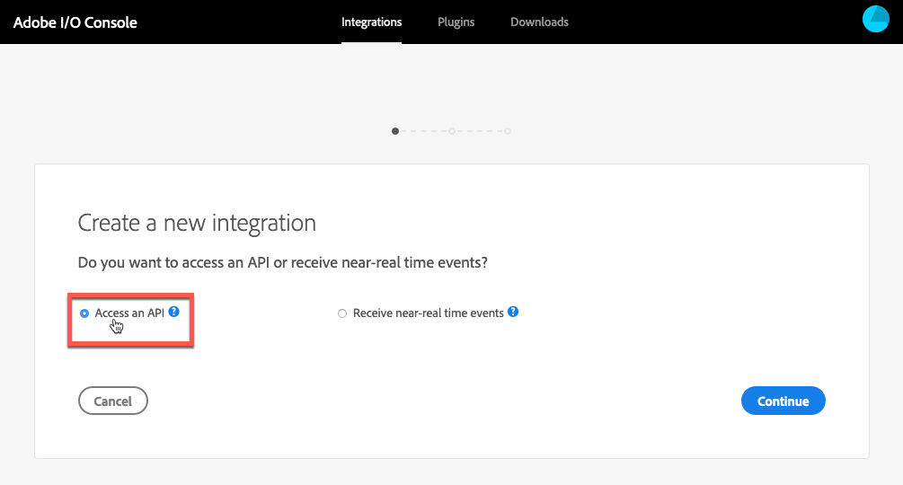

# 整合Dynamic Media檢視器與Adobe Analytics和Experience Platform標籤 {#integrating-dynamic-media-viewers-with-adobe-analytics-and-adobe-launch}

## 什麼是Dynamic Media檢視器與Adobe Analytics和Experience Platform標籤整合？ {#what-is-dynamic-media-viewers-integration-with-adobe-analytics-and-adobe-launch}

<!-- Leave this hidden path here; it points to the topic source from Sasha https://wiki.corp.adobe.com/pages/viewpage.action?spaceKey=~oufimtse&title=Dynamic+Media+Viewers+integration+with+Adobe+Launch 

name used to be Experience Platform Launch. Changed to Experience Platform Data Collection-->

*Dynamic Media* Viewers擴充功能適用於Experience Platform標籤和Dynamic Media檢視器5.13，可讓Adobe Analytics和Experience Platform標籤客戶在其Experience Platform標籤設定中使用Dynamic Media檢視器專屬的事件和資料。

這項整合表示您可以透過Adobe Analytics追蹤Dynamic Media檢視器在您網站上的使用情況。 同時，您可以將檢視器公開的事件和資料與來自Adobe或第三方的任何其他Experience Platform標籤擴充功能搭配使用。

若要深入了解Adobe擴充功能或協力廠商擴充功能，請參閱Experience Platform標籤使用手冊中的[Adobe擴充功能](https://experienceleague.adobe.com/docs/experience-platform/tags/extensions/overview.html)。

**本主題旨在下列用途：** 網站管理員、Adobe Experience Manager計畫的開發人員，以及營運人員。

### 整合的限制 {#limitations-of-the-integration}

* Dynamic Media檢視器的Experience Platform標籤整合無法在Experience Manager製作節點中運作。 在WCM頁面發佈前，您無法看到任何追蹤。
* Dynamic Media檢視器的Experience Platform標籤整合不支援「快顯」操作模式，即使用「資產詳細資料」頁面上的「URL」按鈕取得檢視器URL。
* Experience Platform標籤整合無法與舊版檢視器Analytics整合同時使用（透過`config2=`參數）。
* 視訊追蹤的支援僅限於核心播放追蹤，如[追蹤概述](https://experienceleague.adobe.com/docs/media-analytics/using/sdk-implement/track-av-playback/track-core-overview.html#player-events)所述。 尤其是不支援QoS、廣告、章節/區段或錯誤追蹤。
* 使用&#x200B;*Dynamic Media Viewers*&#x200B;擴充功能的資料元素不支援資料元素的儲存期間設定。 儲存持續時間必須設定為&#x200B;**[!UICONTROL 無]**。

### 整合的使用案例 {#use-cases-for-the-integration}

與「Experience Platform標籤」整合的主要使用案例是同時使用Experience Manager資產和Experience Manager網站的客戶。 在這類情況下，您可以在Experience Manager製作節點和Experience Platform標籤之間設定標準整合，然後將您的Sites例項與Experience Platform標籤屬性建立關聯。 之後，任何新增至Sites頁面的Dynamic Media WCM元件都會追蹤檢視器的資料和事件。

請參閱[在Experience Manager網站](#tracking-dynamic-media-viewers-in-aem-sites)中追蹤Dynamic Media檢視器。

整合支援的次要使用案例為僅使用Experience Manager資產或Dynamic Media Classic的客戶。 在這種情況下，您會取得檢視器的內嵌程式碼，並將其新增至網站頁面。 然後，從「Experience Platform標籤」中取得「Experience Platform標籤」程式庫生產URL，並手動將其新增至網頁程式碼。

請參閱使用內嵌程式碼](#tracking-dynamic-media-viewers-using-embed-code)追蹤Dynamic Media檢視器。[

## 資料和事件追蹤在整合中的運作方式 {#how-data-and-event-tracking-works-in-the-integration}

此整合利用兩種不同且獨立的Dynamic Media檢視器追蹤類型：*Adobe Analytics*&#x200B;和&#x200B;*Adobe Analytics for Audio and Video*。

### 關於使用Adobe Analytics追蹤  {#about-tracking-using-adobe-analytics}

Adobe Analytics可讓您追蹤使用者在您網站上與Dynamic Media檢視器互動時所執行的動作。 Adobe Analytics也可讓您追蹤檢視器專屬的資料。 例如，您可以追蹤並記錄檢視載入事件以及資產名稱、發生的任何縮放動作，以及視訊播放動作。

在「Experience Platform標籤」中，*資料元素*&#x200B;和&#x200B;*規則*&#x200B;的概念會共同運作，以啟用Adobe Analytics追蹤。

#### 關於Experience Platform標籤中的資料元素 {#about-data-elements-in-adobe-launch}

「Experience Platform標籤」中的「資料元素」是指定的屬性，其值會靜態定義，或根據網頁或Dynamic Media檢視器資料的狀態動態計算。

「資料元素」定義可用的選項取決於「Experience Platform標籤」屬性中安裝的擴充功能清單。 「核心」擴充功能已預先安裝，且可在任何設定中立即使用。 此「核心」擴充功能可定義資料元素，其值來自Cookie、JavaScript程式碼、查詢字串和許多其他來源。

針對Adobe Analytics追蹤，必須安裝數個其他擴充功能，如[擴充功能的安裝與設定](#installing-and-setup-of-extensions)所述。 Dynamic Media檢視器擴充功能新增了定義資料元素的功能，該值是動態檢視器事件的引數。 例如，可參考檢視器類型或檢視器在載入時報告的資產名稱、使用者縮放時報告的縮放等級等等。

Dynamic Media檢視器擴充功能會自動保留其資料元素的值為最新。

定義資料元素後，您就可以使用資料元素選擇器Widget，在Experience Platform標籤UI的其他位置使用資料元素。 尤其是為Dynamic Media檢視器追蹤目的而定義的資料元素，是由規則中Adobe Analytics擴充功能的「設定變數動作」參照（請參閱下方）。

請參閱Experience Platform標籤使用指南中的[資料元素](https://experienceleague.adobe.com/docs/experience-platform/tags/ui/data-elements.html)。

#### 關於Experience Platform標籤中的規則 {#about-rules-in-adobe-launch}

「Experience Platform標籤」中的規則是一種多種結構的設定，定義組成規則的三個區域：*事件*、*條件*&#x200B;和&#x200B;*操作*:

* *事件* (if)告知Experience Platform標籤何時觸發規則。
* *條件* (if)告知Experience Platform標籤觸發規則時，要允許或不允許的其他限制。
* *動作* (then)告知Experience Platform標籤觸發規則時該做什麼。

「事件」、「條件」和「動作」區段中可用的選項，取決於「Experience Platform標籤屬性」中安裝的擴充功能。 *核心*&#x200B;擴充功能已預先安裝，且可在任何設定中立即使用。 擴充功能提供事件的數個選項，例如基本的瀏覽器層級動作，包括焦點變更、按下按鍵和表單提交。 也包含條件選項，例如Cookie值、瀏覽器類型等。 對於「動作」，僅可使用「自訂程式碼」選項。

針對Adobe Analytics追蹤，必須安裝數個其他擴充功能，如[安裝與設定擴充功能](#installing-and-setup-of-extensions)中所述。 具體說明：

* Dynamic Media檢視器擴充功能將支援的事件清單延伸至Dynamic Media檢視器專屬的事件，例如檢視器載入、資產交換、放大和視訊播放。
* Adobe Analytics擴充功能擴充了支援動作的清單，其中包含傳送資料至追蹤伺服器所需的兩個動作：*設定變數*&#x200B;和&#x200B;*傳送信標*。

若要追蹤Dynamic Media檢視器，可使用下列任何類型：

* 來自Dynamic Media檢視器擴充功能、核心擴充功能或任何其他擴充功能的事件。
* 規則定義中的條件。 或者，您可以將條件區域保留為空白。

在「動作」區段中，您必須有&#x200B;*設定變數*&#x200B;動作。 此動作會告訴Adobe Analytics如何將資料填入追蹤變數。 同時，*設定變數*&#x200B;動作不會傳送任何內容至追蹤伺服器。

*設定變數*&#x200B;動作後面必須有&#x200B;*傳送信標*&#x200B;動作。 *傳送信標*&#x200B;動作實際上會將資料傳送至分析追蹤伺服器。 *設定變數*&#x200B;和&#x200B;*傳送信標*&#x200B;這兩個動作都來自Adobe Analytics擴充功能。

請參閱Experience Platform標籤使用指南中的[規則](https://experienceleague.adobe.com/docs/experience-platform/tags/ui/rules.html)。

#### 設定範例 {#sample-configuration}

下列Experience Platform標籤中的範例設定示範如何在檢視器載入時追蹤資產名稱。

1. 從&#x200B;**[!UICONTROL 資料元素]**&#x200B;標籤中，定義資料元素`AssetName`，該資料元素會從Dynamic Media檢視器擴充功能參照`LOAD`事件的`asset`參數。

   

1. 從&#x200B;**[!UICONTROL Rules]**&#x200B;標籤中，定義規則&#x200B;*TrackAssetOnLoad*。

   在此規則中，**[!UICONTROL Event]**&#x200B;欄位使用來自Dynamic Media檢視器擴充功能的&#x200B;**[!UICONTROL LOAD]**&#x200B;事件。

   

1. 「動作」設定有來自Adobe Analytics擴充功能的兩種「動作」類型：

   *設定變數*，將您選擇的分析變數對應至資料元素 `AssetName` 的值。

   *傳送信標*，這會將追蹤資訊傳送至Adobe Analytics。

   

1. 產生的規則設定如下所示：

   

### 關於Adobe Analytics for Audio and Video {#about-adobe-analytics-for-audio-and-video}

訂閱Experience Cloud帳戶以使用Adobe Analytics for Audio and Video時，就足以在&#x200B;*Dynamic Media Viewers*&#x200B;擴充功能設定中啟用視訊追蹤。 視訊量度可在Adobe Analytics中使用。 視訊追蹤取決於是否有Adobe MediumAnalytics for Audio and Video擴充功能。

請參閱[安裝及設定擴充功能](#installing-and-setup-of-extensions)。

目前，視訊追蹤的支援僅限於「核心播放」追蹤，如[追蹤概述](https://experienceleague.adobe.com/docs/media-analytics/using/sdk-implement/track-av-playback/track-core-overview.html#player-events)所述。 尤其是不支援QoS、廣告、章節/區段或錯誤追蹤。

## 使用Dynamic Media Viewers擴充功能 {#using-the-dynamic-media-viewers-extension}

如[整合的使用案例](#use-cases-for-the-integration)所述，您可以透過Experience Manager網站中的新Experience Platform標籤整合及使用內嵌程式碼來追蹤Dynamic Media檢視器。

### 在Experience Manager網站中追蹤Dynamic Media檢視器 {#tracking-dynamic-media-viewers-in-aem-sites}

若要在Experience Manager網站中追蹤Dynamic Media檢視器，必須執行[設定所有整合片段](#configuring-all-the-integration-pieces)區段下方列出的所有步驟。 具體來說，您必須建立IMS設定和Experience Platform標籤雲端設定。

在正確設定後，您使用Dynamic Media支援的WCM元件新增至Sites頁面的任何Dynamic Media檢視器，都會自動追蹤Adobe Analytics或Adobe Analytics的視訊資料，或兩者皆有。

請參閱[使用Dynamic Media Sites](/help/assets/dynamic-media/adding-dynamic-media-assets-to-pages.md)將Adobe資產新增至頁面。

### 使用內嵌程式碼追蹤Dynamic Media檢視器 {#tracking-dynamic-media-viewers-using-embed-code}

若客戶未使用Experience Manager網站，或將Dynamic Media檢視器內嵌至Experience Manager網站以外的網頁，或兩者皆未使用，仍可使用Experience Platform標籤整合。

完成[設定Adobe Analytics](#configuring-adobe-analytics-for-the-integration)和[設定Experience Platform標籤](#configuring-adobe-launch-for-the-integration)區段的設定步驟。 不過，不需要Experience Manager相關的設定步驟。

在正確設定後，您可以使用Dynamic Media檢視器將Experience Platform標籤支援新增至網頁。

請參閱[新增Experience Platform標籤內嵌程式碼](https://experienceleague.adobe.com/docs/launch-learn/implementing-in-websites-with-launch/configure-launch/launch-add-embed.html#configure-launch)以進一步了解如何使用Experience Platform標籤程式庫內嵌程式碼。

若要進一步了解如何使用Experience ManagerDynamic Media的內嵌程式碼功能，請參閱在網頁上內嵌視訊或影像檢視器](/help/assets/dynamic-media/embed-code.md)。[

**使用內嵌程式碼追蹤Dynamic Media檢視器：**

1. 為內嵌Dynamic Media檢視器的網頁做好準備。
1. 先登入「Experience Platform標籤」(請參閱[設定Experience Platform標籤](#configuring-adobe-launch-for-the-integration))，取得「Experience Platform標籤」程式庫的內嵌程式碼。
1. 選擇&#x200B;**[!UICONTROL 屬性]**，然後選擇&#x200B;**[!UICONTROL 環境]**&#x200B;頁簽。
1. 挑選與網頁環境相關的環境層級。 然後，在&#x200B;**[!UICONTROL Install]**&#x200B;列中，選擇框表徵圖。
1. **[!UICONTROL 在「Web安裝指]** 示」對話方塊中，複製完整的Experience Platform標籤程式庫內嵌程式碼以及周圍的 `<script/>` 標籤。

## Dynamic Media檢視器擴充功能參考指南 {#reference-guide-for-the-dynamic-media-viewers-extension}

### 關於Dynamic Media檢視器設定 {#about-the-dynamic-media-viewers-configuration}

如果下列條件為true,Dynamic Media檢視器擴充功能會自動與Experience Platform標籤程式庫整合：

* Experience Platform標籤庫全局對象(`_satellite`)出現在頁面上。
* Dynamic Media檢視器擴充功能`_dmviewers_v001()`已定義於`_satellite`上。

* `config2=` 檢視器參數未指定，這表示檢視器不使用舊版Analytics整合。

此外，您也可以選擇在檢視器的設定中指定`launch=0`參數，明確停用檢視器中的Experience Platform標籤整合。 此參數的預設值為`1`。

### 設定Dynamic Media Viewers擴充功能 {#configuring-the-dynamic-media-viewers-extension}

Dynamic Media檢視器擴充功能的唯一設定選項是「**[!UICONTROL 啟用音訊和視訊Adobe Medium分析」]**。

當您勾選（啟用）此選項，並安裝及設定「Adobe MediumAnalytics for Audio and Video」擴充功能時，視訊播放量度會傳送至Adobe Analytics for Audio and Video解決方案。 停用此選項會關閉視訊追蹤。

如果您啟用此選項&#x200B;*而未安裝* Adobe MediumAnalytics for Audio and Video擴充功能，則此選項沒有作用。

### 關於Dynamic Media檢視器擴充功能中的資料元素 {#about-data-elements-in-the-dynamic-media-viewers-extension}

「動態媒體檢視器」擴充功能提供的唯一「資料元素」類型是「資 **[!UICONTROL 料元素類型」下拉式清單中的「檢]****** 視器事件」。

選取後，資料元素編輯器會轉譯包含兩個欄位的表單：

* **[!UICONTROL DM檢視器事件資料類型]** -一個下拉式清單，可識別動態媒體檢視器擴充功能支援的所有檢視器事件 (具有引數)，加上特殊的 **[!UICONTROL COMMON]** 項目。COMMON **** 項目代表檢視器所傳送之所有類型事件的共同事件參數清單。
* **[!UICONTROL 追蹤參數]**  — 所選Dynamic Media檢視器事件的引數。

如需各檢視器類型支援的事件清單，請參閱[Dynamic Media檢視器參考指南](https://experienceleague.adobe.com/docs/dynamic-media-developer-resources/library/viewers-aem-assets-dmc/c-html5-s7-aem-asset-viewers.html);前往「特定檢視器」區段，然後選取「支援Adobe Analytics追蹤」區段。 目前，Dynamic Media檢視器參考指南不會記錄事件引數。

現在，我們來考慮Dynamic Media檢視器&#x200B;*資料元素*&#x200B;的生命週期。 此類「資料元素」的值會在頁面上發生對應的Dynamic Media檢視器事件後填入。 例如，假設資料元素指向&#x200B;**[!UICONTROL LOAD]**&#x200B;事件及其&quot;asset&quot;引數。 檢視器首次執行LOAD事件後，此類資料元素的值會接收有效資料。 如果資料元素指向&#x200B;**[!UICONTROL ZOOM]**&#x200B;事件及其&quot;scale&quot;引數，則此類資料元素的值會保持空白，直到檢視器首次傳送&#x200B;**[!UICONTROL ZOOM]**&#x200B;事件為止。

同樣地，當檢視器在頁面上傳送對應事件時，資料元素的值也會自動更新。即使未在規則設定中指定特定事件，也會進行值更新。例如，假設為ZOOM事件的&quot;scale&quot;參數定義了資料元素&#x200B;**[!UICONTROL ZoomScale]**。 不過，規則設定中唯一存在的規則是由&#x200B;**[!UICONTROL LOAD]**&#x200B;事件觸發。 每次使用者在檢視器內執行縮放時，**[!UICONTROL ZoomScale]**&#x200B;的值仍會更新。

任何動態媒體檢視器在網頁上都有唯一識別碼。「資料元素」會追蹤值本身，以及填入值的檢視器。 例如，假設同一頁面上有數個檢視器，且有一個&#x200B;**[!UICONTROL AssetName]**&#x200B;資料元素指向&#x200B;**[!UICONTROL LOAD]**&#x200B;事件及其&quot;asset&quot;引數。 「**[!UICONTROL AssetName]**&#x200B;資料元素」會維護與頁面上載入的每個檢視器相關聯的資產名稱集合。

資料元素傳回的確切值取決於內容。 如果在由Dynamic Media檢視器事件觸發的規則中請求資料元素，則會為啟動規則的檢視器傳回資料元素值。 而且，資料元素是在某個其他Experience Platform標籤擴充功能的事件所觸發的規則中請求。 此時，資料元素的值會來自上次更新此資料元素的檢視器。

**請考量下列範例設定：**

* 具有兩個Dynamic Media縮放檢視器的網頁：*viewer1*&#x200B;和&#x200B;*viewer2*。

* **** ZoomScaleData元素指向ZOOMevent **** 及其「scale」引數。
* **** TrackPanRule，包含下列項目：

   * 使用Dynamic Media檢視器&#x200B;**[!UICONTROL PAN]**&#x200B;事件作為觸發器。
   * 將&#x200B;**[!UICONTROL ZoomScale]**&#x200B;資料元素的值傳送至Adobe Analytics。

* **** TrackKeyRule，包含下列項目：

   * 使用核心Experience Platform標籤擴充功能的按鍵事件作為觸發器。
   * 將&#x200B;**[!UICONTROL ZoomScale]**&#x200B;資料元素的值傳送至Adobe Analytics。

現在，假設使用者載入包含兩個檢視器的網頁。 在&#x200B;*viewer1*&#x200B;中，它們放大至50%比例；然後，在&#x200B;*viewer2*&#x200B;中，它們會放大至25%縮放。 在&#x200B;*viewer1*&#x200B;中，它們在周圍平移影像，最後在鍵盤上按鍵。

一般使用者的活動會導致對Adobe Analytics進行下列兩個追蹤呼叫：

* 第一次呼叫的發生是因為當使用者在&#x200B;*viewer1*&#x200B;中平移時，會觸發&#x200B;**[!UICONTROL TrackPan]**&#x200B;規則。 該呼叫會傳送50%作為&#x200B;**[!UICONTROL ZoomScale]**&#x200B;資料元素的值，因為資料元素知道規則是由&#x200B;*viewer1*&#x200B;觸發，並擷取對應的縮放值；
* 第二個呼叫是因為當使用者按下鍵盤上的鍵時，會觸發&#x200B;**[!UICONTROL TrackKey]**&#x200B;規則。 該呼叫會傳送25%作為&#x200B;**[!UICONTROL ZoomScale]**&#x200B;資料元素的值，因為檢視器未觸發規則。 因此，資料元素會傳回最新的值。

上述設定的範例也會影響「資料元素」值的壽命。 即使檢視器本身已放置在網頁上，由Dynamic Media檢視器管理的「資料元素」值仍會儲存在「Experience Platform標籤」程式庫程式碼中。 此功能表示，如果有非Dynamic Media檢視器擴充功能觸發的規則並參考這類資料元素，資料元素會傳回最後一個已知值。 即使檢視器不再存在於網頁上。

無論如何，由Dynamic Media檢視器驅動的資料元素值不會儲存在本機儲存體或伺服器上；而是只會保留在用戶端Experience Platform標籤程式庫中。 當網頁重新載入時，這類資料元素的值會消失。

通常，資料元素編輯器支援[儲存持續時間選擇](https://experienceleague.adobe.com/docs/experience-platform/tags/ui/data-elements.html?lang=en#create-a-data-element)。 不過，使用Dynamic Media檢視器擴充功能的資料元素僅支援&#x200B;**[!UICONTROL None]**&#x200B;的儲存期間選項。 在使用者介面中可設定任何其他值，但在此情況下未定義資料元素行為。 擴充功能會自行管理資料元素的值：在整個檢視器生命週期中維護檢視器事件引數值的資料元素。

### 關於Dynamic Media檢視器擴充功能中的規則 {#about-rules-in-the-dynamic-media-viewers-extension}

在規則編輯器中，擴充功能會為事件編輯器新增設定選項。 此外，編輯器也提供選項，讓您以簡短選項的形式手動參考動作編輯器中的事件參數，而非使用預先設定的資料元素。

#### 關於事件編輯器 {#about-the-events-editor}

在「事件」編輯器中，「Dynamic Media檢視器」擴充功能會新增&#x200B;**[!UICONTROL 名為**[!UICONTROL  Viewer Event ]**的「事件類型」]**。

選取時，事件編輯器會轉譯下拉式清單&#x200B;**[!UICONTROL Dynamic Media檢視器事件]**，列出Dynamic Media檢視器支援的所有可用事件。

#### 關於動作編輯器 {#about-the-actions-editor}

Dynamic Media檢視器擴充功能可讓您使用Dynamic Media檢視器的事件參數，對應至Adobe Analytics擴充功能的「設定變數」編輯器中的分析變數。

最簡單的方法是完成下列兩步驟程式：

* 首先，定義一或多個資料元素，其中每個資料元素代表Dynamic Media檢視器事件的參數。
* 最後，在Adobe Analytics擴充功能的「設定變數」編輯器中，選取「資料元素」選取器圖示（三個堆疊磁碟）以開啟「選取資料元素」對話方塊，然後從中選取資料元素。

不過，您也可以使用替代方法並略過「資料元素」的建立。您可以直接參考Dynamic Media檢視器事件的引數。 在Analytics變數指派的&#x200B;**[!UICONTROL value]**&#x200B;輸入欄位中，輸入事件引數的完全限定名稱。 請務必加上百分比(%)符號。 例如，

`%event.detail.dm.LOAD.asset%`

使用資料元素和直接事件引數參考之間有重要的差異。 對於資料元素，哪個事件會觸發「設定變數」動作並不重要。 觸發規則的事件可能與動態檢視器無關（例如從核心擴充功能中選取網頁）。 但是，使用直接引數參考時，請務必確保觸發規則的事件與其參考的事件引數相對應。

例如，如果 `%event.detail.dm.LOAD.asset%` 規則是由動態媒體檢視器擴充功能的 **[!UICONTROL LOAD]** 事件觸發，則參照會傳回正確的資產名稱。但是，它會傳回任何其他事件的空白值。

下表列出Dynamic Media檢視器事件及其支援的引數：

<table>
 <tbody>
  <tr>
   <td>檢視器事件名稱</td>
   <td>引數參考</td>
  </tr>
  <tr>
   <td><code>COMMON</code></td>
   <td><code>%event.detail.dm.objID%</code></td>
  </tr>
  <tr>
   <td> </td>
   <td><code>%event.detail.dm.compClass%</code></td>
  </tr>
  <tr>
   <td> </td>
   <td><code>%event.detail.dm.instName%</code></td>
  </tr>
  <tr>
   <td> </td>
   <td><code>%event.detail.dm.timeStamp%</code></td>
  </tr>
  <tr>
   <td><code>BANNER</code> </td>
   <td><code>%event.detail.dm.BANNER.asset%</code></td>
  </tr>
  <tr>
   <td> </td>
   <td><code>%event.detail.dm.BANNER.frame%</code></td>
  </tr>
  <tr>
   <td> </td>
   <td><code>%event.detail.dm.BANNER.label%</code></td>
  </tr>
  <tr>
   <td><code>HREF</code></td>
   <td><code>%event.detail.dm.HREF.rollover%</code></td>
  </tr>
  <tr>
   <td><code>ITEM</code></td>
   <td><code>%event.detail.dm.ITEM.rollover%</code></td>
  </tr>
  <tr>
   <td><code>LOAD</code></td>
   <td><code>%event.detail.dm.LOAD.applicationname%</code></td>
  </tr>
  <tr>
   <td><strong> </strong></td>
   <td><code>%event.detail.dm.LOAD.asset%</code></td>
  </tr>
  <tr>
   <td><strong> </strong></td>
   <td><code>%event.detail.dm.LOAD.company%</code></td>
  </tr>
  <tr>
   <td><strong> </strong></td>
   <td><code>%event.detail.dm.LOAD.sdkversion%</code></td>
  </tr>
  <tr>
   <td><strong> </strong></td>
   <td><code>%event.detail.dm.LOAD.viewertype%</code></td>
  </tr>
  <tr>
   <td><strong> </strong></td>
   <td><code>%event.detail.dm.LOAD.viewerversion%</code></td>
  </tr>
  <tr>
   <td><code>METADATA</code></td>
   <td><code>%event.detail.dm.METADATA.length%</code></td>
  </tr>
  <tr>
   <td> </td>
   <td><code>%event.detail.dm.METADATA.type%</code></td>
  </tr>
  <tr>
   <td><code>MILESTONE</code></td>
   <td><code>%event.detail.dm.MILESTONE.milestone%</code></td>
  </tr>
  <tr>
   <td><code>PAGE</code></td>
   <td><code>%event.detail.dm.PAGE.frame%</code></td>
  </tr>
  <tr>
   <td> </td>
   <td><code>%event.detail.dm.PAGE.label%</code></td>
  </tr>
  <tr>
   <td><code>PAUSE</code></td>
   <td><code>%event.detail.dm.PAUSE.timestamp%</code></td>
  </tr>
  <tr>
   <td><code>PLAY</code></td>
   <td><code>%event.detail.dm.PLAY.timestamp%</code></td>
  </tr>
  <tr>
   <td><code>SPIN</code></td>
   <td><code>%event.detail.dm.SPIN.framenumber%</code></td>
  </tr>
  <tr>
   <td><code>STOP</code></td>
   <td><code>%event.detail.dm.STOP.timestamp%</code></td>
  </tr>
  <tr>
   <td><code>SWAP</code></td>
   <td><code>%event.detail.dm.SWAP.asset%</code></td>
  </tr>
  <tr>
   <td><code>SWATCH</code></td>
   <td><code>%event.detail.dm.SWATCH.frame%</code></td>
  </tr>
  <tr>
   <td> </td>
   <td><code>%event.detail.dm.SWATCH.label%</code></td>
  </tr>
  <tr>
   <td><code>TARG</code></td>
   <td><code>%event.detail.dm.TARG.frame%</code></td>
  </tr>
  <tr>
   <td> </td>
   <td><code>%event.detail.dm.TARG.label%</code></td>
  </tr>
  <tr>
   <td><code>ZOOM</code></td>
   <td><code>%event.detail.dm.ZOOM.scale%</code></td>
  </tr>
 </tbody>
</table>

## 配置所有整合元件 {#configuring-all-the-integration-pieces}

**開始之前**

Adobe建議您仔細檢閱本節之前的所有檔案，以了解完整的整合。

本節說明整合Dynamic Media檢視器與Adobe Analytics和Adobe Analytics for Audio and Video所需的設定步驟。 雖然可在「Experience Platform標籤」中將Dynamic Media檢視器擴充功能用於其他用途，但本檔案未涵蓋這類案例。

您將使用下列Adobe產品來設定整合：

* Adobe Analytics — 用來設定追蹤變數和報表。
* Experience Platform標籤 — 用來定義屬性、一或多個規則及一或多個資料元素，以啟用檢視器追蹤。

此外，如果此整合解決方案用於Experience Manager網站，則必須完成下列設定：

* Adobe I/O主控台 — 已針對Experience Platform標籤建立整合。
* Experience Manager製作節點 — IMS設定和Experience Platform標籤雲端設定。

在設定中，請確定您擁有已啟用Adobe Analytics和Experience Platform標籤之Adobe Experience Cloud公司的存取權。

## 設定Adobe Analytics以進行整合 {#configuring-adobe-analytics-for-the-integration}

設定Adobe Analytics後，將針對整合設定下列項目：

* 報表套裝已就緒且已選取。
* Analytics變數可用來接收追蹤資料。
* 報表可用來檢視Adobe Analytics內收集的資料。

另請參閱[Analytics實作指南](https://experienceleague.adobe.com/docs/analytics/implementation/home.html)。

**若要設定Adobe Analytics以進行整合：**

1. 首先，從Experience Cloud[首頁](https://experience.adobe.com/#/home)存取Adobe Analytics。 在功能表列中，選取頁面右上角附近的解決方案圖示（三乘三個點表），然後選取&#x200B;**[!UICONTROL Analytics]**。

   

   現在選取報表套裝。

### 選取報表套裝 {#selecting-a-report-suite}

1. 在Adobe Analytics頁面的右上角，「搜尋報表」欄位的右側，從下拉式清單中選取正確的報表套裝。****&#x200B;如果有多個報表套裝可供使用，而您不確定要使用哪個報表套裝，請連絡您的Adobe Analytics管理員，以協助您選取要使用哪個報表套裝。

   在以下範例中，使用者建立了名為&#x200B;*DynamicMediaViewersExtensionDoc*&#x200B;的報表套裝，並從下拉式清單中選取該報表套裝。 報表套裝名稱僅是範例。 您最終選取的報表套裝名稱由您決定。

   如果沒有可用的報表套裝，您或您的Adobe Analytics管理員必須先建立報表套裝，才能繼續進行設定。

   請參閱[報表與報表套裝](https://experienceleague.adobe.com/docs/analytics/admin/manage-report-suites/report-suites-admin.html#manage-report-suites)和[建立報表套裝](https://experienceleague.adobe.com/docs/analytics/admin/manage-report-suites/new-report-suite/t-create-a-report-suite.html?lang=en#manage-report-suites)。

   在Adobe Analytics中，報表套裝是在&#x200B;**[!UICONTROL Admin]** > **[!UICONTROL 報表套裝]**&#x200B;下管理。

   

   現在設定Adobe Analytics變數。

### 設定Adobe Analytics變數 {#setting-up-adobe-analytics-variables}

1. 指定一或多個您要用來追蹤網頁上Adobe Analytics檢視器行為的Dynamic Media變數。

   您可以使用Adobe Analytics支援的任何類型變數。 關於變數類型的決策(例如自訂流量[props]、轉換[eVar])是由您Analytics實作的特定需求所驅動。

   請參閱[Prop和eVars概觀](https://experienceleague.adobe.com/docs/analytics/implementation/vars/page-vars/evar.html#vars)。

   在本檔案中，只有自訂流量(prop)變數會被使用，因為這些變數會在網頁上發生動作後幾分鐘內，便可在Analytics報表中使用。

   若要啟用新的自訂流量變數，請在工具列的Adobe Analytics中前往&#x200B;**[!UICONTROL 管理]** > **[!UICONTROL 報表套裝]**。

1. 在&#x200B;**[!UICONTROL 報表套裝管理器]**&#x200B;頁面上，選取正確的報表，然後在工具列上前往&#x200B;**[!UICONTROL 編輯設定]** > **[!UICONTROL 流量]** > **[!UICONTROL 流量變數]**。
1. 挑選未使用的變數，為其指定描述性名稱(**[!UICONTROL 檢視器資產(prop 30)]**)，然後在「已啟用」欄中將下拉式方塊變更為「已啟用」。

   以下螢幕擷取是自訂流量變數(**[!UICONTROL prop30]**)的範例，用於追蹤檢視器使用的資產名稱：

   

1. 在變數清單的底部，選擇&#x200B;**[!UICONTROL Save]**。

### 設定報表 {#setting-up-a-report}

1. 一般而言，在Adobe Analytics中設定報表是由特定專案需求所驅動。 因此，詳細的報表設定不在此整合的範圍內。

   不過，在您於&#x200B;**[設定Adobe Analytics變數](#setting-up-adobe-analytics-variables)**&#x200B;中設定自訂流量變數後，您就可以知道自訂流量報表在Adobe Analytics中自動可用了。

   例如，**[!UICONTROL 檢視器資產(prop 30)]**&#x200B;變數的報表可從&#x200B;**[!UICONTROL 自訂流量]** > **[!UICONTROL 自訂流量21-30]** > **[!UICONTROL 檢視器資產(prop 30)]**&#x200B;下的「報表」功能表取得。

   在檢視器資產(prop 30)建 **[!UICONTROL 立後立即造訪此報表]** ，不會顯示任何資料；在這個整合階段，就是預期的。

   

## 設定整合的Experience Platform標籤 {#configuring-adobe-launch-for-the-integration}

設定Experience Platform標籤後，將針對整合設定下列項目：

* 建立新屬性以將所有設定保持在一起。
* 擴充功能的安裝與設定。 屬性中安裝之所有擴充功能的用戶端程式碼會一併編譯至程式庫中。 網頁稍後會使用此程式庫。
* 資料元素和規則的設定。 此設定會定義要從Dynamic Media檢視器取得的資料、觸發追蹤邏輯的時機，以及在Adobe Analytics中傳送檢視器資料的位置。
* 程式庫的發佈。

**若要設定整合的Experience Platform標籤：**

1. 首先，從Experience Cloud[home page](https://experience.adobe.com/#/home)存取Experience Platform標籤。 在功能表列中，選取頁面右上角附近的解決方案圖示（三乘三個點表），然後選取&#x200B;**[!UICONTROL Tags]**。

   您也可以[直接開啟Experience Platform標籤](https://launch.adobe.com/)。

   

### 在Experience Platform標籤中建立屬性 {#creating-a-property-in-adobe-launch}

「Experience Platform標籤」中的屬性是已命名的設定，可保留所有設定。 會產生配置設定的程式庫，並發佈至不同的環境層級（開發、測試和生產）。

另請參閱[建立標籤屬性](https://experienceleague.adobe.com/docs/launch-learn/implementing-in-mobile-android-apps-with-launch/configure-launch/launch-create-a-property.html#configure-launch)。

**若要在Experience Platform標籤中建立屬性：**

1. 在「Experience Platform標籤」中，選擇&#x200B;**[!UICONTROL 新屬性]**。
1. 在「建 **[!UICONTROL 立屬性]** 」對話方塊的「名稱 **** 」欄位中，輸入描述性名稱，例如網站的標題。例如， `DynamicMediaViewersProp.`
1. 在&#x200B;**[!UICONTROL 網域]**&#x200B;欄位中，輸入網站的網域。
1. 在「進 **[!UICONTROL 階選項]** 」下拉式清單中，啟用「設定擴充功能」開發 (以後無法修改) ******，以備您要使用的擴充功能 (在本例中為「動態媒體檢視器」) 尚未發行時使用。

   

1. 選擇&#x200B;**[!UICONTROL 保存]**。

   選擇新建立的屬性，然後繼續&#x200B;*安裝和設定擴展*。

### 安裝及設定擴充功能 {#installing-and-setup-of-extensions}

「Experience Platform標籤」中所有可用的擴充功能都會列在&#x200B;**[!UICONTROL Extensions]** > **[!UICONTROL Catalog]**&#x200B;下方。

要安裝擴展，請選擇&#x200B;**[!UICONTROL Install]**。 如果需要，請執行一次性擴展配置，然後選擇&#x200B;**[!UICONTROL 保存]**。

視需要，必須安裝並設定下列擴充功能：

* （必要）*Experience CloudID服務*&#x200B;擴充功能

無需額外設定，接受任何建議的值。 完成後，請務必選擇&#x200B;**[!UICONTROL Save]**。

請參閱[Experience CloudIdentity Service擴充功能](https://experienceleague.adobe.com/docs/experience-platform/tags/extensions/adobe/id-service/overview.html)。

* （必要）*Adobe Analytics*&#x200B;擴充功能

若要設定此擴充功能，您需要位於Adobe Analytics中&#x200B;**[!UICONTROL Admin]** > **[!UICONTROL Report Suite]**&#x200B;下方的&#x200B;**[!UICONTROL Report Suite ID]**&#x200B;欄標題下方的報表套裝ID。

(僅供展示之用，**[!UICONTROL DynamicMediaViewersExtensionDoc]**&#x200B;報表套裝的報表套裝ID用於下列螢幕擷取畫面。 此ID已建立並用於 [選取報表套裝](#selecting-a-report-suite) 。)

在「安裝擴充功能」頁面的「開發報表套裝」欄位中，輸入「報表套裝ID」。此欄位包括「 **[!UICONTROL 測試報表套裝」欄位和「]** 生產報表套裝 ******** 」欄位。

*只有在您要使用視訊追蹤時，才設定下列項目：*

在&#x200B;**[!UICONTROL 安裝擴充功能]**&#x200B;頁面上，展開&#x200B;**[!UICONTROL 一般]**，然後指定追蹤伺服器。 追蹤伺服器會遵循範本`<trackingNamespace>.sc.omtrdc.net`，其中`<trackingNamespace>`是在布建電子郵件中取得的資訊。

選擇&#x200B;**[!UICONTROL 保存]**。

請參閱[Adobe Analytics擴充功能](https://experienceleague.adobe.com/docs/experience-platform/tags/extensions/adobe/analytics/overview.html)。

* (可選. 只有在需要視訊追蹤時才需要)*Adobe MediumAnalytics for Audio and Video*&#x200B;擴充功能

填寫追蹤伺服器欄位。 *Adobe MediumAnalytics for Audio and Video*&#x200B;擴充功能的追蹤伺服器與Adobe Analytics使用的追蹤伺服器不同。 它遵循範本`<trackingNamespace>.hb.omtrdc.net`，其中`<trackingNamespace>`是布建電子郵件的資訊。

所有其他欄位均為選用。

請參閱[Adobe MediumAnalytics for Audio and Video擴充功能](https://experienceleague.adobe.com/docs/experience-platform/tags/extensions/adobe/media-analytics/overview.html)。

* （必要）*Dynamic Media檢視器*&#x200B;擴充功能

選取 **[!UICONTROL 啟用Adobe Analytics for Video]** ，以啟用 (開啟) 視訊心率追蹤。

自撰寫本文起，*Dynamic Media檢視器*&#x200B;擴充功能僅在為開發建立Experience Platform標籤屬性時才可用。

請參閱[在Experience Platform標籤中建立屬性](#creating-a-property-in-adobe-launch)。

安裝擴充功能並完成設定後，至少下列五個擴充功能（若您未追蹤視訊，則為四個）會列在「擴充功能>已安裝」區域中。

### 設定資料元素和規則 {#setting-up-data-elements-and-rules}

在「Experience Platform標籤」中，建立追蹤Dynamic Media檢視器所需的資料元素和規則。

請參閱[資料和事件追蹤在整合](#how-data-and-event-tracking-works-in-the-integration)中的運作方式，以了解使用Experience Platform標籤追蹤的概觀。

如需Experience Platform標籤中的範例設定，如需示範如何在檢視器載入時追蹤資產名稱，請參閱[範例設定](#sample-configuration)。

請參閱[設定Dynamic Media檢視器擴充功能](#configuring-the-dynamic-media-viewers-extension) ，以取得擴充功能的相關深入資訊。

### 發佈程式庫 {#publishing-a-library}

若要變更「Experience Platform標籤」設定（包括已設定的「屬性」、「擴充功能」、「規則」和「資料元素」），您必須&#x200B;*publish*&#x200B;進行此類變更。 在「Experience Platform標籤」中發佈是從「屬性」設定下的「發佈」標籤執行。

Experience Platform標籤可能有多個開發環境、一個測試環境和一個生產環境。 依預設，Experience Manager中的「Experience Platform標籤雲端設定」會將Experience Manager製作節點指向「平台標籤」的「階段」環境。 「Experience Manager發佈」節點指向「Experience Platform標籤」的生產環境。 這表示使用預設的Experience Manager設定時，必須將Experience Platform標籤程式庫發佈至測試環境。 這麼做可讓您在Experience Manager作者中使用。 接著，您就可以將其發佈至生產環境，以便用於Experience Manager發佈。

如需「Experience Platform標籤」環境的詳細資訊，請參閱[環境](https://experienceleague.adobe.com/docs/experience-platform/tags/publish/environments/environments.html)。

發佈程式庫包含下列兩個步驟：

* 將所有必要的變更（新的變更和更新）加入程式庫，以新增和建置新程式庫。
* 在不同環境層級（從開發到測試和生產）中向上移動程式庫。

#### 新增並建置新程式庫 {#adding-and-building-a-new-library}

1. 第一次在「Experience Platform標籤」中開啟「發佈」索引標籤時，程式庫清單為空。

   在左欄中，選取&#x200B;**[!UICONTROL 新增程式庫]**。

   

1. 在「建立新庫」頁的&#x200B;**[!UICONTROL Name]**&#x200B;欄位中，為新庫輸入描述性名稱。 例如，

   *DynamicMediaViewersLib*

   從「環境」下拉式清單中，選擇「環境」層級。 起初，僅可選取開發層級。 在頁面的左下側附近，選擇「**[!UICONTROL 新增所有已變更的資源]**」。

   

1. 在頁面的右上角附近，選取「**[!UICONTROL 儲存並建置以供開發」]**。

   幾分鐘後，程式庫就會建立並可供使用。

   

   >[!NOTE]
   >
   >下次您變更Experience Platform標籤設定時，請前往&#x200B;**[!UICONTROL Property]**&#x200B;設定下的&#x200B;**[!UICONTROL Publishing]**&#x200B;標籤，然後選取先前建立的程式庫。
   >
   >
   >從程式庫發佈畫面中，選取&#x200B;**[!UICONTROL 新增所有變更的資源]**，然後選取&#x200B;**[!UICONTROL 儲存並建置以開發]**。

#### 在環境層級上移動程式庫 {#moving-a-library-up-through-environment-levels}

1. 新增程式庫後，即可在開發環境中找到。 若要將其移至測試環境層級（與已提交欄相對應），請從程式庫的下拉式選單中選取&#x200B;**[!UICONTROL 提交以進行核准]**。

   

1. 在確認對話框中，選擇&#x200B;**[!UICONTROL Submit]**。

   程式庫移至「已提交」欄後，從程式庫的下拉式功能表中，選取&#x200B;**[!UICONTROL 為測試建置]**。

   

1. 若要將程式庫從測試環境移至生產環境（即「已發佈」欄），請遵循類似的程式。

   首先，從下拉式選單中選取「核准以發佈」]**。**[!UICONTROL 

   

1. 從下拉式功能表中，選取&#x200B;**[!UICONTROL 建置並發佈至生產]**。

   

   如需「Experience Platform標籤」中發佈程式的詳細資訊，請參閱[Publishing](https://experienceleague.adobe.com/docs/experience-platform/tags/publish/overview.html) 。

## 設定Adobe Experience Manager以進行整合 {#configuring-adobe-experience-manager-for-the-integration}

<!-- Prerequisites list below should be verified by Sasha -->

必備條件:

* Experience Manager同時執行製作和發佈執行個體。
* Experience Manager製作節點是在Dynamic Media中設定。<!-- Scene7 run mode (dynamicmedia_s7) -->
* Dynamic Media WCM元件可在Experience Manager網站中啟用。

Experience Manager設定包含下列兩個主要步驟：

* 設定Experience ManagerIMS
* Experience Platform標籤雲端的設定。

### 設定Experience ManagerIMS {#configuring-aem-ims}

1. 在Experience Manager作者中，選取工具圖示（槌子），然後前往&#x200B;**[!UICONTROL Security]** > **[!UICONTROL AdobeIMS設定]**。

   

1. 在「AdobeIMC配置」頁的左上角附近，選擇&#x200B;**[!UICONTROL Create]**。
1. 在&#x200B;**[!UICONTROL AdobeIMS技術帳戶設定]**&#x200B;頁面的&#x200B;**[!UICONTROL 雲端解決方案]**&#x200B;下拉式清單中，選取&#x200B;**[!UICONTROL Experience Platform資料收集]**。
1. 啟用&#x200B;**[!UICONTROL 建立新憑證]**，然後在文字欄位中，為憑證輸入任何有意義的值。 例如， *AdobeLaunchIMSCert*。 選擇&#x200B;**[!UICONTROL 建立證書]**。

   將顯示以下資訊消息：

   *若要擷取有效的存取權杖，必須將新憑證的公開金鑰新增至Adobe I/O的技術帳戶！*

   要關閉「資訊」對話框，請選擇&#x200B;**[!UICONTROL OK]**。

   

1. 選擇&#x200B;**[!UICONTROL 下載公鑰]**&#x200B;以將公鑰檔案(`*.crt`)下載到本地系統。

   >[!NOTE]
   >
   >此時， ***保持開啟*** **[!UICONTROL AdobeIMS技術帳戶設定]**&#x200B;頁面；***不***&#x200B;關閉頁面，***不***&#x200B;選擇&#x200B;**[!UICONTROL 下一步]**。 您稍後將在步驟中返回此頁面。

   

1. 在新的瀏覽器標籤中，導覽至[Adobe I/O主控台](https://console.adobe.io/integrations)。

1. 從&#x200B;**[!UICONTROL Adobe I/O主控台整合]**&#x200B;頁面右上角附近，選取&#x200B;**[!UICONTROL 新整合]**。
1. 在&#x200B;**[!UICONTROL 建立新整合]**&#x200B;對話方塊中，確定已選取&#x200B;**[!UICONTROL 存取API]**&#x200B;選項按鈕，然後選取&#x200B;**[!UICONTROL 繼續]**。

   

1. 在第二個&#x200B;**[!UICONTROL 建立新整合]**&#x200B;頁面上，啟用（開啟）**[!UICONTROL Experience Platform標籤API]**&#x200B;選項按鈕。 在頁面的右下角，選擇&#x200B;**[!UICONTROL Continue]**。

   

1. 在第三個&#x200B;**[!UICONTROL 建立新整合]**&#x200B;頁面上，執行下列動作：

   * 在&#x200B;**[!UICONTROL 名稱]**&#x200B;欄位中，輸入描述性名稱。 例如， *DynamicMediaViewersIO*。

   * 在&#x200B;**[!UICONTROL Description]**&#x200B;欄位中，輸入整合的說明。

   * 在&#x200B;**[!UICONTROL 公開金鑰憑證]**&#x200B;區域中，上傳您先前在這些步驟中下載的公開金鑰檔案(`*.crt`)。

   * 在&#x200B;**[!UICONTROL 為Experience Platform標籤API]**&#x200B;標題下，選擇&#x200B;**[!UICONTROL 管理]**。

   * 在「**[!UICONTROL 為Experience Platform標籤API]**」標題下，選取名為「**[!UICONTROL 標籤 — &lt;your_company_name>]**」的產品設定檔。

   

1. 選擇&#x200B;**[!UICONTROL 建立整合]**。
1. 在&#x200B;**[!UICONTROL 已建立的整合]**&#x200B;頁面上，選取&#x200B;**[!UICONTROL 繼續前往整合詳細資料]**。

   

1. 整合詳細資訊頁面隨即顯示，類似下列：

   >[!NOTE]
   >
   >***請離開此「整合詳細資訊」頁面***。您只需片刻，就會需要&#x200B;**[!UICONTROL Overview]**&#x200B;和&#x200B;**[!UICONTROL JWT]**&#x200B;標籤中的各種資訊。

   
   _整合詳細資訊頁面_

1. 返回您先前 **[!UICONTROL 未開啟的「Adobe IMS技術帳戶設定]** 」頁面。在頁面的右上角，選擇&#x200B;**[!UICONTROL Next]**&#x200B;以在&#x200B;**[!UICONTROL AdobeIMS技術帳戶設定]**&#x200B;視窗中開啟&#x200B;**[!UICONTROL 帳戶]**&#x200B;頁面。

   (如果您先前關閉頁面，請返回Experience Manager作者，然後前往&#x200B;**[!UICONTROL 工具]** > **[!UICONTROL 安全性]** > **[!UICONTROL AdobeIMS設定]**。 選擇 **[!UICONTROL 建立]**。在&#x200B;**[!UICONTROL 雲端解決方案]**&#x200B;下拉式清單中，選取&#x200B;**[!UICONTROL Experience Platform標籤]**。 在「證 **[!UICONTROL 書]** 」下拉式清單中，選取先前建立之憑證的名稱。

   
   _AdobeIMS技術帳戶設定 — 憑證頁面_

1. 「**[!UICONTROL 帳戶]**」頁面有5個欄位，需要您使用上一步「整合詳細資訊」頁面中的資訊來填寫。

   
   _AdobeIMS技術帳戶設定 — 帳戶頁面_

1. 在&#x200B;**[!UICONTROL Account]**&#x200B;頁面上，填寫下列欄位：

   * **[!UICONTROL 標題]**  — 輸入描述性帳戶標題。
   * **[!UICONTROL 授權伺服器]**  — 返回您先前開啟的「整合詳細資訊」頁面。選擇&#x200B;**[!UICONTROL JWT]**&#x200B;頁簽。 複製伺服器名稱（不含路徑），如下方強調顯示。

（範例伺服器名稱僅供說明之用）   返回「帳 **[!UICONTROL 戶]** 」頁面，然後將名稱貼到相應欄位。例如， `https://ims-na1.adobelogin.com/`
（範例伺服器名稱僅供說明之用）

   
   _整合詳細資料頁面 — JWT索引標籤_

1. **[!UICONTROL API金鑰]** -返回「整合詳細資訊」頁面。選擇&#x200B;**[!UICONTROL Overview]**&#x200B;頁簽，然後在&#x200B;**[!UICONTROL API密鑰（客戶端ID）]**&#x200B;欄位右側，選擇&#x200B;**[!UICONTROL Copy]**。

   返回「帳 **[!UICONTROL 戶]** 」頁面，然後將金鑰貼入個別欄位。

   
   _整合詳細資訊頁面_

1. **[!UICONTROL 用戶端密碼]**-返回「整合詳細資訊」頁面。從&#x200B;**[!UICONTROL Overview]**&#x200B;頁簽中，選擇&#x200B;**[!UICONTROL Retrieve Client Secret]**。 在&#x200B;**[!UICONTROL 客戶端密碼]**&#x200B;欄位的右側，選擇&#x200B;**[!UICONTROL 複製]**。

   返回「帳 **[!UICONTROL 戶]** 」頁面，然後將金鑰貼入個別欄位。

1. **[!UICONTROL 裝載]**  — 返回「整合詳細資訊」頁面。從&#x200B;**[!UICONTROL JWT]**&#x200B;標籤的「JWT裝載」欄位中，複製整個JSON物件程式碼。

   返回「帳 **[!UICONTROL 戶]** 」頁面，然後將程式碼貼至個別欄位。

   
   _整合詳細資訊頁面 — JWT索引標籤_

   「帳戶」頁面會顯示為類似下列：

   

1. 在&#x200B;**[!UICONTROL Account]**&#x200B;頁面的右上角附近，選擇&#x200B;**[!UICONTROL Create]**。

   設定Experience ManagerIMS後，您現在會在&#x200B;**[!UICONTROL AdobeIMS設定]**&#x200B;下方列出新的IMSAccount。

   

## 設定Experience Platform標籤雲以進行整合 {#configuring-adobe-launch-cloud-for-the-integration}

1. 在Experience Manager作者中，在左上角附近，選取「工具」圖示（槌子），然後前往&#x200B;**[!UICONTROL Cloud Services]** > **[!UICONTROL Experience Platform標籤設定]**。

   

1. 在&#x200B;**[!UICONTROL Experience Platform標籤設定]**&#x200B;頁面的左側面板中，選取您要套用Experience Platform標籤設定的Experience Manager網站。

   僅供範例之用，螢幕擷取中會選取&#x200B;**`We.Retail`**&#x200B;網站。

   

1. 在頁面的左上角附近，選擇&#x200B;**[!UICONTROL Create]**。
1. 在&#x200B;**[!UICONTROL 建立Experience Platform標籤配置]**&#x200B;窗口的&#x200B;**[!UICONTROL 常規]**&#x200B;頁（1/3頁）上，填寫以下欄位：

   * **[!UICONTROL 標題]**  — 輸入描述性的設定標題。例如， `We.Retail Tags cloud configuration`。

   * **[!UICONTROL 關聯AdobeIMS設定]**  — 選取您先前在設定Experience ManagerIMS中建 [立的IMS設定](#configuring-aem-ims)。

   * **[!UICONTROL 公司]**  — 從「 **** 公司」下拉式清單中，選取您的Experience Cloud公司。清單會自動填入。

   * **[!UICONTROL 屬性]**  — 從「屬性」下拉式清單中，選取您先前建立的Experience Platform標籤屬性。清單會自動填入。
   填妥所有欄位後，您的&#x200B;**[!UICONTROL 一般]**&#x200B;頁面看起來將類似下列：

   

1. 在左上角附近，選擇&#x200B;**[!UICONTROL Next]**。
1. 在&#x200B;**[!UICONTROL 建立Experience Platform標籤設定]**&#x200B;視窗的&#x200B;**[!UICONTROL 測試]**&#x200B;頁面（2/3頁）上，填入下列欄位：

   在&#x200B;**[!UICONTROL 程式庫URI]**（統一資源標識符）欄位中，檢查Experience Platform標籤庫的中繼版本的位置。 Experience Manager會自動填入此欄位。

   此步驟僅供說明之用，會使用部署至AdobeCDN的Experience Platform標籤程式庫。

   >[!NOTE]
   >
   >檢查以確定自動填入的庫URI（統一資源標識符）的格式不正確。 如有必要，請修正它，使URI表示協定相對URI。 也就是說，從雙正斜線開始。
   >
   >
   >例如：`//assets.adobetm.com/launch-xxxx`。

   您的&#x200B;**[!UICONTROL 測試]**&#x200B;頁面可能出現如下。 **[!UICONTROL Archive]**&#x200B;和&#x200B;**[!UICONTROL Load Library Assorly]**&#x200B;選項為&#x200B;***not***&#x200B;設定：

   

1. 在右上角附近，選擇&#x200B;**[!UICONTROL Next]**。
1. 在&#x200B;**[!UICONTROL 建立Experience Platform標籤配置]**&#x200B;窗口的&#x200B;**[!UICONTROL 生產]**&#x200B;頁面（3/3頁）上，根據需要修復自動填入的生產URI，類似於在前一個&#x200B;**[!UICONTROL 測試]**&#x200B;頁面上所做的操作。
1. 在右上角附近，選擇&#x200B;**[!UICONTROL Create]**。

   您的新Experience Platform標籤雲端設定現在會建立並列在您的網站旁邊。

1. 選取新的「Experience Platform標籤雲端設定」（選取時，設定標題左側會顯示勾號）。 在工具欄上，選擇&#x200B;**[!UICONTROL Publish]**。

   

目前，Experience Manager作者不支援Dynamic Media檢視器與Experience Platform標籤的整合。

不過，Experience Manager發佈節點支援此功能。 Experience Manager發佈使用「Experience Platform標籤雲端設定」的預設設定，會使用「Experience Platform標籤」的生產環境。 因此，在測試期間，必須每次都將Experience Platform標籤程式庫更新從開發推送至生產環境。

您可以解決此限制。 在「Experience Platform標籤雲端」設定中，指定Experience Platform標籤程式庫的開發或測試URL，以便進行上述Experience Manager發佈。 這樣會使Experience Manager發佈節點使用「Experience Platform標籤」程式庫的開發或測試版本。

如需設定Experience Platform標籤雲設定的詳細資訊，請參閱[整合Experience Platform標籤與Experience Manager](https://experienceleague.adobe.com/docs/experience-manager-learn/sites/integrations/experience-platform-launch/overview.html#integrations) 。
