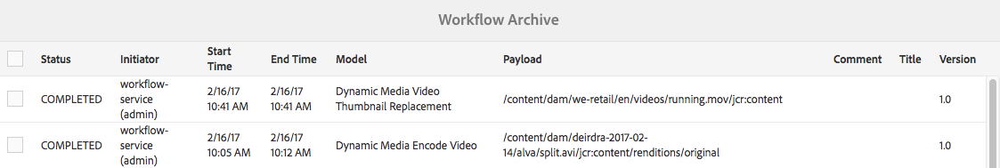

# 影片{#video}

本節說明如何在Dynamic Media中使用影片。

## 快速入門：影片 {#quick-start-videos}

下列逐步工作流程說明旨在協助您透過Dynamic Media中的最適化視訊集快速上手並執行。 在每個步驟之後，會交叉參照主題標題，以取得詳細資訊。

>[!NOTE]
>
>在Dynamic Media中處理視訊之前，請確定您的Adobe Experience Manager管理員已啟用並設定Dynamic MediaCloud Services。
>
>* 請參閱設定Dynamic Media和[疑難排解Dynamic Media](/help/assets/dynamic-media/troubleshoot-dm.md)中的[設定Dynamic MediaCloud Services](/help/assets/dynamic-media/config-dm.md#configuring-dynamic-media-cloud-services)。

>


1. **執行下列** 操作，上傳Dynamic Media影片：

   * 建立您自己的視訊編碼設定檔。 或者，您只需使用Dynamic Media隨附的預先定義&#x200B;_適用性視訊編碼_&#x200B;設定檔即可。

      * [建立視訊編碼設定檔](/help/assets/dynamic-media/video-profiles.md#creating-a-video-encoding-profile-for-adaptive-streaming)。
      * 深入了解[視訊編碼最佳實務](#best-practices-for-encoding-videos)。
   * 將視訊處理設定檔關聯至您要上傳主要來源視訊的一或多個資料夾。

      * [將視訊描述檔套用至資料夾](/help/assets/dynamic-media/video-profiles.md#applying-a-video-profile-to-folders)。
      * 深入了解[組織數位資產以使用處理設定檔的最佳實務](/help/assets/dynamic-media/best-practices-for-file-management.md)。
      * 深入了解[組織數位資產](/help/assets/organize-assets.md)。
   * 將您的主要來源影片上傳至資料夾。 將視訊新增至資料夾時，會根據您指派給資料夾的視訊處理設定檔進行編碼。

      * Dynamic Media主要支援長度最多30分鐘的簡短影片。
      * 您可以上傳每個高達15 GB的視訊檔案。
      * [上傳您的影片](/help/assets/manage-video-assets.md#upload-and-preview-video-assets)。
      * 深入了解[支援的輸入檔案格式](/help/assets/file-format-support.md)。
   * 監視[視訊編碼從資產或工作流程檢視進行](#monitoring-video-encoding-and-youtube-publishing-progress)的方式。


1. **執行下列任** 一操作，管理您的Dynamic Media影片：

   * 組織、瀏覽及搜尋影片資產

      * [組織數位資](/help/assets/organize-assets.md)
產進一步了解 [組織數位資產以使用處理設定檔的最佳實務](/help/assets/dynamic-media/best-practices-for-file-management.md)

      * [搜尋視訊](/help/assets/search-assets.md#custompredicates) 資產 [或搜尋資產](/help/assets/manage-digital-assets.md#search-assets)
   * 預覽和發佈視訊資產

      * 檢視來源視訊和編碼的視訊轉譯及其相關聯的縮圖：
         [預覽](/help/assets/manage-video-assets.md#upload-and-preview-video-assets) 影片或 [預覽資產](/help/assets/dynamic-media/previewing-assets.md)
         [管理視訊轉譯](/help/assets/manage-digital-assets.md#managing-renditions)


<!-- Commented video-renditions.md as the file is not published yet and will lead to broken link.
        * View the source video and encoded renditions of the video along with its associated thumbnails:
          [Previewing videos](/help/assets/manage-video-assets.md#upload-and-preview-video-assets) or [Previewing assets](/help/assets/dynamic-media/previewing-assets.md)
          [Viewing video renditions](/help/assets/video-renditions.md)
          [Managing video renditions](/help/assets/manage-digital-assets.md#managing-renditions) -->

    * [管理檢視器預設集](/help/assets/dynamic-media/managing-viewer-presets.md)
    * [發佈資產](/help/assets/dynamic-media/publishing-dynamicmedia-assets.md)
    
    *使用視訊中繼資料

<!--      * View the properties of an encoded video rendition such as frame rate, audio and video bitrate, and codec:
          [Viewing video rendition properties](/help/assets/video-renditions.md) -->

    *編輯視訊的屬性，例如標題、說明和標籤、自訂中繼資料欄位：
    [編輯視訊屬性](/help/assets/manage-digital-assets.md#editing-properties)
    
    * [管理數位資產的中繼資料](/help/assets/manage-metadata.md)
    * [中繼資料結構](/help/assets/metadata-schemas.md)
    
    *檢閱、核准和註解視訊，並維護完整版本控制
    
    * [註解視訊](/help/assets/manage-video-assets.md#annotate-video-assets)或[註解資產](/help/assets/manage-digital-assets.md#annotating)
    
    * [建立版本](/help/assets/manage-digital-assets.md#asset-versioning)
    * [啟動資產的工作流程](/help/assets/manage-digital-assets.md#starting-a-workflow-on-an-asset)

<!-- Removing assets-workflow.md file link as it is not applicable anymore. Workflows are replaced by processing profiles.
        * [Creating a version](/help/assets/manage-digital-assets.md#asset-versioning)
        * [Applying workflows to assets](/help/assets/assets-workflow.md) or see [Starting a workflow on an asset](/help/assets/manage-digital-assets.md#starting-a-workflow-on-an-asset)
-->

    * [查看資料夾資產](/help/assets/bulk-approval.md)
    * [項目](/help/sites-cloud/authoring/projects/overview.md)

1. **執行下列** 其中一項操作以發佈Dynamic Media影片：

   * 如果您使用Experience Manager作為WCM（Web內容管理）系統，則可以直接將視訊新增至網頁。

      * [將視訊新增至您的網頁](/help/assets/dynamic-media/adding-dynamic-media-assets-to-pages.md)。
   * 如果您使用協力廠商網頁內容管理系統，您可以將視訊連結或內嵌至您的網頁。

      * 使用URL整合視訊：
         [將URL連結至您的Web應用程式](/help/assets/dynamic-media/linking-urls-to-yourwebapplication.md)。

      * 使用網頁上的內嵌程式碼整合視訊：
         [將視訊檢視器內嵌在網頁上](/help/assets/dynamic-media/embed-code.md)。
   * [將影片發佈至YouTube](#publishing-videos-to-youtube)。
   * [產生視訊報表](#viewing-video-reports)。

   * [為視訊添加字幕](#adding-captions-to-video)。


## 在Dynamic Media中使用影片 {#working-with-video-in-dynamic-media}

Dynamic Media中的視訊是端對端解決方案，可讓您輕鬆發佈高品質的最適化視訊，以在多個螢幕間串流，包括桌上型電腦、iOS、Android™、BlackBerry®和Windows®行動裝置。 適用性視訊集將以不同位速率和格式（如400 kbps、800 kbps和1000 kbps）編碼的相同視訊的版本分組。 台式電腦或行動裝置會偵測可用頻寬。

例如，在iOS行動裝置上，會偵測頻寬，例如3G、4G或Wi-Fi。 然後，它自動從自適應視訊集內的各種視訊位速率中選取正確編碼的視訊。 視訊會串流至桌上型電腦、行動裝置或平板電腦。

此外，如果案頭或行動裝置上的網路條件改變，視訊品質會自動動態切換。 此外，如果客戶在桌上型電腦上進入全螢幕模式，適用性視訊集會使用更佳的解析度來回應，改善客戶的觀看體驗。 使用最適化視訊集，可讓客戶在多個畫面和裝置上播放Dynamic Media視訊，獲得最佳的播放效果。

視訊播放器用來判斷播放或播放期間要選取的編碼視訊的邏輯，是根據下列演算法：

1. 視訊播放器會根據最接近播放器本身中為「初始位元速率」所設定的值的位元速率，載入初始視訊片段。
1. 視訊播放器會根據頻寬速度的變更，使用下列條件進行切換：

   1. 播放器會選擇低於或等於估計頻寬的最高頻寬流。
   1. 播放器僅考慮可用頻寬的80%。 然而，如果它在轉換，則只有70%會更為保守，以避免高估，並立即重新轉換。

如需演算法的詳細技術資訊，請參閱[https://android.googlesource.com/platform/frameworks/av/+/master/media/libstagefright/httplive/LiveSession.cpp](https://android.googlesource.com/platform/frameworks/av/+/master/media/libstagefright/httplive/LiveSession.cpp)

若要管理單一視訊和最適化視訊集，支援下列項目：

* 從多種支援的視訊格式和音訊格式上傳視訊，並將視訊編碼為MP4 H.264格式，以便在多個畫面間播放。 您可以使用預先定義的最適化視訊預設集、單一視訊編碼預設集，或自訂自己的編碼以控制視訊的品質和大小。

   * 產生最適化視訊集時，會包含MP4視訊。
   * **注意**:主要/來源視訊不會新增至最適化視訊集。

* 所有HTML5視訊檢視器中的視訊字幕。
* 透過完整的中繼資料支援，組織、瀏覽和搜尋視訊，以有效管理視訊資產。
* 將最適化視訊集傳送至網路和桌上型電腦，以及行動裝置，包括iPhone、iPad、Android™、BlackBerry®和Windows®電話。

各種iOS平台均支援最適化視訊串流。 請參閱[Dynamic Media檢視器參考指南](https://experienceleague.adobe.com/docs/dynamic-media-developer-resources/library/viewers-aem-assets-dmc/video/c-html5-video-reference.html)。

Dynamic Media支援MP4 H.264視訊的行動視訊播放。 您可以在以下位置找到支援此視頻格式的BlackBerry®設備：[BlackBerry®](https://support.blackberry.com/kb/articleDetail?ArticleNumber=000005482)上支援的視頻格式。

在Windows® Phone](https://docs.microsoft.com/en-us/windows/uwp/audio-video-camera/supported-codecs)上，可以找到支援此視頻格式的Windows®設備，其格式如下：[支援的視頻格式。

* 使用Dynamic Media視訊檢視器預設集播放視訊，包括下列內容：

   * 單一影片檢視器。
   * 混合媒體檢視器，可結合視訊和影像內容。

* 設定視訊播放器以符合您的品牌需求。
* 將視訊與您的網站、行動網站或行動應用程式整合，並使用簡單的URL或內嵌程式碼。

請參閱[動態視訊播放](https://s7d9.scene7.com/s7/uvideo.jsp?asset=GeoRetail/Mop_AVS&amp;config=GeoRetail/Universal_Video1&amp;stageSize=640,480)範例。

另請參閱[Dynamic Media檢視器參考指南](https://experienceleague.adobe.com/docs/dynamic-media-developer-resources.html)中的[Experience Manager資產和Dynamic Media Classic](https://experienceleague.adobe.com/docs/dynamic-media-developer-resources/library/viewers-aem-assets-dmc/c-html5-s7-aem-asset-viewers.html#viewers-aem-assets-dmc)的檢視器，以及[Experience Manager資產的檢視器](https://experienceleague.adobe.com/docs/dynamic-media-developer-resources/library/viewers-for-aem-assets-only/c-html5-aem-asset-viewers.html#viewers-for-aem-assets-only)。

## 最佳實務：使用HTML5視訊檢視器 {#best-practice-using-the-html-video-viewer}

Dynamic Media HTML5視訊檢視器預設集是強大的視訊播放器。 您可以使用它們來避免與HTML5視訊播放相關的許多常見問題，以及與行動裝置相關的問題。 例如，缺乏最適化串流傳送，且案頭瀏覽器觸及範圍有限。

在播放器的設計端，您可以使用標準網頁開發工具來設計視訊播放器的功能。 例如，您可以使用HTML5和CSS來設計按鈕、控制項和自訂海報影像背景，以協助您以自訂外觀觸及客戶。

在檢視器的播放端，會自動偵測瀏覽器的視訊功能。 接著，它會使用HLS（HTTP即時串流）（也稱為最適化視訊串流）提供視訊。 或者，如果這些傳送方法不存在，則會改用HTML5漸進式。

您可以結合為單一播放器，使用HTML5和CSS來設計播放元件。 它可以有內嵌播放，並根據瀏覽器的功能使用最適化和漸進式串流。 所有這些功能都表示您可以將多媒體內容的觸及範圍擴展至案頭和行動使用者，並確保簡化視訊體驗。

另請參閱[Dynamic Media檢視器參考指南](https://experienceleague.adobe.com/docs/dynamic-media-developer-resources.html)中的[僅限Experience Manager資產的檢視器](https://experienceleague.adobe.com/docs/dynamic-media-developer-resources/library/viewers-for-aem-assets-only/c-html5-aem-asset-viewers.html#viewers-for-aem-assets-only)。

### 使用HTML5視訊檢視器在桌上型電腦和行動裝置上播放視訊 {#playback-of-video-on-desktop-computers-and-mobile-devices-using-the-html-video-viewer}

針對案頭和行動最適化視訊串流，用於位元速率切換的視訊是以最適化視訊集中的所有MP4視訊為基礎。

使用HLS或漸進式視訊下載時發生視訊播放。 在舊版Experience Manager（例如6.0、6.1和6.2）中，視訊是透過HTTP串流。

不過，在Experience Manager6.3及以上版本中，視訊現在會透過HTTPS（即HLS）串流，因為DM閘道服務URL一律使用HTTPS。 此預設行為不會有客戶影響。 也就是說，除非瀏覽器不支援，否則視訊串流一律會透過HTTPS進行。 （請參閱下表）。 因此，

* 如果您的HTTPS網站採用HTTPS視訊串流，則串流沒問題。
* 如果您的HTTP網站採用HTTPS視訊串流，串流沒問題，且網頁瀏覽器沒有混合的內容問題。

HLS是適用性視訊串流的Apple標準，可根據網路頻寬容量自動調整播放。 它也可讓客戶「搜尋」視訊中的任何點，而不需等待視訊的其餘部分下載。

通過在用戶的案頭系統或移動設備上本地下載和儲存視頻來傳送漸進式視頻。

下表說明使用[Dynamic Media HTML5視訊檢視器](https://experienceleague.adobe.com/docs/dynamic-media-developer-resources/library/viewers-for-aem-assets-only/interactive-video/c-html5-aem-int-video.html#interactive-video)在桌上型電腦和行動裝置上播放視訊的裝置、瀏覽器和播放方法。

<table>
 <tbody>
  <tr>
   <td><strong>裝置</strong></td>
   <td><strong>瀏覽器</strong></td>
   <td><strong>視訊播放模式</strong></td>
  </tr>
  <tr>
   <td>桌面</td>
   <td>Internet Explorer 9和10</td>
   <td>漸進式下載。</td>
  </tr>
  <tr>
   <td>桌面</td>
   <td>Internet Explorer 11+</td>
   <td>在Windows® 8和Windows® 10上 — 每當請求HLS時強制使用HTTPS。 已知限制：HLS上的HTTP在此瀏覽器/作業系統組合<br /> <br /> Windows® 7上無法運作 — 漸進式下載。 使用標準邏輯來選取HTTP與HTTPS通訊協定。</td>
  </tr>
  <tr>
   <td>桌面</td>
   <td>Firefox 23-44</td>
   <td>漸進式下載。</td>
  </tr>
  <tr>
   <td>桌面</td>
   <td>Firefox 45或更新版本</td>
   <td>HLS</td>
  </tr>
  <tr>
   <td>桌面</td>
   <td>鉻黃</td>
   <td>HLS</td>
  </tr>
  <tr>
   <td>桌面</td>
   <td>Safari(Mac)</td>
   <td>HLS</td>
  </tr>
  <tr>
   <td>行動</td>
   <td>Chrome(Android™ 6或更舊版本)</td>
   <td>漸進式下載。</td>
  </tr>
  <tr>
   <td>行動</td>
   <td>Chrome(Android™ 7或更新版本)</td>
   <td>HLS</td>
  </tr>
  <tr>
   <td>行動</td>
   <td>Android™（預設瀏覽器）</td>
   <td>漸進式下載。</td>
  </tr>
  <tr>
   <td>行動</td>
   <td>Safari(iOS)</td>
   <td>HLS</td>
  </tr>
  <tr>
   <td>行動</td>
   <td>Chrome(iOS)</td>
   <td>HLS</td>
  </tr>
  <tr>
   <td>行動</td>
   <td>BlackBerry®</td>
   <td>HLS</td>
  </tr>
 </tbody>
</table>

## Dynamic Media視訊解決方案架構 {#architecture-of-dynamic-media-video-solution}

下圖顯示影片的整體製作工作流程，這些影片會透過DMGateway上傳和編碼(在Dynamic Media混合模式中)，並可供公眾使用。


## 影片的混合發佈架構 {#hybrid-publishing-architecture-for-videos}


## 編碼視訊的最佳作法 {#best-practices-for-encoding-videos}

如果您已啟用Dynamic Media並設定視訊Cloud Services, **Dynamic Media編碼視訊**&#x200B;工作流程會對視訊進行編碼。 此工作流程會擷取工作流程處理歷程記錄和失敗資訊。請參閱[監視視訊編碼和YouTube發佈進度](#monitoring-video-encoding-and-youtube-publishing-progress)。 如果您已啟用Dynamic Media並設定視訊Cloud Services，當您上傳視訊時，**[!UICONTROL Dynamic Media編碼視訊]**&#x200B;工作流程會自動生效。 (如果您未使用Dynamic Media, **[!UICONTROL DAM更新資產]**&#x200B;工作流程將生效。)

以下是編碼來源視訊檔案的最佳實務提示。

<!-- For advice about video encoding, see the following:

* [Streaming 101: The Basics — Codecs, Bandwidth, Data Rate, and Resolution](https://www.adobe.com/go/learn_s7_streaming101_en).
* [Video Encoding Basics](https://www.adobe.com/go/learn_s7_encoding_en). -->

### 源視頻檔案 {#source-video-files}

為視訊檔案編碼時，請使用盡可能高品質的來源視訊檔案。 請避免使用先前編碼的視訊檔案，因為這些檔案已經壓縮，而進一步編碼會造成品質欠佳的視訊。

* Dynamic Media主要支援長度最多30分鐘的簡短影片。
* 您可以上傳最多15 GB的主要來源視訊檔案。

下表說明了源視頻檔案編碼前必須具有的建議大小、外觀比例和最小比特率：

| 大小 | 外觀比例 | 最小比特率 |
|--- |--- |--- |
| 1024 X 768 | 4:3 | 大部分視訊為4500 kbps。 |
| 1280 X 720 | 16:9 | 3000 - 6000 kbps，視訊中的運動量而定。 |
| 1920 X 1080 | 16時9分 | 6000 - 8000 kbps，視訊中的運動量而定。 |

### 取得檔案的中繼資料 {#obtaining-a-file-s-metadata}

您可以使用視訊編輯工具檢視其中繼資料，或使用專為取得中繼資料而設計的應用程式，以取得檔案的中繼資料。 以下是使用協力廠商應用程式MediaInfo來取得視訊檔案中繼資料的指示：

1. 前往[MediaInfo Download](https://mediaarea.net/en/MediaInfo/Download)。
1. 選擇並下載GUI版本的安裝程式，並按照安裝說明操作。
1. 安裝後，按一下右鍵視頻檔案(僅限Windows®)並選擇MediaInfo，或開啟MediaInfo並將視頻檔案拖入應用程式。 您會看到與視訊檔案相關聯的所有中繼資料，包括其寬度、高度和fps。

### 外觀比例 {#aspect-ratio}

當您選擇或建立主要來源視訊檔案的視訊編碼預設集時，請確定預設集與主要來源視訊檔案的外觀比例相同。 長寬比是視訊寬度與高度的比率。

若要確定視訊檔案的長寬比，請取得檔案的中繼資料，並記下檔案的寬度和高度（請參閱上方取得檔案的中繼資料）。 然後使用此公式來確定外觀比例：

寬/高=長寬比

下表說明公式結果如何轉換為通用外觀比例選擇：

| 公式結果 | 外觀比例 |
|--- |--- |
| 1.33 | 4:3 |
| 0.75 | 3:4 |
| 1.78 | 16時9分 |
| 0.56 | 9時16分 |

例如，寬度為1440 x 1080的視頻的長寬比為1440/1080，即1.33。在這種情況下，選擇寬寬比為4:3的視頻編碼預設集來編碼視頻檔案。

### 位元速率 {#bitrate}

位元速率是經過編碼，組成視訊播放一秒的資料量。 位元速率以千比特/秒（每秒位元組數）測量。

>[!NOTE]
>
>因為所有轉碼器都使用有損壓縮，所以位元速率是視訊品質中最重要的因素。 有損壓縮越是壓縮視頻檔案，質量就越降低。 因此，所有其他特性相等（解析度、幀速率和編解碼器），位元速率越低，壓縮檔案的質量就越低。

選取位元速率編碼時，可以選擇兩種類型：

* **[!UICONTROL 常數位元速率編碼]** (CBR) — 在CBR編碼期間，位元速率或每秒位數在整個編碼過程中保持相同。CBR編碼在整個視頻中將設定的資料速率保存為設定。 此外，CBR編碼不會為質量優化介質檔案，但會節省儲存空間。
如果視頻在整個視頻中包含類似的運動級別，則使用CBR。 CBR最常用於流式視頻內容。 另請參閱[使用自訂新增的視訊編碼參數](/help/assets/dynamic-media/video-profiles.md#using-custom-added-video-encoding-parameters)。

* **[!UICONTROL 變數位元速率編碼]** (VBR)- VBR編碼會根據壓縮程式所需的資料，將資料速率調低至您設定的上限。此功能表示在VBR編碼過程中，媒體檔案的位元速率會根據媒體檔案的位元速率需求，以動態方式增加或減少。
VBR編碼需要較長的時間，但會產生最有利的結果；媒體檔案的品質優越。 VBR最常用於http漸進式傳送視訊內容。

何時使用VBR或CRB?
選擇VBR或CBR時，幾乎總是建議您將VBR用於介質檔案。 VBR以競爭性位元速率提供高品質的檔案。 使用VBR時，請務必使用兩遍編碼，並將最大位元速率設為目標視訊位元速率的1.5倍。

選擇視訊編碼預設集時，請務必說明目標使用者的連線速度。 選擇資料速率為該速度80%的預設集。 例如，如果目標最終用戶的連接速度為1000 Kbps，則最佳預設是視頻資料速率為800 Kbps的預設。

此表描述了典型連接速度的資料速率。

| 速度(Kbps) | 連線類型 |
|--- |--- |
| 256 | 撥號連接。 |
| 800 | 典型的行動連線。 對於此連線，若為3G體驗，將資料速率定位在400到最大800的範圍內。 |
| 2000年 | 典型的寬頻案頭連接。 對於此連接，目標資料速率為800-2000 Kbps，大多數目標平均為1200-1500 Kbps。 |
| 5000 | 典型的高寬頻連接。 不建議使用此上限的編碼，因為大多數消費者無法使用此速度的視訊傳送。 |

### 解析度 {#resolution}

**** 解析度以像素說明視訊檔案的高度和寬度。大部分的源視頻都以高解析度儲存（例如1920 x 1080）。 為了串流目的，來源視訊會壓縮為較小的解析度（640 x 480或更小）。

解析度和資料速率是決定視訊品質的兩個整體連結因素。 若要維持相同的視訊品質，視訊檔案中的像素數目越多（解析度越高），資料速率就必須越高。 例如，請考慮解析度為320 x 240和解析度為640 x 480的視頻檔案中每幀的像素數：

| 解析度 | 每幀像素 |
|--- |--- |
| 320 x 240 | 七萬六千八百 |
| 640 x 480 | 30.72萬 |

640 x 480檔案的像素是每幀的4倍。 若要針對這兩個範例解析度取得相同的資料速率，您可對640 x 480檔案套用4倍的壓縮，以降低視訊品質。 因此，250 Kbps的視頻資料速率以320 x 240解析度產生高質量的觀看，而不是以640 x 480解析度產生。

一般而言，您使用的資料速率越高，視訊的顯示效果越好，使用的解析度越高，您必須維持檢視品質的資料速率就越高（與解析度較低相比）。

由於解析度和資料速率是連結的，因此在對視訊進行編碼時有兩個選項：

* 選擇資料速率，然後以最高解析度編碼，該解析度與您選擇的資料速率一致。
* 選擇解析度，然後按照所需的資料速率進行編碼，以按您選擇的解析度實現高質量視頻。

當您為主要來源視訊檔案選擇（或建立）視訊編碼預設集時，請使用下表來鎖定正確的解析度：

| 解析度 | 高度 (像素) | 螢幕大小 |
|--- |--- |--- |
| 240便士 | 240 | 小螢幕 |
| 300便士 | 300 | 小螢幕，通常用於行動裝置 |
| 360便士 | 360 | 小螢幕 |
| 480便士 | 480 | 中螢幕 |
| 720便士 | 720 | 大螢幕 |
| 1080便士 | 1080 | 高清大螢幕 |

### Fps（每秒幀數） {#fps-frames-per-second}

在美國和日本，大多數視頻以每秒29.97幀(fps)拍攝；在歐洲，大多數視頻以25幀/秒的速度拍攝。 以24 fps拍攝。

選擇符合主要來源視訊檔案之fps速率的視訊編碼預設集。 例如，如果您的主要來源視訊為25 fps，請選擇編碼預設集(25 fps)。 依預設，所有自訂編碼都使用主要來源視訊檔案的fps。 因此，建立視訊編碼預設集時，您不需要明確指定fps設定。

### 視訊編碼維度 {#video-encoding-dimensions}

為獲得最佳結果，請選取編碼維度，使來源視訊是所有已編碼視訊的整數倍。

要計算此比率，可將源寬度除以編碼寬度以獲得寬比。 然後，將源高度除以編碼高度以得到高度比。

如果產生的比率是整數，則表示視訊已最佳縮放。 如果產生的比率不是整數，它會在顯示器上保留剩餘的像素偽影，以影響視訊品質。 當視訊有文字時，此效果最顯著。

例如，假設您的來源視訊為1920 x 1080。 在下表中，三個已編碼的視訊可提供要使用的最佳編碼設定。

| 視訊類型 | 寬x高 | 寬度比例 | 高度比 |
|--- |--- |--- |--- |
| 來源 | 1920x1080 | 1 | 3 |
| 編碼 | 960 x 540 | 2 | 2 |
| 編碼 | 640 x 360 | 3 | 3 |
| 編碼 | 480 x 270 | 4 | 4 |

### 編碼視訊檔案格式 {#encoded-video-file-format}

Dynamic Media建議使用MP4 H.264視訊編碼預設集。 由於MP4檔案使用H.264視訊轉碼器，因此可提供高品質的視訊，但檔案大小壓縮。

## 將影片發佈至YouTube {#publishing-videos-to-youtube}

您可以將在「Experience Manager資產」中管理的視訊資產直接發佈至您先前建立的YouTube管道。

若要將視訊資產發佈至YouTube，您需在Experience Manager資產中標籤視訊資產，並加上標籤。 將這些標籤與YouTube管道建立關聯。 如果影片資產的標籤符合YouTube頻道的標籤，則影片會發佈至YouTube。 只要使用相關標籤，發佈至YouTube就會與一般發佈視訊一起發生。

YouTube會自行編碼。 因此，上傳至Experience Manager的原始視訊檔案會發佈至YouTube，而非Dynamic Media編碼已建立的任何視訊轉譯。 雖然使用Dynamic Media處理視訊並非必要動作，但是當播放需要檢視器預設集時，應確實如此。

略過視訊處理設定檔並直接發佈至YouTube時，這只是表示您Experience Manager資產中的視訊資產沒有取得可檢視的縮圖。 這也表示未編碼的視訊無法用於任何Dynamic Media資產類型。

將視訊資產發佈至YouTube伺服器時，必須完成下列工作，以確保透過YouTube進行安全的伺服器對伺服器驗證：

1. [配置Google雲端設定](#configuring-google-cloud-settings)
1. [建立YouTube管道](#creating-a-youtube-channel)
1. [新增發佈標籤](#adding-tags-for-publishing)
1. [在Experience Manager中設定YouTube](#setting-up-youtube-in-aem)
1. [（選用）自動設定您所上傳影片的預設YouTube屬性](#optional-automating-the-setting-of-default-youtube-properties-for-your-uploaded-videos)
1. [將影片發佈至您的YouTube頻道](#publishing-videos-to-your-youtube-channel)
1. [（選用）驗證已發佈的YouTube影片](/help/assets/dynamic-media/video.md#optional-verifying-the-published-video-on-youtube)
1. [將YouTube URL連結至您的Web應用程式](#linking-youtube-urls-to-your-web-application)

您也可以[取消發佈視訊，以從YouTube](#unpublishing-videos-to-remove-them-from-youtube)中移除視訊。

### 配置Google雲端設定 {#configuring-google-cloud-settings}

若要發佈至YouTube，您需要Google帳戶。 如果你有Gmail賬戶，那麼你已經有Google賬戶了；如果您沒有Google帳戶，便可輕鬆建立帳戶。 您需要帳戶，因為您需要憑證才能將影片資產發佈至YouTube。 如果您已建立帳戶，請略過此任務並直接前往[建立YouTube頻道](#creating-a-youtube-channel)。

與Google Cloud搭配使用的帳戶和用於YouTube的Google帳戶不需相同。

Google會定期變更其使用者介面。 因此，將影片發佈至YouTube的步驟可能與下文所述的略有不同。 當您嘗試檢查視訊是否已上傳至YouTube時，也會套用此警告。

>[!NOTE]
>
>在編寫本文時，以下步驟是正確的。 不過，谷歌會不經通知就定期更新其網站。 因此，這些步驟可能會稍有不同。

**配置Google雲端設定：**

1. 建立Google帳戶。
   [https://accounts.google.com/SignUp?service=mail](https://accounts.google.com/SignUp?service=mail)

   如果您已有Google帳戶，請跳至下一個步驟。

1. 前往[https://cloud.google.com/](https://cloud.google.com/)。
1. 在Google雲端頁面的右上角附近，選取&#x200B;**[!UICONTROL Console]**。

   如有必要，請使用您的Google帳戶憑證登入&#x200B;**[!UICONTROL 以查看**[!UICONTROL  Console ]**選項。]**

1. 在「控制面板」頁面的&#x200B;**[!UICONTROL Google Cloud Platform]**&#x200B;右側，選取「專案」下拉式清單以開啟「選取專案」對話方塊。
1. 在「選擇項目」對話框中，選擇「新建項目」****。

   

1. 在「新建項目」對話框的「項目名稱」欄位中，鍵入新項目的名稱。

   您的專案ID以您的專案名稱為基礎。 因此，請謹慎選擇專案名稱；建立後無法變更。 此外，您之後在Experience Manager中設定YouTube時，必須再次輸入相同的專案ID。 所以，把它寫下來。

1. 選擇 **[!UICONTROL 建立]**。

1. 執行下列任一操作：

   * 在專案的控制面板上，在「快速入門」卡片中，選取「**[!UICONTROL 探索並啟用API]**」。
   * 在專案的控制面板上，在API卡片中，選取&#x200B;**[!UICONTROL 前往API概覽]**。

   

1. 在「API與服務」頁面頂端附近，選取「啟用API與服務」**[!UICONTROL 。]**
1. 在「API資料庫」頁面的左側，在&#x200B;**[!UICONTROL Category]**&#x200B;下，選取&#x200B;**[!UICONTROL YouTube]**。 在頁面右側，選取&#x200B;**[!UICONTROL YouTube資料API]**。
1. 在「YouTube資料API v3」頁面上，選取&#x200B;**[!UICONTROL 啟用]**。

   

1. 若要使用API，您需要憑證。 如有必要，請選擇&#x200B;**[!UICONTROL 建立憑據]**。

   

1. 在&#x200B;**[!UICONTROL 將憑證新增至您的專案]**&#x200B;頁面的步驟1中，執行下列動作：

   * 從&#x200B;**[!UICONTROL 您使用哪個API?]** 下拉式清單，選取 **[!UICONTROL YouTube Data API v3]**。

   * 從&#x200B;**[!UICONTROL 呼叫API的來源為何？]** 下拉式清單，選 **[!UICONTROL 取「Web伺服器」（例如node.js、Tomcat）]**。

   * 從&#x200B;**[!UICONTROL 您正在訪問哪些資料？]** 下拉式清單中，選取「使 **[!UICONTROL 用者資料」]**。

   

1. 選擇&#x200B;**[!UICONTROL 我需要什麼憑據？]**
1. 在「 **[!UICONTROL 新增認證至您的專案]** 」頁面的「建立OAuth 2.0用戶端ID **** 」標題下，視需要在「名稱」欄位中輸入唯一名稱。或者，您可以使用Google指定的預設名稱。
1. 在「**[!UICONTROL 授權的JavaScript原始項]**」標題下，在文本欄位中輸入以下路徑，在路徑中替換您自己的域和埠號，然後按&#x200B;**[!UICONTROL Enter]**&#x200B;將路徑添加到清單中：

   `https://<servername.domain>:<port_number>`

   例如， `https://1a2b3c.mycompany.com:4321`

   **注意**:上述路徑範例僅供說明之用。

   

1. 在「**[!UICONTROL 已授權的重定向URI]**」標題下，在文本欄位中輸入以下路徑，在路徑中替換您自己的域和埠號，然後按&#x200B;**[!UICONTROL Enter]**&#x200B;將路徑添加到清單中：

   `https://<servername.domain>:<port_number>/etc/cloudservices/youtube.youtubecredentialcallback.json`

   例如， `https://1a2b3c.mycompany.com:4321/etc/cloudservices/youtube.youtubecredentialcallback.json`

   **注意**:上述路徑範例僅供說明之用。

1. 選擇&#x200B;**[!UICONTROL 建立OAuth客戶端ID]**。
1. 在「 **[!UICONTROL 新增認證至您的專案]****** 」頁面的「設定OAuth 2.0同意書」畫面標題下方，選取您目前使用的Gmail電子郵件地址。

   

1. 在顯示給使用者的&#x200B;**[!UICONTROL 產品名稱]**&#x200B;標題下，在文字欄位中，輸入您要在同意畫面上顯示的內容。

   Experience Manager管理員向YouTube驗證時，會顯示同意畫面。 Experience Manager聯繫YouTube以獲取權限。

1. 選擇&#x200B;**[!UICONTROL 繼續]**。
1. 在「向項目添加憑據」頁的「下載憑據&#x200B;]**」標題下，選擇「**[!UICONTROL &#x200B;下載&#x200B;]**」。**[!UICONTROL 

   

1. 保存`client_id.json`檔案。

   稍後在Adobe Experience Manager中設定YouTube時，您需要此已下載的json檔案。

1. 選擇&#x200B;**[!UICONTROL Done]**。

   登出您的Google帳戶。 現在建立YouTube管道。

### 建立YouTube管道 {#creating-a-youtube-channel}

若要將影片發佈至YouTube，您必須擁有一或多個管道。 如果您已建立YouTube管道，可以略過此工作，然後前往[新增標籤以進行發佈](/help/assets/dynamic-media/video.md#adding-tags-for-publishing)。

>[!CAUTION]
>
>請確定您已在&#x200B;*之前的YouTube*&#x200B;中設定一或多個管道，並在「Experience Manager」的「YouTube設定」下新增管道(請參閱下方的「在Experience Manager](#setting-up-youtube-in-aem)中設定YouTube」)。 [如果您未進行管道設定，系統不會警告您沒有任何現有管道。 不過，新增頻道時仍會進行Google驗證，但無法選擇要傳送視訊的頻道。

**若要建立YouTube管道：**

1. 前往[https://www.youtube.com](https://www.youtube.com/)並使用您的Google帳戶憑證登入。
1. 在YouTube頁面的右上角，選取您的描述檔圖片（也可以以字母形式顯示在實心彩色圓圈內），然後選取&#x200B;**[!UICONTROL YouTube設定]**（圓齒輪圖示）。
1. 在「概述」頁面的「其他功能」標題下，選擇「**[!UICONTROL 查看所有我的頻道」或建立頻道]**。
1. 在「通道」頁上，選擇&#x200B;**[!UICONTROL 建立新通道]**。
1. 在「品牌帳戶」頁面的「品牌帳戶名稱」欄位中，輸入公司名稱或您選擇要發佈視訊資產的任何其他管道名稱，然後選取&#x200B;**[!UICONTROL 建立]**。

   記住你在這裡輸入的名字；您必須在Experience Manager中設定YouTube時，必須再次輸入。

1. （選用）如有必要，請新增更多管道。

   現在您已新增要發佈的標籤。

### 新增發佈標籤 {#adding-tags-for-publishing}

若要發佈至YouTube的影片，Experience Manager會將標籤關聯至一或多個YouTube頻道。 若要新增發佈標籤，請參閱[管理標籤](/help/sites-cloud/authoring/features/tags.md)。

或者，如果您想在Experience Manager中使用預設標籤，可以跳過此任務並轉至[在Experience Manager](#setting-up-youtube-in-aem)中設定YouTube。

>[!NOTE]
>
>設定Cloud Service後，此時無需其他設定即可啟用YouTube Publish復寫代理。 原因在於儲存Cloud Service設定時已啟用。

<!-- ### Enabling the YouTube Publish replication agent {#enabling-the-youtube-publish-replication-agent}

After you enable the YouTube Publish replication agent, if you want to test the connection to the Google Cloud account, select **[!UICONTROL Test Connection]**. A browser tab displays the connection results. If you have added YouTube Channels, then a listing of those is displayed as part of the test.

1. In the upper-left corner of Experience Manager, select the Experience Manager logo, then in the left rail, navigate to **[!UICONTROL Tools]** > **[!UICONTROL Deployment]** > **[!UICONTROL Replication]** > **[!UICONTROL Agents on Author]**.
1. On the Agents of Author page, select **[!UICONTROL YouTube Publish (youtube)]**.
1. On the toolbar, to the right of Settings, select **[!UICONTROL Edit]**.
1. Select the **[!UICONTROL Enabled]** checkbox to turn on the replication agent.
1. Select **[!UICONTROL OK]**. -->

### 在Experience Manager中設定YouTube {#setting-up-youtube-in-aem}

從Experience Manager6.4開始，引入新的觸控使用者介面方法，以在Experience Manager中設定YouTube發佈。 根據您使用的Experience Manager安裝例項，執行下列其中一項操作：

* 若要在6.4之前的Experience Manager中設定YouTube，請參閱[在6.4之前的Experience Manager中設定YouTube 。](/help/assets/dynamic-media/video.md#setting-up-youtube-in-aem-before)
* 若要在Experience Manager6.4或更新版本中設定YouTube，請參閱[在Experience Manager6.4和更新版本中設定YouTube](#setting-up-youtube-in-aem-and-later)。

#### 在Experience Manager6.4和更新版本中設定YouTube {#setting-up-youtube-in-aem-and-later}

1. 請務必以管理員身分登入您的Dynamic Media例項。
1. 在Experience Manager的左上角，選取Experience Manager標誌，然後在左側導軌中，導覽至「**[!UICONTROL 工具]**（槌子圖示）> **[!UICONTROL Cloud Services]** > **[!UICONTROL YouTube發佈設定]**」。
1. 選擇&#x200B;**[!UICONTROL global]**（不選擇）。

1. 在全局頁的右上角附近，選擇&#x200B;**[!UICONTROL Create]**。
1. 在「建立YouTube設定」頁面的「Google cloud平台設定」下方的「應用程式名稱」欄位 **[!UICONTROL 中]** ，輸入Google專案ID。

   您最初設定Google Cloud設定時，已指定專案ID。
保留建立YouTube設定頁面開啟；你馬上就回來了。

   

1. 使用純文字編輯器，開啟您先前在[設定Google雲端設定](/help/assets/dynamic-media/video.md#configuring-google-cloud-settings)中下載並儲存的JSON檔案。
1. 選取並複製整個JSON文字。
1. 返回YouTube帳戶設定對話方塊。在「 **[!UICONTROL JSON設定」欄位中]** ，貼上JSON文字。
1. 在頁面的右上角附近，選擇&#x200B;**[!UICONTROL Save]**。

   現在在Experience Manager中設定YouTube頻道。

1. 選擇&#x200B;**[!UICONTROL 添加通道]**。
1. 在「頻道名稱」欄位中，輸入您在「先前將一或多個頻道新增至YouTube ]**」任務中建立的頻道名稱。**[!UICONTROL 

   您可以視需要選擇新增說明。

1. 選擇&#x200B;**[!UICONTROL 添加]**。
1. YouTube/Google驗證隨即顯示。 如果您尚未登入Google雲端帳戶，請略過此步驟。

   * 輸入與上述Google專案ID和JSON文字相關聯的Google使用者名稱和密碼。
   * 視您的帳戶有多少管道而定，您會看到兩個或多個項目。 選取管道。 不要選擇電子郵件地址；它不是渠道。
   * 在下一頁，選擇&#x200B;**[!UICONTROL 接受]**&#x200B;以允許訪問此通道。

1. 選擇&#x200B;**[!UICONTROL 允許]**。

   現在設定發佈的標籤。

1. **[!UICONTROL 設定要發佈的標籤]**  — 在「Cloud Services> YouTube」頁面上，選取鉛筆圖示以編輯您要使用的標籤清單。
1. 若要顯示Experience Manager中可用標籤的清單，請選取下拉式清單圖示（倒轉插入號）。
1. 若要新增，請選取一或多個標籤。

   要刪除已添加的標籤，請選擇該標籤，然後選擇&#x200B;**[!UICONTROL X]**。

1. 添加完所需標籤後，選擇&#x200B;**[!UICONTROL Save]**。

   現在您可將影片發佈至YouTube頻道。

#### 在6.4之前的Experience Manager中設定YouTube {#setting-up-youtube-in-aem-before}

1. 請務必以管理員身分登入您的Dynamic Media例項。

1. 在Experience Manager的左上角，選取Experience Manager標誌，然後在左側導軌中，導覽至&#x200B;**[!UICONTROL Tools]**（槌子圖示）> **[!UICONTROL Deployment]** > **[!UICONTROL Cloud Services]**。
1. 在「協力廠商服務」標題下方的「YouTube」下方，選取「**[!UICONTROL 立即設定]**」。
1. 在「建立配置」對話框中，在相應欄位中輸入標題（必填）和名稱（選填）。
1. 選擇 **[!UICONTROL 建立]**。
1. 在「YouTube帳戶設定」對話方塊的「應用程式名 **[!UICONTROL 稱」欄位中]** ，輸入Google專案ID。

   您在先前[設定的Google雲端設定](/help/assets/dynamic-media/video.md#configuring-google-cloud-settings)時指定了專案ID。
讓「YouTube帳戶設定」對話方塊保持開啟；你馬上就回來了。

1. 使用純文字編輯器，開啟您先前在「設定Google雲端」設定工作中下載並儲存的JSON檔案。
1. 選取並複製整個JSON文字。
1. 返回YouTube帳戶設定對話方塊。在「 **[!UICONTROL JSON設定」欄位中]** ，貼上JSON文字。
1. 選擇&#x200B;**[!UICONTROL OK]**。

   現在在Experience Manager中設定YouTube頻道。

1. 在&#x200B;**[!UICONTROL 可用通道]**&#x200B;的右側，選擇&#x200B;**+**（加號表徵圖）。
1. 在「YouTube頻道設定」對話方塊的「標題」欄位中，輸入您在「先前新增一或多個頻道至YouTube」工作中建立的頻道名稱 **** 。

   您可以視需要選擇新增說明。

1. 選擇&#x200B;**[!UICONTROL OK]**。
1. YouTube/Google驗證隨即顯示。 如果您尚未登入Google雲端帳戶，請略過此步驟。

   * 輸入與上述Google專案ID和JSON文字相關聯的Google使用者名稱和密碼。
   * 視您的帳戶有多少管道而定，您會看到兩個或多個項目。 選取管道。 不要選擇電子郵件地址；它不是渠道。
   * 在下一頁，選擇&#x200B;**[!UICONTROL 接受]**&#x200B;以允許訪問此通道。

1. 選擇&#x200B;**[!UICONTROL 允許]**。

   現在設定發佈的標籤。

1. **[!UICONTROL 設定要發佈的標籤]**  — 在「Cloud Services> YouTube」頁面上，選取鉛筆圖示以編輯您要使用的標籤清單。
1. 若要顯示Experience Manager中可用標籤的清單，請選取下拉式清單圖示（倒轉插入號）。
1. 若要新增，請選取一或多個標籤。

   要刪除已添加的標籤，請選擇該標籤，然後選擇&#x200B;**X**。

1. 添加完所需標籤後，選擇&#x200B;**[!UICONTROL OK]**。

   現在您可將影片發佈至YouTube頻道。

### （選用）自動設定您所上傳影片的預設YouTube屬性 {#optional-automating-the-setting-of-default-youtube-properties-for-your-uploaded-videos}

您可以選擇在上傳影片時自動設定YouTube屬性。 在Experience Manager中建立中繼資料處理設定檔。

若要建立中繼資料處理設定檔，您必須先從「欄位標籤 **[!UICONTROL 」、「對應至屬性]********** 」和「選擇」欄位複製值，這些全都可在視訊的中繼資料結構中找到。接著，您可以新增這些值，以建立YouTube視訊中繼資料處理設定檔。

**若要自動設定已上傳影片的預設YouTube屬性：**

1. 在Experience Manager的左上角，選取Experience Manager標誌，然後在左側導軌中，導覽至「**[!UICONTROL 工具]**（槌子圖示）> **[!UICONTROL 資產]** > **[!UICONTROL 中繼資料結構]**」。
1. 選擇&#x200B;**[!UICONTROL default]**。 （請勿在「預設」左側的選取方塊中新增核取記號。）
1. 在&#x200B;**[!UICONTROL default]**&#x200B;頁面上，選中&#x200B;**[!UICONTROL video]**&#x200B;左側的框，然後選擇&#x200B;**[!UICONTROL Edit]**。
1. 在「元資料結構編輯器」頁上，選擇&#x200B;**[!UICONTROL Advanced]**&#x200B;頁簽。
1. 在「YouTube發佈」標題下，選取&#x200B;**[!UICONTROL YouTube類別]**。
1. 在頁面右側的&#x200B;**[!UICONTROL Settings]**&#x200B;標籤下，執行下列操作：

   * 在&#x200B;**[!UICONTROL 映射至屬性]**文字欄位中，選取並複製值。
將複製的值貼到開啟的文字編輯器中。 稍後當您建立中繼資料處理設定檔時，將需要此值。 將文字編輯器保持開啟。

   * 在&#x200B;**[!UICONTROL Choices]**下，選擇並複製您要使用的預設值（如「人物和部落格」或「科學與技術」）。
將複製的值貼到開啟的文字編輯器中。 稍後當您建立中繼資料處理設定檔時，將需要此值。 將文字編輯器保持開啟。

1. 在「YouTube發佈」標題下，選取&#x200B;**[!UICONTROL YouTube隱私權]**。
1. 在頁面右側的&#x200B;**[!UICONTROL Settings]**&#x200B;標籤下，執行下列操作：

   * 在&#x200B;**[!UICONTROL 映射至屬性]**文字欄位中，選取並複製值。
將複製的值貼到開啟的文字編輯器中。 稍後當您建立中繼資料處理設定檔時，將需要此值。 將文字編輯器保持開啟。

   * 在&#x200B;**[!UICONTROL Choices]**下，選擇並複製您要使用的預設值。 請注意，「選擇」會分組為兩組。 配對中的底部欄位是您要複製的預設值，例如公用、未列出或私用。
將複製的值貼到開啟的文字編輯器中。 稍後當您建立中繼資料處理設定檔時，將需要此值。 將文字編輯器保持開啟。

1. 在「元資料結構編輯器」頁的右上角附近，選擇&#x200B;**[!UICONTROL 取消]**。
1. 在Experience Manager的左上角，選取Experience Manager標誌，然後在左側導軌中，選取「**[!UICONTROL 工具]**（槌子圖示）> **[!UICONTROL 資產]** > **[!UICONTROL 中繼資料描述檔]**」。

1. 在「元資料配置檔案」頁的右上角附近，選擇&#x200B;**[!UICONTROL Create]**。
1. 在「添加元資料配置檔案」對話框的&#x200B;**[!UICONTROL 配置檔案標題]**&#x200B;文本欄位中，輸入名稱`YouTube Video`，然後選擇&#x200B;**[!UICONTROL 建立]**。
1. 在「元資料配置檔案編輯器」頁上，選擇&#x200B;**[!UICONTROL Advance]**&#x200B;頁簽。
1. 執行下列動作，將複製的YouTube Publishing值新增至設定檔：

   * 在頁面的右側，選擇&#x200B;**[!UICONTROL Build Form]**&#x200B;標籤。
   * （可選）將標籤為&#x200B;**[!UICONTROL Section Header]**&#x200B;的元件拖到左側，並將其拖放到表單區域中。
   * （可選）選擇&#x200B;**[!UICONTROL 欄位標籤]**&#x200B;以選擇元件。
   * （可選）在頁面右側的「設定」標籤下，在「欄位標籤」文本欄位中，輸入`YouTube Publishing`。
   * 選取&#x200B;**[!UICONTROL 建置表單]**&#x200B;標籤，然後拖曳標示為&#x200B;**[!UICONTROL 多值文字]**&#x200B;的元件，並將其拖曳至您建立的&#x200B;**[!UICONTROL YouTube Publishing]**&#x200B;標題下方。

   * 要選擇元件，請選擇&#x200B;**[!UICONTROL 欄位標籤]**。
   * 在頁面右側的「設定」標籤下方，將您先前複製的YouTube發佈值（欄位標籤值和對應至屬性值）貼入表單上各自的欄位。 將選擇值貼入預設值欄位。

1. 執行下列動作，將複製的YouTube隱私權值新增至設定檔：

   * 在頁面的右側，選擇&#x200B;**[!UICONTROL Build Form]**&#x200B;標籤。
   * （可選）將標籤為&#x200B;**[!UICONTROL Section Header]**&#x200B;的元件拖到左側，並將其拖放到表單區域中。
   * （可選）選擇&#x200B;**[!UICONTROL 欄位標籤]**&#x200B;以選擇元件。
   * （可選）在頁面右側的「設定」標籤下，在「欄位標籤」文本欄位中，輸入`YouTube Privacy`。
   * 選取「**[!UICONTROL 建置表單]**」標籤，然後拖曳標示為「**[!UICONTROL 多值文字]**」的元件，並將其拖曳至您建立的&#x200B;**[!UICONTROL YouTube隱私權]**&#x200B;標題下方。

   * 要選擇元件，請選擇&#x200B;**[!UICONTROL 欄位標籤]**。
   * 在頁面右側的「設定」標籤下方，將您先前複製的YouTube發佈值（欄位標籤值和對應至屬性值）貼入表單上各自的欄位。 將選擇值貼入預設值欄位。

1. 在頁面的右上角附近，選擇&#x200B;**[!UICONTROL Save]**。
1. 將YouTube發佈中繼資料設定檔套用至您要上傳影片的資料夾。 您必須同時設定「中繼資料描述檔」和「視訊描述檔」。

   請參 [閱中繼資料](/help/assets/metadata-profiles.md)[描述檔和視訊描述檔](/help/assets/dynamic-media/video-profiles.md)。

### 將影片發佈至您的YouTube頻道 {#publishing-videos-to-your-youtube-channel}

現在，您將先前新增的標籤與視訊資產建立關聯。 此程式可讓Experience Manager知道要發佈至您的YouTube管道的資產。

>[!NOTE]
>
>立即發佈不會自動發佈至YouTube。 設定動態媒體時，有兩個發佈選項可供選擇：立 **[!UICONTROL 即或]****[!UICONTROL 啟動後]**。
>
>**[!UICONTROL 「立]** 即發佈」表示上傳的資產（與IPS同步後）會自動發佈至傳送系統。雖然Dynamic Media的情況確實如此，但YouTube的情況並非如此。 若要發佈至YouTube，您必須透過「Experience Manager作者」發佈。

>[!NOTE]
若要從YouTube發佈內容，Experience Manager會使用&#x200B;**[!UICONTROL 發佈至YouTube]**&#x200B;工作流程，讓您監控進度並檢視任何失敗資訊。
請參閱[監視視訊編碼和YouTube發佈進度](#monitoring-video-encoding-and-youtube-publishing-progress)。
如需更詳細的進度資訊，您可以在復寫下監控YouTube記錄檔。 但請注意，此類監控需要管理員存取權。

**若要將影片發佈至您的YouTube頻道：**

1. 在Experience Manager中，導覽至您要發佈至YouTube管道的視訊資產。
1. 選取視訊資產（最適化視訊集）。
1. 在工具欄上，選擇&#x200B;**[!UICONTROL 屬性]**。
1. 在「基本」頁簽的「元資料」標題下，選擇「標籤」欄位右側的&#x200B;**[!UICONTROL 開啟選擇對話框]**。
1. 在「選取標籤」頁面上，導覽至您要使用的標籤，然後選取一或多個標籤。

   請記住，標籤必須與YouTube管道相關聯。

1. 在頁面的右上角，選擇&#x200B;**[!UICONTROL Select]**。
1. 在視訊屬性頁面的右上角，選取&#x200B;**[!UICONTROL 儲存並關閉]**。
1. 在工具欄上，選擇&#x200B;**[!UICONTROL 快速發佈]**。

   另請參閱[使用發佈管理搭配Experience Manager網站](https://experienceleague.adobe.com/docs/experience-manager-learn/sites/page-authoring/publication-management-feature-video-use.html#page-authoring)。

   您可以選擇驗證您的YouTube頻道上已發佈的視訊。

### （選用）驗證已發佈的YouTube影片 {#optional-verifying-the-published-video-on-youtube}

您可以選擇監控YouTube發佈（或取消發佈）的進度。

請參閱[監視視訊編碼和YouTube發佈進度](#monitoring-video-encoding-and-youtube-publishing-progress)。

發佈時間可能會因許多因素而大不相同，這些因素包括主要來源視訊的格式、檔案大小和上傳流量。 發佈程式可能需要幾分鐘到數小時的時間。 另外，更高解析度的格式的呈現速度要慢得多。 例如，720p和1080p的顯示時間比480p要長。

八小時後，如果您仍看到顯示「已上傳（處理，請稍候）」的狀態訊息&#x200B;]**，請嘗試從您的網站移除視訊，然後再次上傳。**[!UICONTROL 

### 將YouTube URL連結至您的Web應用程式 {#linking-youtube-urls-to-your-web-application}

您可以取得YouTube URL字串，此字串在您發佈影片後由Dynamic Media產生。 複製YouTube URL時，剪貼簿會隨即顯示，因此您可以視需要將其貼至網站或應用程式中的頁面。

>[!NOTE]
在您將視訊資產發佈至YouTube之前，無法複製YouTube URL。

若要將YouTube URL連結至您的Web應用程式：

1. 導覽至您要複製其URL的&#x200B;*YouTube已發佈*&#x200B;視訊資產，然後選取它。

   請記住，YouTube URL僅可在&#x200B;*之後複製*，而您已先將&#x200B;*已發佈*&#x200B;視訊資產複製到YouTube。

1. 在工具欄上，選擇&#x200B;**[!UICONTROL 屬性]**。
1. 選擇&#x200B;**[!UICONTROL Advanced]**&#x200B;頁簽。
1. 在「YouTube發佈」標題下的「YouTube URL List」（ URL清單）中，選取URL文字，並將其複製至網頁瀏覽器，以預覽資產或新增至您的網頁內容頁面。

### 取消發佈影片，以便從YouTube中移除影片 {#unpublishing-videos-to-remove-them-from-youtube}

在Experience Manager中取消發佈視訊資產時，視訊會從YouTube移除。

>[!CAUTION]
如果您直接從YouTube中移除影片，Experience Manager不會察覺，且會繼續以視訊仍發佈至YouTube的方式運作。 一律透過Experience Manager從YouTube取消發佈視訊資產。

>[!NOTE]
若要從YouTube移除內容，Experience Manager會使用&#x200B;**[!UICONTROL 從YouTube]**&#x200B;取消發佈工作流程，讓您監控進度並檢視任何失敗資訊。
請參閱[監視視訊編碼和YouTube發佈進度](#monitoring-video-encoding-and-youtube-publishing-progress)。

**若要取消發佈影片以從YouTube中移除影片：**

1. 導覽至您要從YouTube管道取消發佈的視訊資產。
1. 在資產選取模式中，選取一或多個已發佈的視訊資產。
1. 在工具欄上，選擇&#x200B;**[!UICONTROL 管理出版物]**。 如有必要，請在工具列上選取三個點的圖示(`. . .`)，以查看&#x200B;**[!UICONTROL 管理出版物]**。
1. 在管理出版物頁面上，選擇&#x200B;**[!UICONTROL 取消發佈]**。
1. 在頁面的右上角，選擇&#x200B;**[!UICONTROL Next]**。
1. 在頁面的右上角，選取&#x200B;**[!UICONTROL 取消發佈]**。

## 監視視訊編碼和YouTube發佈進度 {#monitoring-video-encoding-and-youtube-publishing-progress}

將新視訊上傳至已套用視訊編碼的資料夾時，或將視訊發佈至YouTube、監控視訊編碼/Youtube發佈的進度（或失敗）。 實際YouTube發佈進度僅透過記錄檔提供。 但無論失敗或成功，都會以下列程式中說明的其他方式列出。 此外，當YouTube發佈工作流程或視訊編碼完成或中斷時，您會收到電子郵件通知。

### 監視進度 {#monitoring-progress}

您可以監控進度，包括編碼失敗/YouTube發佈。

1. 在資產資料夾中檢視視訊編碼進度：

   * 在卡片檢視中，視訊編碼進度會依百分比顯示在資產上。 如果發生錯誤，此資訊也會顯示在資產上。

   

   * 在清單檢視中，視訊編碼進度會顯示在&#x200B;**[!UICONTROL 處理狀態]**&#x200B;欄中。 如果出現錯誤，則該欄會顯示此訊息。

   

   預設不會顯示此欄。要啟用該列，請從視圖下拉菜單中選擇&#x200B;**[!UICONTROL 查看設定]**，然後添加&#x200B;**[!UICONTROL 處理狀態]**&#x200B;列並選擇&#x200B;**[!UICONTROL 更新]**。

   

1. 在資產詳細資訊中檢視進度。 選取資產時，請開啟下拉式選單並選取&#x200B;**[!UICONTROL 時間軸]**。 若要將其縮小至編碼或YouTube發佈等工作流程活動，請選取「**[!UICONTROL 工作流程]**」。

   

   時間軸中會顯示任何工作流程資訊（例如編碼）。 針對YouTube發佈，工作流程時間軸也包含YouTube管道和YouTube影片URL的名稱。 此外，發佈完成後，您會在工作流程時間軸中看到任何失敗通知。

   >[!NOTE]
   由於&#x200B;**[!UICONTROL retrys]**、**[!UICONTROL retry delay]**&#x200B;和&#x200B;**[!UICONTROL timeout]**(來自[https://localhost:4502/system/console/configMgr](https://localhost:4502/system/console/configMgr))的多個工作流配置，最終記錄失敗/錯誤消息可能需要很長的時間，例如：
   * Apache Sling作業佇列設定
   * AdobeGranite工作流程外部流程作業處理常式
   * Granite工作流程逾時佇列

   您可以在這些設定中調整&#x200B;**[!UICONTROL retries]**、**[!UICONTROL retry delay]**&#x200B;和&#x200B;**[!UICONTROL timeout]**&#x200B;屬性。

1. 如需進行中的工作流程，請參閱「工具 **[!UICONTROL >工作流程]** >例項」中的「工作流程例 **[!UICONTROL 項」]******。

   >[!NOTE]
   您需要管理權限才能訪問&#x200B;**[!UICONTROL 工具]**&#x200B;菜單。

   

   選擇實例並選擇&#x200B;**[!UICONTROL 開啟歷史記錄]**。

   

   從「工作流實例」區域，您還可以暫停、終止或更名工作流。 如需詳細資訊，請參閱[管理工作流程](/help/sites-cloud/authoring/workflows/overview.md) 。

1. 有關失敗的作業，請參閱「工具」>「工作流 **[!UICONTROL 程」]** > 「失敗 **[!UICONTROL 」中的「工]** 作流失敗 ****」。「工作 **[!UICONTROL 流失敗]** 」(Workflow Failure)列出所有失敗的工作流活動。

   >[!NOTE]
   您需要管理權限才能訪問&#x200B;**[!UICONTROL 工具]**&#x200B;菜單。

   

   >[!NOTE]
   由於&#x200B;**[!UICONTROL retrys]**、**[!UICONTROL retry delay]**&#x200B;和&#x200B;**[!UICONTROL timeout]**&#x200B;從[https://localhost:4502/system/console/configMgr](https://localhost:4502/system/console/configMgr)到timeout的多個工作流配置，最終記錄錯誤消息可能需要很長的時間，例如：
   * Apache Sling作業佇列設定
   * AdobeGranite工作流程外部流程作業處理常式
   * Granite工作流程逾時佇列

   您可以在這些設定中調整&#x200B;**[!UICONTROL retries]**、**[!UICONTROL retry delay]**&#x200B;和&#x200B;**[!UICONTROL timeout]**&#x200B;屬性。

1. 如需完成的工作流程，請參閱「工具 **[!UICONTROL >工作流程]** >封存 **[!UICONTROL 」中的「工作流程封存]******」。「工作 **[!UICONTROL 流程存檔]** 」會列出所有已完成的工作流活動。

   >[!NOTE]
   您需要管理權限才能訪問&#x200B;**[!UICONTROL 工具]**&#x200B;菜單。

   

1. 您會收到有關中止或失敗工作流程作業的電子郵件通知。 管理員可設定這些電子郵件通知。 請參閱[設定電子郵件通知](#configuring-e-mail-notifications)。

<!-- EMAIL NOT AVAILABLE IN SKYLINE

#### Configuring e-mail notifications {#configuring-e-mail-notifications}

>[!NOTE]
>
>You may need administrative rights to access the **[!UICONTROL Tools]** menu.

How you configure notification depends on whether you want notifications for YouTube publishing jobs.

* For encoding jobs, you can access the configuration page for all Experience Manager workflow email notifications at **[!UICONTROL Tools]** > **[!UICONTROL Operations]** > **[!UICONTROL Web Console]** and by searching for **[!UICONTROL Day CQ Workflow Email Notification Service]**. You can select or clear the check boxes for **[!UICONTROL Notify on Abort]** or **[!UICONTROL Notify on Complete]** accordingly.

For YouTube publishing jobs, do the following:

1. In Experience Manager, navigate to **[!UICONTROL Tools]** > **[!UICONTROL Workflow]** > **[!UICONTROL Models]**.
1. On the Workflow Models page, select **[!UICONTROL Publish to YouTube]**, then select **[!UICONTROL Edit]** on the toolbar.
1. Near the upper-right corner of the Publish to YouTube workflow page, select **[!UICONTROL Edit]**.
1. Hover the mouse pointer on the YouTube Upload component, then select once to display the inline toolbar.

   

1. On the inline toolbar, select the Configuration icon (wrench). Select the **[!UICONTROL Arguments]** tab.

   

1. In the YouTube Upload Process - Step Properties dialog box, select the **[!UICONTROL Arguments]** tab.

   

1. You can select or clear the following check boxes:

    * Publish Start
    * Publish Failure
    * Publish Completion - includes information on channels and URLs

   Clearing a check box means that you will not receive the specified email notification from the YouTube Publish workflow.

   >[!NOTE]
   >
   >These emails are specific to YouTube and are in addition to the generic workflow email notifications. As a result, you may receive two sets of email notification - the generic notification available in the **[!UICONTROL Day CQ Workflow Email Notification Service]** and one specific to YouTube depending on your configuration settings.

1. When you are finished, near the upper-right corner of the dialog box, select the **[!UICONTROL Done]** icon (check mark).
1. On the Publish to YouTube workflow page, near the upper-right corner, select **[!UICONTROL Sync]**.

-->

## 檢視視訊報表 {#viewing-video-reports}

>[!NOTE]
只有在執行Dynamic Media — 混合模式時，才可使用視訊報表。

「視訊報表」會顯示指定時段內的數個匯總量度，協助您監控個別和匯總的視訊是否如預期般執行&#x200B;*已發佈*。 系統會針對整個網站上所有發佈的視訊匯總下列排名在前的量度資料：

* 視訊開始
* 完成率
* 視訊平均逗留時間
* 視訊總逗留時間
* 每次造訪的影片

也會列出所有&#x200B;*已發佈*&#x200B;影片的表格，讓您能夠根據總視訊開始次數追蹤網站上最常檢視的影片。

當您在清單中選取視訊名稱時，該名稱會以折線圖的形式顯示視訊的對象保留（下拉式）報表。 圖表會顯示視訊播放期間任何指定時刻的檢視次數。 當您播放視訊時，垂直條會與播放器中的時間指示器同步追蹤。 折線圖資料中斷，指出您的受眾從不感興趣的位置下降。

如果視訊在Adobe Experience Manager Dynamic Media外部編碼，就無法使用對象保留率（下拉式清單）圖表和表格中的播放百分比資料。

>[!NOTE]
追蹤和報表資料僅以使用Dynamic Media自己的視訊播放器和相關的視訊播放器預設集為基礎。 因此，您無法追蹤並報告透過其他視訊播放器播放的視訊。

依預設，當您首次輸入視訊報表時，報表會顯示從當月的第一個開始，到當月的日期結束的視訊資料。 不過，您可以指定自己的日期範圍來覆寫預設日期範圍。 下次輸入視訊報表時，會使用您指定的日期範圍。

為了讓視訊報表正常運作，設定Dynamic MediaCloud Services時，會自動建立報表套裝ID。 同時，報表套裝ID會推送至發佈伺服器，以便您在預覽資產時能使用「複製URL」功能。 不過，此功能需要已設定發佈伺服器。 如果未設定發佈伺服器，您仍可以發佈以查看視訊報表。 不過，您必須返回Dynamic Media雲端設定，並選取&#x200B;**[!UICONTROL OK]**。

**若要檢視視訊報表：**

1. 在Experience Manager的左上角，選取Experience Manager標誌，然後在左側導軌中，導覽至「**[!UICONTROL 工具]**（槌子圖示）> **[!UICONTROL 資產]** > **[!UICONTROL 視訊報表]**」。
1. 在視訊報表頁面上，執行下列其中一項作業：

   * 在右上角附近，選取「**[!UICONTROL 重新整理視訊報表]**」圖示。
只有在報表的結束日期為當天時，才使用「重新整理」。 此功能可確保您查看自您上次執行報表以來發生的視訊追蹤。

   * 在右上角附近，選取「**[!UICONTROL 日期選擇器]**」圖示。
指定您要視訊資料的開始和結束日期範圍，然後選取**[!UICONTROL 執行報表]**。

   「排名在前的量度」群組方塊可識別您網站上所有&#x200B;*已發佈*&#x200B;影片的各種匯總測量。

1. 在列出最熱門發佈影片的表格中，選取影片名稱以播放影片，並查看影片的對象保留率（下拉式清單）報表。

<!-- OBSOLETE CONTENT OBSOLETE CONTENT - SDK ONLY AVAILABLE INTERNALLY NOW 
### Viewing video reports based on a video viewer that you created using the Dynamic Media HTML5 Viewer SDK {#viewing-video-reports-based-on-a-video-viewer-that-you-created-using-the-scene-hmtl-viewer-sdk}

If you are using an out-of-box video viewer provided by Dynamic Media, or if you created a custom viewer preset based off of an out-of-box video viewer, then no additional steps are required to view video reports. However, if you have created your own video viewer based off the Dynamic Media HTML5 Viewer SDK, then use the following steps to ensure the your video viewer is sending tracking events to Dynamic Media Video Reports.

Use the Dynamic Media Viewers Reference and the Dynamic Media HTML5 Viewers SDK to create your own video viewers.

See [Dynamic Media Viewers Reference Guide](https://experienceleague.adobe.com/docs/dynamic-media-developer-resources/library/home.html?lang=en).

Download the Scene7 HTML Viewer SDK from Adobe Developer Connection.

See [Adobe Developer Connection](https://help.adobe.com/en_US/scene7/using/WSef8d5860223939e2-43dedf7012b792fc1d5-8000.html).

**To view Video Reports based on a video viewer that you created using the Dynamic Media HTML5 Viewer SDK:**

1. Navigate to any published video asset.
1. Near the upper-left corner of the asset's page, from the drop-down list, select **[!UICONTROL Viewers]**.
1. Select any video viewer preset and copy the embed code.
1. In the embed code, find the line with the following:

   `videoViewer.setParam("config2", "<value>");`

   The `config2` parameter enables tracking in HTML5 Viewers. It is also a company-specific preset that contains the configuration information for Video Reporting, and for customer-specific Adobe Analytics configurations.

   The correct value for the config2 parameter is found in both the **[!UICONTROL Embed Code]** and in the copy **[!UICONTROL URL]** function. In the URL from the copy **[!UICONTROL URL]** command, the parameter to look for is `&config2=<value>` . The value is almost always `companypreset`, but in some instances it can also be `companypreset-1`, `companypreset-2`, and so forth.

1. In your custom video viewer code, add AppMeasurementBridge .jsp to the viewer page by doing the following:

    * First, determine if you need the `&preset` parameter.
      If the `config2` parameter is `companypreset`, you do *not *need `&preset=parameter`.
      If `config2` is anything else, set the preset parameter the same as the `config2` parameter. For example, if `config2=companypreset-2`, add `&param2=companypreset-2` to the AppMeasurmentBridge.jsp URL.

    * Then, add the AppMeasurementBridge.jsp script:
      `<script language="javascript" type="text/javascript" src="https://s7d1.scene7.com/s7viewers/AppMeasurementBridge.jsp?company=robindallas&preset=companypreset-2"></script>`

1. Create the TrackingManager component by doing the following:

    * After calling `s7sdk.Utils.init();` create a TrackingManager instance to track events by adding the following:
      `var trackingManager = new s7sdk.TrackingManager();`

    * Connect components to TrackingManager by doing the following:
      In the `s7sdk.Event.SDK_READY` event handler, attach the component you want to track to the TrackingManager.
      For example, if the component is `videoPlayer`, add
      `trackingManager.attach(videoPlayer);`
      to attach the component to the trackingManager. To track multiple viewers on a page, use multiple tracking mangaer components.

    * Create the AppMeasurementBridge object by adding the following:

      ```
      var appMeasurementBridge = new AppMeasurementBridge(); appMeasurementBridge.setVideoPlayer(videoPlayer);
      ```

    * Add the tracking function by adding the following:

      ```
      trackingManager.setCallback(appMeasurementBridge.track,
       appMeasurementBridge);
      ```

   The appMeasurementBridge object has a built-in track function. OBSOLETE However, you can provide your own to support multiple tracking systems or other functionality.

   For more information, see *Using the TrackingManager Component* in the *Scene7 HTML5 Viewer SDK User Guide* available for download from [Adobe Developer Connection](https://help.adobe.com/en_US/scene7/using/WSef8d5860223939e2-43dedf7012b792fc1d5-8000.html).
 -->

## 為視頻添加字幕或字幕 {#adding-captions-to-video}

您可以在單一影片或最適化影片集中新增字幕，將影片的觸角延伸至全球市場。 通過添加字幕，您可以避免對音頻進行重音，或者使用母語者為每種語言重新錄制音頻。 影片以錄制的語言播放。 外語字幕出現，使不同語言的人仍然能夠理解音頻部分。

字幕也可讓聾人或聽力障礙人士使用隱藏式字幕，進一步協助使用。

>[!NOTE]
您使用的視訊播放器必須支援字幕的顯示。

Dynamic Media可將註解檔案轉換為JSON（JavaScript物件標籤法）格式。 這種轉換表示您可以將JSON文字內嵌至網頁，作為視訊的隱藏但完整的記錄。 然後，搜尋引擎可對內容進行編目/索引，讓影片更容易找到，並提供客戶有關影片內容的詳細資訊。

如需在URL中使用JSON函式的詳細資訊，請參閱[提供靜態（非影像）內容](https://experienceleague.adobe.com/docs/dynamic-media-developer-resources/image-serving-api/image-serving-api/c-serving-static-nonimage-contents.html#image-serving-api)。

**向視頻添加字幕或字幕：**

1. 使用第三方應用程式或服務建立視頻字幕/字幕檔案。

   請確定您建立的檔案符合WebVTT（Web視訊文字追蹤）標準。 字幕副檔名為.VTT。 您可以了解有關WebVTT字幕標準的更多資訊。

   請參閱[WebVTT:Web視頻文本跟蹤格式](https://w3c.github.io/webvtt/)。

   您可以使用免費和優質的工具和服務，在Dynamic Media之外製作字幕/字幕檔案。 例如，要建立不帶樣式的簡單視頻字幕檔案，可以使用以下免費線上字幕創作和編輯工具：

   [WebVTT字幕製作器](https://testdrive-archive.azurewebsites.net/Graphics/CaptionMaker/Default.html)

   為獲得最佳結果，請使用Internet Explorer 9或更新版本、Google Chrome或Safari中的工具。

   在工具的&#x200B;**[!UICONTROL 輸入視訊檔案]**&#x200B;欄位中，貼上視訊檔案的複製URL，然後選取&#x200B;**[!UICONTROL 載入]**。 請參閱[取得資產](/help/assets/dynamic-media/linking-urls-to-yourwebapplication.md#obtaining-a-url-for-an-asset)的URL ，以取得視訊檔案本身的URL，然後您可將該URL貼入視訊檔案欄位&#x200B;**[!UICONTROL 的「輸入URL」。]**&#x200B;然後，Internet Explorer、Chrome或Safari就可以原生播放視訊。

   現在請依照網站的螢幕指示製作和儲存您的WebVTT檔案。 完成後，複製字幕檔案內容並貼到純文字編輯器中，然後以VTT副檔名儲存。

   >[!NOTE]
   為全球支援多種語言的視頻字幕，WebVTT標準要求您為要支援的每種語言分別建立.vtt檔案和調用。

   通常，您想將字幕VTT檔案命名為與視頻檔案相同的名稱，並將其附加到語言區域設定，如 — EN、-FR或 — DE。 如此一來，您就能透過現有的網頁內容管理系統，協助您自動產生視訊URL。

1. 在Experience Manager中，將WebVTT註解檔案上傳至DAM。
1. 導覽至您要與您上傳之註解檔案建立關聯的&#x200B;*已發佈*&#x200B;視訊資產。

   請記住，URL僅可在您首次發 *布資產* 後 *複製* 。

   請參閱[發佈資產](/help/assets/dynamic-media/publishing-dynamicmedia-assets.md)。

1. 執行下列任一操作：

   * 對於快顯視訊檢視器體驗，請選取&#x200B;**[!UICONTROL URL]**。 在「URL」對話方塊中，選取URL並將其複製到剪貼簿，然後將URL移至簡單文字編輯器中。 使用下列語法附加視訊的複製URL:

      `&caption=<server_path>/is/content/<path_to_caption.vtt_file,1>`

      注意標題路徑末尾的`,1`。 緊接在路徑中的VTT檔案名副檔名後面，您可以選擇性地啟用（開啟）或停用（關閉）視訊播放器列上的隱藏式字幕按鈕，方法是分別將設為`,1`或`,0`。

   * 針對內嵌的視訊檢視器體驗，選取&#x200B;**[!UICONTROL 內嵌程式碼]**。 在「內嵌程式碼」對話方塊中，選取內嵌程式碼，並將其複製到剪貼簿，然後將程式碼貼到簡單的文字編輯器中。 使用下列語法附加複製的內嵌程式碼：

      `videoViewer.setParam("caption","<path_to_caption.vtt_file,1>");`

      注意標題路徑末尾的`,1`。 緊接在路徑中的VTT檔案名副檔名後面，您可以選擇性地啟用（開啟）或停用（關閉）視訊播放器列上的隱藏式字幕按鈕，方法是分別將設為`,1`或`,0`。

## 新增章節標籤至視訊 {#adding-chapter-markers-to-video}

您可以將章節標籤新增至單一視訊或最適化視訊集，讓您更輕鬆觀看和導覽長型視訊。 當使用者播放視訊時，可以選取視訊時間軸上的章節標籤（也稱為視訊清除程式）。 他們可輕鬆導覽至其興趣點，或立即跳至新內容、訓練和示範。

>[!NOTE]
使用的視訊播放器必須支援使用章節標籤。 Dynamic Media視訊播放器確實支援章節標籤，但使用協力廠商視訊播放器則否。

<!-- OBSOLETE CONTENT OBSOLETE CONTENT If desired, you can create and brand your own custom video viewer with chapters instead of using a video viewer preset. For instructions on creating your own HTML5 viewer with chapter navigation, in the Adobe Scene7 Viewer SDK for HTML5 guide, reference the heading “Customizing Behavior Using Modifiers” under the classes `s7sdk.video.VideoPlayer` and `s7sdk.video.VideoScrubber`. The Adobe Scene7 Viewer SDK is available as a download from [Adobe Developer Connection](https://help.adobe.com/en_US/scene7/using/WSef8d5860223939e2-43dedf7012b792fc1d5-8000.html). -->

您為視訊建立章節清單的方式與建立字幕的方式大致相同。 即，建立WebVTT檔案。 但請注意，此檔案必須與任何WebVTT標題檔案分開。 不能將字幕和章節合併為一個WebVTT檔案。

您可以使用下列範例作為建立具有章節導覽的WebVTT檔案時所使用的格式範例：

### 具有視訊章節導覽的WebVTT檔案 {#webvtt-file-with-video-chapter-navigation}

```xml
WEBVTT
Chapter 1
00:00.000 --> 01:04.364
The bicycle store behind it all.
Chapter 2
01:04.364 --> 02:00.944
Creative Cloud.
Chapter 3
02:00.944 --> 03:02.937
Ease of management for a working solution.
Chapter 4
03:02.937 --> 03:35.000
Cost-efficient access to rapidly evolving technology.
```

在上述範例中，`Chapter 1`是提示識別碼，且為選用。 `00:00:000 --> 01:04:364`的提示時間以`00:00:000`格式指定章節的開始時間和結束時間。 最後三位數為毫秒，如果首選，可保留為`000`。 `The bicycle store behind it all`的章節標題是該章節內容的實際說明。 當使用者將滑鼠指標暫留在時間軸的視覺提示點上時，提示識別碼、開始提示時間和章節標題都會顯示在視訊播放器的快顯視窗中。

因為您使用的是HTML5視訊檢視器，請確定您建立的章節檔案遵循WebVTT（Web視訊文字追蹤）標準。 章節副檔名為.VTT。 您可以了解有關WebVTT字幕標準的更多資訊。

請參閱[WebVTT:Web視頻文本跟蹤格式](https://w3c.github.io/webvtt/)。

**若要將章節標籤新增至視訊：**

1. 以UTF8編碼儲存VTT檔案，以避免章節標題文字的字元轉譯問題。

   一般來說，您會想要將章節VTT檔案命名為與視訊檔案相同的名稱，並附加章節。 如此一來，您就能透過現有的網頁內容管理系統，協助您自動產生視訊URL。
1. 在Experience Manager中，上傳您的WebVTT章節檔案。

   請參閱[上傳資產](/help/assets/manage-digital-assets.md#uploading-assets)。

1. 執行下列任一操作：

   <table>
     <tbody>
      <tr>
       <td>快顯視訊檢視器體驗</td>
       <td>
       <ol>
       <li>導覽至您要與您上傳之章節檔案建立關聯之<i>已發佈</i>視訊資產。 請記住，URL僅可在您首次發 <i>布資產</i> 後 <i>複製</i> 。請參閱<a href="/help/assets/dynamic-media/publishing-dynamicmedia-assets.md">發佈資產。</a></li>
       <li>從下拉式選單中，選取<strong>檢視器</strong>。</li>
       <li>在左側邊欄中，選取視訊檢視器預設集名稱。 視訊的預覽會在個別頁面中開啟。</li>
       <li>在左側邊欄的底部，選取<strong>URL</strong>。</li>
       <li>在「URL」對話方塊中，選取URL並將其複製到剪貼簿，然後將URL移至簡單文字編輯器中。</li>
       <li>使用下列語法附加視訊的複製URL，以便將其與複製的URL建立關聯至您的章節檔案：<br /> <br /> <code>&navigation=<<i>full_copied_URL_path_to_chapter_file</i>.vtt></code><br /> </li>
       </ol> </td>
      </tr>
      <tr>
       <td>針對內嵌的視訊檢視器體驗<br /> </td>
       <td>
       <ol>
       <li>導覽至您要與您上傳之章節檔案建立關聯之<i>已發佈</i>視訊資產。 請記住，URL僅可在您首次發 <i>布資產</i> 後 <i>複製</i> 。請參閱<a href="/help/assets/dynamic-media/publishing-dynamicmedia-assets.md">發佈資產。</a></li>
       <li>從下拉式選單中，選取<strong>檢視器</strong>。</li>
       <li>在左側邊欄中，選取視訊檢視器預設集名稱。 視訊的預覽會在個別頁面中開啟。</li>
       <li>在左側邊欄的底部，選取<strong>Embed</strong>。</li>
       <li>在「內嵌程式碼」對話方塊中，選取整個程式碼，並複製到剪貼簿，然後貼到簡單的文字編輯器中。</li>
       <li>使用下列語法附加視訊的內嵌程式碼，以便將它與複製的URL建立關聯至章節檔案：<br /> <br /> <code>videoViewer.setParam("navigation","&lt;<i>full_copied_URL_path_to_chapter_file</i>.vtt>"</code></li>
       </ol> </td>
      </tr>
     </tbody>
   </table>

<!--

## About video thumbnails {#about-video-thumbnails}

A video thumbnail is a reduced-size version of a video frame or an image asset representing the video to the customer. The thumbnail should serve to encourage a customer to select the video.

All videos in Experience Manager must have an associated thumbnail; you cannot delete a thumbnail without replacing it. By default, when you upload a video to Experience Manager, the first frame is used as the thumbnail. However, you can customize the thumbnail for branding purposes or visual search, for example. When you customize a video thumbnail, you can either play the video and pause on the frame you want to use, or you can select an image asset that you have already uploaded and *published* in your digital asset manager.

Note that a custom video thumbnail image that you select from a video is not extracted and saved in the DAM as a separate and distinct asset. However, a custom video thumbnail that you select from an existing image asset is saved to the JCR. The path of the selected asset gets stored under the video asset's node as in the following example path:

`/content/dam/*<folder_name*>/<*video_name*>/jcr:content/manualThumbnail`

The ability to customize a video thumbnail is only available after you have applied a video profile to the folder where the video is located.

### Adding a custom video thumbnail {#adding-a-custom-video-thumbnail}

1. Be sure you have already done the following:

    * Created a folder for your video assets.
    * [Applied a video profile to the folder](/help/assets/dynamic-media/video-profiles.md#applying-a-video-profile-to-folders).

    * [Uploaded your videos to the folder](/help/assets/manage-video-assets.md#upload-and-preview-video-assets).

1. Navigate to an uploaded video asset whose thumbnail image you want to change.
1. In asset selection mode either from **[!UICONTROL List View]** or **[!UICONTROL Card View]**, select the video asset.
1. On the toolbar, select the **[!UICONTROL Properties** icon (a circle with an "i" in it).
1. On the video's Properties page, select **[!UICONTROL Change Thumbnail]**.
1. On the Change Thumbnail page, do one of the following:

    * To use a frame from the video as the new thumbnail:

        * On the toolbar, select **[!UICONTROL Select Frame from video]**.
        * Select the Play button, then select the Pause button on the frame you want to capture as the video's new thumbnail.

    * To use an image asset as the new thumbnail:

        * On the toolbar, select **[!UICONTROL Select Thumbnail from Assets]**.
        * Select **[!UICONTROL Select Thumbnail]**.
        * Navigate to a previously uploaded and published image asset you want to use. Note that the asset will automatically be resized to serve as a thumbnail image for the video.
        * Select the image asset, then select **[!UICONTROL Select]**.

1. On the Change Thumbnail page, select **[!UICONTROL Save Change]**.
1. On the video's Properties page, in the upper-right corner, select **[!UICONTROL Save & Close]**.

-->

<!--

## About video thumbnails in Dynamic Media Hybrid mode{#about-video-thumbnails-in-dynamic-media-hybrid-mode}

You can choose from one of ten thumbnail images automatically generated by Dynamic Media to add to your video. The video player displays your selected thumbnail when a video asset is used with the Dynamic Media component in the authoring environment of Experience Manager Sites, Experience Manager Mobile, or Experience Manager Screens. The thumbnail serves as a static picture that best represents the contents of your entire video and further encourages users to select the Play button.

Based on the total time of the video, Dynamic Media captures ten (default) thumbnail images at 1%, 11%, 21%, 31%, 41%, 51%, 61%, 71%, 81%, and 91% into the video. The ten thumbnails persist meaning that if you decide to choose a different thumbnail later on, you do not need to regenerate the series. You preview the ten thumbnail images and then select the one you want to use with your video. If you want to change to default you can use CRXDE Lite to configure the time interval that thumbnail images are generated. For example, if you only wanted to generate a series of four evenly spaced thumbnail images from your video, you can configure the interval time at 24%, 49%, 74%, and 99%.

Ideally, you can add a video thumbnail anytime after you upload your video but before you publish the video on your website.

If you prefer, you can choose to upload a custom thumbnail to represent your video instead of using a thumbnail generated by Dynamic Media. For example, you could create a custom thumbnail image that has the title of your video, an eye-catching opening image, or a very specific image captured from your video. The custom video thumbnail image that you upload should have a maximum resolution of 1280 x 720 pixels (minimum width of 640 pixels) and be no larger than 2MB.

See also [About video thumbnails](/help/assets/dynamic-media/video.md#about-video-thumbnails-in-dynamic-media-scene-mode).

-->

<!--

### Adding a video thumbnail {#adding-a-video-thumbnail}

1. Navigate to an uploaded video asset that you want to add a video thumbnail.
1. In asset selection mode either from the List View or the Card View, select the video asset.
1. On the toolbar, select the **[!UICONTROL View Properties]** icon (a circle with an "i" in it).
1. On the video's Properties page, select **[!UICONTROL Change Thumbnail]**.
1. On the Change Thumbnail page, on the toolbar, select **[!UICONTROL Select Frame]**.

   Dynamic Media generates a series thumbnail images from your video, based on the default time interval or time interval you customized.

1. Preview the generated thumbnail images, then select the one you want to add to your video.
1. Select **[!UICONTROL Save Change]**.

   The video's thumbnail image is updated to use the thumbnail you selected. If you later decide to change the thumbnail image, you can return to the **[!UICONTROL Change Thumbnail]** page and select a new one.

   If you configured new default time intervals, or you uploaded a new video to replace the existing video, you will need to have Dynamic Media regenerate the thumbnails.

   See [Configuring the default time interval that video thumbnails are generated](#configuring-the-default-time-interval-that-video-thumbnails-are-generated).

-->

<!--

#### Configuring the default time interval that video thumbnails are generated {#configuring-the-default-time-interval-that-video-thumbnails-are-generated}

When you configure and save the new default time interval, your change automatically applies only to videos that you upload in the future. It does not automatically apply the new default to videos that you previously uploaded. For existing videos, you must regenerate the thumbnails.

See [Adding a video thumbnail](#adding-a-video-thumbnail).

**To configure the default time interval that video thumbnails are generated,**

1. In Experience Manager, navigate to **[!UICONTROL Tools]** > **[!UICONTROL General]** > **[!UICONTROL CRXDE Lite]**.

1. In the CRXDE Lite page, in the directory panel on the left, navigate t `o etc/dam/imageserver/configuration/jcr:content/settings.`

   if the directory panel is not visible, you may need to select the >> icon to the left of the Home tab.

1. On the lower-right panel, in the Properties tab, double-tap `thumbnailtime`.
1. In the Edit thumbnailtime dialog box, use the text fields to enter interval values as percentages.

    * Select the plus sign (+) icon to add one or more interval value fields. You may need to scroll to the bottom of the dialog box to see the icon.
    * Select the minus sign (-) icon to the right of an interval value field to delete it from the list.
    * Select the up arrow icon and the down arrow icon to reorder the interval values.

1. Select **[!UICONTROL OK]** to return to the Properties tab.
1. Near the upper-left corner of the CRXDE Lite page, select **[!UICONTROL Save All]**, then select the Back Home icon in the upper-left corner to return to Experience Manager.

   See [Adding a video thumbnail](#adding-a-video-thumbnail).

-->

<!--

### Adding a custom video thumbnail {#adding-a-custom-video-thumbnail-1}

These steps apply only to Dynamic Media running in Hybrid mode.

T**o add a custom video thumbnail**,

1. Navigate to an uploaded video asset that you want to add a custom video thumbnail.
1. In asset selection mode either from the List View or the Card View, select the video asset.
1. On the toolbar, select the **[!UICONTROL View Properties]** icon (a circle with an "i" in it).
1. On the video's Properties page, select **[!UICONTROL Change Thumbnail]**.
1. On the Change Thumbnail page, on the toolbar, select **[!UICONTROL Upload New Thumbnail]**.
1. Navigate to a thumbnail image you want to use, select it, then select **[!UICONTROL Open]** to begin uploading the image into Experience Manager. Following the upload, be sure you publish the image.
1. After you have successfully uploaded and published the image, in the Change Thumbnail page, select **[!UICONTROL Save Changes]**.

   The custom thumbnail is added to your video.

-->
