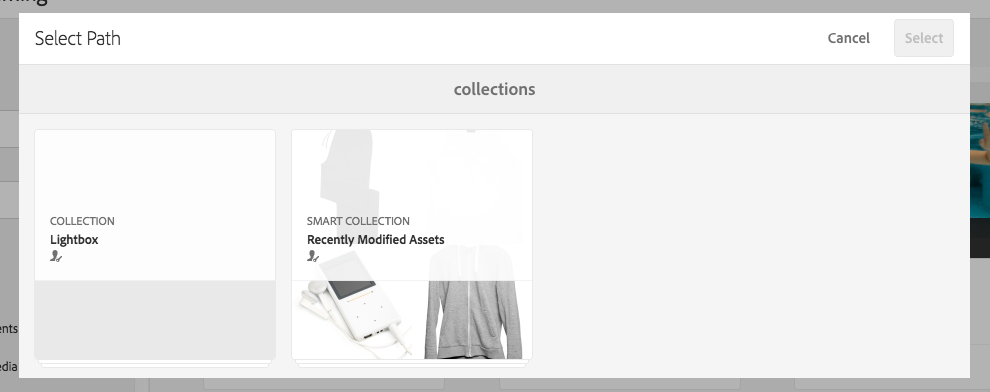

# 在Dynamic Media中使用選取器 {#working-with-selectors}

使用互動式影像、互動式視訊或轉盤橫幅時，您會選取資產，然後選取熱點和影像地圖的網站和產品以連結至。 使用影像集、回轉集和多媒體集時，您也可以使用資產選擇器選取資產。

本主題說明如何使用產品、網站和資產選取器，包括在選取器內瀏覽、篩選、排序的功能。

您在建立轉盤集、新增熱點和影像地圖、建立互動式視訊和影像時存取選取器。

例如，在此轉盤橫幅中，如果您要將熱點或影像地圖連結至快速檢視頁面，請使用產品選取器。 如果要將熱點或影像映射連結到超連結，請使用站點選擇器；建立投影片時，請使用「資產」選取器。

選擇熱點或影像映射的位置時（而不是手動輸入），使用的是選擇器。 網站選取器只有在您是[!DNL Adobe Experience Manager Sites]客戶時才有效。 產品選擇器也需要[!DNL Experience Manager Commerce]。

## 在Dynamic Media中選取產品 {#selecting-products}

當您想要熱點或影像地圖為產品目錄中的特定產品提供快速檢視時，請使用產品選取器來選擇產品。

1. 導覽至「轉盤集」、「互動式影像」或「互動式視訊」，然後選取「**[!UICONTROL 動作]**」標籤（僅在您已定義熱點或影像地圖時可用）。

   產品選擇器位於&#x200B;**[!UICONTROL 動作類型]**&#x200B;區域。

   

1. 選取&#x200B;**[!UICONTROL 產品選取器]**&#x200B;圖示（放大鏡），並導覽至目錄中的產品。

   

   您可以點選&#x200B;**[!UICONTROL Filter]**&#x200B;並輸入關鍵字，或選取標籤，或兩者，以依關鍵字或標籤來篩選。

   

   您可以點選&#x200B;**[!UICONTROL Browse]**&#x200B;並導覽至其他資料夾，以變更[!DNL Experience Manager]瀏覽產品資料的位置。

   

   選擇&#x200B;**[!UICONTROL 按]**&#x200B;排序以更改[!DNL Experience Manager]按最新到最舊或最舊到最新排序。

   

   選擇&#x200B;**[!UICONTROL 以]**&#x200B;查看以更改查看產品的方式 — **[!UICONTROL 清單視圖]**&#x200B;或&#x200B;**[!UICONTROL 卡片視圖]**。

   

1. 選取產品後，欄位會以產品縮圖和名稱填入。

   

1. 在&#x200B;**[!UICONTROL 預覽]**&#x200B;模式下，可以選擇熱點或影像映射，並查看快速視圖的顯示方式。

   

## 在Dynamic Media中選取網站 {#selecting-sites}

當您希望熱點或影像映射連結到[!DNL Experience Manager]網站內管理的網頁時，請使用網站選擇器選擇網頁。

1. 導覽至「轉盤集」、「互動式影像」或「互動式視訊」，然後選取「**[!UICONTROL 動作]**」標籤（僅在您已定義熱點或影像地圖時可用）。

   「網站選擇器」位於「動 **[!UICONTROL 作類型]** 」區。

   

1. 選取&#x200B;**[!UICONTROL 網站選取器]**&#x200B;圖示（含放大鏡的資料夾），並導覽至您[!DNL Experience Manager]網站中要連結熱點或影像地圖的頁面。

   

1. 選取網站後，欄位會填入路徑。

   

1. 在&#x200B;**[!UICONTROL 預覽]**&#x200B;模式中，如果選擇熱點或影像映射，則導航到您指定的[!DNL Experience Manager]網站頁。

## 在Dynamic Media中選取資產 {#selecting-assets}

使用此選取器來選擇要用於轉盤橫幅、互動式視訊、影像集、混合媒體集和回轉集的影像。 在互動式視訊中，當您在&#x200B;**[!UICONTROL Content]**&#x200B;索引標籤中選取&#x200B;**[!UICONTROL Select Assets]**&#x200B;時，即可使用資產選取器。 在轉盤集中，當您建立投影片時，可使用資產選取器。 在影像集、混合媒體集和回轉集中，當您分別建立影像集、混合媒體集或回轉集時，可使用資產選取器。

如需詳細資訊，請參閱[資產選擇器](/help/assets/search-assets.md#asset-selector)。

1. 導覽至轉盤集並建立投影片。 或者，導覽至互動式視訊，前往&#x200B;**[!UICONTROL Content]**&#x200B;標籤，然後選取資產。 或者，建立混合媒體集、影像集或回轉集。
1. 選取&#x200B;**[!UICONTROL 資產選取器]**&#x200B;圖示（含放大鏡的資料夾）並導覽至資產。

   

   點選&#x200B;**[!UICONTROL Filter]**&#x200B;並輸入關鍵字，或新增條件，或兩者，依關鍵字或標籤篩選。

   

   您可以導覽至&#x200B;**[!UICONTROL Path]**&#x200B;欄位中的其他資料夾，以變更[!DNL Experience Manager]瀏覽資產的位置。

   選取&#x200B;**[!UICONTROL 集合]**&#x200B;以僅搜尋集合內的資產。

   

   選擇「**[!UICONTROL 以]**&#x200B;查看」以更改您查看產品的方式 — **[!UICONTROL 清單視圖]**、**[!UICONTROL 列視圖]**&#x200B;或&#x200B;**[!UICONTROL 卡片視圖]**。

   

1. 若要選取資產，請選取核取記號。 資產隨即顯示。

   
—>
