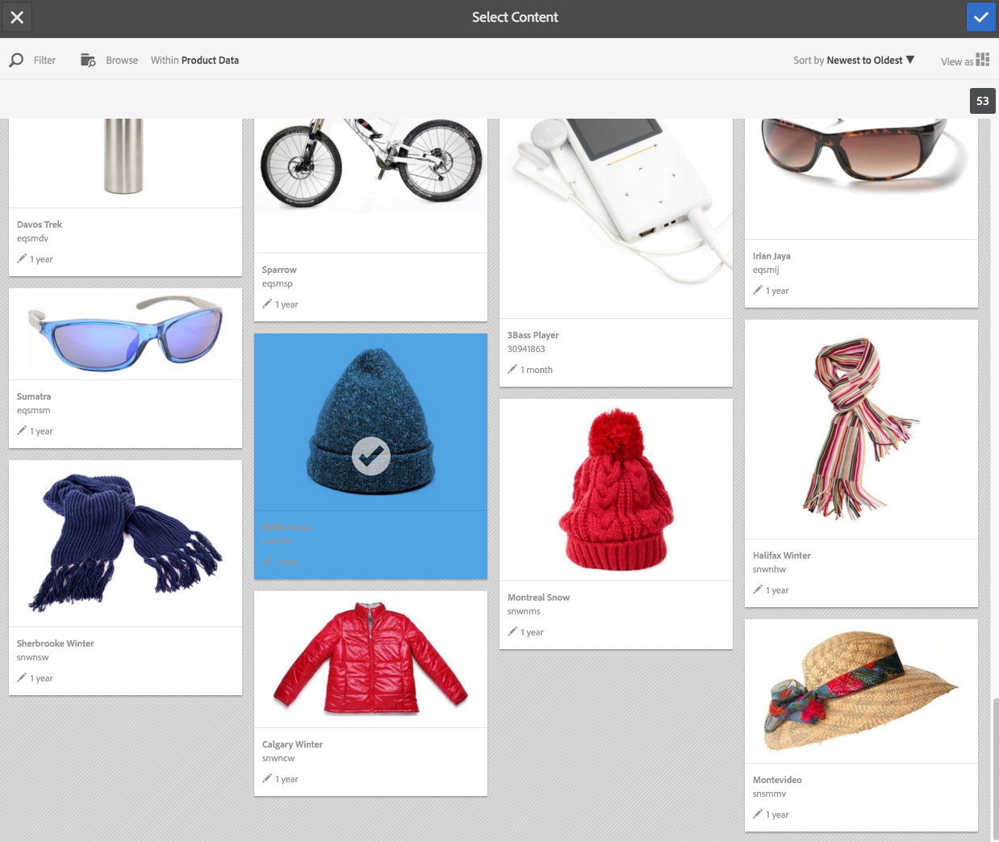

# 在動態媒體{#working-with-selectors}中使用選擇器

使用互動式影像、互動式視訊或轉盤橫幅時，您會選取資產，並選取熱點和影像地圖的網站和產品以連結至。 使用影像集、回轉集和多媒體集時，您也可以使用資產選擇器來選取資產。

本主題涵蓋如何使用產品、網站和資產選擇器，包括在選擇器內瀏覽、篩選、排序的功能。

在建立轉盤集、新增熱點和影像地圖、建立互動式視訊和影像時，您可以存取選擇器。

例如，在此轉盤橫幅中，如果您要將熱點或影像地圖連結至Quickview頁面，請使用產品選擇器；如果您要將熱點或影像地圖連結至超連結，請使用網站選擇器；建立新投影片時，請使用「資產選擇器」。

選擇熱點或影像映射所到的位置（而不是手動輸入）時，您使用選擇器。 只有您是AEM Sites客戶時，「網站」選擇器才能運作。 產品選擇器也需要AEM Commerce。

## 在動態媒體中選擇產品{#selecting-products}

當您想要在產品目錄中提供特定產品的快速檢視時，使用產品選擇器來選擇產品。

1. 導覽至「轉盤集」、「互動式影像」或「互動式視訊」，然後點選「動作 **** 」標籤 (僅在您已定義熱點或影像地圖時可用)。

   產品選擇器位於&#x200B;**[!UICONTROL 動作類型]**&#x200B;區域。

   

1. 點選「**[!UICONTROL 產品選擇器]**」圖示（放大鏡），並導覽至目錄中的產品。

   

   您也可以點選&#x200B;**[!UICONTROL Filter]**&#x200B;並輸入關鍵字，或選取標籤或兩者，以依關鍵字或標籤進行篩選。

   

   您可以點選&#x200B;**[!UICONTROL Browse]**&#x200B;並導覽至其他資料夾，以變更AEM瀏覽產品資料的位置。

   

   點選&#x200B;**[!UICONTROL 排序方式]**&#x200B;以變更AEM依最新到最舊或最舊到最新排序。

   

   點選「 **[!UICONTROL 檢視方式]** 」以變更您檢視產品的方式- 「清單檢視 **[!UICONTROL 」或「資]** 訊卡檢視」 ****。

   

1. 選取產品後，欄位會填入產品縮圖和名稱。

   

1. 在&#x200B;**[!UICONTROL 預覽]**&#x200B;模式下，可以點選熱點或影像映射，並查看Quickview的外觀。

   

## 在動態媒體中選擇站點{#selecting-sites}

當您想要將熱點或影像地圖連結至AEM網站內管理的網頁時，請使用網站選擇器來選擇網頁。

1. 導覽至「轉盤集」、「互動式影像」或「互動式視訊」，然後點選「動作 **** 」標籤 (僅在您已定義熱點或影像地圖時可用)。

   「網站選擇器」位於「動 **[!UICONTROL 作類型]** 」區。

   

1. 點選「**[!UICONTROL 網站選擇器]**」圖示 (含放大鏡的資料夾)，並導覽至您 AEM 網站中要連結熱點或影像地圖的頁面。

   

1. 選取網站後，欄位會填入路徑。

   

1. 當您在&#x200B;**[!UICONTROL 預覽]**&#x200B;模式中點選熱點或影像地圖時，您會導覽至您指定的AEM網站頁面。

## 在動態媒體中選擇資產{#selecting-assets}

使用此選擇器來選擇影像以用於轉盤橫幅、互動式視訊、影像集、混合媒體集和回轉集。 在互動式視訊中，當您點選&#x200B;**[!UICONTROL 內容]**&#x200B;標籤中的&#x200B;**[!UICONTROL 選取資產]**&#x200B;時，即可使用資產選擇器。 在「轉盤集」中，當您建立新投影片時，可使用資產選擇器。 在影像集、混合媒體集和回轉集中，當您分別建立新的影像集、混合媒體集或回轉集時，就可使用資產選擇器。

如需詳細資訊，請參閱[資產選擇器](/help/assets/search-assets.md#assetselector)。

1. 導覽至「轉盤集」並建立新投影片。 或者，導覽至「互動式視訊」，前往&#x200B;**[!UICONTROL Content]**&#x200B;標籤並選取資產。 或者，建立混合媒體集、影像集或回轉集。
1. 點選「資 **[!UICONTROL 產選擇器]** 」圖示 (含放大鏡的資料夾) 並導覽至資產。

   

   您也可以點選&#x200B;**[!UICONTROL Filter]**&#x200B;並輸入關鍵字，或新增條件或兩者，依關鍵字或標籤進行篩選。

   

   您可以在&#x200B;**[!UICONTROL Path]**&#x200B;欄位中導覽至另一個檔案夾，以變更AEM瀏覽資產的位置。

   點選「**[!UICONTROL Collection]**」，僅搜尋系列中的資產。

   

   點選「 **[!UICONTROL 檢視]** 」以變更您檢視產品的方式- 「清單檢視 **[!UICONTROL 」、「]**&#x200B;欄檢視」 **[!UICONTROL ，或「卡]******&#x200B;片檢視」。

   

1. 點選核取標籤以選取資產。 資產隨即顯示。

   
—>
