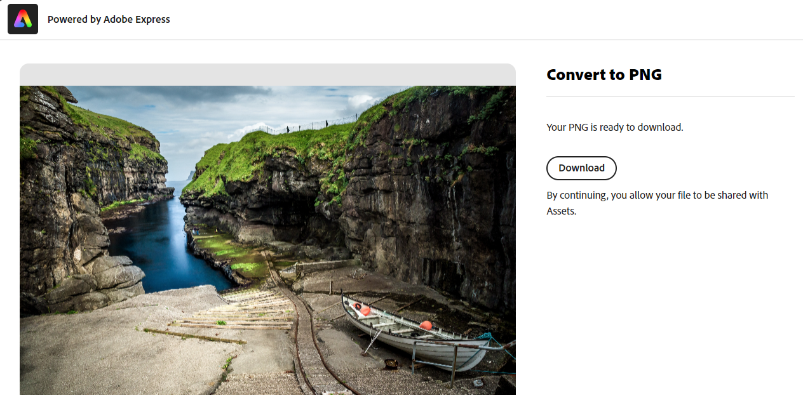

# 在 [!DNL Assets view] 中編輯影像 {#edit-images}

[!DNL Assets view] 提供 [!DNL Adobe Express] 和 [!DNL Adobe Photoshop Express] 所支援的人性化編輯選項。 使用 [!DNL Adobe Express] 時提供的編輯動作包括調整影像大小、移除背景、裁切影像以及將 JPEG 轉換為 PNG。

編輯影像後，即可將新影像另存新版。版本設定功能有助於您稍後在必要時還原成原始資產。要編輯影像，[開啟其預覽](/help/assets/navigate-assets-view.md)，然後按一下「**[!UICONTROL 編輯影像]**」。

>[!NOTE]
>
>您可以使用 [!DNL Adobe Express] 編輯 PNG 和 JPEG 檔案類型的影像。

<!--The editing actions that are available are Spot healing, Crop and straighten, Resize image, and Adjust image.-->

## 使用 Adobe Express 編輯影像 {#edit-using-express}

>[!CONTEXTUALHELP]
>id="assets_express_integration"
>title="Adobe Express 整合"
>abstract="由 Adobe Express 提供支援的簡單且直觀的影像編輯工具可直接在 AEM Assets 中使用，以增加內容的重複使用並加快內容的速度。"

### 調整影像大小 {#resize-image-using-express}

熱門的使用案例是將影像調整成特定大小。[!DNL Assets view] 可讓您快速調整影像大小，為特定相片大小提供預先計算好的新解析度，以符合常見的相片大小。若要使用 [!DNL Assets view] 調整影像大小，請按照以下步驟操作：

1. 選取影像並按一下「**編輯**」。
2. 從左窗格中可用的快速動作中，按一下「**[!DNL Resize Image]**」。
3. 從「**[!UICONTROL 調整大小的內容]**」下拉清單選取適當的社交媒體平台，然後從顯示的選項中選擇影像大小。
4. 如有必要，使用 **[!UICONTROL 影像比例]** 欄位。
5. 按一下「**[!DNL Apply]**」以套用您的變更。
   

   您已編輯的影像可供下載。您可以將編輯後的資產另存為同一資產的新版本，也可以將其另存為新資產。
   

### 移除背景 {#remove-background-using-express}

您可以透過幾個簡單的步驟從影像中移除背景，如下所述：

1. 選取影像並按一下「**編輯**」。
2. 從左窗格中可用的快速動作中，按一下「**[!DNL Remove Background]**」。Experience Manager Assets 會顯示沒有背景的影像。
3. 按一下「**[!DNL Apply]**」以套用您的變更。
   

   您編輯的影像可供下載。您可以將編輯後的資產另存為同一資產的新版本，也可以將其另存為新資產。

### 裁切影像 {#crop-image-using-express}

使用嵌入式 [!DNL Adobe Express] 快速動作可輕鬆將影像轉換為完美大小。

1. 選取影像並按一下「**編輯**」。
2. 從左窗格中可用的快速動作中，按一下「**[!DNL Crop Image]**」。
3. 拖曳影像角落上的控點，建立所要的裁切大小。
4. 按一下「**[!DNL Apply]**」。
   
裁切後的影像可供下載。您可以將編輯後的資產另存為同一資產的新版本，也可以將其另存為新資產。

### 將 JPEG 轉換為 PNG {#convert-jpeg-to-png-using-express}

您可以使用 Adobe Express 將 JPEG 影像快速轉換為 PNG 格式。 執行以下步驟：

1. 選取影像並按一下「**編輯**」。
2. 從左窗格中可用的快速動作中，按一下「**[!DNL JPEG to PNG]**」。
   
3. 按一下「**[!UICONTROL 下載]**」。

### 限制 {#limitations-adobe-express}

* 支援的影像解析度：最小 - 50 像素，最大 - 每維度 6000 像素

* 支援的檔案大小上限：17MB

## 使用Adobe Express內嵌編輯器編輯影像 {#edit-using-embedded-editor}

擁有Express存取權的使用者現在可以直接在AEM Assets中使用，整合來自Adobe Express和Adobe Firefly的影像編輯和建立工具，以改進內容重複使用和加快內容速度。 您也可以使用預先定義的元素，讓您的資產看起來令人驚豔，或執行快速動作，只要按幾下即可編輯您的影像。

若要使用編輯影像 [!DNL Adobe Express] 內嵌編輯器，請遵循下列步驟：

1. 從中選擇影像 [!DNL Experience Manager] 資產存放庫。
1. 按一下 **[!UICONTROL 以Adobe Express開啟]**.

   

   您可以善用以下功能 [!DNL Adobe Express] 執行所有與影像編輯相關的動作，例如 [調整影像大小](https://helpx.adobe.com/in/express/using/resize-image.html)， [移除或變更背景顏色](https://helpx.adobe.com/in/express/using/remove-background.html)， [裁切影像](https://helpx.adobe.com/in/express/using/crop-image.html)，以及更多功能。

1. 完成影像編輯後，您可以將資產下載為新資產，或將資產另存為新版本。

## 使用Adobe Express建立新資產 {#create-new-embedded-editor}

[!DNL Assets view] 提供使用從頭開始建立新範本的功能 [!DNL Adobe Express] 內嵌編輯器。 若要使用建立新資產 [!DNL Adobe Express]，請執行以下步驟：

1. 瀏覽至 **[!UICONTROL 我的工作區]** 並按一下 **[!UICONTROL 建立]** 於上方顯示的Adobe Express橫幅內 [!UICONTROL 快速存取] 區段。 [!DNL Adobe Express] 空白畫布會顯示在 [!DNL Assets view] 使用者介面。
1. 建立您的內容，使用 [範本](https://helpx.adobe.com/in/express/using/work-with-templates.html). 否則，請導覽至 **[!UICONTROL 您的內容]** 以修改現有內容。
1. 完成編輯後，請按一下 **[!UICONTROL 另存為新資產]**.
1. 指定已建立資產的目的地路徑，然後按一下 **[!UICONTROL 儲存]**.

>[!NOTE]
>
>* 您只能修改以下專案的影像： `JPEG` 和 `PNG` 格式型別。
>* 資產大小必須小於14 MB。
>* 您可以將影像儲存在 `PDF`， `JPEG`，或 `PNG` 格式。

## 使用 [!DNL Adobe Photoshop Express] 編輯影像 {#edit-using-photoshop-express}

<!--
After editing an image, you can save the new image as a new version. Versioning helps you to revert to the original asset later, if needed. To edit an image, [open its preview](//help/navigate-assets-view.md#preview-assets) and click **[!UICONTROL Edit Image]**  from the rail on the right.

*Figure: The options to edit images are powered by [!DNL Adobe Photoshop Express].*
-->

### 污點修復影像 {#spot-heal-images-using-photoshop-express}

如果影像上出現細微污點或小型物件，您可以使用 Adobe Photoshop 提供的污點修復功能編輯和移除污點。

筆刷會取樣修飾過的區域，然後將修復的像素完美融入影像的其餘部份。請使用只比您要修復的污點稍大的筆刷大小。

<!-- 
TBD: See if we should give backlinks to PS docs for these concepts.
For more information about how Spot Healing works in Photoshop, see [retouching and repairing photos](https://helpx.adobe.com/photoshop/using/retouching-repairing-images.html). 
-->

### 裁切和拉直影像 {#crop-straighten-images-using-photoshop-express}

您可以使用裁切和拉直選項進行基本的裁切、旋轉影像、水平或垂直翻轉影像，以及將影像裁切成適用於熱門社交媒體網站的尺寸。

若要儲存您的編輯，請按一下&#x200B;**[!UICONTROL 裁切影像]**。編輯後，即可將新影像另存新版。

許多預設選項可讓您將影像裁切成適合各種社交媒體基本資料的最佳比例。

### 調整影像大小 {#resize-image-using-photoshop-express}

您可以用公分或英吋檢視常見的相片大小，以知道尺寸大小。依照預設，調整大小方法仍會保持長寬比。若要手動覆寫長寬比，請按一下「」。

請輸入尺寸，然後按一下&#x200B;**[!UICONTROL 調整影像大小]**&#x200B;即可調整影像大小。將變更另存為新版本前，您可以按一下[!UICONTROL 還原]以在儲存前復原所有變更，或按一下[!UICONTROL  回復]以變更編輯流程中的特定步驟。

### 調整影像 {#adjust-image-using-photoshop-express}

[!DNL Assets view] 可讓您按幾下滑鼠，即可調整顏色、色調、對比等等。在編輯視窗中，按一下&#x200B;**[!UICONTROL 調整影像]**。在右側邊欄中有以下選項：

* **熱門**：[!UICONTROL 高對比度和細節]、[!UICONTROL 減少飽和對比度]、[!UICONTROL 陳年相片]、[!UICONTROL 黑白柔焦]以及[!UICONTROL 黑白墨色調]。
* **顏色**：[!UICONTROL 自然]、[!UICONTROL 明亮]、[!UICONTROL 高對比度]、[!UICONTROL 高對比度和細節]、[!UICONTROL 鮮豔]以及[!UICONTROL 霧面]。
* **創意**：[!UICONTROL 減少飽和對比度]、[!UICONTROL 冷光]、[!UICONTROL 藍綠色和紅色]、[!UICONTROL 柔霧]、[!UICONTROL 復古即時]、[!UICONTROL 暖對比度]、[!UICONTROL 單調和綠色]、[!UICONTROL 紅色霧面]、[!UICONTROL 溫暖陰影]以及[!UICONTROL 陳年相片]。
* **黑白**：[!UICONTROL 黑白景觀]、[!UICONTROL 黑白高對比度]、[!UICONTROL 黑白力量]、[!UICONTROL 黑白低對比度]、[!UICONTROL 黑白單調]、[!UICONTROL 黑白柔焦]、[!UICONTROL 黑白紅外線]、[!UICONTROL 黑白硒色調]、[!UICONTROL 黑白墨色調]以及[!UICONTROL 黑白分割色調]。
* **周邊暗角**：[!UICONTROL 無]、[!UICONTROL 輕度]、[!UICONTROL 中度]以及[!UICONTROL 重度]。

<!--
TBD: Insert a video of the available social media options.
-->

### 後續步驟 {#next-steps}

* 使用資產檢視使用者介面所提供的[!UICONTROL 意見回饋]選項提供產品意見回饋

* 若要提供文件意見回饋，請使用右側邊欄提供的[!UICONTROL 編輯此頁面]或[!UICONTROL 記錄問題]

* 連絡[客戶服務](https://experienceleague.adobe.com/?support-solution=General#support)

>[!MORELIKETHIS]
>
>* [檢視資產的版本記錄](/help/assets/navigate-assets-view.md)
