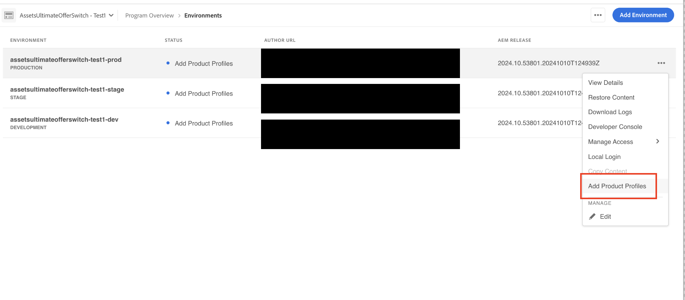
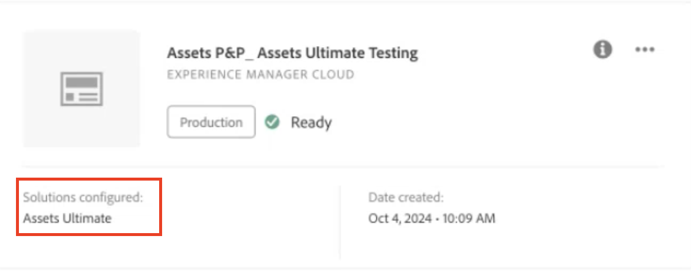

# 啟用[!DNL Assets]as a Cloud ServiceUltimate {#enable-assets-cloud-service-ultimate}

| [搜尋最佳實務](/help/assets/search-best-practices.md) | [中繼資料最佳實務](/help/assets/metadata-best-practices.md) | [Content Hub](/help/assets/product-overview.md) | [具有 OpenAPI 功能的 Dynamic Media](/help/assets/dynamic-media-open-apis-overview.md) | [AEM Assets 開發人員文件](https://developer.adobe.com/experience-cloud/experience-manager-apis/) |
| ------------- | --------------------------- |---------|----|-----|

Assetsas a Cloud Service旗艦版可讓您執行各種重要的DAM功能，例如：資產管理和程式庫服務、安全性和許可權管理、創意和Experience Cloud連線、UI擴充性、API導向的自動化、與Adobe和非Adobe應用程式的整合、自訂程式碼部署，以及其他更多功能。 如需完整清單，請參閱[Assetsas a Cloud Service旗艦版總覽](/help/assets/assets-ultimate-overview.md)。

## 啟用Assets Ultimate {#enable-assets-ultimate}

新的Assetsas a Cloud Service客戶必須先使用Cloud Manager建立新程式，以啟用Assets Ultimate。

執行以下步驟：

1. 以系統管理員身分登入Cloud Manager。 確保您在登入時選取正確的組織。

   >[!NOTE]
   >
   >確定您已新增至適當的Cloud Manager產品設定檔，以新增程式。 如需詳細資訊，請參閱[Cloud Manager中的角色型許可權](/help/onboarding/cloud-manager-introduction.md#role-based-permissions)。

1. [建立新程式](/help/journey-onboarding/create-program.md)並[新增環境](/help/journey-onboarding//create-environments.md)。

   建立新程式時，在&#x200B;**[!UICONTROL 解決方案和附加元件]**&#x200B;索引標籤中，選取&#x200B;**[!UICONTROL Assets Ultimate]**。 您也可以展開&#x200B;**[!UICONTROL Assets Ultimate]**，然後選取&#x200B;**[!UICONTROL Content Hub]**&#x200B;以啟用[Content Hub](/help/assets/product-overview.md)的資產發佈。

   

1. 按一下&#x200B;**[!UICONTROL 建立]**&#x200B;以建立程式。 Assets Ultimate現已啟用Experience Manager Assetsas a Cloud Service。

系統管理員自動獲得Assets Ultimate上AEM管理員的許可權，並會收到電子郵件以導覽至Admin Console來管理可用的產品設定檔。

Admin Console上的AEM as a Cloud Service執行個體包含下列產品設定檔：

* AEM Administrators

* AEM 使用者

* [AEM Assets Collaborator使用者](#onboard-collaborator-users)

* [AEM Assets超級使用者](#onboard-power-users)

  

如果您已啟用適用於Assets的Content Hubas a Cloud Service，則在Admin Console的AEM Assetsas a Cloud Service中會建立一個新執行個體，並將`delivery`當作尾碼：

>[!NOTE]
>
>如果您在2024年8月14日之前布建Content Hub，則會建立以`contenthub`作為尾碼的新執行個體。

`author``publish`

`AEM Assets Limited Users`

您可以開始將使用者或使用者群組新增至此產品設定檔，以便讓他們存取Content Hub。

>[!NOTE]
>
>如果您在2024年8月14日之前布建Content Hub，Content Hub產品設定檔會在`Limited Users`之後提及`contenthub`，而非`delivery`。

## Enable Assets Ultimate for existing customers {#enable-assets-ultimate-existing-customers}

Existing Assets as a Cloud Service customers can upgrade to Assets Ultimate by executing two simple steps. You can navigate to the Assets as a Cloud Service program in Cloud Manager and see upgrade status on the Program card based on the availability of Assets Ultimate credits. `Assets license upgrade required`

`Assets license upgrade available`

### Prerequisites for upgrade {#prerequisites-assets-upgrade}

所有環境都必須升級至最新的AEM as a Cloud Service發行版本，或至少`2024.10.18175`個發行版本。 如果您不符合最低需求，請聯絡您的Adobe代表，以切換至所需的AEM發行版本。

### 升級至 Assets Ultimate {#upgrade-assets-ultimate}

執行以下步驟：

1. 切換到AEM發行版本的最低要求後，按一下計畫名稱。 升級卡片會顯示在&#x200B;**[!UICONTROL 環境]**&#x200B;區段上方，如下圖所示：

   

1. **** Cloud Manager displays options to add new product profiles to all environments available in the program or individual environments.

   

1. ********

   按一下「**[!UICONTROL 個別環境]**」會顯示方案中所有可用環境的清單。

1. ****

   

   ********

   `Adding Product Profiles``Running`

   You must add product profiles to all environments available in the program, individually or all environments together, before executing the next step.

1. ******[!UICONTROL 升級]**&#x200B;選項只有在您將產品設定檔新增到所有可用環境時才會顯示。

   

   升級程式已完成，且您已成功將Assetsas a Cloud Service升級至Assets Ultimate。 程式的狀態顯示`Assets Ultimate`。

   升級後

Admin Console上的AEM as a Cloud Service執行個體現在包含下列產品設定檔：

* AEM管理員

* AEM 使用者

* [AEM Assets Collaborator使用者](#onboard-collaborator-users)

* [AEM Assets超級使用者](#onboard-power-users)

如果您需要啟用Content Hub，請在Cloud Manager中按一下方案名稱上的「更多選項(...)」圖示，然後選取&#x200B;**[!UICONTROL 編輯方案]**。 展開&#x200B;**[!UICONTROL Assets Ultimate]**&#x200B;並按一下&#x200B;**[!UICONTROL Content Hub]**。 此步驟會啟用適用於Assets Ultimate的Content Hub。 在AEM Assets中以`delivery`為尾碼的as a Cloud ServiceAdmin Console上已建立新執行個體：

>[!NOTE]
>
>如果您在2024年8月14日之前布建Content Hub，則會建立以`contenthub`作為尾碼的新執行個體。

請注意，Content Hub的執行個體名稱中沒有`author`或`publish`。

按一下執行個體名稱以檢視`AEM Assets Limited Users` Content Hub產品設定檔。

您可以開始將使用者或使用者群組新增至此產品設定檔，以便讓他們存取Content Hub。

>[!NOTE]
>
>如果您在2024年8月14日之前布建Content Hub，Content Hub產品設定檔會在`Limited Users`之後提及`contenthub`，而非`delivery`。

## 上線AEM Assets Collaborator使用者 {#onboard-collaborator-users}

AEM Assets Collaborator使用者可以透過貴組織在其他Adobe產品和非Adobe應用程式中提供的Assets整合來使用Experience Manager的資產，使用內建Adobe Express和Firefly來建立和編輯資產(運用專業設計的範本、品牌套件、Adobe Stock資產等)，以及使用AEM Assets Content Hub入口網站存取和利用貴組織核准的資產。

若要加入Collaborator使用者：

1. 按一下Admin Console上產品清單中的Experience Manager Assets產品名稱，存取AEM as a Cloud Service產品設定檔。

1. 按一下AEM as a Cloud Service的生產製作例項：
   

1. ****
   

1. 按一下[儲存]儲存變更。****

您也可以存取及檢視指派給Collaborator使用者的服務，如下圖所示：

為Collaborator使用者提供

預設已啟用`Adobe Express`和`AEM Assets Collaborator Users`服務。

>[!NOTE]
>
>您可以依需求開啟或關閉切換功能，以啟用或停用可用服務，但Adobe建議使用為產品設定檔啟用的預設服務。

## Onboard AEM Assets Power users {#onboard-power-users}

AEM Assets Power users can access all AEM Assets capabilities including managing assets, permissions, metadata and the overall governance and automation around digital assets, work with assets from Experience manager via integrations of Assets available to your organization in other Adobe and non-Adobe applications, create and edit assets using built-in Adobe Express and Firefly leveraging professionally designed templates, brand kits, Adobe Stock assets, and so on, and access and leverage approved assets from your organization using AEM Assets Content Hub portal.

若要內建進階使用者：

1. 按一下Admin Console上產品清單中的Experience Manager Assets產品名稱，存取AEM as a Cloud Service產品設定檔。

1. 按一下AEM as a Cloud Service的生產製作例項：
   

1. ****
   

1. 按一下[儲存]儲存變更。****

您也可以存取及檢視指派給超級使用者的服務，如下圖所示：

超級使用者的

預設已啟用`Adobe Express`和`AEM Assets Power Users`服務。

>[!NOTE]
>
>您可以依需求開啟或關閉切換功能，以啟用或停用可用服務，但Adobe建議使用為產品設定檔啟用的預設服務。
