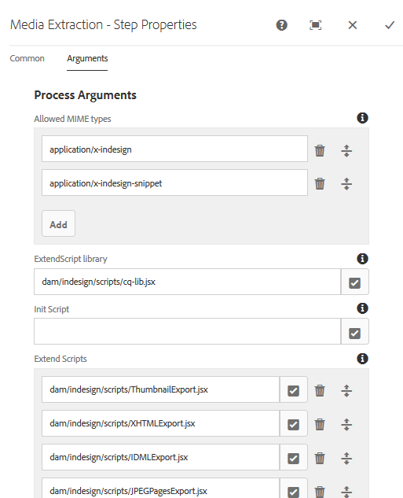

# 將AEM Assets與InDesign server整合 {#integrating-aem-assets-with-indesign-server}

Adobe Experience Manager(AEM)資產使用：

* 一個代理，用於分配特定處理任務的負載。 Proxy是AEM例項，可與Proxy工作者通訊以完成特定工作，而其他AEM例項則可傳送結果。
* 用於定義和管理特定任務的代理工作器。
這些工作可以涵蓋各種任務；例如，使用InDesign server來處理檔案。

若要將檔案完整上傳至您使用Adobe inDesign建立的AEM資產，會使用Proxy。 這會使用代理工作者與Adobe inDesign server通訊，在Adobe inDesign Server中執行指令碼  ，以擷取中繼資料並產生AEM Assets的各種轉譯。 Proxy工作者可讓InDesign server和雲端組態中的AEM例項進行雙向通訊。

>[!NOTE]
>
>Adobe inDesign提供兩種產品：
>
>* [InDesign](https://www.adobe.com/products/indesign.html)
   >  這可讓您設計用於列印和／或數位散發的頁面版面。
   >
   >
* [InDesign Server](https://www.adobe.com/products/indesignserver.html)
   >  此引擎可讓您根據您使用InDesign建立的內容，以程式設計方式建立自動化檔案。 它以服務的形式運作，為其 [ExtendScript引擎提供介面](https://www.adobe.com/devnet/scripting.html) 。
   >  這些指令碼是以extendscript撰寫，類似javascript。 如需Indesign指令碼的詳細資訊，請參 [閱https://www.adobe.com/devnet/indesign/documentation.html#idscripting](https://www.adobe.com/devnet/indesign/documentation.html#idscripting)。
>

## 抽取的運作方式 {#how-the-extraction-works}

Adobe inDesign server可與AEM Assets整合，如此您就可上傳以InDesign建立的INDD檔案、產生轉譯、擷取所有媒體（例如視訊），並儲存為資產：

>[!NOTE]
>
>舊版AEM可以擷取XMP和縮圖，現在所有媒體都可以擷取。

1. 將您的INDD檔案上傳至AEM Assets。
1. 架構會透過SOAP（簡單物件存取通訊協定）將指令指令碼傳送至InDesign Server。
此命令指令碼將：

   * 檢索INDD檔案。
   * 執行InDesign server命令：

      * 會擷取結構、文字和任何媒體檔案。
      * 產生PDF和JPG轉譯。
      * 產生HTML和IDML轉譯。
   * 將產生的檔案張貼回AEM Assets。
   >[!NOTE]
   >
   >IDML是以XML為基礎的格式，可轉換 *InDesign檔案* 中的所有項目。 它會使用 [Zip壓縮儲存為壓縮的](https://www.techterms.com/definition/zip) 套件。
   >
   >
   >如需詳 [細資訊，請參閱Adobe Press - inDesign Interchange Formats INX和IDML](https://www.adobepress.com/articles/article.asp?p=1381880&seqNum=8) 。

   >[!CAUTION]
   >
   >如果InDesign server未安裝或未設定，則您仍可將INDD檔案上傳至AEM。 但產生的轉譯將限制為PNG和JPEG。 您將無法產生HTML、.idml或頁面轉譯。

1. 擷取和轉譯產生後：

   * 此結構會複製到( `cq:Page` 類型的轉譯)。
   * 擷取的文字和檔案會儲存在AEM Assets中。
   * 所有轉譯都儲存在AEM Assets、資產本身。

## 整合InDesign server與AEM {#integrating-the-indesign-server-with-aem}

若要整合InDesign server以便與AEM Assets搭配使用，以及在設定Proxy後，您必須：

1. [安裝InDesign Server](#installing-the-indesign-server)。
1. 如有需要， [請設定AEM Assets工作流程](#configuring-the-aem-assets-workflow)。
只有當預設值不適用於您的例項時，才需要這麼做。

1. 為InDesign [Server設定代理工作器](#configuring-the-proxy-worker-for-indesign-server)。

### 安裝InDesign Server {#installing-the-indesign-server}

若要安裝並啟動InDesign Server以搭配AEM使用：

1. 下載並安裝Adobe inDesign Server。

   >[!NOTE]
   >
   >InDesign Server（CS6和更新版本）。

1. 如有需要，您可自訂InDesign server例項的設定。

1. 從命令行啟動伺服器：

   `<*ids-installation-dir*>/InDesignServer.com -port 8080`

   這會在連接埠8080上以SOAP外掛程式監聽來啟動伺服器。 所有日誌消息和輸出都直接寫入命令窗口。

   >[!NOTE]
   >
   >如果要將輸出消息保存到檔案，則使用重定向；例如，在Windows下：
   >
   >
   >`<ids-installation-dir>/InDesignServer.com -port 8080 > ~/temp/INDD-logfile.txt 2>&1`

### 設定AEM Assets工作流程 {#configuring-the-aem-assets-workflow}

AEM Assets有預先設定的工作流程 **DAM Update Asset**，其中包含數個InDesign專屬的處理步驟：

* [媒體提取](#media-extraction)
* [頁面提取](#page-extraction)

<!--
BROKEN LINK This workflow is setup with default values that can be adapted for your setup on the various author instances (this is a standard workflow, so further information is available under [Editing a Workflow](/help/sites-developing/workflows-models.md#configuring-a-workflow-step)). If you are using the default values (including the SOAP port), then no configuration is needed. BROKEN LINK
-->

在設定後，上傳InDesign檔案至AEM Assets（透過任何一種常用方法）將觸發處理資產和準備各種轉譯所需的工作流程。 將檔案上傳至AEM Assets以 `.indd` 測試您的設定，確認您看到IDS在 `<*your_asset*>.indd/Renditions`

#### 媒體提取 {#media-extraction}

此步驟控制從INDD檔案抽取介質。

若要自訂，您可以編 **輯** 「媒體擷 **取」步驟的「引** 數」標籤。

媒體擷取引數和指令碼路徑

* **ExtendScript程式**&#x200B;庫這是其他指令碼所需的簡單http get/post方法程式庫。

* **擴充指令碼**&#x200B;您可以在此處指定不同的指令碼組合。 如果您想要在InDesign server上執行您自己的指令碼，請將指令碼儲存在 `/apps/settings/dam/indesign/scripts`。
如需Indesign指令碼的詳細資訊，請參閱：
   [https://www.adobe.com/devnet/indesign/documentation.html#idscripting](https://www.adobe.com/devnet/indesign/documentation.html#idscripting)

>[!CAUTION]
>
>請 **勿變更****ExtendScript程式庫**。

>此程式庫提供與Sling通訊所需的HTTP功能。 此設定會指定要傳送至InDesign server以供其使用的程式庫。
>
「媒 `ThumbnailExport.jsx` 體擷取」工作流程步驟執行的指令碼會產生。jpg格式的縮圖轉譯。 「處理縮圖」工作流程步驟會使用此轉譯，以產生AEM所需的靜態轉譯。

您可以設定「處理縮圖」工作流程步驟，以產生不同大小的靜態轉譯。 請確定您不會移除預設值，因為AEM Assets UI需要這些預設值。 最後，「刪除影像預覽轉譯」工作流程步驟會移除。jpg縮圖轉譯，因為不再需要它。

#### 頁面提取 {#page-extraction}

這會從擷取的元素建立AEM頁面。 擷取處理常式可用來從轉譯（目前為HTML或IDML）擷取資料。 然後，此資料會用於使用PageBuilder建立頁面。

若要自訂，您可以編輯「頁 **面擷取** 」步驟 **的「引** 數」標籤。

* **頁面擷取處**&#x200B;理常式從下拉式清單中，選取您要使用的處理常式。 擷取處理常式會針對由相關人員選擇的特定轉譯 `RenditionPicker` 進行操作(請參 `ExtractionHandler` 閱API)。
在標準AEM安裝中，可使用下列功能：

   * IDML Export Extraction Handler對在MediaExtract步驟 `IDML` 中產生的轉譯進行操作。

* **頁面名**&#x200B;稱：指定您要指派給產生頁面的名稱。 若保留空白，則名稱為「page」（若「page」已存在，則為衍生值）。

* **頁面標**&#x200B;題：指定您要指派給產生頁面的標題。

* **頁面根路徑**：到結果頁面根位置的路徑。
如果保留空白，則會使用保留資產轉譯的節點。

* **頁面範本**&#x200B;產生產生頁面時要使用的範本。

* **頁面設**&#x200B;計產生結果頁面時要使用的頁面設計。

### 為InDesign Server設定Proxy Worker {#configuring-the-proxy-worker-for-indesign-server}

>[!NOTE]
該工作器駐留在代理實例上。

1. 在「工具」控制台中，展 **開左窗格中的「雲端服務** 」設定。 然後展開「 **雲端代理設定」**。

1. 連按兩下 **IDS工作器** ，以開啟以進行設定。

1. 按一下 **[!UICONTROL 編輯]** ，開啟配置對話框並定義所需設定：

   

   * **IDS Pool**（IDS池）用於與InDesign server通信的SOAP端點。 您可以新增、移除和訂購項目。

1. 按一下「確定」以儲存。

### 設定Day CQ Link Externalizer {#configuring-day-cq-link-externalizer}

如果InDesign伺服器和AEM在不同的主機上執行，或這兩個應用程式中的任一個或兩個都未在預設埠上執行，請設定 **Day CQ Link Externalizer** ，以設定InDesign伺服器的主機名稱、埠和內容路徑。

1. 在URL中存取Configuration Manager `https://[aem_server]:[port]/system/console/configMgr`。
1. 找到設定 **Day CQ Link Externalizer**，然後按一下 **Edit** 圖示以開啟它。
1. 指定Indesign伺服器的主機名稱和內容路徑，然後按一下「儲 **存」**。

   

### 啟用InDesign Server的並行作業處理 {#enabling-parallel-job-processing-for-indesign-server-s}

您現在可以啟用IDS的並行作業處理。

首先，您需要確定InDesign server可處理的最大`x`並行作業數：

* 在單一多處理器機器上，InDesign server可處理的並行作業(x)最大數目比執行IDS的處理器數目少1。
* 在多台電腦上運行IDS時，您需要計算可用處理器總數（即所有電腦上），然後減去電腦總數。

要配置並行IDS作業數：

1. 開啟 **Felix** Console的「設定」標籤；例如： `https://[aem_server]:[port]/system/console/configMgr`。

1. 在以下位置選擇IDS處理隊列：

   `Apache Sling Job Queue Configuration`

1. 設定:

   * **類型** - `Parallel`
   * **最大並行作業** - `<*x*>` （如上所計算）

1. 儲存這些變更。
1. 若要啟用CS6（及以上版本）的多工作階段支援，請勾選：

   `enable.multisession.name` 核取方塊

   在：

   `com.day.cq.dam.ids.impl.IDSJobProcessor.name configuration`

1. 通過將SOAP [端點添加 `<*x*>` 到IDS工作器配置中，建立IDS工作器池](#configuring-the-proxy-worker-for-indesign-server)。

   如果有多部電腦執行InDesign Server，請為每個電腦新增SOAP端點（每部電腦的處理器數-1）。

   >[!NOTE]
   在使用IDS員工池時，您可以選擇啟用「黑名單」。
   要執行此操作，請啟用配置下的「enable.retry.name」複選框，該 `com.day.cq.dam.ids.impl.IDSJobProcessor.name` 複選框將啟用IDS作業檢索。
   此外，在配 `com.day.cq.dam.ids.impl.IDSPoolImpl.name` 置下，為參數設定正值，該值在將IDS從作業處理器列 `max.errors.to.blacklist` 表禁止之前確定作業檢索的數量
   預設情況下，在以分鐘為單位的可配置(retry.interval.to.whitelist.name)時間之後，IDS工作器將重新驗證。 如果線上找到該員工，則會將其從黑名單中刪除

## 啟用InDesign Server 10.0或更新版本的支援 {#enabling-support-for-indesign-server-or-higher}

對於InDesign Server 10.0或更新版本，請執行下列步驟以啟用多階段作業支援。

1. 從您的AEM Assets例項開啟Configuration Manager `https://[aem_server]:[port]/system/console/configMgr`。
1. 編輯配置 `com.day.cq.dam.ids.impl.IDSJobProcessor.name`。
1. 選取「ids.cc.en **[!UICONTROL ()]** 」選項，然後按一 **[!UICONTROL 下「儲存]**」。

>[!NOTE]
對於與AEM Assets整合的InDesign server，請使用多核心處理器，因為整合所需的「工作階段支援」功能在單核系統上不受支援。

## 設定AEM認證 {#configure-aem-credentials}

您可以變更從AEM例項存取InDesign伺服器的預設管理員憑證（使用者名稱和密碼），而不會中斷與InDesign伺服器的整合。

1. 前往 `/etc/cloudservices/proxy.html`.
1. 在對話方塊中，指定新的使用者名稱和密碼。
1. 儲存認證。
