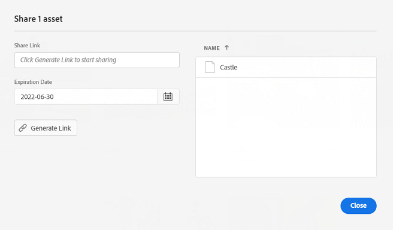

# 管理集合 {#manage-collections}

>[!CONTEXTUALHELP]
>id="assets_collections"
>title="管理集合"
>abstract="收藏集是 Assets 檢視中的一組資產、檔案夾或其他集合。使用集合在使用者之間共用資產。和檔案夾不同，集合可包含來自不同位置的資產。您可以和使用者共用多個集合。每個集合都包含資產的參考資料。資產的參考完整性會跨越集合來維護。"

集合是指 Adobe Experience Manager Assets 視圖中的一組資產、資料夾或其他集合。使用集合在使用者之間共用資產。

和檔案夾不同，集合可包含來自不同位置的資產。

<!--
You can share collections with various users that are assigned different levels of privileges, including viewing, editing, and so on.
-->

您可以和使用者共用多個集合。每個集合都包含資產的參考資料。資產的參考完整性會跨越集合來維護。

您可以執行下列任務以管理和使用集合：

* [建立集合](#create-collection)

* [將資產新增至集合](#add-assets-to-collection)

* [從集合移除資產](#remove-assets-from-collection)

* [在集合內搜尋](#search-collection)

* [建立智慧型集合](#create-smart-collection)

* [編輯智慧型集合](#edit-smart-collection)

* [檢視和編輯集合中繼資料](#view-edit-collection-metadata)

* [共用集合的連結](#share-collection-links)

* [下載集合](#download-collection)

* [刪除集合](#delete-collection)

* [管理私有集合的權限](#manage-permissions-to-a-private-collection)

## 建立集合 {#create-collection}

若要建立集合：

1. 請按一下左側邊欄中的&#x200B;**[!UICONTROL 集合]**，然後按一下&#x200B;**[!UICONTROL 建立集合]**。

1. 指定集合的標題和說明 (選用)。

1. 如果需要建立私有集合或公共集合，請選擇。 公共集合可用於查看和編輯所有用戶。 但是，具有管理員權限的建立者和用戶可以使用專用集合。

1. 按一下以&#x200B;**[!UICONTROL 建立]**&#x200B;下一個色標。

<!--
   
   for viewing and editing only to users with the appropriate [permissions](#manage-collection-access).

-->

## 將資產新增至集合 {#add-assets-to-collection}

若要將資產新增至集合：

1. 按一下左側邊欄中的&#x200B;**[!UICONTROL 資產]**，然後選取您需要新增到集合的資產。

1. 按一下&#x200B;**[!UICONTROL 新增至集合]**。

1. 在[!UICONTROL 集合]對話框中，選取集合以新增所選取的資產。

1. 按一下&#x200B;**[!UICONTROL 新增]**，以將資產新增到所選取的集合。

## 從集合移除資產 {#remove-assets-from-collection}

若要從集合移除資產：

1. 請按一下左側邊欄中的&#x200B;**[!UICONTROL 集合]**，以檢視集合清單。

1. 按一下集合，然後選取您需要從集合移除的項目。

1. 按一下&#x200B;**[!UICONTROL 移除]**。

## 在集合內搜尋 {#search-collection}

您可以在集合中搜尋，輕鬆尋找相關資產。 要執行此操作，請執行下列步驟：

* 瀏覽至&#x200B;**[!DNL Collections]**。 在搜尋列中，輸入關鍵字以找出所需的集合。 搜尋列會顯示所選集合的位置。

* 若要精簡搜尋結果，請開啟&#x200B;**[!DNL Filters]**&#x200B;並確保在&#x200B;**[!DNL Collections]**&#x200B;下選取&#x200B;**[!DNL Asset Type]**。

* 在&#x200B;**[!DNL Collection Visibility]**&#x200B;下拉式清單中，選擇下列其中一個選項：

   * **[!DNL All]：**&#x200B;顯示所有集合，無論可見度為何。
   * **[!DNL Public Collection]：**&#x200B;只顯示所有使用者可見的集合。
   * **[!DNL Private Collection]：**&#x200B;只顯示特定使用者或群組所限制或可見的集合。

* 在[!DNL Collection Type]下拉式清單中，選擇下列其中一個選項：

   * **[!DNL All]：**&#x200B;同時顯示一般和智慧型集合。
   * **[!DNL Collection]：**&#x200B;顯示手動建立的集合，其中資產會個別新增。
   * **[!DNL Smart Collection]：**&#x200B;顯示自動包含在[智慧型集合](#manage-smart-collection)下儲存之資產的集合。

* **[!DNL Created Date]**&#x200B;下拉式清單可讓您根據集合建立時間來篩選集合。 您可以指定日期範圍以尋找最近建立或較舊的集合。

  

如需詳細資訊，請參閱[搜尋資產](search-assets-view.md)、[篩選搜尋結果](search-assets-view.md#refine-search-results)或[管理已儲存的搜尋](search-assets-view.md##saved-search)。

## 管理智慧型集合 {#manage-smart-collection}

將搜尋結果另存為 Smart Collection 以動態更新集合內容。 如果新增到Assets檢視存放庫的資產符合建立Smart Collection時定義的搜尋條件，則開啟Smart Collection時，Smart Collection的內容會自動更新。

### 建立智慧型集合 {#create-smart-collection}

若要建立 Smart Collection：

1. 按一下 **[!UICONTROL 篩選]** 和[定義搜索標準](search-assets-view.md#refine-search-results)。

1. 按一下 **[!UICONTROL 另存為]** ，然後選擇 **[!UICONTROL Smart Collection]**。

   

1. 在 [!UICONTROL 建立 Smart Collection] 的子選單。

1. 選擇 **[!UICONTROL 公共集合]** 的子選單。 選擇 **[!UICONTROL 私有集合]** 如果需要一組有限的用戶才能訪問集合。

1. 按一下 **[!UICONTROL 建立]**&#x200B;建立 Smart Collection。

### 編輯智慧型集合 {#edit-smart-collection}

若要編輯智慧型集合：

1. 按一下左邊欄中的&#x200B;**[!UICONTROL 集合]**，然後按兩下您要編輯集合的名稱。

1. 按一下&#x200B;**[!UICONTROL 編輯智慧型集合]**。

1. 在「[!UICONTROL 編輯智慧型集合篩選器]」對話方塊中，更新智慧型集合的[搜尋條件](search-assets-view.md#refine-search-results)。

1. 按一下「**[!UICONTROL 儲存]**」。

<!--

## Manage access to a Private collection {#manage-collection-access}

The permission management for collections function in the same manner as folders in [!DNL Assets view]. Administrators can manage the access levels for collections available in the repository. As an administrator, you can create user groups and assign permissions to those groups to manage access levels. You can also delegate the permission management privileges to user groups at the collection-level.

For more information, see [Manage permissions for folders and collections](manage-permissions.md).

-->

<!--

## Search a collection {#search-collections}

Click **[!UICONTROL Collections]** in the left rail and use the Search box to specify a text as the criteria to search for a collection. [!DNL Assets view] uses the specified text to search collection names, metadata including tags defined for a collection and returns appropriate results.

>[!NOTE]
>
>Assets view performs search in collections available at the root level. It does not perform search in assets and folders available in collections.

-->

## 檢視和編輯集合中繼資料 {#view-edit-collection-metadata}

集合中繼資料包含有關集合的資料，例如標題和說明。

若要檢視和編輯集合中繼資料：

1. 請按一下左側邊欄中的&#x200B;**[!UICONTROL 集合]**，選一個集合，然後按一下&#x200B;**[!UICONTROL 詳細資訊]**。
1. 使用&#x200B;**[!UICONTROL 基本]**&#x200B;索引標籤來檢視集合中繼資料。
1. 修改中繼資料欄位 (如有必要)。您可以修改[!UICONTROL 標題]和[!UICONTROL 說明]欄位。

## 共用集合的連結 {#share-collection-links}

[!DNL Assets view] 可讓您產生連結，並和無法存取 [!DNL Assets view] 應用程式的外部利益關係人共用集合和集合中的資產。您可以定義連結的過期日，然後使用您喜歡的通訊方式 (如電子郵件或簡訊服務) 與他人共用。連結的收件者可預覽和下載資產。

如需有關如何與外部利益關係人共用集合連結的詳細資訊，請參閱[共用資產連結](/help/assets/share-links-for-assets-view.md)。

## 下載集合 {#download-collection}

若要下載集合：

1. 按一下左側邊欄中的&#x200B;**[!UICONTROL 集合]**。

1. 選取您需要下載的集合，然後按一下&#x200B;**[!UICONTROL 下載]**。

1. 在[!UICONTROL 下載資產]對話框中，按一下&#x200B;**[!UICONTROL 確定]**。

集合會下載成您本機電腦的 .ZIP 檔案。

## 刪除集合 {#delete-collection}

若要刪除集合：

1. 按一下左側邊欄中的&#x200B;**[!UICONTROL 集合]**。

1. 選取您需要刪除的集合。

1. 按一下&#x200B;**[!UICONTROL 刪除]**。

## 管理私有集合的權限{#manage-permissions-private-collection}

您可以允許管理員管理存放庫中可用私有集合的[存取層級](https://experienceleague.adobe.com/zh-hant/docs/experience-manager-assets-essentials/help/get-started-admins/folder-access/manage-permissions)。您可以將權限指派給使用者群組或使用者，例如 `Can View` 和 `Can Edit`。您還可以將權限管理權委派給使用者群組。建立私有集合的使用者即為集合的擁有者。他們可以使用「[!UICONTROL 管理權限]」動作向其他使用者授予存取權。此外，管理員還可以檢視及管理 [!DNL Experience Manager] 存放庫中私有集合的權限。
<!--
>[!NOTE]
>
>Adobe does not recommend to assign permissions to users.
-->
如需如何為使用者群組指派可用權限的相關資訊，請參閱「[對使用者群組新增權限](https://experienceleague.adobe.com/zh-hant/docs/experience-manager-assets-essentials/help/get-started-admins/folder-access/manage-permissions)」。

如要進一步了解端對端工作流程，請參閱「[管理權限](https://experienceleague.adobe.com/zh-hant/docs/experience-manager-assets-essentials/help/get-started-admins/folder-access/manage-permissions)」。

## 後續步驟 {#next-steps}

* 使用資產檢視使用者介面所提供的[!UICONTROL 意見回饋]選項提供產品意見回饋

* 若要提供文件意見回饋，請使用右側邊欄提供的[!UICONTROL 編輯此頁面]或[!UICONTROL 記錄問題]

* 聯絡[客戶服務](https://experienceleague.adobe.com/zh-hant?support-solution=General#support)
