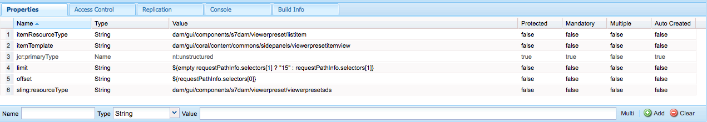

# 管理資產 {#manage-assets}

| 版本 | 文章連結 |
| -------- | ---------------------------- |
| AEM 6.5 | [按一下這裡](https://experienceleague.adobe.com/docs/experience-manager-65/assets/managing/manage-assets.html?lang=en) |
| AEM as a Cloud Service  | 本文章 |

本文說明如何在[!DNL Adobe Experience Manager Assets]中管理和編輯資產。 若要管理[!DNL Content Fragments]，請參閱[[!DNL Content Fragments]](content-fragments/content-fragments.md)資產。

## 建立檔案夾 {#creating-folders}

組織資產集合（例如，所有`Nature`影像）時，您可以建立資料夾以將它們保持在一起。 您可以使用資料夾來分類及組織您的資產。 [!DNL Experience Manager Assets]不要求您組織資料夾中的資產才能改善運作。

>[!NOTE]
>
>* 共用至Experience Cloud時不支援共用型別`sling:OrderedFolder`的Assets資料夾。 如果要共用資料夾，在建立資料夾時請勿選取[!UICONTROL 已訂購]。
>* Experience Manager不允許使用`subassets`字做為資料夾的名稱。 這是為包含複合資產的子資產的節點保留的關鍵字

1. 導覽至數位資產資料夾中您要建立資料夾的位置。 在功能表中按一下&#x200B;**[!UICONTROL 建立]**。 選取&#x200B;**[!UICONTROL 新資料夾]**。
1. 在&#x200B;**[!UICONTROL 標題]**&#x200B;欄位中，提供資料夾名稱。 根據預設，DAM會使用您提供的標題作為資料夾名稱。 建立資料夾後，您可以覆寫預設值並指定另一個資料夾名稱。
1. 按一下「**[!UICONTROL 建立]**」。您的資料夾會顯示在數位資產資料夾中。

不支援下列（以空格分隔的）字元清單：

* 資產檔案名稱不能包含下列任一字元： `* / : [ \\ ] | # % { } ? &`
* 資產資料夾名稱不能包含下列任一字元： `* / : [ \\ ] | # % { } ? \" . ^ ; + & \t`

## 上傳資產 {#uploading-assets}

請參閱[將數位資產新增至Experience Manager](add-assets.md)。

## 解壓縮ZIP封存 {#extract-zip-archives}

選取在Experience Manager中管理的ZIP封存檔，並將檔案直接解壓縮到Experience Manager中而不下載。

若要解壓縮ZIP檔案，請執行下列步驟：

1. 選取ZIP檔案型別。
1. 按一下動作列上可用的&#x200B;**[!UICONTROL 擷取封存]**&#x200B;選項。
1. 選取您要儲存已解壓縮資料夾中可用之已解壓縮資產的資料夾。
1. 按一下「**[!UICONTROL 下一步]**」。
1. 選取適當的行為，以便在擷取期間處理檔案名稱衝突。 您可以選取建立現有資產的版本、取代資產、將兩個資產保留在目的地資料夾中，或略過新資產的擷取。
1. 按一下&#x200B;**[!UICONTROL 擷取]**。 Zip擷取程式隨即開始。 程式完成後，您可以在目的地資料夾中檢視擷取的資產。

   

   >[!NOTE]
   >
   >* 支援的ZIP檔案大小上限為15 GB。
   >* 您一次最多可以解壓縮三個ZIP檔案。

## 預覽資產 {#previewing-assets}

若要預覽資產，請依照下列步驟操作。

1. 從Assets使用者介面，導覽至您要預覽的資產位置。
1. 選取要開啟的資產。
1. 在預覽模式中，縮放選項可用於[支援的影像型別](/help/assets/file-format-support.md) （具有互動式編輯）。

   若要放大資產，請選取`+` （或選取資產上的放大鏡）。 若要縮小顯示，請選取`-`。 放大時，您可以透過平移仔細檢視影像的任何區域。 重設縮放箭頭可讓您回到原始檢視。

   選取&#x200B;**[!UICONTROL 重設]**&#x200B;以將檢視重設為原始大小。

## 編輯屬性 {#editing-properties}

1. 導覽至您要編輯其中繼資料的資產位置。
1. 選取資產，然後從工具列選取&#x200B;**[!UICONTROL 屬性]**&#x200B;以檢視資產屬性。 或者，選擇資產卡上的&#x200B;**[!UICONTROL 屬性]**&#x200B;快速動作。

   

1. 在[!UICONTROL 屬性]頁面中，編輯各種標籤下的中繼資料屬性。 例如，在&#x200B;**[!UICONTROL 基本]**&#x200B;標籤下，編輯標題、說明等。

   >[!NOTE]
   >
   >[!UICONTROL 屬性]頁面的版面配置以及可用的中繼資料屬性取決於基礎中繼資料結構描述。 若要瞭解如何修改[!UICONTROL 屬性]頁面的配置，請參閱[中繼資料結構](/help/assets/metadata-schemas.md)。

1. 若要排程啟動資產的特定日期/時間，請使用「準時」欄位旁的日 **[!UICONTROL 期選擇器]** 。

   

1. 若要在特定期間之後停用資產，請從&#x200B;**[!UICONTROL 關閉時間]**&#x200B;欄位旁的日期選擇器中選擇停用日期/時間。 停用日期應晚於資產的啟用日期。 在[!UICONTROL 關閉時間]之後，無法透過Assets網路介面或HTTP API使用資產及其轉譯。

   <!---->

1. 在&#x200B;**[!UICONTROL 標籤]**&#x200B;欄位中，選取一或多個標籤。 若要新增自訂標籤，請在方塊中輸入標簽名稱，並選取`Enter`索引鍵。 新標籤儲存在[!DNL Experience Manager]中。

   YouTube需要標籤才能發佈，而且必須具備YouTube連結（如果可以找到合適的連結）。

   >[!NOTE]
   >
   >若要建立標籤，您必須在CRX存放庫中的`/content/cq:tags/default`路徑有寫入許可權。

1. 選取「**[!UICONTROL 儲存並關閉]**」。
1. 導覽至Assets使用者介面。 編輯的中繼資料屬性（包括標題、說明和標籤）會顯示在「卡片」檢視的資產卡片上，以及「清單」檢視的相關欄下。

<!-- TBD: Uncomment after verification for Dec release.

## View asset usage and references {#usage-and-references}

[!DNL Experience Manager] lets you track statistics about usage of a digital asset. The usage statistics include the following:

    * Number of times the asset was viewed or downloaded
    * Channels/devices through which the asset was used
    * Creative solutions where the asset was recently used

To view usage statistics for an asset, in the [!UICONTROL Properties] page, click the **[!UICONTROL Insights]** tab. For more details, see [Assets Insights](assets-insights.md).

[!DNL Experience Manager] also lets you check all the incoming references to an asset, that is, the usage of an asset in remote [!DNL Sites] and in compound assets. Authors of webpages on [!DNL Experience Manager Sites] deployment can use an asset on a remote [!DNL Assets] deployment using the Connected Assets functionality. The [!UICONTROL References] tab in an asset's [!UICONTROL Properties] page lists the local and remote references of the asset. That is, the use of assets in compound assets in [!DNL Assets] and its use in remote [!DNL Sites] pages.

-->

## 複製資產 {#copying-assets}

當您複製資產或資料夾時，將會複製整個資產或資料夾及其內容結構。 複製的資產或資料夾會複製到目標位置。 來源位置的資產不會變更。

資產特定副本的少數屬性不會移轉過來。 以下是一些範例：

* 資產ID、建立日期和時間，以及版本和版本記錄。 這些屬性中有些由屬性`jcr:uuid`、`jcr:created`和`cq:name`指示。

* 每個資產及其每個轉譯的建立時間和參照路徑都是唯一的。

其他屬性和中繼資料資訊會保留。 複製資產時不會建立部分副本。

1. 在Assets UI中，選取一或多個資產，然後從工具列選取「**[!UICONTROL 複製]**」圖示。 或者，從資產卡選取&#x200B;**[!UICONTROL 複製]** 快速動作。

   >[!NOTE]
   >
   >如果您使用[!UICONTROL 複製]快速動作，一次只能複製一個資產。

1. 導覽至您要複製資產的位置。

   >[!NOTE]
   >
   >如果您在相同位置複製資產，[!DNL Experience Manager]會自動產生名稱的變體。 例如，如果您複製標題為`Square`的資產，[!DNL Experience Manager]會自動為其複製產生標題，如`Square1`。

1. 按一下工具列中的&#x200B;**[!UICONTROL 貼上]**&#x200B;資產圖示。 Assets會複製到此位置。

   <!---->

   >[!NOTE]
   >
   >在貼上作業完成之前，工具列中會顯示&#x200B;**[!UICONTROL 貼上]**&#x200B;圖示。

### 移動或重新命名資產 {#moving-or-renaming-assets}

1. 導覽至您要移動之資產的位置。

1. 選取資產，然後從工具列選取&#x200B;**[!UICONTROL 移動]**&#x200B;圖示。

1. 在「移動Assets」精靈中，執行下列任一項作業：

   * 指定資產移動後的名稱。 然後選取「下一步」**&#x200B;**&#x200B;以繼續。

   * 選取&#x200B;**[!UICONTROL 取消]**&#x200B;以停止處理程式。

   >[!NOTE]
   >
   >* 如果新位置沒有該名稱的資產，您可以為該資產指定相同的名稱。 不過，如果您將資產移至有相同名稱的資產存在的位置，應使用不同的名稱。 如果您使用相同的名稱，系統會自動產生名稱的變體。 例如，如果資產的名稱為Square，則系統會為其副本產生名稱Square1。
   >* 重新命名時，檔案名稱中不允許空格。

1. 在&#x200B;**[!UICONTROL 選取目的地]**&#x200B;對話方塊上，執行下列任一項作業：

   * 導覽至資產的新位置，然後選取「下一步」**[!UICONTROL 以繼續。]**

   * 選取&#x200B;**[!UICONTROL 上一步]**&#x200B;以返回&#x200B;**[!UICONTROL 重新命名]**&#x200B;畫面。

1. 如果要移動的資產有任何參考頁面、資產或集合，則&#x200B;**[!UICONTROL 調整參考]**&#x200B;索引標籤會出現在&#x200B;**[!UICONTROL 選取目的地]**&#x200B;索引標籤旁邊。

   在&#x200B;**[!UICONTROL 調整參考]**&#x200B;畫面中執行下列任一項作業：

   * 根據新的詳細資料指定要調整的參考，然後選取[移動]&#x200B;**[!UICONTROL 以繼續。]**

   * 從&#x200B;**[!UICONTROL 調整]**&#x200B;欄，選取/取消選取資產的參考。
   * 選取&#x200B;**[!UICONTROL 上一步]**&#x200B;以返回&#x200B;**[!UICONTROL 選取目的地]**&#x200B;畫面。

   * 選取&#x200B;**[!UICONTROL 取消]**&#x200B;以停止移動作業。

   如果您不更新引用，引用會持續指向資產的上一個路徑。 如果您調整參照，參照會更新為新的資產路徑。

### 管理轉譯 {#managing-renditions}

1. 您可以為資產新增或移除轉譯，但原始資產除外。 導覽至您要新增或移除轉譯的資產位置。

1. 選取要開啟其資產頁面的資產。

   <!---->

1. 選取GlobalNav圖示，然後從清單中選取&#x200B;**[!UICONTROL 轉譯]**。

   

1. 在&#x200B;**[!UICONTROL 轉譯]**&#x200B;面板中，檢視針對資產產生的轉譯清單。

   

   >[!NOTE]
   >
   >根據預設，[!DNL Experience Manager Assets]不會在預覽模式中顯示資產的原始轉譯。 如果您是管理員，則可以使用覆蓋圖來設定[!DNL Assets]，以便在預覽模式下顯示原始轉譯。

1. 選取轉譯以檢視或刪除轉譯。

   **正在刪除轉譯**

   從&#x200B;**[!UICONTROL 轉譯]**&#x200B;面板選取轉譯，然後從工具列選取&#x200B;**[!UICONTROL 刪除轉譯]**&#x200B;圖示。 資產處理完成後，無法大量刪除轉譯。 若為個別資產，您可以從使用者介面手動移除轉譯。 對於多個資產，您可以自訂[!DNL Experience Manager]以刪除特定轉譯或刪除資產，並重新上傳已刪除的資產。

   

   **正在上傳新的轉譯**

   導覽至資產的資產詳細資訊頁面，然後選取工具列中的「**[!UICONTROL 新增轉譯]**」圖示以上傳資產的新轉譯。

   <!---->

   >[!NOTE]
   >
   >如果您從「轉譯」面板選取轉譯 **&#x200B;**&#x200B;，工具列會變更上下文，並僅顯示與轉譯相關的動作。不會顯示「上傳轉譯」圖示等選項。若要在工具列中檢視這些選項，請導覽至資產的詳細資訊頁面。

   您可以設定要在影像或視訊資產的詳細資訊頁面中顯示的轉譯尺寸。 Assets會根據您指定的維度顯示具有精確或最接近維度的轉譯。

   您無法建立具有下列首碼的轉譯，因為這些是Adobe的內部首碼：

   * cq5

   * cqdam

   * cq5dam

   若要在資產詳細資料層級設定影像的轉譯尺寸，請覆蓋節 `renditionpicker` 點(`libs/dam/gui/content/assets/assetpage/jcr:content/body/content/content/items/assetdetail/items/col1/items/assetview/renditionpicker`)並設定width屬性的值。設定屬性大 **[!UICONTROL 小 (長) (KB]** )以取代寬度，以根據影像大小自訂資產詳細資料頁面上的轉譯。對於基於大小的定製，如果匹配的 `preferOriginal` 格式副本的大小大於原始格式副本的大小，則屬性會為原始格式副本指定首選項。

   同樣地，您可以透過覆蓋`libs/dam/gui/content/assets/annotate/jcr:content/body/content/content/items/content/renditionpicker`來自訂註解頁面影像。

   <!---->

   若要設定視訊資產的轉譯維度，請導覽至CRX存放庫中`videopicker`位置的`/libs/dam/gui/content/assets/assetpage/jcr:content/body/content/content/items/assetdetail/items/col1/items/assetview/videopicker`節點、覆蓋節點，然後編輯適當的屬性。

   >[!NOTE]
   >
   >視訊註解僅支援在具有HTML5相容視訊格式的瀏覽器上使用。 此外，視瀏覽器而定，支援不同的視訊格式。 不過，視訊註解尚不支援MXF視訊格式。

## 刪除資產 {#delete-assets}

若要從其他頁面解析或移除傳入的參考，請先更新相關參考，然後再刪除資產。

此外，使用覆蓋圖停用強制刪除按鈕，以禁止使用者刪除參照的資產並留下中斷的連結。

1. 導覽至您要刪除之資產的位置。

1. 選取資產，然後按一下工具列中的&#x200B;**[!UICONTROL 刪除]** 。

1. 在確認對話方塊中，按一下：

   * **[!UICONTROL 取消]**&#x200B;以停止動作
   * **[!UICONTROL 刪除]**&#x200B;以確認動作：

      * 如果資產沒有參考，則會刪除資產。
      * 如果資產具有參考，錯誤訊息會通知您&#x200B;**[!UICONTROL 一個或多個資產被參考]**。 您可以選取&#x200B;**[!UICONTROL 強制刪除]**&#x200B;或&#x200B;**[!UICONTROL 取消]**。

   >[!NOTE]
   >
   >您需要dam/asset的刪除許可權才能刪除資產。 如果您只有修改許可權，您只能編輯資產中繼資料並將註解新增至資產。 不過，您無法刪除資產或其中繼資料。

   >[!NOTE]
   >
   >若要從其他頁面解析或移除傳入的參考，請先更新相關參考，然後再刪除資產。 您可以禁止刪除參照的資產，因為這會造成連結損毀。 使用覆蓋圖停用強制刪除按鈕。

## 下載資產 {#download-assets}

請參閱[從 [!DNL Experience Manager]](/help/assets/download-assets-from-aem.md)下載資產。

## 發佈或取消發佈資產 {#publish-assets}

1. 導覽至您要發佈或要從發佈環境移除（取消發佈）的資產或資產資料夾位置。

1. 選取要發佈或取消發佈的資產或資料夾，並從工具列選取&#x200B;**[!UICONTROL 管理出版物]** 選項。 或者，若要快速發佈，請從工具列選取&#x200B;**[!UICONTROL 快速發佈]**&#x200B;選項。 如果您要發佈的資料夾包含空白資料夾，則不會發佈空白資料夾。

1. 視需要選取&#x200B;**[!UICONTROL 發佈]**&#x200B;或&#x200B;**[!UICONTROL 取消發佈]**&#x200B;選項。

   
   *圖：發佈和取消發佈選項以及排程選項。*

1. 選取&#x200B;**[!UICONTROL 立即]**&#x200B;立即對資產執行動作，或選取&#x200B;**[!UICONTROL 稍後]**&#x200B;排程動作。 如果您選擇&#x200B;**[!UICONTROL 稍後]**&#x200B;選項，請選取日期和時間。 按一下「**[!UICONTROL 下一步]**」。

1. 發佈時，如果資產參考其他資產，其參考會列在精靈中。 只會顯示自上次發佈後未發佈或修改的參考。 選擇您要發佈的參考。

1. 取消發佈時，如果資產參考其他資產，請選擇您要取消發佈的參考。 點擊&#x200B;**[!UICONTROL 取消發佈]**。在確認對話方塊中，按一下&#x200B;**[!UICONTROL 取消]**&#x200B;以停止動作，或按一下&#x200B;**[!UICONTROL 取消發佈]**&#x200B;以確認資產將於指定日期取消發佈。

瞭解以下與發佈或取消發佈資產或資料夾相關的限制和提示：

* [!UICONTROL 管理發行集]的選項僅適用於具有復寫許可權的使用者帳戶。
* 取消發佈複雜資產時，請僅取消發佈資產。 請避免取消發佈引用，因為這些引用可能會被其他已發佈的資產引用。
* 未發佈空白資料夾。
* 如果您發佈正在處理的資產，則只會發佈原始內容。 缺少轉譯。 請等待處理完成，然後在處理完成時發佈或重新發佈資產。

## 已關閉的使用者群組 {#closed-user-group}

封閉式使用者群組(CUG)是用來限制存取從[!DNL Experience Manager]發佈的特定資產資料夾。 如果您為資料夾建立CUG，則資料夾（包括資料夾資產和子資料夾）的存取權僅限指派的成員或群組使用。 若要存取資料夾，使用者必須使用其安全性認證登入。

CUG是限制資產存取權的額外方式。 您也可以設定資料夾的登入頁面。

1. 從Assets UI中選取資料夾，然後從工具列選取「屬性」圖示以顯示屬性頁面。
1. 從&#x200B;**[!UICONTROL 許可權]**&#x200B;索引標籤，在&#x200B;**[!UICONTROL 已關閉的使用者群組]**&#x200B;下新增成員或群組。

   

1. 若要在使用者存取資料夾時顯示登入畫面，請選取&#x200B;**[!UICONTROL 啟用]**&#x200B;選項。 然後，在[!DNL Experience Manager]中選取登入頁面的路徑，並儲存變更。

   

   >[!NOTE]
   >
   >如果您未指定登入頁面的路徑，[!DNL Experience Manager]會在發佈執行個體中顯示預設登入頁面。

1. 發佈資料夾，然後嘗試從發佈執行個體存取它。 此時會顯示登入畫面。
1. 如果您是CUG成員，請輸入您的安全性認證。 資料夾會在[!DNL Experience Manager]驗證您之後顯示。

## 搜尋資產 {#search-assets}

搜尋資產是使用數位資產管理系統的核心，無論是供創意人員進一步使用、供業務使用者和行銷人員健全管理資產，還是DAM管理員管理。

若要進行簡單、進階和自訂的搜尋，以探索和使用最適當的資產，請參閱[在 [!DNL Experience Manager]](/help/assets/search-assets.md)中搜尋資產。

## 快速動作 {#quick-actions}

一次只能對單一資產使用快速動作圖示。 視您的裝置而定，執行下列動作以顯示快速動作圖示：

* 觸控裝置：觸控並按住。 例如，在iPad上，您可以選取並按住資產，以便顯示快速動作。
* 非觸控裝置：游標暫留。 例如，在案頭裝置上，如果游標停留在資產縮圖上，則會顯示快速動作列。

<!-- Hiding this topic via cqdoc-18707

## Edit images {#editing-images}

The editing tools in the [!DNL Experience Manager Assets] interface let you perform small editing jobs on image assets. You can crop, rotate, flip, and perform other editing jobs on images. You can also add image maps to assets.

>[!NOTE]
>
>For some components, the Full Screen mode has additional options available.

1. Do one of the following to open an asset in edit mode:

    * Select the asset and then select the **[!UICONTROL Edit]** icon in the toolbar.
    * Select the **[!UICONTROL Edit]** icon that appears on an asset in the Card view.
    * In the asset page, select the **[!UICONTROL Edit]** icon in the toolbar.

   

1. To crop the image, select the **Crop** icon.

   

1. Select the desired option from the list. The crop area appears on the image based on the option you choose. The **Free Hand** option lets you crop the image without any aspect ratio restrictions.

   

1. Select the area to be cropped, and resize or reposition it on the image.
1. Use the **Finish** icon (top right corner) to crop the image. Clicking the **Finish** icon also triggers the regeneration of renditions.

   

1. Use the **Undo** and **Redo** icons on the top right to revert to the uncropped image or retain the cropped image, respectively.

   

1. Select the appropriate Rotate icon to rotate the image clockwise or anti-clockwise.

   

1. Select the appropriate Flip icon to flip the image horizontally or vertically.

   

1. Select the **Finish** icon to save the changes.

   

>[!NOTE]
>
>Image editing is supported for BMP, GIF, PNG, and JPEG files formats.

>[!NOTE]
>
>To edit a TXT file, set **Day CQ Link Externalizer** from Configuration Manager.
-->

## 時間軸 {#timeline}

時間軸可讓您檢視所選專案的各種事件，例如資產的使用中工作流程、註解/註解、活動記錄及版本。


*圖：排序資產的時間表專案*

>[!NOTE]
>
>在[集合主控台](/help/assets/manage-collections.md#navigate-the-collections-console)中，**[!UICONTROL 全部顯示]**&#x200B;清單僅提供檢視評論和工作流程的選項。 此外，時間軸只會針對主控台中列出的頂層集合顯示。 如果您在任何集合內導覽，則不會顯示該集合。

>[!NOTE]
>
>時間軸包含數個內容片段[專屬的](content-fragments/content-fragments.md)選項。

## 為資產加上註釋 {#annotating}

註解是新增至影像或影片的評論或說明附註。 註解讓行銷人員能夠共同作業並留下有關資產的意見回饋。

視訊註解僅支援在具有HTML5相容視訊格式的瀏覽器上使用。 Assets支援的視訊格式取決於瀏覽器。 不過，視訊註解尚不支援MXF視訊格式。

>[!NOTE]
>
>對於內容片段，會在片段編輯器[中建立](content-fragments/content-fragments.md)註解。

1. 導覽至您要新增註解的資產位置。
1. 從下列任一項中選取&#x200B;**[!UICONTROL 註釋]**&#x200B;圖示：

   * [快速動作](#quick-actions)
   * 在選取資產或導覽至資產頁面後，從工具列重新選取

   <!---->

1. 在時間軸底部的 **[!UICONTROL 「注釋]** 」方塊中新增注釋。或者，在影像上標籤一個區域，並在「添加註釋」( **[!UICONTROL Add Annotation]** )對話框中添加註釋。

<!-- -->

<!--
1. To notify a user about an annotation, specify the email address of the user and add the comment. For example, to notify Aaron MacDonald about an annotation, enter @aa. Hints for all matching users is displayed in a list. Select Aaron's email address from the list to tag her with the comment. Similarly, you can tag more users anywhere within the annotation or before or after it.
-->

>[!NOTE]
>
>對於非管理員使用者，只有當使用者在CRXDE中具有`/home`的讀取許可權時，才會顯示建議。

<!---->

1. 新增註解後，按一下&#x200B;**[!UICONTROL 新增]**&#x200B;以儲存。 註解的通知會傳送給Aaron。

   <!---->

   >[!NOTE]
   >
   >儲存註解之前，您可以新增多個註解。

1. 選取&#x200B;**[!UICONTROL 關閉]**&#x200B;以從註解模式結束。
1. 若要檢視通知，請使用Aaron MacDonald的認證登入Assets，然後按一下&#x200B;**[!UICONTROL 通知]**&#x200B;圖示以檢視通知。

   >[!NOTE]
   >
   >註解也可以新增到視訊資產。 在影片的註解時，播放器會暫停，讓您在影格上註解。 如需詳細資訊，請參閱[管理視訊資產](manage-video-assets.md)。 不過，視訊註解尚不支援MXF視訊格式。

1. 若要選擇不同的顏色以便區分使用者，請選取[設定檔]圖示，並選取&#x200B;**[!UICONTROL 我的偏好設定]**。

   <!---->

   在&#x200B;**[!UICONTROL 註釋顏色]**&#x200B;方塊中指定所要的顏色，然後選取&#x200B;**[!UICONTROL 接受]**。

<!-- -->

>[!NOTE]
>
>您也可以將註解新增至集合。 不過，如果集合包含子集合，您只能將註解/註解新增至父集合。 「註釋」選項不適用於子集合。

### 檢視儲存的註解 {#viewing-saved-annotations}

您一次只能檢視一個註解。

>[!NOTE]
>
>如果您選取多個註解，最新的註解會顯示在使用者介面上。
>
>僅支援將已附註的資產列印為PDF的多重選取。

1. 若要檢視資產的已儲存註解，請導覽至資產位置並開啟資產的資產頁面。

1. 選取GlobalNav圖示，然後從清單中選擇&#x200B;**[!UICONTROL 時間表]**。

   <!---->

1. 從時間軸 **[!UICONTROL 的「顯示全部]** 」清單中，選取「注 **[!UICONTROL 釋]** 」以根據註解來篩選結果。

   <!---->

   在&#x200B;**[!UICONTROL 時間軸]**&#x200B;面板中選取註解，以檢視影像上的對應註解。

   <!---->

   選取&#x200B;**[!UICONTROL 刪除]**&#x200B;以刪除特定註解。

### 列印註解 {#printing-annotations}

如果資產有註解或受到稽核工作流程的約束，您可以列印資產以及註解和稽核狀態，作為PDF檔案進行離線稽核。

您也可以選擇只列印註解或稽核狀態。

>[!NOTE]
>
>將附註的資產列印為PDF時，您可以選取多個附註。

若要列印註解和檢閱狀態，請選取&#x200B;**[!UICONTROL 列印]**&#x200B;圖示，然後依照精靈中的指示進行。 只有當資產擁有至少一個指派的附註或檢閱狀態時，**[!UICONTROL 列印]**&#x200B;圖示才會出現在工具列中。

1. 從Assets UI，開啟資產的預覽頁面。
1. 執行下列任一項作業：

   * 若要列印所有附註和稽核狀態，請略過步驟3並直接跳至步驟4。
   * 若要列印特定註解及檢閱狀態，請開啟[時間表](/help/assets/manage-digital-assets.md#timeline)，然後移至步驟3。

1. 若要列印特定註釋，請從時間軸選取註釋。

   <!---->

   若只要列印稽核狀態，請從時間表選取它。

   <!---->

1. 從工具列選取&#x200B;**[!UICONTROL 列印]**&#x200B;圖示。

   <!---->

1. 在「列印」對話方塊中，選擇您要在PDF上顯示註解/稽核狀態的位置。 例如，如果您希望註解/狀態列印在包含已列印影像的頁面的右上方，請使用&#x200B;**左上方**&#x200B;設定。 預設會選取此選項。

   <!---->

   您可以根據要在打印的PDF中顯示注釋/狀態的位置選擇其他設定。如果您希望註解/狀態顯示在與印刷資產不同的頁面中，請選擇「下 **[!UICONTROL 一頁」]**。

1. 按一下&#x200B;**[!UICONTROL 列印]**。 根據您在步驟2中選擇的選項，產生的PDF會在指定位置顯示註解/狀態。例如，如果您選擇使用左上角設定打印注釋和審閱狀態 **&#x200B;**&#x200B;，則生成的輸出類似於此處所示的PDF檔案。

   <!---->

1. 使用右上方的選項下載或列印PDF。

   <!---->

   若要修改演算PDF檔案的外觀，例如註解與狀態的字型色彩、大小與樣式、背景色彩，請從Configuration Manager開啟&#x200B;**[!UICONTROL Annotation PDF組態]**，並修改所要的選項。 例如，若要變更已核准狀態的顯示顏色，請修改對應欄位中的顏色代碼。 如需有關變更註解字型顏色的資訊，請參閱[註解](/help/assets/manage-digital-assets.md#annotating)。

   返迴轉譯的PDF檔案並重新整理。 重新整理的PDF會反映您所做的變更。

## 資產版本設定 {#asset-versioning}

版本設定功能會在特定時間點建立數位資產的快照。 版本設定功能有助於將資產在稍後還原成先前的狀態。 例如，如果您要復原對資產進行的變更，請還原該資產的未編輯版本。

以下是建立版本的情況：

* 您可在其他應用程式中修改影像，並上傳至Assets。 系統會建立影像的版本，這樣就不會覆寫原始影像。
* 您可以編輯資產的中繼資料。
* 您使用[!DNL Experience Manager]案頭應用程式來簽出現有資產並儲存變更。 每次儲存資產時都會建立新版本。

您也可以透過工作流程啟用自動版本設定。 當您建立資產的版本時，中繼資料和轉譯會與版本一起儲存。 轉譯會取代相同的影像，例如上傳之JPEG檔案的PNG轉譯。

版本設定功能可讓您執行下列動作：

* 建立資產的版本。
* 檢視資產的目前修訂版本。
* 將資產還原至先前版本。

1. 導覽至您要建立版本的資產位置，並選取該資產以開啟其資產頁面。

1. 選取GlobalNav圖示，然後從功能表中選擇&#x200B;**[!UICONTROL 時間表]**。

   

1. 選取底部的&#x200B;**[!UICONTROL 動作]** （箭頭）圖示，以檢視您可以對資產執行的可用動作。

   <!---->

1. 選取&#x200B;**[!UICONTROL 另存為版本]**&#x200B;以建立資產的版本。

<!---->

1. 新增標籤和註解，然後按一下[建立] **[!UICONTROL 以建立版本。]**&#x200B;或者，選取&#x200B;**取消**&#x200B;以結束作業。

   <!---->

1. 若要檢視新版本，請從資產詳細資 **[!UICONTROL 訊頁面或資產UI開啟時間軸中的「顯示全部]** 」清單，然後選擇「版 **[!UICONTROL 本」]**。為資產建立的所有版本都會列在時間軸標籤下。您可以按一下下拉箭頭並從清單中選取「版本」，篩選清單以顯 **[!UICONTROL 示「版本]** 」。

   

1. 選取資產的特定版本以預覽資產，或讓資產顯示在Assets UI中。

   

1. 為版本新增標籤和註解，以還原至Assets UI中的特定版本。

   

1. 若要產生版本的預覽，請選取&#x200B;**[!UICONTROL 預覽版本]**。
1. 若要在Assets UI中顯示此版本，請選取&#x200B;**[!UICONTROL 還原為此版本]**。
1. 若要比較兩個版本，請前往資產的資產頁面，並選取要與目前版本比較的版本。

   

1. 從時間軸中，選取您要比較的版本，並將滑桿拖曳至左側，以將此版本重疊在目前版本上並比較。

   

### 在資產上開始工作流程 {#starting-a-workflow-on-an-asset}

1. 導覽至您要啟動工作流程的資產位置，然後選取要開啟資產頁面的資產。
1. 選取GlobalNav圖示，然後從選單中選擇&#x200B;**[!UICONTROL 時間表]**&#x200B;以顯示時間表。

   

1. 選取底部的&#x200B;**[!UICONTROL 動作]** （箭頭）圖示，開啟資產可用的動作清單。

   <!---->

1. 從清單中選取&#x200B;**[!UICONTROL 開始工作流程]**。

   <!---->

1. 在&#x200B;**[!UICONTROL 啟動工作流程]**&#x200B;對話方塊中，從清單中選取工作流程模型。

   <!---->

1. （選用）指定工作流程的標題，可用來參考工作流程例項。

   <!---->

1. 選取「**[!UICONTROL 開始]**」，然後在對話方塊中選取「**[!UICONTROL 繼續]**」以進行確認。 工作流程的每個步驟都會以事件的形式顯示在時間軸中。

   <!---->

## 集合 {#collections}

集合是一組經過排序的資產。 使用集合在使用者之間共用資產。

* 收藏集可以包含來自不同位置的資產，因為它們僅包含這些資產的參考。 每個收藏集都會維護資產的參考完整性。
* 您可以與具有不同許可權層級的多個使用者共用集合，包括編輯、檢視等等。

若要瞭解集合管理的詳細資訊，請參閱[管理集合](/help/assets/manage-collections.md)。

## 在案頭應用程式或Adobe Asset Link中檢視資產時隱藏過期的資產 {#hide-expired-assets-via-acp-api}

[!DNL Experience Manager]案頭應用程式允許從Windows或Mac案頭存取DAM存放庫。 Adobe Asset Link允許從支援的[!DNL Creative Cloud]案頭應用程式存取資產。

從[!DNL Experience Manager]使用者介面瀏覽資產時，不會顯示過期的資產。 為了防止在從案頭應用程式和Asset Link瀏覽資產時檢視、搜尋和擷取已到期資產，管理員可以執行下列設定。 此設定適用於所有使用者，無論管理員許可權為何。

執行下列CURL指令。 確定存取資產的使用者在`/conf/global/settings/dam/acpapi/`上有讀取存取權。 屬於`dam-user`群組的使用者預設擁有許可權。

```curl
curl -v -u admin:admin --location --request POST 'http://localhost:4502/conf/global/settings/dam/acpapi/configuration/_jcr_content' \
--header 'Content-Type: application/x-www-form-urlencoded' \
--data-urlencode 'jcr:title=acpapiconfig' \
--data-urlencode 'hideExpiredAssets=true' \
--data-urlencode 'hideExpiredAssets@TypeHint=Boolean' \
--data-urlencode 'jcr:primaryType=nt:unstructured' \
--data-urlencode '../../jcr:primaryType=sling:Folder'
```

若要瞭解更多資訊，請參閱如何[使用案頭應用程式瀏覽DAM資產](https://experienceleague.adobe.com/docs/experience-manager-desktop-app/using/using.html#browse-search-preview-assets)及[如何使用Adobe Asset Link](https://helpx.adobe.com/enterprise/admin-guide.html/enterprise/using/manage-assets-using-adobe-asset-link.ug.html)。

**另請參閱**

* [翻譯資產](translate-assets.md)
* [Assets HTTP API](mac-api-assets.md)
* [資產支援的檔案格式](file-format-support.md)
* [搜尋資產](search-assets.md)
* [連接的資產](use-assets-across-connected-assets-instances.md)
* [資產報表](asset-reports.md)
* [中繼資料結構描述](metadata-schemas.md)
* [下載資產](download-assets-from-aem.md)
* [管理中繼資料](manage-metadata.md)
* [搜尋 Facet](search-facets.md)
* [管理收藏集](manage-collections.md)
* [大量中繼資料匯入](metadata-import-export.md)
* [發佈資產至 AEM 和 Dynamic Media](/help/assets/publish-assets-to-aem-and-dm.md)
