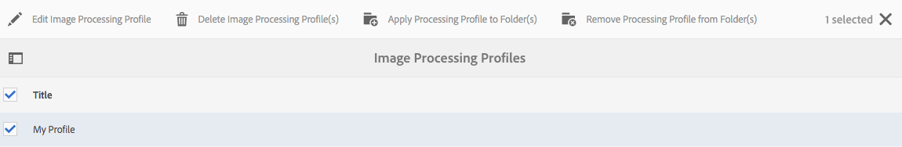

# 管理資產 {#manage-assets}

本文說明如何在Adobe Experience Manager Assets中管理和編輯資產。 若要管理內容片段，請參閱[內容片段](content-fragments/content-fragments.md)資產。

## 建立資料夾 {#creating-folders}

組織資產集合時（例如所有`Nature`影像），您可以建立資料夾以將其保持在一起。 您可以使用資料夾來分類及組織資產。 [!DNL Experience Manager Assets] 不要求您組織資料夾中的資產，以提高運作效率。

>[!NOTE]
>
>* 共用至Marketing Cloud時，不支援共用`sling:OrderedFolder`類型的「資產」資料夾。 如果要共用資料夾，建立資料夾時不要選擇[!UICONTROL Ordered]。
>* Experience Manager不允許使用`subassets`字作為資料夾的名稱。 它是為包含複合資產子資產的節點保留的關鍵字


1. 導覽至您要建立新資料夾的數位資產資料夾中的位置。 在菜單中，按一下&#x200B;**[!UICONTROL Create]**。 選擇&#x200B;**[!UICONTROL 新建資料夾]**。
1. 在&#x200B;**[!UICONTROL Title]**&#x200B;欄位中，提供資料夾名稱。 依預設，DAM會使用您提供的標題作為資料夾名稱。 建立資料夾後，您可以覆寫預設值並指定其他資料夾名稱。
1. 按一下&#x200B;**[!UICONTROL 建立]**。您的資料夾會顯示在數位資產資料夾中。

不支援下列（以空格分隔的）字元清單：

* 資產檔案名稱不能包含下列任一字元：`* / : [ \\ ] | # % { } ? &`
* 資產資料夾名稱不能包含下列任一字元：`* / : [ \\ ] | # % { } ? \" . ^ ; + & \t`

## 上傳資產 {#uploading-assets}

請參閱[將數位資產新增至Experience Manager](add-assets.md)。

## 偵測重複資產 {#detect-duplicate-assets}

<!-- TBD: This feature may not work as documented. See CQ-4283718. Get PM review done. -->

如果DAM使用者上傳存放庫中已存在的一或多個資產， [!DNL Experience Manager]會偵測到重複項目並通知使用者。 重複偵測預設為停用，因為它可能會根據存放庫大小和上傳的資產數量而影響效能。 若要啟用功能，請設定[!UICONTROL AdobeAEM雲端資產複製偵測器]。 請參閱[如何執行OSGi配置](https://experienceleague.adobe.com/docs/experience-manager-cloud-service/implementing/deploying/configuring-osgi.html)。 複製檢測基於儲存在`jcr:content/metadata/dam:sha1`的唯一`dam:sha1`值。 這表示即使檔案名稱不同，仍會偵測到重複資產。

您可以在自訂程式碼中新增設定檔案`/apps/example/config.author/com.adobe.cq.assetcompute.impl.assetprocessor.AssetDuplicationDetector.cfg.json`，且該檔案可包含下列項目：

```json
{
  "enabled":true,
  "detectMetadataField":"dam:sha1"
}
```

啟用後，Experience Manager會將重複資產的通知傳送至Experience Manager收件匣。 這是多個重複項的匯總結果。 使用者可以根據結果選擇移除資產。


## 預覽資產 {#previewing-assets}

若要預覽資產，請依照下列步驟操作。

1. 從「資產」使用者介面，導覽至您要預覽的資產位置。
1. 點選所需的資產以開啟它。

1. 在預覽模式中，[支援的影像類型](/help/assets/file-format-support.md)（具有互動式編輯）可使用縮放選項。

   若要放大資產，請點選/按一下`+`（或點選/按一下資產上的放大鏡）。 若要縮小，請點選/按一下`-`。 放大時，可通過平移來密切查看影像的任何區域。 重設縮放箭頭會將您帶回原始檢視。

   點選&#x200B;**[!UICONTROL 重設]**&#x200B;以將檢視重設為原始大小。

## 編輯屬性 {#editing-properties}

1. 導覽至您要編輯其中繼資料的資產位置。

1. 選取資產，然後從工具列點選/按一下「屬性&#x200B;**** 」以檢視資產屬性。 或者，選擇資產卡上的&#x200B;**[!UICONTROL 屬性]**&#x200B;快速操作。

   

1. 在[!UICONTROL 屬性]頁中，編輯各個標籤下的元資料屬性。 例如，在&#x200B;**[!UICONTROL Basic]**&#x200B;標籤下，編輯標題、說明等。

   >[!NOTE]
   >
   >[!UICONTROL 屬性]頁的佈局和可用的元資料屬性取決於基礎元資料架構。 若要了解如何修改[!UICONTROL 屬性]頁面的版面，請參閱[中繼資料結構](/help/assets/metadata-schemas.md)。

1. 若要排程啟動資產的特定日期/時間，請使用「準時」欄位旁的日 **[!UICONTROL 期選擇器]** 。

   

1. 若要在特定持續時間後停用資產，請從&#x200B;**[!UICONTROL 關閉時間]**&#x200B;欄位旁的日期選取器選擇停用日期/時間。 停用日期應晚於資產的啟用日期。 在[!UICONTROL 關閉時間]之後，資產及其轉譯無法透過Assets網頁介面或HTTP API使用。

   

1. 在&#x200B;**[!UICONTROL 標籤]**&#x200B;欄位中，選取一或多個標籤。 若要新增自訂標籤，請在方塊中輸入標籤名稱，然後選取`Enter`索引鍵。 新標籤儲存在[!DNL Experience Manager]中。

   YouTube需要標籤才能發佈，且有YouTube的連結（如果找到合適的連結）。

   >[!NOTE]
   >
   >若要建立標籤，您必須在CRX存放庫的`/content/cq:tags/default`路徑上擁有寫入權限。

1. 點選/按一下&#x200B;**[!UICONTROL 儲存並關閉]**。

1. 導覽至「資產」使用者介面。 編輯的中繼資料屬性（包括標題、說明和標籤）會顯示在「卡片」檢視的資產卡片上，以及「清單」檢視的相關欄下。

<!-- TBD: Uncomment after verification for Dec release.

## View asset usage and references {#usage-and-references}

[!DNL Experience Manager] lets you track statistics about usage of a digital asset. The usage statistics include the following:

    * Number of times the asset was viewed or downloaded
    * Channels/devices through which the asset was used
    * Creative solutions where the asset was recently used

To view usage statistics for an asset, in the [!UICONTROL Properties] page, click the **[!UICONTROL Insights]** tab. For more details, see [Assets Insights](assets-insights.md).

[!DNL Experience Manager] also lets you check all the incoming references to an asset, that is, the usage of an asset in remote [!DNL Sites] and in compound assets. Authors of webpages on [!DNL Experience Manager Sites] deployment can use an asset on a remote [!DNL Assets] deployment using the Connected Assets functionality. The [!UICONTROL References] tab in an asset's [!UICONTROL Properties] page lists the local and remote references of the asset. That is, the use of assets in compound assets in [!DNL Assets] and its use in remote [!DNL Sites] pages.

-->

## 複製資產 {#copying-assets}

複製資產或資料夾時，會複製整個資產或資料夾，及其內容結構。 複製的資產或資料夾會在目標位置複製。 來源位置的資產未變更。

資產特定復本的少數屬性不會結轉。 例如：

* 資產ID、建立日期和時間，以及版本和版本記錄。 其中有些屬性以屬性`jcr:uuid`、`jcr:created`和`cq:name`表示。

* 每個資產及其每個轉譯的建立時間和參考路徑都是唯一的。

保留其他屬性和中繼資料資訊。 複製資產時不會建立部分復本。

1. 從「資產」UI中，選取一或多個資產，然後點選/按一下工具列中的&#x200B;**[!UICONTROL 複製]**&#x200B;圖示。 或者，從資產卡中選擇&#x200B;**[!UICONTROL Copy]** 快速操作。

   >[!NOTE]
   >
   >如果您使用[!UICONTROL Copy]快速動作，則一次只能複製一個資產。

1. 導覽至您要複製資產的位置。

   >[!NOTE]
   >
   >如果您複製相同位置的資產， [!DNL Experience Manager]會自動產生名稱的變異。 例如，如果您複製名為`Square`的資產， [!DNL Experience Manager]會自動產生其復本的標題，作為`Square1`。

1. 按一下工具列中的&#x200B;**[!UICONTROL 貼上]**&#x200B;資產圖示。 資產會複製到此位置。

   

   >[!NOTE]
   >
   >在貼上操作完成之前，工具欄中會提供&#x200B;**[!UICONTROL 貼上]**&#x200B;圖示。

### 移動或重新命名資產 {#moving-or-renaming-assets}

1. 導覽至您要移動的資產位置。

1. 選取資產，然後點選/按一下工具列中的&#x200B;**[!UICONTROL 移動]**&#x200B;圖示。

1. 在「移動資產」精靈中，執行下列其中一項作業：

   * 指定資產移動後的名稱。 然後點選/按一下&#x200B;**[!UICONTROL Next]**&#x200B;以繼續。

   * 點選/按一下&#x200B;**[!UICONTROL 取消]**&#x200B;以停止程式。
   >[!NOTE]
   >
   >* 如果新位置沒有具有該名稱的資產，您可以為資產指定相同的名稱。 不過，如果將資產移至資產名稱相同的位置，則應使用不同的名稱。 如果您使用相同的名稱，系統會自動產生名稱的變數。 例如，如果資產的名稱為Square，則系統會為其副本產生名稱Square1。
   >* 重新命名時，檔案名稱中不允許使用空格。


1. 在&#x200B;**[!UICONTROL 選擇目標]**&#x200B;對話框中，執行以下操作之一：

   * 導覽至資產的新位置，然後點選/按一下「**[!UICONTROL Next]** 」以繼續。

   * 點選/按一下&#x200B;**[!UICONTROL Back]**&#x200B;以返回&#x200B;**[!UICONTROL Rename]**&#x200B;畫面。

1. 如果要移動的資產有任何參考頁面、資產或集合， **[!UICONTROL 調整參考]**&#x200B;標籤會顯示在&#x200B;**[!UICONTROL 選取目標]**&#x200B;標籤旁。

   在&#x200B;**[!UICONTROL Adjust References]**&#x200B;螢幕中執行以下操作之一：

   * 指定要根據新詳細資訊調整的參照，然後點選/按一下「**[!UICONTROL 移動]**」以繼續。

   * 從&#x200B;**[!UICONTROL Adjust]**&#x200B;欄中選取/取消選取資產的參考。
   * 點選/按一下&#x200B;**[!UICONTROL Back]**&#x200B;以返回&#x200B;**[!UICONTROL Select Destination]**&#x200B;畫面。

   * 點選/按一下&#x200B;**[!UICONTROL 取消]**&#x200B;以停止移動操作。

   如果您未更新參考，它們會繼續指向資產的先前路徑。 如果調整參照，參照會更新為新資產路徑。

### 管理轉譯 {#managing-renditions}

1. 您可以新增或移除資產的轉譯，但原始資產除外。 導覽至您要新增或移除轉譯的資產位置。

1. 點選/按一下資產以開啟其資產頁面。

   

1. 點選/按一下GlobalNav圖示，然後從清單中選取&#x200B;**[!UICONTROL 轉譯]**。

   

1. 在&#x200B;**[!UICONTROL 轉譯]**&#x200B;面板中，檢視為資產產生的轉譯清單。

   

   >[!NOTE]
   >
   >依預設，[!DNL Experience Manager Assets]不會以預覽模式顯示資產的原始轉譯。 如果您是管理員，則可以使用覆蓋來設定[!DNL Assets]以在預覽模式中顯示原始轉譯。

1. 選取轉譯以檢視或刪除轉譯。

   **刪除轉譯**

   從&#x200B;**[!UICONTROL Renditions]**&#x200B;面板中選取轉譯，然後點選/按一下工具列中的&#x200B;**[!UICONTROL Delete Rendition]**&#x200B;圖示。 資產處理完成後，無法大量刪除轉譯。 對於個別資產，您可以從使用者介面手動移除轉譯。 對於多個資產，您可以自訂[!DNL Experience Manager]以刪除特定轉譯或刪除資產，然後重新上傳已刪除的資產。

   

   **上傳新轉譯**

   導覽至資產的資產詳細資訊頁面，然後點選/按一下工具列中的「新增轉譯 **** 」圖示，以上傳資產的新轉譯。

   

   >[!NOTE]
   >
   >如果您從「轉譯」面板選取轉譯 **** ，工具列會變更上下文，並僅顯示與轉譯相關的動作。不會顯示「上傳轉譯」圖示等選項。若要在工具列中檢視這些選項，請導覽至資產的詳細資訊頁面。

   您可以為要顯示在影像或視訊資產詳細資訊頁面中的轉譯設定維度。 Assets會根據您指定的維度，顯示包含完全或最接近維度的轉譯。

   若要在資產詳細資料層級設定影像的轉譯尺寸，請覆蓋節 `renditionpicker` 點(`libs/dam/gui/content/assets/assetpage/jcr:content/body/content/content/items/assetdetail/items/col1/items/assetview/renditionpicker`)並設定width屬性的值。設定屬性大 **[!UICONTROL 小 (長) (KB]** )以取代寬度，以根據影像大小自訂資產詳細資料頁面上的轉譯。對於基於大小的定製，如果匹配的 `preferOriginal` 格式副本的大小大於原始格式副本的大小，則屬性會為原始格式副本指定首選項。

   同樣地，您可以通過覆蓋`libs/dam/gui/content/assets/annotate/jcr:content/body/content/content/items/content/renditionpicker`來自定義「注釋」頁影像。

   

   若要設定視訊資產的轉譯維度，請導覽至`/libs/dam/gui/content/assets/assetpage/jcr:content/body/content/content/items/assetdetail/items/col1/items/assetview/videopicker`位置之CRX存放庫的`videopicker`節點、覆蓋節點，然後編輯適當的屬性。

   >[!NOTE]
   >
   >只有具有HTML5相容視訊格式的瀏覽器才支援視訊註解。 此外，根據瀏覽器，支援不同的視訊格式。

## 刪除資產 {#delete-assets}

若要解析或移除其他頁面中傳入的參照，請先更新相關的參照，再刪除資產。

此外，停用使用覆蓋圖的強制刪除按鈕，以禁止使用者刪除參考的資產並留下中斷的連結。

1. 瀏覽至您要刪除的資產所在的位置。

1. 選取資產，然後從工具列按一下「**[!UICONTROL 刪除]** 」。

1. 在確認對話方塊中，按一下：

   * **** 取消操作
   * **[!UICONTROL 刪除]**&#x200B;來確認動作：

      * 如果資產沒有參考，則會刪除資產。
      * 如果資產有參考，則會出現錯誤訊息通知您&#x200B;**[!UICONTROL 已參考一或多個資產]**。 您可以選取&#x200B;**[!UICONTROL 強制刪除]**&#x200B;或&#x200B;**[!UICONTROL 取消]**。

   >[!NOTE]
   >
   >您需要dam/asset的刪除權限才能刪除資產。 如果您只有修改權限，則只能編輯資產中繼資料和新增註解至資產。 不過，您無法刪除資產或其中繼資料。

   >[!NOTE]
   >
   >若要解析或移除其他頁面中傳入的參照，請先更新相關的參照，再刪除資產。 您可以不允許刪除參照的資產，因為這會造成連結損毀。 使用覆蓋停用強制刪除按鈕。

## 下載資產 {#download-assets}

請參閱從 [!DNL Experience Manager]](/help/assets/download-assets-from-aem.md)下載資產。[

## 發佈或取消發佈資產 {#publish-assets}

1. 導覽至您要發佈或要從發佈環境中移除的資產或資產資料夾位置（取消發佈）。

1. 選取要發佈或取消發佈的資產或資料夾，然後從工具列選取&#x200B;**[!UICONTROL 管理出版物]** 選項。 或者，若要快速發佈，請從工具列選取&#x200B;**[!UICONTROL 快速發佈]**&#x200B;選項。 如果要發佈的資料夾包含空資料夾，則不會發佈空資料夾。

1. 視需要選取&#x200B;**[!UICONTROL Publish]**&#x200B;或&#x200B;**[!UICONTROL Unpublish]**&#x200B;選項。

   
   *圖：發佈和取消發佈選項及排程選項。*

1. 選取&#x200B;**[!UICONTROL Now]**&#x200B;立即對資產採取行動，或選取&#x200B;**[!UICONTROL Later]**&#x200B;以排程動作。 如果選擇&#x200B;**[!UICONTROL Later]**&#x200B;選項，請選擇日期和時間。 按一下&#x200B;**[!UICONTROL 下一步]**。

1. 發佈時，如果資產參考其他資產，其參考會列在精靈中。 系統只會顯示自上次發佈後取消發佈或修改的參照。 選擇要發佈的參照。

1. 取消發佈時，如果資產參考其他資產，請選擇您要取消發佈的參考。 按一下&#x200B;**[!UICONTROL 取消發佈]**。 在確認對話方塊中，按一下&#x200B;**[!UICONTROL 取消]**&#x200B;以停止動作，或按一下&#x200B;**[!UICONTROL 取消發佈]**&#x200B;以確認資產將在指定日期取消發佈。

了解發佈或取消發佈資產或資料夾的相關下列限制和秘訣：

* [!UICONTROL 管理出版物]選項僅適用於具有復寫權限的使用者帳戶。
* 取消發佈複雜資產時，僅取消發佈資產。 請避免取消發佈參考，因為其他已發佈的資產可能會參照這些參考。
* 未發佈空資料夾。
* 如果您發佈正在處理的資產，則只會發佈原始內容。 遺失轉譯。 等待處理完成，然後處理完成後發佈或重新發佈資產。

## 已關閉的用戶組 {#closed-user-group}

封閉的使用者群組(CUG)可用來限制對從[!DNL Experience Manager]發佈的特定資產資料夾的存取。 如果為資料夾建立CUG，則對資料夾（包括資料夾資產和子資料夾）的訪問權限僅限於分配的成員或組。 若要存取資料夾，使用者必須使用其安全憑證登入。

CUG是限制存取資產的額外方式。 您也可以為資料夾設定登入頁面。

1. 從資產UI中選取資料夾，然後點選/按一下工具列中的「屬性」圖示，以顯示屬性頁面。
1. 從&#x200B;**[!UICONTROL Permissions]**&#x200B;頁簽，在&#x200B;**[!UICONTROL Closed User Group]**&#x200B;下添加成員或組。

   

1. 若要在使用者存取資料夾時顯示登入畫面，請選取&#x200B;**[!UICONTROL 啟用]**&#x200B;選項。 然後，選擇[!DNL Experience Manager]中登錄頁的路徑，並保存更改。

   

   >[!NOTE]
   >
   >如果您未指定登入頁面的路徑，[!DNL Experience Manager]會在發佈執行個體中顯示預設登入頁面。

1. 發佈資料夾，然後嘗試從發佈執行個體存取資料夾。 隨即顯示登入畫面。
1. 如果您是CUG成員，請輸入您的安全憑據。 資料夾會在[!DNL Experience Manager]驗證您後顯示。

## 搜尋資產 {#search-assets}

搜尋資產是數位資產管理系統使用的核心，無論是供創意人員進一步使用、供業務使用者和行銷人員強大管理資產，或供DAM管理員管理。

如需簡單、進階和自訂搜尋以探索及使用最適當的資產，請參閱[在 [!DNL Experience Manager]](/help/assets/search-assets.md)中搜尋資產。

## 快速動作 {#quick-actions}

一次只有一個資產的快速動作圖示可用。視您的裝置而定，執行下列動作以顯示快速動作圖示：

* 觸摸設備：觸摸並按住。 例如，在iPad上，您可以點選並按住資產，以顯示快速動作。
* 非接觸裝置：暫留指針。 例如，在案頭裝置上，如果將指標暫留在資產縮圖上，則會顯示快速動作列。

## 編輯影像 {#editing-images}

[!DNL Experience Manager Assets]介面中的編輯工具可讓您對影像資產執行小型編輯工作。 您可以裁切、旋轉、翻轉和對影像執行其他編輯工作。 您也可以將影像地圖新增至資產。

>[!NOTE]
>
>對於某些元件，全螢幕模式有其他可用選項。

1. 執行下列其中一項操作，以在編輯模式中開啟資產：

   * 選取資產，然後按一下/點選工具列中的&#x200B;**[!UICONTROL 編輯]**&#x200B;圖示。
   * 點選/按一下「卡片」檢視中資產上顯示的&#x200B;**[!UICONTROL 編輯]**&#x200B;圖示。
   * 在資產頁面中，點選/按一下工具列中的&#x200B;**[!UICONTROL 編輯]**&#x200B;圖示。

   

1. 若要裁切影像，請點選/按一下「**裁切**」圖示。

   

1. 從清單中選取所需的選項。裁切區域會根據您選擇的選項出現在影像上。「自 **由手形** 」選項可讓您裁切影像，而不受任何外觀比例限制。

   

1. 選取要裁切的區域，並在影像上調整大小或重新定位。
1. 使用&#x200B;**完成**&#x200B;圖示（右上角）裁切影像。 按一下&#x200B;**完成**&#x200B;圖示也會觸發重新產生轉譯。

   

1. 使用右 **上角的** 「復原」和「 **** 重做」圖示，分別回復至未裁切的影像或保留已裁切的影像。

   

1. 點選/按一下適當的「旋轉」圖示，以順時針或逆時針旋轉影像。

   

1. 點選/按一下適當的「反轉」圖示，以水準或垂直翻轉影像。

   

1. 點選/按一下&#x200B;**完成**&#x200B;圖示以儲存變更。

   

>[!NOTE]
>
>BMP、GIF、PNG和JPEG檔案格式支援影像編輯。

<!-- You can also add image maps using the image editor. For details, see [Adding Image Maps](/help/assets/image-maps.md). -->

>[!NOTE]
>
>要編輯TXT檔案，請從Configuration Manager設定&#x200B;**Day CQ Link Externalizer**。

## 時間軸 {#timeline}

時間軸可讓您檢視所選項目的各種事件，例如資產的作用中工作流程、註解/註解、活動記錄檔和版本。


*圖：排序資產的時間軸項目*

>[!NOTE]
>
>在[集合控制台](/help/assets/manage-collections.md#navigate-the-collections-console)中， **[!UICONTROL 全部顯示]**&#x200B;清單提供僅查看注釋和工作流的選項。 此外，時間軸只會針對控制台中列出的頂層集合顯示。 如果您導覽至任何系列內，畫面不會顯示。

>[!NOTE]
>
>時間軸包含多個內容片段專用的[選項](content-fragments/content-fragments.md)。

## 備註 {#annotating}

註解是在影像或影片中新增的註解或說明性附註。 註解可讓行銷人員共同作業，並提供資產的相關意見。

只有HTML5相容視訊格式的瀏覽器才支援視訊註解。 Assets支援的視訊格式取決於瀏覽器。

>[!NOTE]
>
>對於內容片段，會在片段編輯器](content-fragments/content-fragments.md)中建立[註解。

1. 導覽至您要新增註解的資產位置。
1. 點選/按一下下列其中一項中的「**[!UICONTROL 注釋]**」圖示：

   * [快速動作](#quick-actions)
   * 選取資產或導覽至資產頁面後，從工具列

   

1. 在時間軸底部的 **[!UICONTROL 「注釋]** 」方塊中新增注釋。或者，在影像上標籤一個區域，並在「添加註釋」( **[!UICONTROL Add Annotation]** )對話框中添加註釋。

   

<!--
1. To notify a user about an annotation, specify the email address of the user and add the comment. For example, to notify Aaron MacDonald about an annotation, enter @aa. Hints for all matching users is displayed in a list. Select Aaron's email address from the list to tag her with the comment. Similarly, you can tag more users anywhere within the annotation or before or after it.
-->

>[!NOTE]
>
>對於非管理員使用者，只有在使用者具有CRXDE中`/home`的讀取權限時，才會顯示建議。


1. 新增附註後，按一下「**[!UICONTROL 新增]**」加以儲存。 向Aaron發送注釋通知。

   

   >[!NOTE]
   >
   >您可以先新增多個註解，再儲存。

1. 點選/按一下&#x200B;**[!UICONTROL 關閉]**&#x200B;以退出「注釋」模式。
1. 若要檢視通知，請使用Aaron MacDonald的憑證登入Assets，然後按一下&#x200B;**[!UICONTROL Notifications]**&#x200B;圖示以檢視通知。

   >[!NOTE]
   >
   >您也可以將註解新增至視訊資產。 為視訊加上註解時，播放器會暫停，讓您在影格上加上註解。 如需詳細資訊，請參閱[管理視訊資產](manage-video-assets.md)。

1. 若要選擇不同的顏色，以便區分不同的用戶，請按一下/點選「配置檔案」表徵圖，然後按一下/點選&#x200B;**[!UICONTROL 「我的首選項」]**。

   

   在「注釋顏色」( **[!UICONTROL Annotation Color)框中指定所要的顏色]** ，然後按一下/點選「 **[!UICONTROL 接受」(Accept]**)。

   

>[!NOTE]
>
>您也可以將註解新增至集合。 不過，如果集合包含子集合，則只能向父集合添加註釋/注釋。 「注釋」選項不適用於子集合。

### 查看保存的注釋 {#viewing-saved-annotations}

一次只能查看一個批注。

>[!NOTE]
>
>如果選擇多個注釋，則最新的注釋將顯示在用戶介面上。
>
>只有以PDF列印註解的資產時，才支援多選。

1. 若要檢視資產的已儲存註解，請導覽至資產位置，並開啟資產的資產頁面。

1. 點選/按一下GlobalNav圖示，然後從清單中選擇&#x200B;**[!UICONTROL 時間軸]**。

   

1. 從時間軸 **[!UICONTROL 的「顯示全部]** 」清單中，選取「注 **[!UICONTROL 釋]** 」以根據註解來篩選結果。

   

   點選/按一下&#x200B;**[!UICONTROL 時間軸]**&#x200B;面板中的注釋，以檢視影像上的對應注釋。

   

   點選/按一下&#x200B;**[!UICONTROL Delete]**&#x200B;以刪除特定備注。

### 打印注釋 {#printing-annotations}

如果資產有註解或已經受審核工作流程，您可以將資產連同註解和審核狀態列為PDF檔案，以便離線審核。

您也可以選擇僅打印注釋或查看狀態。

>[!NOTE]
>
>在以PDF列印註解的資產時，您可以選取多個註解。

要打印注釋和審閱狀態，請點選/按一下&#x200B;**[!UICONTROL Print]**&#x200B;表徵圖，然後按照嚮導中的說明操作。 只有當資產至少為其分配了一個批注或審閱狀態時，**[!UICONTROL 打印]**&#x200B;表徵圖才會出現在工具欄中。

1. 從資產UI中，開啟資產的預覽頁面。
1. 執行下列任一操作：

   * 要打印所有注釋和審閱狀態，請跳過步驟3並直接轉到步驟4。
   * 要打印特定注釋和查看狀態，請開啟[時間軸](/help/assets/manage-digital-assets.md#timeline)，然後轉到步驟3。

1. 要打印特定注釋，請從時間軸中選擇注釋。

   

   要僅打印審閱狀態，請從時間軸中選擇它。

   

1. 點選/按一下工具列中的&#x200B;**[!UICONTROL 列印]**&#x200B;圖示。

   

1. 從「打印」對話框中，選擇要在PDF上顯示注釋/審閱狀態的位置。 例如，如果希望在包含打印影像的頁面的右上方打印注釋/狀態，請使用&#x200B;**左上**&#x200B;設定。 預設會選取。

   

   您可以根據要在打印的PDF中顯示注釋/狀態的位置選擇其他設定。如果您希望註解/狀態顯示在與印刷資產不同的頁面中，請選擇「下 **[!UICONTROL 一頁」]**。

1. 按一下&#x200B;**[!UICONTROL 打印]**。 根據您在步驟2中選擇的選項，產生的PDF會在指定位置顯示註解/狀態。例如，如果您選擇使用左上角設定打印注釋和審閱狀態 **** ，則生成的輸出類似於此處所示的PDF檔案。

   

1. 使用右上角的選項下載或列印PDF。

   

   要修改所呈現的PDF檔案的外觀，例如注釋和狀態的字型顏色、大小和樣式、背景顏色，請從Configuration Manager中開啟&#x200B;**[!UICONTROL 注釋PDF配置]**，並修改所需的選項。 例如，若要變更已核准狀態的顯示顏色，請修改對應欄位中的顏色代碼。 有關更改批注的字型顏色的資訊，請參閱[批注](/help/assets/manage-digital-assets.md#annotating)。

   

   返回轉譯的PDF檔案並重新整理。 重新整理的PDF會反映您所做的變更。

## 資產版本設定 {#asset-versioning}

版本設定會建立數位資產在特定時間點的快照。版本設定有助於在稍後將資產還原為先前狀態。 例如，如果您想要還原對資產所做的變更，請還原未編輯的資產版本。

以下是您建立版本的案例：

* 您可以修改不同應用程式中的影像，並上傳至「資產」。 會建立影像版本，以免覆寫原始影像。
* 您可以編輯資產的中繼資料。
* 您使用[!DNL Experience Manager]案頭應用程式來結帳現有資產並儲存變更。 每次儲存資產時都會建立新版本。

您也可以透過工作流程啟用自動版本設定。 當您建立資產的版本時，中繼資料和轉譯會與版本一併儲存。 轉譯是相同影像的替代項目，例如上傳之JPEG檔案的PNG轉譯。

版本設定功能可讓您執行下列動作：

* 建立資產版本。
* 檢視資產的目前修訂。
* 將資產還原為舊版。

1. 導覽至您要建立版本的資產位置，然後點選/按一下資產以開啟其資產頁面。

1. 點選/按一下GlobalNav圖示，然後從功能表選擇&#x200B;**[!UICONTROL 時間軸]**。

   

1. 點選/按一下底部的&#x200B;**[!UICONTROL 動作]**（箭頭）圖示，以檢視您可以對資產執行的可用動作。

   

1. 點選/按一下&#x200B;**[!UICONTROL 另存新檔]**&#x200B;以建立資產的版本。

   

1. 添加標籤和注釋，然後按一下&#x200B;**[!UICONTROL Create]**&#x200B;以建立版本。 或者，點選/按一下&#x200B;**取消**&#x200B;以退出操作。

   

1. 若要檢視新版本，請從資產詳細資 **[!UICONTROL 訊頁面或資產UI開啟時間軸中的「顯示全部]** 」清單，然後選擇「版 **[!UICONTROL 本」]**。為資產建立的所有版本都會列在時間軸標籤下。您可以按一下下拉箭頭並從清單中選取「版本」，篩選清單以顯 **[!UICONTROL 示「版本]** 」。

   

1. 選取資產的特定版本以預覽資產，或讓資產顯示在資產UI中。

   

1. 為要回復至資產UI中特定版本的版本新增標籤和註解。

   

1. 若要產生版本的預覽，請點選/按一下「預 **[!UICONTROL 覽版本」]**。
1. 若要在資產UI中顯示此版本，請選取「**[!UICONTROL 還原為此版本」]**。
1. 若要比較兩個版本，請前往資產的資產頁面，點選/按一下要與目前版本比較的版本。

   

1. 從時間軸中，選取您要比較的版本，並將滑桿拖曳至左側，將此版本疊加在目前版本上並進行比較。

   

### 在資產上啟動工作流程 {#starting-a-workflow-on-an-asset}

1. 導覽至您要啟動工作流程的資產位置，然後點選/按一下資產以開啟資產頁面。
1. 點選/按一下GlobalNav圖示，然後從功能表中選擇&#x200B;**[!UICONTROL 時間軸]**&#x200B;以顯示時間軸。

   

1. 點選/按一下底部的&#x200B;**[!UICONTROL 動作]**（箭頭）圖示，開啟資產可用的動作清單。

   

1. 從清單點選/按一下「**[!UICONTROL 開始工作流程]**」。

   

1. 在&#x200B;**[!UICONTROL 啟動工作流]**&#x200B;對話框中，從清單中選擇工作流模型。

   

1. （可選）指定工作流的標題，可用於參考工作流實例。

   

1. 點選/按一 **[!UICONTROL 下「開始]** 」，然後點選/按一下對話 **[!UICONTROL 方塊中的「繼續]** 」以進行確認。工作流程的每個步驟都會以事件的形式顯示在時間軸中。

   

## 集合 {#collections}

集合是一組已排序的資產。 使用集合在使用者之間共用資產。

* 集合可以包含不同位置的資產，因為它們只包含這些資產的參考。 每個集合會維護資產的參考完整性。
* 您可以與具有不同權限層級的多個使用者共用集合，包括編輯、檢視等。

要了解集合管理的詳細資訊，請參閱[管理集合](/help/assets/manage-collections.md)。

## 在案頭應用程式或Adobe資產連結中檢視資產時，隱藏過期的資產 {#hide-expired-assets-via-acp-api}

[!DNL Experience Manager] 案頭應用程式可從Windows或Mac案頭存取DAM存放庫。Adobe資產連結可讓您從支援的[!DNL Creative Cloud]案頭應用程式存取資產。

從[!DNL Experience Manager]使用者介面內瀏覽資產時，不會顯示過期的資產。 若要防止從案頭應用程式和「資產連結」瀏覽資產時檢視、搜尋及擷取過期的資產，管理員可以執行下列設定。 此配置適用於所有用戶，而不考慮管理員權限。

執行以下CURL命令。 對於存取資產的使用者，請確保在`/conf/global/settings/dam/acpapi/`上有讀取存取權。 屬於`dam-user`群組的使用者依預設擁有權限。

```curl
curl -v -u admin:admin --location --request POST 'http://localhost:4502/conf/global/settings/dam/acpapi/configuration/_jcr_content' \
--header 'Content-Type: application/x-www-form-urlencoded' \
--data-urlencode 'jcr:title=acpapiconfig' \
--data-urlencode 'hideExpiredAssets=true' \
--data-urlencode 'hideExpiredAssets@TypeHint=Boolean' \
--data-urlencode 'jcr:primaryType=nt:unstructured' \
--data-urlencode '../../jcr:primaryType=sling:Folder'
```

若要深入了解，請參閱如何使用案頭應用程式](https://experienceleague.adobe.com/docs/experience-manager-desktop-app/using/using.html#browse-search-preview-assets)和[如何使用Adobe資產連結](https://helpx.adobe.com/enterprise/admin-guide.html/enterprise/using/manage-assets-using-adobe-asset-link.ug.html)來瀏覽DAM資產。[
