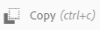

# Manage assets {#manage-assets}

本文說明如何在Adobe Experience Manager(AEM)Assets中管理和編輯資產。 若要管理內容片段，請參 [閱內容片段](content-fragments/content-fragments.md) 。

## 建立資料夾 {#creating-folders}

組織資產集合（例如，所有影像）時， `Nature` 您可以建立資料夾以將資產保持在一起。 您可以使用資料夾來分類和組織您的資產。 AEM Assets不需要您在檔案夾中組織資產，以提高工作效率。

>[!NOTE]
>
>共用至Marketing Cloud時不 `sling:OrderedFolder`支援共用類型的「資產」檔案夾。 如果要共用資料夾，在建立資料夾時不 [!UICONTROL 要選擇] 「有序」。

1. 導覽至您要建立新資料夾的數位資產檔案夾。 在功能表中，按一下「 **[!UICONTROL 建立]**」。 選擇「 **[!UICONTROL 新建資料夾]**」。
1. 在「標 **[!UICONTROL 題]** 」欄位中，提供檔案夾名稱。 依預設，DAM會使用您提供的標題作為檔案夾名稱。 建立資料夾後，您可以覆寫預設資料夾，並指定另一個資料夾名稱。
1. 按一下 **[!UICONTROL 建立]**。您的資料夾會顯示在數位資產資料夾中。

不支援下列（以空格分隔的）字元清單：

* 資產檔案名稱不能包含下列任何字元： `* / : [ \\ ] | # % { } ? &`
* 資產檔案夾名稱不能包含下列任何字元： `* / : [ \\ ] | # % { } ? \" . ^ ; + & \t`

## Upload assets {#uploading-assets}

如需詳 [細資訊，請參閱將數位資產新增至Experience Manager](add-assets.md)。

## 預覽資產 {#previewing-assets}

若要預覽資產，請依照下列步驟進行。

1. 從「資產」使用者介面，導覽至您要預覽的資產所在的位置。
1. 點選所要的資產以將其開啟。

1. 在預覽模式中，支援的影像類型(使用互 [動式編輯](/help/assets/file-format-support.md) )可使用縮放選項。

   若要縮放資產，請點選／按一 `+` 下（或點選／按一下資產上的放大鏡）。 若要縮小，請點選／按一下 `-`。 當您放大時，可以透過平移來仔細檢視影像的任何區域。 重設縮放箭頭會將您帶回原始檢視。

   點選 **[!UICONTROL 「重設]** 」，將檢視重設為原始大小。

## 編輯屬性 {#editing-properties}

1. 導覽至您要編輯其中繼資料的資產所在位置。

1. 選取資產，然後點選／按一下工 **[!UICONTROL 具列中的]** 「屬性」以檢視資產屬性。 或者，選擇資 **[!UICONTROL 產卡上]** 「屬性」的快速動作。

   

1. 在「屬 [!UICONTROL 性] 」頁面中，編輯各標籤下的中繼資料屬性。 例如，在「基 **[!UICONTROL 本]** 」標籤下，編輯標題、說明等。

   >[!NOTE]
   >
   >「屬性」頁面 [!UICONTROL 的版面配置] ，以及可用的中繼資料屬性，取決於基礎的中繼資料結構。 要瞭解如何修改「屬性」頁的 [!UICONTROL 佈局] ，請參 [閱元資料結構](/help/assets/metadata-schemas.md)。

1. 若要排程啟動資產的特定日期/時間，請使用「準時」欄位旁的日 **[!UICONTROL 期選擇器]** 。

   

1. 若要在特定持續時間後停用資產，請從「關閉時間」欄位旁的日期選擇器選擇停 **[!UICONTROL 用日期]** /時間。 停用日期應晚於資產的啟用日期。 在「關 [!UICONTROL 閉時間]」後，資產及其轉譯無法透過「資產」網頁介面或HTTP API使用。

   

1. 在「標 **[!UICONTROL 記]** 」欄位中，選取一或多個標籤。 若要新增自訂標籤，請在方塊中輸入標籤名稱，然後按Enter鍵。 新標籤會儲存在AEM中。

   YouTube需要「標籤」才能發佈，並有YouTube的連結（如果找到適當的連結）。

   >[!NOTE]
   >
   >要建立標籤，您必須在CRX儲存庫的路 `/content/cq:tags/default` 徑上具有寫權限。

1. 若要檢視資產的使用情況統計資料，請按一下／點選「 **[!UICONTROL 前瞻分析]** 」標籤。

   使用統計資料包括：

   * 檢視或下載資產的次數
   * 使用資產的通道／裝置
   * 最近使用資產的創意解決方案
   如需詳細資訊，請參 [閱資產分析](assets-insights.md)。

1. 點選／按一下「 **[!UICONTROL 儲存並關閉]**」。

1. 導覽至「資產」使用者介面。 編輯的中繼資料屬性（包括標題、說明和標籤）會顯示在資產卡片的「卡片」檢視中，以及「清單」檢視中相關欄下。

## 複製資產 {#copying-assets}

複製資產或資料夾時，會複製整個資產或資料夾及其內容結構。 複製的資產或資料夾會在目標位置複製。 來源位置的資產不會變更。

不會結轉資產特定副本的少數屬性。 例如：

* 資產ID、建立日期和時間，以及版本和版本記錄。 有些屬性由屬性、 `jcr:uuid`和 `jcr:created`指示 `cq:name`。

* 每個資產及其每個轉譯的建立時間和參考路徑都是唯一的。

保留其他屬性和元資料資訊。 複製資產時不會建立部分復本。

1. 從「資產」使用者介面中，選取一或多個資產，然後點選／按一下工具列 **[!UICONTROL 中的]** 「複製」圖示。 或者，從資 **[!UICONTROL 產卡]** 中選擇  _copy_icon快速操作。

   >[!NOTE]
   >
   >如果您使用「復 [!UICONTROL 制] 」快速動作，一次只能複製一個資產。

1. 導覽至您要複製資產的位置。

   >[!NOTE]
   >
   >如果您在相同位置複製資產，AEM會自動產生名稱的變更。 例如，如果您複製標題為「資產」的 `Square`資產，AEM會自動產生其復本的標題 `Square1`。

1. 按一下工 **[!UICONTROL 具列中]** 的「貼上資產」圖示。 資產會複製到此位置。

   

   >[!NOTE]
   >
   >「貼 **[!UICONTROL 上]** 」圖示可在工具列中使用，直到貼上作業完成為止。

### 移動或重新命名資產 {#moving-or-renaming-assets}

1. 導覽至您要移動的資產所在的位置。

1. 選取資產，然後點選／按一下工 **[!UICONTROL 具列中的]** 。

1. 在「移動資產」精靈中，執行下列其中一項作業：

   * 指定資產移動後的名稱。 然後點選／按一 **[!UICONTROL 下]** 「下一步」繼續。

   * 點選／按一 **[!UICONTROL 下「取消]** 」以停止程式。
   >[!NOTE]
   >
   >* 如果新位置沒有同名的資產，您可以指定該資產的相同名稱。 但是，如果您將資產移至同名資產所在的位置，則應使用不同的名稱。 如果您使用相同的名稱，系統會自動產生名稱的變化。 例如，如果您的資產名稱為Square，系統會為其副本產生名稱Square1。
   >* 重新命名時，檔案名稱中不允許空格。

1. 在「選 **[!UICONTROL 擇目標]** 」對話框中，執行下列操作之一：

   * 導覽至資產的新位置，然後點選／按「下一 **[!UICONTROL 步]** 」繼續。

   * 點選／按一 **[!UICONTROL 下「上]** 」，返回「重新 **[!UICONTROL 命名]** 」畫面。

1. 如果要移動的資產有任何參照頁面、資產或系列，則「選擇目標」標籤旁 **[!UICONTROL 會顯示]** 「調整參 **[!UICONTROL 考」標籤]** 。

   在「調整參照」( **[!UICONTROL Adjust References)螢幕中執行下列操作之一]** :

   * 指定要根據新詳細資料調整的參照，然後點選／按一下「移 **[!UICONTROL 動]** 」繼續。

   * 從「調 **[!UICONTROL 整」欄]** ，選取／取消選取資產參照。
   * 點選／按一 **[!UICONTROL 下「上]** 」，返回「 **[!UICONTROL 選取目標]** 」畫面。

   * 點選／按一 **[!UICONTROL 下「取消]** 」以停止移動作業。
   如果您不更新參照，則參照會繼續指向資產的先前路徑。 如果您調整參照，它們會更新為新資產路徑。

### 管理轉譯 {#managing-renditions}

1. 您可以新增或移除資產的轉譯，但原始的轉譯除外。 導覽至您要新增或移除轉譯的資產位置。

1. 點選／按一下資產以開啟其資產頁面。

   

1. 點選／按一下GlobalNav圖示，然後從清單中選 **[!UICONTROL 取]** 「轉譯」。

   

1. 在「轉 **[!UICONTROL 譯]** 」面板中，檢視為資產產生的轉譯清單。

   

   >[!NOTE]
   >
   >依預設，AEM Assets不會在預覽模式中顯示資產的原始轉譯。 如果您是管理員，可以使用覆蓋來設定AEM Assets，以在預覽模式中顯示原始轉譯。

1. 選取要檢視或刪除轉譯的轉譯。

   **刪除轉譯**

   從「轉譯」面板選取轉 **[!UICONTROL 譯]** ，然後點選／按一下工具列中的「 **[!UICONTROL 刪除轉譯]** 」圖示。

   

   **上傳新轉譯**

   導覽至資產的資產詳細資訊頁面，然後點選/按一下工具列中的「新增轉譯 **** 」圖示，以上傳資產的新轉譯。

   

   >[!NOTE]
   >
   >如果您從「轉譯」面板選取轉譯 **** ，工具列會變更上下文，並僅顯示與轉譯相關的動作。不會顯示「上傳轉譯」圖示等選項。若要在工具列中檢視這些選項，請導覽至資產的詳細資訊頁面。

   您可以設定要顯示在影像或視訊資產詳細資料頁面的轉譯尺寸。 AEM Assets會根據您指定的維度，顯示具有精確或最接近的維度的轉譯。

   若要在資產詳細資料層級設定影像的轉譯尺寸，請覆蓋節 `renditionpicker` 點(`libs/dam/gui/content/assets/assetpage/jcr:content/body/content/content/items/assetdetail/items/col1/items/assetview/renditionpicker`)並設定width屬性的值。設定屬性大 **[!UICONTROL 小 (長) (KB]** )以取代寬度，以根據影像大小自訂資產詳細資料頁面上的轉譯。對於基於大小的定製，如果匹配的 `preferOriginal` 格式副本的大小大於原始格式副本的大小，則屬性會為原始格式副本指定首選項。

   同樣地，您也可以透過覆蓋來自訂「注釋」頁面影像 `libs/dam/gui/content/assets/annotate/jcr:content/body/content/content/items/content/renditionpicker`。

   

   若要設定視訊資產的轉譯維度，請導覽至CRX `videopicker` 儲存庫中位於位置的節 `/libs/dam/gui/content/assets/assetpage/jcr:content/body/content/content/items/assetdetail/items/col1/items/assetview/videopicker`點、覆蓋節點，然後編輯適當的屬性。

   >[!NOTE]
   >
   >只有採用HTML5相容視訊格式的瀏覽器才支援視訊註解。 此外，視瀏覽器而定，支援不同的視訊格式。

## Delete assets {#delete-assets}

若要解析或移除其他頁面的傳入參照，請先更新相關參照，再刪除資產。

此外，使用覆蓋停用強制刪除按鈕，以禁止使用者刪除參照的資產並留下中斷的連結。

1. 瀏覽至您要刪除的資產所在的位置。

1. 選取資產，然後點選／按一下工具 **[!UICONTROL 列中的]** 「刪除」圖示。

   

1. 在確認對話方塊中，按一下：

   * **[!UICONTROL 取消]** ，停止動作
   * **[!UICONTROL 刪除]**&#x200B;來確認動作：

      * 如果資產沒有參考，則會刪除資產。
      * 如果資產有參考，則會出現錯誤訊息通知您 **已參考一或多個資產。**&#x200B;您可以選取&#x200B;**[!UICONTROL 強制刪除]**&#x200B;或&#x200B;**[!UICONTROL 取消]**。
   >[!NOTE]
   >
   >您需要dam/asset的刪除權限才能刪除資產。 如果您只有修改權限，則只能編輯資產中繼資料並新增附註至資產。 不過，您無法刪除資產或其中繼資料。

   >[!NOTE]
   >
   >若要解析或移除其他頁面的傳入參照，請先更新相關參照，再刪除資產。
   >
   >
   >此外，使用覆蓋停用強制刪除按鈕，以禁止使用者刪除參照的資產並留下中斷的連結。

## 下載資產 {#download-assets}

See [Download assets from AEM](/help/assets/download-assets-from-aem.md).

## Publish assets {#publish-assets}

<!--
>[!NOTE]
>
>For more information specific to Dynamic Media, see [Publishing Dynamic Media Assets.](/help/assets/dynamic-media/publishing-dynamicmedia-assets.md)
-->

1. 導覽至您要發佈的資產／資料夾的位置。

1. 從資產卡 **[!UICONTROL 中選取「發佈]** 」快速動作，或選取資產，然後點選/按一下工具列中的「 **[!UICONTROL 快速發佈]** 」圖示。
1. 如果資產引用其他資產，其引用將列在嚮導中。 只會顯示自上次發佈／未發佈後未發佈或已修改的參照。 選擇要發佈的參照。

   

   >[!NOTE]
   >
   >如果您要發佈的檔案夾包含空白檔案夾，則不會發佈空白檔案夾。

1. 點選／按一 **[!UICONTROL 下「發佈]** 」以確認資產的啟動。

>[!CAUTION]
>
>如果您發佈正在處理的資產，則只會發佈原始內容。 缺少轉譯。 等待處理完成，然後在處理完成後發佈或重新發佈資產。

## 取消發佈資產 {#unpublishing-assets}

1. 導覽至您要從發佈環境（解除發佈）移除的資產／資產檔案夾的位置。

1. 選取要解除發佈的資產／資料夾，然後點選／按一下工具列 **[!UICONTROL 中的「管理出版物]** 」圖示。

   

1. 從清單 **[!UICONTROL 中選取]** 「取消發佈」動作。

   

1. 若要稍後解除發佈資產，請選取「 **[!UICONTROL 稍後解除發佈]**」，然後選取要解除發佈資產的日期。
1. 排程資產在發佈環境中無法使用的日期。
1. 如果資產參考其他資產，請選擇您要取消發佈的參考。 點選／按一下「 **[!UICONTROL 解除發佈]**」。
1. 在確認對話方塊中，點選／按一下：

   * **[!UICONTROL 取消]** ，停止動作
   * **[!UICONTROL 取消發佈]** ，以確認資產在指定日期已取消發佈（在發佈環境中不再可用）。
   >[!NOTE]
   >
   >解除發佈複雜資產時，請僅解除發佈資產。 請避免取消發佈參照，因為其他已發佈資產可能會參照這些參照。

## Closed user group {#closed-user-group}

已關閉的使用者群組(CUG)可用來限制對從AEM發佈的特定資產資料夾的存取權。 如果為資料夾建立CUG，則對資料夾（包括資料夾資產和子資料夾）的訪問僅限分配的成員或組。 若要存取資料夾，他們必須使用其安全憑證登入。

CUG是限制存取您資產的額外方式。 您也可以設定資料夾的登入頁面。

1. 從「資產」使用者介面選取資料夾，然後點選／按一下工具列中的「屬性」圖示以顯示屬性頁面。
1. 在「權 **[!UICONTROL 限]** 」標籤中，在「已關閉的使用者群組」 **[!UICONTROL 下新增成員或群組]**。

   

1. 若要在使用者存取資料夾時顯示登入畫面，請選取「啟 **[!UICONTROL 用]** 」選項。 然後，在AEM中選取登入頁面的路徑，並儲存變更。

   

   >[!NOTE]
   >
   >如果您未指定登入頁面的路徑，AEM會在發佈例項中顯示預設登入頁面。

1. 發佈資料夾，然後嘗試從發佈例項存取資料夾。 隨即顯示登入畫面。
1. 如果您是CUG成員，請輸入您的安全憑據。 資料夾會在AEM驗證您後顯示。

## 搜尋資產 {#search-assets}

搜尋資產是數位資產管理系統的核心使用，不論是供創意人員進一步使用、由商業使用者和行銷人員強穩管理資產，或由DAM管理員管理。

如需簡單、進階和自訂搜尋，以發現和使用最適當的資產，請參閱「AEM [中的搜尋資產」](/help/assets/search-assets.md)。

## Quick actions {#quick-actions}

一次只有一個資產的快速動作圖示可用。視您的裝置而定，執行下列動作以顯示快速動作圖示：

* 觸控裝置：輕觸並按住。 例如，在iPad上，您可以點選並按住資產，以便顯示快速動作。
* 非觸控裝置：暫留指標。 例如，在案頭裝置上，如果您將指標暫留在資產縮圖上，就會顯示快速動作列。

## 編輯影像 {#editing-images}

AEM Assets介面中的編輯工具可讓您對影像資產執行小型編輯工作。 您可以裁切、旋轉、翻轉和執行其他影像編輯工作。 您也可以將影像地圖新增至資產。

>[!NOTE]
>
>對於某些元件，全屏模式還提供其他選項。

1. 執行下列任一項作業，以在編輯模式中開啟資產：

   * 選取資產，然後按一下／點選工具 **[!UICONTROL 列中的]** 「編輯」圖示。
   * 點選／按一 **[!UICONTROL 下]** 「卡片」檢視中資產上顯示的「編輯」圖示。
   * 在資產頁面中，點選／按一下工具 **[!UICONTROL 列中的]** 「編輯」圖示。
   

1. 若要裁切影像，請點選／按一下「裁切 **」圖** 示。

   

1. 從清單中選取所需的選項。裁切區域會根據您選擇的選項出現在影像上。「自 **由手形** 」選項可讓您裁切影像，而不受任何外觀比例限制。

   

1. 選取要裁切的區域，並調整影像上的大小或位置。
1. 使用「 **完成** 」圖示（右上角）裁切影像。 按一下「完 **成** 」圖示也會觸發轉譯的重新產生。

   

1. 使用右 **上角的** 「復原」和「 **** 重做」圖示，分別回復至未裁切的影像或保留已裁切的影像。

   

1. 點選／按一下適當的「旋轉」圖示，以順時針或逆時針旋轉影像。

   

1. 點選／按一下適當的「反向」圖示，以水準或垂直反向影像。

   

1. 點選／按一下「 **完成** 」圖示以儲存變更。

   

>[!NOTE]
>
>BMP、GIF、PNG和JPEG檔案格式支援影像編輯。

<!-- You can also add image maps using the image editor. For details, see [Adding Image Maps](/help/assets/image-maps.md). -->

>[!NOTE]
>
>要編輯TXT檔案，請從配置管 **理器中設定Day CQ Link Externalizer** 。

## 時間軸 {#timeline}

時間軸可讓您檢視所選項目的各種事件，例如資產的作用中工作流程、註解／註解、活動記錄檔和版本。

*條目：排序資產的時間軸項目*

>[!NOTE]
>
>在「系 [列」控制台](/help/assets/manage-collections.md#navigate-the-collections-console),「全 **[!UICONTROL 部顯示]** 」清單提供僅檢視注釋和工作流程的選項。 此外，時間軸只會針對控制台中列出的頂層系列顯示。 如果您在任何系列中導覽，則不會顯示它。

>[!NOTE]
>
>時間軸包含數 [個特定於內容片段的選項](content-fragments/content-fragments.md)。

## 備註 {#annotating}

註解是影像或視訊中新增的註解或說明註解。 註解可讓行銷人員協作並留下有關資產的意見回應。

只有採用HTML5相容視訊格式的瀏覽器才支援視訊註解。 AEM Assets支援的視訊格式取決於瀏覽器。

>[!NOTE]
>
>對於「內容片段」, [會在片段編輯器中建立註解](content-fragments/content-fragments.md)。

1. 導覽至您要新增附註的資產位置。
1. 點選／按一 **[!UICONTROL 下]** 下列其中一項的「註解」圖示：

   * [快速動作](#quick-actions)
   * 在選取資產或導覽至資產頁面後，從工具列
   

1. 在時間軸底部的 **[!UICONTROL 「注釋]** 」方塊中新增注釋。或者，在影像上標籤一個區域，並在「添加註釋」( **[!UICONTROL Add Annotation]** )對話框中添加註釋。

   

<!--
1. To notify a user about an annotation, specify the email address of the user and add the comment. For example, to notify Aaron MacDonald about an annotation, enter @aa. Hints for all matching users is displayed in a list. Select Aaron's email address from the list to tag her with the comment. Similarly, you can tag more users anywhere within the annotation or before or after it.

   >[!NOTE]
   >
   >For a non-administrator user, suggestions appear only if the user has Read permissions at `/home` in CRXDE.

   

1. After adding the annotation, click **[!UICONTROL Add]** to save it. A notification for the annotation is sent to Aaron.

   

   >[!NOTE]
   >
   >You can add multiple annotations, before you save them.

1. Tap/click **[!UICONTROL Close]** to exit from the Annotation mode.
1. To view the notification, log in to AEM Assets with Aaron MacDonald's credentials and click the **[!UICONTROL Notifications]** icon to view the notification.

   >[!NOTE]
   >
   >Annotations can also be added to video assets. While annotating videos, the player pauses to let you annotate on a frame. For details, see [managing video assets](manage-video-assets.md).

1. To choose a different color so you can differentiate between users, click/tap the Profile icon and click/tap **[!UICONTROL My Preferences]**.

   

   Specify the desired color in the **[!UICONTROL Annotation Color]** box and then click/tap **[!UICONTROL Accept]**.

   

>[!NOTE]
>
>You can also add annotations to a collection. However, if a collection contains child collections, you can add annotations/comments to the parent collection only. The Annotate option is not available for child collections.

### View saved annotations {#viewing-saved-annotations}

1. To view saved annotations for an asset, navigate to the location of the asset and open the asset page for the asset.

1. Tap/click the GlobalNav icon, and choose **[!UICONTROL Timeline]** from the list.

   

1. From the **[!UICONTROL Show All]** list in the timeline, select **[!UICONTROL Comments]** to filter the results based on annotations.

   

   Tap/click a comment in the **[!UICONTROL Timeline]** panel to view the corresponding annotation on the image.

   

   Tap/click **[!UICONTROL Delete]**, to delete a particular comment.

### Print annotations {#printing-annotations}

If an asset has annotations or it has been subjected to a review workflow, you can print the asset along with annotations and review status as a PDF file for offline review.

You can also choose to print only the annotations or review status.

To print the annotations and review status, tap/click the **[!UICONTROL Print]** icon and follow the instructions in the wizard. The **[!UICONTROL Print]** icon appears in the toolbar only when the asset has at least one annotation or review status assigned to it.

1. From the Assets UI, open the preview page for an asset.
1. Do one of the following:

    * To print all the annotations and the review status, skip step 3 and directly go to step 4.
    * To print specific annotations and review status, open the [timeline](/help/assets/manage-digital-assets.md#timeline) and then go to step 3.

1. To print specific annotations, select the annotations from the timeline.

   

   To print the review status only, select it from the timeline.

   

1. Tap/click the **[!UICONTROL Print]** icon from the toolbar.

   

1. From the Print dialog, choose the position you want the annotations/review status to be displayed on the PDF. For example, if you want the annotations/status to be printed at the top-right of the page that contains the printed image, use the **Top-Left** setting. It is selected by default.

   

   You can choose other settings depending on the position where you want the annotations/status to appear in the printed PDF. If you want the annotations/status to appear in a page that is separate from the printed asset, choose **[!UICONTROL Next Page]**.

   >[!NOTE]
   >
   >Lengthy annotations may not render properly in the PDF file. For optimal rendering, Adobe recommends that you limit annotations to 50 words.

1. Tap/click **[!UICONTROL Print]**. Depending upon the option you choose in step 2, the generated PDF displays the annotations/status at the specified position. For example, if you choose to print both annotations and the review status using the **Top-Left** setting, the generated output resembles the PDF file depicted here.

   

1. Download or print the PDF using the options at the top-right.

   

   To modify the appearance of the rendered PDF file, for example the font color, size, and style, background color of the comments and statuses, open the **[!UICONTROL Annotation PDF configuration]** from Configuration Manager, and modify the desired options. For example, to change the display color of the approved status, modify the color code in the corresponding field. For information around changing the font color of annotations, see [Annotating](/help/assets/manage-digital-assets.md#annotating).

   

   Return to the rendered PDF file and refresh it. The refreshed PDF reflects the changes you made.

## Asset versioning {#asset-versioning}

Versioning creates a snapshot of digital assets at a specific point in time. Versioning helps restore assets to a previous state at a later time. For example, if you want to undo a change that you made to an asset, restore the unedited version of the asset.

The following are scenarios where you create versions:

* You modify an image in a different application and upload to AEM Assets. A version of the image is created so your original image is not overwritten.
* You edit the metadata of an asset.
* You use AEM desktop app to checkout an existing asset and save your changes. A new version is created everytime the asset is saved.

You can also enable automatic versioning through a workflow. When you create a version for an asset, the metadata and renditions are saved along with the version. Renditions are rendered alternatives of the same images, for example, a PNG rendition of an uploaded JPEG file.

The versioning functionality lets you do the following:

* Create a version of an asset.
* View the current revision for an asset.
* Restore the asset to a previous version.

1. Navigate to the location of the asset for which you want to create a version, and tap/click it to open its asset page.

1. Tap/click the GlobalNav icon, and the choose **[!UICONTROL Timeline]** from the menu.

   

1. Tap/click the **[!UICONTROL Actions]** (arrow) icon at the bottom to view the available actions you can perform on the asset.

   

1. Tap/click **[!UICONTROL Save as Version]** to create a version for the asset.

   

1. Add a label and comment, and then click **[!UICONTROL Create]** to create a version. Alternatively, tap/click **Cancel** to exit the operation.

   

1. To view the new version, open the **[!UICONTROL Show All]** list in the timeline from the asset details page or the Assets UI, and choose **[!UICONTROL Versions]**. All versions created for an asset are listed under the timeline tab. You can filter the list to show Versions, by clicking the drop arrow and selecting **[!UICONTROL Versions]** from the list.

   

1. Select a specific version for the asset to preview it or enable it to appear in the Assets UI.

   

1. Add a label and comment for the version to revert to the particular version in the Assets UI.

   

1. To generate a preview for the version, tap/click **[!UICONTROL Preview Version]**.
1. To display this version in the Assets UI, select **[!UICONTROL Revert to this Version]**.
1. To compare between two versions, go to asset page of the asset and tap/click the version to be compared with the current version.

   

1. From the timeline, select the version you want to compare and drag the slider to the left to superimpose this version over the current version and compare.

   

### Starte a workflow on an asset {#starting-a-workflow-on-an-asset}

1. Navigate to the location of the asset for which you want to start a workflow, and tap/click the asset to open the asset page.
1. Tap/click the GlobalNav icon, and the choose **[!UICONTROL Timeline]** from the menu to display the timeline.

   

1. Tap/click the **[!UICONTROL Actions]** (arrow) icon at the bottom to open the list of actions available for the asset.

   

1. Tap/click **[!UICONTROL Start Workflow]** from the list.

   

1. In the **[!UICONTROL Start Workflow]** dialog, select a workflow model from the list.

   

1. (Optional) Specify a title for the workflow, which can be used to reference the workflow instance.

   

1. Tap/click **[!UICONTROL Start]** and then tap/click **[!UICONTROL Proceed]** in the dialog to confirm. Each step of workflow is displayed in the timeline as an event.

   

## Collections {#collections}

A collection is an ordered set of assets. Use collections to share assets between users.

* A collection can include assets from different locations because they only contain references to these assets. Each collection maintains the referential integrity of assets.
* You can share collections with multiple users with different privilege levels, including editing, viewing, and so on.

See [Managing Collections](/help/assets/manage-collections.md) for details on collection management.
