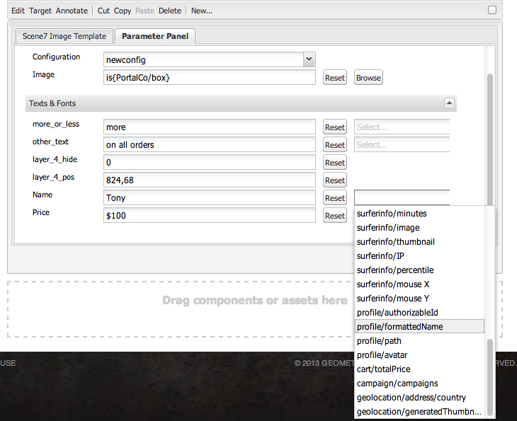

# 管理資產 {#manage-assets}

本文說明如何在中管理和編輯資產 [!DNL Adobe Experience Manager Assets]. 管理 [!DNL Content Fragments]，請參閱 [[!DNL Content Fragments]](content-fragments/content-fragments.md) 資產。

## 建立資料夾 {#creating-folders}

組織資產集合時(例如，全部 `Nature` 影像，您可以建立資料夾以將它們保持在一起。 您可以使用資料夾來分類及組織資產。 [!DNL Experience Manager Assets] 不要求您組織資料夾中的資產，以提高運作效率。

>[!NOTE]
>
>* 共用類型的「資產」資料夾 `sling:OrderedFolder`，不支援共用至Marketing Cloud。 如果要共用資料夾，請不選擇 [!UICONTROL 已訂購] 建立資料夾時。
>* Experience Manager不允許使用 `subassets` word作為資料夾的名稱。 它是為包含複合資產子資產的節點保留的關鍵字


1. 導覽至您要建立新資料夾的數位資產資料夾中的位置。 在功能表中，按一下 **[!UICONTROL 建立]**. 選擇 **[!UICONTROL 新資料夾]**.
1. 在 **[!UICONTROL 標題]** 欄位，提供資料夾名稱。 依預設，DAM會使用您提供的標題作為資料夾名稱。 建立資料夾後，您可以覆寫預設值並指定其他資料夾名稱。
1. 按一下&#x200B;**[!UICONTROL 建立]**。您的資料夾會顯示在數位資產資料夾中。

不支援下列（以空格分隔的）字元清單：

* 資產檔案名稱不能包含下列任一字元： `* / : [ \\ ] | # % { } ? &`
* 資產資料夾名稱不能包含下列任一字元： `* / : [ \\ ] | # % { } ? \" . ^ ; + & \t`

## 上傳資產 {#uploading-assets}

請參閱 [新增數位資產至Experience Manager](add-assets.md).

## 偵測重複資產 {#detect-duplicate-assets}

<!-- TBD: This feature may not work as documented. See CQ-4283718. Get PM review done. -->

如果DAM使用者上傳存放庫中已存在的一或多個資產， [!DNL Experience Manager] 會偵測重複項目並通知使用者。 重複偵測預設為停用，因為它可能會根據存放庫大小和上傳的資產數量而影響效能。 若要啟用功能，請設定 [!UICONTROL AdobeAEM Cloud資產複製偵測器]. 請參閱 [如何進行OSGi配置](https://experienceleague.adobe.com/docs/experience-manager-cloud-service/implementing/deploying/configuring-osgi.html). 複製偵測是以 `dam:sha1` 儲存於 `jcr:content/metadata/dam:sha1`. 這表示即使檔案名稱不同，仍會偵測到重複資產。

您可以新增設定檔案 `/apps/example/config.author/com.adobe.cq.assetcompute.impl.assetprocessor.AssetDuplicationDetector.cfg.json` 在自訂程式碼中，檔案可包含下列內容：

```json
{
  "enabled":true,
  "detectMetadataField":"dam:sha1"
}
```

啟用後，Experience Manager會將重複資產的通知傳送至Experience Manager收件匣。 這是多個重複項的匯總結果。 使用者可以根據結果選擇移除資產。


## 預覽資產 {#previewing-assets}

若要預覽資產，請依照下列步驟操作。

1. 從「資產」使用者介面，導覽至您要預覽的資產位置。
1. 點選所需的資產以開啟它。

1. 在預覽模式中，縮放選項可用於 [支援的影像類型](/help/assets/file-format-support.md) （使用互動式編輯）。

   若要放大資產，請點選/按一下 `+` （或點選/按一下資產上的放大鏡）。 若要縮小，請點選/按一下 `-`. 放大時，可通過平移來密切查看影像的任何區域。 重設縮放箭頭會將您帶回原始檢視。

   點選 **[!UICONTROL 重設]** 將視圖重置為原始大小。

## 編輯屬性 {#editing-properties}

1. 導覽至您要編輯其中繼資料的資產位置。

1. 選取資產，然後點選/按一下 **[!UICONTROL 屬性]** 來檢視資產屬性。 或者，選擇 **[!UICONTROL 屬性]** 在資產卡上快速執行動作。

   

1. 在 [!UICONTROL 屬性] 頁面中，編輯各種標籤下的中繼資料屬性。 例如，在 **[!UICONTROL 基本]** 頁簽，編輯標題、說明等。

   >[!NOTE]
   >
   >版面 [!UICONTROL 屬性] 頁面和可用的中繼資料屬性取決於基礎的中繼資料結構。 了解如何修改 [!UICONTROL 屬性] 頁面，請參閱 [中繼資料結構](/help/assets/metadata-schemas.md).

1. 若要排程啟動資產的特定日期/時間，請使用「準時」欄位旁的日 **[!UICONTROL 期選擇器]** 。

   

1. 若要在特定持續時間後停用資產，請從旁邊的日期選擇器選擇停用日期/時間 **[!UICONTROL 關閉時間]** 欄位。 停用日期應晚於資產的啟用日期。 在 [!UICONTROL 關閉時間]，資產及其轉譯無法透過Assets網頁介面或HTTP API使用。

   

1. 在 **[!UICONTROL 標籤]** 欄位，選取一或多個標籤。 若要新增自訂標籤，請在方塊中輸入標籤名稱並選取 `Enter` 鍵。 新標籤會儲存於 [!DNL Experience Manager].

   YouTube需要標籤才能發佈，且有YouTube的連結（如果找到合適的連結）。

   >[!NOTE]
   >
   >若要建立標籤，您必須在 `/content/cq:tags/default` CRX存放庫中的路徑。

1. 點選/按一下 **[!UICONTROL 儲存並關閉]**.

1. 導覽至「資產」使用者介面。 編輯的中繼資料屬性（包括標題、說明和標籤）會顯示在「卡片」檢視的資產卡片上，以及「清單」檢視的相關欄下。

<!-- TBD: Uncomment after verification for Dec release.

## View asset usage and references {#usage-and-references}

[!DNL Experience Manager] lets you track statistics about usage of a digital asset. The usage statistics include the following:

    * Number of times the asset was viewed or downloaded
    * Channels/devices through which the asset was used
    * Creative solutions where the asset was recently used

To view usage statistics for an asset, in the [!UICONTROL Properties] page, click the **[!UICONTROL Insights]** tab. For more details, see [Assets Insights](assets-insights.md).

[!DNL Experience Manager] also lets you check all the incoming references to an asset, that is, the usage of an asset in remote [!DNL Sites] and in compound assets. Authors of webpages on [!DNL Experience Manager Sites] deployment can use an asset on a remote [!DNL Assets] deployment using the Connected Assets functionality. The [!UICONTROL References] tab in an asset's [!UICONTROL Properties] page lists the local and remote references of the asset. That is, the use of assets in compound assets in [!DNL Assets] and its use in remote [!DNL Sites] pages.

-->

## 複製資產 {#copying-assets}

複製資產或資料夾時，會複製整個資產或資料夾，及其內容結構。 複製的資產或資料夾會在目標位置複製。 來源位置的資產未變更。

資產特定復本的少數屬性不會結轉。 例如：

* 資產ID、建立日期和時間，以及版本和版本記錄。 這些屬性中有些由屬性表示 `jcr:uuid`, `jcr:created`，和 `cq:name`.

* 每個資產及其每個轉譯的建立時間和參考路徑都是唯一的。

保留其他屬性和中繼資料資訊。 複製資產時不會建立部分復本。

1. 從「資產」UI中，選取一或多個資產，然後點選/按一下 **[!UICONTROL 複製]** 圖示。 或者，選取 **[!UICONTROL 複製]**  從資產卡執行快速動作。

   >[!NOTE]
   >
   >如果您使用 [!UICONTROL 複製] 快速動作時，一次只能複製一個資產。

1. 導覽至您要複製資產的位置。

   >[!NOTE]
   >
   >如果您複製相同位置的資產， [!DNL Experience Manager] 自動產生名稱的變數。 例如，如果您複製標題為 `Square`, [!DNL Experience Manager] 自動為其副本生成標題為 `Square1`.

1. 按一下 **[!UICONTROL 貼上]** 資產圖示。 資產會複製到此位置。

   

   >[!NOTE]
   >
   >此 **[!UICONTROL 貼上]** 表徵圖在貼上操作完成之前可在工具欄中使用。

### 移動或重新命名資產 {#moving-or-renaming-assets}

1. 導覽至您要移動的資產位置。

1. 選取資產，然後點選/按一下 **[!UICONTROL 移動]** 圖示  的上界。

1. 在「移動資產」精靈中，執行下列其中一項作業：

   * 指定資產移動後的名稱。 然後點選/按一下 **[!UICONTROL 下一個]** 繼續。

   * 點選/按一下 **[!UICONTROL 取消]** 來停止程式。
   >[!NOTE]
   >
   >* 如果新位置沒有具有該名稱的資產，您可以為資產指定相同的名稱。 不過，如果將資產移至資產名稱相同的位置，則應使用不同的名稱。 如果您使用相同的名稱，系統會自動產生名稱的變數。 例如，如果資產的名稱為Square，則系統會為其副本產生名稱Square1。
   >* 重新命名時，檔案名稱中不允許使用空格。


1. 在 **[!UICONTROL 選擇目標]** 對話框，執行下列操作之一：

   * 導覽至資產的新位置，然後點選/按一下 **[!UICONTROL 下一個]** 繼續。

   * 點選/按一下 **[!UICONTROL 返回]** 返回 **[!UICONTROL 重新命名]** 螢幕。

1. 如果要移動的資產有任何參考頁面、資產或集合，則 **[!UICONTROL 調整參照]** 標籤旁 **[!UICONTROL 選擇目標]** 標籤。

   在 **[!UICONTROL 調整參照]** 畫面：

   * 指定要根據新詳細資訊調整的參照，然後點選/按一下 **[!UICONTROL 移動]** 繼續。

   * 從 **[!UICONTROL 調整]** 欄，選取/取消選取資產的參考。
   * 點選/按一下 **[!UICONTROL 返回]** 返回 **[!UICONTROL 選擇目標]** 螢幕。

   * 點選/按一下 **[!UICONTROL 取消]** 以停止移動操作。

   如果您未更新參考，它們會繼續指向資產的先前路徑。 如果調整參照，參照會更新為新資產路徑。

### 管理轉譯 {#managing-renditions}

1. 您可以新增或移除資產的轉譯，但原始資產除外。 導覽至您要新增或移除轉譯的資產位置。

1. 點選/按一下資產以開啟其資產頁面。

   

1. 點選/按一下GlobalNav圖示，然後選取 **[!UICONTROL 轉譯]** 從清單中。

   

1. 在 **[!UICONTROL 轉譯]** 面板中，檢視為資產產生的轉譯清單。

   

   >[!NOTE]
   >
   >依預設， [!DNL Experience Manager Assets] 不會以預覽模式顯示資產的原始轉譯。 如果您是管理員，則可使用覆蓋來設定 [!DNL Assets] 以在預覽模式中顯示原始格式副本。

1. 選取轉譯以檢視或刪除轉譯。

   **刪除轉譯**

   從 **[!UICONTROL 轉譯]** 面板，然後點選/按一下 **[!UICONTROL 刪除轉譯]** 圖示。 資產處理完成後，無法大量刪除轉譯。 對於個別資產，您可以從使用者介面手動移除轉譯。 對於多個資產，您可以自訂 [!DNL Experience Manager] 刪除特定轉譯或刪除資產，然後重新上傳已刪除的資產。

   

   **上傳新轉譯**

   導覽至資產的資產詳細資訊頁面，然後點選/按一下工具列中的「新增轉譯 **** 」圖示，以上傳資產的新轉譯。

   

   >[!NOTE]
   >
   >如果您從「轉譯」面板選取轉譯 **** ，工具列會變更上下文，並僅顯示與轉譯相關的動作。不會顯示「上傳轉譯」圖示等選項。若要在工具列中檢視這些選項，請導覽至資產的詳細資訊頁面。

   您可以為要顯示在影像或視訊資產詳細資訊頁面中的轉譯設定維度。 Assets會根據您指定的維度，顯示包含完全或最接近維度的轉譯。

   若要在資產詳細資料層級設定影像的轉譯尺寸，請覆蓋節 `renditionpicker` 點(`libs/dam/gui/content/assets/assetpage/jcr:content/body/content/content/items/assetdetail/items/col1/items/assetview/renditionpicker`)並設定width屬性的值。設定屬性大 **[!UICONTROL 小 (長) (KB]** )以取代寬度，以根據影像大小自訂資產詳細資料頁面上的轉譯。對於基於大小的定製，如果匹配的 `preferOriginal` 格式副本的大小大於原始格式副本的大小，則屬性會為原始格式副本指定首選項。

   同樣，您也可以通過覆蓋來自定義「注釋」頁影像 `libs/dam/gui/content/assets/annotate/jcr:content/body/content/content/items/content/renditionpicker`.

   

   若要設定視訊資產的轉譯維度，請導覽至 `videopicker` 節點(位於 `/libs/dam/gui/content/assets/assetpage/jcr:content/body/content/content/items/assetdetail/items/col1/items/assetview/videopicker`，覆蓋節點，然後編輯適當的屬性。

   >[!NOTE]
   >
   >只有具有HTML5相容視訊格式的瀏覽器才支援視訊註解。 此外，根據瀏覽器，支援不同的視訊格式。

## 刪除資產 {#delete-assets}

若要解析或移除其他頁面中傳入的參照，請先更新相關的參照，再刪除資產。

此外，停用使用覆蓋圖的強制刪除按鈕，以禁止使用者刪除參考的資產並留下中斷的連結。

1. 瀏覽至您要刪除的資產所在的位置。

1. 選取資產，然後按一下 **[!UICONTROL 刪除]**  的上界。

1. 在確認對話方塊中，按一下：

   * **[!UICONTROL 取消]** 來停止動作
   * **[!UICONTROL 刪除]**&#x200B;來確認動作：

      * 如果資產沒有參考，則會刪除資產。
      * 如果資產有參考，則會出現錯誤訊息通知您 **[!UICONTROL 參考一或多個資產]**. 您可以選取&#x200B;**[!UICONTROL 強制刪除]**&#x200B;或&#x200B;**[!UICONTROL 取消]**。

   >[!NOTE]
   >
   >您需要dam/asset的刪除權限才能刪除資產。 如果您只有修改權限，則只能編輯資產中繼資料和新增註解至資產。 不過，您無法刪除資產或其中繼資料。

   >[!NOTE]
   >
   >若要解析或移除其他頁面中傳入的參照，請先更新相關的參照，再刪除資產。 您可以不允許刪除參照的資產，因為這會造成連結損毀。 使用覆蓋停用強制刪除按鈕。

## 下載資產 {#download-assets}

請參閱 [下載資產 [!DNL Experience Manager]](/help/assets/download-assets-from-aem.md).

## 發佈或取消發佈資產 {#publish-assets}

1. 導覽至您要發佈或要從發佈環境中移除的資產或資產資料夾位置（取消發佈）。

1. 選取要發佈或取消發佈的資產或資料夾，然後選取 **[!UICONTROL 管理出版物]**  選項。 或者，若要快速發佈，請選取 **[!UICONTROL 快速發佈]** 選項。 如果要發佈的資料夾包含空資料夾，則不會發佈空資料夾。

1. 選取 **[!UICONTROL 發佈]** 或 **[!UICONTROL 取消發佈]** 選項。

   
   *圖：發佈和取消發佈選項及排程選項。*

1. 選擇 **[!UICONTROL 現在]** 立即對資產採取行動或選擇 **[!UICONTROL 稍後]** 來排程動作。 選擇日期和時間 **[!UICONTROL 稍後]** 選項。 按一下&#x200B;**[!UICONTROL 下一步]**。

1. 發佈時，如果資產參考其他資產，其參考會列在精靈中。 系統只會顯示自上次發佈後取消發佈或修改的參照。 選擇要發佈的參照。

1. 取消發佈時，如果資產參考其他資產，請選擇您要取消發佈的參考。 按一下 **[!UICONTROL 取消發佈]**. 在確認對話方塊中，按一下 **[!UICONTROL 取消]** 若要停止動作，或按一下 **[!UICONTROL 取消發佈]** 確認在指定日期取消發佈資產。

了解發佈或取消發佈資產或資料夾的相關下列限制和秘訣：

* 選項為 [!UICONTROL 管理出版物] 僅適用於具有復寫權限的使用者帳戶。
* 取消發佈複雜資產時，僅取消發佈資產。 請避免取消發佈參考，因為其他已發佈的資產可能會參照這些參考。
* 未發佈空資料夾。
* 如果您發佈正在處理的資產，則只會發佈原始內容。 遺失轉譯。 等待處理完成，然後處理完成後發佈或重新發佈資產。

## 已關閉的用戶組 {#closed-user-group}

封閉使用者群組(CUG)可用來限制對發佈自之特定資產資料夾的存取 [!DNL Experience Manager]. 如果為資料夾建立CUG，則對資料夾（包括資料夾資產和子資料夾）的訪問權限僅限於分配的成員或組。 若要存取資料夾，使用者必須使用其安全憑證登入。

CUG是限制存取資產的額外方式。 您也可以為資料夾設定登入頁面。

1. 從資產UI中選取資料夾，然後點選/按一下工具列中的「屬性」圖示，以顯示屬性頁面。
1. 從 **[!UICONTROL 權限]** 頁簽，添加成員或組 **[!UICONTROL 封閉用戶組]**.

   

1. 若要在使用者存取資料夾時顯示登入畫面，請選取 **[!UICONTROL 啟用]** 選項。 接著，選取 [!DNL Experience Manager]，並儲存變更。

   

   >[!NOTE]
   >
   >如果您未指定登入頁面的路徑， [!DNL Experience Manager] 顯示發佈例項中的預設登入頁面。

1. 發佈資料夾，然後嘗試從發佈執行個體存取資料夾。 隨即顯示登入畫面。
1. 如果您是CUG成員，請輸入您的安全憑據。 資料夾會顯示在 [!DNL Experience Manager] 驗證您。

## 搜尋資產 {#search-assets}

搜尋資產是數位資產管理系統使用的核心，無論是供創意人員進一步使用、供業務使用者和行銷人員強大管理資產，還是由DAM管理員管理。

如需簡單、進階和自訂搜尋，以探索及使用最合適的資產，請參閱 [在 [!DNL Experience Manager]](/help/assets/search-assets.md).

## 快速動作 {#quick-actions}

一次只有一個資產的快速動作圖示可用。視您的裝置而定，執行下列動作以顯示快速動作圖示：

* 觸摸設備：觸摸並按住。 例如，在iPad上，您可以點選並按住資產，以顯示快速動作。
* 非接觸裝置：暫留指針。 例如，在案頭裝置上，如果將指標暫留在資產縮圖上，則會顯示快速動作列。

<!-- Hiding this topic via cqdoc-18707

## Edit images {#editing-images}

The editing tools in the [!DNL Experience Manager Assets] interface let you perform small editing jobs on image assets. You can crop, rotate, flip, and perform other editing jobs on images. You can also add image maps to assets.

>[!NOTE]
>
>For some components, the Full Screen mode has additional options available.

1. Do one of the following to open an asset in edit mode:

    * Select the asset and then click/tap the **[!UICONTROL Edit]** icon in the toolbar.
    * Tap/click the **[!UICONTROL Edit]** icon that appears on an asset in the Card view.
    * In the asset page, tap/click the **[!UICONTROL Edit]** icon in the toolbar.

   

1. To crop the image, tap/click the **Crop** icon.

   

1. Select the desired option from the list. The crop area appears on the image based on the option you choose. The **Free Hand** option lets you crop the image without any aspect ratio restrictions.

   

1. Select the area to be cropped, and resize or reposition it on the image.
1. Use the **Finish** icon (top right corner) to crop the image. Clicking the **Finish** icon also triggers the regeneration of renditions.

   

1. Use the **Undo** and **Redo** icons on the top right to revert to the uncropped image or retain the cropped image, respectively.

   

1. Tap/click the appropriate Rotate icon to rotate the image clockwise or anti-clockwise.

   

1. Tap/click the appropriate Flip icon to flip the image horizontally or vertically.

   

1. Tap/click the **Finish** icon to save the changes.

   

>[!NOTE]
>
>Image editing is supported for BMP, GIF, PNG, and JPEG files formats.

>[!NOTE]
>
>To edit a TXT file, set **Day CQ Link Externalizer** from Configuration Manager.
-->

## 時間軸 {#timeline}

時間軸可讓您檢視所選項目的各種事件，例如資產的作用中工作流程、註解/註解、活動記錄檔和版本。


*圖：排序資產的時間軸項目*

>[!NOTE]
>
>在 [集合主控台](/help/assets/manage-collections.md#navigate-the-collections-console), **[!UICONTROL 全部顯示]** 清單提供僅檢視註解和工作流程的選項。 此外，時間軸只會針對控制台中列出的頂層集合顯示。 如果您導覽至任何系列內，畫面不會顯示。

>[!NOTE]
>
>時間軸包含數個 [內容片段專用選項](content-fragments/content-fragments.md).

## 為資產加上注釋 {#annotating}

註解是在影像或影片中新增的註解或說明性附註。 註解可讓行銷人員共同作業，並提供資產的相關意見。

只有HTML5相容視訊格式的瀏覽器才支援視訊註解。 Assets支援的視訊格式取決於瀏覽器。

>[!NOTE]
>
>針對內容片段， [註解會在片段編輯器中建立](content-fragments/content-fragments.md).

1. 導覽至您要新增註解的資產位置。
1. 點選/按一下 **[!UICONTROL 注釋]** 表徵圖，其中一項為：

   * [快速動作](#quick-actions)
   * 選取資產或導覽至資產頁面後，從工具列

   

1. 在時間軸底部的 **[!UICONTROL 「注釋]** 」方塊中新增注釋。或者，在影像上標籤一個區域，並在「添加註釋」( **[!UICONTROL Add Annotation]** )對話框中添加註釋。

   

<!--
1. To notify a user about an annotation, specify the email address of the user and add the comment. For example, to notify Aaron MacDonald about an annotation, enter @aa. Hints for all matching users is displayed in a list. Select Aaron's email address from the list to tag her with the comment. Similarly, you can tag more users anywhere within the annotation or before or after it.
-->

>[!NOTE]
>
>若為非管理員使用者，只有當使用者具有下列的讀取權限時，才會顯示建議： `/home` 在CRXDE。


1. 添加註釋後，按一下 **[!UICONTROL 新增]** 來保存它。 向Aaron發送注釋通知。

   

   >[!NOTE]
   >
   >您可以先新增多個註解，再儲存。

1. 點選/按一下 **[!UICONTROL 關閉]** 退出「注釋」模式。
1. 若要檢視通知，請使用Aaron MacDonald的憑證登入Assets ，然後按一下 **[!UICONTROL 通知]** 圖示來檢視通知。

   >[!NOTE]
   >
   >您也可以將註解新增至視訊資產。 為視訊加上註解時，播放器會暫停，讓您在影格上加上註解。 如需詳細資訊，請參閱 [管理視訊資產](manage-video-assets.md).

1. 若要選擇不同的顏色，以便區分使用者，請按一下/點選「描述檔」圖示，然後按一下/點選 **[!UICONTROL 我的偏好設定]**.

   

   在「注釋顏色」( **[!UICONTROL Annotation Color)框中指定所要的顏色]** ，然後按一下/點選「 **[!UICONTROL 接受」(Accept]**)。

   

>[!NOTE]
>
>您也可以將註解新增至集合。 不過，如果集合包含子集合，則只能向父集合添加註釋/注釋。 「注釋」選項不適用於子集合。

### 查看保存的注釋 {#viewing-saved-annotations}

一次只能查看一個批注。

>[!NOTE]
>
>如果選擇多個注釋，則最新的注釋將顯示在用戶介面上。
>
>僅支援多選，以便將註解的資產列印為PDF。

1. 若要檢視資產的已儲存註解，請導覽至資產位置，並開啟資產的資產頁面。

1. 點選/按一下GlobalNav圖示，然後選擇 **[!UICONTROL 時間表]** 從清單中。

   

1. 從時間軸 **[!UICONTROL 的「顯示全部]** 」清單中，選取「注 **[!UICONTROL 釋]** 」以根據註解來篩選結果。

   

   點選/按一下 **[!UICONTROL 時間表]** 面板，查看影像上的相應注釋。

   

   點選/按一下 **[!UICONTROL 刪除]**，以刪除特定留言。

### 打印注釋 {#printing-annotations}

如果資產有註解，或已經受審核工作流，則您可以將資產連同注釋和審核狀態打印為PDF檔案，以便離線審核。

您也可以選擇僅打印注釋或查看狀態。

>[!NOTE]
>
>您可以在將已註解的資產列印為PDF時選取多個註解。

要打印注釋和審閱狀態，請點選/按一下 **[!UICONTROL 列印]** 圖示，並依照精靈中的指示操作。 此 **[!UICONTROL 列印]** 僅當資產至少為其分配了一個批注或審閱狀態時，表徵圖才會顯示在工具欄中。

1. 從資產UI中，開啟資產的預覽頁面。
1. 執行下列任一操作：

   * 要打印所有注釋和審閱狀態，請跳過步驟3並直接轉到步驟4。
   * 要打印特定注釋和審閱狀態，請開啟 [時間表](/help/assets/manage-digital-assets.md#timeline) 然後轉到步驟3。

1. 要打印特定注釋，請從時間軸中選擇注釋。

   

   要僅打印審閱狀態，請從時間軸中選擇它。

   

1. 點選/按一下 **[!UICONTROL 列印]** 圖示。

   

1. 從「打印」對話框中，選擇要在PDF上顯示注釋/審閱狀態的位置。 例如，如果希望在包含已打印影像的頁面的右上角打印注釋/狀態，請使用 **左上角** 設定。 預設會選取。

   

   您可以根據要在打印的PDF中顯示注釋/狀態的位置選擇其他設定。如果您希望註解/狀態顯示在與印刷資產不同的頁面中，請選擇「下 **[!UICONTROL 一頁」]**。

1. 按一下 **[!UICONTROL 列印]**. 根據您在步驟2中選擇的選項，產生的PDF會在指定位置顯示註解/狀態。例如，如果您選擇使用左上角設定打印注釋和審閱狀態 **** ，則生成的輸出類似於此處所示的PDF檔案。

   

1. 使用右上角的選項下載或列印PDF。

   

   要修改呈現的PDF檔案的外觀，例如注釋和狀態的字型顏色、大小和樣式、背景顏色，請開啟 **[!UICONTROL 注釋PDF配置]** 從Configuration Manager修改所需選項。 例如，若要變更已核准狀態的顯示顏色，請修改對應欄位中的顏色代碼。 有關更改注釋字型顏色的資訊，請參見 [註解](/help/assets/manage-digital-assets.md#annotating).

   返回呈現的PDF檔案並重新整理。 重新整理的PDF會反映您所做的變更。

## 資產版本設定 {#asset-versioning}

版本設定會建立數位資產在特定時間點的快照。版本設定有助於在稍後將資產還原為先前狀態。 例如，如果您想要還原對資產所做的變更，請還原未編輯的資產版本。

以下是您建立版本的案例：

* 您可以修改不同應用程式中的影像，並上傳至「資產」。 會建立影像版本，以免覆寫原始影像。
* 您可以編輯資產的中繼資料。
* 您使用 [!DNL Experience Manager] 案頭應用程式來結帳現有資產並儲存您的變更。 每次儲存資產時都會建立新版本。

您也可以透過工作流程啟用自動版本設定。 當您建立資產的版本時，中繼資料和轉譯會與版本一併儲存。 轉譯是相同影像的替代項目，例如上傳之JPEG檔案的PNG轉譯。

版本設定功能可讓您執行下列動作：

* 建立資產版本。
* 檢視資產的目前修訂。
* 將資產還原為舊版。

1. 導覽至您要建立版本的資產位置，然後點選/按一下資產以開啟其資產頁面。

1. 點選/按一下GlobalNav圖示，然後選擇 **[!UICONTROL 時間表]** 的上界。

   

1. 點選/按一下 **[!UICONTROL 動作]** （箭頭）圖示，檢視您可對資產執行的可用動作。

   

1. 點選/按一下 **[!UICONTROL 另存為版本]** ，為資產建立版本。

   

1. 添加標籤和注釋，然後按一下 **[!UICONTROL 建立]** 來建立版本。 或者，點選/按一下 **取消** 退出操作。

   

1. 若要檢視新版本，請從資產詳細資 **[!UICONTROL 訊頁面或資產UI開啟時間軸中的「顯示全部]** 」清單，然後選擇「版 **[!UICONTROL 本」]**。為資產建立的所有版本都會列在時間軸標籤下。您可以按一下下拉箭頭並從清單中選取「版本」，篩選清單以顯 **[!UICONTROL 示「版本]** 」。

   

1. 選取資產的特定版本以預覽資產，或讓資產顯示在資產UI中。

   

1. 為要回復至資產UI中特定版本的版本新增標籤和註解。

   

1. 若要產生版本的預覽，請點選/按一下「預 **[!UICONTROL 覽版本」]**。
1. 若要在資產UI中顯示此版本，請選取 **[!UICONTROL 回復到此版本]**.
1. 若要比較兩個版本，請前往資產的資產頁面，點選/按一下要與目前版本比較的版本。

   

1. 從時間軸中，選取您要比較的版本，並將滑桿拖曳至左側，將此版本疊加在目前版本上並進行比較。

   

### 在資產上啟動工作流程 {#starting-a-workflow-on-an-asset}

1. 導覽至您要啟動工作流程的資產位置，然後點選/按一下資產以開啟資產頁面。
1. 點選/按一下GlobalNav圖示，然後選擇 **[!UICONTROL 時間表]** 顯示時間軸。

   

1. 點選/按一下 **[!UICONTROL 動作]** （箭頭）圖示，開啟資產可用的動作清單。

   

1. 點選/按一下 **[!UICONTROL 開始工作流程]** 從清單中。

   

1. 在 **[!UICONTROL 開始工作流程]** 對話框，從清單中選取工作流模型。

   

1. （可選）指定工作流的標題，可用於參考工作流實例。

   

1. 點選/按一 **[!UICONTROL 下「開始]** 」，然後點選/按一下對話 **[!UICONTROL 方塊中的「繼續]** 」以進行確認。工作流程的每個步驟都會以事件的形式顯示在時間軸中。

   

## 集合 {#collections}

集合是一組已排序的資產。 使用集合在使用者之間共用資產。

* 集合可以包含不同位置的資產，因為它們只包含這些資產的參考。 每個集合會維護資產的參考完整性。
* 您可以與具有不同權限層級的多個使用者共用集合，包括編輯、檢視等。

若要了解集合管理的詳細資訊，請參閱 [管理集合](/help/assets/manage-collections.md).

## 在案頭應用程式或Adobe資產連結中檢視資產時，隱藏過期的資產 {#hide-expired-assets-via-acp-api}

[!DNL Experience Manager] 案頭應用程式可從Windows或Mac案頭存取DAM存放庫。 Adobe資產連結可讓您從支援的 [!DNL Creative Cloud] 案頭應用程式。

從內瀏覽資產時 [!DNL Experience Manager] 使用者介面中，不會顯示過期的資產。 若要防止從案頭應用程式和「資產連結」瀏覽資產時檢視、搜尋及擷取過期的資產，管理員可以執行下列設定。 此配置適用於所有用戶，而不考慮管理員權限。

執行以下CURL命令。 確保在上的讀取訪問 `/conf/global/settings/dam/acpapi/` 適用於存取資產的使用者。 屬於 `dam-user` 群組預設具有權限。

```curl
curl -v -u admin:admin --location --request POST 'http://localhost:4502/conf/global/settings/dam/acpapi/configuration/_jcr_content' \
--header 'Content-Type: application/x-www-form-urlencoded' \
--data-urlencode 'jcr:title=acpapiconfig' \
--data-urlencode 'hideExpiredAssets=true' \
--data-urlencode 'hideExpiredAssets@TypeHint=Boolean' \
--data-urlencode 'jcr:primaryType=nt:unstructured' \
--data-urlencode '../../jcr:primaryType=sling:Folder'
```

若要了解更多資訊，請參閱 [使用案頭應用程式瀏覽DAM資產](https://experienceleague.adobe.com/docs/experience-manager-desktop-app/using/using.html#browse-search-preview-assets) 和 [如何使用Adobe資產連結](https://helpx.adobe.com/enterprise/admin-guide.html/enterprise/using/manage-assets-using-adobe-asset-link.ug.html).
