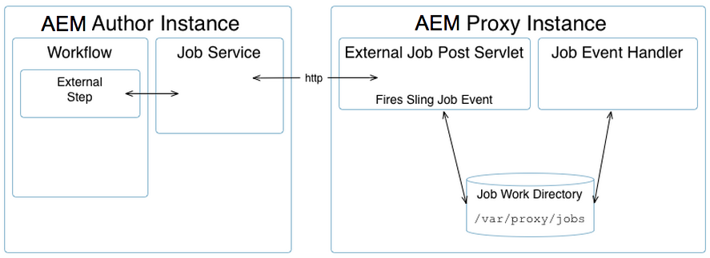
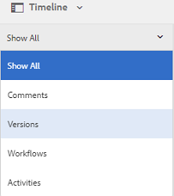

# 管理資產 {#manage-assets}

本文介紹如何在中管理和編輯資產 [!DNL Adobe Experience Manager Assets]。 管理 [!DNL Content Fragments]，請參閱 [[!DNL Content Fragments]](content-fragments/content-fragments.md) 資產。

## 建立檔案夾 {#creating-folders}

組織資產集合時，例如， `Nature` 影像，您可以建立資料夾以將它們保持在一起。 您可以使用資料夾對資產進行分類和組織。 [!DNL Experience Manager Assets] 不要求您組織資料夾中的資產以更好地工作。

>[!NOTE]
>
>* 共用類型的Assets資料夾 `sling:OrderedFolder`，共用到Experience Cloud時不受支援。 如果要共用資料夾，不要選擇 [!UICONTROL 已訂購] 建立資料夾時。
>* Experience Manager不允許使用 `subassets` word作為資料夾的名稱。 它是為包含複合資產子集的節點保留的關鍵字


1. 導航到要建立新資料夾的數字資產資料夾中的位置。 在菜單中，按一下 **[!UICONTROL 建立]**。 選擇 **[!UICONTROL 新建資料夾]**。
1. 在 **[!UICONTROL 標題]** 欄位，提供資料夾名稱。 預設情況下，DAM使用您提供的標題作為資料夾名稱。 建立資料夾後，可以覆蓋預設資料夾並指定另一個資料夾名稱。
1. 按一下&#x200B;**[!UICONTROL 建立]**。您的資料夾顯示在數字資產資料夾中。

不支援以下（以空格分隔的）字元清單：

* 資產檔案名不能包含以下任何字元： `* / : [ \\ ] | # % { } ? &`
* 資產資料夾名稱不能包含以下任何字元： `* / : [ \\ ] | # % { } ? \" . ^ ; + & \t`

## 上傳資產 {#uploading-assets}

請參閱 [將數字資產添加到Experience Manager](add-assets.md)。

## 檢測重複資產 {#detect-duplicate-assets}

<!-- TBD: This feature may not work as documented. See CQ-4283718. Get PM review done. -->

如果DAM用戶上載儲存庫中已存在的一個或多個資產， [!DNL Experience Manager] 檢測複製並通知用戶。 預設情況下禁用重複檢測，因為重複檢測可能會根據儲存庫的大小和上載的資產數量對效能產生影響。

要啟用功能：

1. 導航到 **[!UICONTROL 工具>資產>資產配置]**。

1. 按一下 **[!UICONTROL 資產複製檢測器]**。

1. 在 [!UICONTROL 「資產複製檢測器」頁]按一下 **[!UICONTROL 已啟用]**。

   `dam:sha1` 「檢測元資料」欄位的值可確保即使檔案名不同，也能檢測到重複的資產。

1. 按一下「**[!UICONTROL 儲存]**」。

   

>[!NOTE]
>
>如果已使用 `/apps/example/config.author/com.adobe.cq.assetcompute.impl.assetprocessor.AssetDuplicationDetector.cfg.json` 配置檔案（OSGi配置），您可以繼續使用它，但是，Adobe建議使用新方法。


啟用後，Experience Manager會將重複資產的通知發送到Experience Manager收件箱。 它是多個重複項的聚合結果。 用戶可以根據結果選擇刪除資產。


>[!NOTE]
>
>將資產上載到儲存庫時，Experience Manager會檢測重複，並通知您前100個重複資產。

## 預覽資產 {#previewing-assets}

要預覽資產，請執行以下步驟。

1. 從「資產」用戶介面定位至要預覽的資產的位置。
1. 點擊所需的資產以開啟它。

1. 在預覽模式下，縮放選項可用於 [支援的映像類型](/help/assets/file-format-support.md) （使用互動式編輯）。

   要放大資產，請點擊/按一下 `+` （或點擊/按一下資產上的放大鏡）。 要縮小，請點擊/按一下 `-`。 放大時，可以通過平移來仔細查看影像的任何區域。 重置縮放箭頭將您返回到原始視圖。

   點擊 **[!UICONTROL 重置]** 將視圖重置為原始大小。

## 編輯屬性 {#editing-properties}

1. 導航到要編輯其元資料的資產的位置。

1. 選擇資產，點擊/按一下 **[!UICONTROL 屬性]** 的子菜單。 或者，選擇 **[!UICONTROL 屬性]** 對資產卡執行快速操作。

   

1. 在 [!UICONTROL 屬性] 頁，編輯各個頁籤下的元資料屬性。 例如，在 **[!UICONTROL 基本]** 頁籤，編輯標題、說明等。

   >[!NOTE]
   >
   >佈局 [!UICONTROL 屬性] 頁和可用的元資料屬性取決於基礎元資料架構。 瞭解如何修改佈局 [!UICONTROL 屬性] 頁面，請參閱 [元資料架構](/help/assets/metadata-schemas.md)。

1. 若要排程啟動資產的特定日期/時間，請使用「準時」欄位旁的日 **[!UICONTROL 期選擇器]** 。

   

1. 要在特定持續時間後停用資產，請從位於 **[!UICONTROL 關機時間]** 的子菜單。 停用日期應晚於資產的激活日期。 在 [!UICONTROL 關機時間]，資產及其格式副本不能通過Assets Web介面或通過HTTP API訪問。

   

1. 在 **[!UICONTROL 標籤]** 的子菜單。 要添加自定義標籤，請在框中鍵入標籤名稱，然後選擇 `Enter` 按鈕 新標籤保存在 [!DNL Experience Manager]。

   YouTube要求發佈標籤，並且要有到YouTube的連結（如果找到合適的連結）。

   >[!NOTE]
   >
   >要建立標籤，您必須在 `/content/cq:tags/default` CRX儲存庫中的路徑。

1. 點擊/按一下 **[!UICONTROL 保存並關閉]**。

1. 定位至「資產」用戶介面。 已編輯的元資料屬性（包括標題、說明和標籤）顯示在資產卡的「卡」視圖和「清單」視圖中相關列的下方。

<!-- TBD: Uncomment after verification for Dec release.

## View asset usage and references {#usage-and-references}

[!DNL Experience Manager] lets you track statistics about usage of a digital asset. The usage statistics include the following:

    * Number of times the asset was viewed or downloaded
    * Channels/devices through which the asset was used
    * Creative solutions where the asset was recently used

To view usage statistics for an asset, in the [!UICONTROL Properties] page, click the **[!UICONTROL Insights]** tab. For more details, see [Assets Insights](assets-insights.md).

[!DNL Experience Manager] also lets you check all the incoming references to an asset, that is, the usage of an asset in remote [!DNL Sites] and in compound assets. Authors of webpages on [!DNL Experience Manager Sites] deployment can use an asset on a remote [!DNL Assets] deployment using the Connected Assets functionality. The [!UICONTROL References] tab in an asset's [!UICONTROL Properties] page lists the local and remote references of the asset. That is, the use of assets in compound assets in [!DNL Assets] and its use in remote [!DNL Sites] pages.

-->

## 複製資產 {#copying-assets}

複製資產或資料夾時，將複製整個資產或資料夾及其內容結構。 複製的資產或資料夾在目標位置重複。 源位置的資產不會更改。

不會結轉資產特定副本所特有的幾個屬性。 有些示例包括：

* 資產ID、建立日期和時間以及版本和版本歷史記錄。 這些屬性中的某些屬性由 `jcr:uuid`。 `jcr:created`, `cq:name`。

* 建立時間和引用的路徑對於每個資產及其每個格式副本都是唯一的。

保留其他屬性和元資料資訊。 複製資產時不建立部分副本。

1. 在「資產」UI中，選擇一個或多個資產，然後點擊/按一下 **[!UICONTROL 複製]** 的子菜單。 或者，選擇 **[!UICONTROL 複製]**  資產卡中的快速操作。

   >[!NOTE]
   >
   >如果使用 [!UICONTROL 複製] 快速操作，一次只能複製一個資產。

1. 定位至要複製資產的位置。

   >[!NOTE]
   >
   >如果複製同一地點的資產， [!DNL Experience Manager] 自動生成名稱的變體。 例如，如果複製標題為 `Square`。 [!DNL Experience Manager] 自動為其副本生成標題 `Square1`。

1. 按一下 **[!UICONTROL 貼上]** 表徵圖。 資產將複製到此位置。

   

   >[!NOTE]
   >
   >的 **[!UICONTROL 貼上]** 表徵圖在貼上操作完成之前在工具欄中可用。

### 移動或更名資產 {#moving-or-renaming-assets}

1. 定位至要移動的資產的位置。

1. 選擇資產，點擊/按一下 **[!UICONTROL 移動]** 表徵圖  的子菜單。

1. 在「移動資產」嚮導中，執行下列操作之一：

   * 指定移動資產後的資產名稱。 然後點擊/按一下 **[!UICONTROL 下一個]** 繼續。

   * 點擊/按一下 **[!UICONTROL 取消]** 來停止進程。
   >[!NOTE]
   >
   >* 如果在新位置沒有具有該名稱的資產，則可以為該資產指定相同的名稱。 但是，如果將資產移動到存在同名資產的位置，則應使用其他名稱。 如果使用相同的名稱，系統將自動生成名稱的變體。 例如，如果資產的名稱為Square，則系統會為其副本生成名稱Square1。
   >* 更名時，檔案名中不允許有空格。


1. 在 **[!UICONTROL 選擇目標]** 對話框，執行下列操作之一：

   * 導航到資產的新位置，然後點擊/按一下 **[!UICONTROL 下一個]** 繼續。

   * 點擊/按一下 **[!UICONTROL 後退]** 返回 **[!UICONTROL 更名]** 的上界。

1. 如果要移動的資產具有任何引用頁、資產或集合，則 **[!UICONTROL 調整參照]** 頁籤 **[!UICONTROL 選擇目標]** 頁籤。

   在 **[!UICONTROL 調整參照]** 螢幕：

   * 指定要根據新詳細資訊調整的參照，然後點擊/按一下 **[!UICONTROL 移動]** 繼續。

   * 從 **[!UICONTROL 調整]** 列，選擇/取消選擇對資產的引用。
   * 點擊/按一下 **[!UICONTROL 後退]** 返回 **[!UICONTROL 選擇目標]** 的上界。

   * 點擊/按一下 **[!UICONTROL 取消]** 來停止移動操作。

   如果不更新引用，則它們會繼續指向資產的上一路徑。 如果調整參照，則參照將更新為新資產路徑。

### 管理格式副本 {#managing-renditions}

1. 您可以添加或刪除資產的格式副本，但原始格式副本除外。 導航到要為其添加或刪除格式副本的資產的位置。

1. 點擊/按一下資產以開啟其資產頁。

   

1. 點擊/按一下GlobalNav表徵圖，然後選擇 **[!UICONTROL 格式副本]** 清單中。

   

1. 在 **[!UICONTROL 格式副本]** 面板，查看為資產生成的格式副本清單。

   

   >[!NOTE]
   >
   >預設情況下， [!DNL Experience Manager Assets] 不在預覽模式下顯示資產的原始格式副本。 如果您是管理員，則可以使用疊加來配置 [!DNL Assets] 在預覽模式下顯示原始格式副本。

1. 選擇要查看或刪除格式副本的格式副本。

   **刪除格式副本**

   從 **[!UICONTROL 格式副本]** ，然後點擊/按一下 **[!UICONTROL 刪除格式副本]** 的子菜單。 資產處理完成後，無法批量刪除格式副本。 對於單個資產，您可以從用戶介面手動刪除格式副本。 對於多個資產，您可以自定義 [!DNL Experience Manager] 刪除特定格式副本或刪除資產並重新上載已刪除的資產。

   

   **正在上載新格式副本**

   導覽至資產的資產詳細資訊頁面，然後點選/按一下工具列中的「新增轉譯 **** 」圖示，以上傳資產的新轉譯。

   

   >[!NOTE]
   >
   >如果您從「轉譯」面板選取轉譯 **** ，工具列會變更上下文，並僅顯示與轉譯相關的動作。不會顯示「上傳轉譯」圖示等選項。若要在工具列中檢視這些選項，請導覽至資產的詳細資訊頁面。

   您可以配置要顯示在影像或視頻資產詳細資訊頁面中的格式副本的尺寸。 根據您指定的維，Assets將顯示具有精確或最接近的維的格式副本。

   若要在資產詳細資料層級設定影像的轉譯尺寸，請覆蓋節 `renditionpicker` 點(`libs/dam/gui/content/assets/assetpage/jcr:content/body/content/content/items/assetdetail/items/col1/items/assetview/renditionpicker`)並設定width屬性的值。設定屬性大 **[!UICONTROL 小 (長) (KB]** )以取代寬度，以根據影像大小自訂資產詳細資料頁面上的轉譯。對於基於大小的定製，如果匹配的 `preferOriginal` 格式副本的大小大於原始格式副本的大小，則屬性會為原始格式副本指定首選項。

   同樣，可以通過疊加來定制「注釋」頁面影像 `libs/dam/gui/content/assets/annotate/jcr:content/body/content/content/items/content/renditionpicker`。

   

   要為視頻資產配置格式副本維，請導航到 `videopicker` CRX儲存庫中的節點 `/libs/dam/gui/content/assets/assetpage/jcr:content/body/content/content/items/assetdetail/items/col1/items/assetview/videopicker`，覆蓋節點，然後編輯相應的屬性。

   >[!NOTE]
   >
   >只有HTML5相容視頻格式的瀏覽器才支援視頻批注。 此外，根據瀏覽器的不同，支援不同的視頻格式。 但是，MXF視頻格式尚不支援視頻批注。

## 刪除資產 {#delete-assets}

要解析或刪除來自其他頁面的傳入引用，請在刪除資產之前更新相關引用。

此外，使用覆蓋禁用強制刪除按鈕，以禁止用戶刪除引用的資產和保留斷開的連結。

1. 瀏覽至您要刪除的資產所在的位置。

1. 選擇資產，然後按一下 **[!UICONTROL 刪除]**  的子菜單。

1. 在確認對話框中，按一下：

   * **[!UICONTROL 取消]** 停止操作
   * **[!UICONTROL 刪除]**&#x200B;來確認動作：

      * 如果資產沒有參考，則資產將被刪除。
      * 如果資產有引用，則會出現一條錯誤消息通知您 **[!UICONTROL 引用一個或多個資產]**。 您可以選取&#x200B;**[!UICONTROL 強制刪除]**&#x200B;或&#x200B;**[!UICONTROL 取消]**。

   >[!NOTE]
   >
   >要刪除資產，需要刪除大壩/資產的權限。 如果您僅具有修改權限，則只能編輯資產元資料並向資產添加註釋。 但是，不能刪除資產或其元資料。

   >[!NOTE]
   >
   >要解析或刪除來自其他頁面的傳入引用，請在刪除資產之前更新相關引用。 可以禁止刪除引用的資產，因為它會導致連結斷開。 使用覆蓋禁用強制刪除按鈕。

## 下載資產 {#download-assets}

請參閱 [下載資源 [!DNL Experience Manager]](/help/assets/download-assets-from-aem.md)。

## 發佈或取消發佈資產 {#publish-assets}

1. 導航到要發佈或要從發佈環境中刪除的資產或資產資料夾的位置（取消發佈）。

1. 選擇要發佈或取消發佈的資產或資料夾，然後選擇 **[!UICONTROL 管理發布]**  的子菜單。 或者，要快速發佈，請選擇 **[!UICONTROL 快速發佈]** 的子菜單。 如果要發佈的資料夾包含空資料夾，則不會發佈空資料夾。

1. 選擇 **[!UICONTROL 發佈]** 或 **[!UICONTROL 取消發佈]** 按鈕。

   
   *圖：發佈和取消發佈選項以及計畫選項。*

1. 選擇 **[!UICONTROL 現在]** 立即對資產採取行動或選擇 **[!UICONTROL 稍後]** 以安排操作。 如果選擇 **[!UICONTROL 稍後]** 的雙曲餘切值。 按一下&#x200B;**[!UICONTROL 下一步]**。

1. 發佈時，如果資產引用了其他資產，則其引用將在嚮導中列出。 只顯示自上次發佈後未發佈或修改的那些引用。 選擇要發佈的引用。

1. 取消發佈時，如果資產引用了其他資產，請選擇要取消發佈的引用。 按一下 **[!UICONTROL 取消發佈]**。 在確認對話框中，按一下 **[!UICONTROL 取消]** 停止操作或按一下 **[!UICONTROL 取消發佈]** 確認在指定日期將取消發佈資產。

瞭解與發佈或取消發佈資產或資料夾相關的以下限制和提示：

* 選擇 [!UICONTROL 管理發布] 僅對具有複製權限的用戶帳戶可用。
* 取消發佈複雜資產時，僅取消發佈該資產。 避免取消發佈引用，因為這些引用可能被其他已發佈資產引用。
* 未發佈空資料夾。
* 如果發佈正在處理的資產，則只發佈原始內容。 缺少格式副本。 等待處理完成，然後在處理完成後發佈或重新發佈資產。

## 已關閉用戶組 {#closed-user-group}

關閉的用戶組(CUG)用於限制對發佈自的特定資產資料夾的訪問權限 [!DNL Experience Manager]。 如果為資料夾建立CUG，則對資料夾（包括資料夾資產和子資料夾）的訪問將僅限於分配的成員或組。 要訪問資料夾，他們必須使用其安全憑據登錄。

CUG是限制訪問您資產的額外方法。 您還可以為資料夾配置登錄頁。

1. 從「資產」UI中選擇一個資料夾，然後點擊/按一下工具欄中的「屬性」表徵圖以顯示屬性頁。
1. 從 **[!UICONTROL 權限]** 頁籤，在 **[!UICONTROL 已關閉用戶組]**。

   

1. 要在用戶訪問資料夾時顯示登錄螢幕，請選擇 **[!UICONTROL 啟用]** 的雙曲餘切值。 然後，選擇登錄頁的路徑 [!DNL Experience Manager]，並保存更改。

   

   >[!NOTE]
   >
   >如果未指定登錄頁的路徑， [!DNL Experience Manager] 顯示發佈實例中的預設登錄頁。

1. 發佈資料夾，然後嘗試從發佈實例訪問該資料夾。 將顯示登錄螢幕。
1. 如果您是CUG成員，請輸入您的安全憑據。 資料夾顯示在 [!DNL Experience Manager] 驗證你的身份。

## 搜尋資產 {#search-assets}

搜索資產是數字資產管理系統使用的核心 — 無論是供創意人員進一步使用、供商業用戶和營銷人員對資產進行穩健管理，還是供DAM管理員管理。

有關簡單、高級和自定義搜索以發現和使用最合適的資產，請參見 [搜索資產 [!DNL Experience Manager]](/help/assets/search-assets.md)。

## 快速操作 {#quick-actions}

一次只有一個資產的快速動作圖示可用。根據您的設備，執行以下操作以顯示快速操作表徵圖：

* 觸摸設備：摸摸摸。 例如，在iPad上，您可以點擊並保留一個資產，以便顯示快速操作。
* 非接觸設備：懸停指針。 例如，在案頭設備上，如果將指針懸停在資產縮略圖上，則會顯示快速操作欄。

<!-- Hiding this topic via cqdoc-18707

## Edit images {#editing-images}

The editing tools in the [!DNL Experience Manager Assets] interface let you perform small editing jobs on image assets. You can crop, rotate, flip, and perform other editing jobs on images. You can also add image maps to assets.

>[!NOTE]
>
>For some components, the Full Screen mode has additional options available.

1. Do one of the following to open an asset in edit mode:

    * Select the asset and then click/tap the **[!UICONTROL Edit]** icon in the toolbar.
    * Tap/click the **[!UICONTROL Edit]** icon that appears on an asset in the Card view.
    * In the asset page, tap/click the **[!UICONTROL Edit]** icon in the toolbar.

   

1. To crop the image, tap/click the **Crop** icon.

   

1. Select the desired option from the list. The crop area appears on the image based on the option you choose. The **Free Hand** option lets you crop the image without any aspect ratio restrictions.

   

1. Select the area to be cropped, and resize or reposition it on the image.
1. Use the **Finish** icon (top right corner) to crop the image. Clicking the **Finish** icon also triggers the regeneration of renditions.

   

1. Use the **Undo** and **Redo** icons on the top right to revert to the uncropped image or retain the cropped image, respectively.

   

1. Tap/click the appropriate Rotate icon to rotate the image clockwise or anti-clockwise.

   

1. Tap/click the appropriate Flip icon to flip the image horizontally or vertically.

   

1. Tap/click the **Finish** icon to save the changes.

   

>[!NOTE]
>
>Image editing is supported for BMP, GIF, PNG, and JPEG files formats.

>[!NOTE]
>
>To edit a TXT file, set **Day CQ Link Externalizer** from Configuration Manager.
-->

## 時間軸 {#timeline}

時間軸允許您查看選定項的各種事件，如資產的活動工作流、注釋/注釋、活動日誌和版本。


*圖：對資產的時間表條目排序*

>[!NOTE]
>
>在 [集合控制台](/help/assets/manage-collections.md#navigate-the-collections-console)，也請參見Wiki頁。 **[!UICONTROL 全部顯示]** 清單提供了僅查看注釋和工作流的選項。 此外，時間線僅顯示在控制台中列出的頂級集合。 如果在任何集合內部導航，則不顯示它。

>[!NOTE]
>
>時間軸包含若干 [特定於內容片段的選項](content-fragments/content-fragments.md)。

## 注釋資產 {#annotating}

注釋是添加到影像或視頻中的注釋或解釋性注釋。 注釋使營銷人員能夠協作並保留有關資產的反饋。

只有相容HTML5的視頻格式的瀏覽器才支援視頻注釋。 Assets支援的視頻格式取決於瀏覽器。 但是，MXF視頻格式尚不支援視頻批注。

>[!NOTE]
>
>對於內容片段， [注釋在片段編輯器中建立](content-fragments/content-fragments.md)。

1. 導航到要添加註釋的資產的位置。
1. 點擊/按一下 **[!UICONTROL 注釋]** 表徵圖：

   * [快速操作](#quick-actions)
   * 在選擇資產或導航到資產頁後從工具欄

   

1. 在時間軸底部的 **[!UICONTROL 「注釋]** 」方塊中新增注釋。或者，在影像上標籤一個區域，並在「添加註釋」( **[!UICONTROL Add Annotation]** )對話框中添加註釋。

   

<!--
1. To notify a user about an annotation, specify the email address of the user and add the comment. For example, to notify Aaron MacDonald about an annotation, enter @aa. Hints for all matching users is displayed in a list. Select Aaron's email address from the list to tag her with the comment. Similarly, you can tag more users anywhere within the annotation or before or after it.
-->

>[!NOTE]
>
>對於非管理員用戶，僅當用戶具有以下位置的讀取權限時才會顯示建議 `/home` 在CRXDE中。


1. 添加註釋後，按一下 **[!UICONTROL 添加]** 來拯救它。 注釋的通知將發送給Aaron。

   

   >[!NOTE]
   >
   >在保存多個注釋之前，可以添加它們。

1. 點擊/按一下 **[!UICONTROL 關閉]** 的子菜單。
1. 要查看通知，請使用Aaron MacDonald的憑據登錄到Assets，然後按一下 **[!UICONTROL 通知]** 表徵圖。

   >[!NOTE]
   >
   >注釋也可以添加到視頻資產中。 在注釋視頻時，播放器會暫停以允許您在框架上進行注釋。 有關詳細資訊，請參閱 [管理視頻資產](manage-video-assets.md)。 但是，MXF視頻格式尚不支援視頻批注。

1. 要選擇不同的顏色以便能夠區分用戶，請按一下/點擊「配置檔案」表徵圖，然後按一下/點擊 **[!UICONTROL 我的首選項]**。

   

   在「注釋顏色」( **[!UICONTROL Annotation Color)框中指定所要的顏色]** ，然後按一下/點選「 **[!UICONTROL 接受」(Accept]**)。

   

>[!NOTE]
>
>也可向集合添加註釋。 但是，如果集合包含子集合，則只能向父集合添加註釋/注釋。 「注釋」(Annotate)選項不可用於子集合。

### 查看保存的注釋 {#viewing-saved-annotations}

一次只能查看一個批注。

>[!NOTE]
>
>如果要選擇多個注釋，則最新注釋將在用戶介面上可見。
>
>只支援將注釋的資產打印為PDF。

1. 要查看資產的已保存注釋，請定位至資產的位置並開啟資產的資產頁。

1. 點擊/按一下GlobalNav表徵圖，然後選擇 **[!UICONTROL 時間軸]** 清單中。

   

1. 從時間軸 **[!UICONTROL 的「顯示全部]** 」清單中，選取「注 **[!UICONTROL 釋]** 」以根據註解來篩選結果。

   

   點擊/按一下 **[!UICONTROL 時間軸]** 的子菜單。

   

   點擊/按一下 **[!UICONTROL 刪除]**，刪除特定注釋。

### 打印注釋 {#printing-annotations}

如果資產具有批注或已經受到審閱工作流的影響，則可以將資產連同批注和審閱狀態打印為PDF檔案，以便離線審閱。

也可以選擇僅打印注釋或審閱狀態。

>[!NOTE]
>
>在將注釋的資產打印為PDF時，可以選擇多個注釋。

要打印注釋和審閱狀態，請點擊/按一下 **[!UICONTROL 打印]** 表徵圖，並按照嚮導中的說明進行操作。 的 **[!UICONTROL 打印]** 表徵圖僅在資產至少分配了一個注釋或審閱狀態時才出現在工具欄中。

1. 從資產UI中，開啟資產的預覽頁。
1. 執行下列任一項作業：

   * 要打印所有注釋和審閱狀態，請跳過步驟3並直接轉到步驟4。
   * 要打印特定注釋和審閱狀態，請開啟 [時間](/help/assets/manage-digital-assets.md#timeline) 然後轉到步驟3。

1. 要打印特定注釋，請從時間軸中選擇注釋。

   

   要僅打印審閱狀態，請從時間軸中選擇它。

   

1. 點擊/按一下 **[!UICONTROL 打印]** 的子菜單。

   

1. 從「打印」對話框中，選擇要在PDF上顯示注釋/審閱狀態的位置。 例如，如果希望在包含打印影像的頁面的右上角打印注釋/狀態，請使用 **左上** 的子菜單。 預設情況下，它處於選中狀態。

   

   您可以根據要在打印的PDF中顯示注釋/狀態的位置選擇其他設定。如果您希望註解/狀態顯示在與印刷資產不同的頁面中，請選擇「下 **[!UICONTROL 一頁」]**。

1. 按一下 **[!UICONTROL 打印]**。 根據您在步驟2中選擇的選項，產生的PDF會在指定位置顯示註解/狀態。例如，如果您選擇使用左上角設定打印注釋和審閱狀態 **** ，則生成的輸出類似於此處所示的PDF檔案。

   

1. 使用右上角的選項下載或打印PDF。

   

   要修改呈現的PDF檔案的外觀，例如注釋和狀態的字型顏色、大小和樣式、背景顏色，請開啟 **[!UICONTROL 注釋PDF配置]** 從Configuration Manager中，修改所需選項。 例如，要更改批准狀態的顯示顏色，請修改相應欄位中的顏色代碼。 有關更改批注字型顏色的資訊，請參見 [注釋](/help/assets/manage-digital-assets.md#annotating)。

   返回到呈現的PDF檔案並刷新它。 刷新PDF反映您所做的更改。

## 資產版本設定 {#asset-versioning}

版本設定會建立數位資產在特定時間點的快照。版本控制可幫助將資產恢復到以後的狀態。 例如，如果要撤消對資產所做的更改，請恢復資產的未編輯版本。

以下是建立版本的方案：

* 您可以修改不同應用程式中的映像並上載到資產。 建立映像的版本，以便不覆蓋原始映像。
* 可編輯資產的元資料。
* 您使用 [!DNL Experience Manager] 案頭應用程式，以簽出現有資產並保存更改。 每次保存資產時都會建立新版本。

您還可以通過工作流啟用自動版本控制。 為資產建立版本時，元資料和格式副本會隨版本一起保存。 格式副本是相同影像的替代選項，例如，上載的JPEG檔案的PNG格式副本。

版本控制功能允許您執行以下操作：

* 建立資產版本。
* 查看資產的當前修訂。
* 將資產還原到以前的版本。

1. 導航到要為其建立版本的資產的位置，然後點擊/按一下它以開啟其資產頁。

1. 點擊/按一下GlobalNav表徵圖，然後選擇 **[!UICONTROL 時間軸]** 的子菜單。

   

1. 點擊/按一下 **[!UICONTROL 操作]** （箭頭）表徵圖，查看可對資產執行的可用操作。

   

1. 點擊/按一下 **[!UICONTROL 另存為版本]** 建立資產版本。

   

1. 添加標籤和注釋，然後按一下 **[!UICONTROL 建立]** 的子菜單。 或者，點擊/按一下 **取消** 的子菜單。

   

1. 若要檢視新版本，請從資產詳細資 **[!UICONTROL 訊頁面或資產UI開啟時間軸中的「顯示全部]** 」清單，然後選擇「版 **[!UICONTROL 本」]**。為資產建立的所有版本都會列在時間軸標籤下。您可以按一下下拉箭頭並從清單中選取「版本」，篩選清單以顯 **[!UICONTROL 示「版本]** 」。

   

1. 為資產選擇特定版本以預覽它，或使其顯示在資產UI中。

   

1. 為要還原到資產UI中特定版本的版本添加標籤和注釋。

   

1. 若要產生版本的預覽，請點選/按一下「預 **[!UICONTROL 覽版本」]**。
1. 要在資產UI中顯示此版本，請選擇 **[!UICONTROL 還原到此版本]**。
1. 要比較兩個版本，請轉到資產的資產頁面，點擊/按一下要與當前版本進行比較的版本。

   

1. 從時間軸中，選擇要比較的版本並將滑塊拖到左側，以將此版本疊加到當前版本上並進行比較。

   

### 啟動資產的工作流 {#starting-a-workflow-on-an-asset}

1. 定位至要為其啟動工作流的資產的位置，然後點擊/按一下該資產以開啟資產頁。
1. 點擊/按一下GlobalNav表徵圖，然後選擇 **[!UICONTROL 時間軸]** 的子菜單。

   

1. 點擊/按一下 **[!UICONTROL 操作]** （箭頭）表徵圖，開啟可用於資產的操作清單。

   

1. 點擊/按一下 **[!UICONTROL 啟動工作流]** 清單中。

   

1. 在 **[!UICONTROL 啟動工作流]** 對話框，從清單中選擇工作流模型。

   

1. （可選）指定工作流的標題，該標題可用於引用工作流實例。

   

1. 點選/按一 **[!UICONTROL 下「開始]** 」，然後點選/按一下對話 **[!UICONTROL 方塊中的「繼續]** 」以進行確認。工作流程的每個步驟都會以事件的形式顯示在時間軸中。

   

## 集合 {#collections}

集合是一組已訂購的資產。 使用集合在用戶之間共用資產。

* 集合可以包括來自不同位置的資產，因為它們只包含對這些資產的引用。 每個集合都維護資產的參照完整性。
* 您可以與具有不同權限級別的多個用戶共用集合，包括編輯、查看等。

要瞭解集合管理的詳細資訊，請參閱 [管理集合](/help/assets/manage-collections.md)。

## 在案頭應用或Adobe資產連結中查看資產時隱藏過期資產 {#hide-expired-assets-via-acp-api}

[!DNL Experience Manager] 案頭應用允許從Windows或Mac案頭訪問DAM儲存庫。 Adobe資產連結允許從受支援的 [!DNL Creative Cloud] 案頭應用程式。

從內部瀏覽資產時 [!DNL Experience Manager] 用戶介面，不顯示過期資產。 為防止在從案頭應用程式和資產連結瀏覽資產時查看、搜索和獲取過期資產，管理員可以執行以下配置。 該配置適用於所有用戶，而與管理員權限無關。

執行以下CURL命令。 確保讀取訪問 `/conf/global/settings/dam/acpapi/` 訪問資產的用戶。 屬於 `dam-user` 預設情況下，組具有權限。

```curl
curl -v -u admin:admin --location --request POST 'http://localhost:4502/conf/global/settings/dam/acpapi/configuration/_jcr_content' \
--header 'Content-Type: application/x-www-form-urlencoded' \
--data-urlencode 'jcr:title=acpapiconfig' \
--data-urlencode 'hideExpiredAssets=true' \
--data-urlencode 'hideExpiredAssets@TypeHint=Boolean' \
--data-urlencode 'jcr:primaryType=nt:unstructured' \
--data-urlencode '../../jcr:primaryType=sling:Folder'
```

要瞭解更多資訊，請瞭解如何 [使用案頭應用瀏覽DAM資產](https://experienceleague.adobe.com/docs/experience-manager-desktop-app/using/using.html#browse-search-preview-assets) 和 [如何使用Adobe資產連結](https://helpx.adobe.com/enterprise/admin-guide.html/enterprise/using/manage-assets-using-adobe-asset-link.ug.html)。
