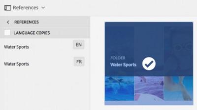

# 管理複合資產 {#managing-compound-assets}

Adobe Experience Manager(AEM)資產可識別已上傳的檔案是否包含對儲存庫中已存在資產的參考。 此功能僅適用於支援的檔案格式。 如果已上傳的資產包含任何AEM資產的參考，則會在已上傳和參考的資產之間建立雙向連結。

除了消除冗餘外，在Adobe Creative cloud應用程式中參考AEM資產可增強協同作業，並提高使用者的效率和生產力。

AEM Assets支援雙 **向參照**。 您可以在已上傳檔案的資產詳細資料頁面中找到參考的資產。 此外，您也可以在參考資產的資產詳細資料頁面中，檢視AEM資產的參考檔案。

參考會根據參考資產的路徑、檔案ID和例項ID來解析。

## 在Adobe Illustrator中新增AEM Assets做為參考 {#refai}

您可以從Adobe Illustrator檔案中參考現有的AEM資產。

1. 使用 [AEM案頭應用程式](https://docs.adobe.com/content/help/en/experience-manager-desktop-app/using/using.html)，將AEM Assets存放庫載入本機電腦上的磁碟機。 在掛載的驅動器中，導航到要引用的資產的位置。
1. 將資產從已掛載的磁碟機拖曳至Illustrator檔案。
1. 將Illustrator檔案儲存至已載入的磁碟機，或 [上傳](/help/assets/manage-digital-assets.md#uploading-assets) 至AEM儲存庫。
1. 工作流程完成後，請前往資產的資產詳細資訊頁面。 現有AEM資產的參考會列在「參考」(References) **欄的** 「相依性」( **Dependencies** )下。

   

1. 出現在「相依性」( **Dependiences** )下的引用資產也可由當前相對檔案引用。 要查看資產的引用檔案清單，請按一下「相關性」( **Dependencies)下的資產**。

   

1. 按一下工 **具欄中的** 「查看屬性」表徵圖。 在「屬性」頁中，引用當前資產的檔案清單會出現在「基本」( **Basic** )頁籤的「參 **考** 」(References)列下。

   

## 在Adobe inDesign中新增AEM資產作為參考 {#add-aem-assets-as-references-in-adobe-indesign}

若要從InDesign檔案中參考AEM資產，請將AEM資產拖曳至InDesign檔案，或將InDesign檔案匯出為ZIP檔案。

AEM Assets中已存在參考的資產。 <!-- You can extract subassets by [configuring InDesign server](/help/assets/indesign.md). Embedded assets in an InDesign file are extracted as subassets. -->

>[!NOTE]
>
>如果InDesign伺服器已代理，InDesign檔案的預覽會內嵌在其XMP中繼資料中。 在這種情況下，不明確需要擷取縮圖。 不過，如果InDesign伺服器未代理，則必須明確擷取InDesign檔案的縮圖。

### 拖曳AEM資產以建立參考 {#create-references-by-dragging-aem-assets}

此程式類似於在Adobe Illustrator [中新增AEM資產作為參考](#refai)。

### 匯出ZIP檔案以建立AEM資產的參考 {#create-references-to-aem-assets-by-exporting-a-zip-file}

1. 建立新的工作流程模型。
1. 使用Adobe inDesign的「封裝」功能來匯出檔案。
Adobe inDesign可將檔案和連結的資產匯出為套件。 在這種情況下，匯出的檔案夾包含InDesign檔案中包含子資產的「連結」檔案夾。
1. 建立ZIP檔案並上傳至AEM儲存庫。
1. 啟動「取消存檔器」工作流。
1. 當工作流程完成時，「連結」檔案夾中的參照會自動參照為子資產。 若要檢視參考資產的清單，請導覽至InDesign資產的資產詳細資訊頁面，然後關閉 [邊欄](/help/sites-cloud/authoring/getting-started/basic-handling.md#rail-selector)。

## 在Adobe Photoshop中新增AEM資產作為參考 {#refps}

1. 使用WebDav用戶端，將AEM Assets裝載為磁碟機。
1. 若要在Photoshop檔案中建立AEM資產的參考，請使用Photoshop的「置入」連結功能，導覽至已載入磁碟機中的對應資產。

   

1. 將Photoshop檔案儲存至已載入的磁碟機，或 [上傳](/help/assets/manage-digital-assets.md#uploading-assets) 至AEM儲存庫。
1. 工作流程完成後，現有AEM資產的參考會列在資產詳細資料頁面中。

   若要檢視參考的資產，請關閉 [資產詳細資](/help/sites-cloud/authoring/getting-started/basic-handling.md#rail-selector) 料頁面中的邊欄。

1. 參考的資產也包含其參考的資產清單。 若要檢視參考資產的清單，請導覽至資產詳細資料頁面並關閉邊 [欄](/help/sites-cloud/authoring/getting-started/basic-handling.md#rail-selector)。

>[!NOTE]
>
>複合資產中的資產也可以根據其檔案ID和例項ID加以參考。 此功能僅適用於Adobe Illustrator和Adobe Photoshop版本。 對其他人而言，參照是以主要複合資產中連結資產的相對路徑為基礎，就像在舊版AEM中一樣。

## 檢視多頁檔案的頁面 {#view-pages-of-a-multi-page-file}

AEM Assets的「頁面檢視器」功能可讓您檢視多頁檔案的個別頁面，包括PDF、INDD、PPT、PPTX和Ai檔案。 若是InDesign，您可以使用InDesign伺服器擷取頁面。 如果在InDesign檔案建立期間儲存了頁面預覽，則頁面擷取不需要InDesign Server。

您可以從資產頁面瀏覽檔案的個別頁面。 您可以使用工具列中的選項，為檔案的個別頁面加上註解。 您也可以使用「頁 **面概述** 」選項來同時檢視所有頁面。

1. 導覽至AEM Assets中包含多頁檔案的檔案夾。
1. 按一下資產以檢視其資產頁面。

   

1. 按一下「全域導覽」圖示，然後從選 **單中選** 擇「頁面」。

   

1. 按一下影像下方的向左或向右箭頭，以導覽至檔案的個別頁面。

   

1. 若要註解頁面，請按一下工 **具列中的** 「註解」圖示並新增註解。

   

1. 若要下載檔案，請按一下「下 **載** 」圖示。

   

1. 若要同時檢視檔案的所有頁面，請按一下「頁 **面概述** 」圖示。

   

1. 若要檢視檔案的活動串流，包括註解和下載，請按一下「全域導覽」圖示，然後從選單選擇「 **時間軸** 」。

   

1. 要查看和編輯頁面的元資料屬性，請按一下工 **具欄中的** 「查看屬性」表徵圖。

   
