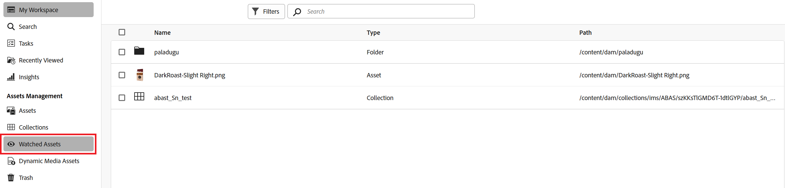

# 查看資產、資料夾和集合 {#watch-assets-folders}

Assets檢視通知可讓您監視對存放庫中可用的資產、資料夾或集合執行的操作。 您需要選取並訂閱將通知傳送給您的內容。您還可以配置通知發送給您的類別。

## 訂閱通知類別 {#subscribe-to-notification-categories}

您可以從類別清單中選擇並訂閱要接收通知的類別。 Assets檢視只會針對您從可用選項中選擇的類別向您傳送通知：

<table>
    <tbody>
     <tr>
      <th><strong>通知類別</strong></th>
      <th><strong>說明</strong></th>
     </tr>
     <tr>
      <td>請求</td>
      <td>將任務分配給用戶時，當該用戶對該任務執行了操作時，您會收到通知。</td>
     </tr>
     <tr>
      <td>分配給我</td>
      <td>當有任務從其他用戶分配給您時，您會收到通知。</td>
     </tr>
     <tr>
      <td>對訂閱內容的注釋</td>
      <td>當用戶對您的訂閱資產發表評論時，您會收到通知。</td>
     </tr>
     <tr>
      <td>刪除訂閱的內容</td>
      <td>當用戶刪除您訂閱的資產、資料夾或集合時，您會收到通知。</td>
     </tr>
     <tr>
      <td>訂閱內容的外部共用</td>
      <td>當用戶為您訂閱的資產、資料夾或集合生成公共連結時，您會收到通知。</td>
     </tr>
     <tr>
      <td>修改訂閱內容</td>
      <td>當用戶為您的訂閱資產建立新版本時，您會收到通知。</td>
     </tr>
     <tr>
      <td>移動/更名訂閱內容</td>
      <td>當用戶移動或更名您訂閱的資產或資料夾時，您會收到通知。</td>
     </tr>
     <tr>
      <td>訂閱資料夾和集合的更新</td>
      <td>當用戶新增或從訂閱資料夾或集合中移除資產時，您會收到通知。</td>
     </tr>    
    </tbody>
   </table>

要訂閱通知類別，請執行以下操作：

1. 在Assets檢視使用者介面的功能表列右端，按一下。

1. 按一下  的 [!UICONTROL Experience Cloud首選項] 的子選單。

1. 按一下 **[!UICONTROL 通知]** 的子選單。

1. 在&#x200B;**[!UICONTROL 通知]**&#x200B;區段中，導覽至[!UICONTROL Assets檢視]區段，並確定切換選項已切換至「開啟」狀態。

   Assets檢視中的

1. 按一下 **[!UICONTROL 自定義]** 的子選單。
   Assets檢視中的

1. 選擇需要通知的通知類別。

## 監視和取消監視資料夾、資產或集合 {#watch-unwatch-assets}

您可以監視和取消監視資料夾、資產或收藏集，以隨時掌握資訊，從而就您正在監視的資產實現更好的共同作業。

[訂閱通知類別](#subscribe-to-notification-categories)之後，您必須訂閱內容才能開始接收通知。

>[!NOTE]
>
>* 對於 **[!UICONTROL 請求]** 和 **[!UICONTROL 分配給我]** 通知類別，您在訂閱通知類別後不需要訂閱內容。 系統會在您建立的請求以及將任務分配給您時，自動將通知發送給您。
>* Assets檢視只會在其他使用者對訂閱內容執行動作時傳送通知。 對於您對訂閱內容執行的操作，您不會收到通知。

### 訂閱內容 {#subscribe-to-content}

請依照下列步驟訂閱資料夾、資產或集合：

1. 瀏覽您要訂閱的資料夾、資產或集合，然後按一下&#x200B;**[!UICONTROL 監視]**。

1. Assets檢視會顯示成功訊息。 您可以在成功訊息中按一下&#x200B;**[!UICONTROL 前往通知偏好設定]**，以編輯通知類別的[訂閱](#subscribe-to-notification-categories)。

   Assets檢視中的

Assets檢視現在會傳送訂閱類別的通知。 您還可以選擇多個資產、資料夾或集合，然後按一下 **[!UICONTROL 監視]** 來節省時間。 但是，如果您選取多個專案且有部分專案已訂閱，將不會顯示&#x200B;**[!UICONTROL 監視]**&#x200B;選項。

### 檢視訂閱內容 {#view-subscribed-content}

若要檢視您的訂閱內容，請依照下列步驟進行：

1. 導覽至&#x200B;**[!UICONTROL 資產管理]**&#x200B;下的[!UICONTROL Watched Assets]。

1. Assets檢視會顯示訂閱資產的清單，包括其名稱、型別和路徑。 從清單中選取資產、資料夾或集合，以檢視其詳細資訊、位置或[取消訂閱](#unsubscribe-to-content)。

   

### 檢視內容訂閱者 {#view-content-subscribers}

若要檢視您的內容訂閱者，請依照下列步驟進行：

1. 瀏覽資料夾、資產或集合，然後選取&#x200B;**[!UICONTROL 詳細資料]**。

1. 從右窗格按一下以檢視內容觀察者清單。

   或者，按一下右窗格上的以檢視內容觀看者。

### 取消訂閱內容 {#unsubscribe-to-content}

若要取消訂閱：

1. 移至&#x200B;**[!UICONTROL 資產管理]**&#x200B;下的[!UICONTROL Watched Assets]。

1. 選取您要取消訂閱的資產、資料夾或集合，然後按一下&#x200B;**[!UICONTROL 取消監視]**。

   

或者，在[!UICONTROL 資產管理]下瀏覽資料夾、資產或集合。 選取[訂閱的資產](#subscribe-to-content)並按一下&#x200B;**[!UICONTROL 取消觀看]**。

## 查看通知 {#view-notifications}

通知會顯示在Assets檢視使用者介面的功能表列的右端。

Assets檢視中的

當您按一下通知時，Assets檢視會將您導覽至通知中參照的適當資產或資料夾。
