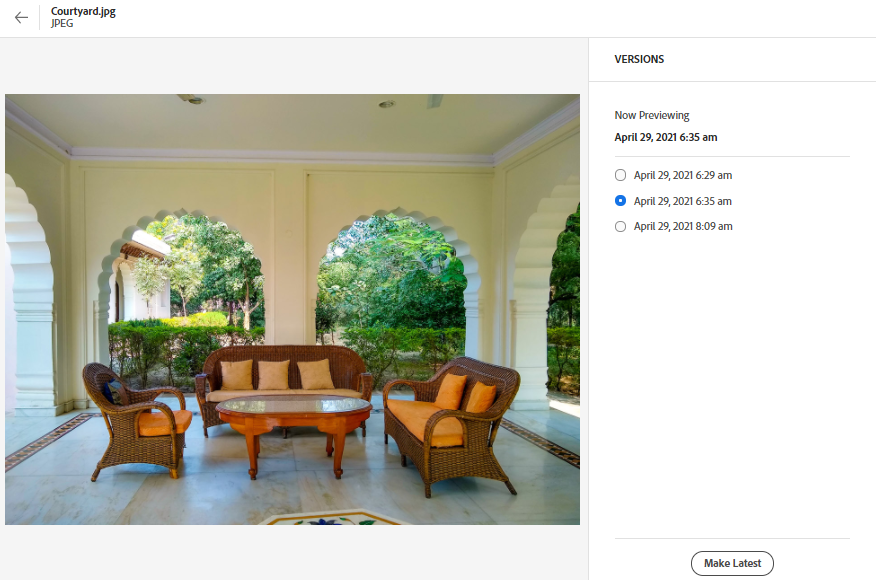

# 管理資產 {#manage-assets}

您可以使用 [!DNL Assets view] 的人性化介面，輕鬆進行各種數位資產管理 (DAM) 任務。新增資產後，即可搜尋、下載、移動、複製、重新命名、刪除、更新和編輯您的資產。

使用 [!DNL Assets view] 完成下列資產管理任務。選取資產時，下列選項會在頂部的工具列中顯示。

*圖：在選取影像的工具列中可用的選項。*

*  取消選取。

* ：根據中繼資料和智慧標記在 Assets UI 中尋找類似影像資產。

*  按一下以預覽資產和檢視詳細的中繼資料。預覽時，您可以檢視版本和編輯影像。

*  將選取的資產下載到您的本機檔案系統。

* ：將所選資產新增到集合中。

*  將資產釘選到快速存取，以便需要時能快速存取。所有釘選的項目都顯示在「我的工作區」的&#x200B;**快速存取**&#x200B;部分。

*  到 Adobe Experience Manager Assets 畫面的整合 Adobe Express 中編輯影像。

*  使用 Adobe Express 編輯影像。

* ，與其他使用者共用資產，以便他們存取和下載。

*  刪除選取的資產或檔案夾。

*  複製選取的檔案或資料夾。

*  將選取的資產或資料夾移至存放庫階層中不同的位置。

*  重新命名選取的資產或資料夾。請使用唯一名稱，否則重新命名動作會失敗並出現警告。您可以使用新的名稱再試。
此外，您可以按一下資產或資料夾的標題來重新命名。在&#x200B;**重新命名資產**&#x200B;文字方塊中提及新文字，然後按一下&#x200B;**儲存**。此功能可在格線、圖庫、瀑布和清單等檢視中使用。

*  [!UICONTROL 瀑布檢視]。

*  將資產新增至資料庫。

*  指派任務給其他使用者，以在資產上共同作業。

*  監控對資產執行的操作。

您可以在資產縮圖上檢視相同選項。

[!DNL Assets view] 只會在工具列中根據選取的資產類型，顯示相關的選項。

*圖：在選取資料夾的工具列中可用的選項。*

*圖：在選取 PDF 檔案的工具列中可用的選項。*

## 下載和散發資產 {#download}

您可以選取一個或更多資產或資料夾或兩者的組合，然後將選取項目下載到您的本機檔案系統。您可以再次編輯資產和上傳或在 [!DNL Assets view] 外部散發資產。 您也可以[下載資產的轉譯](/help/assets/add-delete-assets-view.md#renditions)。

## 資產版本設定 {#versions-of-assets}

<!-- 
TBD: query for engineering: How many versions are maintained. What happens when we reach that limit? Are old versions automatically removed? -->

再次上傳已上傳或編輯的資產時，[!DNL Assets view] 便會對資產進行版本設定。您可以檢視版本記錄、先前的版本，並可以將資產先前的版本還原成最新版本 (必要時回復至先前的版本)。資產版本會在以下情況中建立：

* 上傳新資產時，新資產的檔案名稱跟現有的資產相同，以及所在的資料夾跟現有的資產相同。[!DNL Assets view] 會提示覆寫先前的資產，或將新資產另存新版本。請參閱[上傳重複資產](/help/assets/add-delete-assets-view.md)。

  

  *圖：上傳名稱與現有資產名稱相同的資產時，您可以建立該資產的版本。*

* 編輯影像然後按一下「**[!UICONTROL 另存新版本]**」。請參閱[編輯影像](/help/assets/edit-images-assets-view.md)。

  

  *圖：將編輯的影像另存新版本。*

* 開啟現有資產的版本。按一下「**[!UICONTROL 新版本]**」，然後上傳存放庫中較新版本的資產。

  

### 檢視和比較資產的版本 {#view-and-compare-versions}

上傳資產的重複復本或修改復本，以建立其版本。 版本設定功能可讓您追蹤資產在一段時間內的修改並在需要時還原成先前的版本。

若要檢視和比較版本：

1. 導覽至資產的詳細資訊頁面。
1. 按一下右窗格中的以顯示&#x200B;**[!UICONTROL 版本]**&#x200B;面板。 原始資產的縮圖及其上傳的版本會顯示在此面板上。
1. 在面板上選取版本，以在預覽區域中預覽。
1. 選取最新版本以外的任何版本，然後按一下&#x200B;**[!UICONTROL 設定為最新版本]**，將其設定為最新版本。
1. 將預覽中的滑桿向左和向右拖移，在單一預覽中快速檢視選取的影像版本及其最新版本。 這可讓您快速比較選取的影像版本與最新版本。

   >[!NOTE]
   >
   > 僅針對影像資產啟用版本比較。

   

<!-- old content
To view versions, open an asset's preview and click **[!UICONTROL Versions]**  from the right sidebar. To preview a specific version, select it. To revert to it, click **[!UICONTROL Make Latest]**. 
-->

選取最新版本，然後按一下&#x200B;**[!UICONTROL 新版本]**，從您的本機檔案系統上傳該資產的新復本，以建立資產版本。

<!-- old content
You can also create versions from the versions timeline. Select the latest version, click **[!UICONTROL New Version]**, and upload a new copy of the asset from your local file system.

*Figure: View versions of an asset, revert to a previous version, or upload another new version.* 
-->

## 管理資產狀態 {#manage-asset-status}

**需要的權限：**`Can Edit`、`Owner` 或資產的管理員權限。

Assets檢視可讓您對存放庫中可用的資產設定狀態。 設定資產狀態以將數位資產的下游消費控管和管理得更好。

您可以在資產上設定下列狀態：

* 已核准

* 已拒絕

* 無狀態

### 設定資產狀態 {#set-asset-status}

若要設定資產狀態：

1. 選取該資產，然後按一下工具列中的「**[!UICONTROL 詳細資料]**」。

1. 在&#x200B;**[!UICONTROL 基本]**&#x200B;索引標籤中，從&#x200B;**[!UICONTROL 狀態]**&#x200B;下拉式清單中選取資產狀態。 可能的值包括「已核准」、「已拒絕」以及「無狀態」(預設)。
如果您為環境佈建了具有 OpenAPI 功能的 Dynamic Media，則在您將資產標記為 `Approved` 時，Experience Manager Assets 會立即產生一個公用 URL。

   >[!VIDEO](https://video.tv.adobe.com/v/342495)

### 設定核准目標 {#set-approval-target}

Assets檢視可讓您根據您在「資產詳細資料」頁面上的&#x200B;**核准目標**&#x200B;欄位中設定的值，使用OpenAPI功能、Content Hub或兩者將已核准的資產發佈到Dynamic Media。

若要設定核准目標：

1. 選取該資產，然後按一下工具列中的「**[!UICONTROL 詳細資料]**」。

1. 在&#x200B;**[!UICONTROL 基本]**&#x200B;索引標籤中，從&#x200B;**[!UICONTROL 狀態]**&#x200B;下拉式清單中選取資產狀態。 可能的值包括「已核准」、「已拒絕」以及「無狀態」(預設)。

1. 如果您在步驟2中選取&#x200B;**已核准**，請選取核准目標。 可能的值包括「傳送」和「Content Hub」。

   * **傳送**&#x200B;是下拉式功能表中選取的預設選項，而且會透過OpenAPI[&#128279;](/help/assets/dynamic-media-open-apis-overview.md)將資產發佈至Dynamic Media與[Content Hub](/help/assets/product-overview.md) (如果兩者都針對Experience Manager Assets啟用)。

   * 選取&#x200B;**Content Hub**&#x200B;會將資產發佈至Content Hub。 只有在為Experience Manager Assets啟用Content Hub時，它才會顯示為選項。

   * 如果您未從下拉式清單中選取選項，則為您的AEM as a Cloud Service環境啟用的預設選項會自動套用至資產。

   如需可用選項的詳細資訊，請參閱[已核准資產的預設核准目標和發佈目的地](#default-approval-target-options-publish-destinations)。

   

1. 指定其他資產屬性，然後按一下&#x200B;**[!UICONTROL 儲存]**。

其他需要注意的要點包括：

* 當您未使用預設的中繼資料表單且無法檢視&#x200B;**[!UICONTROL 核准目標]**&#x200B;欄位時，[編輯您的中繼資料表單](/help/assets/metadata-assets-view.md#metadata-forms)以將&#x200B;**[!UICONTROL 的]**&#x200B;核准欄位從可用元件拖曳到中繼資料表單，然後按一下&#x200B;**[!UICONTROL 儲存]**。

* 當您使用Assets檢視選取核准目標為`Content Hub`時，資產便可在Content Hub中提供給屬於相同組織的使用者使用。

#### 已核准資產的預設核准目標和發佈目的地 {#default-approval-target-options-publish-destinations}

下表說明在您的AEM as a Cloud Service環境中使用OpenAPI和Content Hub啟用DM而顯示`Approval Target`下拉式清單和預設核准目標的先決條件：

| 動態媒體與OpenAPI | Content Hub | 是否要顯示核准目標下拉式清單？ | 已核准資產的預設核准目標 | 發佈目的地 |
| --- | --- | --- | --- |---|
| 已啟用 | 已啟用 | 是 | 傳遞 | Dynamic Media (含OpenAPI和Content Hub) |
| 未啟用 | 已啟用 | 是 | Content Hub | Content Hub |
| 已啟用 | 未啟用 | 是 | 傳遞 | 動態媒體與OpenAPI |
| 未啟用 | 未啟用 | 否 | N/A | N/A |

### 設定資產過期日 {#set-asset-expiration-date}

Assets檢視也可讓您設定存放庫中可用資產的有效日期。 您可以[&#128279;](search-assets-view.md#refine-search-results) 根據`Expired`資產狀態來篩選搜尋結果。此外，您可以指定資產的過期日期範圍以進一步篩選搜尋結果。

若要設定資產過期日：

1. 選取該資產，然後按一下工具列中的「**[!UICONTROL 詳細資料]**」。

1. 在「**[!UICONTROL 基本]**」標籤中，使用「**[!UICONTROL 過期日]**」欄位設定資產的過期日。

`Expired` 資產卡指標便會覆寫為資產所設定的 `Approved` 或 `Rejected` 指標。

您也可以根據資產狀態來篩選資產，如需詳細資訊，請參閱[在Assets檢視中搜尋資產](search-assets-view.md)。

## 自訂中繼資料表單以包含資產狀態欄位 {#customize-asset-status-metadata-form}

**需要的權限：**&#x200B;管理員

Assets檢視預設會提供許多標準中繼資料欄位。 組織擁有其他中繼資料需求，並需要更多中繼資料欄位以新增特定企業中繼資料。中繼資料表單可讓企業將自訂中繼資料欄位新增到資產的[!UICONTROL 詳細資訊]頁面。特定企業中繼資料能夠改善其資產的控管和探索。

如需更多有關如何將更多中繼資料欄位新增到中繼資料表單的資訊，請參閱「[中繼資料表單](metadata-assets-view.md#metadata-forms)」。

**將資產狀態中繼資料欄位新增至表單**

若要將資產狀態中繼資料欄位新增至表單，請將「**[!UICONTROL 資產狀態]**」元件從左側邊欄拖曳至表單。對應屬性會自動預先填入。儲存表單以確認變更。

**將過期日中繼資料欄位新增至表單**

若要將過期日中繼資料欄位新增至表單，請將「**[!UICONTROL 日期]**」元件從左側邊欄拖曳至表單。將「**過期日**」指定為標籤，並將 `pur:expirationDate` 指定為對應屬性。儲存表單以確認變更。

## 後續步驟 {#next-steps}

* [觀看在Assets檢視中管理資產的相關影片](https://experienceleague.adobe.com/docs/experience-manager-learn/assets-essentials/basics/managing.html?lang=zh-Hant)

* 使用資產檢視使用者介面所提供的[!UICONTROL 意見回饋]選項提供產品意見回饋

* 若要提供文件意見回饋，請使用右側邊欄提供的[!UICONTROL 編輯此頁面]或[!UICONTROL 記錄問題]

* 聯絡[客戶服務](https://experienceleague.adobe.com/zh-hant?support-solution=General#support)

