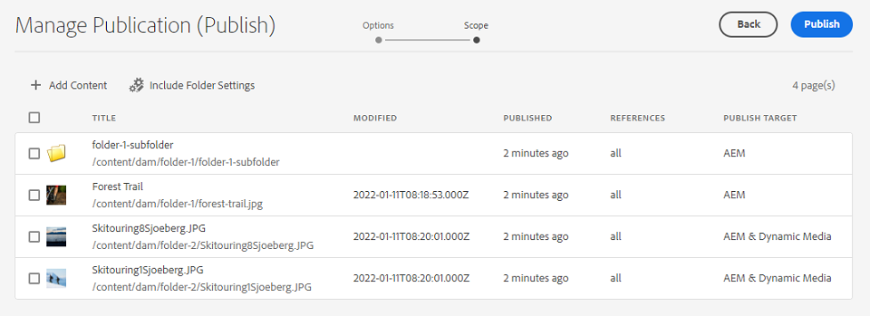

# 管理Experience Manager Assets出版物 {#manage-publication-in-aem}

作為 [!DNL Adobe Experience Manager Assets] 管理員，您可以將包含資產的資產和資料夾從作者實例發佈到 [!DNL Experience Manager Assets]。 [!DNL Dynamic Media], [!DNL Brand Portal]。 此外，您也可以將資產或資料夾的發佈工作流程安排在之後的日期或時間。一旦發佈，用戶就可以訪問並進一步將資產分配給其他用戶。 預設情況下，您可以將資產和資料夾發佈到 [!DNL Experience Manager Assets]。 但是，您可以配置 [!DNL Experience Manager Assets] 啟用發佈 [[!DNL Dynamic Media]](https://experienceleague.adobe.com/docs/experience-manager-cloud-service/content/assets/dynamicmedia/config-dm.html) 和 [[!DNL Brand Portal]](https://experienceleague.adobe.com/docs/experience-manager-cloud-service/content/assets/brand-portal/configure-aem-assets-with-brand-portal.html)。

您可以在資產或資料夾級別發佈或取消發佈資產，使用 **[!UICONTROL 快速發佈]** 或 **[!UICONTROL 管理發布]** 的 [!DNL Experience Manager Assets] 。 如果您隨後對中的原始資產或資料夾進行了修改 [!DNL Experience Manager Assets]，在從中重新發佈之前，更改不會反映在發佈實例中 [!DNL Experience Manager Assets]。 它確保在發佈實例中不提供正在進行的更改。 發佈實例中只有管理員發佈的已批准更改可用。

* [使用快速發佈發佈發佈資產](#quick-publish)
* [使用管理發布發佈發佈資產](#manage-publication)
* [稍後發佈資產](#publish-assets-later)
* [將資產發佈到Dynamic Media](#publish-assets-to-dynamic-media)
* [將資產發佈至 Brand Portal](#publish-assets-to-brand-portal)
* [限制和提示](#limitations-and-tips)

## 使用快速發佈發佈發佈資產 {#quick-publish}

快速發佈允許您立即將內容發佈到所選目標。 從 [!DNL Experience Manager Assets] 控制台，導航到父資料夾並選擇要發佈的所有資產或資料夾。 按一下 **[!UICONTROL 快速發佈]** 選項，然後從要發佈資產的下拉清單中選擇目標。

## 使用管理發布發佈發佈資產 {#manage-publication}

管理發布允許您將內容發佈到選定目標或從選定目標取消發佈內容， [添加內容](#add-content) 從DAM儲存庫到發佈清單， [包含資料夾設定](#include-folder-settings) 發佈所選資料夾的內容並應用篩選器， [計畫發佈](#publish-assets-later) 到更晚的日期或時間。

從 [!DNL Experience Manager Assets] 控制台，導航到父資料夾並選擇要發佈的所有資產或資料夾。 按一下 **[!UICONTROL 管理發布]** 的子菜單。 如果你沒有 [!DNL Dynamic Media] 和 [!DNL Brand Portal] 配置 [!DNL Experience Manager Assets] 實例只能將資產和資料夾發佈到 [!DNL Experience Manager Assets]。

以下選項可在 [!UICONTROL 管理發布] 介面：

* [!UICONTROL 動作]
   * `Publish`:將資產和資料夾發佈到所選目標
   * `Unpublish`:取消從目標發佈資產和資料夾

* [!UICONTROL 目的地]
   * `Publish`:將資產和資料夾發佈到 [!DNL Experience Manager Assets] (`AEM`)
   * `Dynamic Media`:將資產發佈到 [!DNL Dynamic Media]
   * `Brand Portal`:將資產和資料夾發佈到 [!DNL Brand Portal]

* [!UICONTROL 排程]
   * `Now`:立即發佈資產
   * `Later`:根據 `Activation` 日期或時間

要繼續，請按一下 **[!UICONTROL 下一個]**。 根據所選內容， **[!UICONTROL 範圍]** 頁籤 到 **[!UICONTROL 添加內容]** 和 **[!UICONTROL 包括資料夾設定]** 僅可用於將資產和資料夾發佈到 [!DNL Experience Manager Assets] (`Destination: Publish`)。

### 新增內容 {#add-content}

發佈到 [!DNL Experience Manager Assets] 允許您進一步將更多內容（資產和資料夾）添加到發佈清單。 您可以跨儲存庫向清單中添加更多資產或資料夾。 按一下 **[!UICONTROL 添加內容]** 按鈕以添加更多內容。

您可以從資料夾添加多個資產，也可以一次添加多個資料夾。 但您不能一次從多個資料夾中添加資產。

### 包含資料夾設定 {#include-folder-settings}

預設情況下，將資料夾發佈到 [!DNL Experience Manager Assets] 發佈所有資產、子資料夾及其引用。

要篩選要發佈的資料夾內容，請按一下 **[!UICONTROL 包括資料夾設定]**:

* `Include folder contents`

   * 已啟用：將發佈所選資料夾、子資料夾（包括子資料夾的所有資產）和引用。
   * 已禁用：僅發佈所選資料夾（空）和引用。 未發佈所選資料夾的資產。

* `Include folder contents`與`Include only immediate folder contents`

   如果同時選擇了這兩個選項，則會發佈選定資料夾、子資料夾（空）和引用的所有資產。 未發佈子資料夾的資產。

<!--
* [!UICONTROL Include only immediate folder contents]: Only the subfolders content and references are published. 

Only the selected folder content and references are published.
-->

應用濾鏡後，按一下 **[!UICONTROL 確定]**，然後按一下 **[!UICONTROL 發佈]**。 按一下「發佈」按鈕時，將顯示一條確認消息 `Resource(s) have been scheduled for publication` 的子菜單。 並且，根據調度程式(200)，將選定的資產和（或）資料夾發佈到定義的目標(200)`Now` 或 `Later`)。 登錄到發佈實例以驗證資產和（或）資料夾是否已成功發佈。

在上圖中，可以看到 **[!UICONTROL 發佈目標]** 屬性。 讓我們回想一下，你選擇出版 [!DNL Experience Manager Assets] (`Destination: Publish`)。 那麼，它為什麼只顯示一個資料夾和一個資產發佈到 `AEM`，而另外兩項資產則同時 `AEM` 和 `Dynamic Media`?

在這裡，您必須瞭解資料夾屬性的角色。 資料夾 **[!UICONTROL Dynamic Media出版模式]** 屬性在發佈中起著重要作用。 要查看資料夾的屬性，請選擇資料夾，然後按一下 **[!UICONTROL 屬性]** 的子菜單。 有關資產，請參閱其父資料夾的屬性。

下表說明了如何根據定義的 **[!UICONTROL 目標]** 和 **[!UICONTROL Dynamic Media發佈模式]**:

| [!UICONTROL 目的地] | [!UICONTROL Dynamic Media 發佈模式] | [!UICONTROL 發佈目標] | 允許的內容 |
| --- | --- | --- | --- |
| 發佈 | 選擇性發佈 | `AEM` | 資產和（或）資料夾 |
| 發佈 | 立即 | `AEM`與`Dynamic Media` | 資產和（或）資料夾 |
| 發佈 | 啟動時 | `AEM`與`Dynamic Media` | 資產和（或）資料夾 |
| Dynamic Media | 選擇性發佈 | `Dynamic Media` | 資產 |
| Dynamic Media | 立即 | `None` | 無法發佈資產 |
| Dynamic Media | 啟動時 | `None` | 無法發佈資產 |

>[!NOTE]
>
>只將資產發佈到 [!DNL Dynamic Media]。
>
>將資料夾發佈到 [!DNL Dynamic Media] 不支援。
>
>如果選擇資料夾(`Selective Publish`)，然後選擇 [!DNL Dynamic Media] 目標， [!UICONTROL 發佈目標] 屬性反映 `None`。

現在，讓我們更改 **[!UICONTROL 目標]** 在上述使用案例中 **[!UICONTROL Dynamic Media]** 並驗證結果。 這樣做，只有 `Selective Publish` 資料夾發佈到 [!DNL Dynamic Media]。 資產 `Immediate` 和 `Upon Activation` 資料夾未發佈，並反映 `None`。

>[!NOTE]
>
>如果 [!DNL Dynamic Media] 未在 [!DNL Experience Manager Assets] 實例和 **[!UICONTROL 目標]** 是 **[!UICONTROL 發佈]**，資產和資料夾始終發佈到 `AEM`。
>
>發佈到 [!DNL Brand Portal] 獨立於資料夾屬性。 所有資產、資料夾和集合都可以發佈到Brand Portal。 請參閱 [向Brand Portal發佈資產](#publish-assets-to-brand-portal)。

>[!NOTE]
>
>如果您已自定義 [!DNL Manage Publication] 嚮導中，您的自定義功能將繼續使用現有功能。
>
>但是，您可以刪除現有自定義項以使用新 [!DNL Manager Publication] 功能。

## 稍後發佈資產 {#publish-assets-later}

要將資產的發佈工作流安排到以後的日期或時間，請執行以下操作：

1. 從 [!UICONTROL Experience Manager Assets] 控制台，導航到父資料夾並選擇要計畫發佈的所有資產或資料夾。
1. 按一下 **[!UICONTROL 管理發布]** 的子菜單。
1. 按一下 **[!UICONTROL 發佈]** 從 **[!UICONTROL 操作]**，然後選擇 **[!UICONTROL 目標]** 要發佈內容的位置。
1. 在&#x200B;**[!UICONTROL 排程]**&#x200B;中選取&#x200B;**[!UICONTROL 稍後]**。
1. 選擇 **[!UICONTROL 激活日期]** 並指定日期和時間。 按一下&#x200B;**[!UICONTROL 下一步]**。

   

1. 在 **[!UICONTROL 範圍]** 頁籤 **[!UICONTROL 添加內容]** （如有必要）。 按一下&#x200B;**[!UICONTROL 下一步]**。
1. 在 **[!UICONTROL 工作流]** 的子菜單。 按一下&#x200B;**[!UICONTROL 稍後發佈]**。

   

   登錄到目標實例以驗證已發佈的資產（取決於計畫的日期或時間）。

## 將資產發佈到Dynamic Media {#publish-assets-to-dynamic-media}

只將資產發佈到 [!DNL Dynamic Media]。 但是，發佈行為因資料夾屬性而異。 資料夾可以 **[!UICONTROL Dynamic Media發佈模式]** 已配置為選擇性發佈，可以是下列任一選項：

* `Selective Publish`
* `Immediate`
* `Upon Activation`

的發佈過程 **[!UICONTROL 立即]** 和 **[!UICONTROL 激活後]** 模式一致，但 **[!UICONTROL 選擇性發佈]**。 請參閱 [在Dynamic Media的資料夾級別配置選擇性發佈](https://experienceleague.adobe.com/docs/experience-manager-cloud-service/content/assets/dynamicmedia/selective-publishing.html)。 在資料夾中配置選擇性發佈後，可以執行下列任一操作：

* [使用管理出版物有選擇地將資產發佈到Dynamic Media或Experience Manager](https://experienceleague.adobe.com/docs/experience-manager-cloud-service/content/assets/dynamicmedia/selective-publishing.html?lang=en#selective-publish-manage-publication)
* [使用管理出版物有選擇地從Dynamic Media或Experience Manager中取消發佈資產](https://experienceleague.adobe.com/docs/experience-manager-cloud-service/content/assets/dynamicmedia/selective-publishing.html?lang=en#selective-unpublish-manage-publication)
* [使用快速發佈將資產發佈到Dynamic Media或Experience Manager](https://experienceleague.adobe.com/docs/experience-manager-cloud-service/content/assets/dynamicmedia/selective-publishing.html?lang=en#quick-publish-aem-dm)
* [通過搜索結果有選擇地發佈或取消發佈資產](https://experienceleague.adobe.com/docs/experience-manager-cloud-service/content/assets/dynamicmedia/selective-publishing.html?lang=en#selective-publish-unpublish-search-results)

## 將資產發佈至 Brand Portal {#publish-assets-to-brand-portal}

您可以將資產、資料夾和收集發佈到 [!DNL Experience Manager Assets Brand Portal] 實例。

* [將資產發佈至 Brand Portal](https://experienceleague.adobe.com/docs/experience-manager-cloud-service/content/assets/brand-portal/publish-to-brand-portal.html?lang=en#publish-assets-to-bp)
* [將資料夾發佈至 Brand Portal](https://experienceleague.adobe.com/docs/experience-manager-cloud-service/content/assets/brand-portal/publish-to-brand-portal.html?lang=en#publish-folders-to-brand-portal)
* [將集合發佈至 Brand Portal](https://experienceleague.adobe.com/docs/experience-manager-cloud-service/content/assets/brand-portal/publish-to-brand-portal.html?lang=en#publish-collections-to-brand-portal)

## 限制和提示 {#limitations-and-tips}

* 選擇 [!UICONTROL 管理發布] 僅對具有複製權限的用戶帳戶可用。
* 未發佈空資料夾。
* 如果發佈正在處理的資產，則只發佈原始內容。 缺少格式副本。 等待處理完成，然後在處理完成後發佈或重新發佈資產。
* 取消發佈複雜資產時，僅取消發佈該資產。 避免取消發佈引用，因為其他已發佈的資產可能會引用這些引用。
