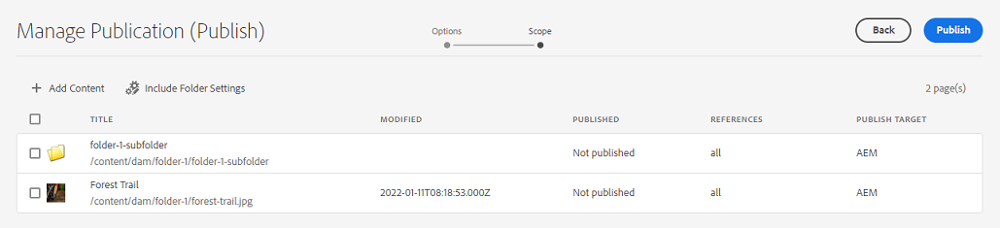

# 在Experience Manager Assets中管理發布 {#manage-publication-in-aem}

作為[!DNL Adobe Experience Manager Assets]管理員，您可以從您的作者執行個體將包含資產的資產和資料夾發佈到[!DNL Experience Manager Assets]、[!DNL Dynamic Media]和[!DNL Brand Portal]。 此外，您也可以排程在稍後的日期或時間發佈資產或資料夾。 發佈後，使用者可以存取資產，並進一步將資產發佈給其他使用者。 依預設，您可以將資產和資料夾發佈到[!DNL Experience Manager Assets]。 不過，您可以設定[!DNL Experience Manager Assets]以啟用發佈至[[!DNL Dynamic Media]](https://experienceleague.adobe.com/docs/experience-manager-cloud-service/content/assets/dynamicmedia/config-dm.html)和[[!DNL Brand Portal]](https://experienceleague.adobe.com/docs/experience-manager-cloud-service/content/assets/brand-portal/configure-aem-assets-with-brand-portal.html)。

您可以使用&#x200B;**[!UICONTROL 介面中的]**&#x200B;快速發佈&#x200B;**[!UICONTROL 或]**&#x200B;管理出版物[!DNL Experience Manager Assets]選項，在資產或資料夾層級發佈或取消發佈資產。 如果您在[!DNL Experience Manager Assets]中對原始資產或資料夾進行後續修改，則在您從[!DNL Experience Manager Assets]重新發佈之前，這些變更不會反映在發佈執行個體中。 它可確保發佈執行個體中不會出現進行中變更。 發佈執行個體中只能使用管理員發佈的已核准變更。

* [使用快速發佈來發佈資產](#quick-publish)
* [使用管理出版物](#manage-publication)發佈資產
* [稍後發佈資產](#publish-assets-later)
* [將資產發佈至Dynamic Media](#publish-assets-to-dynamic-media)
* [將資產發佈至Brand Portal](#publish-assets-to-brand-portal)
* [要求發佈](#request-publication)
* [限制與秘訣](#limitations-and-tips)

## 使用快速發佈來發佈資產 {#quick-publish}

快速發佈可讓您立即發佈內容至所選目的地。 從[!DNL Experience Manager Assets]主控台，導覽至父資料夾，並選取您要發佈的所有資產或資料夾。 按一下工具列中的&#x200B;**[!UICONTROL 快速發佈]**&#x200B;選項，然後從下拉式清單中選取您要發佈資產的目的地。

## 使用管理發布功能發佈資產 {#manage-publication}

管理出版物可讓您向所選目的地發佈或取消發佈內容、從DAM存放庫將內容[新增至發佈清單](#add-content)、[包含資料夾設定](#include-folder-settings)以發佈所選資料夾的內容並套用篩選器，以及[排程發佈](#publish-assets-later)至更晚的日期或時間。

從[!DNL Experience Manager Assets]主控台，導覽至父資料夾，並選取您要發佈的所有資產或資料夾。 按一下工具列中的&#x200B;**[!UICONTROL 管理出版物]**&#x200B;選項。 如果您未在您的[!DNL Dynamic Media]執行個體中設定[!DNL Brand Portal]和[!DNL Experience Manager Assets]，您只能將資產和資料夾發佈到[!DNL Experience Manager Assets]。

[!UICONTROL 管理出版物]介面中有以下選項：

* [!UICONTROL 動作]
   * `Publish`：將資產和資料夾發佈到選取的目的地
   * `Unpublish`：從目的地取消發佈資產和資料夾

* [!UICONTROL 目的地]
   * `Publish`：將資產和資料夾發佈至[!DNL Experience Manager Assets] (`AEM`)
   * `Dynamic Media`：將資產發佈至[!DNL Dynamic Media]
   * `Brand Portal`：將資產和資料夾發佈至[!DNL Brand Portal]

* [!UICONTROL 排程]
   * `Now`：立即發佈資產
   * `Later`：根據`Activation`日期或時間發佈資產

若要繼續，請按一下[下一步] ****。 根據選取專案，**[!UICONTROL 範圍]**&#x200B;索引標籤會反映不同的選項。 **[!UICONTROL 新增內容]**&#x200B;和&#x200B;**[!UICONTROL 包含資料夾設定]**&#x200B;的選項僅可用於將資產和資料夾發佈到[!DNL Experience Manager Assets] (`Destination: Publish`)。

### 新增內容 {#add-content}

發佈至[!DNL Experience Manager Assets]可讓您進一步新增更多內容（資產和資料夾）至發佈清單。 您可以跨dam存放庫將更多資產或資料夾新增到清單中。 按一下「**[!UICONTROL 新增內容]**」按鈕以新增更多內容。

您可以從資料夾中新增多個資產，或一次新增多個資料夾。 但您無法一次從多個資料夾新增資產。

### 包含資料夾設定 {#include-folder-settings}

依預設，將資料夾發佈至[!DNL Experience Manager Assets]會發佈所有資產、子資料夾及其參考。

若要篩選您要發佈的資料夾內容，請按一下&#x200B;**[!UICONTROL [包含資料夾設定]]**：

* `Include folder contents`

   * 啟用：會發佈所選資料夾的所有資產、子資料夾（包括子資料夾的所有資產）和參考。
   * 已停用：僅發佈選取的資料夾（空白）和參考。 所選資料夾的資產未發佈。

* `Include folder contents` 和 `Include only immediate folder contents`

  如果同時選取兩個選項，則會發佈所選資料夾、子資料夾（空白）和參照的所有資產。 子資料夾的資產未發佈。

<!--
* [!UICONTROL Include only immediate folder contents]: Only the subfolders content and references are published. 

Only the selected folder content and references are published.
-->

套用篩選器後，按一下&#x200B;**[!UICONTROL 確定]**，然後按一下&#x200B;**[!UICONTROL 發佈]**。 按一下發佈按鈕時，會顯示確認訊息`Resource(s) have been scheduled for publication`。 而且選取的資產和（或）資料夾會根據排程器（`Now`或`Later`）發佈到定義的目的地。 登入您的發佈執行個體，驗證資產和（或）資料夾是否已成功發佈。

在上圖中，您可以看到&#x200B;**[!UICONTROL 發佈目標]**&#x200B;屬性的不同值。 讓我們回顧您已選擇發佈至[!DNL Experience Manager Assets] (`Destination: Publish`)的事實。 那麼，它為何只顯示資料夾和資產發佈至`AEM`，而其他兩個資產同時發佈至`AEM`和`Dynamic Media`？

在這裡，您必須瞭解資料夾屬性的角色。 資料夾的&#x200B;**[!UICONTROL Dynamic Media發佈模式]**&#x200B;屬性在出版物中起著重要作用。 若要檢視資料夾的內容，請選取資料夾，然後從工具列按一下&#x200B;**[!UICONTROL 內容]**。 如需瞭解資產，請參閱其上層資料夾的屬性。

下表說明如何根據定義的&#x200B;**[!UICONTROL 目的地]**&#x200B;和&#x200B;**[!UICONTROL Dynamic Media發佈模式]**&#x200B;進行發佈：

| [!UICONTROL 目的地] | [!UICONTROL Dynamic Media發佈模式] | [!UICONTROL 發佈目標] | 允許的內容 |
| --- | --- | --- | --- |
| 發佈 | 選擇性發佈 | `AEM` | Assets和（或）資料夾 |
| 發佈 | 立即 | `AEM` 和 `Dynamic Media` | Assets和（或）資料夾 |
| 發佈 | 啟動時 | `AEM` 和 `Dynamic Media` | Assets和（或）資料夾 |
| Dynamic Media | 選擇性發佈 | `Dynamic Media` | Assets |
| Dynamic Media | 立即 | `None` | 無法發佈資產 |
| Dynamic Media | 啟動時 | `None` | 無法發佈資產 |

>[!NOTE]
>
>只有資產會發佈至[!DNL Dynamic Media]。
>
>不支援將資料夾發佈至[!DNL Dynamic Media]。
>
>如果您選取資料夾(`Selective Publish`)並選擇[!DNL Dynamic Media]目的地，則[!UICONTROL Publish Target]屬性會反映`None`。

讓我們現在將上述使用案例中的&#x200B;**[!UICONTROL 目的地]**&#x200B;變更為&#x200B;**[!UICONTROL Dynamic Media]**&#x200B;並驗證結果。 如此一來，只有`Selective Publish`資料夾的資產會發佈至[!DNL Dynamic Media]。 `Immediate`和`Upon Activation`資料夾的資產未發佈，並反映`None`。

>[!NOTE]
>
>如果未在您的[!DNL Dynamic Media]執行個體上設定[!DNL Experience Manager Assets]，且&#x200B;**[!UICONTROL 目的地]**&#x200B;為&#x200B;**[!UICONTROL 發佈]**，則資產與資料夾一律會發佈至`AEM`。
>
>發佈至[!DNL Brand Portal]與資料夾屬性無關。 所有資產、資料夾和集合皆可發佈至Brand Portal。 請參閱[將資產發佈至Brand Portal](#publish-assets-to-brand-portal)。

>[!NOTE]
>
>如果您已自訂[!DNL Manage Publication]精靈，您的自訂功能會繼續使用現有的功能。
>
>但是，您可以移除現有的自訂以使用新的[!DNL Manager Publication]功能。

## 稍後發佈資產 {#publish-assets-later}

若要將資產發佈工作流程安排在之後的日期或時間：

1. 從[!UICONTROL Experience Manager Assets]主控台，導覽至上層資料夾，並選取您要排程發佈的所有資產或資料夾。
1. 按一下工具列中的&#x200B;**[!UICONTROL 管理出版物]**&#x200B;選項。
1. 從&#x200B;**[!UICONTROL 動作]**&#x200B;按一下&#x200B;**[!UICONTROL 發佈]**，然後選取您要發佈內容的&#x200B;**[!UICONTROL 目的地]**。
1. 在&#x200B;**[!UICONTROL 排程]**&#x200B;中選取&#x200B;**[!UICONTROL 稍後]**。
1. 選取&#x200B;**[!UICONTROL 啟用日期]**&#x200B;並指定日期和時間。 按一下「**[!UICONTROL 下一步]**」。

   

1. 在&#x200B;**[!UICONTROL 領域]**&#x200B;索引標籤中，**[!UICONTROL 新增內容]** （如有必要）。 按一下「**[!UICONTROL 下一步]**」。
1. 在&#x200B;**[!UICONTROL 工作流程]**&#x200B;索引標籤中，指定工作流程標題。 按一下&#x200B;**[!UICONTROL 稍後發佈]**。

   

   登入目的地執行個體以驗證已發佈的資產（取決於排定的日期或時間）。

## 將資產發佈至Dynamic Media {#publish-assets-to-dynamic-media}

只有資產會發佈至[!DNL Dynamic Media]。 不過，發佈行為會因資料夾屬性而異。 資料夾可以將&#x200B;**[!UICONTROL Dynamic Media發佈模式]**&#x200B;設定為選擇性發佈，可以是下列任一專案：

* `Selective Publish`
* `Immediate`
* `Upon Activation`

**[!UICONTROL Immediate]**&#x200B;與&#x200B;**[!UICONTROL On Activation]**&#x200B;模式的發佈程式一致，但&#x200B;**[!UICONTROL 選擇性發佈]**&#x200B;則不同。 請參閱[在Dynamic Media](https://experienceleague.adobe.com/docs/experience-manager-cloud-service/content/assets/dynamicmedia/selective-publishing.html)的資料夾層級設定選擇性發佈。 在資料夾中設定選擇性發佈後，您可以執行下列任一項作業：

* [使用「管理出版物」選擇性地將資產發佈到Dynamic Media或Experience Manager](https://experienceleague.adobe.com/docs/experience-manager-cloud-service/content/assets/dynamicmedia/selective-publishing.html?lang=en#selective-publish-manage-publication)
* [使用「管理出版物」選擇性地從Dynamic Media或Experience Manager取消發佈資產](https://experienceleague.adobe.com/docs/experience-manager-cloud-service/content/assets/dynamicmedia/selective-publishing.html?lang=en#selective-unpublish-manage-publication)
* [使用快速發佈將資產發佈到Dynamic Media或Experience Manager](https://experienceleague.adobe.com/docs/experience-manager-cloud-service/content/assets/dynamicmedia/selective-publishing.html?lang=en#quick-publish-aem-dm)
* [透過搜尋結果選擇性地發佈或取消發佈資產](https://experienceleague.adobe.com/docs/experience-manager-cloud-service/content/assets/dynamicmedia/selective-publishing.html?lang=en#selective-publish-unpublish-search-results)

## 將資產發佈至Brand Portal {#publish-assets-to-brand-portal}

您可以將資產、資料夾和集合發佈至[!DNL Experience Manager Assets Brand Portal]執行個體。

* [將資產發佈至 Brand Portal](https://experienceleague.adobe.com/docs/experience-manager-cloud-service/content/assets/brand-portal/publish-to-brand-portal.html?lang=en#publish-assets-to-bp)
* [將資料夾發佈至 Brand Portal](https://experienceleague.adobe.com/docs/experience-manager-cloud-service/content/assets/brand-portal/publish-to-brand-portal.html?lang=en#publish-folders-to-brand-portal)
* [將集合發佈至 Brand Portal](https://experienceleague.adobe.com/docs/experience-manager-cloud-service/content/assets/brand-portal/publish-to-brand-portal.html?lang=en#publish-collections-to-brand-portal)

## 要求發佈 {#request-publication}

`Request Publication`選項可協助您先驗證Assets的工作流程，然後再在[!DNL AEM] Assets環境中發佈。 [!DNL AEM]為不同使用者提供不同等級的許可權。 您可能是正在上傳資產的&#x200B;*貢獻者*，但在上傳通過驗證之前無法發佈資產。 此外，身為&#x200B;*管理員*，您可以管理讀取和寫入Assets的工作流程。

請求發佈選項適用於下列使用者：

* **貢獻者：**&#x200B;如果您是可以貢獻[!DNL AEM] Assets的使用者，則您對[!DNL AEM] Assets工作流程的存取權有限。 已為您隱藏`Manage publication`按鈕。 身為貢獻者，您只能透過新增Assets來貢獻，但無法發佈或擁有工作流程的讀取存取權。

* **工作流程使用者：**&#x200B;此使用者無法發佈資產，但擁有工作流程的讀取存取權。 身為工作流程使用者，您可以：
   * 要求發佈
   * 檢視`Manage publication`按鈕
   * 排程工作流程並檢視選項`schedule now`和`schedule later`

* **管理員：**&#x200B;身為使用者的管理員型別，您可以管理Assets的整體工作流程步驟。 您看得見`Manage publication`按鈕。 如果選取目的地`publish`，您可以稍後為工作流程步驟排程資產。

>[!NOTE]
>
>如果選取[!DNL Dynamic Media]作為目的地，則會對&#x200B;**工作流程使用者**&#x200B;和&#x200B;**管理員**&#x200B;使用者停用工作流程步驟。
>

## 限制與秘訣 {#limitations-and-tips}

* 至少擁有工作流程讀取許可權的使用者可以使用`Manage publication`。
* 未發佈空白資料夾。
* 如果您發佈正在處理的資產，只會發佈原始內容。 缺少轉譯。 請等待處理完成，然後在處理完成時發佈或重新發佈資產。
* 取消發佈複雜資產時，請僅取消發佈資產。 請避免取消發佈引用，因為它們可能會被其他已發佈的資產引用。
