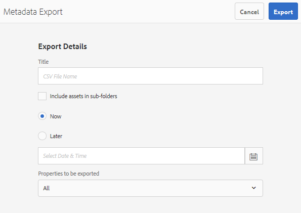

# 批量導入和導出資產元資料 {#import-and-export-asset-metadata-in-bulk}

Adobe Experience Manager資產允許您使用CSV檔案批量導入資產元資料。 您可以通過導入CSV檔案為最近上載的資產或現有資產進行批量更新。 您還可以以CSV格式從第三方系統批量接收資產元資料。

## 導入元資料 {#import-metadata}

元資料導入是非同步的，不會影響系統效能。 由於使用資產微服務的元資料寫回活動，因此多個資產的元資料的同時更新可能需要大量資源。 Adobe建議您在精益伺服器使用期間計畫任何批量操作，以便不影響其他用戶的效能。

>[!NOTE]
>
>要在自定義命名空間上導入元資料，請首先註冊命名空間。

1. 導航到 [!DNL Assets] 用戶介面，選擇 **[!UICONTROL 建立]** ，然後選擇 **[!UICONTROL 元資料]** 的子菜單。
1. 在 **[!UICONTROL 元資料導入]** 的 **[!UICONTROL 選擇檔案]**。 選取包含中繼資料的CSV檔案。
1. 提供以下參數：

   | 參數 | 說明 |
   | ---------------------- | ------- |
   | 批次大小 | 要為其導入元資料的批中的資產數。 預設值為 50。最大值為100。 |
   | 欄位分隔符號 | 預設值為 `,` （逗號）。 可以指定任何其他字元。 |
   | 多值分隔符 | 元資料值的分隔符。 預設值為 `|`. |
   | 啟動工作流程 | 預設為False。 設定為時 `true` 和預設設定對DAM元資料回寫工作流(將元資料寫入二進位資料XMP)有效。 啟用工作流會降低系統的速度。 |
   | 資產路徑欄名稱 | 定義帶資產的CSV檔案的列名。 |

1. 選擇 **[!UICONTROL 導入]** 的子菜單。 導入元資料後，將向通知收件箱發送通知。 導航到asset屬性頁並驗證是否為asset正確導入了元資料值。

1. 要添加日期和時間戳以導入元資料，請使用 `YYYY-MM-DDThh:mm:ss.fff-00:00` 的子菜單。 日期和時間以 `T`。 `hh` 是24小時制， `fff` 是納秒 `-00:00` 是時區偏移。 比如說， `2020-03-26T11:26:00.000-07:00` 是2020年3月26日:26:太平洋標準時間上午00時

   * 日期格式取決於列標題及其格式。 例如，如果日期是格式的投訴 `yyyy-MM-dd'T'HH:mm:ssXXX` 則相應的列標題必須是 `Date: DateFormat: yyyy-MM-dd'T'HH:mm:ssXXX`。
   * 預設日期格式為 `yyyy-MM-dd'T'HH:mm:ss.SSSXXX`。

<!-- Hidden via cqdoc-17869>

>[!CAUTION]
>
>If the date format does not match `YYYY-MM-DDThh:mm:ss.fff-00:00`, the date values are not set. The date formats of exported metadata CSV file is in the format `YYYY-MM-DDThh:mm:ss-00:00`. If you want to import it, convert it to the acceptable format by adding the nanoseconds value denoted by `fff`.
-->

## 匯出存中繼資料 {#export-metadata}

可以以CSV格式導出多個資產的元資料。 元資料是非同步導出的，不會影響系統效能。 要導出元資料，Experience Manager遍歷資產節點的屬性 `jcr:content/metadata` 以及其子節點，並將元資料屬性導出到CSV檔案中。

批量導出元資料的幾個使用案例包括：

* 遷移資產時，在第三方系統中導入元資料。
* 與更廣泛的項目團隊共用資產元資料。
* Test或審核元資料以實現法規遵從性。
* 將元資料外部化以進行單獨的本地化。

1. 選擇包含要導出元資料的資產的資產資料夾。 在工具欄中，選擇 **[!UICONTROL 導出元資料]**。
1. 在元資料導出對話框中，指定CSV檔案的名稱。 要導出子資料夾中資產的元資料，請選擇 **[!UICONTROL 在子資料夾中包括資產]**。

   

1. 選擇所需選項。 提供檔案名和必要時的日期。

1. 在 **[!UICONTROL 要導出的屬性]** 欄位，指定是要導出所有屬性還是要導出特定屬性。 如果選擇要導出的「選擇性屬性」，請添加所需的屬性。

1. 在工具欄上，點擊/按一下 **[!UICONTROL 導出]**。 消息確認元資料已導出。 關閉消息。
1. 開啟導出作業的收件箱通知。選擇作業，然後從工具 **[!UICONTROL 欄中]** ，按一下「開啟」。若要下載包含中繼資料的CSV檔案，請從工具列點選/按 **[!UICONTROL 一下「CSV下載]** 」。按一下 **[!UICONTROL 關閉]**。

   

   *圖：對話框，用於下載包含批量導出的元資料的CSV檔案。*

>[!MORELIKETHIS]
>
>* [批量導入資產時導入元資料](/help/assets/add-assets.md#asset-bulk-ingestor)

