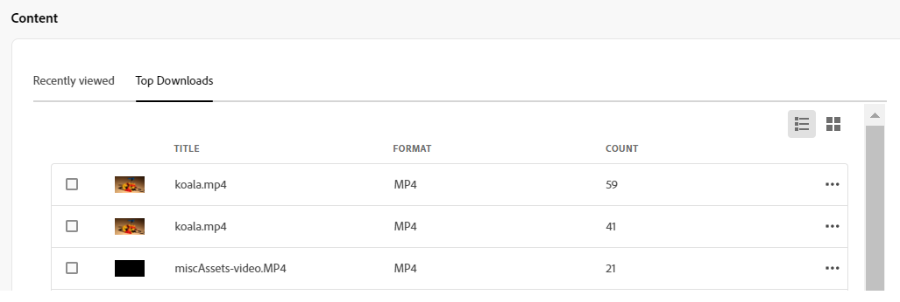

# Assets 我的工作區 {#my-workspace}

>[!CONTEXTUALHELP]
>id="assets_my_workspace"
>title="我的工作區"
>abstract="Assets 現在包含一個可自訂的工作區，提供 Widget 以方便存取資產使用者介面的關鍵區域以及與您最相關的資訊。此頁面可用作一站式解決方案，提供工作項目的概觀並讓您快速存取關鍵工作流程。"

Assets 現在包含一個可自訂的工作區，提供 Widget 以方便存取資產使用者介面的關鍵區域以及與您最相關的資訊。此頁面可用作一站式解決方案，提供工作項目的概觀並讓您快速存取關鍵工作流程。更方便地存取這些選項可以提高您的效率和內容速度。

您可以透過按一下左側導覽窗格中可用項目中的「**[!UICONTROL 我的工作區]**」來存取「我的工作區」。「我的工作區」包含各種介面工具集，可顯示「快速存取」、「深入分析」、「工作」和「內容」介面工具集。 您可以根據自己的偏好設定這些 Widget 在 Workspace 中的顯示方式。

>[!NOTE]
>
>Insights Widget 僅會向管理員顯示。

<!--

**New features coming soon**

Highlights upcoming features for Assets.

-->

**快速存取**

釘選檔案、資料夾和集合，以便在您稍後需要這些專案時更快存取它們。 所有釘選專案都會顯示在 **快速存取** 區段。 您可以使用「我的工作區」來存取這些物件，而不必導覽至儲存於存放庫中的儲存位置。

若要釘選資產、資料夾或集合，請選取專案並按一下 **[!UICONTROL 釘選至快速存取]**.

**Insights**

管理員可以檢視過去 30 天內在 Assets 環境中執行的下載和上傳次數的摘要。您可以按一下「**[!UICONTROL 檢視全部]**」以快速瀏覽至 Insights 頁面以獲得更詳細的儀表板。

您也可以在Assets檢視部署中使用，檢視熱門搜尋辭彙以及搜尋這些辭彙的次數。 **深入分析** 區段。 您也可以導覽至詳細分析，檢視過去30天或12個月的熱門搜尋。

**任務**

在「**[!UICONTROL 我的任務]**」標籤中顯示目前指派給您的任務清單，在「**[!UICONTROL 指派的任務]**」標籤中顯示您所建立的任務清單，以及在「**[!UICONTROL 已完成]**」標籤中顯示您已完成的任務清單。您可以選取一個任務並按一下「**[!UICONTROL 完成任務]**」來核准或拒絕任務。您也可以選取一個任務並按一下「**[!UICONTROL 開啟任務詳細資訊]**」以檢視該任務，以及核准、拒絕、編輯或刪除它。

>[!NOTE]
>
> 當您選取資產或開啟資產資訊檢視時，可以使用「**[!UICONTROL 指派任務]**」選項將資產任務指派給另一個使用者。

**內容**

顯示資產的分類檢視，包括您最近檢視的資產清單。您可以選取以清單檢視、格點檢視、圖庫檢視或瀑布檢視顯示 Widget 中的資產，並按名稱、大小和修改日期對資產進行排序。您還可以選取資產以檢視資產詳細資訊，或將其從最近檢視的資產清單中移除。

此 **[!UICONTROL 熱門下載]** 索引標籤會顯示「資產」檢視環境中最多下載的前10個資產。 您可以選取在「清單檢視」或「方格檢視」中顯示資產。兩個檢視都會顯示每個資產的格式類型和下載次數。您也可以選取資產並按一下「**[!UICONTROL 詳細資料]**」以檢視其屬性。

## 自訂我的工作區 {#configure-widgets}

預設情況下會顯示所有 Widget，但您可以啟用或停用「我的工作區」顯示的 Widget。每個使用者的偏好設定都是特定的。

1. 按一下左側導覽窗格中可用的「**[!UICONTROL 我的工作區]**」，然後按一下「**[!UICONTROL 自訂]**」。

1. 為不需要在 Workspace 中顯示的 Widget 關閉切換功能。您還可以將 Widget 拖曳到適當的位置以更新其在 Workspace 中的顯示順序。

1. 按一下「**[!UICONTROL 完成]**」以儲存變更。

   
