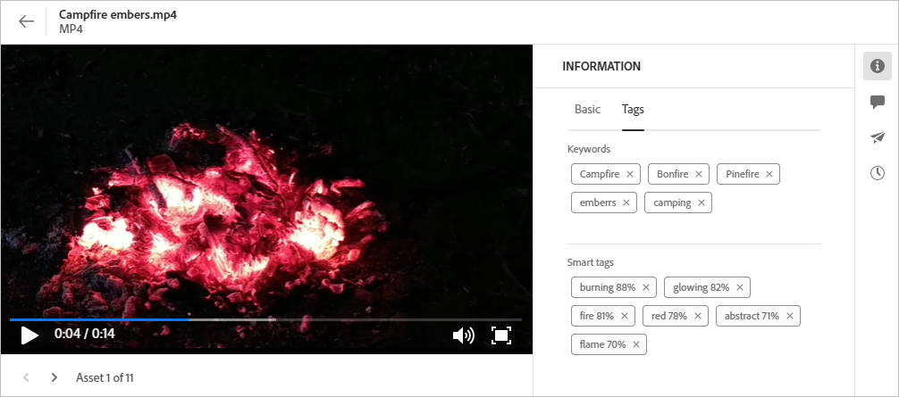

# 導覽至檔案和資料夾，並檢視資產 {#view-assets-and-details}

<!-- TBD: Give screenshots of all views with many assets. Zoom out to showcase how the thumbnails/tiles flow on the UI in different views. -->

<!-- TBD: The options in left sidebar may change. Shared with me and Shared by me are missing for now. Update this section as UI is updated. -->

## 了解 [!DNL Assets view] 使用者介面 {#understand-interface-navigation}

[!DNL Assets view] 提供直覺式的人性化使用者介面。清爽的介面有助於輕鬆找到並記住資產和相關資訊。

登入 [!DNL Assets view] 時，您會看到以下介面。

![[!DNL Assets view] 使用者介面](assets/assets-view-interface.png)

**A**：左側邊欄用於瀏覽存放庫並可以存取一些其他選項 **B**：顯示或收合左側邊欄以增加資產檢視區域 **C**：篩選搜尋結果 **D**：選取所選資料夾的所有內容 **E**：用於排序資產的選項 **F**：搜尋方塊 **G**：使用 `Add Assets` 按鈕上傳或拖放檔案 **H**：建立新資料夾 **I**：切換不同視圖

<!-- TBD: Need an embedded video here with narration. It has to be hosted on MPC to be embeddable. -->

## 瀏覽和檢視資產和資料夾 {#browse-repository}

您可以從主要使用者介面或左側邊欄瀏覽資料夾。瀏覽或搜尋內容時，Experience Manager Assets會在資料夾縮圖上顯示資料夾內容的視覺預覽。 這麼做可改善AEM Assets存放庫中可用資產的可發現性。 此資料夾縮圖可讓您節省在AEM Assets存放庫的資料夾中搜尋特定資產所花費的時間。
在資料夾中瀏覽資產時，您可以使用該介面檢視資產縮圖以瀏覽存放庫或檢視資產詳細資料，以便快速找到您想要的資產。在左側邊欄中的可用選項有：

* [我的工作區](/help/assets/my-workspace-assets-view.md)：Assets 現在包含一個可自訂的工作區，提供小工具以方便存取資產使用者介面的關鍵區域以及與您最相關的資訊。 此頁面可用作一站式解決方案，提供工作項目的概觀並讓您快速存取關鍵工作流程。更方便地存取這些選項可以提高您的效率和內容速度。
* [任務](/help/assets/my-workspace-assets-view.md)：您可以在&#x200B;**我的任務**&#x200B;標籤下檢視指派給您的任務。而您建立的任務則顯示在&#x200B;**指派的任務**&#x200B;標籤下。 此外，您完成的工作位於&#x200B;**已完成的工作**&#x200B;標籤下。
* [資產](/help/assets/manage-organize-assets-view.md)：在樹狀目錄檢視中您可以存取的所有資料夾清單。
* **最近檢視的項目**：您最近預覽的資產清單。[!DNL Assets view] 只會顯示您預覽的資產。在瀏覽存放庫檔案或資料夾時，不會顯示捲動過去的資產。
* [集合](/help/assets/manage-collections-assets-view.md)：集合是Adobe Experience Manager Assets檢視中的一組資產、資料夾或其他集合。 使用集合在使用者之間共用資產。和檔案夾不同，集合可包含來自不同位置的資產。您可以和使用者共用多個集合。每個集合都包含資產的參考資料。資產的參考完整性會跨越集合來維護。

* [Insights](/help/assets/manage-reports-assets-view.md#view-live-statistics)：在[!DNL Assets view]，您可以在儀表板上檢視即時深入分析。資產檢視使您能夠使用 Insights 儀表板查看資產檢視環境的即時資料。您可以查看過去 30 天或過去 12 個月的即時事件度量。

* **垃圾桶**：列出從 **[!UICONTROL Assets]** 根資料夾刪除的資產。 您可以在「垃圾桶」資料夾中選取資產，將其還原到原來的位置或永久刪除。您可以指定關鍵字或套用篩選條件，例如資產狀態、檔案類型、MIME 類型、影像大小、資產建立、修改和過期日期，以及按目前使用者捨棄的資產進行篩選。您也可以套用自訂篩選條件，以搜尋「垃圾桶」資料夾中的適當資產。如需使用標準和自訂篩選器的詳細資訊，請參閱如何[在Assets檢視中搜尋資產](/help/assets/search-assets-view.md)。
* **設定**：您可以使用&#x200B;**設定**&#x200B;來設定Assets檢視的各種選項，例如中繼資料表單、報表和分類管理。

<!-- TBD: Not sure if we want to publish these right now. CC Libs are beta as per Greg.
* **Libraries**: Access to [!DNL Adobe Creative Cloud Team] (CCT) Libraries view. This view is visible only if the user is entitled to CCT Libraries.
-->

<!-- TBD: My Work Space shows task inbox and it is not visible on AEM Cloud Demos as of now. It is the source of truth server hence not documenting My Work Space option for now.
-->

您可以開啟或摺疊左側邊欄，以增加可用的資產檢視區域。

在 [!DNL Assets view] 中，您可以在四種不同的版面類型中檢視資產、資料夾和搜尋結果。

*  [!UICONTROL 清單檢視]
*  [!UICONTROL 格點檢視]
*  [!UICONTROL 圖庫檢視]
*  [!UICONTROL 瀑布檢視]

若要找到資產，您可以依照 `Name`、`Relevancy`、`Size`、`Modified` 和 `Created` 的遞增或遞減順序排序資產。

若要在資料夾中導覽，請連按兩下資料夾的縮圖，或從左側邊欄選取資料夾。 若要檢視資料夾的詳細資訊，請選取該資料夾，或從頂部的工具列按一下「詳細資訊」。若要向上和向下瀏覽階層，請使用左側邊欄或頂部的階層連結。

*圖：若要瀏覽階層，請使用頂部的階層連結或左側邊欄。*

## 預覽資產 {#preview-assets}

使用、分享或下載資產前，您可以更密切地檢視資產。預覽功能不僅可讓您檢視影像，也可以檢視一些其他支援的資產類型。

若要預覽資產，請選取該資產，然後從頂部的工具列按一下「[!UICONTROL 詳細資訊]」。您不僅可檢視資產，也可檢視其詳細的中繼資料並採取其他動作。

**A**：回到儲存庫中的目前資料夾或目前的搜尋結果&#x200B;**B**：您正在預覽的檔案的名稱和格式&#x200B;**C**：指派工作&#x200B;**D**：進階中繼資料&#x200B;**E**：關鍵字和智慧標籤&#x200B;**F**：註解與註釋&#x200B;**G**：檢視與所選資產相關的工作&#x200B;**H**： [檢視和管理版本](/help/assets/manage-organize-assets-view.md#versions-of-assets) **A i**：檢視影象&#x200B;**J**&#x200B;的演繹版：編輯影象&#x200B;**K**：檢視包含OpenAPI功能演繹版的Smart Crop和Dynamic Media的Dynamic Media演繹版。 **L**：基本中繼資料&#x200B;**M**：進階中繼資料&#x200B;**N**：關鍵字和智慧標籤&#x200B;**O**：繼續目前資料夾中的上一個或下一個資產，而不返回資料夾&#x200B;**P**：更密切地預覽。 縮放、全螢幕和其他選項。

您也可以預覽影片。

如果您明確預覽資產，[!DNL Assets view] 則會將該資產顯示為最近檢視的資產。

<!-- TBD: Describe the options.

Explicitly previewed assets are displayed as recently viewed assets. Give screenshot of this.
Other use cases after previewing.
-->

## 後續步驟 {#next-steps}

* 使用資產檢視使用者介面所提供的[!UICONTROL 意見回饋]選項提供產品意見回饋

* 若要提供文件意見回饋，請使用右側邊欄提供的[!UICONTROL 編輯此頁面]或[!UICONTROL 記錄問題]

* 連絡[客戶服務](https://experienceleague.adobe.com/?support-solution=General#support)

>[!MORELIKETHIS]
>
>* [檢視資產的版本](/help/assets/manage-organize-assets-view.md#view-versions)。
