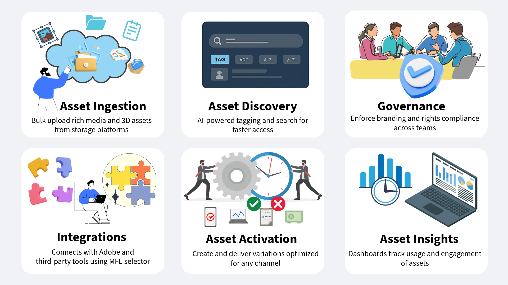

# 在 AEM 中引進 Assets as a Cloud Service 進行數位資產管理 {#assets-as-cloud-service-digital-asset-management-aem}

AEM Assets as a Cloud Service 為企業提供雲端原生的 PaaS 解決方案，不僅可以執行其數位資產管理和動態媒體操作，還可以使用 AI/ML 等下一代智慧功能。所有這些都來自一個始終保持最新、永遠可用且持續學習的系統。

Adobe 提供健全的數位資產管理 (DAM) 解決方案，協助您充分利用數位資產。Adobe Experience Manager Assets 使用同一個雲端服務存放庫提供兩種不同的體驗，以便滿足您的需求：如需 AEM Assets 基於人物誌的體驗相關資訊，請參閱[數位資產管理可用的基於人物誌的體驗](#persona-based-experiences)。

如需 AEM Assets Ultimate 和 AEM Assets Prime 方案的相關資訊，請參閱 [Assets as a Cloud Service Ultimate](/help/assets/assets-ultimate-overview.md) 和 [Assets as a Cloud Service Prime](/help/assets/assets-prime.md)。

Adobe 數位資產管理的部分主要功能包括：

>[!BEGINTABS]

>[!TAB 資產攝取]

## 資產攝取 {#asset-ingestion}

使用大量匯入功能將大量資產直接從資料來源 (例如 Azure、AWS、Google Cloud、Dropbox 和 OneDrive) 匯入至 Assets as a Cloud Service。

您可以使用管理員視圖或資產視圖執行大量匯入作業。相較於管理員視圖，資產視圖會提供更多的資料來源選項。

除了網頁瀏覽器使用者介面之外，Experience Manager 也支援其他的桌面用戶端。並提供不需要前往網頁瀏覽器的上傳體驗。

* 透過 Adobe Asset Link，您可以從 Adobe Photoshop、Adobe Illustrator 和 Adobe InDesign 桌面應用程式存取 Experience Manager 中的資產。您可以將開啟的檔案上傳至 Experience Manager。您可以直接透過這些桌面應用程式中的 Adobe Asset Link 介面執行此操作。

* Experience Manager 桌面應用程式能簡化在桌面上使用資產的運作方式，不論其檔案類型或者處理資產的原生應用程式為何。要從本機檔案系統上傳巢狀資料夾階層中的檔案時，這個應用程式很實用，因為瀏覽器上傳功能僅支援上傳平面檔案清單。

透過以下連結存取關於這些資產攝取工具的詳細文件：

<table>
<td>
   
   

      <a href="/help/assets/bulk-import-assets-view.md">
      <strong>使用大量匯入工具</strong>
      </a>
   

   

      <em>了解如何直接從資料來源匯入大量資產</em>
   

</td>

<td>
   
   

      <a href="https://experienceleague.adobe.com/zh-hant/docs/experience-manager-desktop-app/using/get-started">
      <strong>使用 AEM 桌面應用程式</strong>
      </a>
   

   

      <em>了解如何使用 AEM 桌面應用程式從本機檔案系統上傳巢狀資料夾階層中的檔案。</em>
   

</td>
<td>
   
   

      <a href="https://helpx.adobe.com/tw/enterprise/using/adobe-asset-link.html">
      <strong>使用 Adobe Asset Link</strong>
      </a>
   

   

      <em>了解如何使用 Creative Cloud 應用程式將資產上傳至 Experience Manager。</em>
   

</td>
</table>

>[!TAB AI 驅動的功能]

**智慧標籤**：智慧標籤會使用Adobe AI的人工智慧架構，根據您的標籤結構和商業分類訓練其影像辨識演演算法。 然後，再利用這些內容智慧對不同的資產集套用相關標記。預設情況下，AEM 會自動將智慧標記套用至已上傳的資產。

**智慧型色彩標籤與搜尋**： AEM Assets使用Adobe AI功能來區分影像中的顏色，並在擷取時自動將這些特徵套用為標籤。 這些標記讓我們能夠根據影像色彩組成來搜尋，藉此提升搜尋體驗。

**AI 產生的後設資料**：AEM Assets 使用 AI 自動產生後設資料，包括標題、說明和關鍵字。這些 AI 產生的欄位能提升中繼資料準確性，讓資產更易於搜尋、分類和推薦。此方法不僅能藉由除去手動標記過程提升效率，還能確保大量數位內容的一致性和擴充性。

**AI 驅動的資產大量重新命名**：[您可以透過資產視圖，使用人工智慧一次重新命名多項資產](/help/assets/bulk-rename-assets-view.md)。您可以一次選取多個檔案，然後全部一起重新命名。一些對話式重新命名提示的範例包括「*將所有檔案變更為『my-file』，並附加一個遞增的數字*」以及&#x200B;*「在檔案名稱前加上 001、002 等前置詞」並翻譯成英文*。

<table>
<td>
   
   

      <a href="/help/assets/smart-tags.md">
      <strong>在資產上新增 AI 智慧標記</strong>
      </a>
   

   

      <em>了解如何將智慧標記自動套用至已上傳的資產。</em>
   

</td>

<td>
   
   

      <a href="/help/assets/manage-notifications-assets-view.md">
      <strong>新增基於顏色的智慧型標記</strong>
      </a>
   

   

      <em>了解如何在攝取時自動套用基於顏色的標記。</em>
   

</td>
<td>
   
   

      <a href="/help/assets/metadata-assets-view.md">
      <strong>AI 產生的後設資料</strong>
      </a>
   

   

      <em>使用 AI 產生資產的後設資料，例如標題和說明。</em>
   

</td>
</table>

**內容關聯式搜尋**：您可以使用 AEM Assets，透過定義文字提示搜尋存放庫中可用的資產。Experience Manager Assets 會自動轉換這些文字提示，藉以搜尋篩選器並顯示搜尋結果。您可以使用篩選器窗格檢視及修改自動篩選器，進一步縮小搜尋結果範圍。一些對話式文字提示範例包括：

* *至少 200 像素高、100 像素寬的影像，且有海灘和晴朗的天空*&#x200B;以及
* *我需要高度為 1500 和 2500 像素的藍天影像，而且是過去一個月內建立的未過期及已核准影像*。

**在 AEM 中使用 Adobe Firefly 產生資產**：若您的搜尋查詢未傳回任何結果，透過 AEM Assets，您可以即時使用 Adobe Firefly 產生資產。然後，透過 AEM Assets，您也可以在 AEM Assets 使用者介面內將所產生的影像上傳至 AEM Assets 存放庫。

**與 Adobe Express 整合**：AEM Assets 採原生方式與 Adobe Express 整合，讓您可以在 Adobe Express 使用者介面中直接存取儲存在 AEM Assets 的資產。您也可以使用 Express 中的 Adobe Firefly 人工智慧，透過簡單的文字提示產生影像並將影像放置到 Express 版面上。接著您可以在 AEM Assets 存放庫中儲存全新或編輯過的內容。

<table>
<td>
   
   

      <a href="/help/assets/search-assets-view.md#contextual-search">
      <strong>內容關聯式搜尋</strong>
      </a>
   

   

      <em>了解如何使用簡單的文字提示搜尋資產。</em>
   

</td>

<td>
   
   

      <a href="/help/assets/search-assets-view.md#search-firefly">
      <strong>使用 Adobe Firefly 產生資產</strong>
      </a>
   

   

      <em>使用 Adobe Firefly 即時產生資產。</em>
   

</td>
<td>
   
   

      <a href="/help/assets/native-integration-adobe-express.md">
      <strong>與 Adobe Express 整合</strong>
      </a>
   

   

      <em>在 AEM Assets 使用者介面中運用 Adobe Express AI 功能。</em>
   

</td>
</table>

**智慧型影像處理**：智慧型影像處理可以根據客戶的瀏覽器能力，自動將影像的格式和檔案大小最佳化，以提升影像資產傳遞效能。此功能使用您現有的影像預設集，並在傳遞時運用智慧型處理。這項智慧型功能可以根據瀏覽器和網路連線速度，進一步縮小影像檔案的大小。

**智慧型裁切**： Adobe AI功能，可自動偵測任何影像或視訊中的焦點，並裁切以維持焦點。 無論螢幕尺寸為何，其功能皆可擷取預期的興趣點，藉此免除繁瑣的手動作業，並提供高品質、快速載入的影像和影片，在任何裝置或螢幕上均有出色效果。

**AI 產生的影片字幕**：Adobe Dynamic Media 中由 AI 產生的影片字幕，使用人工智慧自動產生影片內容的字幕。這項功能可以透過提供準確的字幕，改善無障礙效能並增強使用者體驗。字幕是根據原始音訊所產生，任何其他的音軌或額外的字幕請參閱影片屬性頁面的「`Captions and Audio`」索引標籤。字幕支援超過 60 種語言，您可以在影片發佈之前先行審閱及預覽。
<table>
<td>
   
   

      <a href="/help/assets/dynamic-media/imaging-faq.md">
      <strong>智慧型影像處理</strong>
      </a>
   

   

      <em>根據使用者的瀏覽器能力和網路速度將影像的格式與檔案大小最佳化。</em>
   

</td>

<td>
   
   

      <a href="https://experienceleague.adobe.com/zh-hant/docs/experience-manager-learn/assets/dynamic-media/video/dynamic-media-smart-crop-video">
      <strong>智慧裁切</strong>
      </a>
   

   

      <em>使用 AI 自動偵測任何影像或影片中的焦點，並進行裁切以維持焦點</em>
   

</td>
<td>
   
   

      <a href="/help/assets/dynamic-media/video.md">
      <strong>由 AI 產生的影片字幕</strong>
      </a>
   

   

      <em>使用人工智慧自動產生影片內容的字幕。</em>
   

</td>
</table>

>[!TAB 資產探索]

## 資產探索 {#asset-discovery}

將資產匯入 AEM Assets 後，要從如此龐大的集合中快速找到想要的資產並不容易。

AEM Assets 提供的功能可以協助您快速找到正確的資產。這些功能包括 AI 產生的標記 (智慧標記)、自訂後設資料，和增強的搜尋功能。

**後設資料管理**：後設資料是展開資產管理歷程時最關鍵的面向。資產分發給使用者後，後設資料的管理便完全脫離管理員的掌控。有效的資產後設資料能確保更好的搜尋效能，而這是所有 DAM 工具的最終目標。

**後設資料表單**：預設情況下，Assets as a Cloud Service 提供許多標準後設資料欄位。若您有其他的後設資料需求，需要更多後設資料欄位來新增企業特定的後設資料。企業可以利用後設資料表單將自訂的後設資料欄位新增至資產的詳細資料頁面。企業特定的後設資料能夠改善其資產的治理和探索。您可以從零開始建立表單，或改變現有表單的用途。

<table>
<td>
   
   

      <a href="/help/assets/metadata-assets-view.md">
      <strong>在資產視圖中管理後設資料</strong>
      </a>
   

   

      <em>了解如何使用資產視圖管理後設資料和後設資料表單。</em>
   

</td>

<td>
   
   

      <a href="https://experienceleaguecommunities.adobe.com/t5/adobe-experience-manager-blogs/how-to-manage-metadata-before-and-after-migrating-to-aem-assets/ba-p/744298">
      <strong>後設資料管理最佳做法</strong>
      </a>
   

   

      <em>了解將資產移轉至 AEM 之前和之後如何管理後設資料。</em>
   

</td>
<td>
   
   

      <a href="/help/assets/manage-metadata.md">
      <strong>在管理員視圖中管理後設資料</strong>
      </a>
   

   

      <em>了解如何使用管理員視圖管理後設資料和後設資料表單。</em>
   

</td>
</table>

**智慧標籤**：智慧標籤會使用Adobe AI的人工智慧架構，根據您的標籤結構和商業分類訓練其影像辨識演演算法。 然後，再利用這些內容智慧對不同的資產集套用相關標記。預設情況下，AEM 會自動將智慧標記套用至已上傳的資產。

**搜尋資產**：您擁有正確的後設資料後，便可以透過 AEM Assets 使用各種運算子、萬用字元、進階查詢和自訂篩選器進行搜尋。

**內容關聯式搜尋**：AEM Assets 亦提供內容關聯式搜尋功能，讓您可以透過定義文字提示來搜尋存放庫中可用的資產。Experience Manager Assets 會自動轉換這些文字提示，藉以搜尋篩選器並顯示搜尋結果。您可以使用篩選器窗格檢視及修改自動篩選器，進一步縮小搜尋結果範圍。

<table>
<td>
   
   

      <a href="/help/assets/smart-tags.md">
      <strong>對資產新增智慧標記</strong>
      </a>
   

   

      <em>了解如何將智慧標記自動套用至已上傳的資產。</em>
   

</td>

<td>
   
   

      <a href="/help/assets/search-assets-view.md">
      <strong>在資產視圖中搜尋資產</strong>
      </a>
   

   

      <em>了解如何在資產視圖中有效地使用內容聯關式搜尋和其他搜尋功能。</em>
   

</td>
<td>
   
   

      <a href="/help/assets/search-best-practices.md">
      <strong>搜尋最佳做法</strong>
      </a>
   

   

      <em>了解各種情境，協助 AEM 使用者執行從基本到進階層級的搜尋。</em>
   

</td>
</table>

>[!TAB 資產治理]

## 資產管理與治理 {#asset-management-governance}

將資產上傳至 AEM Assets 並設定其後設資料以便更容易探索得到之後，您可以使用簡單易用的資產視圖介面執行各種數位資產管理任務。

**資產管理任務**：部分基本的任務包括搜尋、下載、移動、複製、重新命名、刪除、更新和編輯作業。

您還可以維護資產版本、設定資產狀態，以及設定資產過期時間。

**我的工作區**：資產視圖還包括一個提供小工具的可自訂工作區。這些小工具可以很方便地存取 Assets 使用者介面的關鍵區域以及與您最相關的資訊。此頁面可以當作一站式解決方案，既提供工作項目的概觀，又能快速存取重要的工作流程。

**Content Credentials**：AEM Assets 支援的另一項強大功能為 Content Credentials。各大品牌均比從前更加關注內容透明度、AI 揭露，以及防止資產被篡改等情況。Adobe 的 Content Authenticity Initiative (CAI) 建置符合內容來源與真實性聯盟 (Coalition for Content Provenance and Authenticity, C2PA) 技術標準的工具。Content Credentials 是一種加密式、防篡改的新型後設資料，可協助檢視者了解內容的譜系，並確保品牌資產的完整性。其中可能包含廣泛的溯源資料，提供關於數位資產歷史記錄的洞察。

<table>
<td>
   
   

      <a href="/help/assets/manage-organize-assets-view.md">
      <strong>資產管理任務</strong>
      </a>
   

   

      <em>了解如何執行部分基本與進階的資產管理任務。</em>
   

</td>

<td>
   
   

      <a href="/help/assets/my-workspace-assets-view.md">
      <strong>我的工作區</strong>
      </a>
   

   

      <em>了解如何使用「我的工作區」快速存取 Assets 使用者介面的主要區域。</em>
   

</td>
<td>
   
   

      <a href="/help/assets/content-credentials.md">
      <strong>Content Credentials</strong>
      </a>
   

   

      <em>使用 Content Credentials 獲得關於數位資產歷史記錄的洞察。</em>
   

</td>
</table>

**集合**：AEM Assets 也可以把您的資產組織成多個集合。集合是指 Adobe Experience Manager Assets 視圖中一連串的資產、資料夾或其他集合。使用集合在使用者之間共用資產。和檔案夾不同，集合可包含來自不同位置的資產。您可以和使用者共用多個集合。每個集合都包含資產的參考資料。資產的參考完整性會跨越集合來維護。

**通知**：您可以利用資產視圖通知來監視對存放庫中可用資產、資料夾或集合執行的作業。您需要選取並訂閱將通知傳送給您的內容。您還可以配置通知傳送給您的類別。

**偵測重複資產**：AEM Assets 也支援偵測重複資產。若 DAM 使用者上傳存放庫中已存在的一項或多項資產，Experience Manager 會偵測到重複的情況並通知使用者。

<table>
<td>
   
   

      <a href="/help/assets/manage-collections-assets-view.md">
      <strong>管理集合</strong>
      </a>
   

   

      <em>了解如何將您的資產組織成多個集合，以利有效地共用資產。</em>
   

</td>

<td>
   
   

      <a href="/help/assets/manage-notifications-assets-view.md">
      <strong>設定通知</strong>
      </a>
   

   

      <em>了解如何設定通知以便監視對資產、資料夾或集合執行的作業。</em>
   

</td>
<td>
   
   

      <a href="/help/assets/detect-duplicate-assets.md">
      <strong>偵測重複資產</strong>
      </a>
   

   

      <em>偵測上傳至 AEM Assets 的重複資產並通知使用者。</em>
   

</td>
</table>

>[!TAB 整合]

## 與 Adobe 及非 Adobe 應用程式整合 {#integration-adobe-non-adode-apps}

AEM Assets 能夠與各種 Adobe 及非 Adobe 應用程式緊密整合。以下為可用整合的摘要視圖：

+++**與 Adobe 及非 Adobe 應用程式整合**

* **具有 OpenAPI 功能的 Dynamic Media**：[具有 OpenAPI 功能的 Dynamic Media](/help/assets/dynamic-media-open-apis-overview.md) 提供一組全方位的[搜尋](/help/assets/search-assets-api.md)和[傳遞](/help/assets/deliver-assets-apis.md) API。您的開發人員可以利用這些內容輕鬆地將資產傳遞與其應用程式進行整合。這些應用程式包括 Adobe 以及第三方應用程式。其提供微前端資產選擇器使用者介面，可協助搜尋和選取已核准的資產。選擇器可以輕鬆地與任何採用 JavaScript 框架 (例如 React JS、Angular JS，和 Vanilla JS) 的應用程式整合。

* **微前端資產選擇器**：微前端資產選擇器提供一個能整合 Experience Manager Assets 存放庫的使用者介面，讓您可以瀏覽或搜尋存放庫中的可用數位資產。然後您可以在應用程式製作體驗中使用這些內容。
您可以將資產選擇器與 Adobe 或非 Adobe 應用程式整合。

<table>
<td>
   
   

      <a href="/help/assets/dynamic-media-open-apis-overview.md">
      <strong>具有 OpenAPI 功能的 Dynamic Media 概觀</strong>
      </a>
   

   

      <em>了解主要優勢以及如何啟用。</em>
   

</td>

<td>
   
   

      <a href="/help/assets/restrict-assets-delivery.md">
      <strong>限制存取 Experience Manager 中的資產</strong>
      </a>
   

   

      <em>設定角色以限制對於已核准資產的存取權。</em>
   

</td>
<td>
   
   

      <a href="/help/assets/overview-asset-selector.md">
      <strong>微前端資產選擇器</strong>
      </a>
   

   

      <em>了解如何將微前端資產選擇器與 Adobe 或非 Adobe 應用程式整合。</em>
   

</td>
</table>

+++

+++**與 Adobe 應用程式原生整合**

* **與 Adobe Workfront 整合**：[!DNL Adobe Workfront] 是一項工作管理應用程式，能協助您在同一個地方管理整個工作生命週期。[!DNL Workfront] 與 [!DNL Adobe Experience Manager Assets] 整合之後，組織便可以透過工作和數位資產管理的內在連結，改善內容速度與上市時間。就在 Workfront 中管理其工作而言，使用者可以存取必要的文件和影像。

  Adobe 提供 [ [!DNL Workfront]  和  [!DNL Adobe Experience Manager Assets]  的原生整合](https://experienceleague.adobe.com/zh-hant/docs/workfront/using/documents/wf-aem-integrations/wf-aem-essentials/aem-asset-integrations)。

* **與 Figma 整合**：AEM Assets 可以用原生方式與 Figma 整合，讓設計者能夠從 Figma 使用者介面直接存取儲存在 AEM Assets 中的資產。您可以將 AEM Assets 內所管理的內容放置於 Figma 畫布中，然後將新的或編輯後的內容儲存在 AEM Assets 存放庫中。若要存取 Figma 社群頁面上提供的 AEM Assets 連接器，請按一下[此處](https://www.figma.com/community/plugin/1512561378275712210/adobe-experience-manager-aem-assets-connector)。

* **與 Adobe Express 原生整合**：AEM Assets 用原生方式與 Adobe Express 整合，讓您可以在 Adobe Express 使用者介面直接存取儲存在 AEM Assets 中的資產。您可以將 AEM Assets 所管理的內容放置在 Express 版面中，然後將全新的或編輯過的內容儲存在 AEM Assets 存放庫中。

* **將 AEM Assets 連接至 Creative Cloud**：Experience Manager Assets 可以連接至在不同 IMS 組織中設定的 Creative Cloud 權益。此功能可讓您使用 AEM Assets 中的最新 Creative Cloud 整合，包括 Express 和 Creative Cloud Libraries。若您的 Creative Cloud 產品和 AEM Assets 佈建給單獨的 IMS 組織，您可以連接至不同的 Creative Cloud 組織，以便執行兩項解決方案的整合式工作流程。

<table>
<td>
   
   

      <a href="/help/assets/workfront-integrations.md">
      <strong>與 Adobe Workfront 整合</strong>
      </a>
   

   

      <em>與 Adobe Workfront 整合，在同一個地方管理整個工作生命週期。</em>
   

</td>
<td>
   
   

      <a href="/help/assets/manage-collections-assets-view.md">
      <strong>與 Figma 整合</strong>
      </a>
   

   

      <em>在 Figma 使用者介面中存取儲存在 AEM Assets 中的資產</em>
   

</td>
<td>
   
   

      <a href="/help/assets/native-integration-adobe-express.md">
      <strong>與 Adobe Express 原生整合</strong>
      </a>
   

   

      <em>將 AEM Assets 中可用的資產放置在 Express 版面上，並將更新後的資產儲存至 AEM。</em>
   

</td>

</table>

* **與 Adobe Journey Optimizer 整合**：使用 Adobe Experience Manager Assets 將行銷與創意工作流程結合。用原生方式與 Adobe Journey Optimizer 整合，存取 Assets as a Cloud Service 以儲存、管理、探索及分發數位資產。其提供單一、集中式資產存放庫，方便您在填入訊息時使用。

* **與 Commerce 整合**：適用於 Commerce 的 Adobe Experience Manager (AEM) Assets 整合將 AEM 做為數位資產管理 (DAM) 系統的強大功能與 Adobe Commerce 結合，藉此提升電子商務體驗。將 Commerce 專案連接至 AEM 強大的資產管理環境，便能夠提供這些功能，以利在 Commerce 店面透過緊密、可擴展且有效率的方式來管理及傳遞資產。
* **將 AEM Assets 與 Edge Delivery Services 的文件型製作流程整合**：當 [!DNL AEM Assets] 與您的文件型製作工具 (例如 [!DNL Microsoft Word] 或 [!DNL Google Docs]) 整合時，便會在製作工具中提供資產選擇器。使用此資產選擇器存取 [!DNL AEM Assets]，並將經核准的資產插入您的內容中。
若您已擁有 [!DNL Edge Delivery Services] 網站，請參閱 [[!DNL AEM Assets]  外掛程式](https://github.com/adobe-rnd/aem-assets-plugin/blob/main/README.md)文件，了解如何將 [!DNL AEM Assets] 與您現有的 [!DNL AEM] 專案整合。

* **將適用於[!DNL Edge Delivery Services]** 的[!DNL Universal Editor]型製作流程與 [!DNL AEM Assets] 整合：進行[!DNL Universal Editor]設定以便與 [!DNL AEM Assets] 整合。藉由這樣的整合，您可以使用 [!DNL Dynamic Media with OpenAPI capabilities] 來傳遞資產。

   * 請參閱[在  [!DNL Edge Delivery]  網站中進行設定](https://developer.adobe.com/uix/docs/extension-manager/extension-developed-by-adobe/configurable-asset-picker/#configuration-in-edge-delivery-site)，了解如何在[!DNL Universal Editor]中新增自訂資產選擇器功能。利用自訂資產選擇器，您可以把資產直接插入您的 [!DNL Universal Editor] 內容中。
   * 請參閱[擴充功能概觀](https://developer.adobe.com/uix/docs/extension-manager/extension-developed-by-adobe/configurable-asset-picker/#extension-overview)，了解如何存取 [!DNL AEM Assets]，以及在 [!DNL Universal Editor] 中進行製作時插入資產。

<table>
<td>
   
   

      <a href="https://experienceleague.adobe.com/zh-hant/docs/journey-optimizer/using/content-management/combine/assets">
      <strong>與 Adobe Journey Optimizer 整合</strong>
      </a>
   

   

      <em>透過與 AJO 的整合，將行銷與創意工作流程結合</em>
   

</td>
<td>
   
   

      <a href="https://experienceleague.adobe.com/zh-hant/docs/commerce/aem-assets-integration/overview">
      <strong>與 Commerce 整合</strong>
      </a>
   

   

      <em>將 AEM Assets 與 Commerce 整合，以提升電子商務體驗。</em>
   

</td>
<td>
   
   

      <a href="/help/assets/integrate-aem-assets-edge-delivery-services.md">
      <strong>將 AEM Assets 與 EDS 整合</strong>
      </a>
   

   

      <em>將 AEM Assets 與文件型和通用編輯器型的製作流程整合。</em>
   

</td>
</table>

+++

>[!TAB 資產啟用]

## 資產啟用 {#asset-activation}

AEM Assets 透過 Content Hub 與 Dynamic Media 的整合，包括強大的 OpenAPI 功能，發揮數位資產的所有潛力。AEM Assets 提供一套全方位的解決方案，目的為簡化資產轉換過程，並將跨各種通道的傳遞最佳化。

+++**Content Hub**

Content Hub 作為 Experience Manager Assets as a Cloud Service 的一部分提供，以實現組織及其業務合作夥伴對品牌內容的民主化存取權。其專注於分配資產以進行大規模啟用，並建立品牌內容變體來提高行銷靈敏度。

Content Hub 提供以下主要優勢：

* **尋找和共用直覺式入口網站中可用的所有品牌核准資產**：AEM Assets 做為單一事實來源，而所有經核准的資產都會自動以扁平階層在 Content Hub 內提供使用，以改善搜尋體驗。

* **可設定的使用者介面**：Content Hub 中最常見的屬性 (例如用於搜尋的篩選器、新增或匯入資產時可用的欄位、資產屬性、品牌化橫幅內容) 都是可設定的，管理員可以根據自己的需求輕鬆設定 Content Hub 使用者介面。

* **讓非創意人員能夠在編輯和混編符合品牌形象的內容**：Content Hub 讓您能夠使用 Adobe Express 建立新內容 (若您擁有 Adobe Express 權利)。您可以運用易於使用的工具來編輯現有內容、使用範本和品牌元素製作符合品牌形象的變化版本，並使用 Adobe Firefly 的最新生成式 AI 功能建立新內容。

* **獲得關於各團隊之間如何使用內容的洞察**：[!DNL Content Hub] 提供有關資產的重要洞察，解決行銷利害關係人經常遇到的挑戰，也就是在行銷活動、通道和不同區域中使用的資產使用情況統計資料。清楚了解資產的效能和受歡迎程度，即可實現對於提升使用者體驗極為重要的可行洞察。

<table>
<td>
   
   

      <a href="/help/assets/product-overview.md">
      <strong>Content Hub 概觀</strong>
      </a>
   

   

      <em>了解更多關於 Content Hub、其主要優勢，以及如何存取的資訊。</em>
   

</td>

<td>
   
   

      <a href="/help/assets/configure-content-hub-ui-options.md">
      <strong>設定 Content Hub 使用者介面</strong>
      </a>
   

   

      <em>了解如何設定 Content Hub 使用者介面上的可用選項。</em>
   

</td>
<td>
   
   

      <a href="/help/assets/edit-images-content-hub.md">
      <strong>使用 Adobe Express 進行編輯</strong>
      </a>
   

   

      <em>了解如何使用 Adobe Express 在 Content Hub 中編輯影像。</em>
   

</td>
</table>

+++

+++**Dynamic Media**

Dynamic Media 能協助您按照需求提供豐富的視覺化銷售和行銷資產。亦能協助您建立與提供互動式檢視體驗，包括縮放、360 度迴轉和影片。您的資產會動態擴展，以供網頁、行動裝置及社交網站使用。Dynamic Media 使用一組主要來源資產 (例如影像、影片和 3D)，透過其全球可擴展、效能最佳化的 CDN (內容傳遞網路) 即時產生並傳遞此豐富內容的多種變化版本。

Dynamic Media 提供以下主要功能：

* **智慧型影像處理**：智慧型影像處理可以根據客戶的瀏覽器能力，自動將影像的格式和檔案大小最佳化，以提升影像資產傳遞效能。此功能使用您現有的影像預設集，並在傳遞時運用智慧型處理。這項智慧型功能可以根據瀏覽器和網路連線速度，進一步縮小影像檔案的大小。

* **自適應影片集**：自適應影片集會將以不同位元率和格式所編碼的同類影片版本進行分組。您會從上傳至系統的原始主要影片開始。Dynamic Media 會自動調整該影片的大小，或將其轉碼為多個影片。然後，在傳遞時，其會智慧地判定使用何種影片畫面、何種畫質以及何種格式，將其傳遞至手機、平板電腦或桌上型電腦。

* **智慧型裁切**： Adobe AI功能，可自動偵測任何影像或視訊中的焦點，並裁切以維持焦點。 無論螢幕尺寸為何，其功能皆可擷取預期的興趣點，藉此免除繁瑣的手動作業，並提供高品質、快速載入的影像和影片，在任何裝置或螢幕上均有出色效果。

* **Dynamic Media 範本**：使用 Dynamic Media 範本 (WYSIWYG 範本編輯器)，為您的橫幅及傳單建立即時可自訂的範本。發佈您的 Dynamic Media 範本，並在下游應用程式中使用。Dynamic Media 範本包括影像和文字圖層。在範本的影像和文字圖層中新增參數，並使用 Dynamic Media URL 重新定位及調整圖層大小，並即時更新其內容。

* **多重音訊和字幕**：在主要影片中新增多重字幕和多重音軌。擁有此功能代表全球觀眾都可以存取您的影片。您可以著手自訂一部已發佈的主要影片，以多種語言提供給全球觀眾，並遵守不同地理區域的無障礙指南。此外，作者還可以透過使用者介面的單一標籤管理字幕和音軌。

* **支援 Dynamic Adaptive Streaming over HTTP (DASH)**：Dynamic Media 支援 Dynamic Media 影片傳遞中的自適應串流 (需啟用 CMAF)，確保使用者能獲得更佳的影片檢視體驗。DASH 是自適應影片串流的國際標準通訊協定，在業界被廣泛採用。

* **AI 產生的影片字幕**：Adobe Dynamic Media 中由 AI 產生的影片字幕，使用人工智慧自動產生影片內容的字幕。字幕支援超過 60 種語言，您可以在影片發佈之前先行審閱及預覽。

關於可用的 Dynamic Media 產品的資訊，請參閱 [Dynamic Media Prime 與 Ultimate](/help/assets/dynamic-media/dm-prime-ultimate.md)。

<table>
<td>
   
   

      <a href="/help/assets/dynamic-media/dynamic-media.md">
      <strong>使用 Dynamic Media</strong>
      </a>
   

   

      <em>了解如何傳遞資產以供網頁、行動裝置和社交網站使用。</em>
   

</td>

<td>
   
   

      <a href="/help/assets/dynamic-media/dm-journey-part1.md">
      <strong>Dynamic Media 歷程</strong>
      </a>
   

   

      <em>了解 Dynamic Media 如何為您的工作帶來價值。</em>
   

</td>
<td>
   
   

      <a href="/help/assets/dynamic-media/dm-best-practices.md">
      <strong>Dynamic Media 最佳做法</strong>
      </a>
   

   

      <em>處理影像、影片和檢視器時的最佳做法。</em>
   

</td>
</table>

+++

+++**具有 OpenAPI 功能的 Dynamic Media**

在現今步調迅速的數位世界中，為了在競爭中保持領先，發揮品牌數位資產的全部潛力至關重要。整體數位資產管理 (DAM) 解決方案能促進資產控管、提升品牌一致性，並加速內容傳遞，同時確保品牌完整性和卓越的客戶體驗。

具有 OpenAPI 功能的 Dynamic Media 將 DAM 置於敏捷且高效之內容供應鏈生態系統的核心處，藉此確保資產控管和傳遞。

具有 OpenAPI 功能的 Dynamic Media 具有以下主要優勢：

* **緊密整合**：具有 OpenAPI 功能的 Dynamic Media 提供一套全面的搜尋和傳遞 API。讓您的開發人員能夠輕鬆地[將資產傳遞與其應用程式進行整合](/help/assets/integrate-dynamic-media-open-apis.md)。這些應用程式包括 Adobe 以及第三方應用程式。它提供了一個[微前端資產選擇器使用者介面](/help/assets/overview-asset-selector.md)，用來搜尋和選取已核准的資產。選擇器可以輕鬆地與任何採用 JavaScript 框架 (例如 React JS、Angular JS，和 Vanilla JS) 的應用程式整合。

* **集中管理數位資產**：DAM 是所有數位資產的單一事實來源。您的數位資產會在 AEM Assets 集中管理，並透過使用傳遞 URL 參照來傳遞至取用的應用程式，無需複製資產二進位檔案。

* **即時更新**：對 DAM 中已核准資產所做的任何變更 (包括版本更新和中繼資料修改)，都會自動反映在傳遞 URL 中。透過內容傳遞網路為具有 OpenAPI 功能的 Dynamic Media 設定 10 分鐘的短存留時間 (TTL) 值，更新就會在 10 分鐘內顯示於所有製作中和已發佈的介面中。

* **品牌一致性**：唯有[品牌核准的資產](/help/assets/approve-assets.md)才會顯示在下游應用程式中。[品牌經理和行銷人員會對品牌資產維持嚴格控制](/help/assets/restrict-assets-delivery.md)。唯有經核准且最新版本的資產才可供使用，確保所有管道和應用程式間的品牌一致性。

* **網路最佳化的傳遞**：數位資產以網路最佳化的格式傳遞，以增強您數位體驗的核心頁面指標。這項最佳化包括支援影像的 WebP 轉譯、透過 HLS 或 DASH 通訊協定對影片進行自適應串流，以及文件的原始轉譯。

* **動態資產轉換**：系統允許使用稱為影像修飾元的 URL 參數進行即時影像轉換。[例如寬度、高度、旋轉、翻轉、品質、裁切、格式和智慧裁切](/help/assets/deliver-assets-apis.md)。轉換後的轉譯是動態產生，並透過內容傳遞網路順暢傳遞。

* **安全傳遞資產**：具有 OpenAPI 功能的 Dynamic Media 提供機制來控制對您數位資產的存取權。您可以指定使用者角色或群組作為要保護之資產的中繼資料，並設定預先定義的時間範圍，在此期間[只有獲授權的使用者可以存取這些資產](/help/assets/restrict-assets-delivery.md)。在限制的期間內，未經授權的使用者無法解析受保護資產的傳遞 URL。

關於可用的 Dynamic Media 產品的資訊，請參閱 [Dynamic Media Prime 與 Ultimate](/help/assets/dynamic-media/dm-prime-ultimate.md)。

<table>
<td>
   
   

      <a href="/help/assets/dynamic-media-open-apis-overview.md">
      <strong>具有 OpenAPI 功能的 Dynamic Media 概觀</strong>
      </a>
   

   

      <em>了解主要優勢以及如何啟用。</em>
   

</td>

<td>
   
   

      <a href="/help/assets/restrict-assets-delivery.md">
      <strong>限制存取 Experience Manager 中的資產</strong>
      </a>
   

   

      <em>設定角色以限制對於已核准資產的存取權。</em>
   

</td>
<td>
   
   

      <a href="/help/assets/integrate-remote-approved-assets-with-sites.md">
      <strong>將遠端 AEM Assets 與 AEM Sites 整合</strong>
      </a>
   

   

      <em>將遠端 AEM Assets 與 AEM Sites 環境整合。</em>
   

</td>
</table>

+++

>[!TAB 洞察]

## 資產洞察 {#asset-insights}

資產報告讓管理員能夠檢視 Adobe Experience Manager Assets 視圖環境的活動。此資料提供有關使用者如何與內容和產品互動的有用資訊。所有使用者皆可存取「深入分析」儀表板，且獲指派至管理員產品設定檔的使用者可以建立使用者定義的報告。

您可以產生各種類型的報告，例如上傳、下載和 Dynamic Media 傳遞。

* **資產視圖中的洞察**：資產視圖讓您能夠使用洞察儀表板檢視資產視圖環境的即時資料。您可以檢視過去 30 天或過去 12 個月的即時事件量度。事件包括下載、上傳、儲存使用情況、熱門搜尋、依大小排列的資產計數，以及依資產類型排列的資產計數。

* **管理員視圖中的 Adobe Analytics 整合**：資產洞察功能讓您可以追蹤第三方網站、行銷活動和 Adobe 創意解決方案所使用影像的使用者評分和使用情況統計資料。其有助於提供關於影像效能和受歡迎程度的洞察。資產洞察可擷取使用者活動詳細資料，例如影像被評分、點按和曝光的次數 (影像在網站上的載入次數)。其會根據這些統計資料為影像指定分數。您可以使用分數和效能統計資料選取受歡迎的影像，將其納入目錄、行銷活動等內容中。您甚至可以根據這些統計資料制定封存和授權續約原則。若要讓資產洞察顯示資產的使用情況統計資料，首先應設定該功能從 Adobe Analytics 擷取報告資料。

* **Content Hub 洞察**：Content Hub 提供有關資產的重要洞察、解決行銷利害關係人經常遇到的挑戰，也就是在行銷活動、通道和不同區域中使用的資產使用情況統計資料。清楚了解資產的效能和受歡迎程度，即可實現對於提升使用者體驗極為重要的可行洞察。

<table>
<td>
   
   

      <a href="/help/assets/manage-reports-assets-view.md">
      <strong>在資產視圖中管理報告</strong>
      </a>
   

   

      <em>使用資產視圖獲取關鍵成功量度的洞察。</em>
   

</td>

<td>
   
   

      <a href="/help/assets/asset-reports.md">
      <strong>在管理員視圖中管理報告</strong>
      </a>
   

   

      <em>了解如何在管理員視圖中管理 Adobe Analytics 整合式報告。</em>
   

</td>
<td>
   
   

      <a href="/help/assets/insights-content-hub.md">
      <strong>Content Hub 中的資產洞察</strong>
      </a>
   

   

      <em>了解如何在 Content Hub 檢視資產洞察。</em>
   

</td>
</table>

>[!ENDTABS]

## 適用於數位資產管理以人物誌為主的體驗 {#persona-based-experiences}

Adobe 為您提供健全的數位資產管理 (DAM) 解決方案，可供您善加利用您的數位資產。Adobe Experience Manager Assets 具有兩種使用同一雲端服務存放庫的獨立體驗：

* **管理員檢視**：現有的 Assets as a Cloud Service 使用者介面。使用管理視圖來實現所有高階數位資產管理功能，包括整合、工作流程、內容自動化、發布等。

* **資產檢視**：Adobe 的輕量型資產管理體驗，可儲存、管理、探索和使用數位資產。簡化的使用者介面包含基本的數位資產管理功能。專為低使用量的 DAM 使用者設計，重點在上傳、後設資料管理、搜尋、下載和共用。

可存取管理員檢視的使用者也可以存取資產檢視。資產視圖提供簡化的使用者介面，使您可輕鬆管理、探索和分發數位資產。來自不同職能部門 (包括創意、行銷和業務線團隊) 的廣泛使用者可以進行資產共同作業，並視需要隨時存取正確的已核准資產。許多臨時 DAM 使用者偏好使用資產檢視，因為它只包含功能的子集。該體驗的目標對象是唯讀創意資產的取用者以及輕量型 DAM 使用者。

DAM 圖書管理員、開發人員和超級使用者可以繼續使用管理員檢視或視需要切換使用者介面。您可以選擇最適合您角色的體驗。

如需了解如何存取資產視圖及其相較於管理員視圖所提供的一些簡化功能，請參閱[資產視圖簡介](/help/assets/assets-view-introduction.md)。

## AEM 中的 AI 助理

對於已[滿足先決條件](/help/implementing/cloud-manager/ai-assistant-in-aem.md#get-access)的客戶，AEM 中的 AI 助理可供其組織的使用者使用。請參閱 [AEM 中的 AI 助理](/help/implementing/cloud-manager/ai-assistant-in-aem.md)。
