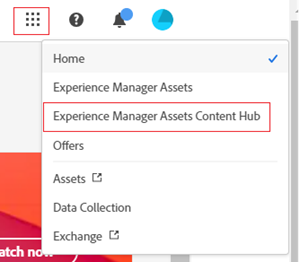
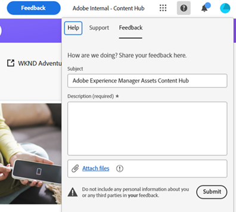
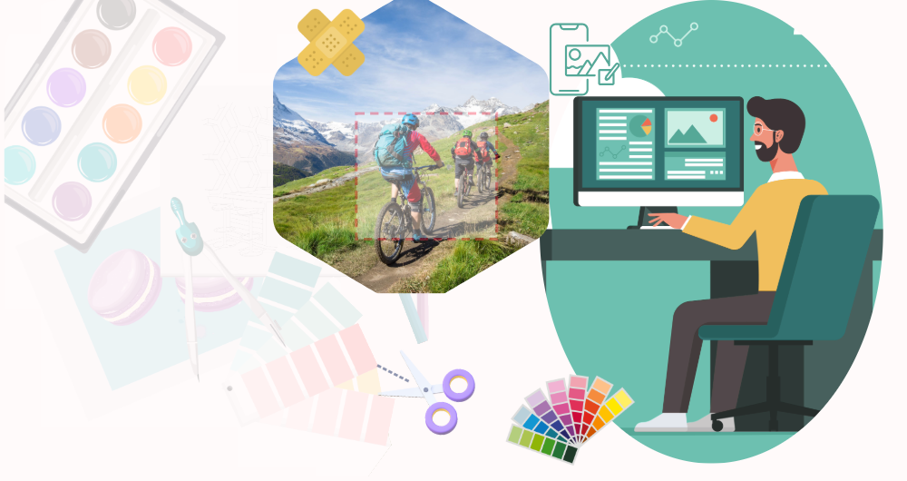

# Content Hub 概觀 {#overview-content-hub}

Content Hub 作為 Experience Manager Assets as a Cloud Service 的一部分提供，以實現組織及其業務合作夥伴對品牌內容的民主化存取權。其專注於分配資產以進行大規模啟用，並建立品牌內容變體來提高行銷靈敏度。

## Content Hub 示範 {#content-hub-demo}

>[!IMPORTANT]
>
>[Assets Ultimate](/help/assets/assets-ultimate-overview.md) 和 Assets as a Cloud Service 內含 250 位 Content Hub 受限制的使用者。[Assets Prime](/help/assets/assets-prime.md) 內含 50 位 Content Hub 受限制的使用者。

>[!VIDEO](https://video.tv.adobe.com/v/3463712)

## 為什麼要選擇 Content Hub？

Content Hub 提供以下主要優勢：

**在直覺式的入口網站中尋找和共用所有可用的品牌核准資產**

AEM Assets 可作為單一事實來源，而所有核准的資產都會以扁平的階層在 Content Hub 上自動提供，以改善搜尋體驗。

**可設定的使用者介面**

Content Hub 中最常見的屬性 (例如用於搜尋的篩選器、新增或匯入資產時可用的欄位、資產屬性、品牌化橫幅內容) 都是可設定的，管理員可以根據自己的需求輕鬆設定 Content Hub 使用者介面。

**讓非創意人員能夠編輯和混編內容，同時保持品牌形象**

Content Hub 可讓您使用 Adobe Express 來建立新內容 (如果您具有 Adobe Express 權益)。您可以使用易於使用的工具來編輯現有內容、使用範本和品牌元素製作品牌變化版本，並使用 Adobe Firefly 的最新 GenAI 功能來建立新內容。

## 先決條件 {#prerequisites-content-hub}

Content Hub 需要 Experience Manager as a Cloud Service 的生產作者環境，須為 2024.6 版本或更新版本 (最低需為 2024.6.16799 版本)。

## 如何存取 Content Hub？ {#access-content-hub}

[設定 Content Hub](/help/assets/deploy-content-hub.md) 並將使用者新增到 [Content Hub 產品設定檔](/help/assets/deploy-content-hub.md#content-hub-instance-product-profile)後，可以透過以下方式存取 Content Hub：

* 使用以下連結存取 Content Hub：

  `https://experience.adobe.com/#/assets/contenthub`

* 登入 [experience.adobe.com](https://auth.services.adobe.com/en_GB/index.html?callback=https%3A%2F%2Fims-na1.adobelogin.com%2Fims%2Fadobeid%2Fexc_app%2FAdobeID%2Ftoken%3Fredirect_uri%3Dhttps%253A%252F%252Fexperience.adobe.com%252F%2523old_hash%253Dold_hash%253D%252523%25252F%2526from_ims%253Dtrue%253Fclient_id%253Dexc_app%2526api%253Dauthorize%2526scope%253Dab.manage%252Caccount_cluster.read%252Cadditional_info%252Cadditional_info.job_function%252Cadditional_info.projectedProductContext%252Cadditional_info.roles%252CAdobeID%252Cadobeio.appregistry.read%252Cadobeio_api%252Caudiencemanager_api%252Ccreative_cloud%252Cmps%252Copenid%252Corg.read%252Cpps.read%252Cread_organizations%252Cread_pc%252Cread_pc.acp%252Cread_pc.dma_tartan%252Csession%26state%3D%257B%2522jslibver%2522%253A%2522v2-v0.31.0-2-g1e8a8a8%2522%252C%2522nonce%2522%253A%25222316022399331147%2522%257D%26code_challenge_method%3Dplain%26use_ms_for_expiry%3Dtrue&client_id=exc_app&scope=ab.manage%2Caccount_cluster.read%2Cadditional_info%2Cadditional_info.job_function%2Cadditional_info.projectedProductContext%2Cadditional_info.roles%2CAdobeID%2Cadobeio.appregistry.read%2Cadobeio_api%2Caudiencemanager_api%2Ccreative_cloud%2Cmps%2Copenid%2Corg.read%2Cpps.read%2Cread_organizations%2Cread_pc%2Cread_pc.acp%2Cread_pc.dma_tartan%2Csession&state=%7B%22jslibver%22%3A%22v2-v0.31.0-2-g1e8a8a8%22%2C%22nonce%22%3A%222316022399331147%22%7D&relay=64da7fa8-cd9e-47cf-9892-7f3ef3092f8c&locale=en_GB&flow_type=token&dctx_id=v%3A2%2Cs%2Cf%2Cb8e64530-b013-11ee-a6c1-e721bdec0171&idp_flow_type=login&response_type=token&profile_filter=%7B%22findFirst%22%3Atrue%2C+%22fallbackToAA%22%3Atrue%2C+%22preferForwardProfile%22%3Atrue%2C+%22searchEntireCluster%22%3Atrue%7D%3B+isOwnedByOrg%28%2776B329395DF155D60A495E2C%40AdobeOrg%27%29&code_challenge_method=plain&redirect_uri=https%3A%2F%2Fexperience.adobe.com%2F%23old_hash%3Dold_hash%3D%2523%252F%26from_ims%3Dtrue%3Fclient_id%3Dexc_app%26api%3Dauthorize%26scope%3Dab.manage%2Caccount_cluster.read%2Cadditional_info%2Cadditional_info.job_function%2Cadditional_info.projectedProductContext%2Cadditional_info.roles%2CAdobeID%2Cadobeio.appregistry.read%2Cadobeio_api%2Caudiencemanager_api%2Ccreative_cloud%2Cmps%2Copenid%2Corg.read%2Cpps.read%2Cread_organizations%2Cread_pc%2Cread_pc.acp%2Cread_pc.dma_tartan%2Csession&use_ms_for_expiry=true#/)，然後按一下「**[!UICONTROL 快速存取]**」區段中的「**[!UICONTROL Experience Manager Assets Content Hub]**」：
  

* 登入 [experience.adobe.com](https://auth.services.adobe.com/en_GB/index.html?callback=https%3A%2F%2Fims-na1.adobelogin.com%2Fims%2Fadobeid%2Fexc_app%2FAdobeID%2Ftoken%3Fredirect_uri%3Dhttps%253A%252F%252Fexperience.adobe.com%252F%2523old_hash%253Dold_hash%253D%252523%25252F%2526from_ims%253Dtrue%253Fclient_id%253Dexc_app%2526api%253Dauthorize%2526scope%253Dab.manage%252Caccount_cluster.read%252Cadditional_info%252Cadditional_info.job_function%252Cadditional_info.projectedProductContext%252Cadditional_info.roles%252CAdobeID%252Cadobeio.appregistry.read%252Cadobeio_api%252Caudiencemanager_api%252Ccreative_cloud%252Cmps%252Copenid%252Corg.read%252Cpps.read%252Cread_organizations%252Cread_pc%252Cread_pc.acp%252Cread_pc.dma_tartan%252Csession%26state%3D%257B%2522jslibver%2522%253A%2522v2-v0.31.0-2-g1e8a8a8%2522%252C%2522nonce%2522%253A%25222316022399331147%2522%257D%26code_challenge_method%3Dplain%26use_ms_for_expiry%3Dtrue&client_id=exc_app&scope=ab.manage%2Caccount_cluster.read%2Cadditional_info%2Cadditional_info.job_function%2Cadditional_info.projectedProductContext%2Cadditional_info.roles%2CAdobeID%2Cadobeio.appregistry.read%2Cadobeio_api%2Caudiencemanager_api%2Ccreative_cloud%2Cmps%2Copenid%2Corg.read%2Cpps.read%2Cread_organizations%2Cread_pc%2Cread_pc.acp%2Cread_pc.dma_tartan%2Csession&state=%7B%22jslibver%22%3A%22v2-v0.31.0-2-g1e8a8a8%22%2C%22nonce%22%3A%222316022399331147%22%7D&relay=64da7fa8-cd9e-47cf-9892-7f3ef3092f8c&locale=en_GB&flow_type=token&dctx_id=v%3A2%2Cs%2Cf%2Cb8e64530-b013-11ee-a6c1-e721bdec0171&idp_flow_type=login&response_type=token&profile_filter=%7B%22findFirst%22%3Atrue%2C+%22fallbackToAA%22%3Atrue%2C+%22preferForwardProfile%22%3Atrue%2C+%22searchEntireCluster%22%3Atrue%7D%3B+isOwnedByOrg%28%2776B329395DF155D60A495E2C%40AdobeOrg%27%29&code_challenge_method=plain&redirect_uri=https%3A%2F%2Fexperience.adobe.com%2F%23old_hash%3Dold_hash%3D%2523%252F%26from_ims%3Dtrue%3Fclient_id%3Dexc_app%26api%3Dauthorize%26scope%3Dab.manage%2Caccount_cluster.read%2Cadditional_info%2Cadditional_info.job_function%2Cadditional_info.projectedProductContext%2Cadditional_info.roles%2CAdobeID%2Cadobeio.appregistry.read%2Cadobeio_api%2Caudiencemanager_api%2Ccreative_cloud%2Cmps%2Copenid%2Corg.read%2Cpps.read%2Cread_organizations%2Cread_pc%2Cread_pc.acp%2Cread_pc.dma_tartan%2Csession&use_ms_for_expiry=true#/)，然後按一下產品切換器中的「**[!UICONTROL Experience Manager Assets Content Hub]**」：
  

## 提供 Content Hub 意見反應 {#provide-content-hub-feedback}

若要提供任何與產品相關的改進建議，請按一下位於 Content Hub 使用者介面頂端，貴組織名稱旁邊的「**[!UICONTROL 意見反應]**」。

指定主旨、建議的說明，並附上檔案 (如有需要)。按一下「**[!UICONTROL 提交]**」將意見反應提交給 Adobe。

## 為您的團隊設定 Content Hub {#setup-content-hub}

請依照以下步驟為您的團隊設定 Content Hub：

1. [使用 Cloud Manager 為 Experience Manager Assets 啟用 Content Hub](deploy-content-hub.md#enable-content-hub)。

1. [Content Hub 管理員上線](deploy-content-hub.md#onboard-content-hub-administrator)。

1. [新增重要 Content Hub 使用者](deploy-content-hub.md#onboard-content-hub-consumer-users)。

1. [以 DAM 作者或管理員的身分核准 Experience Manager Assets 中的資產](approve-assets.md)。

1. [以管理員的身分為其他使用者設定 Content Hub 使用者介面](configure-content-hub-ui-options.md)。

1. [將 Content Hub 存取權授予團隊中的更多使用者](deploy-content-hub.md#onboard-content-hub-consumer-users)。

1. [存取 Content Hub 入口網站](#access-content-hub)。

1. [提供 Content Hub 意見反應](#provide-content-hub-feedback)。

## 常見問題 {#faqs-content-hub-overview}

### 什麼是 Content Hub？ {#what-is-content-hub}

Content Hub是Adobe Experience Manager as a Cloud Service的一項功能，可讓更廣大的團隊透過直覺式的入口網站，輕鬆探索相關的已核准資產，並快速因應其需求進行調整。 如此可大規模散佈資產，並方便建立品牌內內容變體，以提升行銷靈敏度。

### 存取Content Hub的先決條件為何？ {#prerequisites-for-content-hub}

Content Hub需要Experience Manager as a Cloud Service的生產製作環境，尤其是2024.6版或更新版本(最低版本2024.6.16799)。

### Content Hub如何改善品牌核准資產的搜尋體驗？ {#content-hub-improves-search-experience}

Content Hub會以平面階層顯示所有已核准的資產，讓您更輕鬆地透過直覺式入口網站尋找及共用品牌已核准的資產。 此設定可簡化搜尋程式，並確保使用者能夠有效地找到所需的資產。

### 誰可以設定Content Hub使用者介面，以及有哪些方面可以設定？ {#content-hub-configuration}

管理員可以設定Content Hub使用者介面，包括搜尋篩選器、新增或匯入資產的欄位、資產屬性，以及品牌推廣的橫幅內容。 這可讓您根據組織需求進行自訂。

### Content Hub如何讓非創意人員編輯和重新混合內容？ {#content-hub-edit-remix-content}

Content Hub可讓非創意人員使用簡單易用的工具、範本和品牌元素，編輯現有內容並建立新的品牌內變數。 如果使用者擁有Adobe Express許可權，他們也可以運用Adobe Firefly GenAI功能建立進階內容。

### 使用者如何存取Content Hub？ {#content-hub-access}

使用者可透過直接連結(https://experience.adobe.com/#/assets/contenthub)存取Content Hub，或登入experience.adobe.com並從快速存取區段選取Experience Manager Assets Content Hub 。

### AEM Assets包括多少名Content Hub受限使用者？ {#content-hub-limited-users-with-aem-assets}

[Assets Ultimate](/help/assets/assets-ultimate-overview.md)和Assets as a Cloud Service各自包含250名Content Hub受限使用者，而[Assets Prime](/help/assets/assets-prime.md)包含50名Content Hub受限使用者。

## 深入了解重要功能 {#key-capabilities-content-module}

<table>
<td>
   
   

      <a href="/help/assets/configure-content-hub-ui-options.md">
      <strong>設定 Content Hub 使用者介面</strong>
      </a>
   

   

      <em>了解管理員如何設定 Content Hub 使用者介面。</em>
   

</td>

<td>
   
   

      <a href="/help/assets/search-assets-content-hub.md">
      <strong>搜尋 Content Hub 中的可用資產</strong>
      </a>
   

   

      <em>了解如何利用各種功能來縮小搜尋結果範圍。</em>
   

</td>
<td>
   
   

      <a href="/help/assets/edit-images-content-hub.md">
      <strong>使用 Adobe Express 編輯影像</strong>
      </a>
   

   

      <em>了解如何使用 Adobe Express 在 Content Hub 中建立影像變體</em>
   

</td>
</table>
<table>
<td>
   
   

      <a href="/help/assets/share-assets-content-hub.md">
      <strong>共用 Content Hub 中的可用資產</strong>
      </a>
   

   

      <em>了解如何將一或多項資產作為連結而共用，然後存取它們。</em>
   

</td>
<td>
   
   

      <a href="/help/assets/collections-content-hub.md">
      <strong>在 Content Hub 中管理集合</strong>
      </a>
   

   

      <em>了解如何使用資產建立集合並加以管理。</em>
   

</td>
<td>
   
   

      <a href="/help/assets/insights-content-hub.md">
      <strong>檢視 Content Hub 中的資產分析</strong>
      </a>
   

   

      <em>內容模組提供資產的珍貴分析，從而解決行銷利害關係人經常遇到的挑戰</em>
   

</td>
</table>
