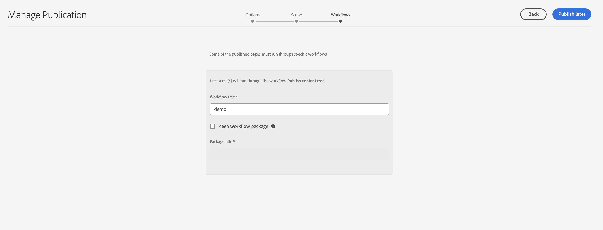

# 將資產發佈至Brand Portal {#publish-assets-to-brand-portal}

| 版本 | 文章連結 |
| -------- | ---------------------------- |
| AEM 6.5 | [按一下這裡](https://experienceleague.adobe.com/zh-hant/docs/experience-manager-65/content/assets/brandportal/brand-portal-publish-assets) |
| AEM as a Cloud Service  | 本文章 |

如果您是 Adobe Experience Manager (AEM) Assets 管理員，您可以將資產、資料夾和集合發佈至 AEM Assets Brand Portal 例項。此外，您也可以將資產或資料夾的發佈工作流程安排在之後的日期或時間。發佈後，Brand Portal 的使用者可以存取資產、資料夾和集合，並進一步將它們發佈給其他使用者。

不過，您必須先使用 Brand Portal 設定 AEM Assets。如需詳細資訊，請參閱[使用 Brand Portal 設定 AEM Assets](configure-aem-assets-with-brand-portal.md)。

如果您對 AEM Assets 的原始資產、資料夾或集合進行後續修改，您必須從 AEM Assets 重新發佈，這些變更才會反映在 Brand Portal 中。這項功能可確保對進行中工作所作的變更不會出現在 Brand Portal 中。Brand Portal 僅提供管理員發佈的已核准變更。

* [將資產發佈至Brand Portal](#publish-assets-to-bp)
* [將資料夾發佈至Brand Portal](#publish-folders-to-brand-portal)
* [將集合發佈至Brand Portal](#publish-collections-to-brand-portal)

>[!NOTE]
>
>Adobe 建議將發佈時間交錯開來，尤其建議選擇非尖峰時段，如此 AEM 作者才不會佔用過多資源。
>>Assets應批次發佈。 批次大小的建議為15K。
>> 將[!DNL Experience Manager Assets]當作[!DNL Cloud Service]，在實驗室條件下觀察到的傳輸速率為每小時1000個資產。 觀察到此速率，平均大小為10 MB資產。

## 將資產發佈至Brand Portal {#publish-assets-to-bp}

以下是從 AEM Assets 發佈資產到 Brand Portal 的步驟：

1. 從 Assets 控制台開啟父資料夾，並選取您要發佈的所有資產，然後在工具列按一下&#x200B;**[!UICONTROL 快速發佈]**&#x200B;選項。

   

1. 以下有兩種發佈資產的方式：
   * [現在發佈](#publish-to-bp-now) (立即發佈資產)
   * [稍後發佈](#publish-to-bp-later) (安排資產發佈時段)

### 立即發佈資產 {#publish-to-bp-now}

若要將所選資產發佈至 Brand Portal，請執行下列其中一項操作：

* 在工具列中選取&#x200B;**[!UICONTROL 快速發佈]**。然後在功能表中按一下&#x200B;**[!UICONTROL 發佈至 Brand Portal]**。

* 在工具列中選取&#x200B;**[!UICONTROL 管理出版物]**。

   1. 在&#x200B;**[!UICONTROL 動作]**&#x200B;中選取&#x200B;**[!UICONTROL 發佈至 Brand Portal]**。

      在&#x200B;**[!UICONTROL 排程]**&#x200B;中選取&#x200B;**[!UICONTROL 現在]**。

      按一下&#x200B;**[!UICONTROL 下一步]**。

   2. 在&#x200B;**[!UICONTROL 範圍]**&#x200B;中確認您的選取項目，然後按一下&#x200B;**[!UICONTROL 發佈至 Brand Portal]**。

系統會顯示訊息，指出資產已排入佇列，等候發佈至 Brand Portal。登入 Brand Portal 介面可查看已發佈的資產。

### 稍後發佈資產 {#publish-to-bp-later}

若要將資產發佈至 Brand Portal 的動作安排在之後的日期或時間：

1. 選取您要排程發佈的資產，然後在頂端的工具列按一下&#x200B;**[!UICONTROL 管理出版物]**。

1. 在&#x200B;**[!UICONTROL 管理出版物]**&#x200B;頁面上，在&#x200B;**[!UICONTROL 動作]**&#x200B;中選取&#x200B;**[!UICONTROL 發佈至 Brand Portal]**。

   在&#x200B;**[!UICONTROL 排程]**&#x200B;中選取&#x200B;**[!UICONTROL 稍後]**。

   <!---->

   

1. 選取&#x200B;**[!UICONTROL 啟用日期]**&#x200B;並指定時間。按一下&#x200B;**[!UICONTROL 下一步]**。

1. 選取&#x200B;**啟用日期**&#x200B;並指定時間。按一下&#x200B;**下一步**。

1. 在&#x200B;**[!UICONTROL 工作流程]**&#x200B;中指定&#x200B;**[!UICONTROL 工作流程標題]**。按一下&#x200B;**[!UICONTROL 稍後發佈]**。

   <!---->

   

>[!NOTE]
>
> * DAM-Users群組的現有使用者擁有路徑&quot;/conf/global/settings/cloudconfigs/mediaportal&quot;的讀取存取權
> * 新使用者（或非管理員使用者）需要下列許可權，才能在Brand Portal上發佈。
>   > 路徑：
>   > `"/conf/global/settings/cloudconfigs/mediaportal" : jcr:read `
>   >`/libs : jcr:read`
>   >`/conf : jcr:read`
>   >`/content : jcr:read, crx:replicate`
>   >`/content/dam/ : jcr:read,modify, crx:replicate`

## 將資料夾發佈至Brand Portal {#publish-folders-to-brand-portal}

您可以立即發佈或取消發佈資產資料夾，或安排至之後的日期或時間。

### 將資料夾發佈至Brand Portal {#publish-folders-to-bp}

1. 從 Assets 控制台選取您要發佈的資料夾，然後在工具列按一下&#x200B;**[!UICONTROL 快速發佈]**&#x200B;選項。

   

1. **現在發佈資料夾**

   若要將所選資料夾發佈至 Brand Portal，請執行下列其中一項操作：

   * 在工具列中選取&#x200B;**[!UICONTROL 快速發佈]**。

     在功能表中選取&#x200B;**[!UICONTROL 發佈至 Brand Portal]**。

   * 在工具列中選取&#x200B;**[!UICONTROL 管理出版物]**。

      1. 在&#x200B;**[!UICONTROL 動作]**&#x200B;中選取&#x200B;**[!UICONTROL 發佈至 Brand Portal]**。

         在&#x200B;**[!UICONTROL 排程]**&#x200B;中選取&#x200B;**[!UICONTROL 現在]**。

         按一下&#x200B;**下一步**。

      1. 在&#x200B;**[!UICONTROL 範圍]**&#x200B;中確認您的選取項目，然後按一下&#x200B;**[!UICONTROL 發佈至 Brand Portal]**。

   系統會顯示訊息，指出資料夾已排入佇列，等候發佈至 Brand Portal。登入 Brand Portal 介面可查看已發佈的資料夾。

1. **稍後發佈資料夾**
若要將資產資料夾的發佈動作安排在之後的日期或時間：

   1. 選取您要排程發佈的資料夾，然後在頂端的工具列選取&#x200B;**[!UICONTROL 管理出版物]**。
   1. 在&#x200B;**[!UICONTROL 動作]**&#x200B;中選取&#x200B;**[!UICONTROL 發佈至 Brand Portal]**。

      在&#x200B;**[!UICONTROL 排程]**&#x200B;中選取&#x200B;**[!UICONTROL 稍後]**。

   1. 選取&#x200B;**[!UICONTROL 啟用日期]**&#x200B;並指定時間。按一下&#x200B;**[!UICONTROL 下一步]**。

      <!---->

   

   1. 在&#x200B;**[!UICONTROL 範圍]**&#x200B;中確認您的選取項目。按一下&#x200B;**[!UICONTROL 下一步]**。

   1. 在&#x200B;**[!UICONTROL 工作流程]**&#x200B;底下指定「工作流程標題」。按一下&#x200B;**[!UICONTROL 稍後發佈]**。

      <!---->

   

### 檢視已發佈至Brand Portal的檔案或資料夾 {#view-published-file-folder}

1. 登入 Brand Portal 介面可查看已發佈的資產 (視您安排的日期或時間而定)。

   

1. 切換到清單檢視以檢視資產目前的發佈狀態。

<!--2. On the [Asset Reports page](#https://experienceleague.adobe.com/en/docs/experience-manager-cloud-service/content/assets/admin/asset-reports), you can see the current state of the report job, for example, Success, Failed, Queued, or Scheduled.-->

### 從Brand Portal取消發佈資料夾 {#unpublish-folders-from-brand-portal}

您可以從 AEM Assets 例項中透過取消發佈來移除任何已發佈至 Brand Portal 的資產資料夾。取消發佈原始資料夾後，Brand Portal 使用者將無法再取用資料夾副本。

您可以從 Brand Portal 立即取消發佈資產資料夾，或安排在之後的日期和時間。

若要從 Brand Portal 取消發佈資產資料夾：

1. 從 Assets 控制台選取您要取消發佈的資料夾，然後在工具列按一下&#x200B;**[!UICONTROL 管理出版物]**&#x200B;選項。

   

1. **現在取消發佈資產資料夾**

   若要從 Brand Portal 立即取消發佈所選資產資料夾：

   1. 在工具列中選取&#x200B;**[!UICONTROL 管理出版物]**。

   1. 在&#x200B;**[!UICONTROL 動作]**&#x200B;中選取&#x200B;**[!UICONTROL 從 Brand Portal 取消發佈]**。

      在&#x200B;**[!UICONTROL 排程]**&#x200B;中選取&#x200B;**[!UICONTROL 現在]**。

      按一下&#x200B;**[!UICONTROL 下一步]**。

   1. 在&#x200B;**[!UICONTROL 範圍]**&#x200B;中確認您的選取項目，然後按一下&#x200B;**[!UICONTROL 從 Brand Portal 取消發佈]**。

      

1. **稍後取消發佈資產資料夾**

   若要將取消資產資料夾發佈的動作安排在之後的日期或時間：

   1. 在工具列中選取&#x200B;**[!UICONTROL 管理出版物]**。

   1. 在&#x200B;**[!UICONTROL 動作]**&#x200B;中選取&#x200B;**[!UICONTROL 從 Brand Portal 取消發佈]**。

      在&#x200B;**[!UICONTROL 排程]**&#x200B;中選取&#x200B;**[!UICONTROL 稍後]**。

   1. 選取&#x200B;**[!UICONTROL 啟用日期]**&#x200B;並指定時間。按一下&#x200B;**[!UICONTROL 下一步]**。

   1. 在&#x200B;**[!UICONTROL 範圍]**&#x200B;中確認您的選取項目，然後按一下&#x200B;**[!UICONTROL 下一步]**。

   1. 在&#x200B;**[!UICONTROL 工作流程]**&#x200B;中指定&#x200B;**[!UICONTROL 工作流程標題]**。按一下&#x200B;**[!UICONTROL 稍後取消發佈]**。

      

## 將集合發佈至Brand Portal {#publish-collections-to-brand-portal}

您可以從 AEM Assets 雲端例項發佈或取消發佈集合。

>[!NOTE]
>
>內容片段無法發佈至 Brand Portal。因此，如果您在 AEM Assets 中選取內容片段，就無法使用&#x200B;**[!UICONTROL 發佈至 Brand Portal]**&#x200B;動作。
>
>如果從 AEM Assets 將含有內容片段的集合發佈至 Brand Portal，則除了內容片段以外，資料夾的所有內容都會複製至 Brand Portal 介面。

### 發佈集合 {#publish-collections}

以下是從 AEM Assets 發佈集合到 Brand Portal 的步驟：

1. 在 AEM Assets UI 中按一下 AEM 標誌。

1. 從&#x200B;**導覽**&#x200B;頁面，前往&#x200B;**[!UICONTROL 資產]** > **[!UICONTROL 集合]**。

1. 在&#x200B;**集合**&#x200B;控制台中，選取您要發佈至 Brand Portal 的集合。

   

1. 從工具列中按一下&#x200B;**[!UICONTROL 發佈至 Brand Portal]**。

1. 在確認對話方塊中，按一下&#x200B;**[!UICONTROL 發佈]**。

1. 關閉確認訊息。

   以管理員身分登入 Brand Portal。已發佈的集合可在「集合」控制台中使用。

   

### 取消發佈集合 {#unpublish-collections}

您可以從 AEM Assets 例項中透過取消發佈，移除任何已發佈至 Brand Portal 的集合。取消發佈原始集合後，Brand Portal 使用者將無法再使用集合的副本。

以下是取消發佈集合的步驟：

1. 在 AEM Assets 例項的&#x200B;**集合**&#x200B;控制台中，選取您要取消發佈的集合。

   

1. 在工具列中按一下&#x200B;**[!UICONTROL 從 Brand Portal 移除]**&#x200B;圖示。
1. 在對話方塊中，按一下&#x200B;**[!UICONTROL 取消發佈]**。
1. 關閉確認訊息。集合會從 Brand Portal 介面中移除。

除了上述操作，您也可以從 AEM Assets 將中繼資料結構、影像預設集、搜尋 Facet 和標籤發佈至 Brand Portal。

* [將預設集、結構和 Facet 發佈至 Brand Portal](https://experienceleague.adobe.com/docs/experience-manager-brand-portal/using/publish/publish-schema-search-facets-presets.html)
* [將標記發佈至 Brand Portal](https://experienceleague.adobe.com/docs/experience-manager-brand-portal/using/publish/brand-portal-publish-tags.html)

如需詳細資訊，請參閱 [Brand Portal 文件](https://experienceleague.adobe.com/docs/experience-manager-brand-portal/using/home.html)。

<!--
   Comment Type: draft

   <li> </li>
   -->

<!--
   Comment Type: draft

   <li>Step text</li>
   -->

**另請參閱**

* [翻譯資產](translate-assets.md)
* [Assets HTTP API](mac-api-assets.md)
* [資產支援的檔案格式](file-format-support.md)
* [搜尋資產](search-assets.md)
* [連接的資產](use-assets-across-connected-assets-instances.md)
* [資產報表](asset-reports.md)
* [中繼資料結構描述](metadata-schemas.md)
* [下載資產](download-assets-from-aem.md)
* [管理中繼資料](manage-metadata.md)
* [搜尋 Facet](search-facets.md)
* [管理收藏集](manage-collections.md)
* [大量中繼資料匯入](metadata-import-export.md)
* [發佈資產至 AEM 和 Dynamic Media](/help/assets/publish-assets-to-aem-and-dm.md)