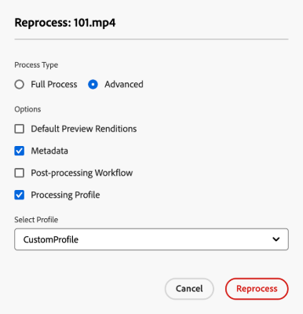

# 重新處理數位資產 {#reprocessing-digital-assets}

<table>
    <tr>
        <td>
            <i>全新</i><a href="/help/assets/dynamic-media/dm-prime-ultimate.md"><b>Dynamic Media Prime 與 Ultimate</b></a>
        </td>
        <td>
            <i>全新</i><a href="/help/assets/assets-ultimate-overview.md"><b>AEM Assets Ultimate</b></a>
        </td>
        <td>
            <i>全新</i><a href="/help/assets/integrate-aem-assets-edge-delivery-services.md"><b>AEM Assets 與 Edge Delivery Services 整合</b></a>
        </td>
        <td>
            <i>全新</i><a href="/help/assets/aem-assets-view-ui-extensibility.md"><b>使用者介面可擴充性</b></a>
        </td>
          <td>
            <i>全新</i><a href="/help/assets/dynamic-media/enable-dynamic-media-prime-and-ultimate.md"><b>啟用 Dynamic Media Prime 與 Ultimate</b></a>
        </td>
    </tr>
    <tr>
        <td>
            <a href="/help/assets/search-best-practices.md"><b>搜尋最佳實務</b></a>
        </td>
        <td>
            <a href="/help/assets/metadata-best-practices.md"><b>中繼資料最佳實務</b></a>
        </td>
        <td>
            <a href="/help/assets/product-overview.md"><b>Content Hub</b></a>
        </td>
        <td>
            <a href="/help/assets/dynamic-media-open-apis-overview.md"><b>具有 OpenAPI 功能的 Dynamic Media</b></a>
        </td>
        <td>
            <a href="https://developer.adobe.com/experience-cloud/experience-manager-apis/"><b>AEM Assets 開發人員文件</b></a>
        </td>
    </tr>
</table>

若資料夾中已有您後來加以變更的現有中繼資料設定檔，您可以重新處理該資料夾中的資產。 如果您要將新編輯的預設集重新套用至資料夾中的現有資產，則必須重新處理資料夾。 您可以視需要重新處理儘可能多的資產。

如果您遇到以下兩種情況之一，請重新處理資料夾中的資產：

* 您想要對已上傳資產的現有資產資料夾執行批次集預設集。
* 您稍後會編輯先前套用至資產資料夾的現有批次集預設集。

## 重新處理資產 {#reprocessing-steps}

若要重新處理資料夾中的資產：

1. 在[!DNL Assets view]中，從Assets頁面選取新新增的資產或您要重新處理的資產。
如果您選取資料夾：

   * 工作流程會遞回考慮所選資料夾中的所有檔案。
   * 如果主要選取檔案夾中有一個或多個子檔案夾具有資產，工作流程會重新處理檔案夾階層中的每個資產。
   * 最佳實務是避免在擁有超過1000個資產的資料夾階層上執行此工作流程。

1. 選取&#x200B;**[!UICONTROL 重新處理Assets]**。 選擇兩個選項：

   

   * **[!UICONTROL 完整處理序]：**&#x200B;當您要執行整個處理序(包括預設設定檔、自訂設定檔、動態處理（若已設定）)和後續處理工作流程時，請選取此選項。
   * **[!UICONTROL 進階]：**&#x200B;選取此選項以選擇進階重新處理。

     

     從下列進階選項中選取：

      * **[!UICONTROL 預設預覽轉譯]：**&#x200B;當您要重新處理預設預覽的轉譯時，請選擇此選項。

      * **[!UICONTROL 中繼資料]：**&#x200B;當您想要擷取所選資產的中繼資料資訊和智慧標籤時，請選擇此選項。

      * **[!UICONTROL 處理設定檔]：**&#x200B;當您要重新處理選取的設定檔時，請選擇此選項。 您可以選擇&#x200B;**[!UICONTROL 完整處理序]**&#x200B;選項，以包含預設處理以及在資料夾層級指派的自訂設定檔。
        <!--When assets are uploaded to a folder, [!DNL Assets ~~view~~] checks the containing folder's properties for a processing profile. If none is applied, a parent folder in the hierarchy is checked for a processing profile to apply.-->

      * **[!UICONTROL 後續處理工作流程]：**&#x200B;如果必須使用處理設定檔才能完成額外的資產處理，請選擇此選項。 可以將其他後處理工作流程新增到設定。 後處理可讓您在使用資產微服務的可設定處理之上新增完全自訂處理。

請參閱[使用資產微服務和處理設定檔](https://experienceleague.adobe.com/docs/experience-manager-cloud-service/content/assets/manage/asset-microservices-configure-and-use.html?lang=zh-Hant)，以進一步瞭解處理設定檔和後續處理工作流程。

選取適當的選項後，按一下&#x200B;**[!UICONTROL 重新處理]**。 成功訊息隨即顯示。

## 重新處理數位資產的情況 {#scenarios-reprocessing}

[!DNL Experience Manager]允許重新處理下列元件的數位資產。

### 智慧標記 {#reprocessing-smart-tags}

處理數位資產的組織越來越多地在資產中繼資料中使用分類控制的辭彙。 基本上，它包括員工、合作夥伴和客戶通常用來參照和搜尋特定類別數位資產的關鍵字清單。 使用分類控制的辭彙來標籤資產，可確保輕鬆識別和擷取資產。

相較於自然語言辭彙，根據商業分類法標籤數位資產有助於讓其與公司的業務保持一致，並確保最相關的資產出現在搜尋中。

深入瞭解[重新處理DAM](https://experienceleague.adobe.com/docs/experience-manager-cloud-service/content/assets/manage/color-tag-images.html?lang=zh-Hant#color-tags-existing-images)中現有影像的顏色標籤。

### 智慧型裁切 {#reprocessing-smart-crop}

深入瞭解[Dynamic Media智慧型裁切](https://experienceleague.adobe.com/docs/experience-manager-cloud-service/content/assets/dynamicmedia/image-profiles.html?lang=zh-Hant)，可讓您套用特定的裁切（**[!UICONTROL 智慧型裁切]**&#x200B;和畫素裁切）和銳利化設定至上傳的資產。

### 中繼資料 {#reprocessing-metadata}

[!DNL Adobe Experience Manager Assets]保留每個資產的中繼資料。 它可讓您更輕鬆地分類及組織資產，並協助尋找特定資產的人。 有了從上傳至Experience Manager Assets的檔案擷取中繼資料的功能，中繼資料管理與創意工作流程整合。 有了使用資產保留和管理中繼資料的功能，您可以根據資產的中繼資料自動組織和處理資產。

深入瞭解[重新處理中繼資料設定檔](https://experienceleague.adobe.com/docs/experience-manager-cloud-service/content/assets/manage/metadata-profiles.html?lang=zh-Hant)。

### 重新處理資料夾中的Dynamic Media資產 {#reprocessing-dynamic-media}

若資料夾中已有您後來變更過的Dynamic Media影像設定檔或Dynamic Media視訊設定檔，您可以重新處理該資料夾中的資產。 如需詳細資訊，請造訪[重新處理資料夾](https://experienceleague.adobe.com/docs/experience-manager-cloud-service/content/assets/admin/about-image-video-profiles.html?lang=zh-Hant)中的Dynamic Media資產。

>[!NOTE]
>
>您需要在環境中設定[!DNL Dynamic Media]以啟用Dynamic Media對話方塊。
>

### 工作流程

深入瞭解[處理設定檔與後續處理工作流程](https://experienceleague.adobe.com/docs/experience-manager-cloud-service/content/assets/manage/asset-microservices-configure-and-use.html?lang=zh-Hant)。
