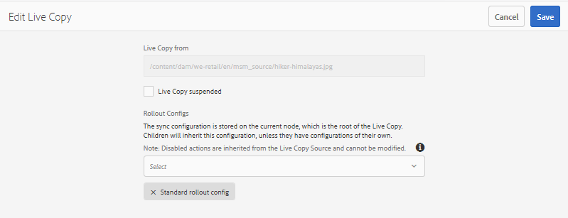

# 對[!DNL Assets]使用MSM重複使用資產 {#reuse-assets-using-msm-for-assets}

[!DNL Adobe Experience Manager]中的多站點管理器(MSM)功能使用戶能夠重複使用一次創作的內容，並可跨多個Web位置重複使用。 數位資產也可使用[!DNL Assets]名稱MSM的相同功能。 對[!DNL Assets]使用MSM，您可以：

* 只需建立資產一次，然後複製這些資產，以便在網站的其他區域重複使用。
* 保持多個副本同步，並更新一次原始主副本以將更改推送到子副本。
* 暫時或永久暫停父資產和子資產之間的連結，以進行本機變更。

## 了解MSM的優點和概念 {#concepts}

### 運作方式與優點 {#how-it-works-and-the-benefits}

若要了解在多個Web位置重複使用相同內容（文字和資產）的使用案例，請參閱[可能的MSM案例](/help/sites-cloud/administering/msm/overview.md)。 [!DNL Experience Manager] 維護原始資產與其連結副本之間的連結，稱為即時副本(LC)。維護的連結可將集中的變更推送至多個即時副本。 這樣可以更快地更新，同時消除管理重複副本的限制。 變更的傳播是無誤的，是集中的。 此功能允許儲存受選定即時副本限制的更新空間。 使用者可以分離連結（即中斷繼承），並進行下次更新主副本並執行變更時不會覆寫的本機編輯。 您可以對一些選取的中繼資料欄位或整個資產進行分離。 它允許靈活地在本機更新原來繼承自主副本的資產。

MSM會維護來源資產與其即時副本之間的即時關係，以便：

* 對來源資產的變更也會套用（轉出）至即時副本，即即時副本會與來源同步。
* 您可以暫停即時關係以更新即時副本，或移除少數有限欄位的繼承。 對來源的修改不再套用至即時副本。

### [!DNL Assets]術語的MSM辭匯表 {#glossary}

**來源：** 原始資產或資料夾。從中派生即時副本的主副本。

**即時副本：** 與其來源同步的來源資產/資料夾復本。Live Copy可以是更多Live Copy的源。 了解如何建立LC。

**繼承：** 即時副本資產/資料夾與其來源之間的連結/參考，系統會用來記住要將更新傳送至何處。中繼資料欄位的繼承存在於精細的層級。 可以為選擇性中繼資料欄位移除繼承，同時保留來源與其即時副本之間的即時關係。

**轉出：** 將對來源所做的修改推送到下游的即時副本的動作。可以使用轉出動作，一次更新一或多個即時副本。 請參閱轉出。

**轉出設定：** 決定要同步哪些屬性、同步方式和時間的規則。建立Live Copy時會套用這些設定；可稍後編輯；子項可從其父項資產繼承轉出設定。 針對[!DNL Assets]的MSM，僅使用標準轉出設定。 其他轉出設定不適用於[!DNL Assets]的MSM。

**同步：** 除了轉出以外，還有另一個動作，可從來源將更新傳送至即時副本，借此在來源與其即時副本之間取得同等。系統會起始特定即時副本的同步作業，且動作會從來源提取變更。 使用此動作，只能更新其中一個即時副本。 請參閱同步操作。

**暫停：** 暫時移除即時副本與其來源資產/資料夾之間的即時關係。你可以恢復關係。 請參閱暫停動作。

**繼續：** 繼續即時關係，讓即時副本再次開始從來源接收更新。請參閱繼續動作。

**重置：** 重置操作通過覆蓋任何本地更改，使即時副本再次成為源的副本。它也會移除繼承取消，並重設所有中繼資料欄位的繼承。 若要日後進行本機修改，您必須再次取消特定欄位的繼承。 請參閱LC的本機修改。

**分離：** 不可撤銷地移除即時副本資產/資料夾的即時關係。分離操作後，即時副本永遠不會接收來自源的更新，並且不再是即時副本。 請參閱刪除關係。

## 建立資產的即時副本 {#create-livecopy}

若要從一或多個來源資產或資料夾建立即時副本，請遵循下列其中一項操作：

* 方法1:選取來源資產，然後從頂端的工具列按一下「建立&#x200B;**[!UICONTROL >**[!UICONTROL &#x200B;即時副本&#x200B;]**」。]**
* 方法2:在[!DNL Experience Manager]使用者介面中，按一下介面右上角的「建立&#x200B;**[!UICONTROL >**[!UICONTROL &#x200B;即時副本」。]**]**

您可以一次建立資產或資料夾的即時副本。 您可以建立衍生自資產或即時副本本身之資料夾的即時副本。 使用案例不支援內容片段(CF)。 嘗試建立其Live Copy時，CF會照原樣複製，沒有任何關係。 複製的CF是及時的快照，在更新原始CF時不會更新。

若要使用第一個方法建立Live Copy，請執行下列步驟：

1. 選取來源資產或資料夾。 在工具列中，按一下「**[!UICONTROL 建立]** > **[!UICONTROL 即時副本]**」。

   ![從介面建立即 [!DNL Experience Manager] 時副本](assets/create_lc1.png)

   *圖：從介面建立即 [!DNL Experience Manager] 時副本。*

1. 選擇目標資料夾。 按一下&#x200B;**[!UICONTROL 下一步]**。
1. 提供標題和名稱。 資產沒有子項。 建立資料夾的即時副本時，您可以選擇包含或排除子項。
1. 選取轉出設定。 按一下&#x200B;**[!UICONTROL 建立]**。

若要使用第二種方法建立即時副本，請依照下列步驟操作：

1. 在[!DNL Experience Manager]介面中，從右上角按一下&#x200B;**[!UICONTROL Create]** > **[!UICONTROL Live Copy]**。

   ![從介面建立即 [!DNL Experience Manager] 時副本](assets/create_lc2.png)

   *圖：從介面建立即 [!DNL Experience Manager] 時副本。*

1. 選取來源資產或資料夾。 按一下&#x200B;**[!UICONTROL 下一步]**。
1. 選擇目標資料夾。 按一下&#x200B;**[!UICONTROL 下一步]**。
1. 提供標題和名稱。 資產沒有子項。 建立資料夾的即時副本時，您可以選擇包含或排除子項。
1. 選取轉出設定。 按一下&#x200B;**[!UICONTROL 建立]**。

>[!NOTE]
>
>移動源或即時副本時，將保留關係。 刪除即時副本時，將刪除關係。

## 查看源副本和即時副本的各種屬性和狀態 {#properties}

您可以從[!DNL Experience Manager]使用者介面的各個區域檢視即時副本的資訊和MSM相關狀態，例如關係、同步、轉出等。

下列兩種方法適用於資產和資料夾：

* 選取即時複製資產，並在其「屬性」頁面中尋找資訊。
* 從[!UICONTROL 即時副本控制台]中選擇源資料夾並查找每個即時副本的詳細資訊。

>[!TIP]
>
>要檢查幾個單獨Live Copy的狀態，請使用第一個方法檢查&#x200B;**[!UICONTROL Properties]**&#x200B;頁。 要檢查多個即時副本的狀態，請使用第二個方法檢查&#x200B;**[!UICONTROL 關係狀態]**&#x200B;頁。

### 即時副本的資訊和狀態 {#status-lc-asset}

若要檢查即時副本資產或資料夾的資訊和狀態，請遵循下列步驟。

1. 選取即時複製資產或資料夾。 從工具欄按一下「**[!UICONTROL 屬性]**」。 或者，使用鍵盤快捷鍵`p`。
1. 按一下「**[!UICONTROL 即時副本]**」。 您可以檢查來源的路徑、暫停狀態、同步狀態、上次轉出日期，以及上次轉出的使用者。

   

   *圖：即時副本資訊和狀態。*

1. 如果子資產借用即時副本設定，您可以啟用或停用。

1. 您可以選擇即時副本的選項，以繼承父項的轉出設定或變更設定。

### 資料夾所有即時副本的資訊和狀態 {#status-lc-folder}

[!DNL Experience Manager] 提供一個控制台，用於檢查源資料夾的所有即時副本的樣式。此主控台會顯示所有子資產的狀態。

1. 選擇源資料夾。 從工具欄按一下「**[!UICONTROL 屬性]**」。 或者，使用鍵盤快捷鍵`p`。
1. 按一下「 **[!UICONTROL 即時複製來源」]**。若要開啟主控台，請按一下「即 **[!UICONTROL 時複製概述」]**。此控制面板提供所有子資產的頂層狀態。

   

   *圖：在源的Live Copy控制台中查 [!UICONTROL 看Live ] Copy的狀態。*

1. 若要檢視即時副本檔案夾中每個資產的詳細資訊，請選取資產，然後從工具列按一 **[!UICONTROL 下「關係狀態]** 」。

   

   資料夾中即時副本子資產的詳細資訊和狀態

>[!TIP]
>
>您可以快速查看其他資料夾的即時副本狀態，而無需瀏覽太多。 從&#x200B;**[!UICONTROL 即時副本概述]**&#x200B;介面的中上部更改資料夾。

### 從「參考」(References)邊欄為源執行快速操作 {#ref-rail-source}

對於來源資產或資料夾，您可以看到下列資訊，並直接從「參考」邊欄採取下列動作：

* 請參閱Live Copy的路徑。
* 在[!DNL Experience Manager]使用者介面中開啟或顯示特定即時副本。
* 將更新同步到特定的即時副本。
* 暫停關係或變更特定即時副本的轉出設定。
* 存取即時副本概述主控台。

選取來源資產或資料夾，開啟左側邊欄，然後按一下「**[!UICONTROL 參考]**」。 或者，選取資產或檔案夾，然後使用鍵盤快速鍵 `Alt + 4`。

*圖：「參考」(References)邊欄中所選源的可用操作和資訊。*

針對特定即時副本，按一下「編輯即時副本」**[!UICONTROL 以暫停關係或變更轉出設定。]**

*圖：暫停關係或變更特定即時副本的轉出設定。*

### 從「參考」邊欄快速動作即時副本 {#ref-rail-lc}

若為即時複製資產或資料夾，您可以看到下列資訊，並直接從「參考」邊欄採取下列動作：

* 查看源的路徑。
* 在[!DNL Experience Manager]使用者介面中開啟或顯示特定即時副本。
* 推出更新。

選取即時複製資產或資料夾，開啟左側導軌，然後按一下「參 **[!UICONTROL 考」]**。或者，選取資產或檔案夾，然後使用鍵盤快速鍵 `Alt + 4`。

*圖：在「參考」(References)邊欄中，所選即時副本的可用動作。*

## 將修改從來源傳播至即時副本 {#rollout-sync}

修改來源後，變更可以透過同步動作或轉出動作傳播至即時副本。 若要了解這兩個動作之間的差異，請參閱[字彙表](#glossary)。

### 轉出動作 {#rollout}

您可以從來源資產啟動轉出動作，並更新所有或部分選取的即時副本。

1. 選取即時複製資產或資料夾。 從工具欄按一下「**[!UICONTROL 屬性]**」。 或者，使用鍵盤快捷鍵`p`。
1. 按一下「 **[!UICONTROL 即時複製來源」]**。從工具列按一下&#x200B;**[!UICONTROL 轉出]**。
1. 選取您要更新的即時副本。 按一下&#x200B;**[!UICONTROL 轉出]**。
1. 若要轉出對子資產進行的更新，請選取&#x200B;**[!UICONTROL 轉出來源和所有子項]**。

   

   *圖：將來源修改轉出為幾個或所有即時副本。*

>[!NOTE]
>
>在來源資產中所做的修改只會推出至直接相關的即時副本。 如果即時副本衍生自另一個即時副本，則修改不會轉出至衍生的即時副本。

或者，您也可以在選取特定即時副本後，從「參考」邊欄起始轉出動作。 如需詳細資訊，請參閱「參考」邊欄的[快速動作，以取得即時副本](#ref-rail-lc)。 在此轉出方法中，只會更新選取的即時副本及其子項（選擇性）。

*圖：將來源修改轉出至所選即時副本。*

### 關於同步操作 {#about-sync}

同步操作只會將修改從源提取到所選的即時副本。 同步動作會尊重並維護取消繼承後完成的本機修改。 不會覆寫本機修改，且取消的繼承不會重新建立。 您可以透過三種方式啟動同步動作。

| 其中[!DNL Experience Manager]介面中 | 使用時機和原因 | 如何使用 |
|---|---|---|
|  參考欄 | 已選擇源時，快速同步。 | 請參閱來源](#ref-rail-source)的「參考」邊欄的「快速動作」[ |
| [!UICONTROL 屬性]頁中的工具欄 | 在您已開啟即時副本屬性時啟動同步。 | 請參閱[同步即時副本](#sync-lc) |
| [!UICONTROL 即時副本概] 觀主控台 | 選取來源資料夾或[!UICONTROL 即時副本概述]主控台已開啟時，快速同步多個資產（不一定全部）。 一次會針對一個資產起始同步動作，但是這是一次就多個資產同步的更快方式。 | 請參閱即時副本資料夾中許多資產的動作](#bulk-actions)[ |

### 同步即時副本 {#sync-lc}

若要啟動同步動作，請開啟即 **[!UICONTROL 時副本的「屬性]** 」頁面，按一下「即時 **** 副本」，然後從工具列按一下所要的動作。

要查看與同步操作相關的狀態和資訊，請參 [閱即時副本的資訊和狀態](#status-lc-asset)[以及資料夾所有即時副本的狀態](#status-lc-folder)。

*圖：同步操作提取對源所做的更改。*

>[!NOTE]
>
>如果掛起關係，則工具欄中不提供同步操作。 雖然「參考」邊欄中有同步動作可用，但即使成功轉出，修改也不會傳播。

## 暫停和恢復關係 {#suspend-resume}

您可以暫時暫停關係，以防止即時副本收到對來源資產或資料夾所做的修改。 也可以恢復關係，以便即時副本開始從來源接收修改。

若要暫停或繼續，請開啟即 **[!UICONTROL 時副本的「屬性]** 」頁面，按一下「即時副本 **** 」，然後從工具列按一下所要的動作。

或者，您也可以從即時副本概述主控台，快速暫停或繼續即時副本資料夾中多 **[!UICONTROL 個資產的關係]** 。請參 [閱對即時副本資料夾中的許多資產採取動作](#bulk-actions)。

## 對即時副本進行本機修改 {#local-mods}

Live Copy是建立原始源時的副本。 即時副本的中繼資料值繼承自來源。 中繼資料欄位個別地維護與來源資產之個別欄位的繼承。

不過，您有彈性對即時副本進行本機修改，以變更一些選取的屬性。若要進行本機修改，請取消所要屬性的繼承。當取消一個或多個元資料欄位的繼承時，保留資產的即時關係和其它元資料欄位的繼承。任何同步或轉出都不會覆寫本機修改。若要這麼做，請開啟即時復本資產的&#x200B;**[!UICONTROL 屬性]**&#x200B;頁面，按一下中繼資料欄位旁的&#x200B;**[!UICONTROL 取消繼承]**&#x200B;選項。

您可以還原所有本機修改，並將資產還原為其來源狀態。 不可撤銷且立即重設動作，會覆寫所有本機修改，並重新建立所有中繼資料欄位的繼承。 若要還原，請從即時副本資產的&#x200B;**[!UICONTROL 屬性]**&#x200B;頁面，按一下工具列中的&#x200B;**[!UICONTROL 重設]**。

*圖：「重設」動作會覆寫本機編輯內容，並將即時副本部分與其來源連結。*

## 移除即時關係 {#detach}

您可以使用「分離」操作完全刪除源和即時副本之間的關係。 分離即時副本後，即時副本會變成獨立資產或資料夾。 在分離後，它會立即在[!DNL Experience Manager]介面中顯示為新資產。 要從源分離即時副本，請執行以下步驟。

1. 選取即時複製資產或資料夾。 從工具欄按一下「**[!UICONTROL 屬性]**」。 或者，使用鍵盤快捷鍵`p`。

1. 按一下「**[!UICONTROL 即時副本]**」。 按一下工具欄中的&#x200B;**[!UICONTROL 分離]**。 從顯示的對話框中按一下&#x200B;**[!UICONTROL 分離]**。

   

   *圖：「分離」操作完全刪除了源副本和即時副本之間的關係。*

   >[!CAUTION]
   >
   >從對話框中按一下&#x200B;**[!UICONTROL Detach]**&#x200B;時，將立即刪除該關係。 您無法通過按一下「屬性」頁上的&#x200B;**[!UICONTROL 取消]**&#x200B;來撤消它。

或者，您也可以從&#x200B;**[!UICONTROL 即時副本概述]**&#x200B;主控台快速分離即時副本資料夾中的多個資產。 請參 [閱對即時副本資料夾中的許多資產採取動作](#bulk-actions)。

## 即時副本資料夾中的大量動作 {#bulk-actions}

如果即時副本資料夾中有多個資產，對每個資產啟動動作可能會相當繁瑣。 您可以從[!UICONTROL 即時副本控制台]快速啟動許多資產的基本動作。 上述方法仍適用於個別資產。

1. 選擇源資料夾。 從工具欄按一下「**[!UICONTROL 屬性]**」。 或者，使用鍵盤快捷鍵`p`。
1. 按一下「 **[!UICONTROL 即時複製來源」]**。若要開啟主控台，請按一下「即 **[!UICONTROL 時複製概述」]**。
1. 在此控制面板中，從即時複製資料夾選取即時複製資產。從工具列按一下所需的動作。可用的操作有 **[!UICONTROL 同步]**、重置 **[!UICONTROL 、]**&#x200B;掛起 ****&#x200B;和 ****&#x200B;分離。您可以對與所選來源資料夾處於即時關係的任何即時副本資料夾中的任何資產快速啟動這些動作。

   

   *圖：從即時副本檢視主控台輕鬆更新即時副本資料 [!UICONTROL 夾中的] 許多資產。*

<!-- TBD: Can MSM be extended using Java APIs in CS?

## Extend MSM for [!DNL Assets] {#extend-api}

[!DNL Experience Manager] lets you extend the functionality using the MSM Java APIs. For [!DNL Assets], the extending works just the same as it works with MSM for [!DNL Sites]. For details, see [Extending the MSM](/help/sites-developing/extending-msm.md) and the following for information about specific tasks:

* [Overview of APIs](/help/sites-developing/extending-msm.md#overview-of-the-java-api)
* [Create a synchronization action](/help/sites-developing/extending-msm.md#creating-a-new-synchronization-action)
* [Create a rollout configuration](/help/sites-developing/extending-msm.md#creating-a-new-rollout-configuration)
* [Create and use a simple LiveActionFactory class](/help/sites-developing/extending-msm.md#creating-and-using-a-simple-liveactionfactory-class)

-->

## 資產管理任務對Live Copy的影響 {#manage-assets}

即時副本和來源是可在一定程度上作為數位資產進行管理的資產或資料夾。 [!DNL Experience Manager]中的某些資產管理任務對即時副本有特定影響。

* 複製即時副本時，會建立具有與第一個即時副本相同來源的即時副本資產。
* 當您移動源或其即時副本時，將保留即時關係。
* 編輯動作無法用於即時副本資產。 如果即時副本的來源本身為即時副本，則編輯動作無法用於該副本。
* 簽出動作不適用於即時副本資產。
* 對於源資料夾，可使用建立審閱任務的選項。
* 在清單檢視和欄檢視中檢視資產清單時，即時副本資產或資料夾會對其顯示「即時副本」。 它可協助您輕鬆識別資料夾中的即時副本。

## 比較[!DNL Assets]和[!DNL Sites]的MSM {#comparison}

在更多情況下，[!DNL Assets]的MSM會符合「網站」功能的MSM行為。 請注意的一些主要差異：

* [!DNL Sites]在MSM中的Blueprint稱為[!DNL Assets]在MSM中的Live Copy來源。
* 在Sites中，您可以比較Blueprint及其Live Copy，但在[!DNL Assets]中無法比較來源與其Live Copy。
* 您無法編輯[!DNL Assets]中的即時副本。
* 網站通常有子項，但[!DNL Assets]則否。 建立個別資產的即時副本時，不存在包含或排除子項的選項。
* [!DNL Assets]的MSM不支援移除建立網站精靈中的章節步驟。
* [!DNL Assets]的MSM不支援在頁面屬性上設定MSM鎖。
* 針對[!DNL Assets]的MSM，僅使用&#x200B;**[!UICONTROL 標準轉出設定]**。 其他轉出設定不適用於[!DNL Assets]的MSM。

## [!DNL Assets]之MSM的限制和已知問題 {#limitations}

以下是[!DNL Assets]的MSM限制。

* 不支援內容片段。 嘗試建立即時副本時，內容片段會照原樣複製，沒有任何關係。 複製的內容片段是及時的快照，當您更新原始內容片段時不會更新。

* MSM無法搭配已啟用的中繼資料回寫運作。 回寫時，繼承會中斷。
