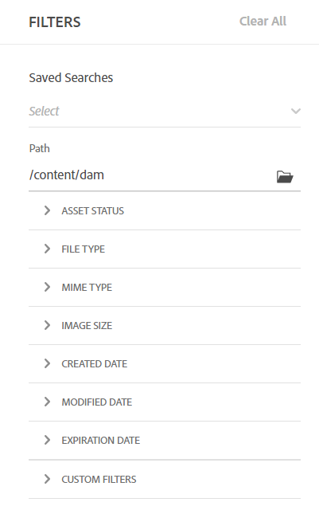

# 搜尋 [!DNL Assets view] 中的資產 {#search-assets}

>[!CONTEXTUALHELP]
>id="assets_search"
>title="搜尋資產"
>abstract="透過指定搜尋列中的關鍵字或根據資產的狀態、檔案類型、MIME 類型、大小、建立、修改和到期日期篩選資產，來搜尋資產。您除了標準篩選器之外，還可以套用自訂篩選器。您可以將篩選的結果另存為「已儲存搜尋」或「智慧型集合」。"
>additional-url="https://experienceleague.adobe.com/docs/experience-manager-assets-essentials/help/manage-collections.html?lang=zh-Hant#manage-smart-collection" text="建立智慧型集合"

[!DNL Assets view] 的預設功能即提供有效的搜尋。由於是全文檢索搜尋，因此十分全面。強大的搜尋功能可讓您快速探索合適的資產，協助您改善內容速度。[!DNL Assets view] 提供全文檢索搜尋，甚至還透過如智慧型標記、標題、建立的日期和版本等中繼資料進行搜尋。

若要搜尋資產，

* 按一下頁面頂部的搜尋方塊。預設為在您目前瀏覽的資料夾內進行搜尋。執行下列任一項作業：

  

   * 使用關鍵字進行搜尋，並選擇變更資料夾。按下「Return」。

   * 開始直接搜尋最近檢視的資產，然後使用該資產。在搜尋方塊中按一下，然後從建議中選取最近檢視的資產。

## 篩選搜尋結果 {#refine-search-results}

您可以根據以下參數來篩選搜尋結果。

*圖：請根據各種參數篩選已搜尋的資產。*

* 資產狀態：使用 `Approved`、`Rejected` 或 `No Status` 資產狀態來篩選搜尋結果。

* 檔案類型：依照支援的檔案類型篩選搜尋結果，也就是 `Images`、`Documents` 和 `Videos`。
* MIME 類型：篩選一個或更多支援的檔案格式。<!-- TBD:  [supported file formats](/help/assets/supported-file-formats-assets-view.md). -->
* 影像大小：提供一個或更多最小和最大尺寸，以篩選影像。以尺寸 (像素) 提供大小，而非影像的檔案大小。
* 建立日期：資產的建立日期如中繼資料中所提供。使用的標準日期格式為 `yyyy-mm-dd`。
* 修改日期：上次修改資產的日期。使用的標準日期格式為 `yyyy-mm-dd`。

* 有效日期：根據`Expired`資產狀態來篩選搜尋結果。此外，您可以指定資產的有效日期範圍以進一步篩選搜尋結果。

* 自訂篩選器： [新增自訂篩選器](#custom-filters) 至「資產」檢視使用者介面。 除了標準篩選器之外，您還可以套用這些自訂篩選器來縮小您的搜尋結果。

您可以依照 `Name`、`Relevancy`、`Size`、`Modified` 和 `Created` 的遞增或遞減順序排序搜尋的資產。

## 管理自訂篩選器 {#custom-filters}

**需要的權限：**`Can Edit`、`Owner` 或管理員。

資產檢視也可讓您將自訂篩選器新增到使用者介面。 然後，除了[標準篩選器](#refine-search-results)之外，您還可以套用這些自訂篩選器來縮小您的搜尋結果。

「資產」檢視提供下列自訂篩選器：

<table>
    <tbody>
     <tr>
      <th><strong>自訂篩選器名稱</strong></th>
      <th><strong>說明</strong></th>
     </tr>
     <tr>
      <td>標題</td>
      <td>使用該資產標題來篩選資產。您在區分大小寫的搜尋條件中指定的標題必須和要在結果中顯示的資產的精確標題完全相符。</td>
     </tr>
     <tr>
      <td>名稱</td>
      <td>使用該資產檔名來篩選資產。您在區分大小寫的搜尋條件中指定的名稱必須和要在結果中顯示的資產的精確檔名完全相符。</td>
     </tr>
     <tr>
      <td>資產大小</td>
      <td>透過在要顯示在結果中的資產的搜尋條件中定義大小範圍 (以位元組為單位) 來篩選資產。</td>
     </tr>
     <tr>
      <td>預測標記</td>
      <td>使用該資產智慧標記來篩選資產。您在區分大小寫的搜尋條件中指定的智慧標記必須和要在結果中顯示的資產的精確智慧標記名稱完全相符。您無法在搜尋條件中指定多個智慧標記。</td>
     </tr>    
    </tbody>
   </table>

<!--
   You can use a wildcard operator (*) to enable Assets view to display assets in the results that partially match the search criteria. For example, if you define <b>ma*</b> as the search criteria, Assets view displays assets with title, such as, market, marketing, man, manchester, and so on in the results.

   You can use a wildcard operator (*) to enable Assets view to display assets in the results that partially match the search criteria.

   You can use a wildcard operator (*) to enable Assets view to display assets in the results that partially match the search criteria. You can specify multiple smart tags separated by a comma in the search criteria.

   -->

### 新增自訂篩選器 {#add-custom-filters}

若要新增自訂篩選器：

1. 請按一下&#x200B;**[!UICONTROL 篩選器]**。

1. 在&#x200B;**[!UICONTROL 自訂篩選器]**&#x200B;區段中，按一下&#x200B;**[!UICONTROL 編輯]**&#x200B;或&#x200B;**[!UICONTROL 新增篩選器]**。

   

1. 在&#x200B;**[!UICONTROL 自訂篩選器管理]**&#x200B;對話框中，選取您需要新增至現有篩選器清單上的篩選器。選取&#x200B;**[!UICONTROL 自訂篩選器]**，以選取所有篩選器。

1. 按一下&#x200B;**[!UICONTROL 確認]**，即可將篩選器新增到使用者介面。

### 移除自訂篩選器 {#remove-custom-filters}

若要移除自訂篩選器：

1. 請按一下&#x200B;**[!UICONTROL 篩選器]**。

1. 在&#x200B;**[!UICONTROL 自訂篩選器]**&#x200B;區段中，按一下&#x200B;**[!UICONTROL 編輯]**。

1. 在&#x200B;**[!UICONTROL 自訂篩選器管理]**&#x200B;對話框中，將您需要從現有篩選器清單中移除的篩選器取消選取。

1. 按一下&#x200B;**[!UICONTROL 確認]**，即可將篩選器從使用者介面移除。

## 已儲存搜尋 {#saved-search}

搜尋功能可以在 [!DNL Assets view] 中輕鬆使用。您不僅可以從搜尋方塊中輸入關鍵字然後按下「Return」來查看結果，也可按一下快速再次搜尋最近搜尋的關鍵字。

您也可以根據資產的中繼資料和類型的特定條件，來篩選搜尋結果。對於常用的篩選條件，若要改善搜尋體驗，[!DNL Assets view] 可讓您儲存搜尋參數。您稍後可以選取已儲存搜尋，按一下即可搜尋並套用篩選器。

若要建立已儲存搜尋，請搜尋某個資產、套用一個或更多篩選條件，然後按一下「[!UICONTROL 篩選器]」面板中的「**[!UICONTROL 另存新檔]** > **[!UICONTROL 儲存搜尋]**」。您也可以按一下「**[!UICONTROL 另存新檔]**」並選擇「**[!UICONTROL 智慧型集合]**」將結果儲存為智慧型集合。如需詳細資料，請參閱[建立智慧型集合](manage-collections-assets-view.md#create-a-smart-collection)。

<!-- TBD: Search behavior. Full-text search. Ranking and rank boosts. Hidden assets.
Report poor UX that users can only save a filtered search and not a simple search.
.
Are other supported files fully indexed and support full-text search? Eg. audio/videos files can at best have metadata indexed.
Anything about ranking of assets displayed in search results?

What about temporarily hiding an asset (suspending search on it) from the search results? If an asset is undergoing review collaboration, should it be used by others? Should it be hidden in search?

When userA is searching and userB add an asset that matches search results, will the asset display in search as soon as userA refreshes the page? Assuming indexing is near real-time. May not be so for bulk uploads.
-->

## 後續步驟 {#next-steps}

* [觀看在「資產」檢視中搜尋資產的相關影片](https://experienceleague.adobe.com/docs/experience-manager-learn/assets-essentials/basics/using.html)

* 使用提供產品意見回饋 [!UICONTROL 意見反應] 「資產」檢視使用者介面中可用的選項

* 若要提供文件意見回饋，請使用右側邊欄提供的[!UICONTROL 編輯此頁面]或[!UICONTROL 記錄問題]

* 聯絡[客戶服務](https://experienceleague.adobe.com/?support-solution=General#support)
