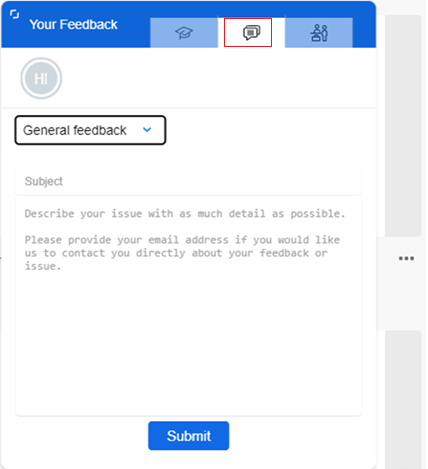

# 搜尋 [!DNL Assets view] 中的資產 {#search-assets}

>[!CONTEXTUALHELP]
>id="assets_search"
>title="搜尋資產"
>abstract="透過指定搜尋列中的關鍵字或根據資產的狀態、檔案類型、MIME 類型、大小、建立、修改和過期日期篩選資產，來搜尋資產。除了標準篩選器之外，您也可以套用自訂篩選器。您可以將篩選的結果另存為「已儲存搜尋」或「智慧型集合」。"
>additional-url="https://experienceleague.adobe.com/docs/experience-manager-assets-essentials/help/manage-collections.html?lang=zh-Hant#manage-smart-collection" text="建立智慧型集合"

[!DNL Assets view] 的預設功能即提供有效的搜尋。由於是全文檢索搜尋，因此十分全面。強大的搜尋功能可讓您快速探索合適的資產，協助您改善內容速度。[!DNL Assets view] 提供全文檢索搜尋，甚至還透過如智慧標記、標題、建立的日期和版本等中繼資料進行搜尋。

若要搜尋資產：

* 按一下頁面頂部的搜尋方塊。預設為在您目前瀏覽的資料夾內進行搜尋。執行下列任一項作業：

  

   * 使用關鍵字進行搜尋，並選擇變更資料夾。按下「Return」。

   * 開始直接搜尋最近檢視的資產，然後使用該資產。在搜尋方塊中按一下，然後從建議中選取最近檢視的資產。

## 篩選搜尋結果 {#refine-search-results}

您可以根據以下參數來篩選搜尋結果。

*圖：請根據各種參數篩選已搜尋的資產。*

* 資產狀態：使用 `Approved`、`Rejected` 或 `No Status` 資產狀態來篩選搜尋結果。

* 檔案類型：依照支援的檔案類型篩選搜尋結果，也就是 `Images`、`Documents` 和 `Videos`。
* MIME 類型：篩選一個或更多支援的檔案格式。<!-- TBD:  [supported file formats](/help/using/supported-file-formats.md). -->
* 影像大小：提供一個或更多最小和最大尺寸，以篩選影像。以尺寸 (像素) 提供大小，而非影像的檔案大小。
* 建立日期：資產的建立日期如中繼資料中所提供。使用的標準日期格式為 `yyyy-mm-dd`。
* 修改日期：上次修改資產的日期。使用的標準日期格式為 `yyyy-mm-dd`。

* 過期日期：根據`Expired`資產狀態來篩選搜尋結果。此外，您可以指定資產的過期日期範圍以進一步篩選搜尋結果。

* 自訂篩選器： [新增自訂篩選器](#custom-filters)至Assets檢視使用者介面。 除了標準篩選器之外，您還可以套用自訂篩選器來縮小您的搜尋結果。

您可以依照 `Name`、`Relevance`、`Size`、`Modified` 和 `Created` 的遞增或遞減順序排序搜尋的資產。已搜尋的資產會依`Relevance` (依預設) 進行排序。

## 管理自訂篩選器 {#custom-filters}

**需要的權限：**`Can Edit`、`Owner` 或管理員。

Assets檢視也可讓您將自訂篩選器新增到使用者介面。 然後，除了[標準篩選器](#refine-search-results)之外，您還可以套用這些自訂篩選器來縮小您的搜尋結果。

Assets檢視提供下列自訂篩選器：

<table>
    <tbody>
     <tr>
      <th><strong>自訂篩選器名稱</strong></th>
      <th><strong>說明</strong></th>
     </tr>
     <tr>
      <td>標題</td>
      <td>使用該資產標題來篩選資產。您在區分大小寫的搜尋條件中指定的標題必須和要在結果中顯示的資產的精確標題完全相符。</td>
     </tr>
     <tr>
      <td>名稱</td>
      <td>使用該資產檔名來篩選資產。您在區分大小寫的搜尋條件中指定的名稱必須和要在結果中顯示的資產的精確檔名完全相符。</td>
     </tr>
     <tr>
      <td>資產大小</td>
      <td>透過在要顯示在結果中的資產的搜尋條件中定義大小範圍 (以位元組為單位) 來篩選資產。</td>
     </tr>
     <tr>
      <td>預測標記</td>
      <td>使用該資產智慧標記來篩選資產。您在區分大小寫的搜尋條件中指定的智慧標記必須和要在結果中顯示的資產的精確智慧標記名稱完全相符。您無法在搜尋條件中指定多個智慧標記。</td>
     </tr>    
    </tbody>
   </table>

<!--
   You can use a wildcard operator (*) to enable Assets view to display assets in the results that partially match the search criteria. For example, if you define <b>ma*</b> as the search criteria, Assets view displays assets with title, such as, market, marketing, man, manchester, and so on in the results.

   You can use a wildcard operator (*) to enable Assets view to display assets in the results that partially match the search criteria.

   You can use a wildcard operator (*) to enable Assets view to display assets in the results that partially match the search criteria. You can specify multiple smart tags separated by a comma in the search criteria.

   -->

### 新增自訂篩選器 {#add-custom-filters}

若要新增自訂篩選器：

1. 請按一下&#x200B;**[!UICONTROL 篩選器]**。

1. 在&#x200B;**[!UICONTROL 自訂篩選器]**&#x200B;區段中，按一下&#x200B;**[!UICONTROL 編輯]**&#x200B;或&#x200B;**[!UICONTROL 新增篩選器]**。

   

1. 在&#x200B;**[!UICONTROL 自訂篩選器管理]**&#x200B;對話框中，選取您需要新增至現有篩選器清單上的篩選器。選取&#x200B;**[!UICONTROL 自訂篩選器]**，以選取所有篩選器。

1. 按一下&#x200B;**[!UICONTROL 確認]**，即可將篩選器新增到使用者介面。

### 移除自訂篩選器 {#remove-custom-filters}

若要移除自訂篩選器：

1. 請按一下&#x200B;**[!UICONTROL 篩選器]**。

1. 在&#x200B;**[!UICONTROL 自訂篩選器]**&#x200B;區段中，按一下&#x200B;**[!UICONTROL 編輯]**。

1. 在&#x200B;**[!UICONTROL 自訂篩選器管理]**&#x200B;對話框中，將您需要從現有篩選器清單中移除的篩選器取消選取。

1. 按一下&#x200B;**[!UICONTROL 確認]**，即可將篩選器從使用者介面移除。

## 語意搜尋 {#semantic-search}

語意搜尋是一種進階搜尋功能，可瞭解使用者查詢的涵義和意圖，而不是依賴精確的關鍵字比對。 它使用人工智慧(AI)、自然語言處理(NLP)和機器學習來提供更準確且內容感知的結果。

傳統關鍵字式搜尋會尋找精確字詞，而語意搜尋則不同，它會解譯字詞、概念和使用者意圖之間的關係。 這可確保使用者找到他們要尋找的內容 — 即使他們的查詢用詞不同、包含拼寫錯誤或使用另一種語言。

如果其主要優點包括：

* **多語言支援**：搜尋多種語言，不需要精確翻譯。 使用者無論查詢語言為何，都能找到相關內容。

* **處理錯誤拼字**：自動更正或解譯拼字錯誤和拼字錯誤，即使輸入不完美也能確保正確的結果。

* **瞭解同義字**：提供相關辭彙和短語的結果，因此使用者不需要猜測正確的關鍵字。

* **內容感知搜尋**：辨識查詢背後的目的，而不只是文字。

>[!IMPORTANT]
>
> 指定三個或三個以上的字詞讓語意搜尋顯示適當的結果。

### 語意搜尋的範例 {#examples-semantic-search}

**範例提示**： *喝咖啡的女人*

傳統關鍵字式搜尋會尋找完全相符的資產中繼資料，例如Woman、Coffee等，並傳回包含這些關鍵字的資產。

不過，語意搜尋會尋找類似的字詞，例如`Girl`的`Lady`、`Woman`和咖啡選項，例如`Cappuccino`的`Latte`和`Coffee`。

同樣地，您可以用西班牙文或拼錯拼字`Woman`來指定此提示為`Wman`，仍會得到相同的結果。

在Assets檢視中

## 使用 [!DNL Adobe Firefly] 搜尋資產 {#search-firefly}

您可以利用 [!DNL Experience Manager Assets] 中的 [!DNL Adobe Firefly] 資產搜尋功能，搜尋任何資產資料夾中都找不到的資產。您就可以有效率且即時地產生未儲存在資產資料夾中的資產。

### 開始之前 {#search-assets-firefly-prereqs}

您必須擁有使用中的 [!DNL Adobe Express] 訂閱。

### 產生資產 {#generate-assets-firefly}

如要使用 [!DNL Adobe Firefly] 來產生新資產：

1. 瀏覽至 [!DNL AEM Assets] 工作區。

1. 在搜尋列中輸入資產名稱。例如，您可以使用關鍵字 `Bugatti Type 57` 來搜尋資產。搜尋資產時，若找不到任何結果，是因為該資產不存在於任何資產資料夾中。若要使用 AI 產生資產，請按一下「**[!UICONTROL 使用 Firefly 生成]**」。出現 [!DNL Adobe Firefly] 畫面。

   

   已成功產生新資產。此外，您可以在描述框中輸入新的文字提示以變更影像描述。[瞭解如何撰寫良好的AI提示，以產生非凡的相關內容](https://helpx.adobe.com/tw/firefly/using/tips-and-tricks.html)。 或者，您也可以[使用各種其他功能（例如變更樣式、影像尺寸等等）編輯影像](https://helpx.adobe.com/tw/firefly/using/text-to-image.html)。

   

1. 選取您想儲存的影像。按一下「**[!UICONTROL 儲存]**」，在您偏好的資料夾儲存資產以便存取。

1. 出現儲存資產表單。指定以下欄位：

   * 在&#x200B;**另存新檔**&#x200B;欄位中輸入檔案名稱。
   * 選取目的地資料夾。
   * 輸入專案或行銷活動名稱、關鍵字、管道、時間段和區域等詳細資訊。

   

1. 按一下「**另存為新資產**」，以儲存資產。

### 上傳資產 {#upload-assets-firefly}

若要將產生的資產上傳到資產存放庫：

1. 按一下 **[!UICONTROL 上傳]**。
1. 選取需要上傳資產的資產資料夾，然後按一下 **[!UICONTROL 選取資料夾]**。
   

## 已儲存搜尋 {#saved-search}

搜尋功能可以在 [!DNL Assets view] 中輕鬆使用。您不僅可以從搜尋方塊中輸入關鍵字然後按下「Return」來查看結果，也可按一下來快速再次搜尋最近搜尋的關鍵字。

您也可以根據資產的中繼資料和類型的特定條件，來篩選搜尋結果。對於常用的篩選條件，若要改善搜尋體驗，[!DNL Assets view] 可讓您儲存搜尋參數。您稍後可以選取已儲存搜尋，按一下即可搜尋並套用篩選器。

若要建立已儲存搜尋，請搜尋某個資產、套用一個或更多篩選條件，然後按一下「[!UICONTROL 篩選器]」面板中的「**[!UICONTROL 另存新檔]** > **[!UICONTROL 儲存搜尋]**」。您也可以按一下「**[!UICONTROL 另存新檔]**」並選取「**[!UICONTROL 智慧型集合]**」將結果儲存為智慧型集合。如需詳細資料，請參閱[建立智慧型集合](manage-collections.md#create-a-smart-collection)。

<!-- TBD: Search behavior. Full-text search. Ranking and rank boosts. Hidden assets.
Report poor UX that users can only save a filtered search and not a simple search.
.
Are other supported files fully indexed and support full-text search? Eg. audio/videos files can at best have metadata indexed.
Anything about ranking of assets displayed in search results?

What about temporarily hiding an asset (suspending search on it) from the search results? If an asset is undergoing review collaboration, should it be used by others? Should it be hidden in search?

When userA is searching and userB add an asset that matches search results, will the asset display in search as soon as userA refreshes the page? Assuming indexing is near real-time. May not be so for bulk uploads.
-->

## 使用搜尋結果 {#work-with-search-results}

您可以選取搜尋結果中顯示的資產，然後執行以下動作：

* **尋找類似影像**：根據中繼資料和智慧標記在 Assets UI 中尋找類似影像資產。

* **詳細資料**：檢視和編輯資產屬性。

* **下載**：下載資產。

* 按一下&#x200B;**新增到集合**：將所選資產新增到集合中。

* **釘選到快速存取** :[釘選資產](my-workspace-assets-view.md) 以便以後需要時能更快地存取。所有釘選的項目都顯示在「我的工作區」的&#x200B;**快速存取**&#x200B;部分。

* **在 Adobe Express 中開啟**：到 Experience Manager Assets 畫面，在整合的 Adobe Express 中編輯影像。

* **編輯**：使用 Adobe Express 編輯影像。

* **共用連結**：與其他使用者 [共用資產連結](share-links-for-assets-view.md)，以便他們可以存取和下載該資產。

* **刪除**：刪除資產。

* **複製**：將資產複製到其他資料夾位置。

* **移動**：將資產移動到其他資料夾位置。

* **重新命名**：重新命名資產。

* **複製到資料庫**：將資產新增至資料庫。

* **指派任務**：將資產的任務指派給使用者。

* **觀看**：[監視](https://experienceleague.adobe.com/zh-hant/docs/experience-manager-cloud-service/content/assets/manage/search-assets)針對資產執行的作業。

## 設定搜尋優先首頁 {#configuring-search-first-homepage}

Assets檢視可讓您為組織選取預設登陸頁面。 使用「搜尋優先」作為首頁時，會有幾個選項讓您設定符合您品牌的背景和標誌影像，以量身打造品牌頁面。

若要設定搜尋優先首頁，請執行以下步驟：

1. 瀏覽至「**[!UICONTROL 設定]**」>「**[!UICONTROL 一般設定]**」。
1. 選取「**[!UICONTROL 搜尋優先]**」。接著會開啟搜尋優先相關設定。您可以設定首頁的[對齊方式](#setting-alignment-search-bar)或[設定背景和標誌影像](#setting-background-image-and-logo)。

### 設定搜尋列的對齊方式 {#setting-alignment-search-bar}

[!DNL Assets view] 可讓您變更搜尋列的對齊方式。您可以讓搜尋列顯示在中心或頂端。選取適當的對齊方式，然後按一下「**[!UICONTROL 儲存]**」。

### 設定首頁的背景和標誌影像 {#setting-background-image-and-logo}

您可以將品牌標誌和背景影像新增至搜尋優先首頁。執行以下步驟：

1. 瀏覽到「**[!UICONTROL 背景和標誌影像]**」(在「**[!UICONTROL 首頁]**」下方)。
1. 按一下「**[!UICONTROL 取代]**」以瀏覽現有資產存放庫中的影像。
1. 按一下「**[!UICONTROL 儲存]**」。[預覽](#preview-configured-homepage)變更以查看修改部分。

### 預覽已設定首頁 {#preview-configured-homepage}

您可以預覽以查看搜尋優先首頁的版面配置和格式。使用「**[!UICONTROL 預覽]**」，您可以根據需要更改版面配置或進行修改。若要預覽已設定首頁，請執行以下步驟：

1. 按一下「**[!UICONTROL 一般設定]**」，然後選取「**[!UICONTROL 搜尋優先]**」。
1. 瀏覽到「**[!UICONTROL 自訂搜尋優先首頁]**」，然後按一下「**[!UICONTROL 預覽]**」。切換「**[!UICONTROL 深色主題]**」按鈕以深色或淺色主題預覽首頁。
1. 按一下「**[!UICONTROL 關閉]**」即可關閉預覽畫面。

   

## 內容相關搜尋 {#contextual-search}

您也可以透過定義文字提示來搜尋存放庫中可用的資產。Experience Manager Assets 會自動轉換這些文字提示，以便搜尋篩選器並顯示搜尋結果。您可以使用篩選器窗格查看和修改自動篩選器，以進一步縮小搜尋結果範圍。

### 存取內容搜尋 {#access-contextual-search}

若要存取 Experience Manager Assets 中的內容搜尋：

1. 在左側窗格中，按一下「**[!UICONTROL 搜尋]**」 。

   

1. 在「搜尋」文字方塊中定義文字提示，然後按一下「**[!UICONTROL 內容搜尋]**」。

   

   [!DNL Experience Manager Assets] 會顯示搜尋結果。

### 支援篩選器 {#supported-filters}

內容搜尋支援以下開箱即用的篩選器。根據這些篩選器來設定文字提示，以查看適當的搜尋結果。

* 影像高度

* 影像寬度

* 檔案類型：影像、文件、影片或資料夾。

* MIME 類型：JPG、PNG、TIFF、GIF、MP4、PDF、PPTX、DOCX 或 XLSX

* 建立日期

* 修改日期

* 過期日期

* 資產狀態：已核准、已拒絕或全部

* 過期資產

### 文字提示範例 {#text-prompts-examples}

**範例 1**

**文字提示**：本月建立的影像。

[!DNL Experience Manager Assets] 會自動套用以下篩選器並顯示搜尋結果：

**範例 2**

**文字提示**：至少 200 像素高、100 像素寬的影像，且有海灘和晴朗的天空。

[!DNL Experience Manager Assets] 會自動套用以下篩選器並顯示搜尋結果：

**範例 3**

**文字提示**：我需要高度為 1500 和 2500 像素的藍天影像，而且是過去一個月內建立的未過期及已核准影像。

[!DNL Experience Manager Assets] 會自動套用以下篩選器並顯示搜尋結果：

以下影片示範從存取內容搜尋使用者介面到定義文字提示，以及查看搜尋結果的端到端過程。

>[!VIDEO](https://video.tv.adobe.com/v/3428407)

### 停用內容搜尋 {#disable-contextual-search}

管理員也可以選擇停用組織中使用者的內容搜尋。若要如此做，請執行以下步驟：

1. 瀏覽至「**[!UICONTROL 設定]**」>「**[!UICONTROL 一般設定]**」。

1. 在「[!UICONTROL 內容搜尋]」區段中，關閉「**[!UICONTROL 為您的組織啟用內容搜尋]**」切換開關，以停用您組織中所有使用者的內容搜尋功能。

### 內容搜尋意見回饋 {#contextual-search-feedback}

如果您需要提供有關內容搜尋功能的意見回饋，請按一下 ，然後按一下「意見回饋」圖示。選取意見回饋類型，指定主題和描述，然後按一下「**[!UICONTROL 提交]**」。

## 後續步驟 {#next-steps}

* [觀看在Assets檢視中搜尋資產的相關影片](https://experienceleague.adobe.com/docs/experience-manager-learn/assets-essentials/basics/using.html?lang=zh-Hant)

* 使用資產檢視使用者介面所提供的[!UICONTROL 意見回饋]選項提供產品意見回饋

* 若要提供文件意見回饋，請使用右側邊欄提供的[!UICONTROL 編輯此頁面]或[!UICONTROL 記錄問題]。

* 聯絡[客戶服務](https://experienceleague.adobe.com/?support-solution=General#support)

