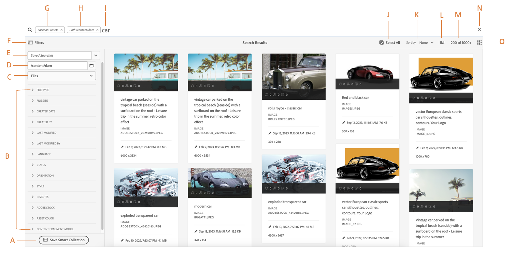

# 在AEM中搜尋資產 {#search-assets-in-aem}

| 版本 | 文章連結 |
| -------- | ---------------------------- |
| AEM 6.5 | [按一下這裡](https://experienceleague.adobe.com/docs/experience-manager-65/assets/using/search-assets.html?lang=zh-Hant) |
| AEM as a Cloud Service  | 本文章 |

[!DNL Adobe Experience Manager Assets]提供強大的資產搜尋方法，協助您達到更高的內容速度。 您的團隊可使用開箱即用的功能和自訂方法，透過順暢的智慧型資產搜尋體驗縮短上市時間。 搜尋資產功能是使用數位資產管理系統的核心，不論是供創意人員進一步使用、供業務使用者和行銷人員健全管理資產，還是DAM管理員管理。 您可以透過[!DNL Assets]使用者介面或其他應用程式和介面執行的簡單、進階和自訂搜尋，有助於完成這些使用案例。

AEM中的資產搜尋支援下列使用案例，本文介紹這些使用案例的使用方式、概念、設定、限制和疑難排解。

| 搜尋資產 | 設定及管理搜尋功能 | 使用資產搜尋結果 |
|---|---|---|
| [基本搜尋](#searchbasics) | [搜尋索引](#searchindex) | [排序結果](#sort) |
| [瞭解搜尋UI](#searchui) | [文字擷取](#extracttextupload) | [檢查資產的屬性和中繼資料](#checkinfo) |
| [搜尋建議](#searchsuggestions) | [必要的中繼資料](#mandatorymetadata) | [下載](#download) |
| [瞭解搜尋結果和行為](#searchbehavior) | [修改搜尋Facet](#searchfacets) | [大量中繼資料更新](#metadata-updates) |
| [搜尋排名和提升](#searchrank) | [自訂述詞](#custompredicates) | [智慧型集合](#collections) |
| [進階搜尋：篩選和搜尋範圍](#scope) | | [瞭解並疑難排解非預期的結果](#unexpected-results) |
| [搜尋其他解決方案和應用程式](#search-assets-other-surfaces)：<ul><li>[Adobe Asset Link](#aal)</li><li>[Brand Portal](#brand-portal)</li><li>[Experience Manager案頭應用程式](#desktop-app)</li><li>[Adobe Stock影像](#adobe-stock)</li><li>[Dynamic Media資產](#search-dynamic-media-assets)</li></ul> | | |
| [資產選擇器](#asset-picker) | | |
| [限制](#limitations)和[提示](#tips) | | |
| [插圖範例](#samples) | | |

使用[!DNL Experience Manager]網頁介面頂端的Omnisearch欄位來搜尋資產。 移至[!DNL Experience Manager]中的&#x200B;**[!UICONTROL Assets]** > **[!UICONTROL 檔案]**，按一下頂端列中的，輸入搜尋關鍵字，然後選取`Return`。 或者，使用關鍵字捷徑`/` （正斜線）開啟Omnisearch欄位。 已預先選取`Location:Assets`以將搜尋限制在DAM資產。 當您在&#x200B;**[!UICONTROL 檔案]**&#x200B;資料夾內的根層級執行搜尋時，`Path:/content/dam`也會顯示。 如果您導覽至任何其他資料夾，`Path:/content/dam/<folder name>`會顯示在Omnisearch欄位中，以將搜尋範圍限制在目前的資料夾。 [!DNL Experience Manager]會在您開始輸入搜尋關鍵字時提供建議。

使用&#x200B;**[!UICONTROL 篩選器]**&#x200B;面板來搜尋資產、資料夾、標籤和中繼資料。 您可以根據各種選項（述詞）來篩選搜尋結果，例如檔案型別、檔案大小、上次修改日期、資產狀態、見解資料和Adobe Stock授權。 您可以使用[搜尋Facet](/help/assets/search-facets.md)自訂「篩選器」面板，以及新增或移除搜尋述詞。 [!UICONTROL 篩選器]面板中的[!UICONTROL 檔案型別]篩選器具有混合狀態核取方塊。 因此，除非您選取所有巢狀述詞（或格式），否則會部分勾選第一層核取方塊。

[!DNL Experience Manager]搜尋功能支援在集合內搜尋集合和搜尋資產。 請參閱[搜尋集合](/help/assets/manage-collections.md)。

## 瞭解資產搜尋介面 {#searchui}

請熟悉資產搜尋介面和可用的動作。
<!--

-->

*圖：瞭解[!DNL Experience Manager Assets]搜尋結果介面。*

**A.**&#x200B;將搜尋儲存為智慧型集合。
**B.**&#x200B;篩選或述詞以縮小搜尋結果。
**C.**&#x200B;顯示檔案、資料夾或兩者。
**D.**&#x200B;搜尋位置為DAM。
**E.**&#x200B;存取已儲存的搜尋。
**F.**&#x200B;按一下[篩選器]以開啟或關閉左側邊欄。
**G.**&#x200B;將Assets顯示為預設搜尋。
**H.**&#x200B;搜尋位置為DAM。
**I.** Omnisearch欄位包含使用者提供的搜尋關鍵字。
**J.**&#x200B;選取載入的搜尋結果。
**K.**&#x200B;依建立、修改、名稱、無進行排序。
**L.**&#x200B;依遞增或遞減順序排序。
**M.**&#x200B;搜尋結果總數中顯示的搜尋結果數目。 **N.**&#x200B;關閉搜尋。
**O.**&#x200B;在卡片檢視和清單檢視之間切換。

### 動態搜尋Facet {#dynamicfacets}

您可以使用搜尋Facet中預期搜尋結果數量的動態更新，更快速地從搜尋結果頁面探索所需資產。 甚至在套用搜尋篩選條件之前，資產的預期數量也會更新。 檢視篩選的預期計數，有助於您快速有效瀏覽搜尋結果。

*圖：檢視搜尋Facet中未篩選搜尋結果的大約資產數量。*

Experience Manager Assets預設會顯示兩個屬性的Facet計數：

* 資產型別(jcr：content/metadata/dc：format)

* 核准狀態(jcr：content/metadata/dam：status)

截至2023年8月，Experience Manager Assets已納入新版`damAssetLucene`索引。 舊版`damAssetLucene-8`及以下的版本使用`statistical`模式來檢查每個搜尋Facet計數之專案範例的存取控制。

`damAssetLucene-9`變更Oak查詢Facet計數的行為，不再評估基礎搜尋索引傳回之Facet計數的存取控制，進而加快搜尋回應時間。 因此，使用者可能會看到面向計數值，其中包括他們無權存取的資產。 這些使用者無法存取、下載或讀取這些資產的任何其他詳細資訊，包括其路徑，或取得任何有關這些資產的進一步資訊。

如果您需要切換到先前的行為（`statistical`模式），請參閱[內容搜尋和索引](https://experienceleague.adobe.com/docs/experience-manager-cloud-service/content/operations/indexing.html?lang=zh-Hant)以建立`damAssetLucene-9`索引的自訂版本。 由於對大型結果集的搜尋回應時間造成影響，Adobe不建議切換至`secure`模式。

如需Oak多面向功能的詳細資訊，包括這些模式的詳細說明，請參閱[多面向 — Oak檔案 — Lucene索引](https://jackrabbit.apache.org/oak/docs/query/lucene.html#facets)。

## 輸入時搜尋建議 {#searchsuggestions}

當您開始輸入關鍵字時，Experience Manager會建議可能的搜尋關鍵字或片語。 這些建議是以Experience Manager中的資產為基礎。 Experience Manager會對所有中繼資料欄位編制索引，以協助進行搜尋。 為了提供搜尋建議，系統會使用下列幾個中繼資料欄位的值。 若要提供搜尋建議，請考慮將適當的關鍵字填入下列欄位：

* 資產標籤。 （對應至`jcr:content/metadata/cq:tags`）
* 資產標題。 （對應至`jcr:content/metadata/dc:title`）
* 資產說明。 （對應至`jcr:content/metadata/dc:description`）
* JCR存放庫中的標題。 值可能會對應至資產標題。 （對應至`jcr:content/jcr:title`）
* JCR存放庫中的說明。 此值可能會對應到資產說明。 （對應至`jcr:content/jcr:description`）

## 瞭解搜尋結果和行為 {#searchbehavior}

### 基本搜尋字詞和結果 {#searchbasics}

您可以從OmniSearch欄位執行關鍵字搜尋。 關鍵字搜尋不區分大小寫，且是全文檢索搜尋（涵蓋熱門中繼資料欄位）。 如果使用多個關鍵字，`AND`是關鍵字之間的預設運運算元。

結果會依相關性排序，從最接近的相符專案開始。 對於多個關鍵字，更相關的結果是在其中繼資料中包含兩個字詞的資產。 在中繼資料中，顯示為智慧標籤的關鍵字的排名高於出現在其他中繼資料欄位中的關鍵字。 [!DNL Experience Manager]允許給予特定搜尋詞較高的權重。 此外，在特定搜尋詞中，還可以[提升少數目標資產的排名](#searchrank)。

為快速找到相關資產，豐富的介面可提供篩選、排序和選取機制。 您可以根據多個條件篩選結果，並檢視各種篩選條件的搜尋資產數目。 或者，您可以透過變更Omnisearch欄位中的查詢來重新執行搜尋。 當您變更搜尋字詞或篩選器時，其他篩選器仍會套用，以保留您的搜尋內容。

當結果為許多資產時，[!DNL Experience Manager]會在卡片檢視中顯示前100個，在清單檢視中顯示200個。 當使用者捲動時，會載入更多資產。 這是為了改善效能。 觀看所顯示[資產數目](https://www.youtube.com/watch?v=LcrGPDLDf4o)的影片示範。

有時，您可能會在搜尋結果中看到一些未預期的資產。 如需詳細資訊，請參閱[未預期的結果](#unexpected-results)。

[!DNL Experience Manager]可以搜尋許多檔案格式，而且搜尋篩選器可以自訂以符合您的業務需求。 請聯絡您的管理員，瞭解您的DAM存放庫有哪些搜尋選項可用，以及您的帳戶有哪些限制。

<!-- 
### Results with and without enhanced Smart Tags {#withsmarttags}

By default, [!DNL Experience Manager] search combines the search terms with an AND clause. For example, consider searching for keywords woman running. Only the assets with both woman and running keywords in the metadata appear in the search results by default. The same behavior is retained when special characters (periods, underscores, or dashes) are used with the keywords. The following search queries return the same results:

* `woman running`
* `woman.running`
* `woman-running`

However, the query `woman -running` returns assets without `running` in their metadata.
Using Smart Tags adds an extra `OR` clause to find any of the search terms as the applied smart tags. An asset tagged with either `woman` or `running` using Smart Tags also appear in such a search query. So the search results are a combination of,

* Assets with `woman` and `running` keywords in the metadata (default behavior).

* Assets smart tagged with either of the keywords (Smart Tags behavior).
-->

### 搜尋排名和提升 {#searchrank}

符合中繼資料欄位中所有搜尋字詞的搜尋結果會先顯示，接著顯示符合智慧標籤中任何搜尋字詞的搜尋結果。 在上述範例中，顯示搜尋結果的大約順序為：

1. 符合各種中繼資料欄位中的`woman running`。
1. 符合智慧標籤中的`woman running`。
1. 符合智慧標籤中的`woman`或`running`。

您可以改善特定資產的關鍵字關聯性，以協助根據關鍵字提升搜尋次數。 換言之，當您根據這些關鍵字進行搜尋時，您為其升級特定關鍵字的影像會出現在搜尋結果的最上方。

1. 從[!DNL Assets]使用者介面，開啟資產的屬性頁面。 按一下「進階」**&#x200B;**，然後按一下「**[!UICONTROL 提升搜尋關鍵字]**」下的「新增」**&#x200B;**。
1. 在&#x200B;**[!UICONTROL 搜尋提升]**&#x200B;方塊中，指定您要提升影像搜尋的關鍵字，然後按一下&#x200B;**[!UICONTROL 新增]**。 您可以用相同方式指定多個關鍵字。
1. 按一下&#x200B;**[!UICONTROL 儲存並關閉]**。 您針對此關鍵字提升的資產會出現在最上層的搜尋結果中。

您可以藉此機會提升目標關鍵字搜尋結果中某些資產的排名。 請觀看下方的視訊範例。 如需詳細資訊，請參閱[搜尋 [!DNL Experience Manager]](https://experienceleague.adobe.com/docs/experience-manager-learn/assets/search-and-discovery/search-boost.html?lang=zh-Hant)。

>[!VIDEO](https://video.tv.adobe.com/v/16766/?quality=6)

*影片：瞭解搜尋結果的排名方式，以及如何影響排名。*

## 設定資產批次大小以顯示搜尋結果 {#configure-asset-batch-size}

管理員現在可以設定在執行搜尋時顯示的資產批次大小。 當您進一步向下捲動以載入結果時，資產搜尋結果將以設定的批次大小數字的倍數顯示。您可以從 200、500 和 1000 個資產的可用批次大小中進行選擇。將批次大小設定為較低數字時，會使搜尋回應時間更快。

例如，如果您將結果計數限制設為200個資產的批次大小，當您開始執行搜尋時，Experience Manager Assets會在搜尋結果中顯示200個資產的批次大小。 當您向下捲動以導覽搜尋結果時，將顯示下一批的200個資產。 此程式會持續進行，直到顯示符合搜尋查詢的所有資產為止。

若要設定資產批次大小：

1. 導覽至&#x200B;**[!UICONTROL 工具]** > **[!UICONTROL Assets]** > **[!UICONTROL Assets設定]** > **[!UICONTROL Assets Omnisearch設定]**。

1. 選取結果計數限制，然後按一下&#x200B;**[!UICONTROL 儲存]**。

   

## 進階搜尋 {#scope}

[!DNL Experience Manager]提供多種方法（例如套用至所搜尋資產的篩選器），協助您更快速地找到所需的資產。 以下說明一些常用方法。 以下共用[個圖解範例](#samples)。

**搜尋檔案或資料夾**：在搜尋結果中，檢視檔案、資料夾或兩者。 您可以從&#x200B;**[!UICONTROL 篩選器]**&#x200B;面板中選取適當的選項。 請參閱[搜尋介面](#searchui)。

**在資料夾中搜尋資產**：您可以將搜尋限制在特定資料夾。 在&#x200B;**[!UICONTROL 篩選器]**&#x200B;面板中，新增資料夾的路徑。 您一次只能選取一個資料夾。

![在[篩選器]面板中新增資料夾路徑，將搜尋結果限製為資料夾](assets/limiting-search.gif)
<!--

-->

*圖：在[篩選器]面板中新增資料夾路徑，將搜尋結果限製為資料夾。*

### 尋找類似影像 {#visualsearch}

若要尋找視覺上類似使用者選取之影像的影像，請從影像的卡片檢視或工具列按一下「尋找類似 **&#x200B;**&#x200B;」選項。[!DNL Experience Manager]會顯示來自DAM存放庫的智慧型標籤影像，這些影像類似於使用者選取的影像。

*圖：使用卡片檢視中的選項尋找類似的影像。*

### Adobe Stock影像 {#adobe-stock}

在[!DNL Experience Manager]使用者介面中，使用者可以搜尋[Adobe Stock資產](/help/assets/aem-assets-adobe-stock.md)並授權必要的資產。 在Omnisearch列中新增`Location: Adobe Stock`。 您也可以使用「篩選器」面板來尋找所有已授權或未授權的資產，或使用Adobe Stock檔案編號來搜尋特定資產。

### Dynamic Media資產 {#dmassets}

您可以從&#x200B;**[!UICONTROL 「篩選器」]**&#x200B;面板中選取&#x200B;**[!UICONTROL 「動態媒體」]**>**[!UICONTROL 「集合」]**，以篩選動態媒體影像。這樣可篩選並顯示影像集、轉盤、混合媒體集和迴轉集等資產。

### 使用中繼資料欄位中的特定值的GQL搜尋 {#gql-search}

您可以根據中繼資料欄位的確切值來搜尋資產，例如標題、說明和建立者。 GQL全文檢索搜尋功能只會擷取中繼資料值與搜尋查詢完全相符的資產。 屬性的名稱（建立者、標題等）和值區分大小寫。

| 中繼資料欄位 | Facet值和使用狀況 |
|---|---|
| 標題 | title：John |
| 建立者 | 建立者：John |
| 位置 | 位置：NA |
| 說明 | description：&quot;Sample Image&quot; |
| 建立者工具 | creatortool：&quot;Adobe Photoshop&quot; |
| 版權擁有者 | 版權擁有者：&quot;Adobe Systems&quot; |
| 參與者 | 貢獻者：John |
| 使用條款 | usageterms：&quot;CopyRights Reserved&quot; |
| 建立時間 | created：YYYY-MM-DDTHH |
| 到期日期 | expires：YYYY-MM-DDTHH |
| 準時 | ontime：YYYY-MM-DDTHH |
| 關閉時間 | offtime：YYYY-MM-DDTHH |
| 時間範圍(expires dateontime，offtime) | Facet欄位：下限……上界 |
| 路徑 | /content/dam/&lt;資料夾名稱> |
| PDF 標題 | pdftitle：&quot;Adobe檔案&quot; |
| 主旨 | 主旨：「培訓」 |
| 標記 | 標籤：「地點和旅遊」 |
| 類型 | 型別：&quot;image\png&quot; |
| 影像寬度 | 寬度：下限……上界 |
| 影像高度 | 高度：下限……上界 |
| 人員 | 人員：John |

屬性`path`、`limit`、`size`和`orderby`無法搭配其他任何屬性使用`OR`運運算元組合。

<!-- TBD: Where are the limit, size, orderby properties defined?
-->

使用者產生的屬性的關鍵字是屬性編輯器中的欄位標籤（小寫），其中會移除空格。

以下是複雜查詢的搜尋格式範例：

* 若要顯示具有多個Facet欄位的所有資產(例如： title=John Doe and creator tool = Adobe Photoshop)： `title:"John Doe" creatortool:Adobe*`
* 當Facet值不是單一字詞而是句子時，若要顯示所有資產（例如： title=Scott Reynolds）： `title:"Scott Reynolds"`
* 若要顯示具有單一屬性的多個值的資產（例如：title=Scott Reynolds或John Doe）： `title:"Scott Reynolds" OR "John Doe"`
* 若要顯示屬性值以特定字串開頭的資產（例如：標題是Scott Reynolds）： `title:Scott*`
* 若要顯示屬性值以特定字串結尾的資產（例如：title是Scott Reynolds）： `title:*Reynolds`
* 若要以包含特定字串的屬性值來顯示資產（例如：標題= Basel會議室）： `title:*Meeting*`
* 若要顯示包含特定字串且具有特定屬性值的資產(例如：在title=John Doe的資產中搜尋字串Adobe)： `*Adobe* title:"John Doe"`

## 從其他[!DNL Experience Manager]專案或介面搜尋資產 {#search-assets-other-surfaces}

[!DNL Adobe Experience Manager]將DAM存放庫連線到各種其他[!DNL Experience Manager]解決方案，以提供對數位資產的更快速存取並簡化創意工作流程。 任何資產探索都會從瀏覽或搜尋開始。 在各種表面和解決方案中，搜尋行為大致相同。 某些搜尋方法會隨著目標對象、使用案例和使用者介面在所有[!DNL Experience Manager]解決方案中不同而有所變更。 以下連結提供各個解決方案的特定方法。 本文記錄通用適用的提示和行為。

### 從Adobe Asset Link面板搜尋資產 {#aal}

使用Adobe Asset Link，創意專業人士現在無需離開支援的Adobe Creative Cloud應用程式，即可存取[!DNL Experience Manager Assets]中儲存的內容。 創意人員可以使用[!DNL Adobe Creative Cloud]應用程式中的應用程式內面板，順暢地瀏覽、搜尋、簽出和簽入資產： [!DNL Adobe Photoshop]、[!DNL Adobe Illustrator]和[!DNL Adobe InDesign]。 Asset Link也可讓使用者搜尋視覺上類似的結果。 視覺化搜尋顯示結果由Adobe Sensei的機器學習演演算法提供支援，並幫助使用者尋找在美學上相似的影像。 請參閱[使用Adobe Asset Link搜尋和瀏覽資產](https://helpx.adobe.com/tw/enterprise/using/manage-assets-using-adobe-asset-link.html#UseAdobeAssetLink)。

### 搜尋[!DNL Experience Manager]案頭應用程式中的資產 {#desktop-app}

Creative專業人員使用案頭應用程式，讓[!DNL Experience Manager Assets]可輕鬆地在本機案頭(Win或Mac)上搜尋和使用。 創意人員可以輕鬆地在Mac Finder或Windows檔案總管中顯示所需的資產、在案頭應用程式中開啟並在本機變更 — 變更會透過在存放庫中建立的新版本儲存回[!DNL Experience Manager]。 應用程式支援使用一或多個關鍵字、`*`和`?`萬用字元以及`AND`運運算元進行基本搜尋。 請參閱案頭應用程式中的[瀏覽、搜尋及預覽資產](https://experienceleague.adobe.com/docs/experience-manager-desktop-app/using/using.html?lang=zh-Hant#browse-search-preview-assets)。

### 搜尋 [!DNL Brand Portal] 中的資產 {#brand-portal}

業務線使用者和行銷人員可使用Brand Portal，有效率且安全地與擴充的內部團隊、合作夥伴和經銷商共用核准的數位資產。 請參閱[在Brand Portal](https://experienceleague.adobe.com/docs/experience-manager-brand-portal/using/search-capabilities/brand-portal-searching.html?lang=zh-Hant)上搜尋資產。

### 搜尋[!DNL Adobe Stock]個影像 {#adobe-stock1}

在[!DNL Experience Manager]使用者介面中，使用者可以搜尋Adobe Stock資產並授權必要的資產。 在Omnisearch欄位中新增`Location: Adobe Stock`。 您也可以使用&#x200B;**[!UICONTROL 篩選器]**&#x200B;面板來尋找所有授權或未授權的資產，或使用Adobe Stock檔案編號搜尋特定資產。 檢視 [!DNL Experience Manager][&#128279;](/help/assets/aem-assets-adobe-stock.md#usemanage)中的管理 [!DNL Adobe Stock] 影像。

### 搜尋[!DNL Dynamic Media]資產 {#search-dynamic-media-assets}

您可以從&#x200B;**[!UICONTROL 「篩選器」]**&#x200B;面板中選取&#x200B;**[!UICONTROL 「動態媒體」]**>**[!UICONTROL 「集合」]**，以篩選動態媒體影像。這樣可以篩選並顯示影像集、旋轉木馬、混合媒體集和迴轉集等資產。在製作網頁時，作者可在內容尋找工具中搜尋集合。集合的篩選器可從快顯功能表中取得。

### 製作網頁時在「內容尋找器」中搜尋資產 {#content-finder}

作者可使用「內容尋找器」在DAM存放庫中搜尋相關資產，並在他們建立的網頁中使用資產。 作者也可以使用「連線Assets」功能來搜尋可在遠端[!DNL Experience Manager]部署上使用的資產。 然後，作者便可以在本機[!DNL Experience Manager]部署的網頁中使用這些資產。 請參閱[使用遠端資產](/help/assets/use-assets-across-connected-assets-instances.md#use-remote-assets)。

### 搜尋集合 {#collections}

[!DNL Experience Manager]搜尋功能支援在集合內搜尋集合和搜尋資產。 請參閱[搜尋集合](/help/assets/manage-collections.md)。

## 資產選擇器 {#asset-picker}

[AEM資產選擇器](/help/assets/overview-asset-selector.md) （在舊版[!DNL Adobe Experience Manager]中稱為資產選擇器）可讓您以特殊方式搜尋、篩選和瀏覽DAM資產。 資產選擇器位於`https://[aem_server]:[port]/aem/assetpicker.html`。 您可以擷取使用資產選擇器所選取資產的中繼資料。 您可以使用支援的請求引數來啟動它，例如資產型別（影像、視訊、文字）和選取模式（單一或多個選取範圍）。 這些引數會為特定搜尋執行個體設定資產選擇器的內容，並在整個選取範圍中維持不變。

資產選擇器會使用HTML5 `Window.postMessage`訊息，將所選資產的資料傳送給收件者。 它僅適用於瀏覽模式和Omnisearch結果頁面。

在URL中傳遞下列請求引數，以啟動特定內容中的資產選擇器：

| 名稱 | 值 | 範例 | 用途 |
|---|---|---|---|
| 資源尾碼(B) | 在URL中做為資源尾碼的資料夾路徑： [https://localhost:4502/aem/assetpicker.html/&lt;folder_path>](https://localhost:4502/aem/assetpicker.html) | 若要在選取特定資料夾的情況下啟動資產選擇器（例如，在選取資料夾`/content/dam/we-retail/en/activities`的情況下），URL的格式應為： `https://localhost:4502/aem/assetpicker.html/content/dam/we-retail/en/activities?assettype=images` | 如果您在啟動資產選擇器時要求選擇特定資料夾，請將其作為資源尾碼傳遞。 |
| `mode` | 單一，多個 | <ul><li>`https://localhost:4502/aem/assetpicker.html?mode=single`</li><li>`https://localhost:4502/aem/assetpicker.html?mode=multiple`</li></ul> | 在多重模式中，您可以使用資產選擇器同時選取數個資產。 |
| `dialog` | true， false | [https://localhost:4502/aem/assetpicker.html?dialog=true](https://localhost:4502/aem/assetpicker.html?dialog=true) | 使用這些引數以Granite對話方塊開啟資產選擇器。 此選項僅適用於透過Granite路徑欄位啟動資產選擇器，並將其設定為pickerSrc URL時。 |
| `root` | &lt;資料夾路徑> | `https://localhost:4502/aem/assetpicker.html?assettype=images&root=/content/dam/we-retail/en/activities` | 使用此選項可指定資產選擇器的根資料夾。 在此情況下，資產選擇器可讓您僅選取根資料夾下的子資產（直接/間接）。 |
| `viewmode` | 搜尋 | | 若要在搜尋模式中啟動資產選擇器，請使用`assettype`和`mimetype`引數。 |
| `assettype` | 影像、檔案、多媒體、封存。 | <ul><li>`https://localhost:4502/aem/assetpicker.html?viewmode=search&assettype=images`</li><li> `https://localhost:4502/aem/assetpicker.html?viewmode=search&assettype=documents` </li><li> `https://localhost:4502/aem/assetpicker.html?viewmode=search&assettype=multimedia` </li><li> `https://localhost:4502/aem/assetpicker.html?viewmode=search&assettype=archives` </li></ul> | 使用選項可依據提供的值篩選資產型別。 |
| `mimetype` | 資產的MIME型別(`/jcr:content/metadata/dc:format`) （也支援萬用字元）。 | <ul><li>`https://localhost:4502/aem/assetpicker.html?mimetype=image/png`</li><li>`https://localhost:4502/aem/assetpicker.html?mimetype=*png`</li><li>`https://localhost:4502/aem/assetpicker.html?mimetype=*presentation`</li><li>`https://localhost:4502/aem/assetpicker.html?mimetype=*presentation&mimetype=*png`</li></ul> | 使用它根據MIME型別篩選資產。 |

若要存取資產選擇器介面，請移至`https://[aem_server]:[port]/aem/assetpicker`。 導覽至所需的資料夾，然後選取一或多個資產。 或者，從Omnisearch方塊搜尋所需的資產，視需要套用篩選器，然後選取它。

<!---->

*圖：瀏覽並選取資產選擇器中的資產。*

## 限制 {#limitations}

[!DNL Experience Manager Assets]中的搜尋功能有下列限制：

* 請勿在搜尋查詢中輸入前導空格，否則搜尋無法運作。
* 在您從搜尋結果中選取資產的屬性，然後取消搜尋之後，[!DNL Experience Manager]可以繼續顯示搜尋字詞。<!-- (CQ-4273540) -->
* 搜尋資料夾或檔案和資料夾時，搜尋結果無法依據任何引數排序。
* 如果您未輸入Omnisearch列而選取`Return`，[!DNL Experience Manager]會傳回僅包含檔案的清單，不包含資料夾。 如果您不使用關鍵字專門搜尋資料夾，[!DNL Experience Manager]不會傳回任何結果。
* 您可以對資料夾執行全文檢索搜尋。 指定要讓搜尋運作的搜尋字詞。

視覺搜尋或相似性搜尋有下列限制：

* 視覺化搜尋最適合用於大型存放庫。 雖然沒有達到良好結果所需的最低影像數量，但少數影像的相符品質不如大型存放庫的相符專案。
* 您無法變更模型或訓練[!DNL Experience Manager]以尋找類似的影像。 例如，在少數資產中新增或移除智慧標籤不會變更模型。 這些資產確實會從視覺上相似的搜尋結果中排除。

搜尋功能在下列情況下可能有效能限制：

* 與顯示搜尋結果的清單檢視相比，卡片檢視的載入時間更快。

## 搜尋提示 {#tips}

* 監控資產的稽核狀態時，請使用適當的選項來尋找已核准的資產或待核准的資產。
* 使用見解述詞，根據從各種Creative應用程式獲得的使用統計資料來搜尋支援的資產。 使用情況資料會依使用情況分數、曝光數、點按數和資產顯示類別的媒體管道分組。
* 使用&#x200B;**[!UICONTROL 全選]**&#x200B;核取方塊來選取搜尋的資產。 [!DNL Experience Manager]最初在卡片檢視中顯示100個資產，在清單檢視中顯示200個資產。 捲動搜尋結果時會載入更多資產。 您可以選取比已載入資產更多的資產。 所選資產的計數會顯示在搜尋結果頁面的右上角。 您可以對選取範圍進行操作，例如，下載所選資產、大量更新所選資產的中繼資料屬性，或將所選資產新增到收藏集。 當選取的資產多於顯示時，動作會套用於所有選取的資產，或對話方塊顯示套用於的資產數量。 若要將動作套用至未載入的資產，請確定已明確選取所有資產。
* 若要搜尋不含必要中繼資料的資產，請參閱[必要中繼資料](#mandatorymetadata)。
* 搜尋會使用所有中繼資料欄位。 一般搜尋（例如搜尋12）通常會傳回許多結果。 為了獲得更好的結果，請使用雙引號（而非單引號）或確定數字與沒有特殊字元（例如`shoe12`）的單字相鄰。
* 全文檢索搜尋支援`-`和`^`等運運算元。 若要將這些字母搜尋為字串常值，請以雙引號括住搜尋運算式。 例如，使用`"Notebook - Beauty"`而非`Notebook - Beauty`。
* 如果搜尋結果太多，請將所要資產的搜尋[範圍](#scope)限製為零。 當您知道如何更妥善尋找所需資產（例如特定檔案型別、特定位置、特定中繼資料等）時，此功能就會最有效。

* **標籤**：標籤可協助您將可瀏覽和搜尋的資產分類，以提高效率。 標籤有助於將適當的分類傳播給其他使用者和工作流程。 [!DNL Experience Manager]提供使用Adobe Sensei的人工智慧服務自動標籤資產的方法，以透過使用和訓練標籤您的資產方面持續改善。 搜尋資產時，智慧標籤會納入考量。 它可與內建搜尋功能搭配使用。 請參閱[搜尋行為](#searchbehavior)。 若要最佳化搜尋結果的顯示順序，您可以[提升一些選定資產的搜尋排名](#searchrank)。

* **索引**：搜尋結果中只會傳回已索引的中繼資料和資產。 為了獲得更好的涵蓋範圍和效能，請確保建立適當的索引並遵循最佳實務。 請參閱[索引](#searchindex)。

檢視更多[搜尋最佳實務](search-best-practices.md)。

## 說明搜尋的一些範例 {#samples}

在關鍵字周圍使用雙引號來尋找包含精確片語的資產，其順序與使用者指定的完全一致。

*圖：使用引號和不使用引號的搜尋行為。*

**使用星號萬用字元搜尋**：若要擴大搜尋範圍，請在搜尋字詞前後使用星號，以符合任意數目的字元。 例如，搜尋沒有星號的執行不會傳回包含任何字詞變數的資產（包括中繼資料中的）。 星號可取代任意數目的字元。 例如，

* `run`傳回帶有exactly run關鍵字的資產
* `run*`傳回含有`running`、`run`、`runaway`等等的資產。
* `*run`傳回含有`outrun`、`rerun`等的資產。
* `*run*`會傳回所有可能的組合。

說明在資產搜尋中使用星號萬用字元

*圖：以範例說明在資產搜尋中使用星號萬用字元的情況。*

**使用問號萬用字元搜尋**：若要擴大搜尋範圍，請使用一或多個&#39;？&#39; 個字元，以符合確切的字元數。 例如，在下圖中，

* `run???`查詢不符合任何資產。

* `run????`查詢符合`run`之後有四個字元的單字`running`。

* `??run`查詢符合`rerun`字，在`run`前有兩個字元。

說明在資產搜尋中使用問號萬用字元

*圖：以範例說明在資產搜尋中使用問號萬用字元的情況。*

**排除關鍵字**：使用破折號來搜尋不包含關鍵字的資產。 例如，`running -shoe`查詢傳回包含`running`但不包含`shoe`的資產。 同樣地，`camp -night`查詢傳回包含`camp`但不包含`night`的資產。 查詢`camp-night`傳回同時包含`camp`和`night`的資產。

*圖：使用破折號來搜尋不包含排除關鍵字的資產。*

## 與搜尋功能相關的設定和管理工作 {#configadmin}

### 搜尋索引設定 {#searchindex}

資產探索有賴於DAM內容的索引，包括中繼資料。 更快、更精確的資產探索有賴於最佳化的索引和適當的設定。 請參閱[索引](/help/operations/indexing.md)。

### 視覺或相似性搜尋 {#configvisualsearch}

視覺化搜尋使用智慧標籤。 設定智慧標籤功能後，請遵循下列步驟。

1. 在[!DNL Experience Manager] CRXDE的`/oak:index/lucene`節點中，新增下列屬性和值並儲存變更。

   * 值為`10`之型別`Double`的`costPerEntry`屬性。

   * 值為`2`之型別`Double`的`costPerExecution`屬性。

   * 值為`true`之型別`Boolean`的`refresh`屬性。

   此設定允許從適當的索引進行搜尋。

1. 若要建立Lucene索引，請在CRXDE的`/oak:index/damAssetLucene/indexRules/dam:Asset/properties`建立型別為`nt-unstructured`且名為`imageFeatures`的節點。 在`imageFeatures`節點中，

   * 新增值為`jcr:content/metadata/imageFeatures/haystack0`的型別`String`的`name`屬性。

   * 新增值為`true`的型別`Boolean`的`nodeScopeIndex`屬性。

   * 新增值為`true`的型別`Boolean`的`propertyIndex`屬性。

   * 新增值為`true`的型別`Boolean`的`useInSimilarity`屬性。

   儲存變更。

1. 存取`/oak:index/damAssetLucene/indexRules/dam:Asset/properties/predictedTags`並新增值為`true`之型別`Boolean`的`similarityTags`屬性。
1. 將智慧標籤套用至[!DNL Experience Manager]存放庫中的資產。 請參閱[如何設定智慧標籤](https://experienceleague.adobe.com/docs/experience-manager-learn/assets/configuring/tagging.html?lang=zh-Hant#configuring)。
1. 在CRXDE的`/oak-index/damAssetLucene`節點中，將`reindex`屬性設定為`true`。 儲存變更。
1. （選擇性）如果您有自訂的搜尋表單，則將`/libs/settings/dam/search/facets/assets/jcr%3Acontent/items/similaritysearch`節點複製到`/conf/global/settings/dam/search/facets/assets/jcr:content/items`。 儲存變更。

如需相關資訊，請參閱[瞭解Experience Manager中的智慧標籤](https://experienceleague.adobe.com/docs/experience-manager-learn/assets/metadata/image-smart-tags.html?lang=zh-Hant)和[如何管理智慧標籤](/help/assets/smart-tags.md)。

### 必要中繼資料 {#mandatorymetadata}

業務使用者、管理員或DAM程式庫管理員可以將一些中繼資料定義為業務程式正常運作的必要中繼資料。 由於各種原因，某些資產可能遺漏此中繼資料，例如舊版資產或大量移轉的資產。 系統會根據已編制索引的中繼資料屬性，偵測及報告含有遺失或無效中繼資料的Assets。 若要進行設定，請參閱[必要的中繼資料](/help/assets/metadata-schemas.md#defining-mandatory-metadata)。

### 修改搜尋多面向 {#searchfacets}

為了提高探索速度，[!DNL Experience Manager Assets]提供搜尋Facet，您可以使用它來篩選搜尋結果。 依預設，「篩選器」面板包含一些標準多面。 管理員可以自訂「篩選器」面板，以使用內建述詞修改預設Facet。 [!DNL Experience Manager]提供內建述詞的集合以及自訂Facet的編輯器。 請參閱[搜尋Facet](/help/assets/search-facets.md)。

### 上傳資產時擷取文字 {#extracttextupload}

您可以設定[!DNL Experience Manager]，在使用者上傳資產(例如PSD或PDF檔案)時從資產中擷取文字。 [!DNL Experience Manager]會為擷取的文字建立索引，並協助使用者根據擷取的文字搜尋這些資產。 請參閱[上傳資產](/help/assets/manage-digital-assets.md#uploading-assets)。

### 用於篩選搜尋結果的自訂述詞 {#custompredicates}

述詞用於建立Facet。 管理員可以使用預先設定的述詞來自訂「篩選器」面板中的搜尋Facet。 這些述詞可使用覆蓋圖加以自訂。 請參閱[建立自訂述詞](/help/assets/search-facets.md)。

您可以根據下列一或多個屬性來搜尋數位資產。 依預設，您可以對其中一些屬性套用篩選器，也可自訂建立其他某些篩選器以套用至其他屬性。

| 搜尋欄位 | 搜尋屬性值 |
|-----------------|----------------------------------------------------------------------------------------------------------------------------------------|
| MIME 類型 | 影像、檔案、多媒體、封存或其他。 |
| 上次修改時間 | 小時、日、周、月或年。 |
| 檔案大小 | 小、Medium或大。 |
| 發佈狀態 | 已發佈或已取消發佈。 |
| 已核准狀態 | 已核准或已拒絕。 |
| 方向 | 水準、垂直或正方形。 |
| 樣式 | 彩色或黑白。 |
| 視訊高度 | 指定為最小值和最大值。 值只會儲存在視訊轉譯的中繼資料中。 |
| 視訊寬度 | 指定為最小值和最大值。 值只會儲存在視訊轉譯的中繼資料中。 |
| 視訊格式 | DVI、Flash、MPEG4、MPEG、OGG Theora、QuickTime、Windows Media。 值會儲存在來源視訊的中繼資料和任何轉譯中。 |
| 視訊轉碼器 | x264。 值只會儲存在視訊轉譯的中繼資料中。 |
| 視訊位元速率 | 指定為最小值和最大值。 值只會儲存在視訊轉譯的中繼資料中。 |
| 音訊轉碼器 | Libvorbis、Lame MP3、AAC編碼。 值只會儲存在視訊轉譯的中繼資料中。 |
| 音訊位元速率 | 指定為最小值和最大值。 值只會儲存在視訊轉譯的中繼資料中。 |

## 使用資產搜尋結果 {#aftersearch}

您可以使用在[!DNL Experience Manager]中搜尋的資產執行下列動作：

* 檢視中繼資料屬性和其他資訊。
* 下載一或多個資產。
* 使用「案頭動作」在案頭應用程式中開啟這些資產。
* 建立智慧型集合。
* 建立版本
* 啟動工作流程
* 建立資產關聯或取消關聯
* 使用執行搜尋後自動顯示的「篩選器」面板，套用篩選器以縮小搜尋結果。
* 導覽至資產位置

### 排序搜尋結果 {#sort}

排序搜尋結果以更快找到所需資產。 您只能在清單檢視中排序搜尋結果，而且必須從&#x200B;**[!UICONTROL 篩選器]**&#x200B;面板選取&#x200B;**[[!UICONTROL 檔案]](#searchui)**。 [!DNL Assets]使用伺服器端排序功能，快速排序資料夾或搜尋查詢結果中的所有資產（無論多少）。 伺服器端排序比用戶端排序提供更快速且更精確的結果。

在清單檢視中，您可以排序搜尋結果，就像排序任何資料夾中的資產一樣。 排序功能適用於這些欄 — 名稱、標題、狀態、維度、大小、評等、使用狀況、（日期）建立時間、（日期）修改時間、（日期）發佈時間、工作流程和出庫。

<!--For limitations of sort functionality, see [limitations](#limitations).-->

### 檢查資產的詳細資訊 {#checkinfo}

您可以從搜尋結果頁面中檢查已搜尋資產的詳細資訊。

若要檢視資產的所有中繼資料，請選取該資產，然後從工具列按一下&#x200B;**[!UICONTROL 屬性]**。

若要檢查資產或資產版本記錄的註解，請按一下資產以開啟大型預覽。在左側導軌中開啟時間軸，並選取「 **[!UICONTROL 注釋]** 」或「 **[!UICONTROL 版本」]**。您也可以依時間順序將時間軸活動 (例如注釋或版本) 排序。

*圖：排序搜尋資產的時間表專案。*

### 下載搜尋的資產 {#download}

您可以下載搜尋的資產及其轉譯，就像從資料夾下載一般資產一樣。 從搜尋結果中選取一或多個資產，然後按一下工具列中的[下載]。 **&#x200B;**&#x200B;檢視[下載資產](/help/assets/download-assets-from-aem.md)

### 大量更新中繼資料屬性 {#metadata-updates}

您可以對多個資產的常見中繼資料欄位進行大量更新。 從搜尋結果中選取一或多個資產。 按一下工具列中的&#x200B;**[!UICONTROL 屬性]**，並視需要更新中繼資料。 完成時，按一下&#x200B;**[!UICONTROL 儲存並關閉]**。 更新欄位中先前存在的中繼資料會被覆寫。

對於可在單一資料夾或集合中使用的資產，不使用搜尋功能，就更容易[大量](/help/assets/bulk-metadata-edit.md)更新中繼資料。 對於跨資料夾可用的資產或符合共同條件的資產，透過搜尋大量更新中繼資料會更快一些。

### 智慧型集合 {#smart-collections}

集合是一組經過排序的資產，可以包含來自不同位置的資產，因為集合僅包含這些資產的參考。 集合分為以下兩種型別：

* 資產、資料夾和其他集合的靜態參考清單。
* 根據搜尋條件填入集合中資產的動態清單（智慧型集合）。

您可以根據搜尋准則建立智慧型系列。從「濾鏡 **[!UICONTROL 器]** 」面板中，選 **[!UICONTROL 擇「檔案]** 」並單 **[!UICONTROL 擊「保存智慧集」]**。請參閱 [管理系列](/help/assets/manage-collections.md)。

### 建立版本 {#create-version}

建立顯示在搜尋結果中的資產版本。 選取資產並按一下&#x200B;**[!UICONTROL 建立]** > **[!UICONTROL 版本]**。 新增選用標籤或註解，然後按一下[建立]。**&#x200B;** 您也可以選取多個資產，並同時為其建立版本。

### 建立工作流程 {#create-workflow}

與建立版本功能類似，您也可以為搜尋結果中顯示的資產建立工作流程。 選取資產並按一下&#x200B;**[!UICONTROL 建立]** > **[!UICONTROL 工作流程]**。 選取工作流程模型，指定工作流程的標題，然後按一下&#x200B;**[!UICONTROL 開始]**。

### 建立資產關聯及取消關聯 {#relate-unrelate-assets}

建立顯示在搜尋結果中的資產關聯及取消關聯。 選取資產並按一下&#x200B;**[!UICONTROL 相關]**&#x200B;或&#x200B;**[!UICONTROL 取消相關]**。

### 導覽至資產資料夾位置 {#navigate-asset-folder-location}

導覽至搜尋結果中所顯示資產的資料夾位置。 選取資產並按一下&#x200B;**[!UICONTROL 顯示檔案位置]**。

## 未預期的搜尋結果和問題 {#unexpected-results}

<!--
**Partially related or unrelated search results**: Experience Manager may display seemingly partially related or unrelated assets, alongside the desired assets in the search results. If you enable Enhanced Smart Tags, the search behavior changes slightly. See how it changes [after smart tagging](#withsmarttags).
-->

| 錯誤、問題、症狀 | 可能的原因 | 對問題的可能修正或瞭解 |
|---|---|---|
| 搜尋缺少中繼資料的資產時，結果不正確。 | 搜尋遺失必要中繼資料的資產時，[!DNL Experience Manager]可能會顯示部分具有有效中繼資料的資產。 結果是根據已編制索引的中繼資料屬性。 | 更新中繼資料後，需要重新索引以反映資產中繼資料的正確狀態。 請參閱[必要的中繼資料](metadata-schemas.md#define-mandatory-metadata)。 |
| 搜尋結果太多。 | 廣泛搜尋引數。 | 請考慮限制搜尋[&#128279;](#scope)的範圍。 使用智慧標籤可能會為您提供比您預期更多的搜尋結果。 檢視[使用智慧標籤搜尋行為](#withsmarttags)。 |
| 不相關或部分相關的搜尋結果。 | 使用智慧標籤來變更搜尋行為。 | 瞭解[在智慧標籤之後，搜尋如何變更](#withsmarttags)。 |
| 沒有資產的自動完成建議。 | 新上傳的資產尚未編列索引。 當您開始在Omnisearch列中輸入搜尋關鍵字時，中繼資料無法立即作為建議使用。 | [!DNL Experience Manager]會等到逾時期間到期（預設為一小時）後才執行背景工作，為所有新上傳或更新資產的中繼資料編制索引，然後將中繼資料新增到建議清單中。 |
| 沒有搜尋結果。 | <ul><li>符合您查詢的Assets不存在。 </li><li> 在搜尋查詢前新增空格。 </li><li> 不支援的中繼資料欄位包含您搜尋的關鍵字。</li><li> 在資產休假期間進行搜尋。 </li></ul> | <ul><li>使用不同的關鍵字進行搜尋。 或者，使用智慧標籤或相似性搜尋來改善搜尋結果。 </li><li>[已知限制](#limitations)。</li><li>所有中繼資料欄位都不會考慮進行搜尋。 檢視[領域](#scope)。</li><li>稍後搜尋或修改所需資產的開啟時間和關閉時間。</li></ul> |
| 無法使用搜尋篩選器或述詞。 | <ul><li>搜尋篩選器可能未設定。</li><li>無法供您的登入使用。</li><li>（不太可能）搜尋選項沒有在您使用的部署上自訂。</li></ul> | <ul><li>請聯絡管理員，檢查搜尋自訂專案是否可用。</li><li>請連絡系統管理員，檢查您的帳戶是否有使用自訂的許可權。</li><li>請連絡系統管理員，並檢查您所使用[!DNL Assets]部署的可用自訂專案。</li></ul> |
| 搜尋視覺上相似的影像時，缺少預期的影像。 | <ul><li>[!DNL Experience Manager]中沒有影像。</li><li>影像未編列索引。 通常是在最近上傳時。</li><li>影像未使用智慧標籤。</li></ul> | <ul><li>將影像新增至[!DNL Assets]。</li><li>請聯絡您的管理員以重新索引存放庫。 此外，請確定您使用的是適當的索引。</li><li>請聯絡您的管理員，為相關資產設定智慧標籤。</li></ul> |
| 搜尋視覺上相似的影像時，會顯示不相關的影像。 | 視覺化搜尋行為。 | [!DNL Experience Manager]會顯示儘可能多的潛在相關資產。 將相關性較低的影像（如果有的話）新增到結果中，但搜尋排名較低。 當您向下捲動搜尋結果時，相符專案的品質和搜尋資產的相關性會降低。 |
| 選取並操作搜尋結果時，不會操作所有搜尋的資產。 | [!UICONTROL 全選]選項只會選取卡片檢視中的前100個搜尋結果，以及清單檢視中的前200個搜尋結果。 | |

**另請參閱**

* [搜尋最佳實務](search-best-practices.md)
* [翻譯資產](translate-assets.md)
* [資產支援的檔案格式](file-format-support.md)
* [連接的資產](use-assets-across-connected-assets-instances.md)
* [資產報表](asset-reports.md)
* [中繼資料結構描述](metadata-schemas.md)
* [下載資產](download-assets-from-aem.md)
* [管理中繼資料](manage-metadata.md)
* [搜尋 Facet](search-facets.md)
* [管理收藏集](manage-collections.md)
* [大量中繼資料匯入](metadata-import-export.md)
* [發佈資產至 AEM 和 Dynamic Media](/help/assets/publish-assets-to-aem-and-dm.md)

>[!MORELIKETHIS]
>
>* [[!DNL Experience Manager] 搜尋實作指南](https://experienceleague.adobe.com/docs/experience-manager-learn/sites/developing/search-tutorial-develop.html?lang=zh-Hant)
>* [提升搜尋結果的進階設定](https://experienceleague.adobe.com/docs/experience-manager-learn/assets/search-and-discovery/search-boost.html?lang=zh-Hant)
