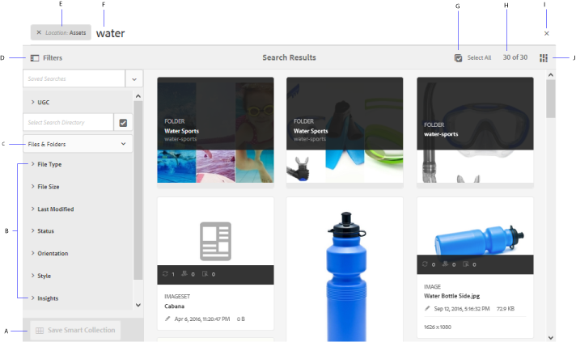

# 搜尋 [!DNL Adobe Experience Manager] 中的資產 {#search-assets-in-aem}

[!DNL Adobe Experience Manager Assets] 提供強大的資產探索方法，可協助您達到更高的內容速度。 您的團隊可運用現成可用的功能和自訂方法，提供順暢的智慧型搜尋體驗，縮短上市時間。 搜尋資產是數位資產管理系統使用的核心，無論是供創意人員進一步使用、供業務使用者和行銷人員強大管理資產，還是由DAM管理員管理。 簡單、進階和自訂搜尋，您可透過 [!DNL Assets] 使用者介面或其他應用程式和介面，有助於完成這些使用案例。

[!DNL Experience Manager Assets] 支援下列使用案例，本文說明這些使用案例的使用方式、概念、設定、限制和疑難排解。

| 搜尋資產 | 配置和管理搜索功能 | 使用搜索結果 |
|---|---|---|
| [基本搜尋](#searchbasics) | [搜索索引](#searchindex) | [排序結果](#sort) |
| [了解搜尋UI](#searchui) | [文字擷取](#extracttextupload) | [檢查資產的屬性和中繼資料](#checkinfo) |
| [搜尋建議](#searchsuggestions) | [必填中繼資料](#mandatorymetadata) | [下載](#download) |
| [了解搜尋結果和行為](#searchbehavior) | [修改搜尋刻面](#searchfacets) | [大量中繼資料更新](#metadata-updates) |
| [搜尋排名和提升](#searchrank) | [自訂述詞](#custompredicates) | [智慧型集合](#collections) |
| [高級搜索：篩選和搜尋範圍](#scope) |  | [了解並疑難排解非預期的結果](#unexpected-results) |
| [從其他解決方案和應用程式中搜尋](#search-assets-other-surfaces):<ul><li>[Adobe資產連結](#aal)</li><li>[Brand Portal](#brand-portal)</li><li>[Experience Manager案頭應用程式](#desktop-app)</li><li>[Adobe Stock影像](#adobe-stock)</li><li>[Dynamic Media資產](#search-dynamic-media-assets)</li></ul> |  |  |
| [資產選擇器](#asset-picker) |  |  |
| [限制](#limitations) 和 [提示](#tips) |  |  |
| [插圖範例](#samples) |  |  |

使用頂端的Omnisearch欄位來搜尋資產 [!DNL Experience Manager] 網頁介面。 前往 **[!UICONTROL 資產]** > **[!UICONTROL 檔案]** in [!DNL Experience Manager]，按一下  在頂端列中輸入搜尋關鍵字，然後選取 `Return`. 或者，使用關鍵字快速鍵 `/` （正斜線）以開啟「Omnisearch」欄位。 `Location:Assets` 已預先選取，以將搜尋限制在DAM資產。 [!DNL Experience Manager] 在您開始輸入搜尋關鍵字時提供建議。

使用 **[!UICONTROL 篩選器]** 面板來搜尋資產、資料夾、標籤和中繼資料。 您可以根據各種選項（述詞）來篩選搜尋結果，例如檔案類型、檔案大小、上次修改日期、資產狀態、前瞻分析資料和Adobe Stock授權。 您可以自訂「篩選器」面板，並使用 [搜尋面向](/help/assets/search-facets.md). 此 [!UICONTROL 檔案類型] 篩選 [!UICONTROL 篩選器] 面板具有混合狀態複選框。 因此，除非您選取所有巢狀謂語（或格式），否則會部分勾選第一級核取方塊。

[!DNL Experience Manager] 搜尋功能支援搜尋集合，以及搜尋集合內的資產。 請參閱 [搜尋集合](/help/assets/manage-collections.md).

## 了解搜尋介面 {#searchui}

請熟悉搜尋介面和可用動作。

*圖：了解 [!DNL Experience Manager Assets] 搜尋結果介面。*

**答：** 將搜尋儲存為智慧型集合。 **B.** 篩選或述詞以縮小搜尋結果。 **C.** 顯示檔案、資料夾或兩者。 **D.** 按一下「篩選器」以開啟或關閉左側邊欄。**E.** 搜尋位置為 DAM。**F.** Omnisearch欄位及使用者提供的搜尋關鍵字。 **G.** 選擇載入的搜索結果。 **H.** 顯示的搜索結果總數。 **我。** 關閉搜索。 **J.** 在卡片檢視和清單檢視之間切換。

### 動態搜尋Facet {#dynamicfacets}

您可以使用動態更新的搜尋Facet中預期搜尋結果數量，從搜尋結果頁面更快地找到所需資產。 預期的資產數量會在套用搜尋篩選前更新。 查看篩選條件的預期計數，有助於您快速且有效地導覽搜尋結果。

*圖：查看資產的約略數量，而不篩選搜尋Facet中的搜尋結果。*

## 在您輸入時搜尋建議 {#searchsuggestions}

當您開始輸入關鍵字時，Experience Manager會建議可能的搜尋關鍵字或片語。 建議是以Experience Manager中的資產為基礎。 Experience Manager為所有中繼資料欄位建立索引，以協助搜尋。 為了提供搜尋建議，系統會使用下列幾個中繼資料欄位的值。 若要提供搜尋建議，請考慮使用適當的關鍵字填入下列欄位：

* 資產標籤。 (將 `jcr:content/metadata/cq:tags`)
* 資產標題。 (將 `jcr:content/metadata/dc:title`)
* 資產說明。 (將 `jcr:content/metadata/dc:description`)
* JCR存放庫中的標題。 值可能會對應至資產標題。 (將 `jcr:content/jcr:title`)
* JCR存放庫中的說明。 值可能會對應至資產說明。 (將 `jcr:content/jcr:description`)

## 了解搜尋結果和行為 {#searchbehavior}

### 基本搜尋詞和結果 {#searchbasics}

您可以從OmniSearch欄位執行關鍵字搜尋。 關鍵字搜尋不區分大小寫，且是全文搜尋（涵蓋熱門中繼資料欄位）。 若使用了多個關鍵字， `AND` 是關鍵字之間的預設運算子。

結果會依關聯性排序，從最接近的相符項目開始。 對於多個關鍵字，更相關的結果是在其中繼資料中包含兩個詞語的資產。 在中繼資料中，顯示為智慧標籤的關鍵字的排名高於顯示在其他中繼資料欄位中的關鍵字。 [!DNL Experience Manager] 可賦予特定搜尋詞更高的權重。 此外， [提升排名](#searchrank) 特定搜尋詞的幾個目標資產。

為了快速找到相關資產，豐富的介面提供篩選、排序和選取機制。 您可以根據多個條件篩選結果，並查看針對各種篩選條件搜尋的資產數量。 或者，您也可以變更Omnisearch欄位中的查詢，以重新執行搜尋。 當您變更搜尋詞或篩選器時，其他篩選器會保留套用以保留搜尋的內容。

當結果為多個資產時， [!DNL Experience Manager] 在卡片檢視中顯示前100個，在清單檢視中顯示前200個。 當使用者捲動時，會載入更多資產。 這是為了改善效能。 觀看 [顯示的資產數](https://www.youtube.com/watch?v=LcrGPDLDf4o).

有時候，您可能會在搜尋結果中看到一些非預期的資產。 如需詳細資訊，請參閱 [意外結果](#unexpected-results).

[!DNL Experience Manager] 可以搜索許多檔案格式，而且可以自定義搜索篩選器以滿足您的業務要求。 請連絡您的管理員，了解哪些搜尋選項可供您的DAM存放庫使用，以及您的帳戶有哪些限制。

<!-- 
### Results with and without enhanced Smart Tags {#withsmarttags}

By default, [!DNL Experience Manager] search combines the search terms with an AND clause. For example, consider searching for keywords woman running. Only the assets with both woman and running keywords in the metadata appear in the search results by default. The same behavior is retained when special characters (periods, underscores, or dashes) are used with the keywords. The following search queries return the same results:

* `woman running`
* `woman.running`
* `woman-running`

However, the query `woman -running` returns assets without `running` in their metadata.
Using Smart Tags adds an extra `OR` clause to find any of the search terms as the applied smart tags. An asset tagged with either `woman` or `running` using Smart Tags also appear in such a search query. So the search results are a combination of,

* Assets with `woman` and `running` keywords in the metadata (default behavior).

* Assets smart tagged with either of the keywords (Smart Tags behavior).
-->

### 搜尋排名和提升 {#searchrank}

會先顯示符合中繼資料欄位中所有搜尋詞的搜尋結果，接著顯示符合智慧標籤中任何搜尋詞的搜尋結果。 在上述範例中，搜尋結果的顯示約略順序為：

1. 匹配的 `woman running` 在各種中繼資料欄位中。
1. 匹配的 `woman running` 在智慧標籤中。
1. 匹配的 `woman` 或 `running` 在智慧標籤中。

您可以改善特定資產的關鍵字相關性，以協助根據關鍵字提升搜尋。 換句話說，當您根據這些關鍵字進行搜尋時，您促銷特定關鍵字的影像會顯示在搜尋結果頂端。

1. 從 [!DNL Assets] 使用者介面，開啟資產的屬性頁面。 按一下 **[!UICONTROL 進階]** 按一下 **[!UICONTROL 新增]** 在 **[!UICONTROL Elevate搜索關鍵字]**.
1. 在 **[!UICONTROL Search Promote]** 框中，指定要增加影像搜索的關鍵字，然後按一下 **[!UICONTROL 新增]**. 您可以以相同方式指定多個關鍵字。
1. 按一下&#x200B;**[!UICONTROL 「儲存並關閉」]**。您為此關鍵字促銷的資產會顯示在最上層搜尋結果中。

您可以提升目標關鍵字搜尋結果中某些資產的排名，借此善加運用。 請參閱下方的範例影片。 如需詳細資訊，請參閱 [搜尋 [!DNL Experience Manager]](https://experienceleague.adobe.com/docs/experience-manager-learn/assets/search-and-discovery/search-boost.html).

>[!VIDEO](https://video.tv.adobe.com/v/16766/?quality=6)

*影片：了解搜尋結果的排名方式，以及如何影響排名。*

## 進階搜尋 {#scope}

[!DNL Experience Manager] 提供套用至所搜尋資產的各種方法，例如篩選器，可協助您更快找到所需資產。 以下說明一些常用的方法。 部分 [插圖範例](#samples) 共用。

**搜索檔案或資料夾**:在搜索結果中，可以查看檔案、資料夾或兩者。 從 **[!UICONTROL 篩選器]** ，您可以選取適當的選項。 請參閱 [搜尋介面](#searchui).

**在資料夾中搜尋資產**:您可以將搜尋限制在特定資料夾。 在 **[!UICONTROL 篩選器]** 面板，添加資料夾的路徑。 一次只能選取一個資料夾。

*圖：在「篩選器」面板中新增資料夾路徑，將搜尋結果限制為資料夾。*

### 尋找類似的影像 {#visualsearch}

若要尋找視覺上類似使用者選取之影像的影像，請從影像的卡片檢視或工具列按一下「尋找類似 **** 」選項。[!DNL Experience Manager]會顯示來自DAM儲存庫的智慧型標籤影像，這些影像類似於使用者選取的影像。

*圖：使用卡片檢視中的選項尋找類似的影像。*

### Adobe Stock影像 {#adobe-stock}

從 [!DNL Experience Manager] 用戶介面，用戶可搜索 [Adobe Stock資產](/help/assets/aem-assets-adobe-stock.md) 及授權所需資產。 新增 `Location: Adobe Stock` 的下界。 您也可以使用「篩選器」面板來尋找所有授權或未授權的資產，或使用Adobe Stock檔案號搜尋特定資產。

### Dynamic Media資產 {#dmassets}

您可以從&#x200B;**[!UICONTROL 「篩選器」]**&#x200B;面板中選取&#x200B;**[!UICONTROL 「動態媒體」]**>**[!UICONTROL 「集合」]**，以篩選動態媒體影像。這樣可以篩選並顯示影像集、旋轉木馬、混合媒體集和迴轉集等資產。

### 使用元資料欄位中的特定值進行GQL搜索 {#gql-search}

您可以根據中繼資料欄位的確切值來搜尋資產，例如標題、說明和建立者。 GQL全文搜索功能只會擷取其中繼資料值與您的搜索查詢完全相符的資產。 屬性的名稱（建立者、標題等）和值區分大小寫。

| 中繼資料欄位 | Facet值和使用狀況 |
|---|---|
| 標題 | 標題：John |
| 產生器 | 建立者：約翰 |
| 位置 | 位置：不適用 |
| 說明 | 說明：&quot;範例影像&quot; |
| 建立者工具 | 建立工具：&quot;Adobe Photoshop&quot; |
| 版權擁有者 | 版權人：&quot;Adobe Systems&quot; |
| 參與者 | 貢獻者：John |
| 使用條款 | 使用條款：「保留CopyRights」 |
| 建立日期 | 已建立：YYYY-MM-DDTHH |
| 到期日 | 過期時間： YYYY-MM-DDTHH |
| 準時 | ontime:YYYY-MM-DDTHH |
| 關閉時間 | offtime:YYYY-MM-DDTHH |
| 時間範圍（過期日期時間、offtime） | facet欄位：下界……上界限 |
| 路徑 | /content/dam/&lt;folder name=&quot;&quot;> |
| PDF 標題 | pdftitle:&quot;Adobe檔案&quot; |
| 主旨 | 主題：「培訓」 |
| 標記 | 標籤：&quot;Location And Travel&quot; |
| 類型 | 類型：&quot;image\png&quot; |
| 影像寬度 | width:lowerbound..上界限 |
| 影像高度 | height:lowerbound..上界限 |
| 人員 | person:John |

屬性 `path`, `limit`, `size`，和 `orderby` 無法結合使用 `OR` 運算子與任何其他屬性。

<!-- TBD: Where are the limit, size, orderby properties defined?
-->

使用者產生屬性的關鍵字是其屬性編輯器中的欄位標籤（以小寫顯示），並移除空格。

以下是複雜查詢的搜尋格式的一些範例：

* 若要顯示具有多個Facet欄位的所有資產(例如：title=John Doe and creator tool = Adobe Photoshop): `title:"John Doe" creatortool:Adobe*`
* 若要在Facet值不是單一字詞而是句子時顯示所有資產(例如：title=Scott Reynolds): `title:"Scott Reynolds"`
* 若要顯示具有單一屬性多個值的資產(例如：title=Scott Reynolds或John Doe): `title:"Scott Reynolds" OR "John Doe"`
* 若要顯示屬性值以特定字串開頭的資產(例如：標題是斯科特·雷諾茲): `title:Scott*`
* 若要顯示屬性值結尾為特定字串的資產(例如：標題是斯科特·雷諾茲): `title:*Reynolds`
* 若要顯示包含特定字串之屬性值的資產(例如：標題=巴塞爾會議室): `title:*Meeting*`
* 若要顯示包含特定字串且具有特定屬性值的資產(例如：在標題=John Doe的資產中搜尋字串Adobe): `*Adobe* title:"John Doe"`

## 從其他 [!DNL Experience Manager] 產品或介面 {#search-assets-other-surfaces}

[!DNL Adobe Experience Manager] 將DAM存放庫連線至其他各種 [!DNL Experience Manager] 提供更快速存取數位資產及簡化創意工作流程的解決方案。 任何資產探索都會從瀏覽或搜尋開始。 在不同的曲面和解決方案中，搜索行為基本保持不變。 有些搜尋方法會隨著目標對象、使用案例和使用者介面而改變， [!DNL Experience Manager] 解決方案。 以下連結會記錄個別解決方案的特定方法。 本文記錄了普遍適用的提示和行為。

### 從「Adobe資產連結」面板搜尋資產 {#aal}

創意Adobe專業人員現在可以透過Asset Link存取儲存在 [!DNL Experience Manager Assets]，而不需離開支援的Adobe Creative Cloud應用程式。 創意人員可使用 [!DNL Adobe Creative Cloud] 應用程式： [!DNL Adobe Photoshop], [!DNL Adobe Illustrator]，和 [!DNL Adobe InDesign]. 資產連結也可讓使用者以視覺上類似的結果搜尋。 視覺搜尋顯示結果由Adobe Sensei的機器學習演算法提供技術支援，並協助使用者尋找審美上類似的影像。 請參閱 [搜尋和瀏覽資產](https://helpx.adobe.com/tw/enterprise/using/manage-assets-using-adobe-asset-link.html#UseAdobeAssetLink) 使用Adobe資產連結。

### 在中搜尋資產 [!DNL Experience Manager] 案頭應用程式 {#desktop-app}

創意專業人員可使用案頭應用程式， [!DNL Experience Manager Assets] 可輕鬆搜尋，並可在其本機案頭(Win或Mac)上使用。 創意人員可以在Mac Finder或Windows Explorer中輕鬆顯示所需資產、在案頭應用程式中開啟並在本機變更 — 變更會儲存回 [!DNL Experience Manager] 在儲存庫中建立新版本。 應用程式支援使用一個或多個關鍵字進行基本搜索， `*` 和 `?` 萬用字元和 `AND` 運算元。 請參閱 [瀏覽、搜尋和預覽資產](https://experienceleague.adobe.com/docs/experience-manager-desktop-app/using/using.html#browse-search-preview-assets) 在案頭應用程式中。

### 搜尋 [!DNL Brand Portal] 中的資產 {#brand-portal}

業務線使用者和行銷人員使用Brand Portal，以有效且安全的方式與其延伸的內部團隊、合作夥伴和經銷商共用已核准的數位資產。 請參閱 [在Brand Portal上搜尋資產](https://experienceleague.adobe.com/docs/experience-manager-brand-portal/using/search-capabilities/brand-portal-searching.html).

### 搜尋 [!DNL Adobe Stock] 影像 {#adobe-stock1}

從 [!DNL Experience Manager] 使用者介面，使用者可以搜尋Adobe Stock資產，並授權所需的資產。 新增 `Location: Adobe Stock` 在Omnisearch欄位中。 您也可以使用 **[!UICONTROL 篩選器]** 面板，尋找所有授權或未授權的資產，或使用Adobe Stock檔案號搜尋特定資產。 請參閱 [管理 [!DNL Adobe Stock] 影像 [!DNL Experience Manager]](/help/assets/aem-assets-adobe-stock.md#usemanage).

### 搜尋 [!DNL Dynamic Media] 資產 {#search-dynamic-media-assets}

您可以從&#x200B;**[!UICONTROL 「篩選器」]**&#x200B;面板中選取&#x200B;**[!UICONTROL 「動態媒體」]**>**[!UICONTROL 「集合」]**，以篩選動態媒體影像。這樣可以篩選並顯示影像集、旋轉木馬、混合媒體集和迴轉集等資產。在製作網頁時，作者可在內容尋找工具中搜尋集合。集合的篩選器可從快顯功能表中取得。

### 編寫網頁時，在「內容尋找器」中搜尋資產 {#content-finder}

作者可以使用「內容尋找器」來搜尋DAM存放庫中的相關資產，以及在其建立的網頁中使用資產。 作者也可以使用連線資產功能來搜尋遠端上可用的資產 [!DNL Experience Manager] 部署。 然後，作者就可以在本機的網頁中使用這些資產 [!DNL Experience Manager] 部署。 請參閱 [使用遠端資產](/help/assets/use-assets-across-connected-assets-instances.md#use-remote-assets).

### 搜尋集合 {#collections}

[!DNL Experience Manager] 搜尋功能支援搜尋集合，以及搜尋集合內的資產。 請參閱 [搜尋集合](/help/assets/manage-collections.md).

## 資產選擇器 {#asset-picker}

資產選擇器(在舊版中稱為資產選擇器 [!DNL Adobe Experience Manager])可讓您以特殊方式搜尋、篩選和瀏覽DAM資產。 資產選擇器位於 `https://[aem_server]:[port]/aem/assetpicker.html`. 您可以使用資產選取器來擷取所選資產的中繼資料。 您可以使用支援的請求參數來啟動它，例如資產類型（影像、視訊、文字）和選取模式（單選或多選）。 這些參數會設定特定搜尋例項的資產選取器內容，並在整個選取項目中保持不變。

資產選擇器使用HTML5 `Window.postMessage` 訊息，將所選資產的資料傳送給收件者。 它只能在瀏覽模式下運作，且只能搭配Omnisearch結果頁面運作。

在URL中傳遞下列要求參數，以在特定內容中啟動資產選取器：

| 名稱 | 值 | 範例 | 用途 |
|---|---|---|---|
| 資源尾碼(B) | 在URL中作為資源尾碼的資料夾路徑： [https://localhost:4502/aem/assetpicker.html/&lt;folder_path>](https://localhost:4502/aem/assetpicker.html) | 若要啟動已選取特定資料夾的資產選取器，例如在資料夾中 `/content/dam/we-retail/en/activities` 選取，則URL應為： `https://localhost:4502/aem/assetpicker.html/content/dam/we-retail/en/activities?assettype=images` | 如果在啟動資產選取器時需要選取特定資料夾，請以資源尾碼的形式傳遞。 |
| `mode` | 單一，多個 | <ul><li>`https://localhost:4502/aem/assetpicker.html?mode=single`</li><li>`https://localhost:4502/aem/assetpicker.html?mode=multiple`</li></ul> | 在多個模式中，您可以使用資產選擇器同時選取數個資產。 |
| `dialog` | true,false | [https://localhost:4502/aem/assetpicker.html?dialog=true](https://localhost:4502/aem/assetpicker.html?dialog=true) | 使用這些參數，以Granite對話方塊的形式開啟資產選取器。 只有當您透過Granite路徑欄位啟動資產選取器，並將其設定為pickerSrc URL時，才適用此選項。 |
| `root` | &lt;folder_path> | `https://localhost:4502/aem/assetpicker.html?assettype=images&root=/content/dam/we-retail/en/activities` | 使用此選項可指定資產選擇器的根資料夾。 在此情況下，資產選擇器可讓您僅選取根資料夾下的子資產（直接/間接）。 |
| `viewmode` | 搜尋 |  | 若要在搜尋模式中啟動資產選取器，請使用 `assettype` 和 `mimetype` 參數。 |
| `assettype` | 影像、檔案、多媒體、檔案。 | <ul><li>`https://localhost:4502/aem/assetpicker.html?viewmode=search&assettype=images`</li><li> `https://localhost:4502/aem/assetpicker.html?viewmode=search&assettype=documents` </li><li> `https://localhost:4502/aem/assetpicker.html?viewmode=search&assettype=multimedia` </li><li> `https://localhost:4502/aem/assetpicker.html?viewmode=search&assettype=archives` </li></ul> | 使用選項，根據提供的值來篩選資產類型。 |
| `mimetype` | MIME類型(`/jcr:content/metadata/dc:format`)（也支援萬用字元）。 | <ul><li>`https://localhost:4502/aem/assetpicker.html?mimetype=image/png`</li><li>`https://localhost:4502/aem/assetpicker.html?mimetype=*png`</li><li>`https://localhost:4502/aem/assetpicker.html?mimetype=*presentation`</li><li>`https://localhost:4502/aem/assetpicker.html?mimetype=*presentation&mimetype=*png`</li></ul> | 使用它以根據MIME類型篩選資產。 |

若要存取資產選擇器介面，請前往 `https://[aem_server]:[port]/aem/assetpicker`. 導覽至所需的資料夾，然後選取一或多個資產。 或者，您也可以從Omnisearch方塊搜尋所需的資產，視需要套用篩選，然後選取它。

*圖：瀏覽並在資產選擇器中選取資產。*

## 限制 {#limitations}

中的搜尋功能 [!DNL Experience Manager Assets] 有下列限制：

* 請勿在搜尋查詢中輸入前導空格，否則搜尋無法運作。
* [!DNL Experience Manager] 在您從搜尋結果中選取資產的屬性，然後取消搜尋後，可繼續顯示搜尋詞。 <!-- (CQ-4273540) -->
* 搜索資料夾或檔案和資料夾時，無法對任何參數排序搜索結果。
* 如果您選取 `Return` 不用在Omnisearch列里輸入， [!DNL Experience Manager] 返回僅檔案而不是資料夾的清單。 如果您不使用關鍵字而專門搜索資料夾， [!DNL Experience Manager] 不會傳回任何結果。
* 您可以對資料夾執行全文搜索。 指定搜尋詞以讓搜尋運作。

視覺搜尋或相似性搜尋有下列限制：

* 視覺化搜尋在大型存放庫中的效果最佳。 雖然獲得良好結果所需的影像數量並非最少，但與一些影像的匹配質量不如來自大型儲存庫的匹配質量好。
* 不能更改模型或列車 [!DNL Experience Manager] 尋找類似的影像。 例如，新增或移除智慧標籤至一些資產並不會變更模型。 會從視覺上類似的搜尋結果中排除資產。

在下列情況下，搜尋功能可能會有效能限制：

* 與顯示搜尋結果的清單檢視相比，卡片檢視的載入時間更快。

## 搜尋提示 {#tips}

* 在監控資產的審閱狀態時，請使用適當的選項查找已批准的資產或等待批准的資產。
* 使用前瞻分析述詞，根據從各種創意應用程式取得的使用統計資料來搜尋支援的資產。 使用量資料會依資產出現類別的使用量分數、曝光數、點按和媒體管道分組。
* 使用 **[!UICONTROL 全選]** 核取方塊以選取搜尋的資產。 [!DNL Experience Manager] 最初在卡片檢視中顯示100個資產，在清單檢視中顯示200個資產。 當您捲動搜尋結果時，會載入更多資產。 您可以選取比載入資產更多的資產。 選取的資產計數會顯示在搜尋結果頁面的右上角。 您可以對選取項目執行操作，例如下載選取的資產、大量更新選取資產的中繼資料屬性，或將選取的資產新增至集合。 當選取的資產數量超過顯示數量時，會對所有選取的資產套用動作，或對話方塊顯示套用的資產數量。 若要對未載入的資產套用動作，請確定已明確選取所有資產。
* 若要搜尋不包含必要中繼資料的資產，請參閱 [必填中繼資料](#mandatorymetadata).
* 搜尋會使用所有中繼資料欄位。 一般搜尋（例如搜尋12）通常會傳回許多結果。 為獲得更好的結果，請使用雙引號（非單引號），或確保數字與單詞連續，不帶特殊字元(例如 `shoe12`)。
* 全文搜尋支援運算子，例如 `-` 和 `^`. 若要將這些字母作為字串文本進行搜索，請以雙引號將搜索表達式括住。 例如，使用 `"Notebook - Beauty"` 而非 `Notebook - Beauty`.
* 如果搜索結果太多，請限制 [搜索範圍](#scope) 選取要的資產。 當您想到如何更妥善地尋找所需資產（例如特定檔案類型、特定位置、特定中繼資料等）時，效果最佳。

* **標籤**:標籤可協助您對可以更有效率地瀏覽和搜尋的資產進行分類。 標籤有助於將適當的分類法傳播給其他使用者和工作流程。 [!DNL Experience Manager] 提供使用Adobe Sensei的人工智慧服務來自動標籤資產的方法，讓您更能透過使用方式和訓練來標籤資產。 搜尋資產時，會加入智慧標籤。 可與內建的搜尋功能搭配使用。 請參閱 [搜尋行為](#searchbehavior). 要優化搜索結果的顯示順序，您可以 [提升搜尋排名](#searchrank) 中指定的資產。

* **索引**:搜尋結果中只會傳回已索引的中繼資料和資產。 為獲得更好的覆蓋範圍和效能，請確保建立正確的索引並遵循最佳做法。 請參閱 [索引](#searchindex).

## 說明搜尋的一些範例 {#samples}

請在關鍵字周圍使用雙引號，以尋找包含使用者指定之確切順序之確切字句的資產。

*圖：有引號和沒有引號的搜尋行為。*

**使用星號通配符搜索**:要擴大搜索範圍，請在搜索詞之前或之後使用星號來匹配任意數量的字元。 例如，搜尋沒有星號的執行不會傳回包含字詞任何變異（包括在中繼資料中）的資產。 星號可代替任意數量的字元。 例如，

* `run` 傳回完全執行關鍵字的資產
* `run*` 傳回資產 `running`, `run`, `runaway`等。
* `*run` 傳回資產 `outrun`, `rerun`等。
* `*run*` 傳回所有可能的組合。

*圖：以範例說明在資產搜尋中使用星號萬用字元的方式。*

**使用問號通配符搜索**:要擴大搜索範圍，請使用一個或多個「？」 字元數來比對字元數。 例如，在下圖中，

* `run???` 查詢與任何資產不符。

* `run????` 查詢與單詞匹配 `running` 後面四個字元 `run`.

* `??run` 查詢與單詞匹配 `rerun` 前面兩個字元 `run`.

*圖：以範例說明在資產搜尋中使用問號萬用字元的方式。*

**排除關鍵字**:使用破折號來搜尋不含關鍵字的資產。 例如， `running -shoe` 查詢返回包含的資產 `running`，但不是 `shoe`. 同樣， `camp -night` 查詢返回包含的資產 `camp` 但 `night`. 查詢 `camp-night` 傳回同時包含兩者的資產 `camp` 和 `night`.

*圖：使用破折號來搜尋不含已排除關鍵字的資產。*

<!--
## Configuration and administration tasks related to search functionality {#configadmin}

### Search index configurations {#searchindex}

Asset discovery relies on indexing of DAM contents, including the metadata. Faster and accurate asset discovery relies on optimized indexing and appropriate configurations. See [indexing](/help/operations/indexing.md).
-->

<!--
### Visual or similarity search {#configvisualsearch}

Visual search uses Smart Tags. After configuring smart tagging functionality, follow these steps.

1. In [!DNL Experience Manager] CRXDE, in `/oak:index/lucene` node, add the following properties and values and save the changes.

    * `costPerEntry` property of type `Double` with the value `10`.

    * `costPerExecution` property of type `Double` with the value `2`.

    * `refresh` property of type `Boolean` with the value `true`.

   This configuration allows searches from the appropriate index.

1. To create Lucene index, in CRXDE, at `/oak:index/damAssetLucene/indexRules/dam:Asset/properties`, create node named `imageFeatures` of type `nt-unstructured`. In `imageFeatures` node,

    * Add `name` property of type `String` with the value `jcr:content/metadata/imageFeatures/haystack0`.

    * Add `nodeScopeIndex` property of type `Boolean` with the value of `true`.

    * Add `propertyIndex` property of type `Boolean` with the value of `true`.

    * Add `useInSimilarity` property of type `Boolean` with the value `true`.

   Save the changes.

1. Access `/oak:index/damAssetLucene/indexRules/dam:Asset/properties/predictedTags` and add `similarityTags` property of type `Boolean` with the value of `true`.
1. Apply Smart Tags to the assets in your [!DNL Experience Manager] repository. See [how to configure smart tags](https://experienceleague.adobe.com/docs/experience-manager-learn/assets/configuring/tagging.html#configuring).
1. In CRXDE, in `/oak-index/damAssetLucene` node, set the `reindex` property to `true`. Save the changes.
1. (Optional) If you have customized search form then copy the `/libs/settings/dam/search/facets/assets/jcr%3Acontent/items/similaritysearch` node to `/conf/global/settings/dam/search/facets/assets/jcr:content/items`. Save the changes.

For related information, see [understand smart tags in Experience Manager](https://experienceleague.adobe.com/docs/experience-manager-learn/assets/metadata/image-smart-tags.html) and [how to manage smart tags](/help/assets/smart-tags.md).
-->

<!--
### Mandatory metadata {#mandatorymetadata}

Business users, administrators, or DAM librarians can define some metadata as mandatory metadata that is a must for the business processes to work. For various reasons, some assets may be missing this metadata, such as legacy assets or assets migrated in bulk. Assets with missing or invalid metadata are detected and reported based on the indexed metadata property. To configure it, see [mandatory metadata](/help/assets/metadata-schemas.md#defining-mandatory-metadata).

### Modify search facets {#searchfacets}

To improve the speed of discovery, [!DNL Experience Manager Assets] offers search facets using which you can filter the search results. The Filters panel includes a few standard facets by default. Administrators can customize the Filters panel to modify the default facets using the in-built predicates. [!DNL Experience Manager] provides a good collection of in-built predicates and an editor to customize the facets. See [search facets](/help/assets/search-facets.md).

### Extract text when uploading assets {#extracttextupload}

You can configure [!DNL Experience Manager] to extract the text from the assets when users upload assets, such as PSD or PDF files. [!DNL Experience Manager] indexes the extracted text and helps users search these assets based on the extracted text. See [upload assets](/help/assets/manage-digital-assets.md#uploading-assets).
-->

### 篩選搜尋結果的自訂述詞 {#custompredicates}

述詞可用來建立Facet。 管理員可以使用預先設定的述詞來自訂「篩選器」面板中的搜尋刻面。 這些述詞可使用覆蓋來自訂。 請參閱 [建立自訂述詞](/help/assets/search-facets.md).

您可以根據下列一或多個屬性來搜尋數位資產。 套用至其中某些屬性的篩選器預設可用，而其他某些篩選器則可自訂建立以套用至其他屬性。

| 搜尋欄位 | 搜索屬性值 |
|-----------------|----------------------------------------------------------------------------------------------------------------------------------------|
| MIME 類型 | 影像、檔案、多媒體、封存或其他。 |
| 上次修改時間 | 小時、日、周、月或年。 |
| 檔案大小 | 小、中或大。 |
| 發佈狀態 | 已發佈或未發佈。 |
| 批准狀態 | 已核准或已拒絕。 |
| 方向 | 水準、垂直或方形。 |
| 樣式 | 顏色或黑白。 |
| 視訊高度 | 指定為最小值和最大值。 值只會儲存在視訊轉譯的中繼資料中。 |
| 視訊寬度 | 指定為最小值和最大值。 值只會儲存在視訊轉譯的中繼資料中。 |
| 視訊格式 | DVI、Flash、MPEG4、MPEG、OGG Theora、QuickTime、Windows Media。 值會儲存在來源視訊和任何轉譯的中繼資料中。 |
| 視訊轉碼器 | x264。 值只會儲存在視訊轉譯的中繼資料中。 |
| 視訊位元速率 | 指定為最小值和最大值。 值只會儲存在視訊轉譯的中繼資料中。 |
| 音訊轉碼器 | Libvorbis,Lame MP3,AAC編碼。 值只會儲存在視訊轉譯的中繼資料中。 |
| 音訊位元速率 | 指定為最小值和最大值。 值只會儲存在視訊轉譯的中繼資料中。 |

## 使用資產搜尋結果 {#aftersearch}

您可以對搜尋的資產執行下列動作 [!DNL Experience Manager]:

* 檢視中繼資料屬性和其他資訊。
* 下載一或多個資產。
* 使用案頭動作在案頭應用程式中開啟這些資產。
* 建立智慧型集合。

### 對搜索結果排序 {#sort}

排序搜尋結果以更快找到所需資產。 您可以在清單檢視中排序搜尋結果，且僅限於選取 **[[!UICONTROL 檔案]](#searchui)** 從 **[!UICONTROL 篩選器]** 中。 [!DNL Assets]使用伺服器端排序功能，快速排序資料夾或搜尋查詢結果中的所有資產 (無論多少)。伺服器端排序比用戶端排序提供更快速且更精確的結果。

在清單檢視中，您可以排序搜尋結果，就像排序任何資料夾中的資產一樣。 排序適用於這些列 — 名稱、標題、狀態、Dimension、大小、評分、使用情況、建立的日期、修改的日期、發佈的日期、工作流和簽出。

如需排序功能的限制，請參閱 [限制](#limitations).

### 檢查資產的詳細資訊 {#checkinfo}

您可以從搜尋結果頁面檢查所搜尋資產的詳細資訊。

若要查看資產的所有中繼資料，請選取資產並按一下 **[!UICONTROL 屬性]** 的上界。

若要檢查資產或資產版本記錄的註解，請按一下資產以開啟大型預覽。在左側導軌中開啟時間軸，並選取「 **[!UICONTROL 注釋]** 」或「 **[!UICONTROL 版本」]**。您也可以依時間順序將時間軸活動 (例如注釋或版本) 排序。

*圖：排序搜尋資產的時間軸項目。*

### 下載搜尋的資產 {#download}

您可以像從資料夾下載一般資產一樣，下載搜尋的資產及其轉譯。 從搜尋結果中選取一或多個資產，然後按一下 **[!UICONTROL 下載]** 的上界。

### 大量更新元資料屬性 {#metadata-updates}

您可以大量更新多個資產的通用中繼資料欄位。 從搜尋結果中選取一或多個資產。 按一下 **[!UICONTROL 屬性]** 從工具列，並視需要更新中繼資料。 按一下 **[!UICONTROL 儲存並關閉]** 時才能使用。 更新欄位中先前存在的中繼資料會遭到覆寫。

若為單一資料夾或集合中可用的資產，可更輕鬆 [大量更新中繼資料](/help/assets/manage-metadata.md#manage-assets-metadata) 不使用搜尋功能。 對於可跨資料夾使用或符合通用條件的資產，透過搜尋大量更新中繼資料會更快。

### 智慧型集合 {#smart-collections}

集合是一組有序的資產，可包含來自不同位置的資產，因為集合僅包含這些資產的參考。 集合分為下列兩種類型：

* 資產、資料夾和其他集合的靜態參考清單。
* 根據搜尋條件填入集合中資產的動態清單（智慧型集合）。

您可以根據搜尋准則建立智慧型系列。從「濾鏡 **[!UICONTROL 器]** 」面板中，選 **[!UICONTROL 擇「檔案]** 」並單 **[!UICONTROL 擊「保存智慧集」]**。請參閱 [管理系列](/help/assets/manage-collections.md)。

## 意外的搜索結果和問題 {#unexpected-results}

<!--
**Partially related or unrelated search results**: Experience Manager may display seemingly partially related or unrelated assets, alongside the desired assets in the search results. If you enable Enhanced Smart Tags, the search behavior changes slightly. See how it changes [after smart tagging](#withsmarttags).
-->

| 錯誤、問題、症狀 | 可能的原因 | 可能的問題修正或了解 |
|---|---|---|
| 搜尋遺失中繼資料的資產時，結果不正確。 | 搜尋遺失必要中繼資料的資產時， [!DNL Experience Manager] 可能會顯示某些資產具有有效的中繼資料。 結果基於索引元資料屬性。 | 更新中繼資料後，必須重新索引以反映資產中繼資料的正確狀態。 請參閱 [必填中繼資料](metadata-schemas.md#define-mandatory-metadata). |
| 搜索結果太多。 | 廣泛搜尋參數。 | 請考慮限制 [搜索範圍](#scope). 使用智慧標籤可能會提供比預期更多的搜尋結果。 請參閱 [智慧標籤的搜尋行為](#withsmarttags). |
| 無關或部分相關的搜索結果。 | 搜尋行為會隨著智慧標籤而變更。 | 了解 [智慧標籤後的搜尋變更](#withsmarttags). |
| 沒有資產的自動完成建議。 | 新上傳的資產尚未建立索引。 當您開始在Omnisearch列中輸入搜尋關鍵字時，中繼資料不會立即作為建議使用。 | [!DNL Experience Manager] 會等到逾時期間到期（預設為一小時），才執行背景工作，為所有新上傳或更新的資產建立中繼資料索引，然後將中繼資料新增至建議清單。 |
| 沒有搜尋結果. | <ul><li>符合查詢的資產不存在。 </li><li> 搜尋查詢前新增空白字元。 </li><li> 不支援的元資料欄位包含您搜索的關鍵字。</li><li> 在資產的離職期間進行搜尋。 </li></ul> | <ul><li>使用不同的關鍵字進行搜尋。 或者，使用智慧標籤或相似性搜尋來改善搜尋結果。 </li><li>[已知限制](#limitations).</li><li>搜尋時不會考慮所有中繼資料欄位。 請參閱 [範圍](#scope).</li><li>稍後搜尋或修改所需資產的準時和非時間。</li></ul> |
| 搜尋篩選器或述詞無法使用。 | <ul><li>未配置搜索篩選器。</li><li>無法供您登入。</li><li>（不太可能）您使用的部署上沒有自訂搜尋選項。</li></ul> | <ul><li>請與管理員聯繫，以檢查搜索自定義項是否可用。</li><li>請聯絡管理員，以檢查您的帳戶是否具有使用自訂的權限/權限。</li><li>請聯絡管理員，並檢查 [!DNL Assets] 正在使用的部署。</li></ul> |
| 搜尋視覺上類似的影像時，缺少預期的影像。 | <ul><li>影像無法在 [!DNL Experience Manager].</li><li>影像未編列索引。 通常是在最近上傳時。</li><li>影像沒有智慧標籤。</li></ul> | <ul><li>將影像新增至 [!DNL Assets].</li><li>請與管理員聯繫，以重新索引儲存庫。 同時，請確定您使用的是適當的索引。</li><li>請連絡您的管理員以智慧標籤相關資產。</li></ul> |
| 搜尋視覺上類似的影像時，會顯示不相關的影像。 | 視覺搜尋行為。 | [!DNL Experience Manager] 盡可能顯示多個潛在相關資產。 相關度較低的影像（如果有）會新增至結果，但搜尋排名會較低。 當您向下捲動搜尋結果時，相符項目的品質和所搜尋資產的相關性會降低。 |
| 選取搜尋結果並對其執行作業時，系統不會對所有搜尋的資產執行作業。 | 此 [!UICONTROL 全選] 選項只會在卡片檢視中選取前100個搜尋結果，在清單檢視中選取前200個搜尋結果。 |  |

>[!MORELIKETHIS]
>
>* [[!DNL Experience Manager] 搜尋實作指南](https://experienceleague.adobe.com/docs/experience-manager-learn/sites/developing/search-tutorial-develop.html)
>* [進階設定可提升搜尋結果](https://experienceleague.adobe.com/docs/experience-manager-learn/assets/search-and-discovery/search-boost.html)
>* [配置智慧翻譯搜索](https://experienceleague.adobe.com/docs/experience-manager-learn/assets/translation/smart-translation-search-technical-video-setup.html)

